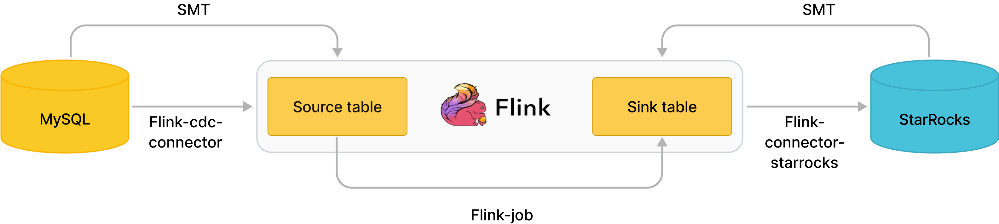

# ツールを使用したデータロード

StarRocks とそのエコシステムパートナーは、StarRocks を外部データベースとシームレスに統合するための以下のツールを提供しています。

## [SMT](../integrations/loading_tools/SMT.md)

SMT (StarRocks Migration Tool) は、StarRocks が提供するデータ移行ツールで、複雑なデータロードパイプラインを最適化するよう設計されています。ソースデータベース（MySQL、Oracle、PostgreSQL など） ---> Flink ---> 目的の StarRocks クラスター。主な機能は以下の通りです：

- StarRocks でのテーブル作成を簡素化：外部データベースとターゲットの StarRocks クラスターの情報に基づいて、StarRocks でテーブルを作成するためのステートメントを生成します。
- データパイプラインでのフルまたは増分データ同期プロセスを簡素化：Flink の SQL クライアントで実行可能な SQL ステートメントを生成し、データを同期するための Flink ジョブを提出します。

以下のフローチャートは、ソースデータベース MySQL から Flink を経由して StarRocks にデータをロードするプロセスを示しています。

## [DataX](../integrations/loading_tools/DataX-starrocks-writer.md)

DataX はオフラインデータ同期のためのツールで、Alibaba によってオープンソース化されています。DataX は、リレーショナルデータベース（MySQL、Oracle など）、HDFS、Hive を含むさまざまな異種データソース間でデータを同期できます。DataX は、DataX がサポートするデータソースから StarRocks へのデータ同期を行うための StarRocks Writer プラグインを提供します。

## [CloudCanal](../integrations/loading_tools/CloudCanal.md)

CloudCanal Community Edition は、[ClouGence Co., Ltd](https://www.cloudcanalx.com/) によって公開された無料のデータ移行および同期プラットフォームで、スキーマ移行、フルデータ移行、検証、修正、リアルタイム増分同期を統合しています。CloudCanal のビジュアルインターフェースで直接 StarRocks をデータソースとして追加し、ソースデータベース（例：MySQL、Oracle、PostgreSQL）から StarRocks へのデータを自動的に移行または同期するタスクを作成できます。

## [Kettle connector](https://github.com/StarRocks/starrocks-connector-for-kettle)

Kettle は、視覚的なグラフィカルインターフェースを持つ ETL（抽出、変換、ロード）ツールで、ユーザーがコンポーネントをドラッグしてパラメータを設定することでデータ処理ワークフローを構築できます。この直感的な方法により、データ処理とロードのプロセスが大幅に簡素化され、ユーザーはより便利にデータを扱うことができます。さらに、Kettle は豊富なコンポーネントライブラリを提供しており、ユーザーはニーズに応じて適切なコンポーネントを選択し、さまざまな複雑なデータ処理タスクを実行できます。

StarRocks は、Kettle と統合するための Kettle Connector を提供しています。Kettle の強力なデータ処理および変換機能と、StarRocks の高性能なデータストレージおよび分析能力を組み合わせることで、より柔軟で効率的なデータ処理ワークフローを実現できます。