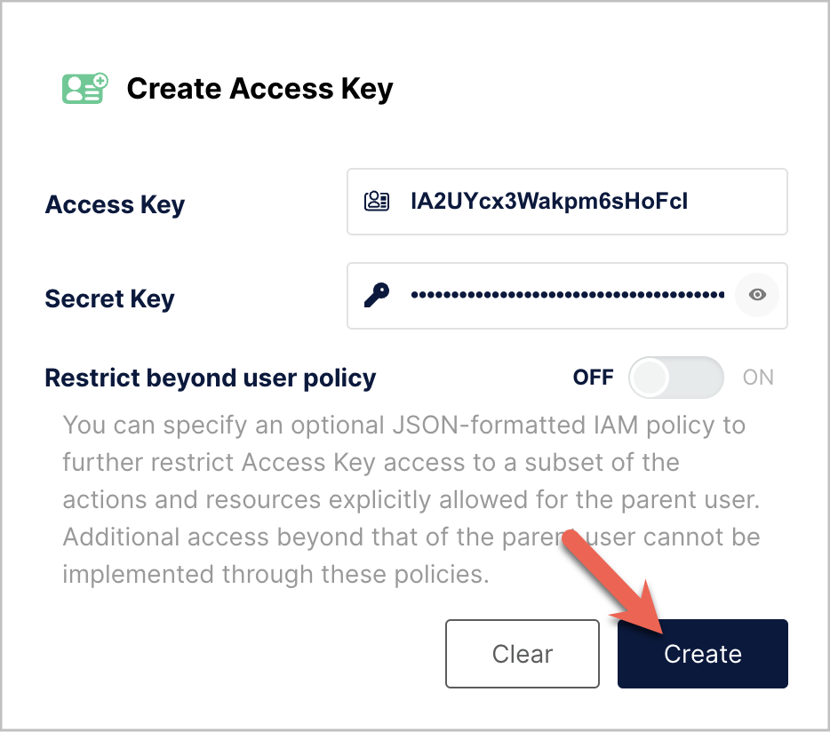

# MinIO からのデータロード

import InsertPrivNote from '../_assets/commonMarkdown/insertPrivNote.mdx'

StarRocks は、MinIO からデータをロードするために以下のオプションを提供しています。

- [INSERT](../sql-reference/sql-statements/loading_unloading/INSERT.md)+[`FILES()`](../sql-reference/sql-functions/table-functions/files.md) を使用した同期ロード
- [Broker Load](../sql-reference/sql-statements/loading_unloading/BROKER_LOAD.md) を使用した非同期ロード

これらの各オプションにはそれぞれの利点があり、以下のセクションで詳しく説明します。

ほとんどの場合、使用が簡単な INSERT+`FILES()` メソッドをお勧めします。

ただし、INSERT+`FILES()` メソッドは現在、Parquet、ORC、および CSV ファイル形式のみをサポートしています。そのため、JSON などの他のファイル形式のデータをロードする必要がある場合や、[データロード中に DELETE などのデータ変更を行う](../loading/Load_to_Primary_Key_tables.md)必要がある場合は、Broker Load を利用できます。

## 始める前に

### ソースデータの準備

StarRocks にロードしたいソースデータが MinIO バケットに正しく保存されていることを確認してください。また、データとデータベースの場所を考慮することもお勧めします。バケットと StarRocks クラスターが同じ地域にある場合、データ転送コストは大幅に低くなります。

このトピックでは、サンプルデータセットを提供します。`curl` を使用してダウンロードできます。

```bash
curl -O https://starrocks-examples.s3.amazonaws.com/user_behavior_ten_million_rows.parquet
```

Parquet ファイルを MinIO システムにロードし、バケット名をメモしておいてください。このガイドの例では、バケット名として `/starrocks` を使用しています。

### 権限の確認

<InsertPrivNote />

### 接続情報の収集

簡単に言うと、MinIO アクセスキー認証を使用するには、次の情報を収集する必要があります。

- データを格納するバケット
- バケット内の特定のオブジェクトにアクセスする場合のオブジェクトキー（オブジェクト名）
- MinIO エンドポイント
- アクセス認証情報として使用されるアクセスキーとシークレットキー



## INSERT+FILES() の使用

このメソッドは v3.1 以降で利用可能で、現在 Parquet、ORC、および CSV（v3.3.0 以降）ファイル形式のみをサポートしています。

### INSERT+FILES() の利点

[`FILES()`](../sql-reference/sql-functions/table-functions/files.md) は、指定したパス関連のプロパティに基づいてクラウドストレージに保存されたファイルを読み取り、ファイル内のデータのテーブルスキーマを推測し、データをデータ行として返すことができます。

`FILES()` を使用すると、次のことが可能です。

- [SELECT](../sql-reference/sql-statements/table_bucket_part_index/SELECT.md) を使用して MinIO からデータを直接クエリする。
- [CREATE TABLE AS SELECT](../sql-reference/sql-statements/table_bucket_part_index/CREATE_TABLE_AS_SELECT.md) (CTAS) を使用してテーブルを作成し、ロードする。
- 既存のテーブルにデータをロードするために [INSERT](../sql-reference/sql-statements/loading_unloading/INSERT.md) を使用する。

### 典型的な例

#### SELECT を使用して MinIO から直接クエリする

SELECT+`FILES()` を使用して MinIO から直接クエリすることで、テーブルを作成する前にデータセットの内容をプレビューできます。例えば：

- データを保存せずにデータセットをプレビューする。
- 最小値と最大値をクエリし、使用するデータ型を決定する。
- `NULL` 値をチェックする。

次の例は、以前に MinIO システムに追加したサンプルデータセットをクエリします。

:::tip

コマンドのハイライトされた部分には、変更が必要な設定が含まれています。

- MinIO システムに合わせて `endpoint` と `path` を設定します。
- MinIO システムが SSL を使用している場合は、`enable_ssl` を `true` に設定します。
- MinIO アクセスキーとシークレットキーを `AAA` と `BBB` に置き換えます。

:::

```sql
SELECT * FROM FILES
(
    -- highlight-start
    "aws.s3.endpoint" = "http://minio:9000",
    "path" = "s3://starrocks/user_behavior_ten_million_rows.parquet",
    "aws.s3.enable_ssl" = "false",
    "aws.s3.access_key" = "AAAAAAAAAAAAAAAAAAAA",
    "aws.s3.secret_key" = "BBBBBBBBBBBBBBBBBBBBBBBBBBBBBBBBBBBBBBBB",
    -- highlight-end
    "format" = "parquet",
    "aws.s3.use_aws_sdk_default_behavior" = "false",
    "aws.s3.use_instance_profile" = "false",
    "aws.s3.enable_path_style_access" = "true"
)
LIMIT 3;
```

システムは次のクエリ結果を返します。

```plaintext
+--------+---------+------------+--------------+---------------------+
| UserID | ItemID  | CategoryID | BehaviorType | Timestamp           |
+--------+---------+------------+--------------+---------------------+
| 543711 |  829192 |    2355072 | pv           | 2017-11-27 08:22:37 |
| 543711 | 2056618 |    3645362 | pv           | 2017-11-27 10:16:46 |
| 543711 | 1165492 |    3645362 | pv           | 2017-11-27 10:17:00 |
+--------+---------+------------+--------------+---------------------+
3 rows in set (0.41 sec)
```

:::info

上記で返された列名は Parquet ファイルによって提供されています。

:::

#### CTAS を使用してテーブルを作成しロードする

これは前の例の続きです。前のクエリは CREATE TABLE AS SELECT (CTAS) でラップされ、スキーマ推測を使用してテーブル作成を自動化します。これは、StarRocks がテーブルスキーマを推測し、希望するテーブルを作成し、データをテーブルにロードすることを意味します。Parquet ファイルを使用する場合、Parquet 形式には列名が含まれているため、`FILES()` テーブル関数を使用する際にテーブルを作成するための列名と型は必要ありません。

:::note

スキーマ推測を使用する場合の CREATE TABLE の構文では、レプリカの数を設定することはできませんので、テーブルを作成する前に設定してください。以下の例は、単一レプリカのシステム用です。

```SQL
ADMIN SET FRONTEND CONFIG ('default_replication_num' = '1');
```

:::

データベースを作成し、そこに切り替えます。

```SQL
CREATE DATABASE IF NOT EXISTS mydatabase;
USE mydatabase;
```

CTAS を使用してテーブルを作成し、以前に MinIO システムに追加したサンプルデータセットのデータをロードします。

:::tip

コマンドのハイライトされた部分には、変更が必要な設定が含まれています。

- MinIO システムに合わせて `endpoint` と `path` を設定します。
- MinIO システムが SSL を使用している場合は、`enable_ssl` を `true` に設定します。
- MinIO アクセスキーとシークレットキーを `AAA` と `BBB` に置き換えます。

:::

```sql
CREATE TABLE user_behavior_inferred AS
SELECT * FROM FILES
(
    -- highlight-start
    "aws.s3.endpoint" = "http://minio:9000",
    "path" = "s3://starrocks/user_behavior_ten_million_rows.parquet",
    "aws.s3.enable_ssl" = "false",
    "aws.s3.access_key" = "AAAAAAAAAAAAAAAAAAAA",
    "aws.s3.secret_key" = "BBBBBBBBBBBBBBBBBBBBBBBBBBBBBBBBBBBBBBBB",
    -- highlight-end
    "format" = "parquet",
    "aws.s3.use_aws_sdk_default_behavior" = "false",
    "aws.s3.use_instance_profile" = "false",
    "aws.s3.enable_path_style_access" = "true"
);
```

```plaintext
Query OK, 10000000 rows affected (3.17 sec)
{'label':'insert_a5da3ff5-9ee4-11ee-90b0-02420a060004', 'status':'VISIBLE', 'txnId':'17'}
```

テーブルを作成した後、[DESCRIBE](../sql-reference/sql-statements/table_bucket_part_index/DESCRIBE.md) を使用してそのスキーマを表示できます。

```SQL
DESCRIBE user_behavior_inferred;
```

システムは次のクエリ結果を返します。

```Plaintext
+--------------+------------------+------+-------+---------+-------+
| Field        | Type             | Null | Key   | Default | Extra |
+--------------+------------------+------+-------+---------+-------+
| UserID       | bigint           | YES  | true  | NULL    |       |
| ItemID       | bigint           | YES  | true  | NULL    |       |
| CategoryID   | bigint           | YES  | true  | NULL    |       |
| BehaviorType | varchar(1048576) | YES  | false | NULL    |       |
| Timestamp    | varchar(1048576) | YES  | false | NULL    |       |
+--------------+------------------+------+-------+---------+-------+
```

テーブルをクエリして、データがロードされたことを確認します。例：

```SQL
SELECT * from user_behavior_inferred LIMIT 3;
```

次のクエリ結果が返され、データが正常にロードされたことを示しています。

```Plaintext
+--------+--------+------------+--------------+---------------------+
| UserID | ItemID | CategoryID | BehaviorType | Timestamp           |
+--------+--------+------------+--------------+---------------------+
|     58 | 158350 |    2355072 | pv           | 2017-11-27 13:06:51 |
|     58 | 158590 |    3194735 | pv           | 2017-11-27 02:21:04 |
|     58 | 215073 |    3002561 | pv           | 2017-11-30 10:55:42 |
+--------+--------+------------+--------------+---------------------+
```

#### INSERT を使用して既存のテーブルにロードする

挿入するテーブルをカスタマイズしたい場合があります。例えば：

- 列のデータ型、NULL 設定、またはデフォルト値
- キーの種類と列
- データのパーティショニングとバケッティング

:::tip

最も効率的なテーブル構造を作成するには、データの使用方法と列の内容についての知識が必要です。このトピックではテーブル設計については扱いません。テーブル設計についての情報は [Table types](../table_design/StarRocks_table_design.md) を参照してください。

:::

この例では、テーブルがどのようにクエリされるか、および Parquet ファイル内のデータに関する知識に基づいてテーブルを作成しています。Parquet ファイル内のデータに関する知識は、MinIO でファイルを直接クエリすることで得られます。

- MinIO でのデータセットのクエリにより、`Timestamp` 列が `datetime` データ型に一致するデータを含んでいることが示されたため、以下の DDL で列型が指定されています。
- MinIO でデータをクエリすることで、データセットに `NULL` 値がないことがわかるため、DDL ではどの列も NULL 設定されていません。
- 予想されるクエリタイプに基づいて、ソートキーとバケッティング列は `UserID` 列に設定されています。このデータに対するユースケースは異なるかもしれないので、ソートキーとして `ItemID` を `UserID` と一緒にまたは代わりに使用することを決定するかもしれません。

データベースを作成し、そこに切り替えます。

```SQL
CREATE DATABASE IF NOT EXISTS mydatabase;
USE mydatabase;
```

手動でテーブルを作成します（MinIO からロードしたい Parquet ファイルと同じスキーマを持つことをお勧めします）。

```SQL
CREATE TABLE user_behavior_declared
(
    UserID int(11) NOT NULL,
    ItemID int(11) NOT NULL,
    CategoryID int(11) NOT NULL,
    BehaviorType varchar(65533) NOT NULL,
    Timestamp datetime NOT NULL
)
ENGINE = OLAP 
DUPLICATE KEY(UserID)
DISTRIBUTED BY HASH(UserID)
PROPERTIES
(
    'replication_num' = '1'
);
```

スキーマを表示して、`FILES()` テーブル関数によって生成された推測スキーマと比較できるようにします。

```sql
DESCRIBE user_behavior_declared;
```

```plaintext
+--------------+----------------+------+-------+---------+-------+
| Field        | Type           | Null | Key   | Default | Extra |
+--------------+----------------+------+-------+---------+-------+
| UserID       | int            | NO   | true  | NULL    |       |
| ItemID       | int            | NO   | false | NULL    |       |
| CategoryID   | int            | NO   | false | NULL    |       |
| BehaviorType | varchar(65533) | NO   | false | NULL    |       |
| Timestamp    | datetime       | NO   | false | NULL    |       |
+--------------+----------------+------+-------+---------+-------+
5 rows in set (0.00 sec)
```

:::tip

先ほど作成したスキーマを、`FILES()` テーブル関数を使用して以前に推測されたスキーマと比較してください。以下を確認します。

- データ型
- NULL 設定
- キーフィールド

ターゲットテーブルのスキーマをよりよく制御し、クエリパフォーマンスを向上させるために、運用環境では手動でテーブルスキーマを指定することをお勧めします。タイムスタンプフィールドに `datetime` データ型を使用することは、`varchar` を使用するよりも効率的です。

:::

テーブルを作成した後、INSERT INTO SELECT FROM FILES() を使用してロードできます。

:::tip

コマンドのハイライトされた部分には、変更が必要な設定が含まれています。

- MinIO システムに合わせて `endpoint` と `path` を設定します。
- MinIO システムが SSL を使用している場合は、`enable_ssl` を `true` に設定します。
- MinIO アクセスキーとシークレットキーを `AAA` と `BBB` に置き換えます。

:::

```SQL
INSERT INTO user_behavior_declared
SELECT * FROM FILES
(
    -- highlight-start
    "aws.s3.endpoint" = "http://minio:9000",
    "path" = "s3://starrocks/user_behavior_ten_million_rows.parquet",
    "aws.s3.enable_ssl" = "false",
    "aws.s3.access_key" = "AAAAAAAAAAAAAAAAAAAA",
    "aws.s3.secret_key" = "BBBBBBBBBBBBBBBBBBBBBBBBBBBBBBBBBBBBBBBB",
    -- highlight-end
    "format" = "parquet",
    "aws.s3.use_aws_sdk_default_behavior" = "false",
    "aws.s3.use_instance_profile" = "false",
    "aws.s3.enable_path_style_access" = "true"
);
```

ロードが完了したら、テーブルをクエリしてデータがロードされたことを確認します。例：

```SQL
SELECT * from user_behavior_declared LIMIT 3;
```

次のクエリ結果が返され、データが正常にロードされたことを示しています。

```Plaintext
+--------+---------+------------+--------------+---------------------+
| UserID | ItemID  | CategoryID | BehaviorType | Timestamp           |
+--------+---------+------------+--------------+---------------------+
|     58 | 4309692 |    1165503 | pv           | 2017-11-25 14:06:52 |
|     58 |  181489 |    1165503 | pv           | 2017-11-25 14:07:22 |
|     58 | 3722956 |    1165503 | pv           | 2017-11-25 14:09:28 |
+--------+---------+------------+--------------+---------------------+
```

#### ロード進捗の確認

StarRocks Information Schema の [`loads`](../sql-reference/information_schema/loads.md) ビューから INSERT ジョブの進捗をクエリできます。この機能は v3.1 以降でサポートされています。例：

```SQL
SELECT * FROM information_schema.loads ORDER BY JOB_ID DESC;
```

フィールドが提供される `loads` ビューについての情報は、[`loads`](../sql-reference/information_schema/loads.md) を参照してください。

複数のロードジョブを送信した場合は、ジョブに関連付けられた `LABEL` でフィルタリングできます。例：

```SQL
SELECT * FROM information_schema.loads WHERE LABEL = 'insert_e3b882f5-7eb3-11ee-ae77-00163e267b60' \G
*************************** 1. row ***************************
              JOB_ID: 10243
               LABEL: insert_e3b882f5-7eb3-11ee-ae77-00163e267b60
       DATABASE_NAME: mydatabase
               STATE: FINISHED
            PROGRESS: ETL:100%; LOAD:100%
                TYPE: INSERT
            PRIORITY: NORMAL
           SCAN_ROWS: 10000000
       FILTERED_ROWS: 0
     UNSELECTED_ROWS: 0
           SINK_ROWS: 10000000
            ETL_INFO:
           TASK_INFO: resource:N/A; timeout(s):300; max_filter_ratio:0.0
         CREATE_TIME: 2023-11-09 11:56:01
      ETL_START_TIME: 2023-11-09 11:56:01
     ETL_FINISH_TIME: 2023-11-09 11:56:01
     LOAD_START_TIME: 2023-11-09 11:56:01
    LOAD_FINISH_TIME: 2023-11-09 11:56:44
         JOB_DETAILS: {"All backends":{"e3b882f5-7eb3-11ee-ae77-00163e267b60":[10142]},"FileNumber":0,"FileSize":0,"InternalTableLoadBytes":311710786,"InternalTableLoadRows":10000000,"ScanBytes":581574034,"ScanRows":10000000,"TaskNumber":1,"Unfinished backends":{"e3b882f5-7eb3-11ee-ae77-00163e267b60":[]}}
           ERROR_MSG: NULL
        TRACKING_URL: NULL
        TRACKING_SQL: NULL
REJECTED_RECORD_PATH: NULL
```

:::tip

INSERT は同期コマンドです。INSERT ジョブがまだ実行中の場合、その実行ステータスを確認するには別のセッションを開く必要があります。

:::

### ディスク上のテーブルサイズを比較する

このクエリは、推測されたスキーマを持つテーブルと、スキーマが宣言されたテーブルを比較します。推測されたスキーマには NULL 許可の列とタイムスタンプの varchar が含まれているため、データ長が大きくなります。

```sql
SELECT TABLE_NAME,
       TABLE_ROWS,
       AVG_ROW_LENGTH,
       DATA_LENGTH
FROM information_schema.tables
WHERE TABLE_NAME like 'user_behavior%'\G
```

```plaintext
*************************** 1. row ***************************
    TABLE_NAME: user_behavior_declared
    TABLE_ROWS: 10000000
AVG_ROW_LENGTH: 10
   DATA_LENGTH: 102562516
*************************** 2. row ***************************
    TABLE_NAME: user_behavior_inferred
    TABLE_ROWS: 10000000
AVG_ROW_LENGTH: 17
   DATA_LENGTH: 176803880
2 rows in set (0.04 sec)
```

## Broker Load の使用

非同期の Broker Load プロセスは、MinIO への接続を処理し、データを取得し、StarRocks にデータを格納します。

このメソッドは次のファイル形式をサポートしています。

- Parquet
- ORC
- CSV
- JSON（v3.2.3 以降でサポート）

### Broker Load の利点

- Broker Load はバックグラウンドで実行され、クライアントはジョブが続行するために接続を維持する必要がありません。
- Broker Load は長時間実行されるジョブに適しており、デフォルトのタイムアウトは 4 時間です。
- Parquet および ORC ファイル形式に加えて、Broker Load は CSV ファイル形式と JSON ファイル形式（JSON ファイル形式は v3.2.3 以降でサポート）をサポートしています。

### データフロー


1. ユーザーがロードジョブを作成します。
2. フロントエンド (FE) がクエリプランを作成し、プランをバックエンドノード (BEs) またはコンピュートノード (CNs) に配布します。
3. BEs または CNs がソースからデータを取得し、StarRocks にデータをロードします。

### 典型的な例

データベースを作成し、MinIO システムに以前にロードしたサンプルデータセットを取得するロードプロセスを開始します。

#### データベースとテーブルの作成

データベースを作成し、そこに切り替えます。

```SQL
CREATE DATABASE IF NOT EXISTS mydatabase;
USE mydatabase;
```

手動でテーブルを作成します（MinIO からロードしたい Parquet ファイルと同じスキーマを持つことをお勧めします）。

```SQL
CREATE TABLE user_behavior
(
    UserID int(11) NOT NULL,
    ItemID int(11) NOT NULL,
    CategoryID int(11) NOT NULL,
    BehaviorType varchar(65533) NOT NULL,
    Timestamp datetime NOT NULL
)
ENGINE = OLAP 
DUPLICATE KEY(UserID)
DISTRIBUTED BY HASH(UserID)
PROPERTIES
(
    'replication_num' = '1'
);
```

#### Broker Load の開始

次のコマンドを実行して、サンプルデータセット `user_behavior_ten_million_rows.parquet` から `user_behavior` テーブルにデータをロードする Broker Load ジョブを開始します。

:::tip

コマンドのハイライトされた部分には、変更が必要な設定が含まれています。

- MinIO システムに合わせて `endpoint` と `DATA INFILE` を設定します。
- MinIO システムが SSL を使用している場合は、`enable_ssl` を `true` に設定します。
- MinIO アクセスキーとシークレットキーを `AAA` と `BBB` に置き換えます。

:::

```sql
LOAD LABEL UserBehavior
(
    -- highlight-start
    DATA INFILE("s3://starrocks/user_behavior_ten_million_rows.parquet")
    -- highlight-end
    INTO TABLE user_behavior
 )
 WITH BROKER
 (
    -- highlight-start
    "aws.s3.endpoint" = "http://minio:9000",
    "aws.s3.enable_ssl" = "false",
    "aws.s3.access_key" = "AAAAAAAAAAAAAAAAAAAA",
    "aws.s3.secret_key" = "BBBBBBBBBBBBBBBBBBBBBBBBBBBBBBBBBBBBBBBB",
    -- highlight-end
    "aws.s3.use_aws_sdk_default_behavior" = "false",
    "aws.s3.use_instance_profile" = "false",
    "aws.s3.enable_path_style_access" = "true"
 )
PROPERTIES
(
    "timeout" = "72000"
);
```

このジョブには 4 つの主要なセクションがあります。

- `LABEL`: ロードジョブの状態をクエリする際に使用される文字列。
- `LOAD` 宣言: ソース URI、ソースデータ形式、および宛先テーブル名。
- `BROKER`: ソースの接続詳細。
- `PROPERTIES`: タイムアウト値およびロードジョブに適用するその他のプロパティ。

詳細な構文とパラメータの説明については、[BROKER LOAD](../sql-reference/sql-statements/loading_unloading/BROKER_LOAD.md) を参照してください。

#### ロード進捗の確認

StarRocks Information Schema の [`loads`](../sql-reference/information_schema/loads.md) ビューから Broker Load ジョブの進捗をクエリできます。この機能は v3.1 以降でサポートされています。

```SQL
SELECT * FROM information_schema.loads;
```

フィールドが提供される `loads` ビューについての情報は、[`loads`](../sql-reference/information_schema/loads.md) を参照してください。

複数のロードジョブを送信した場合は、ジョブに関連付けられた `LABEL` でフィルタリングできます。例：

```sql
SELECT * FROM information_schema.loads
WHERE LABEL = 'UserBehavior'\G
```

```plaintext
*************************** 1. row ***************************
              JOB_ID: 10176
               LABEL: userbehavior
       DATABASE_NAME: mydatabase
               STATE: FINISHED
            PROGRESS: ETL:100%; LOAD:100%
                TYPE: BROKER
            PRIORITY: NORMAL
           SCAN_ROWS: 10000000
       FILTERED_ROWS: 0
     UNSELECTED_ROWS: 0
           SINK_ROWS: 10000000
            ETL_INFO:
           TASK_INFO: resource:N/A; timeout(s):72000; max_filter_ratio:0.0
         CREATE_TIME: 2023-12-19 23:02:41
      ETL_START_TIME: 2023-12-19 23:02:44
     ETL_FINISH_TIME: 2023-12-19 23:02:44
     LOAD_START_TIME: 2023-12-19 23:02:44
    LOAD_FINISH_TIME: 2023-12-19 23:02:46
         JOB_DETAILS: {"All backends":{"4aeec563-a91e-4c1e-b169-977b660950d1":[10004]},"FileNumber":1,"FileSize":132251298,"InternalTableLoadBytes":311710786,"InternalTableLoadRows":10000000,"ScanBytes":132251298,"ScanRows":10000000,"TaskNumber":1,"Unfinished backends":{"4aeec563-a91e-4c1e-b169-977b660950d1":[]}}
           ERROR_MSG: NULL
        TRACKING_URL: NULL
        TRACKING_SQL: NULL
REJECTED_RECORD_PATH: NULL
1 row in set (0.02 sec)
```

ロードジョブが終了したことを確認した後、宛先テーブルのサブセットをチェックしてデータが正常にロードされたかどうかを確認できます。例：

```SQL
SELECT * from user_behavior LIMIT 3;
```

次のクエリ結果が返され、データが正常にロードされたことを示しています。

```Plaintext
+--------+---------+------------+--------------+---------------------+
| UserID | ItemID  | CategoryID | BehaviorType | Timestamp           |
+--------+---------+------------+--------------+---------------------+
|    142 | 2869980 |    2939262 | pv           | 2017-11-25 03:43:22 |
|    142 | 2522236 |    1669167 | pv           | 2017-11-25 15:14:12 |
|    142 | 3031639 |    3607361 | pv           | 2017-11-25 15:19:25 |
+--------+---------+------------+--------------+---------------------+
```