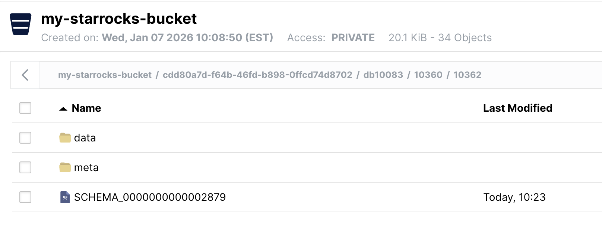

# Separate storage and compute

import DDL from '../_assets/quick-start/_DDL.mdx'
import Clients from '../_assets/quick-start/_clientsCompose.mdx'
import SQL from '../_assets/quick-start/_SQL.mdx'
import Curl from '../_assets/quick-start/_curl.mdx'

ストレージとコンピュートを分離したシステムでは、データは Amazon S3、Google Cloud Storage、Azure Blob Storage、MinIO などの S3 互換ストレージのような低コストで信頼性の高いリモートストレージシステムに保存されます。ホットデータはローカルにキャッシュされ、キャッシュがヒットすると、クエリパフォーマンスはストレージとコンピュートが結合されたアーキテクチャと同等になります。コンピュートノード (CN) は、数秒以内にオンデマンドで追加または削除できます。このアーキテクチャは、ストレージコストを削減し、リソースの分離を改善し、弾力性とスケーラビリティを提供します。

このチュートリアルでは以下をカバーします：

- Docker コンテナで StarRocks を実行する
- MinIO をオブジェクトストレージとして使用する
- StarRocks を共有データ用に設定する
- 2 つの公開データセットをロードする
- SELECT と JOIN を使用してデータを分析する
- 基本的なデータ変換 (ETL の **T**)

使用するデータは、NYC OpenData と NOAA の National Centers for Environmental Information によって提供されています。

これらのデータセットは非常に大きいため、このチュートリアルは StarRocks を使った作業に慣れるためのものであり、過去 120 年分のデータをロードすることはありません。Docker イメージを実行し、このデータを Docker に 4 GB の RAM を割り当てたマシンでロードできます。より大規模でフォールトトレラントなスケーラブルなデプロイメントについては、他のドキュメントを用意しており、後で提供します。

このドキュメントには多くの情報が含まれており、最初にステップバイステップの内容が提示され、最後に技術的な詳細が記載されています。これは以下の目的を順に達成するためです：

1. 読者が共有データデプロイメントでデータをロードし、そのデータを分析できるようにする。
2. 共有データデプロイメントの設定詳細を提供する。
3. ロード中のデータ変換の基本を説明する。

---

## 前提条件

### Docker

- [Docker](https://docs.docker.com/engine/install/)
- Docker に割り当てられた 4 GB の RAM
- Docker に割り当てられた 10 GB の空きディスクスペース

### SQL クライアント

Docker 環境で提供される SQL クライアントを使用するか、システム上のクライアントを使用できます。多くの MySQL 互換クライアントが動作し、このガイドでは DBeaver と MySQL Workbench の設定をカバーしています。

### curl

`curl` は StarRocks にデータロードジョブを発行し、データセットをダウンロードするために使用されます。OS のプロンプトで `curl` または `curl.exe` を実行して、インストールされているか確認してください。curl がインストールされていない場合は、[こちらから取得してください](https://curl.se/dlwiz/?type=bin)。

### `/etc/hosts`

このガイドで使用されるインジェスト方法は Stream Load です。Stream Load は FE サービスに接続してインジェストジョブを開始します。その後、FE はジョブをバックエンドノード、つまりこのガイドでは CN に割り当てます。インジェストジョブが CN に接続するためには、CN の名前がオペレーティングシステムに認識されている必要があります。`/etc/hosts` に次の行を追加してください：

```bash
127.0.0.1 starrocks-cn
```

---

## 用語

### FE

フロントエンドノードは、メタデータ管理、クライアント接続管理、クエリプランニング、クエリスケジューリングを担当します。各 FE はメモリ内にメタデータの完全なコピーを保存および維持し、FEs 間でのサービスの無差別性を保証します。

### CN

コンピュートノードは、共有データデプロイメントでクエリプランを実行する役割を担っています。

### BE

バックエンドノードは、共有なしデプロイメントでデータストレージとクエリプランの実行の両方を担当します。

:::note
このガイドでは BEs を使用しませんが、BEs と CNs の違いを理解するためにこの情報を含めています。
:::

---

## ラボファイルのダウンロード

ダウンロードするファイルは 3 つあります：

- StarRocks と MinIO 環境をデプロイする Docker Compose ファイル
- ニューヨーク市のクラッシュデータ
- 気象データ

このガイドでは、GNU Affero General Public License の下で提供される S3 互換のオブジェクトストレージである MinIO を使用します。

### ラボファイルを保存するディレクトリを作成します：

```bash
mkdir quickstart
cd quickstart
```

### Docker Compose ファイルをダウンロード

```bash
curl -O https://raw.githubusercontent.com/StarRocks/demo/master/documentation-samples/quickstart/docker-compose.yml
```

### データをダウンロード

次の 2 つのデータセットをダウンロードします：

#### ニューヨーク市のクラッシュデータ

```bash
curl -O https://raw.githubusercontent.com/StarRocks/demo/master/documentation-samples/quickstart/datasets/NYPD_Crash_Data.csv
```

#### 気象データ

```bash
curl -O https://raw.githubusercontent.com/StarRocks/demo/master/documentation-samples/quickstart/datasets/72505394728.csv
```

---

## StarRocks と MinIO のデプロイ

```bash
docker compose up --detach --wait --wait-timeout 120
```

FE、CN、および MinIO サービスが正常になるまで約 30 秒かかります。`quickstart-minio_mc-1` コンテナは `Waiting` のステータスを示し、終了コードも表示されます。終了コードが `0` の場合は成功を示します。

```bash
[+] Running 4/5
 ✔ Network quickstart_default       Created    0.0s
 ✔ Container minio                  Healthy    6.8s
 ✔ Container starrocks-fe           Healthy    29.3s
 ⠼ Container quickstart-minio_mc-1  Waiting    29.3s
 ✔ Container starrocks-cn           Healthy    29.2s
container quickstart-minio_mc-1 exited (0)
```

---

## MinIO のクレデンシャルを確認

StarRocks で MinIO をオブジェクトストレージとして使用するには、StarRocks に MinIO アクセスキーが必要です。アクセスキーは Docker サービスの起動時に生成されました。StarRocks が MinIO に接続する方法をよりよく理解するために、キーが存在することを確認してください。

### MinIO Web UI を開く

http://localhost:9001/access-keys にアクセスします。ユーザー名とパスワードは Docker compose ファイルに指定されており、`miniouser` と `miniopassword` です。1 つのアクセスキーがあることが確認できます。キーは `AAAAAAAAAAAAAAAAAAAA` で、MinIO コンソールではシークレットは表示されませんが、Docker compose ファイルには `BBBBBBBBBBBBBBBBBBBBBBBBBBBBBBBBBBBBBBBB` と記載されています：


:::tip
MinIO Web UI にアクセスキーが表示されていない場合は、`minio_mc` サービスのログを確認してください：

```bash
docker compose logs minio_mc
```

`minio_mc` ポッドを再実行してみてください：

```bash
docker compose run minio_mc
```
:::

---

## SQL クライアント

<Clients />

---

## StarRocks の共有データ用設定

この時点で StarRocks が実行されており、MinIO も実行されています。MinIO アクセスキーは StarRocks と Minio を接続するために使用されます。StarRocks が起動すると、MinIO との接続が確立され、MinIO にデフォルトのストレージボリュームが作成されます。

これは MinIO を使用するためにデフォルトのストレージボリュームを設定するために使用される設定です（これも Docker compose ファイルにあります）。設定はこのガイドの最後で詳しく説明されますが、今は `aws_s3_access_key` が MinIO コンソールで見た文字列に設定されていることと、`run_mode` が `shared_data` に設定されていることに注意してください：

```plaintext
#highlight-start
# enable shared data, set storage type, set endpoint
run_mode = shared_data
#highlight-end
cloud_native_storage_type = S3
aws_s3_endpoint = minio:9000

# set the path in MinIO
aws_s3_path = starrocks

#highlight-start
# credentials for MinIO object read/write
aws_s3_access_key = AAAAAAAAAAAAAAAAAAAA
aws_s3_secret_key = BBBBBBBBBBBBBBBBBBBBBBBBBBBBBBBBBBBBBBBB
#highlight-end
aws_s3_use_instance_profile = false
aws_s3_use_aws_sdk_default_behavior = false

# Set this to false if you do not want default
# storage created in the object storage using
# the details provided above
enable_load_volume_from_conf = true
```

### SQL クライアントで StarRocks に接続

:::tip

`docker-compose.yml` ファイルを含むディレクトリからこのコマンドを実行してください。

mysql CLI 以外のクライアントを使用している場合は、今すぐ開いてください。
:::

```sql
docker compose exec starrocks-fe \
mysql -P9030 -h127.0.0.1 -uroot --prompt="StarRocks > "
```

#### ストレージボリュームを確認

```sql
SHOW STORAGE VOLUMES;
```

```plaintext
+------------------------+
| Storage Volume         |
+------------------------+
| builtin_storage_volume |
+------------------------+
1 row in set (0.00 sec)
```

```sql
DESC STORAGE VOLUME builtin_storage_volume\G
```

:::tip
このドキュメントの一部の SQL および StarRocks ドキュメントの多くは、セミコロンの代わりに `\G` で終わります。`mysql` CLI では、`mysql` CLI がクエリ結果を縦に表示するようにします。

多くの SQL クライアントは縦のフォーマット出力を解釈しないため、`\G` を `;` に置き換える必要があります。
:::

```plaintext
*************************** 1. row ***************************
     Name: builtin_storage_volume
     Type: S3
IsDefault: true
#highlight-start
 Location: s3://starrocks
   Params: {"aws.s3.access_key":"******","aws.s3.secret_key":"******","aws.s3.endpoint":"minio:9000","aws.s3.region":"","aws.s3.use_instance_profile":"false","aws.s3.use_aws_sdk_default_behavior":"false"}
#highlight-end
  Enabled: true
  Comment:
1 row in set (0.03 sec)
```

パラメータが設定と一致していることを確認してください。

:::note
フォルダ `builtin_storage_volume` は、データがバケットに書き込まれるまで MinIO のオブジェクトリストには表示されません。
:::

---

## テーブルを作成する

<DDL />

---

## 2 つのデータセットをロードする

StarRocks にデータをロードする方法は多数あります。このチュートリアルでは、最も簡単な方法は curl と StarRocks Stream Load を使用することです。

:::tip

データセットをダウンロードしたディレクトリからこれらの curl コマンドを実行してください。

パスワードの入力を求められます。おそらく MySQL の `root` ユーザーにパスワードを割り当てていないので、Enter キーを押してください。

:::

`curl` コマンドは複雑に見えますが、チュートリアルの最後で詳しく説明されています。今は、コマンドを実行してデータを分析するための SQL を実行し、最後にデータロードの詳細を読むことをお勧めします。

### ニューヨーク市の衝突データ - クラッシュ

```bash
curl --location-trusted -u root             \
    -T ./NYPD_Crash_Data.csv                \
    -H "label:crashdata-0"                  \
    -H "column_separator:,"                 \
    -H "skip_header:1"                      \
    -H "enclose:\""                         \
    -H "max_filter_ratio:1"                 \
    -H "columns:tmp_CRASH_DATE, tmp_CRASH_TIME, CRASH_DATE=str_to_date(concat_ws(' ', tmp_CRASH_DATE, tmp_CRASH_TIME), '%m/%d/%Y %H:%i'),BOROUGH,ZIP_CODE,LATITUDE,LONGITUDE,LOCATION,ON_STREET_NAME,CROSS_STREET_NAME,OFF_STREET_NAME,NUMBER_OF_PERSONS_INJURED,NUMBER_OF_PERSONS_KILLED,NUMBER_OF_PEDESTRIANS_INJURED,NUMBER_OF_PEDESTRIANS_KILLED,NUMBER_OF_CYCLIST_INJURED,NUMBER_OF_CYCLIST_KILLED,NUMBER_OF_MOTORIST_INJURED,NUMBER_OF_MOTORIST_KILLED,CONTRIBUTING_FACTOR_VEHICLE_1,CONTRIBUTING_FACTOR_VEHICLE_2,CONTRIBUTING_FACTOR_VEHICLE_3,CONTRIBUTING_FACTOR_VEHICLE_4,CONTRIBUTING_FACTOR_VEHICLE_5,COLLISION_ID,VEHICLE_TYPE_CODE_1,VEHICLE_TYPE_CODE_2,VEHICLE_TYPE_CODE_3,VEHICLE_TYPE_CODE_4,VEHICLE_TYPE_CODE_5" \
    -XPUT http://localhost:8030/api/quickstart/crashdata/_stream_load
```

上記のコマンドの出力です。最初のハイライトされたセクションは、期待される結果（OK と 1 行を除くすべての行が挿入されたこと）を示しています。1 行は、正しい列数を含んでいないためフィルタリングされました。

```bash
Enter host password for user 'root':
{
    "TxnId": 2,
    "Label": "crashdata-0",
    "Status": "Success",
    # highlight-start
    "Message": "OK",
    "NumberTotalRows": 423726,
    "NumberLoadedRows": 423725,
    # highlight-end
    "NumberFilteredRows": 1,
    "NumberUnselectedRows": 0,
    "LoadBytes": 96227746,
    "LoadTimeMs": 1013,
    "BeginTxnTimeMs": 21,
    "StreamLoadPlanTimeMs": 63,
    "ReadDataTimeMs": 563,
    "WriteDataTimeMs": 870,
    "CommitAndPublishTimeMs": 57,
    # highlight-start
    "ErrorURL": "http://starrocks-cn:8040/api/_load_error_log?file=error_log_da41dd88276a7bfc_739087c94262ae9f"
    # highlight-end
}%
```

エラーが発生した場合、出力にはエラーメッセージを確認するための URL が提供されます。エラーメッセージには、Stream Load ジョブが割り当てられたバックエンドノード（`starrocks-cn`）も含まれています。`/etc/hosts` ファイルに `starrocks-cn` のエントリを追加したため、そこに移動してエラーメッセージを読むことができます。

このチュートリアルの開発中に見られた内容の要約を展開します：

<details>

<summary>ブラウザでエラーメッセージを読む</summary>

```bash
Error: Value count does not match column count. Expect 29, but got 32.

Column delimiter: 44,Row delimiter: 10.. Row: 09/06/2015,14:15,,,40.6722269,-74.0110059,"(40.6722269, -74.0110059)",,,"R/O 1 BEARD ST. ( IKEA'S 
09/14/2015,5:30,BRONX,10473,40.814551,-73.8490955,"(40.814551, -73.8490955)",TORRY AVENUE                    ,NORTON AVENUE                   ,,0,0,0,0,0,0,0,0,Driver Inattention/Distraction,Unspecified,,,,3297457,PASSENGER VEHICLE,PASSENGER VEHICLE,,,
```

</details>

### 気象データ

クラッシュデータをロードしたのと同じ方法で気象データセットをロードします。

```bash
curl --location-trusted -u root             \
    -T ./72505394728.csv                    \
    -H "label:weather-0"                    \
    -H "column_separator:,"                 \
    -H "skip_header:1"                      \
    -H "enclose:\""                         \
    -H "max_filter_ratio:1"                 \
    -H "columns: STATION, DATE, LATITUDE, LONGITUDE, ELEVATION, NAME, REPORT_TYPE, SOURCE, HourlyAltimeterSetting, HourlyDewPointTemperature, HourlyDryBulbTemperature, HourlyPrecipitation, HourlyPresentWeatherType, HourlyPressureChange, HourlyPressureTendency, HourlyRelativeHumidity, HourlySkyConditions, HourlySeaLevelPressure, HourlyStationPressure, HourlyVisibility, HourlyWetBulbTemperature, HourlyWindDirection, HourlyWindGustSpeed, HourlyWindSpeed, Sunrise, Sunset, DailyAverageDewPointTemperature, DailyAverageDryBulbTemperature, DailyAverageRelativeHumidity, DailyAverageSeaLevelPressure, DailyAverageStationPressure, DailyAverageWetBulbTemperature, DailyAverageWindSpeed, DailyCoolingDegreeDays, DailyDepartureFromNormalAverageTemperature, DailyHeatingDegreeDays, DailyMaximumDryBulbTemperature, DailyMinimumDryBulbTemperature, DailyPeakWindDirection, DailyPeakWindSpeed, DailyPrecipitation, DailySnowDepth, DailySnowfall, DailySustainedWindDirection, DailySustainedWindSpeed, DailyWeather, MonthlyAverageRH, MonthlyDaysWithGT001Precip, MonthlyDaysWithGT010Precip, MonthlyDaysWithGT32Temp, MonthlyDaysWithGT90Temp, MonthlyDaysWithLT0Temp, MonthlyDaysWithLT32Temp, MonthlyDepartureFromNormalAverageTemperature, MonthlyDepartureFromNormalCoolingDegreeDays, MonthlyDepartureFromNormalHeatingDegreeDays, MonthlyDepartureFromNormalMaximumTemperature, MonthlyDepartureFromNormalMinimumTemperature, MonthlyDepartureFromNormalPrecipitation, MonthlyDewpointTemperature, MonthlyGreatestPrecip, MonthlyGreatestPrecipDate, MonthlyGreatestSnowDepth, MonthlyGreatestSnowDepthDate, MonthlyGreatestSnowfall, MonthlyGreatestSnowfallDate, MonthlyMaxSeaLevelPressureValue, MonthlyMaxSeaLevelPressureValueDate, MonthlyMaxSeaLevelPressureValueTime, MonthlyMaximumTemperature, MonthlyMeanTemperature, MonthlyMinSeaLevelPressureValue, MonthlyMinSeaLevelPressureValueDate, MonthlyMinSeaLevelPressureValueTime, MonthlyMinimumTemperature, MonthlySeaLevelPressure, MonthlyStationPressure, MonthlyTotalLiquidPrecipitation, MonthlyTotalSnowfall, MonthlyWetBulb, AWND, CDSD, CLDD, DSNW, HDSD, HTDD, NormalsCoolingDegreeDay, NormalsHeatingDegreeDay, ShortDurationEndDate005, ShortDurationEndDate010, ShortDurationEndDate015, ShortDurationEndDate020, ShortDurationEndDate030, ShortDurationEndDate045, ShortDurationEndDate060, ShortDurationEndDate080, ShortDurationEndDate100, ShortDurationEndDate120, ShortDurationEndDate150, ShortDurationEndDate180, ShortDurationPrecipitationValue005, ShortDurationPrecipitationValue010, ShortDurationPrecipitationValue015, ShortDurationPrecipitationValue020, ShortDurationPrecipitationValue030, ShortDurationPrecipitationValue045, ShortDurationPrecipitationValue060, ShortDurationPrecipitationValue080, ShortDurationPrecipitationValue100, ShortDurationPrecipitationValue120, ShortDurationPrecipitationValue150, ShortDurationPrecipitationValue180, REM, BackupDirection, BackupDistance, BackupDistanceUnit, BackupElements, BackupElevation, BackupEquipment, BackupLatitude, BackupLongitude, BackupName, WindEquipmentChangeDate" \
    -XPUT http://localhost:8030/api/quickstart/weatherdata/_stream_load
```

---

## MinIO にデータが保存されていることを確認

MinIO を開き、[http://localhost:9001/browser/starrocks/](http://localhost:9001/browser/starrocks/) にアクセスして、`starrocks/shared/` の各ディレクトリに `data`、`metadata`、`schema` エントリがあることを確認します。

:::tip
`starrocks/shared/` 以下のフォルダ名は、データをロードするときに生成されます。`shared` の下に 1 つのディレクトリが表示され、その下にさらに 2 つのディレクトリが表示されます。それぞれのディレクトリ内にデータ、メタデータ、およびスキーマエントリがあります。


:::

---

## いくつかの質問に答える

<SQL />

---

## 共有データ用の StarRocks の設定

StarRocks を共有データで使用する経験を積んだ今、設定を理解することが重要です。

### CN の設定

ここで使用される CN の設定はデフォルトです。CN は共有データの使用を目的として設計されています。デフォルトの設定は以下の通りです。変更を加える必要はありません。

```bash
sys_log_level = INFO

# ports for admin, web, heartbeat service
be_port = 9060
be_http_port = 8040
heartbeat_service_port = 9050
brpc_port = 8060
starlet_port = 9070
```

### FE の設定

FE の設定はデフォルトとは少し異なります。FE はデータが BE ノードのローカルディスクではなくオブジェクトストレージに保存されることを期待するように設定する必要があります。

`docker-compose.yml` ファイルは、`command` で FE の設定を生成します。

```plaintext
# enable shared data, set storage type, set endpoint
run_mode = shared_data
cloud_native_storage_type = S3
aws_s3_endpoint = minio:9000

# set the path in MinIO
aws_s3_path = starrocks

# credentials for MinIO object read/write
aws_s3_access_key = AAAAAAAAAAAAAAAAAAAA
aws_s3_secret_key = BBBBBBBBBBBBBBBBBBBBBBBBBBBBBBBBBBBBBBBB
aws_s3_use_instance_profile = false
aws_s3_use_aws_sdk_default_behavior = false

# Set this to false if you do not want default
# storage created in the object storage using
# the details provided above
enable_load_volume_from_conf = true
```

:::note
この設定ファイルには FE のデフォルトエントリは含まれておらず、共有データの設定のみが示されています。
:::

デフォルトではない FE の設定：

:::note
多くの設定パラメータは `s3_` で始まります。このプレフィックスはすべての Amazon S3 互換ストレージタイプ（例：S3、GCS、MinIO）に使用されます。Azure Blob Storage を使用する場合、プレフィックスは `azure_` です。
:::

#### `run_mode=shared_data`

これは共有データの使用を有効にします。

#### `cloud_native_storage_type=S3`

これは S3 互換ストレージまたは Azure Blob Storage が使用されるかどうかを指定します。MinIO の場合、常に S3 です。

#### `aws_s3_endpoint=minio:9000`

ポート番号を含む MinIO エンドポイント。

#### `aws_s3_path=starrocks`

バケット名。

#### `aws_s3_access_key=AA`

MinIO アクセスキー。

#### `aws_s3_secret_key=BB`

MinIO アクセスキーのシークレット。

#### `aws_s3_use_instance_profile=false`

MinIO を使用する場合、アクセスキーが使用されるため、MinIO ではインスタンスプロファイルは使用されません。

#### `aws_s3_use_aws_sdk_default_behavior=false`

MinIO を使用する場合、このパラメータは常に false に設定されます。

#### `enable_load_volume_from_conf=true`

これが true の場合、MinIO オブジェクトストレージを使用して `builtin_storage_volume` という名前の StarRocks ストレージボリュームが作成され、作成するテーブルのデフォルトストレージボリュームとして設定されます。

### FQDN モードの設定

FE を起動するコマンドも変更されています。Docker Compose ファイルの FE サービスコマンドには、オプション `--host_type FQDN` が追加されています。`host_type` を `FQDN` に設定することで、Stream Load ジョブが CN ポッドの完全修飾ドメイン名に転送されます。これは、IP アドレスが Docker 環境に割り当てられた範囲内にあり、通常ホストマシンからは利用できないためです。

これらの 3 つの変更により、CN がホストネットワークに転送されるようになります：

- `--host_type` を `FQDN` に設定
- CN ポート 8040 をホストネットワークに公開
- `127.0.0.1` を指す `starrocks-cn` のエントリをホストファイルに追加

---

## まとめ

このチュートリアルでは：

- Docker で StarRocks と Minio をデプロイしました
- MinIO アクセスキーを作成しました
- MinIO を使用する StarRocks ストレージボリュームを設定しました
- ニューヨーク市が提供するクラッシュデータと NOAA が提供する気象データをロードしました
- SQL JOIN を使用して、視界が悪い状態や凍結した道路での運転が悪い考えであることを分析しました

学ぶべきことはまだあります。Stream Load 中に行われたデータ変換については意図的に詳しく触れませんでした。curl コマンドに関するメモは以下にあります。

## curl コマンドに関するメモ

<Curl />

## 詳細情報

[StarRocks table design](../table_design/StarRocks_table_design.md)

[Stream Load](../sql-reference/sql-statements/loading_unloading/STREAM_LOAD.md)

[Motor Vehicle Collisions - Crashes](https://data.cityofnewyork.us/Public-Safety/Motor-Vehicle-Collisions-Crashes/h9gi-nx95) データセットは、ニューヨーク市によってこれらの [利用規約](https://www.nyc.gov/home/terms-of-use.page) および [プライバシーポリシー](https://www.nyc.gov/home/privacy-policy.page) に基づいて提供されています。

[Local Climatological Data](https://www.ncdc.noaa.gov/cdo-web/datatools/lcd)(LCD) は、NOAA によってこの [免責事項](https://www.noaa.gov/disclaimer) およびこの [プライバシーポリシー](https://www.noaa.gov/protecting-your-privacy) と共に提供されています。