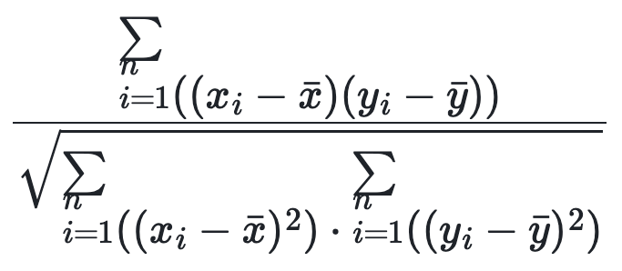

# corr

## 説明

2つの式間のピアソン相関係数を返します。この関数は v2.5.10 からサポートされています。また、ウィンドウ関数としても使用できます。

## 構文

```Haskell
CORR(expr1, expr2)
```

## パラメータ

`expr1` と `expr2` は、TINYINT、SMALLINT、INT、BIGINT、LARGEINT、FLOAT、DOUBLE、または DECIMAL に評価される必要があります。

`expr1` と `expr2` がテーブルの列である場合、この関数はこれら2つの列の相関係数を計算します。

## 戻り値

DOUBLE 値を返します。式は以下の通りで、`n` はテーブルの行数を表します。



## 使用上の注意

- データ行は、この行の2つの列が非NULL値である場合にのみカウントされます。それ以外の場合、このデータ行は結果から除外されます。

- `n` が 1 の場合、0 が返されます。

- 任意の入力が NULL の場合、NULL が返されます。

## 例

テーブル `agg` に次のデータがあるとします。

```plaintext
mysql> select * from agg;
+------+-------+-------+
| no   | k     | v     |
+------+-------+-------+
|    1 | 10.00 |  NULL |
|    2 | 10.00 | 11.00 |
|    2 | 20.00 | 22.00 |
|    2 | 25.00 |  NULL |
|    2 | 30.00 | 35.00 |
+------+-------+-------+
```

`k` と `v` 列の相関係数を計算します。

```plaintext
mysql> select no,CORR(k,v) from agg group by no;
+------+--------------------+
| no   | corr(k, v)         |
+------+--------------------+
|    1 |               NULL |
|    2 | 0.9988445981121532 |
+------+--------------------+
```