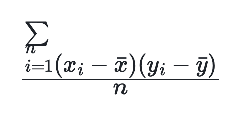

# covar_pop

2 つの式の母集団共分散を返します。この関数は v2.5.10 からサポートされています。ウィンドウ関数としても使用できます。

## Syntax

```Haskell
COVAR_POP(expr1, expr2)
```

## Parameters

`expr1` と `expr2` は TINYINT、SMALLINT、INT、BIGINT、LARGEINT、FLOAT、DOUBLE、または DECIMAL に評価される必要があります。

`expr1` と `expr2` がテーブルの列である場合、この関数はこれら 2 つの列の母集団共分散を計算します。

## Return value

DOUBLE 値を返します。式は以下の通りで、`n` はテーブルの行数を表します。



## Usage notes

- データ行は、この行の 2 つの列が非 NULL 値の場合にのみカウントされます。それ以外の場合、このデータ行は結果から除外されます。

- 入力が NULL の場合、NULL が返されます。

## Examples

テーブル `agg` が次のデータを持っているとします:

```plaintext
mysql> select * from agg;
+------+-------+-------+
| no   | k     | v     |
+------+-------+-------+
|    1 | 10.00 |  NULL |
|    2 | 10.00 | 11.00 |
|    2 | 20.00 | 22.00 |
|    2 | 25.00 |  NULL |
|    2 | 30.00 | 35.00 |
+------+-------+-------+
```

`k` と `v` 列の母集団共分散を計算します:

```plaintext
mysql> select no,COVAR_POP(k,v) from agg group by no;
+------+-------------------+
| no   | covar_pop(k, v)   |
+------+-------------------+
|    1 |              NULL |
|    2 | 79.99999999999999 |
+------+-------------------+
```