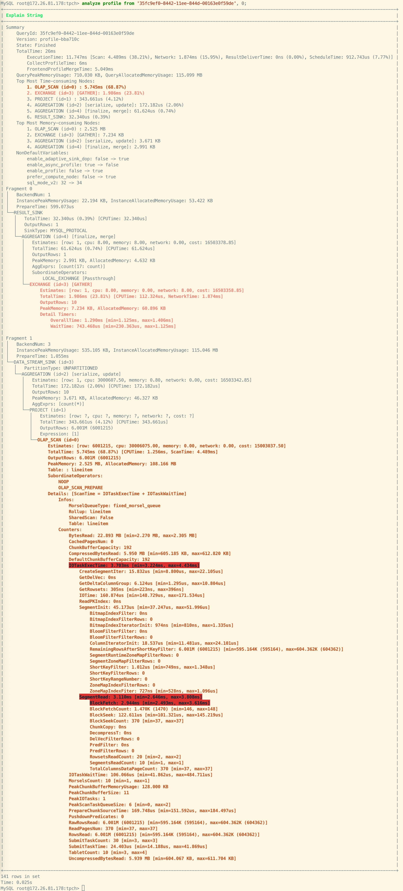

# ANALYZE PROFILE

## 説明

特定のクエリプロファイルをフラグメントごとに分析し、ツリー構造で表示します。クエリプロファイルの詳細については、[Query Profile Overview](../../../../administration/query_profile_overview.md) を参照してください。

この機能は v3.1 以降でサポートされています。

> **注意**
>
> 特定のテーブルに対して SELECT 権限を持つユーザーのみがこの操作を実行できます。

## 構文

```SQL
ANALYZE PROFILE FROM '<query_id>', [<plan_node_id>[, ...] ]
```

## パラメータ

| **パラメータ** | **説明**                                                    |
| ------------- | ------------------------------------------------------------ |
| query_id      | クエリの ID です。[SHOW PROFILELIST](./SHOW_PROFILELIST.md) を使用して取得できます。 |
| plan_node_id  | プロファイル内のプランノードの ID です。このパラメータを指定すると、対応するプランノードの詳細なメトリクスを表示できます。このパラメータを指定しない場合、すべてのプランノードの要約メトリクスのみが表示されます。 |

## 例

例 1: ノード ID を指定せずに Query Profile をクエリする。


例 2: ノード ID を `0` と指定して Query Profile をクエリする。StarRocks はノード ID `0` のすべての詳細メトリクスを返し、問題の特定を容易にするために使用率の高いメトリクスを強調表示します。



## 関連 SQL

- [SHOW PROFILELIST](./SHOW_PROFILELIST.md)
- [EXPLAIN ANALYZE](./EXPLAIN_ANALYZE.md)