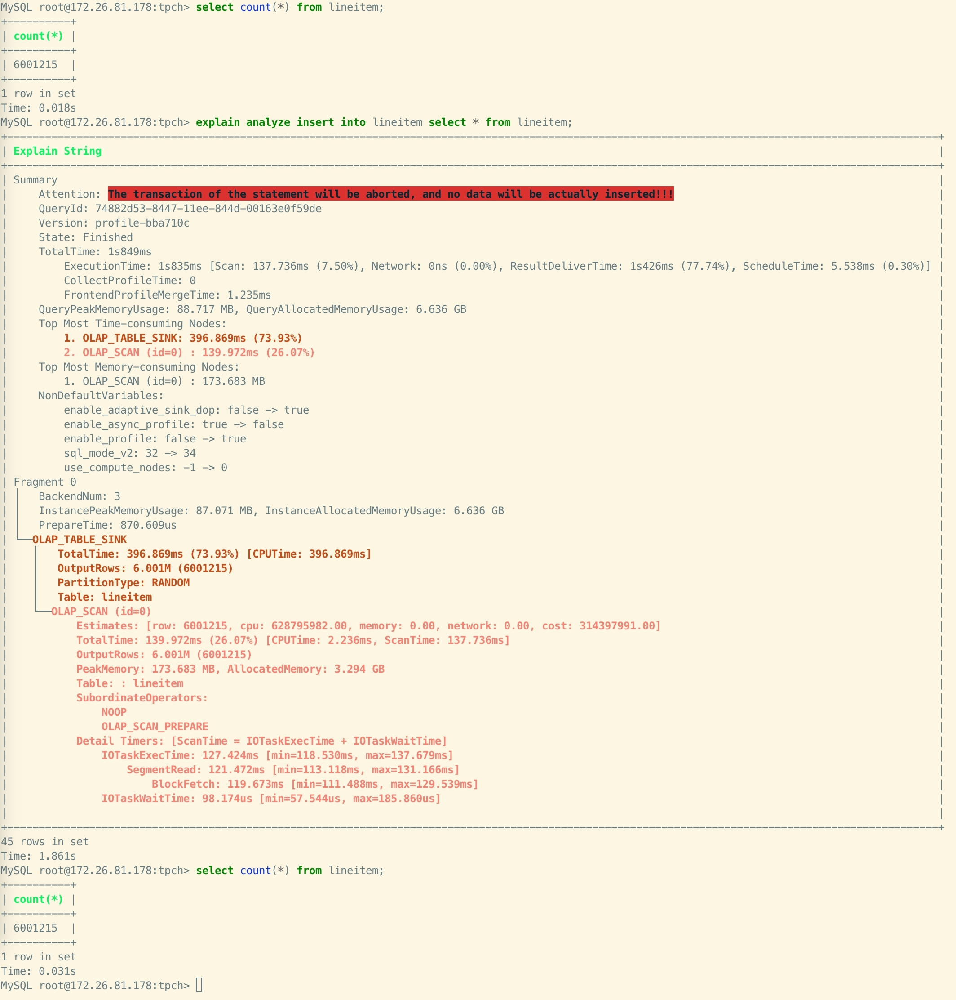

# EXPLAIN ANALYZE

## 説明

指定された SQL ステートメントを実行し、そのステートメントの Query Profile を表示します。Query Profile についての詳細は、[Query Profile Overview](../../../../administration/query_profile_overview.md) を参照してください。

この機能は v3.1 以降でサポートされています。

> **注意**
>
> 特定のテーブルに対して SELECT または INSERT 権限を持つユーザーのみがこの操作を実行できます。

## 構文

```SQL
EXPLAIN ANALYZE <statement>
```

## パラメータ

`statement`: Query Profile を表示する SQL ステートメントです。[SELECT](../../table_bucket_part_index/SELECT.md) と [INSERT INTO](../../loading_unloading/INSERT.md) の両方がサポートされています。

## 使用上の注意

INSERT INTO ステートメントのプロファイルを分析する際、実際にはデータは挿入されません。デフォルトでは、トランザクションは中止され、プロファイル分析の過程でデータに意図しない変更が加えられないようにします。

## 例

例 1: SELECT ステートメントをシミュレートして分析します。クエリ結果は破棄されます。


例 2: INSERT INTO ステートメントをシミュレートして分析します。ロードトランザクションは中止されます。



## 関連する SQL

- [SHOW PROFILELIST](./SHOW_PROFILELIST.md)
- [ANALYZE PROFILE](./ANALYZE_PROFILE.md)