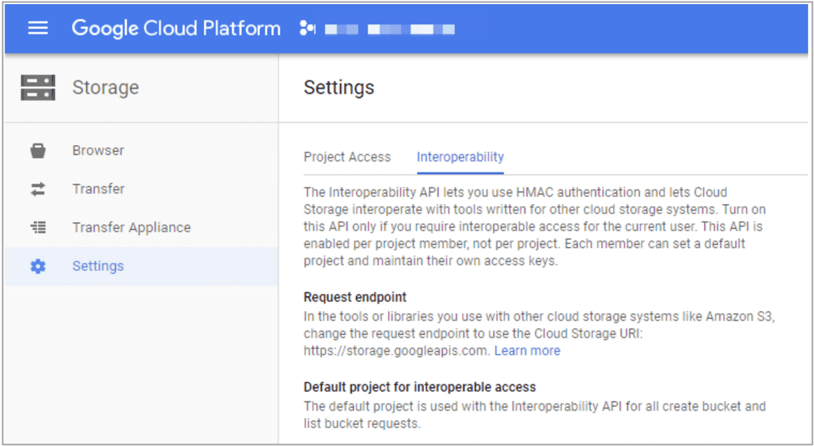

# BROKER LOAD

## 説明

StarRocks は、MySQL ベースのロード方法である Broker Load を提供します。ロードジョブを送信すると、StarRocks は非同期でジョブを実行します。ジョブの結果を確認するには、 [SHOW LOAD](../../../sql-reference/sql-statements/data-manipulation/SHOW_LOAD.md) または `curl` を使用する必要があります。背景情報、前提条件、原則、サポートされているデータファイル形式、サポートされている外部ストレージシステム、単一テーブルロードと複数テーブルロードの実行方法については、 [Load data from HDFS or cloud storage](../../../loading/BrokerLoad.md) を参照してください。

## 構文

```SQL
LOAD LABEL [<database_name>.]<label_name>
(
    data_desc[, data_desc ...]
)
WITH BROKER
(
    StorageCredentialParams
)
[PROPERTIES
(
    opt_properties
)
]
```

StarRocks では、いくつかのリテラルが SQL 言語によって予約キーワードとして使用されます。これらのキーワードを SQL ステートメントで直接使用しないでください。SQL ステートメントでこのようなキーワードを使用する場合は、バッククォート (`) で囲んでください。 [Keywords](../../../sql-reference/sql-statements/keywords.md) を参照してください。

## パラメータ

### database_name と label_name

`label_name` はロードジョブのラベルを指定します。

`database_name` は、宛先テーブルが属するデータベースの名前をオプションで指定します。

各ロードジョブには、データベース全体で一意のラベルがあります。ロードジョブのラベルを使用して、ロードジョブの実行ステータスを表示し、同じデータを繰り返しロードするのを防ぐことができます。ロードジョブが **FINISHED** 状態になると、そのラベルは再利用できません。**CANCELLED** 状態になったロードジョブのラベルのみが再利用可能です。ほとんどの場合、ロードジョブのラベルは、そのロードジョブを再試行して同じデータをロードするために再利用され、Exactly-Once セマンティクスを実装します。

ラベルの命名規則については、 [System limits](../../../reference/System_limit.md) を参照してください。

### data_desc

ロードするデータのバッチの説明です。各 `data_desc` ディスクリプタは、データソース、ETL 関数、宛先 StarRocks テーブル、および宛先パーティションなどの情報を宣言します。

Broker Load は、一度に複数のデータファイルをロードすることをサポートしています。1 つのロードジョブで、複数の `data_desc` ディスクリプタを使用してロードしたい複数のデータファイルを宣言するか、1 つの `data_desc` ディスクリプタを使用して、すべてのデータファイルをロードしたいファイルパスを宣言することができます。Broker Load は、複数のデータファイルをロードする各ロードジョブのトランザクションの原子性も保証できます。原子性とは、1 つのロードジョブで複数のデータファイルをロードする場合、すべて成功するか失敗する必要があることを意味します。一部のデータファイルのロードが成功し、他のファイルのロードが失敗することはありません。

`data_desc` は次の構文をサポートしています。

```SQL
DATA INFILE ("<file_path>"[, "<file_path>" ...])
[NEGATIVE]
INTO TABLE <table_name>
[PARTITION (<partition1_name>[, <partition2_name> ...])]
[TEMPORARY PARTITION (<temporary_partition1_name>[, <temporary_partition2_name> ...])]
[COLUMNS TERMINATED BY "<column_separator>"]
[ROWS TERMINATED BY "<row_separator>"]
[FORMAT AS "CSV | Parquet | ORC"]
[(column_list)]
[COLUMNS FROM PATH AS (<partition_field_name>[, <partition_field_name> ...])]
[SET <k1=f1(v1)>[, <k2=f2(v2)> ...]]
[WHERE predicate]
```

`data_desc` には次のパラメータが含まれている必要があります。

- `file_path`

  ロードしたい 1 つ以上のデータファイルの保存パスを指定します。

  このパラメータを 1 つのデータファイルの保存パスとして指定できます。たとえば、HDFS サーバーの `/user/data/tablename` パスから `20210411` という名前のデータファイルをロードするために、このパラメータを `"hdfs://<hdfs_host>:<hdfs_port>/user/data/tablename/20210411"` として指定できます。

  また、ワイルドカード `?`、`*`、`[]`、`{}`、または `^` を使用して、複数のデータファイルの保存パスとしてこのパラメータを指定することもできます。 [Wildcard reference](https://hadoop.apache.org/docs/stable/api/org/apache/hadoop/fs/FileSystem.html#globStatus-org.apache.hadoop.fs.Path-) を参照してください。たとえば、このパラメータを `"hdfs://<hdfs_host>:<hdfs_port>/user/data/tablename/*/*"` または `"hdfs://<hdfs_host>:<hdfs_port>/user/data/tablename/dt=202104*/*"` として指定して、HDFS サーバーの `/user/data/tablename` パス内のすべてのパーティションまたは `202104` パーティションのみからデータファイルをロードできます。

  > **注意**
  >
  > ワイルドカードは中間パスを指定するためにも使用できます。

  上記の例では、`hdfs_host` と `hdfs_port` パラメータは次のように説明されています。

  - `hdfs_host`: HDFS クラスター内の NameNode ホストの IP アドレス。

  - `hdfs_port`: HDFS クラスター内の NameNode ホストの FS ポート。デフォルトのポート番号は `9000` です。

  > **注意**
  >
  > Broker Load は、S3 または S3A プロトコルに従って AWS S3 へのアクセスをサポートしています。したがって、AWS S3 からデータをロードする場合、S3 URI に `s3://` または `s3a://` をプレフィックスとして含めることができます。

- `INTO TABLE`

  宛先 StarRocks テーブルの名前を指定します。

`data_desc` には次のパラメータをオプションで含めることができます。

- `NEGATIVE`

  特定のデータバッチのロードを取り消します。これを達成するには、`NEGATIVE` キーワードを指定して同じデータバッチをロードする必要があります。

  > **注意**
  >
  > このパラメータは、StarRocks テーブルが集計テーブルであり、すべての値列が `sum` 関数によって計算される場合にのみ有効です。

- `PARTITION`

   データをロードしたいパーティションを指定します。デフォルトでは、このパラメータを指定しない場合、ソースデータは StarRocks テーブルのすべてのパーティションにロードされます。

- `TEMPORARY_PARTITION`

  データをロードしたい [一時パーティション](../../../table_design/Temporary_partition.md) の名前を指定します。複数の一時パーティションを指定することができ、これらはカンマ (,) で区切る必要があります。

- `COLUMNS TERMINATED BY`

  データファイルで使用される列区切り文字を指定します。デフォルトでは、このパラメータを指定しない場合、このパラメータは `\t` にデフォルト設定され、タブを示します。このパラメータを使用して指定する列区切り文字は、データファイルで実際に使用されている列区切り文字と同じである必要があります。そうでない場合、データ品質が不十分なためロードジョブが失敗し、その `State` は `CANCELLED` になります。

  Broker Load ジョブは MySQL プロトコルに従って送信されます。StarRocks と MySQL はどちらもロードリクエスト内の文字をエスケープします。したがって、列区切り文字がタブのような不可視文字である場合、列区切り文字の前にバックスラッシュ (\) を追加する必要があります。たとえば、列区切り文字が `\t` の場合は `\\t` を入力する必要があり、列区切り文字が `\n` の場合は `\\n` を入力する必要があります。Apache Hive™ ファイルは `\x01` を列区切り文字として使用するため、データファイルが Hive からのものである場合は `\\x01` を入力する必要があります。

  > **注意**
  >
  > - CSV データの場合、カンマ (,) やタブ、パイプ (|) など、長さが 50 バイトを超えない UTF-8 文字列をテキストデリミタとして使用できます。
  > - Null 値は `\N` を使用して示されます。たとえば、データファイルが 3 列で構成されており、そのデータファイルのレコードが最初と 3 番目の列にデータを保持し、2 番目の列にデータがない場合、この状況では 2 番目の列に `\N` を使用して Null 値を示す必要があります。これは、レコードが `a,\N,b` としてコンパイルされる必要があることを意味し、`a,,b` ではありません。`a,,b` は、レコードの 2 番目の列が空の文字列を保持していることを示します。

- `ROWS TERMINATED BY`

  データファイルで使用される行区切り文字を指定します。デフォルトでは、このパラメータを指定しない場合、このパラメータは `\n` にデフォルト設定され、改行を示します。このパラメータを使用して指定する行区切り文字は、データファイルで実際に使用されている行区切り文字と同じである必要があります。そうでない場合、データ品質が不十分なためロードジョブが失敗し、その `State` は `CANCELLED` になります。このパラメータは v2.5.4 以降でサポートされています。

  行区切り文字の使用に関する注意事項については、前述の `COLUMNS TERMINATED BY` パラメータの使用に関する注意事項を参照してください。

- `FORMAT AS`

  データファイルの形式を指定します。有効な値: `CSV`、`Parquet`、および `ORC`。デフォルトでは、このパラメータを指定しない場合、StarRocks は `file_path` パラメータで指定されたファイル名拡張子 **.csv**、**.parquet**、または **.orc** に基づいてデータファイル形式を判断します。

- `column_list`

  データファイルと StarRocks テーブル間の列マッピングを指定します。構文: `(<column_name>[, <column_name> ...])`。`column_list` で宣言された列は、名前によって StarRocks テーブルの列にマッピングされます。

  > **注意**
  >
  > データファイルの列が StarRocks テーブルの列に順番にマッピングされる場合、`column_list` を指定する必要はありません。

  データファイルの特定の列をスキップしたい場合、その列を一時的に StarRocks テーブルの列とは異なる名前にするだけで済みます。詳細については、 [Transform data at loading](../../../loading/Etl_in_loading.md) を参照してください。

- `COLUMNS FROM PATH AS`

  指定したファイルパスから 1 つ以上のパーティションフィールドに関する情報を抽出します。このパラメータは、ファイルパスにパーティションフィールドが含まれている場合にのみ有効です。

  たとえば、データファイルが `/path/col_name=col_value/file1` に保存されており、`col_name` がパーティションフィールドであり、StarRocks テーブルの列にマッピングできる場合、このパラメータを `col_name` として指定できます。このようにして、StarRocks はパスから `col_value` 値を抽出し、それらを `col_name` にマッピングされた StarRocks テーブル列にロードします。

  > **注意**
  >
  > このパラメータは、HDFS からデータをロードする場合にのみ利用可能です。

- `SET`

  データファイルの列を変換するために使用したい 1 つ以上の関数を指定します。例:

  - StarRocks テーブルは、順番に `col1`、`col2`、`col3` の 3 列で構成されています。データファイルは 4 列で構成されており、そのうち最初の 2 列は StarRocks テーブルの `col1` と `col2` に順番にマッピングされ、最後の 2 列の合計が StarRocks テーブルの `col3` にマッピングされます。この場合、`column_list` を `(col1,col2,tmp_col3,tmp_col4)` として指定し、SET 句で `(col3=tmp_col3+tmp_col4)` を指定してデータ変換を実装する必要があります。
  - StarRocks テーブルは、順番に `year`、`month`、`day` の 3 列で構成されています。データファイルは `yyyy-mm-dd hh:mm:ss` 形式の日付と時刻の値を含む 1 列のみで構成されています。この場合、`column_list` を `(tmp_time)` として指定し、SET 句で `(year = year(tmp_time), month=month(tmp_time), day=day(tmp_time))` を指定してデータ変換を実装する必要があります。

- `WHERE`

  ソースデータをフィルタリングするための条件を指定します。StarRocks は、WHERE 句で指定されたフィルタ条件を満たすソースデータのみをロードします。

### WITH BROKER

v2.4 以前では、使用したいブローカーを指定するために `WITH BROKER "<broker_name>"` を入力します。v2.5 以降では、ブローカーを指定する必要はありませんが、`WITH BROKER` キーワードを保持する必要があります。詳細については、 [Load data from HDFS or cloud storage > Background information](../../../loading/BrokerLoad.md#background-information) を参照してください。

### StorageCredentialParams

StarRocks がストレージシステムにアクセスするために使用する認証情報。

#### HDFS

オープンソースの HDFS は、シンプル認証と Kerberos 認証の 2 つの認証方法をサポートしています。Broker Load はデフォルトでシンプル認証を使用します。オープンソースの HDFS は、NameNode に対して HA メカニズムを構成することもサポートしています。ストレージシステムとしてオープンソースの HDFS を選択した場合、認証構成と HA 構成を次のように指定できます。

- 認証構成

  - シンプル認証を使用する場合、`StorageCredentialParams` を次のように構成します。

    ```Plain
    "hadoop.security.authentication" = "simple",
    "username" = "<hdfs_username>",
    "password" = "<hdfs_password>"
    ```

    `StorageCredentialParams` のパラメータは次の表で説明されています。

    | パラメータ                       | 説明                                                  |
    | ------------------------------- | ---------------------------------------------------- |
    | hadoop.security.authentication  | 認証方法。有効な値: `simple` と `kerberos`。デフォルト値: `simple`。`simple` はシンプル認証を表し、認証なしを意味し、`kerberos` は Kerberos 認証を表します。 |
    | username                        | HDFS クラスターの NameNode にアクセスするために使用するアカウントのユーザー名。 |
    | password                        | HDFS クラスターの NameNode にアクセスするために使用するアカウントのパスワード。 |

  - Kerberos 認証を使用する場合、`StorageCredentialParams` を次のように構成します。

    ```Plain
    "hadoop.security.authentication" = "kerberos",
    "kerberos_principal" = "nn/zelda1@ZELDA.COM",
    "kerberos_keytab" = "/keytab/hive.keytab",
    "kerberos_keytab_content" = "YWFhYWFh"
    ```

    `StorageCredentialParams` のパラメータは次の表で説明されています。

| パラメータ                       | 説明                                                  |
    | ------------------------------- | ---------------------------------------------------- |
    | hadoop.security.authentication  | 認証方法。有効な値: `simple` と `kerberos`。デフォルト値: `simple`。`simple` はシンプル認証を表し、認証なしを意味し、`kerberos` は Kerberos 認証を表します。 |
    | kerberos_principal              | 認証される Kerberos プリンシパル。各プリンシパルは、HDFS クラスター全体で一意であることを保証するために、次の 3 つの部分で構成されます:<ul><li>`username` または `servicename`: プリンシパルの名前。</li><li>`instance`: HDFS クラスター内の認証されるノードをホストするサーバーの名前。サーバー名は、HDFS クラスターが独立して認証される複数の DataNode で構成されている場合などに、プリンシパルが一意であることを保証するのに役立ちます。</li><li>`realm`: レルムの名前。レルム名は大文字である必要があります。</li></ul>例: `nn/zelda1@ZELDA.COM`。 |
    | kerberos_keytab                 | Kerberos キータブファイルの保存パス。 |
    | kerberos_keytab_content         | Kerberos キータブファイルの Base64 エンコードされた内容。`kerberos_keytab` または `kerberos_keytab_content` のいずれかを指定できます。 |

    複数の Kerberos ユーザーを構成した場合、少なくとも 1 つの独立した [broker group](../../../deployment/deploy_broker.md) がデプロイされていることを確認し、ロードステートメントで `WITH BROKER "<broker_name>"` を入力して使用したいブローカーグループを指定する必要があります。さらに、ブローカーが **krb5.conf** ファイルを読み取れるようにするために、ブローカーの起動スクリプトファイル **start_broker.sh** を開き、ファイルの 42 行目を変更する必要があります。例:

    ```Plain
    export JAVA_OPTS="-Dlog4j2.formatMsgNoLookups=true -Xmx1024m -Dfile.encoding=UTF-8 -Djava.security.krb5.conf=/etc/krb5.conf"
    ```

    > **注意**
    >
    > - 上記の例では、`/etc/krb5.conf` は **krb5.conf** ファイルの実際の保存パスに置き換えることができます。ブローカーがそのファイルに対する読み取り権限を持っていることを確認してください。ブローカーグループが複数のブローカーで構成されている場合、各ブローカーノードで **start_broker.sh** ファイルを変更し、変更を有効にするためにブローカーノードを再起動する必要があります。
    > - StarRocks クラスターにデプロイされているブローカーを確認するには、 [SHOW BROKER](../Administration/SHOW_BROKER.md) ステートメントを使用できます。

- HA 構成

  HDFS クラスターの NameNode に対して HA メカニズムを構成できます。これにより、NameNode が別のノードに切り替えられた場合でも、StarRocks は新しい NameNode を自動的に識別できます。これには次のシナリオが含まれます。

  - Kerberos ユーザーが 1 つ構成されている単一の HDFS クラスターからデータをロードする場合、ブローカーを使用したロードとブローカーを使用しないロードの両方がサポートされています。

    - ブローカーを使用したロードを実行するには、少なくとも 1 つの独立した [broker group](../../../deployment/deploy_broker.md) がデプロイされていることを確認し、HDFS クラスターをサポートするブローカーノードの `{deploy}/conf` パスに `hdfs-site.xml` ファイルを配置します。StarRocks はブローカーの起動時に `{deploy}/conf` パスを環境変数 `CLASSPATH` に追加し、ブローカーが HDFS クラスターのノード情報を読み取れるようにします。
  
    - ブローカーを使用しないロードを実行するには、各 FE ノードと各 BE ノードの `{deploy}/conf` パスに `hdfs-site.xml` ファイルを配置します。
  
  - 複数の Kerberos ユーザーが構成されている単一の HDFS クラスターからデータをロードする場合、ブローカーを使用したロードのみがサポートされています。少なくとも 1 つの独立した [broker group](../../../deployment/deploy_broker.md) がデプロイされていることを確認し、HDFS クラスターをサポートするブローカーノードの `{deploy}/conf` パスに `hdfs-site.xml` ファイルを配置します。StarRocks はブローカーの起動時に `{deploy}/conf` パスを環境変数 `CLASSPATH` に追加し、ブローカーが HDFS クラスターのノード情報を読み取れるようにします。

  - 複数の HDFS クラスターからデータをロードする場合（1 つまたは複数の Kerberos ユーザーが構成されているかどうかに関係なく）、ブローカーを使用したロードのみがサポートされています。これらの HDFS クラスターのそれぞれに対して少なくとも 1 つの独立した [broker group](../../../deployment/deploy_broker.md) がデプロイされていることを確認し、ブローカーが HDFS クラスターのノード情報を読み取れるようにするために次のいずれかのアクションを実行します。

    - HDFS クラスターをサポートする各ブローカーノードの `{deploy}/conf` パスに `hdfs-site.xml` ファイルを配置します。StarRocks はブローカーの起動時に `{deploy}/conf` パスを環境変数 `CLASSPATH` に追加し、その HDFS クラスター内のノード情報を読み取れるようにします。

    - ジョブ作成時に次の HA 構成を追加します。

      ```Plain
      "dfs.nameservices" = "ha_cluster",
      "dfs.ha.namenodes.ha_cluster" = "ha_n1,ha_n2",
      "dfs.namenode.rpc-address.ha_cluster.ha_n1" = "<hdfs_host>:<hdfs_port>",
      "dfs.namenode.rpc-address.ha_cluster.ha_n2" = "<hdfs_host>:<hdfs_port>",
      "dfs.client.failover.proxy.provider" = "org.apache.hadoop.hdfs.server.namenode.ha.ConfiguredFailoverProxyProvider"
      ```

      HA 構成のパラメータは次の表で説明されています。

      | パラメータ                          | 説明                                                  |
      | ---------------------------------- | ---------------------------------------------------- |
      | dfs.nameservices                   | HDFS クラスターの名前。                                |
      | dfs.ha.namenodes.XXX               | HDFS クラスター内の NameNode の名前。複数の NameNode 名を指定する場合は、カンマ (`,`) で区切ります。`xxx` は `dfs.nameservices` で指定した HDFS クラスター名です。 |
      | dfs.namenode.rpc-address.XXX.NN    | HDFS クラスター内の NameNode の RPC アドレス。`NN` は `dfs.ha.namenodes.XXX` で指定した NameNode 名です。 |
      | dfs.client.failover.proxy.provider | クライアントが接続する NameNode のプロバイダー。デフォルト値: `org.apache.hadoop.hdfs.server.namenode.ha.ConfiguredFailoverProxyProvider`。 |

  > **注意**
  >
  > StarRocks クラスターにデプロイされているブローカーを確認するには、 [SHOW BROKER](../Administration/SHOW_BROKER.md) ステートメントを使用できます。

#### AWS S3

AWS S3 をストレージシステムとして選択する場合、次のいずれかのアクションを実行します。

- インスタンスプロファイルベースの認証方法を選択するには、`StorageCredentialParams` を次のように構成します。

  ```SQL
  "aws.s3.use_instance_profile" = "true",
  "aws.s3.region" = "<aws_s3_region>"
  ```

- アサームドロールベースの認証方法を選択するには、`StorageCredentialParams` を次のように構成します。

  ```SQL
  "aws.s3.use_instance_profile" = "true",
  "aws.s3.iam_role_arn" = "<iam_role_arn>",
  "aws.s3.region" = "<aws_s3_region>"
  ```

- IAM ユーザーベースの認証方法を選択するには、`StorageCredentialParams` を次のように構成します。

  ```SQL
  "aws.s3.use_instance_profile" = "false",
  "aws.s3.access_key" = "<iam_user_access_key>",
  "aws.s3.secret_key" = "<iam_user_secret_key>",
  "aws.s3.region" = "<aws_s3_region>"
  ```

`StorageCredentialParams` に構成する必要があるパラメータは次の表で説明されています。

| パラメータ                   | 必須 | 説明                                                  |
| --------------------------- | ---- | ---------------------------------------------------- |
| aws.s3.use_instance_profile | はい  | 資格情報メソッドのインスタンスプロファイルとアサームドロールを有効にするかどうかを指定します。有効な値: `true` と `false`。デフォルト値: `false`。 |
| aws.s3.iam_role_arn         | いいえ | AWS S3 バケットに対する権限を持つ IAM ロールの ARN。AWS S3 にアクセスするための資格情報メソッドとしてアサームドロールを選択した場合、このパラメータを指定する必要があります。その後、StarRocks は Hive カタログを使用して Hive データにアクセスする際にこのロールをアサームします。 |
| aws.s3.region               | はい  | AWS S3 バケットが存在するリージョン。例: `us-west-1`。 |
| aws.s3.access_key           | いいえ | AWS IAM ユーザーのアクセスキー。AWS S3 にアクセスするための資格情報メソッドとして IAM ユーザーを選択した場合、このパラメータを指定する必要があります。その後、StarRocks は Hive カタログを使用して Hive データにアクセスする際にこのロールをアサームします。 |
| aws.s3.secret_key           | いいえ | AWS IAM ユーザーのシークレットキー。AWS S3 にアクセスするための資格情報メソッドとして IAM ユーザーを選択した場合、このパラメータを指定する必要があります。その後、StarRocks は Hive カタログを使用して Hive データにアクセスする際にこのユーザーをアサームします。 |

AWS S3 にアクセスするための認証方法の選択方法と AWS IAM コンソールでのアクセス制御ポリシーの構成方法については、 [Authentication parameters for accessing AWS S3](../../../integrations/authenticate_to_aws_resources.md#authentication-parameters-for-accessing-aws-s3) を参照してください。

#### Google GCS

Google GCS をストレージシステムとして選択する場合、`StorageCredentialParams` を次のように構成します。

```SQL
"fs.s3a.access.key" = "<gcs_access_key>",
"fs.s3a.secret.key" = "<gcs_secret_key>",
"fs.s3a.endpoint" = "<gcs_endpoint>"
```

`StorageCredentialParams` に構成する必要があるパラメータは次の表で説明されています。

| パラメータ         | 説明                                                  |
| ----------------- | ---------------------------------------------------- |
| fs.s3a.access.key | Google GCS バケットにアクセスするために使用できるアクセスキー。 |
| fs.s3a.secret.key | Google GCS バケットにアクセスするために使用できるシークレットキー。 |
| fs.s3a.endpoint   | Google GCS バケットにアクセスするために使用できるエンドポイント。 |

> **注意**
>
> Broker Load は、S3A プロトコルに従ってのみ Google GCS へのアクセスをサポートしています。したがって、Google GCS からデータをロードする場合、`DATA INFILE` に渡す GCS URI のプレフィックスを `s3a://` に置き換える必要があります。

Google GCS バケットにアクセスするためのアクセス/シークレットキーのペアを作成するには、次の手順に従います。

1. [Google GCP](https://console.cloud.google.com/storage/settings) にログインします。

2. 左側のナビゲーションペインで、**Google Cloud Storage** を選択し、次に **Settings** を選択します。

3. **Interoperability** タブをクリックします。

4. (オプション) Interoperability 機能を有効にしていない場合は、**Interoperable Access** をクリックします。

   

5. **Create new Key** ボタンをクリックして、アクセス/シークレットキーのペアを作成します。

#### その他の S3 互換ストレージシステム

MinIO などの他の S3 互換ストレージシステムを選択する場合、`StorageCredentialParams` を次のように構成します。

```SQL
"aws.s3.enable_ssl" = "{true | false}",
"aws.s3.enable_path_style_access" = "{true | false}",
"aws.s3.endpoint" = "<s3_endpoint>",
"aws.s3.access_key" = "<iam_user_access_key>",
"aws.s3.secret_key" = "<iam_user_secret_key>"
```

`StorageCredentialParams` に構成する必要があるパラメータは次の表で説明されています。

| パラメータ                        | 必須 | 説明                                                  |
| -------------------------------- | ---- | ---------------------------------------------------- |
| aws.s3.enable_ssl                | はい  | SSL 接続を有効にするかどうかを指定します。有効な値: `true` と `false`。デフォルト値: `true`。 |
| aws.s3.enable_path_style_access  | はい  | パススタイルの URL アクセスを有効にするかどうかを指定します。有効な値: `true` と `false`。デフォルト値: `false`。 |
| aws.s3.endpoint                  | はい  | AWS S3 バケットに接続するために使用されるエンドポイント。 |
| aws.s3.access_key                | はい  | AWS IAM ユーザーのアクセスキー。 |
| aws.s3.secret_key                | はい  | AWS IAM ユーザーのシークレットキー。 |

### opt_properties

ロードジョブ全体に適用される設定を持つオプションのパラメータを指定します。構文:

```Plain
PROPERTIES ("<key1>" = "<value1>"[, "<key2>" = "<value2>" ...])
```

次のパラメータがサポートされています。

- `timeout`

  ロードジョブのタイムアウト期間を指定します。単位: 秒。デフォルトのタイムアウト期間は 4 時間です。タイムアウト期間を 6 時間未満に指定することをお勧めします。ロードジョブがタイムアウト期間内に終了しない場合、StarRocks はロードジョブをキャンセルし、ロードジョブのステータスは **CANCELLED** になります。

  > **注意**
  >
  > ほとんどの場合、タイムアウト期間を設定する必要はありません。ロードジョブがデフォルトのタイムアウト期間内に終了しない場合にのみ、タイムアウト期間を設定することをお勧めします。

  タイムアウト期間を推測するための式を使用します。

  **タイムアウト期間 > (ロードするデータファイルの合計サイズ x ロードするデータファイルの合計数とデータファイルに作成されたマテリアライズドビュー)/(平均ロード速度 x タスクごとに許可される最大同時インスタンス数)**

  > **注意**
  >
  > - 「平均ロード速度」は、StarRocks クラスター全体の平均ロード速度です。平均ロード速度は、サーバー構成とクラスターに許可される最大同時クエリタスク数に応じて各クラスターで異なります。過去のロードジョブのロード速度に基づいて平均ロード速度を推測できます。
  >
  > - 「タスクごとに許可される最大同時インスタンス数」は、`max_broker_concurrency` パラメータによって指定されます。詳細については、 [Job splitting and concurrent running](../../../loading/BrokerLoad.md#job-splitting-and-concurrent-running) を参照してください。

  1GB のデータファイルに 2 つのマテリアライズドビューが作成されている StarRocks クラスターにデータをロードしたいと仮定します。このクラスターの平均ロード速度は 10 MB/s で、タスクごとに許可される最大同時インスタンス数は 3 です。データロードに必要な時間は約 102 秒です。

  (1 x 1024 x 3)/(10 x 3) = 102 (秒)

  この例では、タイムアウト期間を 102 秒よりも長く設定することをお勧めします。

- `max_filter_ratio`

  ロードジョブの最大エラー許容度を指定します。最大エラー許容度は、データ品質が不十分なためにフィルタリングされる行の最大割合です。有効な値: `0`~`1`。デフォルト値: `0`。

  - このパラメータを `0` に設定すると、StarRocks はロード中に不適格な行を無視しません。そのため、ソースデータに不適格な行が含まれている場合、ロードジョブは失敗します。これにより、StarRocks にロードされるデータの正確性が保証されます。

  - このパラメータを `0` より大きい値に設定すると、StarRocks はロード中に不適格な行を無視できます。そのため、ソースデータに不適格な行が含まれていても、ロードジョブは成功する可能性があります。

    > **注意**
    >
    > データ品質が不十分なためにフィルタリングされる行には、WHERE 句によってフィルタリングされる行は含まれません。

  最大エラー許容度が `0` に設定されているためにロードジョブが失敗した場合、 [SHOW LOAD](../../../sql-reference/sql-statements/data-manipulation/SHOW_LOAD.md) を使用してジョブ結果を表示できます。その後、不適格な行をフィルタリングできるかどうかを判断します。不適格な行をフィルタリングできる場合、ジョブ結果で返される `dpp.abnorm.ALL` と `dpp.norm.ALL` の値に基づいて最大エラー許容度を計算し、最大エラー許容度を調整してロードジョブを再送信します。最大エラー許容度を計算するための式は次のとおりです。

  `max_filter_ratio` = [`dpp.abnorm.ALL`/(`dpp.abnorm.ALL` + `dpp.norm.ALL`)]

  `dpp.abnorm.ALL` と `dpp.norm.ALL` の値の合計は、ロードされる行の総数です。

- `load_mem_limit`

  ロードジョブに提供できる最大メモリ量を指定します。単位: バイト。デフォルトのメモリ制限は 2 GB です。

- `strict_mode`

  [strict mode](../../../loading/load_concept/strict_mode.md) を有効にするかどうかを指定します。有効な値: `true` と `false`。デフォルト値: `false`。`true` は strict mode を有効にし、`false` は strict mode を無効にします。

- `timezone`

  ロードジョブのタイムゾーンを指定します。デフォルト値: `Asia/Shanghai`。タイムゾーン設定は、strftime、alignment_timestamp、from_unixtime などの関数によって返される結果に影響を与えます。詳細については、 [Configure a time zone](../../../administration/timezone.md) を参照してください。`timezone` パラメータで指定されたタイムゾーンはセッションレベルのタイムゾーンです。

- `priority`

  ロードジョブの優先度を指定します。有効な値: `LOWEST`、`LOW`、`NORMAL`、`HIGH`、`HIGHEST`。デフォルト値: `NORMAL`。Broker Load は、StarRocks クラスター内で同時に実行できる Broker Load ジョブの最大数を決定する [FE パラメータ](../../../administration/Configuration.md#fe-configuration-items) `max_broker_load_job_concurrency` を提供します。指定された時間内に送信された Broker Load ジョブの数が最大数を超える場合、タスクプール内の過剰なジョブは、優先度に基づいてスケジュール待ちになります。

  `QUEUEING` または `LOADING` 状態の既存のロードジョブの優先度を変更するには、 [ALTER LOAD](../../../sql-reference/sql-statements/data-manipulation/ALTER_LOAD.md) ステートメントを使用できます。

  StarRocks は v2.5 以降、Broker Load ジョブの `priority` パラメータの設定を許可します。

## 列マッピング

データファイルの列が StarRocks テーブルの列に順番に 1 対 1 でマッピングできる場合、データファイルと StarRocks テーブル間の列マッピングを構成する必要はありません。

データファイルの列が StarRocks テーブルの列に順番に 1 対 1 でマッピングできない場合、`columns` パラメータを使用してデータファイルと StarRocks テーブル間の列マッピングを構成する必要があります。これには次の 2 つのユースケースが含まれます。

- **列数は同じだが列の順序が異なる。** **また、データファイルからのデータは、StarRocks テーブル列にロードされる前に関数によって計算される必要はありません。**

  `columns` パラメータでは、データファイルの列が配置されている順序と同じ順序で StarRocks テーブル列の名前を指定する必要があります。

  たとえば、StarRocks テーブルは順番に `col1`、`col2`、`col3` の 3 列で構成されており、データファイルも 3 列で構成されており、順番に StarRocks テーブル列 `col3`、`col2`、`col1` にマッピングできます。この場合、`"columns: col3, col2, col1"` と指定する必要があります。

- **列数が異なり、列の順序も異なる。また、データファイルからのデータは、StarRocks テーブル列にロードされる前に関数によって計算される必要があります。**

  `columns` パラメータでは、データファイルの列が配置されている順序と同じ順序で StarRocks テーブル列の名前を指定し、データを計算するために使用したい関数を指定する必要があります。2 つの例は次のとおりです。

  - StarRocks テーブルは順番に `col1`、`col2`、`col3` の 3 列で構成されています。データファイルは 4 列で構成されており、そのうち最初の 3 列は順番に StarRocks テーブル列 `col1`、`col2`、`col3` にマッピングでき、4 番目の列は StarRocks テーブルのいずれの列にもマッピングできません。この場合、データファイルの 4 番目の列に一時的な名前を指定する必要があり、その一時的な名前は StarRocks テーブル列のいずれの名前とも異なる必要があります。たとえば、`"columns: col1, col2, col3, temp"` と指定でき、データファイルの 4 番目の列は一時的に `temp` と名付けられます。
  - StarRocks テーブルは順番に `year`、`month`、`day` の 3 列で構成されています。データファイルは `yyyy-mm-dd hh:mm:ss` 形式の日付と時刻の値を含む 1 列のみで構成されています。この場合、`"columns: col, year = year(col), month=month(col), day=day(col)"` と指定でき、`col` はデータファイル列の一時的な名前であり、関数 `year = year(col)`、`month=month(col)`、`day=day(col)` はデータファイル列 `col` からデータを抽出し、マッピングされた StarRocks テーブル列にデータをロードします。たとえば、`year = year(col)` はデータファイル列 `col` から `yyyy` データを抽出し、StarRocks テーブル列 `year` にデータをロードするために使用されます。

詳細な例については、 [Configure column mapping](#configure-column-mapping) を参照してください。

## 例

このセクションでは、HDFS を例にとり、さまざまなロード構成を説明します。

### CSV データのロード

このセクションでは、さまざまなロード要件を満たすために使用できるさまざまなパラメータ構成を説明するために、CSV を例にとります。

#### タイムアウト期間の設定

StarRocks データベース `test_db` には `table1` という名前のテーブルが含まれています。このテーブルは順番に `col1`、`col2`、`col3` の 3 列で構成されています。

データファイル `example1.csv` も 3 列で構成されており、`table1` の `col1`、`col2`、`col3` に順番にマッピングされています。

`example1.csv` から `table1` に 3600 秒以内にすべてのデータをロードしたい場合、次のコマンドを実行します。

```SQL
LOAD LABEL test_db.label1
(
    DATA INFILE("hdfs://<hdfs_host>:<hdfs_port>/user/starrocks/data/input/example1.csv")
    INTO TABLE table1
)
WITH BROKER
(
    "username" = "<hdfs_username>",
    "password" = "<hdfs_password>"
)
PROPERTIES
(
    "timeout" = "3600"
);
```

#### 最大エラー許容度の設定

StarRocks データベース `test_db` には `table2` という名前のテーブルが含まれています。このテーブルは順番に `col1`、`col2`、`col3` の 3 列で構成されています。

データファイル `example2.csv` も 3 列で構成されており、`table2` の `col1`、`col2`、`col3` に順番にマッピングされています。

`example2.csv` から `table2` に最大エラー許容度 `0.1` でデータをロードしたい場合、次のコマンドを実行します。

```SQL
LOAD LABEL test_db.label2
(
    DATA INFILE("hdfs://<hdfs_host>:<hdfs_port>/user/starrocks/data/input/example2.csv")
    INTO TABLE table2

)
WITH BROKER
(
    "username" = "<hdfs_username>",
    "password" = "<hdfs_password>"
)
PROPERTIES
(
    "max_filter_ratio" = "0.1"
);
```

#### ファイルパスからすべてのデータファイルをロード

StarRocks データベース `test_db` には `table3` という名前のテーブルが含まれています。このテーブルは順番に `col1`、`col2`、`col3` の 3 列で構成されています。

HDFS クラスターの `/user/starrocks/data/input/` パスに保存されているすべてのデータファイルもそれぞれ 3 列で構成されており、`table3` の `col1`、`col2`、`col3` に順番にマッピングされています。これらのデータファイルで使用されている列区切り文字は `\x01` です。

HDFS サーバーの `hdfs://<hdfs_host>:<hdfs_port>/user/starrocks/data/input/` パスに保存されているすべてのデータファイルから `table3` にデータをロードしたい場合、次のコマンドを実行します。

```SQL
LOAD LABEL test_db.label3
(
    DATA INFILE("hdfs://<hdfs_host>:<hdfs_port>/user/starrocks/data/input/*")
    INTO TABLE table3
    COLUMNS TERMINATED BY "\\x01"
)
WITH BROKER
(
    "username" = "<hdfs_username>",
    "password" = "<hdfs_password>"
);
```

#### NameNode HA メカニズムの設定

StarRocks データベース `test_db` には `table4` という名前のテーブルが含まれています。このテーブルは順番に `col1`、`col2`、`col3` の 3 列で構成されています。

データファイル `example4.csv` も 3 列で構成されており、`table4` の `col1`、`col2`、`col3` にマッピングされています。

NameNode に対して HA メカニズムを構成して `example4.csv` から `table4` にすべてのデータをロードしたい場合、次のコマンドを実行します。

```SQL
LOAD LABEL test_db.label4
(
    DATA INFILE("hdfs://<hdfs_host>:<hdfs_port>/user/starrocks/data/input/example4.csv")
    INTO TABLE table4
)
WITH BROKER
(
    "username" = "<hdfs_username>",
    "password" = "<hdfs_password>",
    "dfs.nameservices" = "my_ha",
    "dfs.ha.namenodes.my_ha" = "my_namenode1, my_namenode2","dfs.namenode.rpc-address.my_ha.my_namenode1" = "nn1_host:rpc_port",
    "dfs.namenode.rpc-address.my_ha.my_namenode2" = "nn2_host:rpc_port",
    "dfs.client.failover.proxy.provider" = "org.apache.hadoop.hdfs.server.namenode.ha.ConfiguredFailoverProxyProvider"
);
```

#### Kerberos 認証の設定

StarRocks データベース `test_db` には `table5` という名前のテーブルが含まれています。このテーブルは順番に `col1`、`col2`、`col3` の 3 列で構成されています。

データファイル `example5.csv` も 3 列で構成されており、`table5` の `col1`、`col2`、`col3` に順番にマッピングされています。

Kerberos 認証を構成し、キータブファイルのパスを指定して `example5.csv` から `table5` にすべてのデータをロードしたい場合、次のコマンドを実行します。

```SQL
LOAD LABEL test_db.label5
(
    DATA INFILE("hdfs://<hdfs_host>:<hdfs_port>/user/starrocks/data/input/example5.csv")
    INTO TABLE table5
    COLUMNS TERMINATED BY "\t"
)
WITH BROKER
(
    "hadoop.security.authentication" = "kerberos",
    "kerberos_principal" = "starrocks@YOUR.COM",
    "kerberos_keytab" = "/home/starRocks/starRocks.keytab"
);
```

#### データロードの取り消し

StarRocks データベース `test_db` には `table6` という名前のテーブルが含まれています。このテーブルは順番に `col1`、`col2`、`col3` の 3 列で構成されています。

データファイル `example6.csv` も 3 列で構成されており、`table6` の `col1`、`col2`、`col3` に順番にマッピングされています。

Broker Load ジョブを実行して `example6.csv` から `table6` にすべてのデータをロードしました。

ロードしたデータを取り消したい場合、次のコマンドを実行します。

```SQL
LOAD LABEL test_db.label6
(
    DATA INFILE("hdfs://<hdfs_host>:<hdfs_port>/user/starrocks/data/input/example6.csv")
    NEGATIVE
    INTO TABLE table6
    COLUMNS TERMINATED BY "\t"
)
WITH BROKER
(
    "hadoop.security.authentication" = "kerberos",
    "kerberos_principal" = "starrocks@YOUR.COM",
    "kerberos_keytab" = "/home/starRocks/starRocks.keytab"
);
```

#### 宛先パーティションの指定

StarRocks データベース `test_db` には `table7` という名前のテーブルが含まれています。このテーブルは順番に `col1`、`col2`、`col3` の 3 列で構成されています。

データファイル `example7.csv` も 3 列で構成されており、`table7` の `col1`、`col2`、`col3` に順番にマッピングされています。

`example7.csv` から `table7` の 2 つのパーティション `p1` と `p2` にすべてのデータをロードしたい場合、次のコマンドを実行します。

```SQL
LOAD LABEL test_db.label7
(
    DATA INFILE("hdfs://<hdfs_host>:<hdfs_port>/user/starrocks/data/input/example7.csv")
    INTO TABLE table7
    PARTITION (p1, p2)
    COLUMNS TERMINATED BY ","
)
WITH BROKER
(
    "username" = "<hdfs_username>",
    "password" = "<hdfs_password>"
);
```

#### 列マッピングの構成

StarRocks データベース `test_db` には `table8` という名前のテーブルが含まれています。このテーブルは順番に `col1`、`col2`、`col3` の 3 列で構成されています。

データファイル `example8.csv` も 3 列で構成されており、`table8` の `col2`、`col1`、`col3` に順番にマッピングされています。

`example8.csv` から `table8` にすべてのデータをロードしたい場合、次のコマンドを実行します。

```SQL
LOAD LABEL test_db.label8
(
    DATA INFILE("hdfs://<hdfs_host>:<hdfs_port>/user/starrocks/data/input/example8.csv")
    INTO TABLE table8
    COLUMNS TERMINATED BY ","
    (col2, col1, col3)
)
WITH BROKER
(
    "username" = "<hdfs_username>",
    "password" = "<hdfs_password>"
);
```

> **注意**
>
> 上記の例では、`example8.csv` の列は `table8` の列と同じ順序でマッピングできません。そのため、`column_list` を使用して `example8.csv` と `table8` 間の列マッピングを構成する必要があります。

#### フィルタ条件の設定

StarRocks データベース `test_db` には `table9` という名前のテーブルが含まれています。このテーブルは順番に `col1`、`col2`、`col3` の 3 列で構成されています。

データファイル `example9.csv` も 3 列で構成されており、`table9` の `col1`、`col2`、`col3` に順番にマッピングされています。

`example9.csv` から `table9` に、最初の列の値が `20180601` より大きいデータレコードのみをロードしたい場合、次のコマンドを実行します。

```SQL
LOAD LABEL test_db.label9
(
    DATA INFILE("hdfs://<hdfs_host>:<hdfs_port>/user/starrocks/data/input/example9.csv")
    INTO TABLE table9
    (col1, col2, col3)
    where col1 > 20180601
)
WITH BROKER
(
    "username" = "<hdfs_username>",
    "password" = "<hdfs_password>"
);
```

> **注意**
>
> 上記の例では、`example9.csv` の列は `table9` の列と同じ順序でマッピングできますが、WHERE 句を使用して列ベースのフィルタ条件を指定する必要があります。そのため、`column_list` を使用して `example9.csv` と `table9` 間の列マッピングを構成する必要があります。

#### HLL 型の列を含むテーブルへのデータロード

StarRocks データベース `test_db` には `table10` という名前のテーブルが含まれています。このテーブルは順番に `id`、`col1`、`col2`、`col3` の 4 列で構成されています。`col1` と `col2` は HLL 型の列として定義されています。

データファイル `example10.csv` は 3 列で構成されており、最初の列は `table10` の `id` にマッピングされ、2 番目と 3 番目の列は順番に `table10` の `col1` と `col2` にマッピングされています。`example10.csv` の 2 番目と 3 番目の列の値は、関数を使用して HLL 型のデータに変換され、`table10` の `col1` と `col2` にロードされます。

`example10.csv` から `table10` にすべてのデータをロードしたい場合、次のコマンドを実行します。

```SQL
LOAD LABEL test_db.label10
(
    DATA INFILE("hdfs://<hdfs_host>:<hdfs_port>/user/starrocks/data/input/example10.csv")
    INTO TABLE table10
    COLUMNS TERMINATED BY ","
    (id, temp1, temp2)
    SET
    (
        col1 = hll_hash(temp1),
        col2 = hll_hash(temp2),
        col3 = empty_hll()
     )
 )
 WITH BROKER
 (
     "username" = "<hdfs_username>",
     "password" = "<hdfs_password>"
 );
```

> **注意**
>
> 上記の例では、`example10.csv` の 3 列は `column_list` を使用して順番に `id`、`temp1`、`temp2` と名付けられます。その後、関数を使用してデータを変換します。
>
> - `hll_hash` 関数は、`example10.csv` の `temp1` と `temp2` の値を HLL 型のデータに変換し、`example10.csv` の `temp1` と `temp2` を `table10` の `col1` と `col2` にマッピングします。
>
> - `hll_empty` 関数は、指定されたデフォルト値を `table10` の `col3` に埋め込むために使用されます。

関数 `hll_hash` と `hll_empty` の使用については、 [hll_hash](../../sql-functions/aggregate-functions/hll_hash.md) および [hll_empty](../../sql-functions/aggregate-functions/hll_empty.md) を参照してください。

#### ファイルパスからパーティションフィールドの値を抽出

Broker Load は、宛先 StarRocks テーブルの列定義に基づいて、ファイルパスに含まれる特定のパーティションフィールドの値を解析することをサポートしています。この StarRocks の機能は、Apache Spark™ の Partition Discovery 機能に似ています。

StarRocks データベース `test_db` には `table11` という名前のテーブルが含まれています。このテーブルは順番に `col1`、`col2`、`col3`、`city`、`utc_date` の 5 列で構成されています。

HDFS クラスターのファイルパス `/user/starrocks/data/input/dir/city=beijing` には次のデータファイルが含まれています。

- `/user/starrocks/data/input/dir/city=beijing/utc_date=2019-06-26/0000.csv`

- `/user/starrocks/data/input/dir/city=beijing/utc_date=2019-06-26/0001.csv`

これらのデータファイルはそれぞれ 3 列で構成されており、`table11` の `col1`、`col2`、`col3` に順番にマッピングされています。

ファイルパス `/user/starrocks/data/input/dir/city=beijing/utc_date=*/*` から `table11` にデータをロードし、同時にファイルパスに含まれるパーティションフィールド `city` と `utc_date` の値を抽出して `table11` の `city` と `utc_date` にロードしたい場合、次のコマンドを実行します。

```SQL
LOAD LABEL test_db.label11
(
    DATA INFILE("hdfs://<hdfs_host>:<hdfs_port>/user/starrocks/data/input/dir/city=beijing/*/*")
    INTO TABLE table11
    FORMAT AS "csv"
    (col1, col2, col3)
    COLUMNS FROM PATH AS (city, utc_date)
    SET (uniq_id = md5sum(k1, city))
)
WITH BROKER
(
    "username" = "<hdfs_username>",
    "password" = "<hdfs_password>"
);
```

#### `%3A` を含むファイルパスからパーティションフィールドの値を抽出

HDFS では、ファイルパスにコロン (:) を含めることはできません。すべてのコロン (:) は `%3A` に変換されます。

StarRocks データベース `test_db` には `table12` という名前のテーブルが含まれています。このテーブルは順番に `data_time`、`col1`、`col2` の 3 列で構成されています。テーブルスキーマは次のとおりです。

```SQL
data_time DATETIME,
col1        INT,
col2        INT
```

HDFS クラスターのファイルパス `/user/starrocks/data` には次のデータファイルが含まれています。

- `/user/starrocks/data/data_time=2020-02-17 00%3A00%3A00/example12.csv`

- `/user/starrocks/data/data_time=2020-02-18 00%3A00%3A00/example12.csv`

`example12.csv` から `table12` にすべてのデータをロードし、同時にファイルパスからパーティションフィールド `data_time` の値を抽出して `table12` の `data_time` にロードしたい場合、次のコマンドを実行します。

```SQL
LOAD LABEL test_db.label12
(
    DATA INFILE("hdfs://<hdfs_host>:<hdfs_port>/user/starrocks/data/*/example12.csv")
    INTO TABLE table12
    COLUMNS TERMINATED BY ","
    FORMAT AS "csv"
    (col1,col2)
    COLUMNS FROM PATH AS (data_time)
    SET (data_time = str_to_date(data_time, '%Y-%m-%d %H%%3A%i%%3A%s'))
)
WITH BROKER
(
    "username" = "<hdfs_username>",
    "password" = "<hdfs_password>"
);
```

> **注意**
>
> 上記の例では、パーティションフィールド `data_time` から抽出された値は `%3A` を含む文字列であり、たとえば `2020-02-17 00%3A00%3A00` です。そのため、`str_to_date` 関数を使用して、文字列を DATETIME 型のデータに変換し、`table8` の `data_time` にロードする必要があります。

### Parquet データのロード

このセクションでは、Parquet データをロードする際に注意が必要なパラメータ設定について説明します。

StarRocks データベース `test_db` には `table13` という名前のテーブルが含まれています。このテーブルは順番に `col1`、`col2`、`col3` の 3 列で構成されています。

データファイル `example13.parquet` も 3 列で構成されており、`table13` の `col1`、`col2`、`col3` に順番にマッピングされています。

`example13.parquet` から `table13` にすべてのデータをロードしたい場合、次のコマンドを実行します。

```SQL
LOAD LABEL test_db.label13
(
    DATA INFILE("hdfs://<hdfs_host>:<hdfs_port>/user/starrocks/data/input/example13.parquet")
    INTO TABLE table13
    FORMAT AS "parquet"
    (col1, col2, col3)
)
WITH BROKER
(
    "username" = "<hdfs_username>",
    "password" = "<hdfs_password>"
);
```

> **注意**
>
> デフォルトでは、Parquet データをロードする際、StarRocks はファイル名に **.parquet** 拡張子が含まれているかどうかに基づいてデータファイル形式を判断します。ファイル名に **.parquet** 拡張子が含まれていない場合、`FORMAT AS` を使用してデータファイル形式を `Parquet` として指定する必要があります。

### ORC データのロード

このセクションでは、ORC データをロードする際に注意が必要なパラメータ設定について説明します。

StarRocks データベース `test_db` には `table14` という名前のテーブルが含まれています。このテーブルは順番に `col1`、`col2`、`col3` の 3 列で構成されています。

データファイル `example14.orc` も 3 列で構成されており、`table14` の `col1`、`col2`、`col3` に順番にマッピングされています。

`example14.orc` から `table14` にすべてのデータをロードしたい場合、次のコマンドを実行します。

```SQL
LOAD LABEL test_db.label14
(
    DATA INFILE("hdfs://<hdfs_host>:<hdfs_port>/user/starrocks/data/input/example14.orc")
    INTO TABLE table14
    FORMAT AS "orc"
    (col1, col2, col3)
)
WITH BROKER
(
    "username" = "<hdfs_username>",
    "password" = "<hdfs_password>"
);
```

> **注意**
>
> - デフォルトでは、ORC データをロードする際、StarRocks はファイル名に **.orc** 拡張子が含まれているかどうかに基づいてデータファイル形式を判断します。ファイル名に **.orc** 拡張子が含まれていない場合、`FORMAT AS` を使用してデータファイル形式を `ORC` として指定する必要があります。
>
> - StarRocks v2.3 以前では、データファイルに ARRAY 型の列が含まれている場合、ORC データファイルの列が StarRocks テーブルのマッピング列と同じ名前を持ち、SET 句で指定されていないことを確認する必要があります。
```