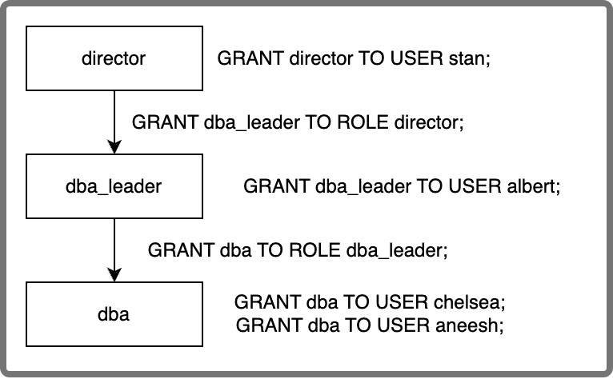

# role_edges

`role_edges` ビューをクエリすることで、ロールの被付与者を確認できます。

:::note

デフォルトでは、`user_admin` ロールを持つユーザーまたはロールのみがこのビューにアクセスできます。他のユーザーにこのビューの SELECT 権限を付与するには、[GRANT](../../sql-reference/sql-statements/account-management/GRANT.md) を使用してください。

:::

`role_edges` には以下のフィールドが提供されています:

| **Field** | **Description**                                              |
| --------- | ------------------------------------------------------------ |
| FROM_ROLE | 付与されたロールです。同じ `FROM_ROLE` を持つ複数のレコードが返されることがあります。これは、1つのロールが複数のロールやユーザーに付与される可能性があるためです。 |
| TO_ROLE   | 現在の `FROM_ROLE` が付与されているロールです。現在の `FROM_ROLE` がユーザーに付与されている場合は `NULL` が返されます。 |
| TO_USER   | 現在の `FROM_ROLE` が付与されているユーザーです。現在の `FROM_ROLE` がロールに付与されている場合は `NULL` が返されます。 |

例:

```Plain
MySQL > SELECT * FROM sys.role_edges;
+------------+------------+---------------+
| FROM_ROLE  | TO_ROLE    | TO_USER       |
+------------+------------+---------------+
| dba_leader | director   | NULL          |
| dba        | dba_leader | NULL          |
| dba        | NULL       | 'aneesh'@'%'  |
| dba        | NULL       | 'chelsea'@'%' |
| dba_leader | NULL       | 'albert'@'%'  |
| director   | NULL       | 'stan'@'%'    |
| root       | NULL       | 'root'@'%'    |
+------------+------------+---------------+
```

次の図は、前述の例における付与されたロールのネスト関係を示しています:

