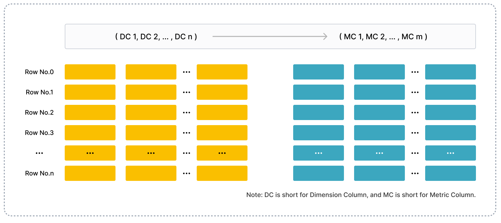

# テーブル設計を理解する

## 列指向（カラムナ）ストレージ

他のリレーショナルデータベースと同様に、StarRocks のテーブルは行と列で構成されています。各行はユーザーデータのレコードを保持し、各列のデータは同じ型を持ちます。テーブル内のすべての行は同じ数の列を持ちます。テーブルに列を動的に追加したり削除したりできます。テーブルの列は、ディメンション列とメトリック列に分類できます。ディメンション列はキー列とも呼ばれ、メトリック列は値列とも呼ばれます。ディメンション列の値はデータのグループ化やソートに使用され、メトリック列の値は sum、count、min、max、hll_union_agg、bitmap_union などの関数を使用して蓄積できます。

StarRocks はテーブルに列指向（カラムナ）ストレージを使用します。物理的には、列のデータはデータブロックに分割され、エンコードされ、圧縮され、ディスクに永続的に保存されます。論理的には、列のデータは同じデータ型の要素からなる配列に例えられます。行に保持される列の値は、それぞれの配列内で列順に要素としてリストされます。つまり、行に保持される列の値は同じ配列インデックスを持ちます。配列インデックスは暗黙的であり、保存する必要はありません。テーブル内のすべての行は、1つ以上のディメンション列で指定された順序でソートされます。ソートされたテーブル内の行の位置は、その行のシーケンス番号で表されます。

テーブルに対するクエリでは、特定のディメンション列に対して等価条件または範囲条件を指定する場合、StarRocks はバイナリ検索を実行して、ソートされたデータの中から関心のある行を迅速に特定できます。例えば、`table1` という名前のテーブルからデータをクエリしたい場合、このテーブルは `event_day`、`siteid`、`citycode`、`username` の4つの列で構成されており、その中で `event_day` と `siteid` はディメンション列です。クエリ条件として `event_day = 2020-09-18` と `siteid = 2` を指定すると、StarRocks はバイナリ検索を実行し、指定された範囲内のデータのみを処理する必要があります。なぜなら、`event_day` と `siteid` はディメンション列のプレフィックスを構成できるからです。`citycode = 4` と `username = Andy` をクエリ条件として指定すると、StarRocks はバイナリ検索を実行できず、テーブル全体のデータを処理する必要があります。なぜなら、`citycode` と `username` はディメンション列のプレフィックスを構成できないからです。

## インデックス

StarRocks は、プレフィックスインデックスと列ごとのインデックスを使用して、関心のある行が占めるデータブロックの開始行を迅速に特定します。

次の図は、StarRocks のテーブル設計が StarRocks のテーブルに対するクエリをどのように加速するかを示しています。

StarRocks のテーブルデータは、次の3つの部分に組織化されています。

- プレフィックスインデックス
  
  StarRocks は、1024 行ごとにデータをデータブロックとして保存し、そのエントリをプレフィックスインデックステーブルに保持します。各データブロックのプレフィックスインデックスエントリの内容は、データブロックの開始行のディメンション列で構成されるプレフィックスで、36 バイトを超えることはできません。プレフィックスインデックスはスパースインデックスです。行をクエリする際、StarRocks はプレフィックスインデックステーブルを検索して、行のディメンション列で構成されるプレフィックスを取得します。次に、StarRocks は関心のある行が占めるデータブロックの開始行のシーケンス番号を迅速に特定できます。

- 列ごとのデータブロック
  
  StarRocks は、各列のデータを複数の 64-KB データブロックに分割します。各データブロックは独立してエンコードおよび圧縮され、最小の I/O 単位としてディスクから読み取られたり、ディスクに書き込まれたりします。

- 列ごとのインデックス
  
  StarRocks は、各列に対して行番号インデックスを保持します。行番号インデックステーブルでは、列のデータブロックが列に保持されている行のシーケンス番号に一対一でマッピングされます。さらに、行番号インデックステーブルの各エントリは、特定の行番号にマッピングされたデータブロックの開始行番号、アドレス、および長さで構成されます。行をクエリする際、StarRocks は行番号インデックステーブルを検索して、行のシーケンス番号にマッピングされたデータブロックのアドレスを取得します。次に、StarRocks はデータブロックを読み取り、行を特定します。

まとめると、StarRocks は、行のディメンション列で構成されるプレフィックスを使用して、テーブルの行を特定するために次の5つのステップを実行します。

1. プレフィックスインデックステーブルを検索して、関心のある行が占めるデータブロックの開始行のシーケンス番号を特定します。

2. 各ディメンション列の行番号インデックステーブルを検索して、ディメンション列のデータブロックを特定します。

3. データブロックを読み取ります。

4. データブロックを解凍およびデコードします。

5. データブロックを検索して、ディメンション列インデックスがマッピングされている行を特定します。

## 処理の加速

このセクションでは、StarRocks がデータを高速で処理するためのメカニズムを紹介します。

### 事前集計

StarRocks は集計テーブルを提供します。集計テーブルでは、テーブルのディメンション列に同じ値を持つ行を1つの行に集約できます。集約から生成された新しい行の各ディメンション列の値は変更されず、各メトリック列の値は指定した集計関数によって集約され、新しい行のメトリック列の結果値が生成されます。事前集計は集計操作を加速するのに役立ちます。

### パーティショニングとバケッティング

StarRocks の各テーブルは複数のタブレットに分割されます。各タブレットは複数のレプリカとして BEs に保存されます。BEs の数とタブレットの数は、コンピューティングリソースやデータサイズの変化に応じて柔軟にスケールできます。クエリを開始すると、複数の BEs が並行してタブレットを検索し、関心のあるデータを迅速に特定できます。さらに、タブレットレプリカは複製および移行可能であり、データの信頼性を高め、データの偏りを防ぎます。パーティショニングとバケッティングは、データ取得の効率性と安定性を確保するのに役立ちます。

### マテリアライズドビュー

テーブルのプレフィックスインデックスは、テーブルに対するクエリを加速しますが、テーブルのディメンション列の順序に依存します。ディメンション列プレフィックスに含まれていないディメンション列を使用してクエリ条件を構築する場合、プレフィックスインデックスは機能しません。この場合、テーブルに対してマテリアライズドビューを作成できます。マテリアライズドビューのデータは、テーブルのデータと同じ方法で組織化および保存されます。ただし、マテリアライズドビューは独自のプレフィックスインデックスを持つことができます。マテリアライズドビューのプレフィックスインデックスを作成する際には、適切な集約粒度、列数、およびディメンション列の順序を指定して、頻繁に使用されるクエリ条件がマテリアライズドビューのプレフィックスインデックステーブルで期待されるエントリにヒットするようにします。

### 列ごとのインデックス

StarRocks は、Bloom フィルター、ゾーンマップ、ビットマップインデックスなどの列ごとのインデックスをサポートしています。

- Bloom フィルターは、データブロックがクエリしたい値を含んでいるかどうかを判断するために使用されます。

- ゾーンマップは、指定された範囲内の値を特定するために使用されます。

- ビットマップインデックスは、ENUM データ型の列で指定されたクエリ条件を満たす行を特定するために使用されます。