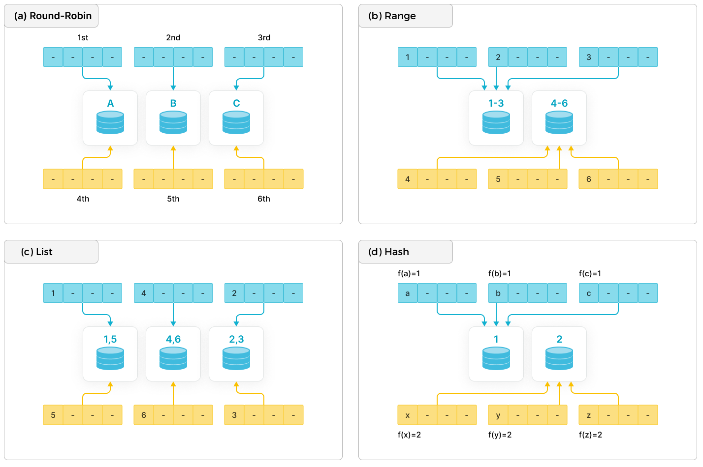

# データ分散

import Tabs from '@theme/Tabs';
import TabItem from '@theme/TabItem';

テーブル作成時に適切なパーティション化とバケッティングを設定することで、均等なデータ分散を実現できます。均等なデータ分散とは、特定のルールに基づいてデータをサブセットに分割し、異なるノードに均等に分散することを意味します。これにより、スキャンするデータ量を減らし、クラスターの並列処理能力を最大限に活用することで、クエリパフォーマンスを向上させることができます。

> **注意**
>
> - テーブル作成時にデータ分散が指定され、ビジネスシナリオにおけるクエリパターンやデータ特性が進化した場合、v3.2以降のStarRocksでは、[テーブル作成後に特定のデータ分散関連プロパティを変更](#optimize-data-distribution-after-table-creation-since-32)して、最新のビジネスシナリオにおけるクエリパフォーマンスの要件を満たすことができます。
> - v3.1以降、テーブル作成時やパーティション追加時にDISTRIBUTED BY句でバケッティングキーを指定する必要はありません。StarRocksはランダムバケット法をサポートしており、データをすべてのバケットにランダムに分散します。詳細は[ランダムバケット法](#random-bucketing-since-v31)を参照してください。
> - v2.5.7以降、テーブル作成時やパーティション追加時にバケット数を手動で設定しないことを選択できます。StarRocksは自動的にバケット数 (BUCKETS) を設定します。ただし、StarRocksが自動的にバケット数を設定した後にパフォーマンスが期待に応えない場合で、バケッティングメカニズムに精通している場合は、[バケット数を手動で設定](#set-the-number-of-buckets)することもできます。

## 概要

### 一般的な分散方法

現代の分散データベースシステムは、一般的に次の基本的な分散方法を使用します: ラウンドロビン、レンジ、リスト、ハッシュ。



- **ラウンドロビン**: データを異なるノードに循環的に分散します。
- **レンジ**: パーティション列の値の範囲に基づいてデータを異なるノードに分散します。図に示すように、範囲 [1-3] と [4-6] は異なるノードに対応しています。
- **リスト**: パーティション列の離散値に基づいてデータを異なるノードに分散します。たとえば、性別や州などの離散値が各ノードにマッピングされ、複数の異なる値が同じノードにマッピングされることがあります。
- **ハッシュ**: ハッシュ関数に基づいてデータを異なるノードに分散します。

より柔軟なデータパーティション化を実現するために、上記のデータ分散方法のいずれかを使用するだけでなく、特定のビジネス要件に基づいてこれらの方法を組み合わせることもできます。一般的な組み合わせには、ハッシュ+ハッシュ、レンジ+ハッシュ、ハッシュ+リストがあります。

### StarRocksにおける分散方法

StarRocksは、データ分散方法の個別使用と複合使用の両方をサポートしています。

> **注意**
>
> 一般的な分散方法に加えて、StarRocksはバケッティング設定を簡素化するためにランダム分散もサポートしています。

また、StarRocksは2レベルのパーティション化 + バケッティング方法を実装してデータを分散します。

- 第1レベルはパーティション化です: テーブル内のデータはパーティション化できます。サポートされているパーティション化の手法は、式に基づくパーティション化、レンジパーティション化、リストパーティション化です。また、パーティション化を使用しないことも選択できます（テーブル全体が1つのパーティションと見なされます）。
- 第2レベルはバケッティングです: パーティション内のデータはさらに小さなバケットに分配する必要があります。サポートされているバケッティング方法は、ハッシュとランダムバケット法です。

| **分散方法**               | **パーティション化とバケッティング方法**                        | **説明**                                              |
| ------------------------- | ------------------------------------------------------------ | ------------------------------------------------------------ |
| ランダム分散               | ランダムバケット法                                             | テーブル全体が1つのパーティションと見なされます。テーブル内のデータは異なるバケットにランダムに分配されます。これはデフォルトのデータ分散方法です。 |
| ハッシュ分散              | ハッシュバケット法                                             | テーブル全体が1つのパーティションと見なされます。テーブル内のデータは、ハッシュ関数を使用してデータのバケッティングキーのハッシュ値に基づいて対応するバケットに分配されます。 |
| レンジ+ランダム分散       | <ol><li>式に基づくパーティション化またはレンジパーティション化 </li><li>ランダムバケット法 </li></ol> | <ol><li>テーブル内のデータは、パーティション列の値が属する範囲に基づいて対応するパーティションに分配されます。 </li><li>パーティション内のデータは異なるバケットにランダムに分配されます。 </li></ol> |
| レンジ+ハッシュ分散       | <ol><li>式に基づくパーティション化またはレンジパーティション化</li><li>ハッシュバケット法 </li></ol> | <ol><li>テーブル内のデータは、パーティション列の値が属する範囲に基づいて対応するパーティションに分配されます。</li><li>パーティション内のデータは、ハッシュ関数を使用してデータのバケッティングキーのハッシュ値に基づいて対応するバケットに分配されます。</li></ol> |
| リスト+ランダム分散       | <ol><li>式に基づくパーティション化またはリストパーティション化</li><li>ランダムバケット法 </li></ol> | <ol><li>テーブル内のデータは、パーティション列の値が属する範囲に基づいて対応するパーティションに分配されます。</li><li>パーティション内のデータは異なるバケットにランダムに分配されます。</li></ol> |
| リスト+ハッシュ分散       | <ol><li>式に基づくパーティション化またはリストパーティション化</li><li>ハッシュバケット法 </li></ol> | <ol><li>テーブル内のデータは、パーティション列の値リストに基づいてパーティション化されます。</li><li>パーティション内のデータは、ハッシュ関数を使用してデータのバケッティングキーのハッシュ値に基づいて対応するバケットに分配されます。</li></ol> |

#### ランダム分散

  テーブル作成時にパーティション化とバケッティング方法を設定しない場合、デフォルトでランダム分散が使用されます。この分散方法は現在、重複キーテーブルの作成にのみ使用できます。

  ```SQL
  CREATE TABLE site_access1 (
      event_day DATE,
      site_id INT DEFAULT '10', 
      pv BIGINT DEFAULT '0' ,
      city_code VARCHAR(100),
      user_name VARCHAR(32) DEFAULT ''
  )
  DUPLICATE KEY (event_day,site_id,pv);
  -- パーティション化とバケッティング方法が設定されていないため、デフォルトでランダム分散が使用されます。
  ```

#### ハッシュ分散

  ```SQL
  CREATE TABLE site_access2 (
      event_day DATE,
      site_id INT DEFAULT '10',
      city_code SMALLINT,
      user_name VARCHAR(32) DEFAULT '',
      pv BIGINT SUM DEFAULT '0'
  )
  AGGREGATE KEY (event_day, site_id, city_code, user_name)
  -- バケッティング方法としてハッシュバケット法を使用し、バケッティングキーを指定する必要があります。
  DISTRIBUTED BY HASH(event_day,site_id); 
  ```

#### レンジ+ランダム分散

(この分散方法は現在、重複キーテーブルの作成にのみ使用できます。)

  ```SQL
  CREATE TABLE site_access3 (
      event_day DATE,
      site_id INT DEFAULT '10', 
      pv BIGINT DEFAULT '0' ,
      city_code VARCHAR(100),
      user_name VARCHAR(32) DEFAULT ''
  )
  DUPLICATE KEY(event_day,site_id,pv)
  -- パーティション化の手法として式に基づくパーティション化を使用し、時間関数式を設定します。
  -- レンジパーティション化を使用することもできます。
  PARTITION BY date_trunc('day', event_day);
  -- バケッティング方法が設定されていないため、デフォルトでランダムバケット法が使用されます。
  ```

#### レンジ+ハッシュ分散

  ```SQL
  CREATE TABLE site_access4 (
      event_day DATE,
      site_id INT DEFAULT '10',
      city_code VARCHAR(100),
      user_name VARCHAR(32) DEFAULT '',
      pv BIGINT SUM DEFAULT '0'
  )
  AGGREGATE KEY(event_day, site_id, city_code, user_name)
  -- パーティション化の手法として式に基づくパーティション化を使用し、時間関数式を設定します。
  -- レンジパーティション化を使用することもできます。
  PARTITION BY date_trunc('day', event_day)
  -- バケッティング方法としてハッシュバケット法を使用し、バケッティングキーを指定する必要があります。
  DISTRIBUTED BY HASH(event_day, site_id);
  ```

#### リスト+ランダム分散

(この分散方法は現在、重複キーテーブルの作成にのみ使用できます。)

  ```SQL
  CREATE TABLE t_recharge_detail1 (
      id bigint,
      user_id bigint,
      recharge_money decimal(32,2), 
      city varchar(20) not null,
      dt date not null
  )
  DUPLICATE KEY(id)
  -- パーティション化の手法として式に基づくパーティション化を使用し、パーティション列を指定します。
  -- リストパーティション化を使用することもできます。
  PARTITION BY (city);
  -- バケッティング方法が設定されていないため、デフォルトでランダムバケット法が使用されます。
  ```

#### リスト+ハッシュ分散

  ```SQL
  CREATE TABLE t_recharge_detail2 (
      id bigint,
      user_id bigint,
      recharge_money decimal(32,2), 
      city varchar(20) not null,
      dt date not null
  )
  DUPLICATE KEY(id)
  -- パーティション化の手法として式に基づくパーティション化を使用し、パーティション列を指定します。
  -- リストパーティション化を使用することもできます。
  PARTITION BY (city)
  -- バケッティング方法としてハッシュバケット法を使用し、バケッティングキーを指定する必要があります。
  DISTRIBUTED BY HASH(city,id); 
  ```

#### パーティション化

パーティション化の手法は、テーブルを複数のパーティションに分割します。パーティション化は主に、パーティションキーに基づいてテーブルを異なる管理単位（パーティション）に分割するために使用されます。各パーティションに対して、バケット数、ホットデータとコールドデータの保存戦略、記憶媒体のタイプ、レプリカの数などのストレージ戦略を設定できます。StarRocksは、クラスター内で異なるタイプの記憶媒体を使用することを許可しています。たとえば、最新のデータをソリッドステートドライブ（SSD）に保存してクエリパフォーマンスを向上させ、履歴データをSATAハードドライブに保存してストレージコストを削減することができます。

| **パーティション化の手法**                   | **シナリオ**                                                    | **パーティションを作成する方法**               |
| ------------------------------------- | ------------------------------------------------------------ | ------------------------------------------ |
| 式に基づくパーティション化 (推奨) | 以前は自動パーティション化として知られていました。このパーティション化の手法はより柔軟で使いやすく、連続した日付範囲や列挙値に基づいてデータをクエリおよび管理するほとんどのシナリオに適しています。 | データロード中に自動的に作成されます |
| レンジパーティション化 (レガシー)           | 典型的なシナリオは、連続した日付/数値範囲に基づいて頻繁にクエリおよび管理されるシンプルで順序付けられたデータを保存することです。たとえば、特定のケースでは、履歴データを月ごとにパーティション化し、最近のデータを日ごとにパーティション化する必要があります。 | 手動で、動的に、またはバッチで作成されます |
| リストパーティション化 (レガシー)            | 典型的なシナリオは、列挙値に基づいてデータをクエリおよび管理し、各パーティション列の異なる値を含むデータを含む必要がある場合です。たとえば、国や都市に基づいて頻繁にデータをクエリおよび管理する場合、この方法を使用し、`city`をパーティション列として選択できます。したがって、1つのパーティションは同じ国に属する複数の都市のデータを保存できます。 | 手動で作成されます                           |

##### パーティション列と粒度の選択方法

パーティションキーは1つ以上のパーティション列で構成されます。適切なパーティション列を選択することで、クエリ時にスキャンするデータ量を効果的に減らすことができます。ほとんどのビジネスシステムでは、時間に基づくパーティション化が一般的に採用されており、期限切れデータの削除による特定の問題を解決し、ホットデータとコールドデータの階層型ストレージの管理を容易にします。この場合、式に基づくパーティション化またはレンジパーティション化を使用し、時間列をパーティション列として指定できます。さらに、データが頻繁にENUM値に基づいてクエリおよび管理される場合、式に基づくパーティション化またはリストパーティション化を使用し、これらの値を含む列をパーティション列として指定できます。
- パーティション粒度を選択する際には、データ量、クエリパターン、データ管理の粒度を考慮する必要があります。
  - 例1: テーブル内の月間データ量が少ない場合、日ごとにパーティション化するよりも月ごとにパーティション化することでメタデータの量を減らし、メタデータ管理とスケジューリングのリソース消費を削減できます。
  - 例2: テーブル内の月間データ量が多く、クエリが特定の日のデータを主に要求する場合、日ごとにパーティション化することでクエリ時にスキャンするデータ量を効果的に減らすことができます。
  - 例3: データが日ごとに期限切れになる必要がある場合、日ごとにパーティション化することをお勧めします。

#### バケッティング

バケッティングの手法は、パーティションを複数のバケットに分割します。バケット内のデータはtabletと呼ばれます。

サポートされているバケッティング方法は、[ランダムバケット法](#random-bucketing-since-v31) (v3.1以降) と [ハッシュバケット法](#hash-bucketing) です。

- ランダムバケット法: テーブル作成時またはパーティション追加時にバケッティングキーを設定する必要はありません。パーティション内のデータは異なるバケットにランダムに分配されます。

- ハッシュバケット法: テーブル作成時またはパーティション追加時にバケッティングキーを指定する必要があります。同じパーティション内のデータはバケッティングキーの値に基づいてバケットに分割され、バケッティングキーの同じ値を持つ行は対応するユニークなバケットに分配されます。

バケット数: デフォルトでは、StarRocksは自動的にバケット数を設定します (v2.5.7以降)。バケット数を手動で設定することもできます。詳細については、[バケット数の決定](#set-the-number-of-buckets)を参照してください。

## パーティションの作成と管理

### パーティションの作成

#### 式に基づくパーティション化 (推奨)

> **注意**
>
> StarRocksの共有データモードは、v3.1.0から時間関数式を、v3.1.1から列式をサポートしています。

v3.0以降、StarRocksは[式に基づくパーティション化](expression_partitioning.md)をサポートしており、以前は自動パーティション化として知られていました。このパーティション化の手法は、連続した日付範囲やENUM値に基づいてデータをクエリおよび管理するほとんどのシナリオに適しています。

テーブル作成時にパーティション式を設定するだけで、StarRocksはデータロード中に自動的にパーティションを作成します。事前に多数のパーティションを手動で作成する必要はなく、動的パーティションプロパティを設定する必要もありません。

v3.4以降、式に基づくパーティション化はさらに最適化され、すべてのパーティション戦略を統一し、より複雑なソリューションをサポートします。ほとんどの場合に推奨されており、将来のリリースで他のパーティション戦略を置き換える予定です。

例1: DATETIME列を使用したシンプルな時間関数式。

```SQL
CREATE TABLE site_access(
    event_day DATETIME NOT NULL,
    site_id INT DEFAULT '10',
    city_code VARCHAR(100),
    user_name VARCHAR(32) DEFAULT '',
    pv BIGINT DEFAULT '0'
)
DUPLICATE KEY(event_day, site_id, city_code, user_name)
PARTITION BY time_slice(event_day, INTERVAL 7 day)
DISTRIBUTED BY HASH(event_day, site_id)
```

例2: 複数の列を使用した列式。

```SQL
CREATE TABLE t_recharge_detail1 (
    id bigint,
    user_id bigint,
    recharge_money decimal(32,2), 
    city varchar(20) not null,
    dt varchar(20) not null
)
DUPLICATE KEY(id)
PARTITION BY dt,city
DISTRIBUTED BY HASH(`id`);
```

例3: Unixタイムスタンプ列を使用した複雑な時間関数式。

```SQL
CREATE TABLE orders (
    ts BIGINT NOT NULL,
    id BIGINT NOT NULL,
    city STRING NOT NULL
)
PARTITION BY from_unixtime(ts,'%Y%m%d');
```

例4: 時間関数式と列式の混合式。

```SQL
CREATE TABLE orders (
    ts BIGINT NOT NULL,
    id BIGINT NOT NULL,
    city STRING NOT NULL
)
PARTITION BY from_unixtime(ts,'%Y%m%d'), city;
```

#### レンジパーティション化

レンジパーティション化は、時系列データや連続した数値データなどのシンプルな連続データを保存するのに適しています。レンジパーティション化は、連続した日付/数値範囲に基づいて頻繁にクエリされるデータに適しています。さらに、特定のケースでは、履歴データを月ごとにパーティション化し、最近のデータを日ごとにパーティション化する必要があります。

データロード中に、StarRocksはデータのパーティション列の値が属する範囲に基づいてデータを対応するパーティションに割り当てます。

パーティション列のデータ型については、v3.3.0以前は、レンジパーティション化は日付型と整数型のパーティション列のみをサポートしていました。v3.3.0以降、3つの特定の時間関数をパーティション列として使用できます。パーティション列の値の範囲とパーティションのマッピング関係を明示的に定義する際には、特定の時間関数を使用してタイムスタンプまたは文字列のパーティション列の値を日付値に変換し、変換された日付値に基づいてパーティションを分割する必要があります。

:::info

- パーティション列の値がタイムスタンプの場合、パーティションを分割する際にはfrom_unixtimeまたはfrom_unixtime_ms関数を使用してタイムスタンプを日付値に変換する必要があります。from_unixtime関数を使用する場合、パーティション列はINTおよびBIGINT型のみをサポートします。from_unixtime_ms関数を使用する場合、パーティション列はBIGINT型のみをサポートします。
- パーティション列の値が文字列（STRING、VARCHAR、またはCHAR型）の場合、パーティションを分割する際にはstr2date関数を使用して文字列を日付値に変換する必要があります。

:::

##### パーティションを手動で作成

各パーティションとパーティション列の値の範囲とのマッピング関係を定義します。

###### パーティション列が日付型の場合。

    ```SQL
    CREATE TABLE site_access(
        event_day DATE,
        site_id INT,
        city_code VARCHAR(100),
        user_name VARCHAR(32),
        pv BIGINT SUM DEFAULT '0'
    )
    AGGREGATE KEY(event_day, site_id, city_code, user_name)
    PARTITION BY RANGE(event_day)(
        PARTITION p1 VALUES LESS THAN ("2020-01-31"),
        PARTITION p2 VALUES LESS THAN ("2020-02-29"),
        PARTITION p3 VALUES LESS THAN ("2020-03-31")
    )
    DISTRIBUTED BY HASH(site_id);
    ```

###### パーティション列が整数型の場合。

    ```SQL
    CREATE TABLE site_access(
        datekey INT,
        site_id INT,
        city_code SMALLINT,
        user_name VARCHAR(32),
        pv BIGINT SUM DEFAULT '0'
    )
    AGGREGATE KEY(datekey, site_id, city_code, user_name)
    PARTITION BY RANGE (datekey) (
        PARTITION p1 VALUES LESS THAN ("20200131"),
        PARTITION p2 VALUES LESS THAN ("20200229"),
        PARTITION p3 VALUES LESS THAN ("20200331")
    )
    DISTRIBUTED BY HASH(site_id);
    ```

###### 3つの特定の時間関数をパーティション列として使用できます (v3.3.0以降でサポート)。
  
  パーティション列の値の範囲とパーティションのマッピング関係を明示的に定義する際には、特定の時間関数を使用してタイムスタンプまたは文字列のパーティション列の値を日付値に変換し、変換された日付値に基づいてパーティションを分割することができます。

  <Tabs groupId="manual partitioning">
  <TabItem value="example1" label="パーティション列の値がタイムスタンプの場合" default>

  ```SQL
  -- 秒単位の10桁のタイムスタンプ、例: 1703832553。
  CREATE TABLE site_access(
      event_time bigint,
      site_id INT,
      city_code SMALLINT,
      user_name VARCHAR(32),
      pv BIGINT SUM DEFAULT '0'
    )
  AGGREGATE KEY(event_time, site_id, city_code, user_name)
  PARTITION BY RANGE(from_unixtime(event_time)) (
      PARTITION p1 VALUES LESS THAN ("2021-01-01"),
      PARTITION p2 VALUES LESS THAN ("2021-01-02"),
      PARTITION p3 VALUES LESS THAN ("2021-01-03")
  )
  DISTRIBUTED BY HASH(site_id)
  ;
  
  -- ミリ秒単位の13桁のタイムスタンプ、例: 1703832553219。
  CREATE TABLE site_access(
      event_time bigint,
      site_id INT,
      city_code SMALLINT,
      user_name VARCHAR(32),
      pv BIGINT SUM DEFAULT '0'
    )
  AGGREGATE KEY(event_time, site_id, city_code, user_name)
  PARTITION BY RANGE(from_unixtime_ms(event_time))(
      PARTITION p1 VALUES LESS THAN ("2021-01-01"),
      PARTITION p2 VALUES LESS THAN ("2021-01-02"),
      PARTITION p3 VALUES LESS THAN ("2021-01-03")
  )
  DISTRIBUTED BY HASH(site_id);
  ```

  </TabItem>
  <TabItem value="example2" label="パーティション列の値が文字列の場合">

    ```SQL
    CREATE TABLE site_access (
         event_time  varchar(100),
         site_id INT,
         city_code SMALLINT,
         user_name VARCHAR(32),
         pv BIGINT SUM DEFAULT '0'
    )
    AGGREGATE KEY(event_time, site_id, city_code, user_name)
    PARTITION BY RANGE(str2date(event_time, '%Y-%m-%d'))(
        PARTITION p1 VALUES LESS THAN ("2021-01-01"),
        PARTITION p2 VALUES LESS THAN ("2021-01-02"),
        PARTITION p3 VALUES LESS THAN ("2021-01-03")
    )
    DISTRIBUTED BY HASH(site_id);
    ```

  </TabItem>
  </Tabs>

##### 動的パーティション化

[動的パーティション化](dynamic_partitioning.md)関連のプロパティは、テーブル作成時に設定されます。StarRocksは、データの新鮮さを確保するために、新しいパーティションを事前に自動的に作成し、期限切れのパーティションを削除します。これにより、パーティションのタイムトゥリブ (TTL) 管理が実現されます。

式に基づくパーティション化によって提供される自動パーティション作成機能とは異なり、動的パーティション化はプロパティに基づいて定期的に新しいパーティションを作成することしかできません。新しいデータがこれらのパーティションに属していない場合、ロードジョブに対してエラーが返されます。ただし、式に基づくパーティション化によって提供される自動パーティション作成機能は、ロードされたデータに基づいて常に対応する新しいパーティションを作成できます。

##### 複数のパーティションをバッチで作成

テーブル作成時および作成後に複数のパーティションをバッチで作成できます。`START()` と `END()` でバッチで作成されるすべてのパーティションの開始時刻と終了時刻を指定し、`EVERY()` でパーティションの増分値を指定します。ただし、パーティションの範囲は左閉右開であり、開始時刻を含み、終了時刻を含まないことに注意してください。パーティションの命名ルールは動的パーティション化と同じです。

###### パーティション列が日付型の場合。

  パーティション列が日付型の場合、テーブル作成時に `START()` と `END()` を使用してバッチで作成されるすべてのパーティションの開始日と終了日を指定し、`EVERY(INTERVAL xxx)` を使用して2つのパーティション間の増分間隔を指定できます。現在、間隔の粒度は `HOUR` (v3.0以降)、`DAY`、`WEEK`、`MONTH`、および `YEAR` をサポートしています。

  <Tabs groupId="batch partitioning(date)">
  <TabItem value="example1" label="同じ日付間隔で" default>
  
  次の例では、バッチで作成されるパーティションは `2021-01-01` から始まり、`2021-01-04` で終わり、パーティションの増分は1日です:  

    ```SQL
    CREATE TABLE site_access (
        datekey DATE,
        site_id INT,
        city_code SMALLINT,
        user_name VARCHAR(32),
        pv BIGINT DEFAULT '0'
    )
    DUPLICATE KEY(datekey, site_id, city_code, user_name)
    PARTITION BY RANGE (datekey) (
        START ("2021-01-01") END ("2021-01-04") EVERY (INTERVAL 1 DAY)
    )
    DISTRIBUTED BY HASH(site_id);
    ```

    これは、CREATE TABLE文で次の `PARTITION BY` 句を使用するのと同等です:

    ```SQL
    PARTITION BY RANGE (datekey) (
        PARTITION p20210101 VALUES [('2021-01-01'), ('2021-01-02')),
        PARTITION p20210102 VALUES [('2021-01-02'), ('2021-01-03')),
        PARTITION p20210103 VALUES [('2021-01-03'), ('2021-01-04'))
    )
    ```

  </TabItem>
  <TabItem value="example2" label="異なる日付間隔で">

  異なる増分間隔を持つ日付パーティションのバッチを作成するには、各バッチのパーティションに対して `EVERY` で異なる増分間隔を指定します（異なるバッチ間でパーティション範囲が重ならないようにしてください）。各バッチのパーティションは、`START (xxx) END (xxx) EVERY (xxx)` 句に従って作成されます。例:

    ```SQL
    CREATE TABLE site_access (
        datekey DATE,
        site_id INT,
        city_code SMALLINT,
        user_name VARCHAR(32),
        pv BIGINT DEFAULT '0'
    )
    DUPLICATE KEY(datekey, site_id, city_code, user_name)
    PARTITION BY RANGE (datekey) (
        START ("2019-01-01") END ("2021-01-01") EVERY (INTERVAL 1 YEAR),
        START ("2021-01-01") END ("2021-05-01") EVERY (INTERVAL 1 MONTH),
        START ("2021-05-01") END ("2021-05-04") EVERY (INTERVAL 1 DAY)
    )
    DISTRIBUTED BY HASH(site_id);
    ```

    これは、CREATE TABLE文で次の `PARTITION BY` 句を使用するのと同等です:

    ```SQL
    PARTITION BY RANGE (datekey) (
        PARTITION p2019 VALUES [('2019-01-01'), ('2020-01-01')),
        PARTITION p2020 VALUES [('2020-01-01'), ('2021-01-01')),
        PARTITION p202101 VALUES [('2021-01-01'), ('2021-02-01')),
        PARTITION p202102 VALUES [('2021-02-01'), ('2021-03-01')),
        PARTITION p202103 VALUES [('2021-03-01'), ('2021-04-01')),
        PARTITION p202104 VALUES [('2021-04-01'), ('2021-05-01')),
        PARTITION p20210501 VALUES [('2021-05-01'), ('2021-05-02')),
        PARTITION p20210502 VALUES [('2021-05-02'), ('2021-05-03')),
        PARTITION p20210503 VALUES [('2021-05-03'), ('2021-05-04'))
    )
    ```

    </TabItem>
    </Tabs>

###### パーティション列が整数型の場合。

  パーティション列のデータ型がINTの場合、`START` と `END` でパーティションの範囲を指定し、`EVERY` で増分値を定義します。例:

  > **注意**
  >
  > **START()** および **END()** のパーティション列の値はダブルクォーテーションで囲む必要がありますが、**EVERY()** の増分値はダブルクォーテーションで囲む必要はありません。

  <Tabs groupId="batch partitioning(integer)">
  <TabItem value="example1" label="同じ数値間隔で" default>

  次の例では、すべてのパーティションの範囲は `1` から始まり、`5` で終わり、パーティションの増分は `1` です:

    ```SQL
    CREATE TABLE site_access (
        datekey INT,
        site_id INT,
        city_code SMALLINT,
        user_name VARCHAR(32),
        pv BIGINT DEFAULT '0'
    )
    DUPLICATE KEY(datekey, site_id, city_code, user_name)
    PARTITION BY RANGE (datekey) (
        START ("1") END ("5") EVERY (1)
    )
    DISTRIBUTED BY HASH(site_id);
    ```

  これは、CREATE TABLE文で次の `PARTITION BY` 句を使用するのと同等です:

```SQL
    PARTITION BY RANGE (datekey) (
        PARTITION p1 VALUES [("1"), ("2")),
        PARTITION p2 VALUES [("2"), ("3")),
        PARTITION p3 VALUES [("3"), ("4")),
        PARTITION p4 VALUES [("4"), ("5"))
    )
    ```

  </TabItem>
  <TabItem value="example2" label="異なる数値間隔で">

  異なる増分間隔を持つ数値パーティションのバッチを作成するには、各バッチのパーティションに対して `EVERY` で異なる増分間隔を指定します（異なるバッチ間でパーティション範囲が重ならないようにしてください）。各バッチのパーティションは、`START (xxx) END (xxx) EVERY (xxx)` 句に従って作成されます。例:

    ```SQL
    CREATE TABLE site_access (
        datekey INT,
        site_id INT,
        city_code SMALLINT,
        user_name VARCHAR(32),
        pv BIGINT DEFAULT '0'
    )
    DUPLICATE KEY(datekey, site_id, city_code, user_name)
    PARTITION BY RANGE (datekey) (
        START ("1") END ("10") EVERY (1),
        START ("10") END ("100") EVERY (10)
    )
    DISTRIBUTED BY HASH(site_id);
    ```

  </TabItem>
  </Tabs>

###### 3つの特定の時間関数をパーティション列として使用できます (v3.3.0以降でサポート)。
  
  パーティション列の値の範囲とパーティションのマッピング関係を明示的に定義する際には、特定の時間関数を使用してタイムスタンプまたは文字列のパーティション列の値を日付値に変換し、変換された日付値に基づいてパーティションを分割することができます。

  <Tabs groupId="batch partitioning(timestamp and string)">
  <TabItem value="example1" label="パーティション列の値がタイムスタンプの場合" default>

  ```SQL
  -- 秒単位の10桁のタイムスタンプ、例: 1703832553。
  CREATE TABLE site_access(
      event_time bigint,
      site_id INT,
      city_code SMALLINT,
      user_name VARCHAR(32),
      pv BIGINT DEFAULT '0'
    )
  PARTITION BY RANGE(from_unixtime(event_time)) (
      START ("2021-01-01") END ("2021-01-10") EVERY (INTERVAL 1 DAY)
  )
  DISTRIBUTED BY HASH(site_id);
  -- ミリ秒単位の13桁のタイムスタンプ、例: 1703832553219。
  CREATE TABLE site_access(
      event_time bigint,
      site_id INT,
      city_code SMALLINT,
      user_name VARCHAR(32),
      pv BIGINT DEFAULT '0'
  )
  PARTITION BY RANGE(from_unixtime_ms(event_time))(
      START ("2021-01-01") END ("2021-01-10") EVERY (INTERVAL 1 DAY)
  )
  DISTRIBUTED BY HASH(site_id);
  ```

  </TabItem>
  <TabItem value="example2" label="パーティション列の値が文字列の場合">

    ```SQL
    CREATE TABLE site_access (
         event_time  varchar(100),
         site_id INT,
         city_code SMALLINT,
         user_name VARCHAR(32),
         pv BIGINT DEFAULT '0'
  )
    PARTITION BY RANGE(str2date(event_time, '%Y-%m-%d'))(
        START ("2021-01-01") END ("2021-01-10") EVERY (INTERVAL 1 DAY)
    )
    DISTRIBUTED BY HASH(site_id);
    ```

  </TabItem>
  </Tabs>

#### リストパーティション化 (v3.1以降)

[List Partitioning](list_partitioning.md) は、列挙値に基づいてデータを効率的に管理し、クエリを高速化するのに適しています。特に、パーティション列に異なる値を持つデータを含む必要があるシナリオで有用です。たとえば、国や都市に基づいて頻繁にデータをクエリおよび管理する場合、このパーティション化方法を使用し、`city` 列をパーティション列として選択できます。この場合、1つのパーティションは1つの国に属するさまざまな都市のデータを含むことができます。

StarRocksは、各パーティションの事前定義された値リストの明示的なマッピングに基づいてデータを対応するパーティションに保存します。

### パーティションの管理

#### パーティションの追加

レンジパーティション化とリストパーティション化の場合、新しいデータを保存するために新しいパーティションを手動で追加できます。ただし、式に基づくパーティション化の場合、パーティションはデータロード中に自動的に作成されるため、その必要はありません。

次のステートメントは、新しい月のデータを保存するためにテーブル `site_access` に新しいパーティションを追加します:

```SQL
ALTER TABLE site_access
ADD PARTITION p4 VALUES LESS THAN ("2020-04-30")
DISTRIBUTED BY HASH(site_id);
```

#### パーティションの削除

次のステートメントは、テーブル `site_access` からパーティション `p1` を削除します。

> **注意**
>
> この操作は、パーティション内のデータを即座に削除するわけではありません。データは一定期間（デフォルトで1日）ゴミ箱に保持されます。パーティションを誤って削除した場合、[RECOVER](../../sql-reference/sql-statements/backup_restore/RECOVER.md) コマンドを使用してパーティションとそのデータを復元できます。

```SQL
ALTER TABLE site_access
DROP PARTITION p1;
```

#### パーティションの復元

次のステートメントは、テーブル `site_access` にパーティション `p1` とそのデータを復元します。

```SQL
RECOVER PARTITION p1 FROM site_access;
```

#### パーティションの表示

次のステートメントは、テーブル `site_access` のすべてのパーティションの詳細を返します。

```SQL
SHOW PARTITIONS FROM site_access;
```

## バケッティングの設定

### ランダムバケット法 (v3.1以降)

StarRocksは、パーティション内のデータをすべてのバケットにランダムに分配します。これは、データサイズが小さく、クエリパフォーマンスの要件が比較的低いシナリオに適しています。バケッティング方法を設定しない場合、StarRocksはデフォルトでランダムバケット法を使用し、バケット数を自動的に設定します。

ただし、大量のデータをクエリし、特定の列をフィルタ条件として頻繁に使用する場合、ランダムバケット法によるクエリパフォーマンスが最適でない可能性があります。このようなシナリオでは、[ハッシュバケット法](#hash-bucketing)を使用することをお勧めします。これらの列がクエリのフィルタ条件として使用される場合、クエリがヒットする少数のバケット内のデータのみをスキャンおよび計算する必要があり、クエリパフォーマンスを大幅に向上させることができます。

#### 制限事項

- ランダムバケット法を使用して重複キーテーブルを作成することしかできません。
- ランダムにバケット化されたテーブルを[Colocation Group](../../using_starrocks/Colocate_join.md)に属させることはできません。
- Spark Loadを使用してランダムにバケット化されたテーブルにデータをロードすることはできません。

次のCREATE TABLEの例では、`DISTRIBUTED BY xxx` ステートメントが使用されていないため、StarRocksはデフォルトでランダムバケット法を使用し、バケット数を自動的に設定します。

```SQL
CREATE TABLE site_access1(
    event_day DATE,
    site_id INT DEFAULT '10', 
    pv BIGINT DEFAULT '0' ,
    city_code VARCHAR(100),
    user_name VARCHAR(32) DEFAULT ''
)
DUPLICATE KEY(event_day,site_id,pv);
```

ただし、StarRocksのバケッティングメカニズムに精通している場合、ランダムバケット法を使用してテーブルを作成する際にバケット数を手動で設定することもできます。

```SQL
CREATE TABLE site_access2(
    event_day DATE,
    site_id INT DEFAULT '10', 
    pv BIGINT DEFAULT '0' ,
    city_code VARCHAR(100),
    user_name VARCHAR(32) DEFAULT ''
)
DUPLICATE KEY(event_day,site_id,pv)
DISTRIBUTED BY RANDOM BUCKETS 8; -- バケット数を8に手動で設定
```

### ハッシュバケット法

StarRocksは、バケッティングキーと[バケット数](#set-the-number-of-buckets)に基づいて、パーティション内のデータをバケットに細分化するためにハッシュバケット法を使用できます。ハッシュバケット法では、ハッシュ関数がデータのバケッティングキーの値を入力として受け取り、ハッシュ値を計算します。データは、ハッシュ値とバケットの間のマッピングに基づいて対応するバケットに保存されます。

#### 利点

- クエリパフォーマンスの向上: 同じバケッティングキーの値を持つ行は同じバケットに保存され、クエリ時にスキャンするデータ量を減らします。

- 均等なデータ分散: 高いカーディナリティ（ユニークな値の数が多い）を持つ列をバケッティングキーとして選択することで、データをバケット間でより均等に分散できます。

#### バケッティング列の選択方法

次の2つの要件を満たす列をバケッティング列として選択することをお勧めします。

- 高いカーディナリティを持つ列（例: ID）
- クエリのフィルタとして頻繁に使用される列

ただし、どの列も両方の要件を満たさない場合、クエリの複雑さに応じてバケッティング列を決定する必要があります。

- クエリが複雑な場合、データをすべてのバケット間でできるだけ均等に分散し、クラスターのリソース利用率を向上させるために、高いカーディナリティを持つ列をバケッティング列として選択することをお勧めします。
- クエリが比較的シンプルな場合、クエリでフィルタ条件として頻繁に使用される列をバケッティング列として選択し、クエリ効率を向上させることをお勧めします。

パーティションデータが1つのバケッティング列を使用してすべてのバケット間で均等に分散できない場合、複数のバケッティング列を選択できます。ただし、3列を超えないことをお勧めします。

#### 注意事項

##### テーブルを作成する際、バケッティング列を指定する必要があります。
- バケッティング列のデータ型は、INTEGER、DECIMAL、DATE/DATETIME、またはCHAR/VARCHAR/STRINGである必要があります。
- 3.2以降、テーブル作成後にALTER TABLEを使用してバケッティング列を変更できます。

#### 例

次の例では、`site_access` テーブルは `site_id` をバケッティング列として作成されます。さらに、`site_access` テーブルのデータがクエリされる際、データはサイトごとにフィルタリングされることがよくあります。`site_id` をバケッティングキーとして使用することで、クエリ時に関連のないバケットを大幅に削減できます。

```SQL
CREATE TABLE site_access(
    event_day DATE,
    site_id INT DEFAULT '10',
    city_code VARCHAR(100),
    user_name VARCHAR(32) DEFAULT '',
    pv BIGINT SUM DEFAULT '0'
)
AGGREGATE KEY(event_day, site_id, city_code, user_name)
PARTITION BY RANGE(event_day)
(
    PARTITION p1 VALUES LESS THAN ("2020-01-31"),
    PARTITION p2 VALUES LESS THAN ("2020-02-29"),
    PARTITION p3 VALUES LESS THAN ("2020-03-31")
)
DISTRIBUTED BY HASH(site_id);
```

テーブル `site_access` の各パーティションに10個のバケットがあると仮定します。次のクエリでは、10個のバケットのうち9個が削除されるため、StarRocksは `site_access` テーブルのデータの1/10のみをスキャンする必要があります:

```SQL
select sum(pv)
from site_access
where site_id = 54321;
```

ただし、`site_id` が不均等に分散され、多くのクエリが少数のサイトのデータのみを要求する場合、1つのバケッティング列のみを使用すると、深刻なデータスキューが発生し、システムのパフォーマンスボトルネックを引き起こす可能性があります。この場合、バケッティング列の組み合わせを使用できます。たとえば、次のステートメントでは、`site_id` と `city_code` をバケッティング列として使用しています。

```SQL
CREATE TABLE site_access
(
    site_id INT DEFAULT '10',
    city_code SMALLINT,
    user_name VARCHAR(32) DEFAULT '',
    pv BIGINT SUM DEFAULT '0'
)
AGGREGATE KEY(site_id, city_code, user_name)
DISTRIBUTED BY HASH(site_id,city_code);
```

実際には、ビジネスの特性に基づいて1つまたは2つのバケッティング列を使用できます。1つのバケッティング列 `site_id` を使用することは、短いクエリに非常に有益であり、ノード間のデータ交換を減らし、クラスター全体のパフォーマンスを向上させます。一方、2つのバケッティング列 `site_id` と `city_code` を採用することは、長いクエリに有利であり、分散クラスターの全体的な並行性を活用してパフォーマンスを大幅に向上させることができます。

> **注意**
>
> - 短いクエリは少量のデータをスキャンし、単一のノードで完了できます。
> - 長いクエリは大量のデータをスキャンし、分散クラスター内の複数のノードで並行スキャンすることでパフォーマンスを大幅に向上させることができます。

### バケット数の設定

バケットは、StarRocksでデータファイルが実際にどのように組織されているかを反映しています。

#### テーブル作成時

- バケット数を自動的に設定する (推奨)

  v2.5.7以降、StarRocksは、マシンリソースとパーティションのデータ量に基づいてバケット数を自動的に設定することをサポートしています。
  
  :::tip

  パーティションの生データサイズが100 GBを超える場合、手動でバケット数を設定することをお勧めします。

  :::

  <Tabs groupId="automaticexamples1">
  <TabItem value="example1" label="ハッシュバケット法で設定されたテーブル" default>
  例:

  ```sql
  CREATE TABLE site_access (
      site_id INT DEFAULT '10',
      city_code SMALLINT,
      user_name VARCHAR(32) DEFAULT '',
      event_day DATE,
      pv BIGINT SUM DEFAULT '0')
  AGGREGATE KEY(site_id, city_code, user_name,event_day)
  PARTITION BY date_trunc('day', event_day)
  DISTRIBUTED BY HASH(site_id,city_code); -- バケット数を設定する必要はありません
  ```

  </TabItem>
  <TabItem value="example2" label="ランダムバケット法で設定されたテーブル">
  ランダムバケット法で設定されたテーブルについては、パーティション内のバケット数を自動的に設定することに加えて、StarRocksはv3.2.0以降、ロジックをさらに最適化しています。StarRocksは、クラスターの容量とロードされたデータの量に基づいて、データロード中にパーティション内のバケット数を**動的に増加**させることもできます。

  :::warning

  - バケット数のオンデマンドおよび動的増加を有効にするには、テーブルプロパティ `PROPERTIES("bucket_size"="xxx")` を設定して、単一バケットのサイズを指定する必要があります。パーティション内のデータ量が小さい場合は、`bucket_size` を1 GBに設定できます。それ以外の場合は、`bucket_size` を4 GBに設定できます。
  - バケット数のオンデマンドおよび動的増加が有効になっている場合、バージョン3.1にロールバックする必要がある場合は、まずバケット数の動的増加を有効にしたテーブルを削除する必要があります。その後、ロールバックする前に、[ALTER SYSTEM CREATE IMAGE](../../sql-reference/sql-statements/cluster-management/nodes_processes/ALTER_SYSTEM.md) を使用してメタデータチェックポイントを手動で実行する必要があります。

  :::

  例:

  ```sql
  CREATE TABLE details1 (
      event_day DATE,
      site_id INT DEFAULT '10', 
      pv BIGINT DEFAULT '0',
      city_code VARCHAR(100),
      user_name VARCHAR(32) DEFAULT '')
  DUPLICATE KEY (event_day,site_id,pv)
  PARTITION BY date_trunc('day', event_day)
  -- パーティション内のバケット数はStarRocksによって自動的に決定され、バケットのサイズが1 GBに設定されているため、オンデマンドで動的に増加します。
  PROPERTIES("bucket_size"="1073741824")
  ;
  
  CREATE TABLE details2 (
      event_day DATE,
      site_id INT DEFAULT '10',
      pv BIGINT DEFAULT '0' ,
      city_code VARCHAR(100),
      user_name VARCHAR(32) DEFAULT '')
  DUPLICATE KEY (event_day,site_id,pv)
  PARTITION BY date_trunc('day', event_day)
  -- テーブルパーティション内のバケット数はStarRocksによって自動的に決定され、バケットのサイズが設定されていないため、オンデマンドで動的に増加しません。
  ;
  ```

  </TabItem>
  </Tabs>

- バケット数を手動で設定

  v2.4.0以降、StarRocksは、クエリ中に複数のスレッドを使用してtabletを並行してスキャンすることをサポートしており、スキャンパフォーマンスのtablet数への依存を減らします。各tabletに約10 GBの生データを含めることをお勧めします。バケット数を手動で設定する場合、テーブルの各パーティションのデータ量を見積もり、その後tabletの数を決定できます。

  tabletでの並行スキャンを有効にするには、`enable_tablet_internal_parallel` パラメータをシステム全体でグローバルに `TRUE` に設定してください (`SET GLOBAL enable_tablet_internal_parallel = true;`)。

  <Tabs groupId="manualexamples1">
  <TabItem value="example1" label="ハッシュバケット法で設定されたテーブル" default>

    ```SQL
    CREATE TABLE site_access (
        site_id INT DEFAULT '10',
        city_code SMALLINT,
        user_name VARCHAR(32) DEFAULT '',
        event_day DATE,
        pv BIGINT SUM DEFAULT '0')
    AGGREGATE KEY(site_id, city_code, user_name,event_day)
    PARTITION BY date_trunc('day', event_day)
    DISTRIBUTED BY HASH(site_id,city_code) BUCKETS 30;
    -- パーティションにロードしたい生データの量が300 GBであると仮定します。
    -- 各tabletに10 GBの生データを含めることをお勧めするため、バケット数を30に設定できます。
    DISTRIBUTED BY HASH(site_id,city_code) BUCKETS 30;
    ```
  
  </TabItem>
  <TabItem value="example2" label="ランダムバケット法で設定されたテーブル">

  ```sql
  CREATE TABLE details (
      site_id INT DEFAULT '10', 
      city_code VARCHAR(100),
      user_name VARCHAR(32) DEFAULT '',
      event_day DATE,
      pv BIGINT DEFAULT '0'
  )
  DUPLICATE KEY (site_id,city_code)
  PARTITION BY date_trunc('day', event_day)
  DISTRIBUTED BY RANDOM BUCKETS 30
  ; 
  ```

    </TabItem>
    </Tabs>

#### テーブル作成後

- バケット数を自動的に設定する (推奨)

  v2.5.7以降、StarRocksは、マシンリソースとパーティションのデータ量に基づいてバケット数を自動的に設定することをサポートしています。

  :::tip
  
  パーティションの生データサイズが100 GBを超える場合、手動でバケット数を設定することをお勧めします。
  :::

  <Tabs groupId="automaticexamples2">
  <TabItem value="example1" label="ハッシュバケット法で設定されたテーブル" default>

  ```sql
  -- すべてのパーティションのバケット数を自動的に設定します。
  ALTER TABLE site_access DISTRIBUTED BY HASH(site_id,city_code);
  
  -- 特定のパーティションのバケット数を自動的に設定します。
  ALTER TABLE site_access PARTITIONS (p20230101, p20230102)
  DISTRIBUTED BY HASH(site_id,city_code);
  
  -- 新しいパーティションのバケット数を自動的に設定します。
  ALTER TABLE site_access ADD PARTITION p20230106 VALUES [('2023-01-06'), ('2023-01-07'))
  DISTRIBUTED BY HASH(site_id,city_code);
  ```

  </TabItem>
  <TabItem value="example2" label="ランダムバケット法で設定されたテーブル">

  ランダムバケット法で設定されたテーブルについては、パーティション内のバケット数を自動的に設定することに加えて、StarRocksはv3.2.0以降、ロジックをさらに最適化しています。StarRocksは、クラスターの容量とロードされたデータの量に基づいて、データロード中にパーティション内のバケット数を**動的に増加**させることもできます。これにより、パーティションの作成が容易になり、大量のロードパフォーマンスが向上します。

  :::warning

  - バケット数のオンデマンドおよび動的増加を有効にするには、テーブルプロパティ `PROPERTIES("bucket_size"="xxx")` を設定して、単一バケットのサイズを指定する必要があります。パーティション内のデータ量が小さい場合は、`bucket_size` を1 GBに設定できます。それ以外の場合は、`bucket_size` を4 GBに設定できます。
  - バケット数のオンデマンドおよび動的増加が有効になっている場合、バージョン3.1にロールバックする必要がある場合は、まずバケット数の動的増加を有効にしたテーブルを削除する必要があります。その後、ロールバックする前に、[ALTER SYSTEM CREATE IMAGE](../../sql-reference/sql-statements/cluster-management/nodes_processes/ALTER_SYSTEM.md) を使用してメタデータチェックポイントを手動で実行する必要があります。

  :::

  ```sql
  -- すべてのパーティションのバケット数はStarRocksによって自動的に設定され、この数は固定されているため、バケット数のオンデマンドおよび動的増加は無効です。
  ALTER TABLE details DISTRIBUTED BY RANDOM;
  -- すべてのパーティションのバケット数はStarRocksによって自動的に設定され、バケット数のオンデマンドおよび動的増加が有効です。
  ALTER TABLE details SET("bucket_size"="1073741824");
  
  -- 特定のパーティションのバケット数を自動的に設定します。
  ALTER TABLE details PARTITIONS (p20230103, p20230104)
  DISTRIBUTED BY RANDOM;
  
  -- 新しいパーティションのバケット数を自動的に設定します。
  ALTER TABLE details ADD PARTITION  p20230106 VALUES [('2023-01-06'), ('2023-01-07'))
  DISTRIBUTED BY RANDOM;
  ```

  </TabItem>
  </Tabs>

- バケット数を手動で設定

  バケット数を手動で指定することもできます。パーティションのバケット数を計算するには、上記で説明したテーブル作成時にバケット数を手動で設定する際のアプローチを参照してください。

  <Tabs groupId="manualexamples2">
  <TabItem value="example1" label="ハッシュバケット法で設定されたテーブル" default>

  ```sql
  -- すべてのパーティションのバケット数を手動で設定します 
  ALTER TABLE site_access
  DISTRIBUTED BY HASH(site_id,city_code) BUCKETS 30;
  -- 特定のパーティションのバケット数を手動で設定します。
  ALTER TABLE site_access
  partitions p20230104
  DISTRIBUTED BY HASH(site_id,city_code)  BUCKETS 30;
  -- 新しいパーティションのバケット数を手動で設定します。
  ALTER TABLE site_access
  ADD PARTITION p20230106 VALUES [('2023-01-06'), ('2023-01-07'))
  DISTRIBUTED BY HASH(site_id,city_code) BUCKETS 30;
  ```

  </TabItem>
  <TabItem value="example2" label="ランダムバケット法で設定されたテーブル">

  ```sql
  -- すべてのパーティションのバケット数を手動で設定します 
  ALTER TABLE details
  DISTRIBUTED BY RANDOM BUCKETS 30;
  -- 特定のパーティションのバケット数を手動で設定します。
  ALTER TABLE details
  partitions p20230104
  DISTRIBUTED BY RANDOM BUCKETS 30;
  -- 新しいパーティションのバケット数を手動で設定します。
  ALTER TABLE details
  ADD PARTITION p20230106 VALUES [('2023-01-06'), ('2023-01-07'))
  DISTRIBUTED BY RANDOM BUCKETS 30;
  ```

  動的パーティションのデフォルトのバケット数を手動で設定します。

  ```sql
  ALTER TABLE details_dynamic
  SET ("dynamic_partition.buckets"="xxx");
  ```

  </TabItem>
  </Tabs>

#### バケット数の表示

テーブルを作成した後、[SHOW PARTITIONS](../../sql-reference/sql-statements/table_bucket_part_index/SHOW_PARTITIONS.md) を実行して、StarRocksが各パーティションに設定したバケット数を確認できます。ハッシュバケット法で設定されたテーブルは、各パーティションに固定されたバケット数を持ちます。

:::info

- バケット数のオンデマンドおよび動的増加を有効にしたランダムバケット法で設定されたテーブルの場合、各パーティションのバケット数は動的に増加します。そのため、返される結果には各パーティションの現在のバケット数が表示されます。
- このテーブルタイプでは、パーティション内の実際の階層は次のようになります: パーティション > サブパーティション > バケット。バケット数を増やすために、StarRocksは実際に一定数のバケットを含む新しいサブパーティションを追加します。その結果、SHOW PARTITIONSステートメントは、同じパーティション名を持つ複数のデータ行を返すことがあり、同じパーティション内のサブパーティションの情報を示します。

:::

## テーブル作成後のデータ分散の最適化 (3.2以降)

> **注意**
>
> StarRocksの共有データモードは現在、この機能をサポートしていません。

ビジネスシナリオにおけるクエリパターンやデータ量が進化するにつれて、テーブル作成時に指定された構成（バケッティング方法、バケット数、ソートキーなど）が新しいビジネスシナリオに適さなくなり、クエリパフォーマンスが低下する可能性があります。この時点で、`ALTER TABLE` を使用してバケッティング方法、バケット数、ソートキーを変更し、データ分散を最適化できます。例:

### パーティション内のデータ量が大幅に増加した場合にバケット数を増やす

  パーティション内のデータ量が以前よりも大幅に増加した場合、tabletサイズを1 GBから10 GBの範囲内に維持するためにバケット数を変更する必要があります。
  
### データスキューを回避するためにバケッティングキーを変更する

  現在のバケッティングキーがデータスキューを引き起こす可能性がある場合（たとえば、`k1` 列のみがバケッティングキーとして構成されている場合）、より適切な列を指定するか、バケッティングキーに追加の列を追加する必要があります。例:

  ```SQL
  ALTER TABLE t DISTRIBUTED BY HASH(k1, k2) BUCKETS 20;
  -- StarRocksのバージョンが3.1以降であり、テーブルが重複キーテーブルである場合、システムのデフォルトのバケッティング設定（ランダムバケット法とStarRocksが自動的に設定するバケット数）を直接使用することを検討できます。
  ALTER TABLE t DISTRIBUTED BY RANDOM;
  ```

### クエリパターンの変更に伴うソートキーの適応

  ビジネスクエリパターンが大幅に変更され、追加の列が条件列として使用される場合、ソートキーを調整することが有益です。例:

  ```SQL
  ALTER TABLE t ORDER BY k2, k1;
  ```

詳細については、[ALTER TABLE](../../sql-reference/sql-statements/table_bucket_part_index/ALTER_TABLE.md) を参照してください。