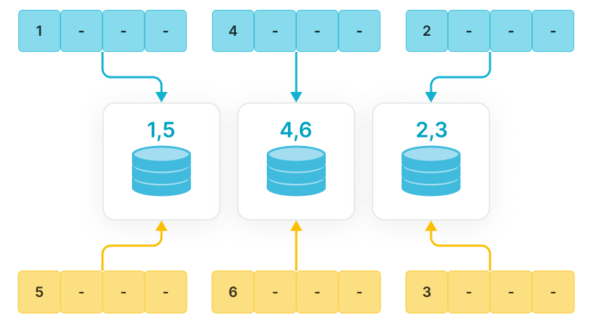

# リストパーティション化

バージョン v3.1 以降、StarRocks はリストパーティション化をサポートしています。データは各パーティションに対して事前に定義された値のリストに基づいてパーティション化され、これによりクエリの高速化や列挙された値に基づく管理が容易になります。

## 概要

各パーティションで列の値リストを明示的に指定する必要があります。これらの値は連続している必要はなく、レンジパーティション化で必要とされる連続した時間や数値の範囲とは異なります。データロード中、StarRocks はデータのパーティション列の値と各パーティションの事前定義された列の値とのマッピングに基づいて、データを対応するパーティションに格納します。



リストパーティション化は、列に少数の列挙値が含まれるデータを格納するのに適しており、これらの列挙値に基づいてデータを頻繁にクエリおよび管理する場合に便利です。たとえば、列が地理的な場所、州、カテゴリを表す場合です。列内の各値は独立したカテゴリを表します。列挙値に基づいてデータをパーティション化することで、クエリパフォーマンスを向上させ、データ管理を容易にすることができます。

**リストパーティション化は、各パーティション列に対して複数の値を含む必要があるシナリオに特に有用です。** たとえば、テーブルに個人が出身の都市を表す `City` 列が含まれており、州や都市ごとにデータを頻繁にクエリおよび管理する場合です。テーブル作成時に、リストパーティション化のパーティション列として `City` 列を使用し、同じ州内のさまざまな都市のデータを1つのパーティションに配置するように指定できます。たとえば、`PARTITION pCalifornia VALUES IN ("Los Angeles", "San Francisco", "San Diego")` のようにします。この方法により、州や都市に基づくクエリを高速化し、データ管理を容易にすることができます。

各パーティション列の同じ値を含むデータのみを含む必要がある場合は、[式に基づくパーティション化](./expression_partitioning.md)を使用することをお勧めします。

**リストパーティション化と [式に基づくパーティション化](expression_partitioning.md) の比較**

リストパーティション化と式に基づくパーティション化（推奨）の主な違いは、リストパーティション化ではパーティションを1つずつ手動で作成する必要があることです。一方、式に基づくパーティション化では、ロード中に自動的にパーティションを作成してパーティション化を簡素化できます。ほとんどの場合、式に基づくパーティション化はリストパーティション化を置き換えることができます。両者の具体的な比較は次の表に示されています。

| パーティション化の手法                                      | **リストパーティション化**                                        | **式に基づくパーティション化**                                  |
| -------------------------------------------------------- | ------------------------------------------------------------ | ------------------------------------------------------------ |
| 構文                                                   | `PARTITION BY LIST (partition_columns) (    PARTITION <partition_name> VALUES IN (value_list)    [, ...] )` | `PARTITION BY <partition_columns>`                           |
| パーティション内の各パーティション列に対する複数の値 | サポートされています。パーティションは、各パーティション列に異なる値を持つデータを格納できます。次の例では、ロードされたデータに `city` 列に `Los Angeles`、`San Francisco`、`San Diego` の値が含まれている場合、すべてのデータは1つのパーティションに格納されます。`pCalifornia`.`PARTITION BY LIST (city) (    PARTITION pCalifornia VALUES IN ("Los Angeles","San Francisco","San Diego")    [, ...] )` | サポートされていません。パーティションは、パーティション列に同じ値を持つデータを格納します。たとえば、式に基づくパーティション化では `PARTITION BY (city)` の式が使用されます。ロードされたデータに `city` 列に `Los Angeles`、`San Francisco`、`San Diego` の値が含まれている場合、StarRocks は自動的に3つのパーティション `pLosAngeles`、`pSanFrancisco`、`pSanDiego` を作成します。3つのパーティションはそれぞれ `city` 列に `Los Angeles`、`San Francisco`、`San Diego` の値を持つデータを格納します。 |
| データロード前にパーティションを作成                    | サポートされています。パーティションはテーブル作成時に作成する必要があります。  | その必要はありません。パーティションはデータロード中に自動的に作成できます。 |
| データロード中にリストパーティションを自動作成 | サポートされていません。データに対応するパーティションがデータロード中に存在しない場合、エラーが返されます。 | サポートされています。データに対応するパーティションがデータロード中に存在しない場合、StarRocks は自動的にパーティションを作成してデータを格納します。各パーティションはパーティション列に同じ値を持つデータのみを含むことができます。 |
| SHOW CREATE TABLE                                        | CREATE TABLE ステートメントでパーティションの定義を返します。 | データがロードされた後、ステートメントは CREATE TABLE ステートメントで使用されたパーティションクロースを含む結果を返します。ただし、返された結果には自動的に作成されたパーティションは表示されません。自動的に作成されたパーティションを表示する必要がある場合は、`SHOW PARTITIONS FROM <table_name>` を実行してください。 |

## 使用方法

### 構文

```sql
PARTITION BY LIST (partition_columns) (
    PARTITION <partition_name> VALUES IN (value_list)
    [, ...]
)

partition_columns::= 
    <column> [,<column> [, ...] ]

value_list ::=
    value_item [, value_item [, ...] ]

value_item ::=
    { <value> | ( <value> [, <value>, [, ...] ] ) }    
```

### パラメータ

| **パラメータ**      | **必須** | **説明**                                              |
| ------------------- | -------------- | ------------------------------------------------------------ |
| `partition_columns` | YES            | パーティション列の名前。パーティション列の値は文字列（BINARY はサポートされていません）、日付または日時、整数、ブール値である必要があります。パーティション列は `NULL` 値を許可しません。 |
| `partition_name`    | YES            | パーティション名。異なるパーティションのデータを区別するために、ビジネスシナリオに基づいて適切なパーティション名を設定することをお勧めします。 |
| `value_list`        | YES            | パーティション内のパーティション列の値のリスト。            |

### 例

例 1: 州や都市に基づいてデータセンターの請求詳細を頻繁にクエリする場合。テーブル作成時に、パーティション列を `city` と指定し、各パーティションが同じ州内の都市のデータを格納するように指定できます。この方法により、特定の州や都市に対するクエリを高速化し、データ管理を容易にすることができます。

```SQL
CREATE TABLE t_recharge_detail1 (
    id bigint,
    user_id bigint,
    recharge_money decimal(32,2), 
    city varchar(20) not null,
    dt varchar(20) not null
)
DUPLICATE KEY(id)
PARTITION BY LIST (city) (
   PARTITION pLos_Angeles VALUES IN ("Los Angeles"),
   PARTITION pSan_Francisco VALUES IN ("San Francisco")
)
DISTRIBUTED BY HASH(`id`);
```

例 2: 時間範囲と特定の州や都市に基づいてデータセンターの請求詳細を頻繁にクエリする場合。テーブル作成時に、パーティション列を `dt` と `city` と指定できます。この方法により、特定の日付と特定の州や都市のデータが同じパーティションに格納され、クエリ速度が向上し、データ管理が容易になります。

```SQL
CREATE TABLE t_recharge_detail4 (
    id bigint,
    user_id bigint,
    recharge_money decimal(32,2), 
    city varchar(20) not null,
    dt varchar(20) not null
) ENGINE=OLAP
DUPLICATE KEY(id)
PARTITION BY LIST (dt,city) (
   PARTITION p202204_California VALUES IN (
       ("2022-04-01", "Los Angeles"),
       ("2022-04-01", "San Francisco"),
       ("2022-04-02", "Los Angeles"),
       ("2022-04-02", "San Francisco")
    ),
   PARTITION p202204_Texas VALUES IN (
       ("2022-04-01", "Houston"),
       ("2022-04-01", "Dallas"),
       ("2022-04-02", "Houston"),
       ("2022-04-02", "Dallas")
   )
)
DISTRIBUTED BY HASH(`id`);
```

## 制限

- リストパーティション化は動的パーティション化をサポートし、複数のパーティションを一度に作成することができます。
- 現在、StarRocks の共有データモードではこの機能はサポートされていません。
- `ALTER TABLE <table_name> DROP PARTITION <partition_name>;` ステートメントを使用してリストパーティション化で作成されたパーティションを削除すると、パーティション内のデータは直接削除され、復元できません。
- 現在、リストパーティション化で作成されたパーティションをバックアップおよび復元することはできません。
- 現在、StarRocks はリストパーティション化戦略で作成されたベーステーブルを持つ [非同期マテリアライズドビュー](../../using_starrocks/async_mv/Materialized_view.md) の作成をサポートしていません。