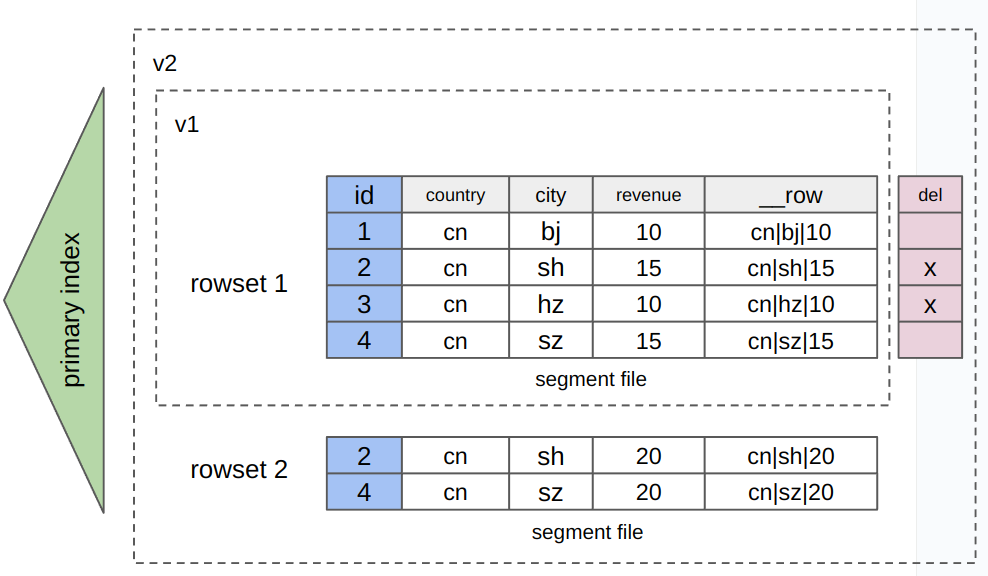

# [プレビュー] 行と列のハイブリッドストレージ

OLAPデータベースとして、StarRocksは元々列指向（カラムナ）ストレージにデータを保存しており、集計クエリのような複雑なクエリのパフォーマンスを向上させます。v3.2.3以降、StarRocksは行と列のハイブリッドストレージでのデータ保存もサポートしており、データは行ごとおよび列ごとに保存されます。このハイブリッドストレージは、主キーに基づく高い同時実行性、低レイテンシーのポイントクエリや部分更新に適しており、列指向ストレージに匹敵する効率的な分析機能を提供します。さらに、ハイブリッドストレージは[prepared statements](../sql-reference/sql-statements/prepared_statement.md)をサポートしており、クエリパフォーマンスとセキュリティを向上させます。

## 列指向ストレージと行と列のハイブリッドストレージの比較

**行と列のハイブリッドストレージ**

- ストレージ方法: データは行ごとおよび列ごとに保存されます。簡単に言うと、ハイブリッドストレージを使用するテーブルには、追加の隠しバイナリ型カラム `__row` が含まれています。データがテーブルに書き込まれると、各関与する行の値カラムからのすべての値がエンコードされ、`__row` カラムに書き込まれます（以下の図を参照）。データが行ごとおよび列ごとに保存されるため、追加のストレージコストが発生します。

   

- シナリオ: 行ごとおよび列ごとのストレージのユーザーシナリオをサポートしますが、追加のストレージコストが発生します。<ul><li>行ごとのストレージのユーザーシナリオ:</li><ul><li>主キーに基づく高い同時実行性のポイントクエリ。</li><li>少数のフィールドで構成されたテーブルからのほとんどのフィールドに対するクエリ。</li><li>部分的なカラムの更新（具体的には、複数のカラムと少数のデータ行を更新する必要がある場合）</li></ul><li>列ごとのストレージのユーザーシナリオ: 複雑なデータ分析。</li></ul>

**列指向**

- ストレージ方法: データは列ごとに保存されます。

  

- シナリオ: 複雑なデータ分析。<ul><li>大量のデータセットに対する複雑なクエリと分析、例えば集計分析や多テーブルジョインクエリ。</li><li>多くのフィールドで構成されたテーブル（ワイドテーブルなど）ですが、これらのテーブルに対するクエリは少数のカラムのみを含みます。</li></ul>

## 基本的な使用法  

### 行と列のハイブリッドストレージを使用するテーブルを作成する

1. FE設定項目 `enable_experimental_rowstore` を有効にします。

   ```SQL
   ADMIN SET FRONTEND CONFIG ("enable_experimental_rowstore" = "true");
   ```

2. テーブル作成時に `PROPERTIES` に `"STORE_TYPE" = "column_with_row"` を指定します。

:::note

- テーブルは主キーテーブルでなければなりません。
- `__row` カラムの長さは1 MBを超えてはなりません。
- v3.2.4以降、StarRocksは次のカラムタイプをサポートします: BITMAP, HLL, JSON, ARRAY, MAP, STRUCT。

:::

```SQL
CREATE TABLE users (
  id bigint not null,
  country string,
  city string,
  revenue bigint
)
PRIMARY KEY (id)
DISTRIBUTED by HASH (id)
PROPERTIES ("store_type" = "column_with_row");
```

### データの挿入、削除、更新

列指向ストレージを使用するテーブルと同様に、データロードとDMLステートメントを使用して、行と列のハイブリッドストレージを使用するテーブルにデータを挿入、削除、更新できます。このセクションでは、上記のハイブリッドストレージを使用するテーブルでDMLステートメントを実行する方法を示します。

1. データ行を挿入します。

   1. ```SQL
      INSERT INTO users (id, country, city, revenue)
      VALUES 
        (1, 'USA', 'New York', 5000),
        (2, 'UK', 'London', 4500),
        (3, 'France', 'Paris', 6000),
        (4, 'Germany', 'Berlin', 4000),
        (5, 'Japan', 'Tokyo', 7000),
        (6, 'Australia', 'Sydney', 7500);
      ```

2. データ行を削除します。

   ```SQL
   DELETE FROM users WHERE id = 6;
   ```

3. データ行を更新します。

   ```SQL
   UPDATE users SET revenue = 6500 WHERE id = 4;
   ```

### データのクエリ

このセクションでは、ポイントクエリを例として使用します。ポイントクエリはショートサーキットを使用し、行ストレージ内のデータを直接クエリすることで、クエリパフォーマンスを向上させます。

以下の例では、上記の行と列のハイブリッドストレージを使用するテーブルを引き続き使用します。前述のテーブル作成とデータ変更操作の後、テーブルは次のようにデータを保存します。

```SQL
MySQL [example_db]> SELECT * FROM users ORDER BY id;
+------+---------+----------+---------+
| id   | country | city     | revenue |
+------+---------+----------+---------+
|    1 | USA     | New York |    5000 |
|    2 | UK      | London   |    4500 |
|    3 | France  | Paris    |    6000 |
|    4 | Germany | Berlin   |    6500 |
|    5 | Japan   | Tokyo    |    7000 |
+------+---------+----------+---------+
5 rows in set (0.03 sec)
```

1. クエリのショートサーキットが有効になっていることを確認します。クエリのショートサーキットが有効になると、特定の条件を満たすクエリ（クエリがポイントクエリであるかどうかを評価するため）はショートサーキットを使用して行指向ストレージ内のデータをスキャンします。

   ```SQL
   SHOW VARIABLES LIKE '%enable_short_circuit%';
   ```

   クエリのショートサーキットが有効でない場合は、`SET enable_short_circuit = true;` コマンドを実行して、変数 [`enable_short_circuit`](../sql-reference/System_variable.md) を `true` に設定します。

2. データをクエリします。クエリがWHERE句の条件カラムにすべての主キーのカラムが含まれ、WHERE句の演算子が `=` または `IN` である場合、クエリはショートカットを使用します。

   :::note
   WHERE句の条件カラムには、すべての主キーのカラムに加えて追加のカラムを含めることができます。
   :::

   ```SQL
   SELECT * FROM users WHERE id=1;
   ```

3. クエリプランを確認して、クエリがショートサーキットを使用できるかどうかを検証します。クエリプランに `Short Circuit Scan: true` が含まれている場合、クエリはショートサーキットを使用できます。

      ```SQL
      MySQL [example_db]> EXPLAIN SELECT * FROM users WHERE id=1;
      +---------------------------------------------------------+
      | Explain String                                          |
      +---------------------------------------------------------+
      | PLAN FRAGMENT 0                                         |
      |  OUTPUT EXPRS:1: id | 2: country | 3: city | 4: revenue |
      |   PARTITION: RANDOM                                     |
      |                                                         |
      |   RESULT SINK                                           |
      |                                                         |
      |   0:OlapScanNode                                        |
      |      TABLE: users                                       |
      |      PREAGGREGATION: OFF. Reason: null                  |
      |      PREDICATES: 1: id = 1                              |
      |      partitions=1/1                                     |
      |      rollup: users                                      |
      |      tabletRatio=1/6                                    |
      |      tabletList=10184                                   |
      |      cardinality=-1                                     |
      |      avgRowSize=0.0                                     |
      |      Short Circuit Scan: true                           | -- クエリはショートカットを使用できます。
      +---------------------------------------------------------+
      17 rows in set (0.00 sec)
      ```

### Prepared statements を使用する

[prepared statements](../sql-reference/sql-statements/prepared_statement.md#use-prepared-statements) を使用して、行と列のハイブリッドストレージを使用するテーブル内のデータをクエリできます。

```SQL
-- ステートメントを実行のために準備します。
PREPARE select_all_stmt FROM 'SELECT * FROM users';
PREPARE select_by_id_stmt FROM 'SELECT * FROM users WHERE id = ?';

-- ステートメント内で変数を宣言します。
SET @id1 = 1, @id2 = 2;

-- 宣言した変数を使用してステートメントを実行します。
-- ID 1 または 2 のデータを個別にクエリします。
EXECUTE select_by_id_stmt USING @id1;
EXECUTE select_by_id_stmt USING @id2;
```

## 制限

- 現在、StarRocks 共有データクラスタは行と列のハイブリッドストレージをサポートしていません。
- v3.2.4以降、行と列のハイブリッドストレージを使用するテーブルは [ALTER TABLE](../sql-reference/sql-statements/table_bucket_part_index/ALTER_TABLE.md) を使用して変更できます。
- クエリのショートサーキットは、現在、スケジュールされたバッチデータロード後に発生するクエリにのみ適しています。クエリのショートサーキットがデータ書き込みプロセスの適用段階で発生すると、インデックスの排他が発生する可能性があるため、データ書き込みがクエリのショートサーキットをブロックし、データ書き込み中のポイントクエリの応答時間に影響を与える可能性があります。
- 行と列のハイブリッドストレージは、ストレージ消費を大幅に増加させる可能性があります。これは、データが行と列の両方の形式で保存され、行ストレージのデータ圧縮率が列ストレージほど高くない可能性があるためです。
- 行と列のハイブリッドストレージは、データロード中の時間とリソース消費を増加させる可能性があります。
- 行と列のハイブリッドストレージを使用するテーブルはオンラインサービスにとって有効なソリューションとなる可能性がありますが、このタイプのテーブルのパフォーマンスは成熟したOLTPデータベースと競合するものではないかもしれません。
- 行と列のハイブリッドストレージを使用するテーブルは、列指向ストレージに依存する機能（例えば、カラムモードでの部分更新）をサポートしていません。
- 行と列のハイブリッドストレージを使用するテーブルは、主キーテーブルでなければなりません。