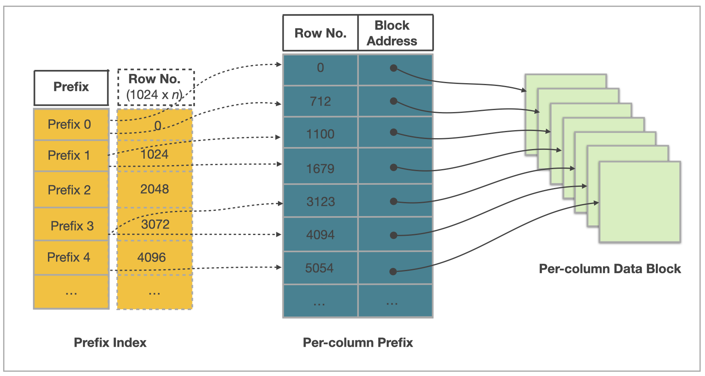

# インデックス

インデックスは、特定のクエリ条件に一致するデータを迅速に見つけるのに役立ちます。具体的には、テーブルの一部の列に基づいてインデックスが作成されると、これらの列をクエリ条件として使用するクエリは、条件に一致するデータを見つけるためにテーブルデータの一部のみをスキャンする必要があります。このようにして、クエリの効率が向上します。StarRocks は、主に次の2つのカテゴリに分けられるさまざまなインデックスタイプを提供します。

- StarRocks は、Prefix indexes、Ordinal indexes、ZoneMap indexes を含む、システムによって自動的に作成される組み込みインデックスを提供します。
- StarRocks は、ユーザーが Bitmap indexes や Bloom filter indexes を含むインデックスを手動で作成することも許可しています。

## 組み込みインデックス

### [Prefix indexes](./Prefix_index_sort_key.md)

Prefix index は、データ書き込み時に自動的に生成されます。具体的には、データが StarRocks に書き込まれるとき、指定されたソートキーに従ってデータがソートされ、1024 行ごとに1つの論理データブロックに含まれます。その論理データブロックの最初のデータ行のソートキー列の値からなるインデックスエントリが Prefix index テーブルに追加されます。クエリのフィルタリング条件が Prefix index のプレフィックスに一致すると、Prefix index は条件に一致するデータを迅速に見つけ、スキャンするデータ量を減らし、クエリパフォーマンスを大幅に向上させることができます。

### Ordinal indexes

StarRocks は、実際には基盤となるストレージに列指向（カラムナ）ストレージを採用しています。各列のデータはデータページに保存され、各データページのサイズは通常 64 * 1024 バイトです（data_page_size = 64 * 1024）。データページが生成されると同時に Ordinal index エントリが追加されます。Ordinal index エントリには、データページの開始行番号などの情報が含まれています。このようにして、Ordinal index は行番号を使用して列の Data Page データページの物理アドレスを見つけることができます。

### ZoneMap indexes

ZoneMap index は、各データチャンクの統計情報を格納し、Min（最大値）、Max（最小値）、HasNull（null 値の存在）、HasNotNull（非 null 値の存在）情報を含みます。クエリ中に、StarRocks はこれらの統計情報に基づいてデータチャンクを迅速に評価し、フィルタリングできるかどうかを判断し、スキャンされるデータ量を減らし、クエリ速度を向上させます。

 詳細情報

各データチャンクはセグメントまたは列のデータページである可能性があります。したがって、対応する ZoneMap indexes の2つのタイプが存在します：各セグメントの統計情報を格納するものと、列の各データページの統計情報を格納するものです。

## 手動で作成されたインデックス

クエリ条件の列がプレフィックスフィールドでない場合、データとクエリの特性に基づいてこの列にインデックスを手動で作成し、クエリ効率を向上させることができます。

### [Bitmap indexes](./Bitmap_index.md)

ビットマップインデックスは、高基数列または複数の低基数列の組み合わせに対するクエリに適しています。ビットマップインデックスは、これらのクエリに対して理想的なフィルタリングパフォーマンスを示し、1000 行中少なくとも 999 行をフィルタリングします。

### [Bloom filter indexes](./Bloomfilter_index.md)

ブルームフィルターインデックスは、ID 列などの比較的高基数の列に適していますが、ある程度の誤判率が発生する可能性があります。

### [N-Gram bloom filter indexes](./Ngram_Bloom_Filter_Index.md)

n-gram ブルームフィルターインデックスは、ブルームフィルターインデックスの特別なタイプであり、通常、`LIKE` クエリや `ngram_search` および `ngram_search_case_insensitive` 関数の操作を高速化するために使用されます。

### [Full-Text inverted indexes](./inverted_index.md)

全文逆インデックスは、キーワードに一致するデータ行を迅速に見つけることができ、全文検索を高速化します。