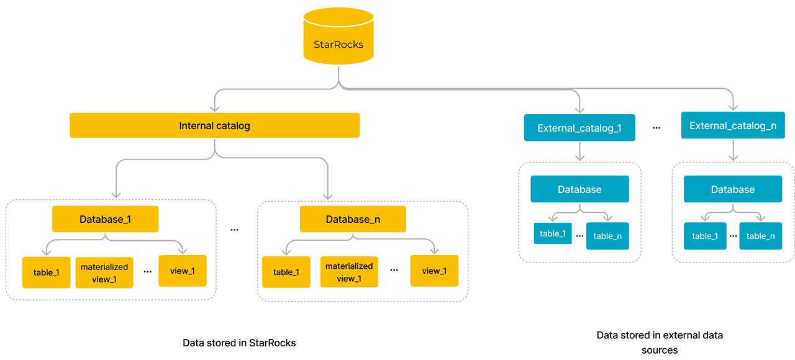

# カタログ、データベース、テーブル

StarRocksは、内部データを管理するために内部カタログを使用し、データレイク内の外部データにアクセスするために外部カタログを使用します。StarRocksに保存されているデータは、1つ以上のデータベースで構成される内部カタログ内で管理されます。データベースは、データを保存、管理、操作するために、テーブル、マテリアライズドビュー、ビューなどのさまざまなオブジェクトを管理します。StarRocksは、オブジェクトに対する操作を行うユーザーの権限を制御する権限システムを採用しており、データのセキュリティを強化しています。

## [Catalogs](../data_source/catalog/catalog_overview.md)

カタログは、内部カタログと外部カタログに分類されます。各クラスターには、1つ以上のデータベースを含むことができる唯一の内部カタログ `default_catalog` があります。StarRocksクラスターの内部カタログは、クラスターにロードされたデータとマテリアライズドビューを管理します。StarRocksはデータウェアハウスとしてデータを保存することができ、特に大規模データに対する複雑なクエリアナリティクスにおいて、クエリパフォーマンスを大幅に向上させます。

一方、外部カタログはデータレイク内の外部データへのアクセスを可能にします。StarRocksをクエリエンジンとして使用し、データをStarRocksにロードすることなく、直接データレイク内のデータをクエリすることができます。

## データベース

データベースは、データを保存、管理、操作するためのテーブル、ビュー、マテリアライズドビューなどのデータオブジェクトの集合です。

## [Tables](./table_types/table_types.md)

テーブルは、内部テーブルと外部テーブルに分類されます。

**内部テーブル**

内部テーブルは内部カタログで管理されます。内部テーブルのデータはStarRocksに保存されます。内部テーブルは内部カタログの下のデータベースで管理されます。内部テーブルは行と列で構成されており、各行はレコードを表し、各列はデータ行の属性またはフィールドを表します。

:::note

ここでの内部テーブルの行と列は論理的な概念です。StarRocksはテーブルに列指向（カラムナ）ストレージを使用しています。物理的には、列内のデータはデータブロックに分割され、エンコード、圧縮され、ディスクに永続的に保存されます。

:::

StarRocksは、Primary Key tables、Duplicate Key tables、Aggregate tables、Unique Key tablesの4種類の内部テーブルを提供し、生データ、リアルタイムデータ、集計データなど、さまざまなビジネスニーズに応じたデータを保存します。

内部テーブルは、パーティショニング + バケッティングという2層のデータ分散戦略を採用し、均等なデータ分散を実現します。さらに、各バケットのレプリカはBEsに均等に分散され、高いデータ可用性を保証します。

**外部テーブル**

外部テーブルは外部カタログで管理されます。外部テーブルのデータは実際には外部データソースに保存されています。StarRocksはこれらの外部テーブルのメタデータのみを保存し、外部データソースからデータをクエリするためにこれらのテーブルを使用できます。

## [Materialized views](../using_starrocks/async_mv/Materialized_view.md)

マテリアライズドビューは、1つ以上のベーステーブルからの事前計算されたクエリ結果を保持する特別な物理テーブルです。マテリアライズドビューは、同期マテリアライズドビューと非同期マテリアライズドビューに分類されます。非同期マテリアライズドビューは、複数のベーステーブル（内部テーブルおよび外部テーブル）からの事前計算結果を保存し、さまざまな集計演算子をサポートできるため、より強力です。ベーステーブルで複雑なクエリが実行されると、StarRocksはマテリアライズドビューに保存された事前計算結果を自動的に再利用し、クエリアクセラレーションを実現し、データレイクでのクエリを加速し、データモデリングを確立します。

## [Views](../sql-reference/sql-statements/View/CREATE_VIEW.md)

ビュー、または論理ビューは、データを保持しない仮想テーブルです。ビューは、他の既存の物理テーブルに対するクエリの結果としてデータを表示するだけです。ビューを定義するクエリは、クエリ内でビューが参照されるたびに実行されます。

## [Privileges](../administration/user_privs/privilege_overview.md)

権限は、どのユーザーがどのオブジェクトに対してどの操作を行えるかを決定します。StarRocksは、アイデンティティベースのアクセス制御とロールベースのアクセス制御の2種類の権限モデルを採用しています。最初に権限をロールに割り当て、次にロールをユーザーに割り当てることができます。この場合、権限はロールを通じてユーザーに渡されます。または、ユーザーのアイデンティティに直接権限を割り当てることもできます。

## ストレージとコンピューティングの分離アーキテクチャにおけるデータストレージ

v3.0以降、StarRocksは新しいストレージとコンピューティングの分離（共有データ）アーキテクチャを導入しました。データストレージはBEsから分離されています。データはリモートオブジェクトストレージまたはHDFSに永続的に保存され、ローカルディスクはホットデータのキャッシングに使用され、クエリを加速します。