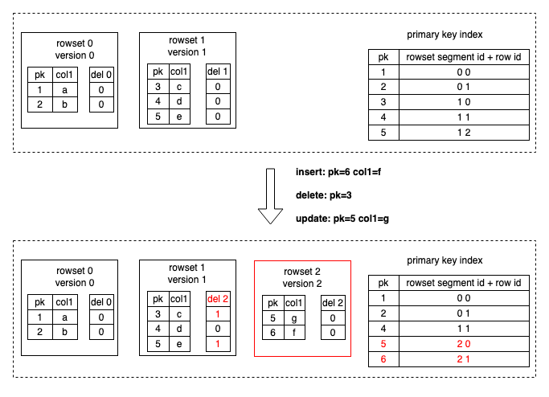
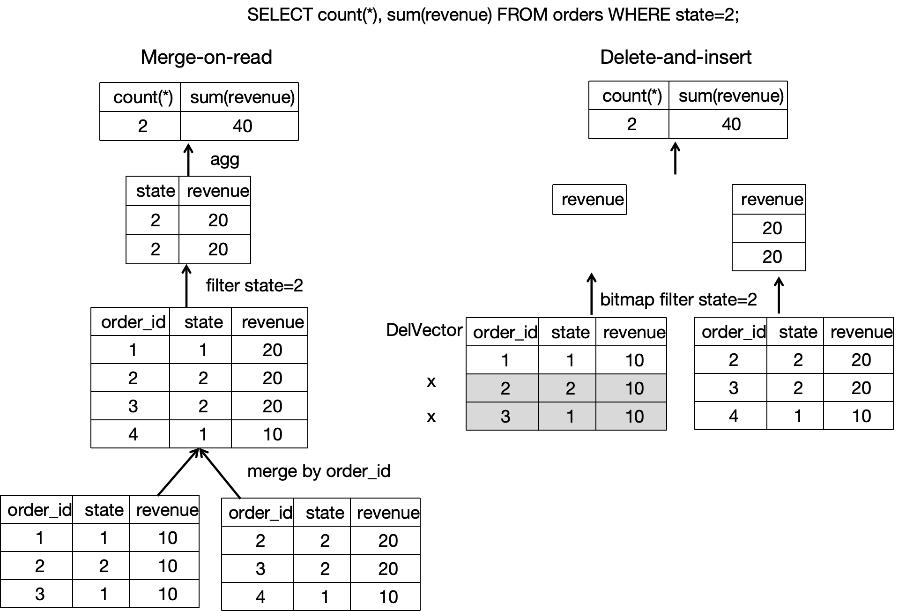
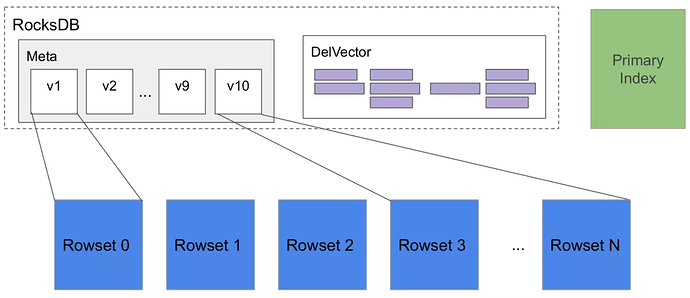
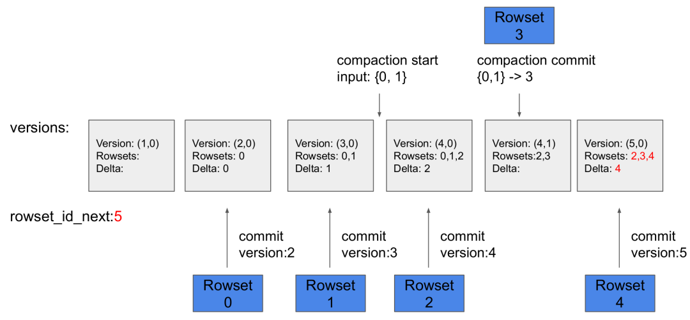
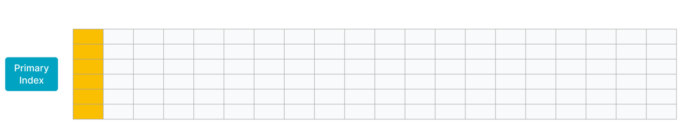

# 主キーテーブル

import Tabs from '@theme/Tabs';

import TabItem from '@theme/TabItem';

主キーテーブルは、StarRocks によって設計された新しいストレージエンジンを使用しています。その主な利点は、リアルタイムのデータ更新をサポートしながら、複雑なアドホッククエリに対して効率的なパフォーマンスを確保できることです。リアルタイムのビジネス分析では、主キーテーブルを使用することで、最新のデータを用いてリアルタイムに結果を分析し、データ分析におけるデータ遅延を軽減することができます。

主キーテーブルの主キーには UNIQUE 制約と NOT NULL 制約があり、各データ行を一意に識別するために使用されます。新しいデータ行の主キー値が既存のデータ行と同じ場合、UNIQUE 制約違反が発生します。この場合、新しいデータ行が既存のデータ行を置き換えます。

:::info

- v3.0 以降、主キーテーブルのソートキーはテーブルの主キーから分離され、ソートキーを別途指定できるようになりました。これにより、テーブル作成の柔軟性が向上しました。
- v3.1 以降、StarRocks 共有データクラスタは主キーテーブルの作成をサポートしています。
  - v3.1.4 以降、永続性インデックスを**ローカルディスク**に作成して保存できます。
  - v3.3.2 以降、永続性インデックスを**オブジェクトストレージ**に作成して保存できます。

:::

## シナリオ

主キーテーブルは、リアルタイムのデータ更新をサポートしながら、効率的なクエリパフォーマンスを確保できます。以下のシナリオに適しています。

- **トランザクション処理システムから StarRocks へのリアルタイムデータストリーム。** 通常、トランザクション処理システムには、挿入操作に加えて、多数の更新および削除操作が含まれます。トランザクション処理システムから StarRocks へのデータ同期が必要な場合、主キーテーブルの作成をお勧めします。その後、Apache Flink® の CDC コネクタなどのツールを使用して、トランザクション処理システムのバイナリログを StarRocks に同期できます。StarRocks は、バイナリログを使用して、テーブル内のデータをリアルタイムで追加、削除、更新します。これにより、データ同期が簡素化され、Merge-On-Read 戦略を採用したユニークキーテーブルを使用する場合に比べて、3 倍から 10 倍のクエリパフォーマンスを実現します。詳細については、[MySQL からのリアルタイム同期](../../loading/Flink_cdc_load.md)を参照してください。
- **個々の列に対する[部分更新](../../loading/Load_to_Primary_Key_tables.md#partial-updates)を実行して複数のストリームを結合。** ユーザープロファイリングなどのビジネスシナリオでは、フラットテーブルが好ましく使用され、多次元分析のパフォーマンスを向上させ、データアナリストが使用する分析モデルを簡素化します。これらのシナリオの上流データは、ショッピングアプリ、配達アプリ、銀行アプリなどのさまざまなアプリや、ユーザーの異なるタグやプロパティを取得するための計算を行う機械学習システムなどから来ることがあります。主キーテーブルは、個々の列の更新をサポートするため、これらのシナリオに適しています。各アプリやシステムは、自身のサービス範囲内のデータを保持する列のみを更新でき、リアルタイムのデータ追加、削除、更新を高いクエリパフォーマンスで享受できます。

## 動作の仕組み

ユニークキーテーブルと集計テーブルは、Merge-On-Read 戦略を採用しています。この戦略は、データの書き込みを簡単かつ効率的にしますが、データの読み取り中に複数のバージョンのデータファイルをオンラインでマージする必要があります。さらに、Merge オペレーターが存在するため、述語やインデックスを基礎データにプッシュダウンできず、クエリパフォーマンスに大きな影響を与えます。

しかし、リアルタイム更新とクエリのパフォーマンスをバランスさせるために、主キーテーブルのメタデータ構造と読み書きメカニズムは他のタイプのテーブルとは異なります。主キーテーブルは、Delete+Insert 戦略を使用します。この戦略は、主キーインデックスと DelVector を使用して実現されます。この戦略により、クエリ中に同じ主キー値を持つレコードの中で最新のレコードのみを読み取る必要があり、複数のバージョンのデータファイルをマージする必要がなくなります。さらに、述語やインデックスを基礎データにプッシュダウンできるため、クエリパフォーマンスが大幅に向上します。

主キーテーブル内でのデータの書き込みと読み取りの全体的なプロセスは次のとおりです。

- データの書き込みは、StarRocks の内部 Loadjob を通じて実現され、データ変更操作（挿入、更新、削除）のバッチを含みます。StarRocks は、対応するタブレットの主キーインデックスをメモリにロードします。削除操作の場合、StarRocks はまず主キーインデックスを使用して、各データ行の元の位置（データファイルと行番号）を見つけ、DelVector（データロード中に生成された削除マーカーを保存および管理する）でデータ行を削除としてマークします。更新操作の場合、DelVector で元のデータ行を削除としてマークすることに加えて、StarRocks は最新のデータ行を新しいデータファイルに書き込み、更新を Delete+Insert に変換します（次の図に示すように）。主キーインデックスも更新され、変更されたデータ行の新しい位置（データファイルと行番号）を記録します。

   
- データの読み取り中、さまざまなデータファイルの履歴の重複レコードは、データの書き込み中にすでに削除としてマークされているため、同じ主キー値を持つ最新のデータ行のみを読み取る必要があります。複数のバージョンのデータファイルをオンラインで読み取ってデータを重複排除し、最新のデータを見つける必要はありません。基礎データファイルがスキャンされるとき、フィルターオペレーターやさまざまなインデックスがスキャンのオーバーヘッドを削減するのに役立ちます（次の図に示すように）。したがって、クエリパフォーマンスは大幅に向上します。ユニークキーテーブルの Merge-On-Read 戦略と比較して、主キーテーブルの Delete+Insert 戦略は、クエリパフォーマンスを 3 倍から 10 倍向上させることができます。

   

<details>
<summary>詳細情報</summary>

主キーテーブルへのデータの書き込みや読み取りの仕組みをより深く理解したい場合は、以下の詳細なデータ書き込みおよび読み取りプロセスを参照できます。

StarRocks は、列指向（カラムナ）ストレージを使用する分析データベースです。具体的には、テーブル内のタブレットは通常、複数の rowset ファイルを含み、各 rowset ファイルのデータは実際にはセグメントファイルに保存されています。セグメントファイルは、データを列指向形式（Parquet に似ている）で整理し、不変です。

書き込むデータが Executor BE ノードに分配されると、各 Executor BE ノードは Loadjob を実行します。Loadjob はデータ変更のバッチを含み、ACID 特性を持つトランザクションと見なすことができます。Loadjob は、書き込みとコミットの 2 つのステージに分けられます。

1. 書き込みステージ: データはパーティションとバケット情報に基づいて対応するタブレットに分配されます。タブレットがデータを受け取ると、データは列指向形式で保存され、新しい rowset が形成されます。
2. コミットステージ: すべてのデータが正常に書き込まれた後、FE は関与するすべてのタブレットにコミットを開始します。各コミットは、タブレットのデータの最新バージョンを表すバージョン番号を持っています。コミットプロセスには、主キーインデックスの検索と更新、すべての変更されたデータの削除としてのマーク、削除としてマークされたデータに基づく DelVector の作成、新しいバージョンのメタデータの生成が含まれます。

データの読み取り中、メタデータを使用して、最新のタブレットバージョンに基づいてどの rowset を読み取る必要があるかを見つけます。rowset 内のセグメントファイルが読み取られるとき、その最新バージョンの DelVector もチェックされ、最新のデータのみを読み取ることができ、同じ主キー値を持つ古いデータを読み取ることを避けることができます。さらに、Scan レイヤーにプッシュダウンされたフィルターオペレーターは、さまざまなインデックスを直接利用してスキャンのオーバーヘッドを削減できます。

- **タブレット**: テーブルは、パーティションとバケットメカニズムに基づいて複数のタブレットに分割されます。実際の物理ストレージユニットであり、異なる BEs にレプリカとして分散されます。

   

- **メタデータ**: メタデータは、タブレットのバージョン履歴と各バージョンに関する情報（たとえば、どの rowset が含まれているか）を保存します。各 Loadjob または compaction のコミットフェーズは、新しいバージョンを生成します。

   

- **主キーインデックス**: 主キーインデックスは、主キー値によって識別されるデータ行とそのデータ行の位置とのマッピングを保存します。HashMap として実装されており、キーはエンコードされた主キー値を表し、値はデータ行の位置（`rowset_id`、`segment_id`、`rowid` を含む）を表します。通常、主キーインデックスは、特定の主キー値によって識別される各データ行がどの rowset と行に存在するかを見つけるために、データ書き込み中にのみ使用されます。
- **DelVector**: DelVector は、各 rowset 内の各セグメントファイル（列指向ファイル）の削除マーカーを保存します。
- **Rowset**: Rowset は論理的な概念であり、タブレット内のデータ変更のバッチからデータセットを保存します。
- **セグメント**: Rowset 内のデータは実際にセグメント化され、1 つ以上のセグメントファイル（列指向ファイル）に保存されます。各セグメントファイルには、列の値と列に関連するインデックス情報が含まれています。

</details>

## 使用方法

### 主キーテーブルの作成

主キーテーブルを作成するには、`CREATE TABLE` ステートメントで主キーを定義するだけです。例:

```SQL
CREATE TABLE orders1 (
    order_id bigint NOT NULL,
    dt date NOT NULL,
    user_id INT NOT NULL,
    good_id INT NOT NULL,
    cnt int NOT NULL,
    revenue int NOT NULL
)
PRIMARY KEY (order_id)
DISTRIBUTED BY HASH (order_id)
;
```

:::info

主キーテーブルは、バケッティング戦略としてハッシュバケッティングのみをサポートしているため、`DISTRIBUTED BY HASH ()` を使用してハッシュバケッティングキーを定義する必要があります。

:::

しかし、実際のビジネスシナリオでは、主キーテーブルが作成される際に、データ分散やソートキーなどの追加機能がクエリアクセラレーションやデータ管理の効率化に使用されることがよくあります。

たとえば、注文テーブルの `order_id` フィールドはデータ行を一意に識別できるため、`order_id` フィールドを主キーとして使用できます。

v3.0 以降、主キーテーブルのソートキーはテーブルの主キーから分離されています。したがって、クエリフィルター条件として頻繁に使用される列を選択してソートキーを形成できます。たとえば、注文日と商人の 2 つの次元の組み合わせに基づいて商品販売パフォーマンスを頻繁にクエリする場合、`ORDER BY (dt,merchant_id)` 句を使用してソートキーを `dt` と `merchant_id` に指定できます。

[データ分散戦略](../data_distribution/Data_distribution.md)を使用する場合、主キーテーブルは現在、主キーにパーティション列とバケッティング列を含める必要があります。たとえば、データ分散戦略は `dt` をパーティション列として使用し、`merchant_id` をハッシュバケッティング列として使用します。主キーにも `dt` と `merchant_id` を含める必要があります。

要約すると、上記の注文テーブルの `CREATE TABLE` ステートメントは次のようになります。

```SQL
CREATE TABLE orders2 (
    order_id bigint NOT NULL,
    dt date NOT NULL,
    merchant_id int NOT NULL,
    user_id int NOT NULL,
    good_id int NOT NULL,
    good_name string NOT NULL,
    price int NOT NULL,
    cnt int NOT NULL,
    revenue int NOT NULL,
    state tinyint NOT NULL
)
PRIMARY KEY (order_id,dt,merchant_id)
PARTITION BY date_trunc('day', dt)
DISTRIBUTED BY HASH (merchant_id)
ORDER BY (dt,merchant_id)
PROPERTIES (
    "enable_persistent_index" = "true"
);
```

### 主キー

テーブルの主キーは、そのテーブル内の各行を一意に識別するために使用されます。主キーを構成する 1 つまたは複数の列は `PRIMARY KEY` で定義され、UNIQUE 制約と NOT NULL 制約があります。

主キーに関する次の点に注意してください。

- `CREATE TABLE` ステートメントでは、主キー列は他の列の前に定義する必要があります。
- 主キー列にはパーティション列とバケッティング列を含める必要があります。
- 主キー列は、数値型（整数と BOOLEAN を含む）、文字列型、日付型（DATE と DATETIME）をサポートします。
- デフォルトでは、エンコードされた主キー値の最大長は 128 バイトです。
- 主キーはテーブル作成後に変更できません。
- データの一貫性のために、主キー値は更新できません。

### 主キーインデックス

主キーインデックスは、主キー値と主キー値によって識別されるデータ行の位置とのマッピングを保存するために使用されます。通常、関連するタブレットの主キーインデックスは、データロード中（データ変更のバッチを含む）にのみメモリにロードされます。クエリと更新のパフォーマンス要件、およびメモリとディスクを総合的に評価した後、主キーインデックスを永続化することを検討できます。

<Tabs groupId="primary key index">

  <TabItem value="example1" label="永続化された主キーインデックス" default>

`enable_persistent_index` が `true`（デフォルト）に設定されている場合、主キーインデックスはディスクに永続化できます。ロード中、主キーインデックスの一部はメモリにロードされ、残りはディスクに保存され、メモリを過度に占有しないようにします。一般に、永続化された主キーインデックスを持つテーブルのクエリと更新のパフォーマンスは、完全にメモリ内の主キーインデックスを持つテーブルとほぼ同等です。

ディスクが SSD の場合、`true` に設定することをお勧めします。ディスクが HDD でロード頻度が高くない場合も、`true` に設定できます。

v3.1.4 以降、StarRocks 共有データクラスタで作成された主キーテーブルは、ローカルディスクへのインデックス永続化をサポートしています。そして、v3.3.2 以降、StarRocks 共有データクラスタは、オブジェクトストレージへのインデックス永続化もサポートしています。この機能を有効にするには、テーブルプロパティ `persistent_index_type` を `CLOUD_NATIVE` に設定します。

</TabItem>

<TabItem value="example2" label="完全にメモリ内の主キーインデックス">

`enable_persistent_index` が `false` に設定されている場合、主キーインデックスはディスクに永続化されず、完全にメモリ内に保存されます。ロード中、ロードされたデータに関連するタブレットの主キーインデックスがメモリにロードされるため、メモリ消費が増加する可能性があります。（タブレットが長期間データをロードしていない場合、その主キーインデックスはメモリから解放されます。）

完全にメモリ内の主キーインデックスを使用する場合、主キーの設計時に次のガイドラインに従って、主キーインデックスのメモリ使用量を制御することをお勧めします。

- 主キー列の数と合計長を適切に設計する必要があります。メモリを占有しないデータ型の列を特定し、それらの列を主キーとして定義することをお勧めします。たとえば、INT や BIGINT など、VARCHAR ではなく。
- テーブルを作成する前に、主キー列のデータ型とテーブル内の行数に基づいて、主キーインデックスが占有するメモリを見積もることをお勧めします。これにより、メモリ不足を防ぐことができます。次の例は、主キーインデックスが占有するメモリを計算する方法を説明しています。
  - `dt` 列は DATE データ型で 4 バイトを占有し、`id` 列は BIGINT データ型で 8 バイトを占有すると仮定します。この場合、主キーは 12 バイトの長さです。
  - テーブルには 10,000,000 行のホットデータが含まれ、3 つのレプリカに保存されていると仮定します。
  - 上記の情報に基づいて、主キーインデックスが占有するメモリは次の式に基づいて 945 MB です: `(12 + 9) x 10,000,000 x 3 x 1.5 = 945 (MB)`

    上記の式では、`9` は各行の不変のオーバーヘッドであり、`1.5` はハッシュテーブルの平均追加オーバーヘッドです。

完全にメモリ内の主キーインデックスを持つ主キーテーブルは、主キーが占有するメモリが制御可能なシナリオに適しています。例:

- テーブルには、急速に変化するデータとゆっくり変化するデータの両方が含まれています。急速に変化するデータは、最近の日に頻繁に更新され、ゆっくり変化するデータはほとんど更新されません。たとえば、MySQL の注文テーブルをリアルタイムで StarRocks に同期して分析やクエリを行う必要があると仮定します。この例では、テーブルのデータは日ごとにパーティション化され、ほとんどの更新は最近作成された注文に対して行われます。履歴注文は完了後に更新されなくなります。データロードジョブを実行すると、履歴注文の主キーインデックスはメモリにロードされません。最近更新された注文の主キーインデックスのみがメモリにロードされます。
  
  次の図に示すように、テーブル内のデータは日ごとにパーティション化され、最近の 2 つのパーティションのデータが頻繁に更新されます。

   

- テーブルは、数百または数千の列で構成されたフラットテーブルです。主キーはテーブルデータのごく一部を占め、メモリをほとんど消費しません。たとえば、ユーザーのステータスやプロファイルテーブルは、多数の列で構成されていますが、ユーザーは数千万から数億人しかいません。この状況では、主キーが消費するメモリ量は制御可能です。
  
  次の図に示すように、テーブルには数行しかなく、テーブルの主キーはテーブルのごく一部を占めています。
   

</TabItem>

</Tabs>

### ソートキー

v3.0 以降、主キーテーブルはソートキーを主キーから分離しています。ソートキーは `ORDER BY` で定義された列で構成され、列のデータ型がソートキーの要件を満たす限り、任意の列の組み合わせで構成できます。

データロード中、データはソートキーに従ってソートされた後に保存されます。ソートキーは、クエリアクセラレーションのためにプレフィックスインデックスを構築するためにも使用されます。[クエリアクセラレーションを実現するプレフィックスインデックスを形成するためにソートキーを適切に設計することをお勧めします](../indexes/Prefix_index_sort_key.md#how-to-design-the-sort-key-appropriately-to-form-the-prefix-index-that-can-accelerate-queries)。

:::info

- ソートキーが指定されている場合、プレフィックスインデックスはソートキーに基づいて構築されます。ソートキーが指定されていない場合、プレフィックスインデックスは主キーに基づいて構築されます。
- テーブル作成後、`ALTER TABLE ... ORDER BY ...` を使用してソートキーを変更できます。ソートキーの削除はサポートされておらず、ソート列のデータ型の変更もサポートされていません。

:::

## その他

- 作成したテーブルにデータをロードするには、[ロードの概要](../../loading/Loading_intro.md)を参照して適切なロードオプションを選択できます。
- 主キーテーブルのデータを変更する必要がある場合は、[ロードを通じてデータを変更](../../loading/Load_to_Primary_Key_tables.md)するか、DML（[INSERT](../../sql-reference/sql-statements/loading_unloading/INSERT.md)、[UPDATE](../../sql-reference/sql-statements/table_bucket_part_index/UPDATE.md)、および [DELETE](../../sql-reference/sql-statements/table_bucket_part_index/DELETE.md)）を使用できます。
- クエリアクセラレーションをさらに進めたい場合は、[クエリアクセラレーション](../../using_starrocks/async_mv/Materialized_view.md)を参照してください。
- テーブルスキーマを変更する必要がある場合は、[ALTER TABLE](../../sql-reference/sql-statements/Resource/ALTER_RESOURCE.md)を参照してください。
- [AUTO_INCREMENT](../../sql-reference/sql-statements/generated_columns.md) 列を主キーとして使用できます。
