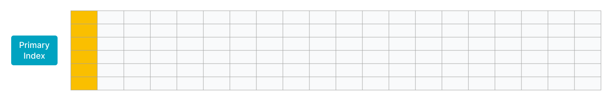

# 主キーテーブル

テーブルを作成する際、主キーとソートキーを別々に定義できます。データが主キーテーブルにロードされると、StarRocks はデータをソートキーに従ってソートし、データを保存します。クエリは、同じ主キーを持つレコード群の中で最も新しいレコードを返します。ユニークキーテーブルとは異なり、主キーテーブルはクエリ中に集約操作を必要とせず、述語やインデックスのプッシュダウンをサポートします。そのため、リアルタイムで頻繁にデータが更新されても、高いクエリパフォーマンスを提供できます。

> **注意**
>
> - バージョン v3.0 より前では、主キーテーブルは主キーとソートキーの分離をサポートしていません。
> - バージョン 3.1 以降、StarRocks の共有データモードは主キーテーブルをサポートします。バージョン 3.1.4 以降、StarRocks 共有データクラスタで作成された主キーテーブルは、ローカルディスクへのインデックスの永続化をさらにサポートします。

## シナリオ

- 主キーテーブルは、データがリアルタイムで頻繁に更新される必要がある以下のシナリオに適しています:
  - **トランザクション処理システムからリアルタイムでデータを StarRocks にストリーミングする。** 通常、トランザクション処理システムには、大量の更新および削除操作が挿入操作と共に含まれます。トランザクション処理システムから StarRocks にデータを同期する必要がある場合、主キーテーブルを使用するテーブルを作成することをお勧めします。その後、Apache Flink® の CDC コネクタなどのツールを使用して、トランザクション処理システムのバイナリログを StarRocks に同期できます。StarRocks はバイナリログを使用して、テーブル内のデータをリアルタイムで追加、削除、更新します。これにより、データ同期が簡素化され、ユニークキーテーブルの Merge on Read (MoR) テーブルを使用する場合に比べて、3 倍から 10 倍のクエリパフォーマンスが得られます。例えば、flink-connector-starrocks を使用してデータをロードできます。詳細については、[flink-connector-starrocks を使用してデータをロードする](../../loading/Flink-connector-starrocks.md) を参照してください。

  - **個々の列に対して更新操作を行うことで複数のストリームをジョインする。** ユーザープロファイリングなどのビジネスシナリオでは、多次元分析のパフォーマンスを向上させ、データアナリストが使用する分析モデルを簡素化するために、フラットテーブルが好まれます。これらのシナリオの上流データは、ショッピングアプリ、デリバリーアプリ、銀行アプリなどのさまざまなアプリや、ユーザーの特定のタグやプロパティを取得するための計算を行う機械学習システムから来ることがあります。主キーテーブルは、個々の列の更新をサポートしているため、これらのシナリオに適しています。各アプリやシステムは、自身のサービス範囲内のデータを保持する列のみを更新でき、リアルタイムのデータ追加、削除、更新を高いクエリパフォーマンスで享受できます。

- 主キーテーブルは、主キーが占めるメモリが制御可能なシナリオに適しています。

  StarRocks のストレージエンジンは、主キーテーブルを使用する各テーブルの主キーに対してインデックスを作成します。さらに、テーブルにデータをロードする際、StarRocks は主キーインデックスをメモリにロードします。したがって、主キーテーブルは他の3つのテーブルタイプよりも大きなメモリ容量を必要とします。**StarRocks は、エンコード後の主キーを構成するフィールドの総長を 127 バイトに制限しています。**

  テーブルが以下の特徴を持つ場合、主キーテーブルの使用を検討してください:

  - テーブルには、急速に変化するデータとゆっくり変化するデータの両方が含まれています。急速に変化するデータは、最近の日々に頻繁に更新されるのに対し、ゆっくり変化するデータはほとんど更新されません。例えば、MySQL の注文テーブルをリアルタイムで StarRocks に同期して分析やクエリを行う必要があるとします。この例では、テーブルのデータは日ごとにパーティション分割され、ほとんどの更新は最近作成された注文に対して行われます。履歴注文は完了後に更新されません。データロードジョブを実行すると、主キーインデックスはメモリにロードされず、最近更新された注文のインデックスエントリのみがメモリにロードされます。

    次の図に示すように、テーブル内のデータは日ごとにパーティション分割され、最近の2つのパーティションのデータは頻繁に更新されます。

    

  - テーブルは数百または数千の列で構成されたフラットテーブルです。主キーはテーブルデータのごく一部を構成し、メモリをほとんど消費しません。例えば、ユーザーステータスやプロファイルテーブルは多数の列で構成されていますが、ユーザー数は数千万から数億程度です。この状況では、主キーが消費するメモリ量は制御可能です。

    次の図に示すように、テーブルにはわずか数行しか含まれておらず、テーブルの主キーはテーブルのごく一部を構成しています。

    

### 原理

主キーテーブルは、StarRocks が提供する新しいストレージエンジンに基づいて設計されています。主キーテーブルのメタデータ構造と読み書きメカニズムは、重複キーテーブルのそれとは異なります。そのため、主キーテーブルは集約操作を必要とせず、述語やインデックスのプッシュダウンをサポートします。これにより、クエリパフォーマンスが大幅に向上します。

重複キーテーブルは MoR ポリシーを採用しています。MoR はデータ書き込みを簡素化しますが、複数のデータバージョンのオンライン集約を必要とします。さらに、Merge オペレーターは述語やインデックスのプッシュダウンをサポートしていません。その結果、クエリパフォーマンスが低下します。

主キーテーブルは、Delete+Insert ポリシーを採用して、各レコードが一意の主キーを持つことを保証します。この方法により、主キーテーブルはマージ操作を必要としません。詳細は以下の通りです:

- StarRocks がレコードの更新操作のリクエストを受け取ると、主キーインデックスを検索してレコードを特定し、レコードを削除済みとしてマークし、新しいレコードを挿入します。つまり、StarRocks は更新操作を削除操作と挿入操作に変換します。

- StarRocks がレコードの削除操作を受け取ると、主キーインデックスを検索してレコードを特定し、レコードを削除済みとしてマークします。

## テーブルの作成

例 1: 注文を日ごとに分析する必要があるとします。この例では、`orders` という名前のテーブルを作成し、`dt` と `order_id` を主キーとして定義し、他の列をメトリック列として定義します。

```SQL
create table orders (
    dt date NOT NULL,
    order_id bigint NOT NULL,
    user_id int NOT NULL,
    merchant_id int NOT NULL,
    good_id int NOT NULL,
    good_name string NOT NULL,
    price int NOT NULL,
    cnt int NOT NULL,
    revenue int NOT NULL,
    state tinyint NOT NULL
) PRIMARY KEY (dt, order_id)
PARTITION BY RANGE(`dt`) (
    PARTITION p20210820 VALUES [('2021-08-20'), ('2021-08-21')),
    PARTITION p20210821 VALUES [('2021-08-21'), ('2021-08-22')),
    ...
    PARTITION p20210929 VALUES [('2021-09-29'), ('2021-09-30')),
    PARTITION p20210930 VALUES [('2021-09-30'), ('2021-10-01'))
) DISTRIBUTED BY HASH(order_id)
PROPERTIES("replication_num" = "3",
"enable_persistent_index" = "true");
```

> **注意**
>
> - テーブルを作成する際、`DISTRIBUTED BY HASH` 句を使用してバケット列を指定する必要があります。詳細情報は [バケット化](../data_distribution/Data_distribution.md#bucketing) を参照してください。
> - バージョン v2.5.7 以降、StarRocks はテーブルを作成する際やパーティションを追加する際に、バケット数 (BUCKETS) を自動的に設定できます。手動でバケット数を設定する必要はありません。詳細情報は [バケット数の決定](../data_distribution/Data_distribution.md#determine-the-number-of-buckets) を参照してください。

例 2: ユーザーの住所や最終アクティブ時間などの次元からリアルタイムでユーザーの行動を分析する必要があるとします。テーブルを作成する際、`user_id` 列を主キーとして定義し、`address` と `last_active` 列の組み合わせをソートキーとして定義できます。

```SQL
create table users (
    user_id bigint NOT NULL,
    name string NOT NULL,
    email string NULL,
    address string NULL,
    age tinyint NULL,
    sex tinyint NULL,
    last_active datetime,
    property0 tinyint NOT NULL,
    property1 tinyint NOT NULL,
    property2 tinyint NOT NULL,
    property3 tinyint NOT NULL,
    ....
) PRIMARY KEY (user_id)
DISTRIBUTED BY HASH(user_id)
ORDER BY(`address`,`last_active`)
PROPERTIES("replication_num" = "3",
"enable_persistent_index" = "true");
```

## 使用上の注意

- テーブルの主キーに関する次の点に注意してください:
  - 主キーは `PRIMARY KEY` キーワードを使用して定義されます。

  - 主キーは一意制約が適用される列に作成され、主キー列の名前は変更できません。

  - 主キー列は、BOOLEAN、TINYINT、SMALLINT、INT、BIGINT、LARGEINT、STRING、VARCHAR、DATE、および DATETIME のいずれかのデータ型にすることができます。ただし、主キー列は `NULL` として定義できません。

  - パーティション列とバケット列は主キーに参加する必要があります。

  - 主キー列の数と総長はメモリを節約するために適切に設計する必要があります。メモリをあまり消費しないデータ型の列を特定し、それらの列を主キーとして定義することをお勧めします。例えば、INT や BIGINT などのデータ型です。VARCHAR データ型の列を主キーに参加させないことをお勧めします。

- デフォルトでは、エンコードされた主キー値の最大長は 128 バイトです。

  - テーブルを作成する前に、主キー列のデータ型とテーブル内の行数に基づいて、主キーインデックスが占めるメモリを見積もることをお勧めします。これにより、テーブルがメモリ不足になるのを防ぐことができます。以下の例は、主キーインデックスが占めるメモリを計算する方法を説明しています:
    - DATE データ型で 4 バイトを占める `dt` 列と、BIGINT データ型で 8 バイトを占める `id` 列が主キーとして定義されているとします。この場合、主キーの長さは 12 バイトです。

    - テーブルには 10,000,000 行のホットデータが含まれ、3 つのレプリカに保存されています。

    - 上記の情報に基づいて、主キーインデックスが占めるメモリは次の式に基づいて 945 MB です:

      (12 + 9) x 10,000,000 x 3 x 1.5 = 945 (MB)

      上記の式では、`9` は各行の不変オーバーヘッドであり、`1.5` はハッシュテーブルごとの平均追加オーバーヘッドです。

- `enable_persistent_index`: 主キーインデックスはディスクに永続化され、メモリに保存されることで、過剰なメモリ使用を避けることができます。一般的に、主キーインデックスは以前のメモリ使用量の 1/10 しか占めません。テーブルを作成する際に `PROPERTIES` でこのプロパティを設定できます。有効な値は true または false です。デフォルト値は false です。

  > - テーブル作成後にこのパラメータを変更したい場合は、[ALTER TABLE](../../sql-reference/sql-statements/table_bucket_part_index/ALTER_TABLE.md) のテーブルプロパティの変更部分を参照してください。
  > - ディスクが SSD の場合、このプロパティを true に設定することをお勧めします。
  > - バージョン 2.3.0 以降、StarRocks はこのプロパティの設定をサポートしています。
  > - バージョン 3.1 以降、StarRocks の共有データモードは主キーテーブルをサポートします。バージョン 3.1.4 以降、StarRocks 共有データクラスタで作成された主キーテーブルは、ローカルディスクへのインデックスの永続化をさらにサポートします。

- `ORDER BY` キーワードを使用して、任意の列の組み合わせとしてソートキーを指定できます。

  > **注意**
  >
  > ソートキーが指定されている場合、プレフィックスインデックスはソートキーに基づいて構築されます。ソートキーが指定されていない場合、プレフィックスインデックスは主キーに基づいて構築されます。

- ALTER TABLE を使用してテーブルスキーマを変更できますが、以下の制限があります:
  - 主キーの変更はサポートされていません。
  - ALTER TABLE ... ORDER BY .... を使用してソートキーを再割り当てすることはサポートされていますが、ソートキーの削除はサポートされていません。ソートキー内の列のデータ型の変更はサポートされていません。
  - 列の順序の調整はサポートされていません。

- バージョン 2.3.0 以降、主キー列以外の列は BITMAP および HLL データ型をサポートしています。

- テーブルを作成する際、主キー列以外の列に BITMAP インデックスやブルームフィルターインデックスを作成できます。

- バージョン 2.4.0 以降、主キーテーブルに基づいて非同期マテリアライズドビューを作成できます。

## 次のステップ

テーブル作成後、ロードジョブを実行して主キーテーブルにデータをロードできます。サポートされているロード方法の詳細については、[データロードの概要](../../loading/Loading_intro.md) を参照してください。

主キーテーブル内のデータを更新する必要がある場合は、[ロードジョブを実行する](../../loading/Load_to_Primary_Key_tables.md) か、DML ステートメント ([UPDATE](../../sql-reference/sql-statements/table_bucket_part_index/UPDATE.md) または [DELETE](../../sql-reference/sql-statements/table_bucket_part_index/DELETE.md)) を実行できます。これらの更新操作は原子性を保証します。