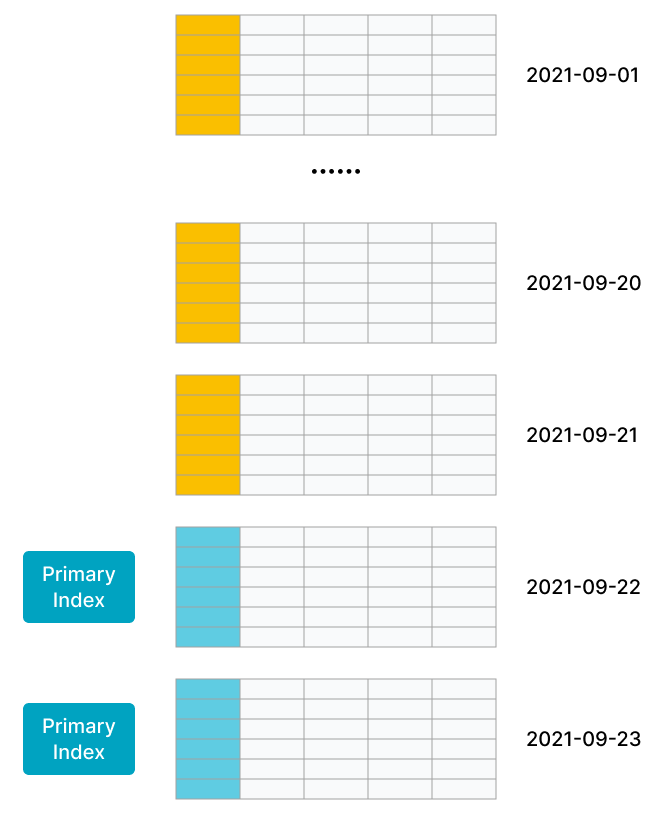

# 主キーテーブル

StarRocks は v1.19 から主キーテーブルをサポートし始めました。主キーテーブルを使用するテーブルを作成する際には、主キー列とメトリック列を定義できます。クエリは、同じ主キーを持つレコード群の中で最も新しいレコードを返します。ユニークキーテーブルとは異なり、主キーテーブルはクエリ中に集計操作を必要とせず、述語やインデックスのプッシュダウンをサポートします。そのため、主キーテーブルはリアルタイムで頻繁にデータが更新される場合でも高いクエリパフォーマンスを提供できます。

## シナリオ

- 主キーテーブルは、データがリアルタイムで頻繁に更新される以下のシナリオに適しています。
  - **トランザクション処理システムから StarRocks へのリアルタイムストリームデータ。** 通常、トランザクション処理システムには、大量の更新および削除操作が挿入操作に加えて含まれます。トランザクション処理システムから StarRocks へのデータ同期が必要な場合、主キーテーブルを使用するテーブルを作成することをお勧めします。その後、Apache Flink® の CDC コネクタなどのツールを使用して、トランザクション処理システムのバイナリログを StarRocks に同期できます。StarRocks はバイナリログを使用して、テーブル内のデータをリアルタイムで追加、削除、更新します。これにより、データ同期が簡素化され、ユニークキーテーブルの Merge on Read (MoR) テーブルを使用する場合よりも 3 倍から 10 倍高いクエリパフォーマンスを提供します。例えば、flink-connector-starrocks を使用してデータをロードできます。詳細については、[Load data by using flink-connector-starrocks](../../loading/Flink-connector-starrocks.md) を参照してください。

  - **個別の列に対する更新操作を行うことで複数のストリームをジョイン。** ユーザープロファイリングなどのビジネスシナリオでは、マルチディメンショナル分析のパフォーマンスを向上させ、データアナリストが使用する分析モデルを簡素化するためにフラットテーブルが好まれます。これらのシナリオの上流データは、ショッピングアプリ、デリバリーアプリ、銀行アプリなどのさまざまなアプリや、ユーザーの特定のタグやプロパティを取得するための計算を行う機械学習システムなどから来ることがあります。主キーテーブルは、個別の列の更新をサポートするため、これらのシナリオに適しています。各アプリやシステムは、自身のサービス範囲内のデータを保持する列のみを更新でき、リアルタイムのデータ追加、削除、更新を高いクエリパフォーマンスで享受できます。

- 主キーテーブルは、主キーが占めるメモリが制御可能なシナリオに適しています。

  StarRocks のストレージエンジンは、主キーテーブルを使用する各テーブルの主キーにインデックスを作成します。さらに、テーブルにデータをロードする際、StarRocks は主キーインデックスをメモリにロードします。そのため、主キーテーブルは他の 3 つのテーブルタイプよりも大きなメモリ容量を必要とします。**StarRocks は、エンコード後の主キーを構成するフィールドの総長を 127 バイトに制限します。**

  次の特徴を持つテーブルの場合、主キーテーブルの使用を検討してください。

  - テーブルには、急速に変化するデータとゆっくり変化するデータの両方が含まれています。急速に変化するデータは最近の日に頻繁に更新され、ゆっくり変化するデータはほとんど更新されません。例えば、MySQL の注文テーブルをリアルタイムで StarRocks に同期して分析やクエリを行う必要があるとします。この例では、テーブルのデータは日ごとにパーティション化され、最近の日に作成された注文に対してほとんどの更新が行われます。履歴注文は完了後に更新されなくなります。データロードジョブを実行すると、主キーインデックスはメモリにロードされず、最近更新された注文のインデックスエントリのみがメモリにロードされます。

    次の図に示すように、テーブル内のデータは日ごとにパーティション化され、最近の 2 つのパーティションのデータが頻繁に更新されます。

    

  - テーブルは数百または数千の列で構成されるフラットテーブルです。主キーはテーブルデータのごく一部を構成し、メモリをほとんど消費しません。例えば、ユーザーステータスやプロファイルテーブルは大量の列で構成されていますが、ユーザーは数千万から数億人に過ぎません。この状況では、主キーが消費するメモリ量は制御可能です。

    次の図に示すように、テーブルにはわずか数行しか含まれておらず、テーブルの主キーはテーブルのごく一部を構成しています。

    

## 原理

主キーテーブルは、StarRocks が提供する新しいストレージエンジンに基づいて設計されています。主キーテーブルのメタデータ構造と読み書きメカニズムは、重複キーテーブルとは異なります。そのため、主キーテーブルは集計操作を必要とせず、述語やインデックスのプッシュダウンをサポートします。これにより、クエリパフォーマンスが大幅に向上します。

重複キーテーブルは MoR ポリシーを採用しています。MoR はデータの書き込みを簡素化しますが、複数のデータバージョンのオンライン集計を必要とします。さらに、Merge オペレーターは述語やインデックスのプッシュダウンをサポートしていません。その結果、クエリパフォーマンスが低下します。

主キーテーブルは、Delete+Insert ポリシーを採用して、各レコードが一意の主キーを持つことを保証します。この方法では、主キーテーブルはマージ操作を必要としません。詳細は以下の通りです。

- StarRocks がレコードの更新操作のリクエストを受け取ると、主キーインデックスを検索してレコードを特定し、レコードを削除としてマークし、新しいレコードを挿入します。つまり、StarRocks は更新操作を削除操作と挿入操作に変換します。

- StarRocks がレコードの削除操作を受け取ると、主キーインデックスを検索してレコードを特定し、レコードを削除としてマークします。

## テーブルの作成

例 1: 毎日ベースで注文を分析する必要があるとします。この例では、`orders` という名前のテーブルを作成し、`dt` と `order_id` を主キーとして定義し、他の列をメトリック列として定義します。

```SQL
create table orders (
    dt date NOT NULL,
    order_id bigint NOT NULL,
    user_id int NOT NULL,
    merchant_id int NOT NULL,
    good_id int NOT NULL,
    good_name string NOT NULL,
    price int NOT NULL,
    cnt int NOT NULL,
    revenue int NOT NULL,
    state tinyint NOT NULL
) PRIMARY KEY (dt, order_id)
PARTITION BY RANGE(`dt`) (
    PARTITION p20210820 VALUES [('2021-08-20'), ('2021-08-21')),
    PARTITION p20210821 VALUES [('2021-08-21'), ('2021-08-22')),
    ...
    PARTITION p20210929 VALUES [('2021-09-29'), ('2021-09-30')),
    PARTITION p20210930 VALUES [('2021-09-30'), ('2021-10-01'))
) DISTRIBUTED BY HASH(order_id) BUCKETS 4
PROPERTIES("replication_num" = "3",
"enable_persistent_index" = "true");
```

例 2: ユーザーの行動をリアルタイムで分析する必要があるとします。この例では、`users` という名前のテーブルを作成し、`user_id` を主キーとして定義し、他の列をメトリック列として定義します。

```SQL
create table users (
    user_id bigint NOT NULL,
    name string NOT NULL,
    email string NULL,
    address string NULL,
    age tinyint NULL,
    sex tinyint NULL,
    last_active datetime,
    property0 tinyint NOT NULL,
    property1 tinyint NOT NULL,
    property2 tinyint NOT NULL,
    property3 tinyint NOT NULL,
    ....
) PRIMARY KEY (user_id)
DISTRIBUTED BY HASH(user_id) BUCKETS 4
PROPERTIES("replication_num" = "3",
"enable_persistent_index" = "true");
```

### 使用上の注意

- テーブルの主キーについて次の点に注意してください。
  - 主キーは `PRIMARY KEY` キーワードを使用して定義されます。

  - 主キーは一意制約が適用される列に作成され、主キー列の名前は変更できません。

  - 主キー列は、BOOLEAN、TINYINT、SMALLINT、INT、BIGINT、LARGEINT、STRING、VARCHAR、DATE、および DATETIME のいずれかのデータ型にすることができます。ただし、主キー列は `NULL` として定義できません。

  - パーティション列とバケット列は主キーに参加する必要があります。

  - 主キー列の数と総長は、メモリを節約するために適切に設計する必要があります。メモリをあまり占有しないデータ型の列を特定し、それらの列を主キーとして定義することをお勧めします。INT や BIGINT などのデータ型がこれに該当します。VARCHAR データ型の列を主キーに参加させないことをお勧めします。

  - テーブルを作成する前に、主キー列のデータ型とテーブル内の行数に基づいて、主キーインデックスが占めるメモリを見積もることをお勧めします。これにより、テーブルがメモリ不足になるのを防ぐことができます。以下の例は、主キーインデックスが占めるメモリを計算する方法を説明しています。
    - DATE データ型で 4 バイトを占有する `dt` 列と、BIGINT データ型で 8 バイトを占有する `id` 列が主キーとして定義されているとします。この場合、主キーの長さは 12 バイトです。

    - テーブルには 10,000,000 行のホットデータが含まれ、3 つのレプリカに保存されているとします。

    - 上記の情報に基づいて、主キーインデックスが占めるメモリは次の式に基づいて 945 MB です。

      (12 + 9) x 10,000,000 x 3 x 1.5 = 945 (MB)

      上記の式では、`9` は行ごとの不変のオーバーヘッドであり、`1.5` はハッシュテーブルごとの平均追加オーバーヘッドです。

- `enable_persistent_index`: 主キーインデックスはディスクに永続化され、メモリに保存されることで、メモリを過剰に占有しないようにできます。一般に、主キーインデックスは以前のメモリの 1/10 しか占有しません。テーブルを作成する際に `PROPERTIES` でこのプロパティを設定できます。有効な値は true または false です。デフォルト値は false です。

  > - テーブル作成後にこのパラメータを変更したい場合は、[ALTER TABLE](../../sql-reference/sql-statements/data-definition/ALTER_TABLE.md) のテーブルのプロパティを変更する部分を参照してください。
  > - ディスクが SSD の場合、このプロパティを true に設定することをお勧めします。
  > - バージョン 2.3.0 以降、StarRocks はこのプロパティの設定をサポートしています。

- バージョン 2.3.0 以降、インジケーター列は BITMAP、HLL データ型をサポートします。

- テーブルを作成する際、テーブルのメトリック列に BITMAP インデックスやブルームフィルターインデックスを作成することはできません。

- バージョン 2.4.0 以降、主キーテーブルに基づいて非同期マテリアライズドビューを作成できます。

- 主キーテーブルはマテリアライズドビューをサポートしていません。

- ALTER TABLE ステートメントを使用して、主キー列のデータ型を変更したり、メトリック列を再配置することはできません。ALTER TABLE ステートメントの使用方法と例については、[ALTER TABLE](../../sql-reference/sql-statements/data-definition/ALTER_TABLE.md) を参照してください。

## 次のステップ

テーブル作成後、ロードジョブを実行して主キーテーブルにデータをロードできます。サポートされているロード方法の詳細については、[Overview of data loading](../../loading/Loading_intro.md) を参照してください。

主キーテーブルのデータを更新する必要がある場合は、[ロードジョブを実行](../../loading/Load_to_Primary_Key_tables.md) するか、DML ステートメント ([UPDATE](../../sql-reference/sql-statements/data-manipulation/UPDATE.md) または [DELETE](../../sql-reference/sql-statements/data-manipulation/DELETE.md)) を実行できます。また、これらの更新操作は原子性を保証します。