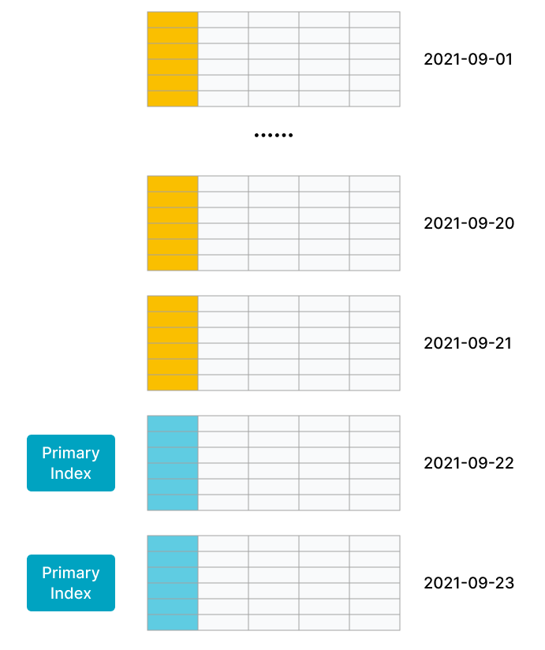

# 主キーテーブル

import Tabs from '@theme/Tabs';

import TabItem from '@theme/TabItem';

主キーテーブルは、StarRocks によって設計された新しいストレージエンジンを使用しています。その主な利点は、リアルタイムのデータ更新をサポートしながら、複雑なアドホッククエリに対して効率的なパフォーマンスを確保することにあります。リアルタイムのビジネス分析では、主キーテーブルを使用して最新のデータを分析し、データ分析におけるデータ遅延を軽減することができます。

主キーテーブルの主キーには UNIQUE 制約と NOT NULL 制約があり、各データ行を一意に識別するために使用されます。新しいデータ行の主キー値が既存のデータ行と同じ場合、UNIQUE 制約違反が発生します。その場合、新しいデータ行が既存のデータ行を置き換えます。

:::info

- v3.0 以降、主キーテーブルのソートキーはテーブルの主キーから切り離され、ソートキーを別に指定できるようになりました。これにより、テーブル作成の柔軟性が向上しました。
- v3.1 以降、StarRocks の共有データモードは主キーテーブルをサポートします。v3.1.4 以降、StarRocks 共有データクラスタで作成された主キーテーブルは、ローカルディスクへのインデックスの永続化をさらにサポートします。

:::

## シナリオ

主キーテーブルは、リアルタイムのデータ更新をサポートしながら、効率的なクエリパフォーマンスを確保します。次のシナリオに適しています。

- **トランザクション処理システムから StarRocks へのリアルタイムデータストリーミング。** 通常、トランザクション処理システムには、挿入操作に加えて、多数の更新および削除操作が含まれます。トランザクション処理システムから StarRocks へのデータ同期が必要な場合は、主キーテーブルを作成することをお勧めします。その後、Apache Flink® の CDC コネクタなどのツールを使用して、トランザクション処理システムのバイナリログを StarRocks に同期できます。StarRocks は、バイナリログを使用して、テーブル内のデータをリアルタイムで追加、削除、および更新します。これにより、データ同期が簡素化され、Merge-On-Read 戦略を採用したユニークキーテーブルを使用する場合よりも 3 倍から 10 倍高いクエリパフォーマンスが得られます。詳細については、[MySQL からのリアルタイム同期](../../loading/Flink_cdc_load.md)を参照してください。
- **個々の列に対する [部分更新を実行して複数のストリームを結合](../../loading/Load_to_Primary_Key_tables.md#partial-updates) します。** ユーザープロファイリングなどのビジネスシナリオでは、フラットテーブルを使用して多次元分析のパフォーマンスを向上させ、データアナリストが使用する分析モデルを簡素化することが好まれます。これらのシナリオでの上流データは、ショッピングアプリ、配達アプリ、銀行アプリなどのさまざまなアプリや、ユーザーの特定のタグやプロパティを取得するために計算を行う機械学習システムなどのシステムから来ることがあります。主キーテーブルは、個々の列の更新をサポートするため、これらのシナリオに適しています。各アプリまたはシステムは、自身のサービス範囲内のデータを保持する列のみを更新しながら、リアルタイムのデータ追加、削除、および更新の高いクエリパフォーマンスの恩恵を受けることができます。

## 動作原理

ユニークキーテーブルと集計テーブルは、Merge-On-Read 戦略を採用しています。この戦略は、データの書き込みを簡単かつ効率的にしますが、データの読み取り中にオンラインで複数のバージョンのデータファイルをマージする必要があります。さらに、Merge オペレーターが存在するため、述語やインデックスを基礎データにプッシュダウンすることができず、クエリパフォーマンスに大きな影響を与えます。

しかし、リアルタイム更新とクエリのパフォーマンスをバランスさせるために、主キーテーブルのメタデータ構造と読み書きメカニズムは、他のタイプのテーブルとは異なります。主キーテーブルは、Delete+Insert 戦略を使用します。この戦略は、主キーインデックスと DelVector を使用して実現されます。この戦略により、クエリ中に同じ主キー値を持つレコードの中で最新のレコードのみを読み取る必要があり、複数のバージョンのデータファイルをマージする必要がなくなります。さらに、述語やインデックスを基礎データにプッシュダウンすることができ、クエリパフォーマンスが大幅に向上します。

主キーテーブル内のデータの書き込みと読み取りの全体的なプロセスは次のとおりです。

- データの書き込みは、StarRocks の内部 Loadjob を通じて実現され、データ変更操作（挿入、更新、削除）のバッチを含みます。StarRocks は、対応するタブレットの主キーインデックスをメモリにロードします。削除操作の場合、StarRocks はまず主キーインデックスを使用して、各データ行の元の位置（データファイルと行番号）を見つけ、DelVector（データロード中に生成された削除マーカーを格納および管理する）でデータ行を削除済みとしてマークします。更新操作の場合、DelVector で元のデータ行を削除済みとしてマークすることに加えて、StarRocks は最新のデータ行を新しいデータファイルに書き込み、更新を Delete+Insert に変換します（以下の図に示されています）。主キーインデックスも更新され、変更されたデータ行の新しい位置（データファイルと行番号）が記録されます。

   
- データの読み取り中、さまざまなデータファイル内の履歴の重複レコードは、データの書き込み中にすでに削除済みとしてマークされているため、同じ主キー値を持つ最新のデータ行のみを読み取る必要があります。複数のバージョンのデータファイルをオンラインで読み取ってデータを重複排除し、最新のデータを見つける必要はありません。基礎データファイルがスキャンされるとき、フィルターオペレーターやさまざまなインデックスがスキャンのオーバーヘッドを削減するのに役立ちます（以下の図に示されています）。したがって、クエリパフォーマンスは大幅に向上します。ユニークキーテーブルの Merge-On-Read 戦略と比較して、主キーテーブルの Delete+Insert 戦略は、クエリパフォーマンスを 3 倍から 10 倍向上させることができます。

   

<details>
<summary>詳細情報</summary>

主キーテーブルへのデータの書き込みや読み取りの詳細なプロセスを理解したい場合は、以下の詳細なデータ書き込みおよび読み取りプロセスを探ることができます。

StarRocks は列指向（カラムナ）ストレージを使用する分析データベースです。具体的には、テーブル内のタブレットは通常、複数の rowset ファイルを含んでおり、各 rowset ファイルのデータは実際にはセグメントファイルに格納されています。セグメントファイルはデータを列指向形式（Parquet に似ている）で組織し、不変です。

書き込むデータが Executor BE ノードに分散されると、各 Executor BE ノードは Loadjob を実行します。Loadjob にはデータ変更のバッチが含まれ、ACID プロパティを持つトランザクションと見なすことができます。Loadjob は書き込みとコミットの 2 つのステージに分けられます。

1. 書き込みステージ: データはパーティションとバケット情報に基づいて対応するタブレットに分散されます。タブレットがデータを受け取ると、データは列指向形式で格納され、新しい rowset が形成されます。
2. コミットステージ: すべてのデータが正常に書き込まれると、FE は関与するすべてのタブレットにコミットを開始します。各コミットには、タブレットのデータの最新バージョンを表すバージョン番号が含まれています。コミットプロセスには、主キーインデックスの検索と更新、すべての変更されたデータの削除としてのマーク、削除としてマークされたデータに基づく DelVector の作成、および新しいバージョンのメタデータの生成が含まれます。

データの読み取り中、メタデータを使用して、最新のタブレットバージョンに基づいて読み取る必要のある rowset を見つけます。rowset 内のセグメントファイルが読み取られるとき、その最新バージョンの DelVector もチェックされ、最新のデータのみを読み取ることができ、同じ主キー値を持つ古いデータを読み取ることを避けることができます。さらに、Scan レイヤーにプッシュダウンされたフィルターオペレーターは、さまざまなインデックスを直接利用してスキャンのオーバーヘッドを削減できます。

- **タブレット**: テーブルは、パーティションおよびバケットメカニズムに基づいて複数のタブレットに分割されます。これは実際の物理ストレージユニットであり、異なる BEs にレプリカとして分散されます。

   

- **メタデータ**: メタデータは、タブレットのバージョン履歴と各バージョンに関する情報（たとえば、どの rowset が含まれているか）を格納します。各 Loadjob または compaction のコミットフェーズは新しいバージョンを生成します。

   

- **主キーインデックス**: 主キーインデックスは、主キー値によって識別されるデータ行とそのデータ行の位置とのマッピングを格納します。これは HashMap として実装されており、キーはエンコードされた主キー値を表し、値はデータ行の位置（`rowset_id`、`segment_id`、`rowid` を含む）を表します。通常、主キーインデックスは、特定の主キー値によって識別される各データ行が存在する rowset と行を見つけるために、データ書き込み中にのみ使用されます。
- **DelVector**: DelVector は、各 rowset 内のセグメントファイル（列指向ファイル）に対する削除マーカーを格納します。
- **Rowset**: Rowset は論理的な概念であり、タブレット内のデータ変更のバッチからデータセットを格納します。
- **セグメント**: Rowset 内のデータは実際にセグメント化され、1 つ以上のセグメントファイル（列指向ファイル）に格納されます。各セグメントファイルには、列の値と列に関連するインデックス情報が含まれています。

</details>

## 使用方法

### 主キーテーブルの作成

主キーテーブルを作成するには、`CREATE TABLE` ステートメントで主キーを定義するだけです。例:

```SQL
CREATE TABLE orders1 (
    order_id bigint NOT NULL,
    dt date NOT NULL,
    user_id INT NOT NULL,
    good_id INT NOT NULL,
    cnt int NOT NULL,
    revenue int NOT NULL
)
PRIMARY KEY (order_id)
DISTRIBUTED BY HASH (order_id)
;
```

:::info

主キーテーブルは、バケッティング戦略としてハッシュバケッティングのみをサポートしているため、`DISTRIBUTED BY HASH ()` を使用してハッシュバケッティングキーを定義する必要があります。

:::

しかし、実際のビジネスシナリオでは、主キーテーブルを作成する際に、クエリを高速化し、データをより効率的に管理するために、データ分散やソートキーなどの追加機能がよく使用されます。

たとえば、注文テーブルの `order_id` フィールドはデータ行を一意に識別できるため、`order_id` フィールドを主キーとして使用できます。

v3.0 以降、主キーテーブルのソートキーはテーブルの主キーから切り離されています。そのため、クエリフィルター条件として頻繁に使用される列を選択してソートキーを形成できます。たとえば、注文日と商人の 2 つの次元の組み合わせに基づいて製品の販売パフォーマンスを頻繁にクエリする場合、`ORDER BY (dt,merchant_id)` 句を使用してソートキーを `dt` と `merchant_id` に指定できます。

データ分散戦略を使用する場合、主キーテーブルは現在、主キーにパーティション列とバケッティング列を含める必要があります。たとえば、データ分散戦略は `dt` をパーティション列として使用し、`merchant_id` をハッシュバケッティング列として使用します。主キーにも `dt` と `merchant_id` を含める必要があります。

要約すると、上記の注文テーブルの CREATE TABLE ステートメントは次のようになります。

```SQL
CREATE TABLE orders2 (
    order_id bigint NOT NULL,
    dt date NOT NULL,
    merchant_id int NOT NULL,
    user_id int NOT NULL,
    good_id int NOT NULL,
    good_name string NOT NULL,
    price int NOT NULL,
    cnt int NOT NULL,
    revenue int NOT NULL,
    state tinyint NOT NULL
)
PRIMARY KEY (order_id,dt,merchant_id)
PARTITION BY date_trunc('day', dt)
DISTRIBUTED BY HASH (merchant_id)
ORDER BY (dt,merchant_id)
PROPERTIES (
    "enable_persistent_index" = "true"
);
```

### 主キー

テーブルの主キーは、そのテーブル内の各行を一意に識別するために使用されます。主キーを構成する 1 つ以上の列は `PRIMARY KEY` で定義され、UNIQUE 制約と NOT NULL 制約があります。

主キーに関する考慮事項は次のとおりです。

- CREATE TABLE ステートメントでは、主キー列は他の列の前に定義する必要があります。
- 主キー列にはパーティション列とバケッティング列を含める必要があります。
- 主キー列は、数値（整数および BOOLEAN を含む）、文字列、日付（DATE および DATETIME）のデータ型をサポートします。
- デフォルトでは、エンコードされた主キー値の最大長は 128 バイトです。
- テーブル作成後に主キーを変更することはできません。
- データの一貫性を保つために、主キー値を更新することはできません。

### 主キーインデックス

主キーインデックスは、主キー値と主キー値によって識別されるデータ行の位置とのマッピングを格納するために使用されます。通常、関連するタブレットの主キーインデックスは、データロード中（データ変更のバッチを含む）にのみメモリにロードされます。クエリおよび更新のパフォーマンス要件、メモリおよびディスクを包括的に評価した後、主キーインデックスを永続化することを検討できます。

<Tabs groupId="primary key index">

  <TabItem value="example1" label="永続的な主キーインデックス" default>

`enable_persistent_index` が `true`（デフォルト）に設定されている場合、主キーインデックスはディスクに永続化されます。ロード中、主キーインデックスの一部はメモリにロードされますが、大部分はディスクに保存され、メモリを占有しすぎないようにします。一般的に、永続的な主キーインデックスを持つテーブルのクエリおよび更新パフォーマンスは、完全にメモリ内の主キーインデックスを持つテーブルとほぼ同等です。

ディスクが SSD の場合、`true` に設定することをお勧めします。ディスクが HDD でロード頻度が高くない場合も、`true` に設定できます。

:::info

v3.1.4 以降、StarRocks 共有データクラスタで作成された主キーテーブルは、ローカルディスクへのインデックスの永続化をさらにサポートします。

:::

</TabItem>

<TabItem value="example2" label="完全にメモリ内の主キーインデックス">

`enable_persistent_index` が `false` に設定されている場合、主キーインデックスはディスクに永続化されず、完全にメモリに格納されます。ロード中、ロードされたデータに関連するタブレットの主キーインデックスがメモリにロードされ、メモリ消費が増加する可能性があります。（タブレットが長期間データをロードしていない場合、その主キーインデックスはメモリから解放されます。）

完全にメモリ内の主キーインデックスを使用する場合、主キーの設計時に以下のガイドラインに従って、主キーインデックスのメモリ使用量を制御することをお勧めします。

- 主キー列の数と総長を適切に設計する必要があります。メモリをあまり占有しないデータ型の列を特定し、それらの列を主キーとして定義することをお勧めします。たとえば、VARCHAR ではなく、INT や BIGINT などです。
- テーブルを作成する前に、主キー列のデータ型とテーブル内の行数に基づいて、主キーインデックスが占有するメモリを見積もることをお勧めします。これにより、メモリ不足を防ぐことができます。次の例は、主キーインデックスが占有するメモリを計算する方法を説明しています。
  - DATE データ型で 4 バイトを占有する `dt` 列と、BIGINT データ型で 8 バイトを占有する `id` 列が主キーとして定義されているとします。この場合、主キーは 12 バイトの長さです。
  - テーブルには 10,000,000 行のホットデータが含まれ、3 つのレプリカに格納されているとします。
  - 上記の情報を考慮すると、次の式に基づいて主キーインデックスが占有するメモリは 945 MB です。`(12 + 9) x 10,000,000 x 3 x 1.5 = 945 (MB)`

    上記の式では、`9` は各行の不変のオーバーヘッドであり、`1.5` はハッシュテーブルごとの平均追加オーバーヘッドです。

完全にメモリ内の主キーインデックスを持つ主キーテーブルは、主キーが占有するメモリが制御可能なシナリオに適しています。例:

- テーブルには、急速に変化するデータとゆっくり変化するデータの両方が含まれています。急速に変化するデータは、最近の日に頻繁に更新されますが、ゆっくり変化するデータはほとんど更新されません。たとえば、MySQL の注文テーブルをリアルタイムで StarRocks に同期して分析およびクエリを行う必要があるとします。この例では、テーブルのデータは日ごとにパーティション分けされ、ほとんどの更新は最近作成された注文に対して行われます。履歴注文は完了後に更新されなくなります。データロードジョブを実行すると、履歴注文の主キーインデックスはメモリにロードされません。最近更新された注文の主キーインデックスのみがメモリにロードされます。
  
  次の図に示すように、テーブル内のデータは日ごとにパーティション分けされ、最近の 2 つのパーティションのデータが頻繁に更新されます。

   

- テーブルは、数百または数千の列で構成されたフラットテーブルです。主キーはテーブルデータのごく一部を構成し、わずかなメモリしか消費しません。たとえば、ユーザーのステータスやプロファイルテーブルは、多数の列で構成されていますが、ユーザー数は数千万から数億に過ぎません。この状況では、主キーが消費するメモリ量は制御可能です。
  
  次の図に示すように、テーブルにはわずか数行しか含まれておらず、テーブルの主キーはテーブルのごく一部を構成しています。
   

</TabItem>

</Tabs>

### ソートキー

v3.0 以降、主キーテーブルはソートキーを主キーから切り離しています。ソートキーは `ORDER BY` で定義された列で構成され、ソートキーの要件を満たすデータ型の列であれば、任意の組み合わせで構成できます。

データロード中、データはソートキーに従ってソートされた後に格納されます。ソートキーは、クエリアクセラレーションのためにプレフィックスインデックスを構築するためにも使用されます。[クエリアクセラレーションを実現するプレフィックスインデックスを形成するためにソートキーを適切に設計することをお勧めします](../indexes/Prefix_index_sort_key.md#how-to-design-the-sort-key-appropriately-to-form-the-prefix-index-that-can-accelerate-queries)。

:::info

- ソートキーが指定されている場合、プレフィックスインデックスはソートキーに基づいて構築されます。ソートキーが指定されていない場合、プレフィックスインデックスは主キーに基づいて構築されます。
- テーブル作成後、`ALTER TABLE ... ORDER BY ...` を使用してソートキーを変更できます。ソートキーの削除はサポートされておらず、ソート列のデータ型の変更もサポートされていません。

:::

## さらに詳しく

- 作成したテーブルにデータをロードするには、[データロードの概要](../../loading/Loading_intro.md)を参照して適切なロードオプションを選択できます。
- 主キーテーブルのデータを変更する必要がある場合は、[ロードを通じてデータを変更する](../../loading/Load_to_Primary_Key_tables.md)か、DML（[INSERT](../../sql-reference/sql-statements/loading_unloading/INSERT.md)、[UPDATE](../../sql-reference/sql-statements/table_bucket_part_index/UPDATE.md)、および [DELETE](../../sql-reference/sql-statements/table_bucket_part_index/DELETE.md)）を使用できます。
- クエリをさらに高速化したい場合は、[クエリアクセラレーション](../../using_starrocks/using_starrocks.mdx)を参照してください。
- テーブルスキーマを変更する必要がある場合は、[ALTER TABLE](../../sql-reference/sql-statements/Resource/ALTER_RESOURCE.md)を参照してください。
- [AUTO_INCREMENT](../../sql-reference/sql-statements/generated_columns.md) 列を主キーとして使用できます。