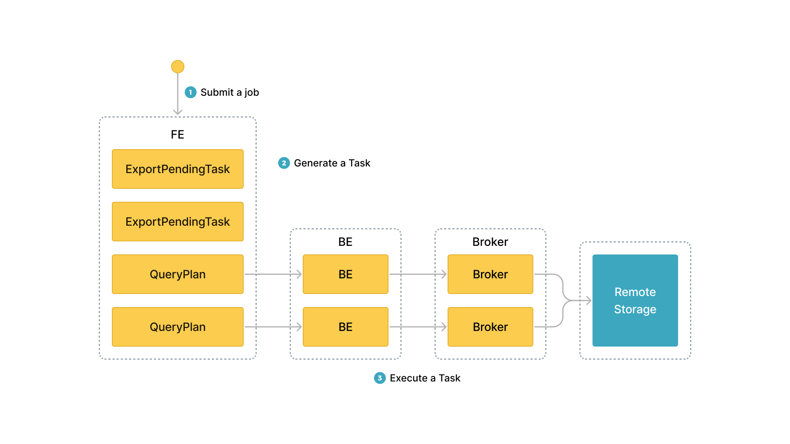

# EXPORT を使用したデータのエクスポート

このトピックでは、StarRocks クラスター内の指定されたテーブルやパーティションからデータを CSV データファイルとして外部ストレージシステムにエクスポートする方法について説明します。外部ストレージシステムは、分散ファイルシステム HDFS や AWS S3 などのクラウドストレージシステムである可能性があります。

## 背景情報

バージョン 2.4 以前では、StarRocks はデータをエクスポートする際に EXPORT ステートメントを使用して、StarRocks クラスターと外部ストレージシステム間の接続を確立するためにブローカーに依存していました。そのため、EXPORT ステートメントで使用するブローカーを指定するために `WITH BROKER "<broker_name>"` を入力する必要があります。これを「ブローカーを使用したアンロード」と呼びます。ブローカーは独立したステートレスなサービスであり、ファイルシステムインターフェースと統合されており、StarRocks が外部ストレージシステムにデータをエクスポートするのを支援します。

バージョン 2.5 以降、StarRocks はデータをエクスポートする際に EXPORT ステートメントを使用して、StarRocks クラスターと外部ストレージシステム間の接続を確立するためにブローカーに依存しなくなりました。そのため、EXPORT ステートメントでブローカーを指定する必要はありませんが、`WITH BROKER` キーワードは保持する必要があります。これを「ブローカーを使用しないアンロード」と呼びます。

ただし、データが HDFS に保存されている場合、ブローカーを使用しないアンロードが機能しないことがあり、ブローカーを使用したアンロードに頼ることができます。

- 複数の HDFS クラスターにデータをエクスポートする場合、これらの HDFS クラスターごとに独立したブローカーを展開および設定する必要があります。
- 単一の HDFS クラスターにデータをエクスポートし、複数の Kerberos ユーザーを設定している場合、独立したブローカーを 1 つ展開する必要があります。

> **注意**
>
> [SHOW BROKER](../sql-reference/sql-statements/Administration/SHOW_BROKER.md) ステートメントを使用して、StarRocks クラスターに展開されているブローカーを確認できます。ブローカーが展開されていない場合は、[ブローカーの展開](../deployment/deploy_broker.md) の手順に従ってブローカーを展開できます。

## サポートされているストレージシステム

- 分散ファイルシステム HDFS
- AWS S3 などのクラウドストレージシステム

## 注意事項

- 一度にエクスポートするデータは数十 GB を超えないことをお勧めします。一度に非常に大量のデータをエクスポートすると、エクスポートが失敗し、エクスポートの再試行のコストが増加する可能性があります。

- ソースの StarRocks テーブルに大量のデータが含まれている場合、テーブルのすべてのデータがエクスポートされるまで、テーブルの数パーティションのみからデータをエクスポートすることをお勧めします。

- StarRocks クラスター内の FE が再起動したり、新しい Leader FE が選出されたりすると、エクスポートジョブが実行中の場合、エクスポートジョブは失敗します。この場合、エクスポートジョブを再度提出する必要があります。

- エクスポートジョブが終了した後に StarRocks クラスター内の FE が再起動したり、新しい Leader FE が選出されたりすると、[SHOW EXPORT](../sql-reference/sql-statements/data-manipulation/SHOW_EXPORT.md) ステートメントによって返されるジョブ情報の一部が失われることがあります。

- StarRocks はベーステーブルのデータのみをエクスポートします。ベーステーブル上に作成されたマテリアライズドビューのデータはエクスポートしません。

- エクスポートジョブはデータスキャンを必要とし、これにより I/O リソースを占有し、クエリの遅延が増加します。

## ワークフロー

エクスポートジョブを提出すると、StarRocks はエクスポートジョブに関与するすべてのタブレットを特定します。次に、StarRocks は関与するタブレットをグループに分け、クエリプランを生成します。クエリプランは、関与するタブレットからデータを読み取り、データを宛先ストレージシステムの指定されたパスに書き込むために使用されます。

次の図は、一般的なワークフローを示しています。



一般的なワークフローは次の 3 つのステップで構成されます。

1. ユーザーがエクスポートジョブを Leader FE に提出します。

2. Leader FE は StarRocks クラスター内のすべての BE に `snapshot` 命令を発行し、BE が関与するタブレットのスナップショットを取得して、エクスポートされるデータの一貫性を確保します。Leader FE はまた、複数のエクスポートタスクを生成します。各エクスポートタスクはクエリプランであり、各クエリプランは関与するタブレットの一部を処理するために使用されます。

3. Leader FE はエクスポートタスクを BE に配布します。

## 原則

StarRocks がクエリプランを実行するとき、まず宛先ストレージシステムの指定されたパスに `__starrocks_export_tmp_xxx` という名前の一時フォルダーを作成します。この一時フォルダーの名前の中で、`xxx` はエクスポートジョブの ID を表します。一時フォルダーの名前の例は `__starrocks_export_tmp_921d8f80-7c9d-11eb-9342-acde48001122` です。StarRocks がクエリプランを正常に実行すると、一時フォルダーに一時ファイルを生成し、エクスポートされたデータを生成された一時ファイルに書き込みます。

すべてのデータがエクスポートされた後、StarRocks は RENAME ステートメントを使用して、生成された一時ファイルを指定されたパスに保存します。

## 関連パラメーター

このセクションでは、StarRocks クラスターの FE で設定できるエクスポート関連のパラメーターについて説明します。

- `export_checker_interval_second`: エクスポートジョブがスケジュールされる間隔。デフォルトの間隔は 5 秒です。FE のこのパラメーターを再設定した後、FE を再起動して新しいパラメーター設定を有効にする必要があります。

- `export_running_job_num_limit`: 許可される実行中のエクスポートジョブの最大数。この制限を超えると、過剰なエクスポートジョブは `snapshot` 実行後に待機状態になります。デフォルトの最大数は 5 です。エクスポートジョブが実行中のときにこのパラメーターを再設定できます。

- `export_task_default_timeout_second`: エクスポートジョブのタイムアウト期間。デフォルトのタイムアウト期間は 2 時間です。エクスポートジョブが実行中のときにこのパラメーターを再設定できます。

- `export_max_bytes_per_be_per_task`: 各 BE からのエクスポートタスクごとに圧縮された状態でエクスポートできるデータの最大量。このパラメーターは、StarRocks がエクスポートジョブを同時に実行できるエクスポートタスクに分割するためのポリシーを提供します。デフォルトの最大量は 256 MB です。

- `export_task_pool_size`: スレッドプールによって同時に実行できるエクスポートタスクの最大数。デフォルトの最大数は 5 です。

## 基本操作

### エクスポートジョブの提出

StarRocks データベース `db1` に `tbl1` という名前のテーブルが含まれているとします。`tbl1` のパーティション `p1` と `p2` から `col1` と `col3` のデータを HDFS クラスターの `export` パスにエクスポートするには、次のコマンドを実行します。

```SQL
EXPORT TABLE db1.tbl1 
PARTITION (p1,p2)
(col1, col3)
TO "hdfs://HDFS_IP:HDFS_Port/export/lineorder_" 
PROPERTIES
(
    "column_separator"=",",
    "load_mem_limit"="2147483648",
    "timeout" = "3600"
)
WITH BROKER
(
    "username" = "user",
    "password" = "passwd"
);
```

AWS S3 にデータをエクスポートするための詳細な構文とパラメーターの説明、およびコマンド例については、[EXPORT](../sql-reference/sql-statements/data-manipulation/EXPORT.md) を参照してください。

### エクスポートジョブのクエリ ID の取得

エクスポートジョブを提出した後、SELECT LAST_QUERY_ID() ステートメントを使用してエクスポートジョブのクエリ ID をクエリできます。クエリ ID を使用して、エクスポートジョブを表示またはキャンセルできます。

詳細な構文とパラメーターの説明については、[last_query_id](../sql-reference/sql-functions/utility-functions/last_query_id.md) を参照してください。

### エクスポートジョブのステータスの表示

エクスポートジョブを提出した後、SHOW EXPORT ステートメントを使用してエクスポートジョブのステータスを表示できます。例:

```SQL
SHOW EXPORT WHERE queryid = "edee47f0-abe1-11ec-b9d1-00163e1e238f";
```

> **注意**
>
> 上記の例では、`queryid` はエクスポートジョブのクエリ ID です。

次のような情報が返されます。

```Plain
JobId: 14008
State: FINISHED
Progress: 100%
TaskInfo: {"partitions":["*"],"mem limit":2147483648,"column separator":",","line delimiter":"\n","tablet num":1,"broker":"hdfs","coord num":1,"db":"default_cluster:db1","tbl":"tbl3",columns:["col1", "col3"]}
Path: oss://bj-test/export/
CreateTime: 2019-06-25 17:08:24
StartTime: 2019-06-25 17:08:28
FinishTime: 2019-06-25 17:08:34
Timeout: 3600
ErrorMsg: N/A
```

詳細な構文とパラメーターの説明については、[SHOW EXPORT](../sql-reference/sql-statements/data-manipulation/SHOW_EXPORT.md) を参照してください。

### エクスポートジョブのキャンセル

提出したエクスポートジョブをキャンセルするには、CANCEL EXPORT ステートメントを使用します。例:

```SQL
CANCEL EXPORT WHERE queryid = "921d8f80-7c9d-11eb-9342-acde48001122";
```

> **注意**
>
> 上記の例では、`queryid` はエクスポートジョブのクエリ ID です。

詳細な構文とパラメーターの説明については、[CANCEL EXPORT](../sql-reference/sql-statements/data-manipulation/CANCEL_EXPORT.md) を参照してください。

## ベストプラクティス

### クエリプランの分割

エクスポートジョブが分割されるクエリプランの数は、エクスポートジョブに関与するタブレットの数と、クエリプランごとに処理できるデータの最大量によって異なります。エクスポートジョブはクエリプランとして再試行されます。クエリプランによって処理されるデータ量が許容される最大量を超える場合、クエリプランはリモートストレージのジッターなどのエラーに遭遇します。その結果、クエリプランの再試行のコストが増加します。各 BE がクエリプランごとに処理できるデータの最大量は、`export_max_bytes_per_be_per_task` パラメーターによって指定され、デフォルトでは 256 MB です。クエリプランでは、各 BE に少なくとも 1 つのタブレットが割り当てられ、`export_max_bytes_per_be_per_task` パラメーターで指定された制限を超えないデータ量をエクスポートできます。

エクスポートジョブの複数のクエリプランは同時に実行されます。FE パラメーター `export_task_pool_size` を使用して、スレッドプールによって同時に実行されるエクスポートタスクの最大数を指定できます。このパラメーターのデフォルト値は `5` です。

通常、エクスポートジョブの各クエリプランは、スキャンとエクスポートの 2 つの部分のみで構成されます。クエリプランに必要な計算を実行するロジックは多くのメモリを消費しません。したがって、デフォルトのメモリ制限である 2 GB は、ほとんどのビジネス要件を満たすことができます。ただし、特定の状況では、クエリプランが BE 上の多くのタブレットをスキャンする必要がある場合や、タブレットに多くのバージョンがある場合、2 GB のメモリ容量では不十分な場合があります。このような状況では、`load_mem_limit` パラメーターを使用して、4 GB や 8 GB などのより高いメモリ容量制限を指定する必要があります。