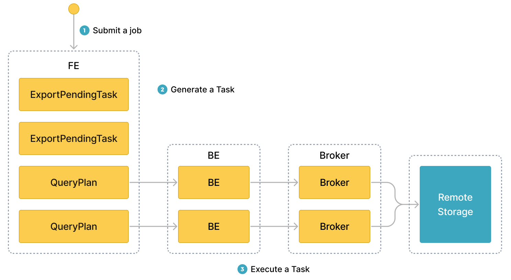

# EXPORT を使用したデータのエクスポート

このトピックでは、StarRocks クラスター内の指定されたテーブルまたはパーティションからデータを CSV データファイルとして外部ストレージシステムにエクスポートする方法について説明します。外部ストレージシステムは、分散ファイルシステム HDFS または AWS S3 などのクラウドストレージシステムである可能性があります。

> **注意**
>
> StarRocks テーブルからデータをエクスポートするには、その StarRocks テーブルに対して EXPORT 権限を持つユーザーである必要があります。EXPORT 権限を持っていない場合は、[GRANT](../sql-reference/sql-statements/account-management/GRANT.md) に記載された手順に従って、StarRocks クラスターに接続するために使用するユーザーに EXPORT 権限を付与してください。

## 背景情報

バージョン 2.4 以前では、StarRocks は EXPORT ステートメントを使用してデータをエクスポートする際に、StarRocks クラスターと外部ストレージシステム間の接続を設定するためにブローカーに依存していました。そのため、EXPORT ステートメントで使用するブローカーを指定するために `WITH BROKER "<broker_name>"` を入力する必要がありました。これを「ブローカー ベースのアンロード」と呼びます。ブローカーは独立したステートレスサービスであり、ファイルシステムインターフェースと統合されており、StarRocks が外部ストレージシステムにデータをエクスポートするのを支援します。

バージョン 2.5 以降、StarRocks は EXPORT ステートメントを使用してデータをエクスポートする際に、StarRocks クラスターと外部ストレージシステム間の接続を設定するためにブローカーに依存しなくなりました。そのため、EXPORT ステートメントでブローカーを指定する必要はありませんが、`WITH BROKER` キーワードは保持する必要があります。これを「ブローカーフリーアンロード」と呼びます。

ただし、データが HDFS に保存されている場合、ブローカーフリーアンロードが機能しないことがあり、ブローカー ベースのアンロードを利用することができます。

- 複数の HDFS クラスターにデータをエクスポートする場合、これらの HDFS クラスターごとに独立したブローカーを展開して設定する必要があります。
- 単一の HDFS クラスターにデータをエクスポートし、複数の Kerberos ユーザーを設定している場合、独立したブローカーを 1 つ展開する必要があります。

## 対応ストレージシステム

- 分散ファイルシステム HDFS
- AWS S3 などのクラウドストレージシステム

## 注意事項

- 一度にエクスポートするデータは数十 GB を超えないことをお勧めします。一度に非常に大量のデータをエクスポートすると、エクスポートが失敗する可能性があり、エクスポートの再試行のコストが増加します。

- ソースの StarRocks テーブルに大量のデータが含まれている場合、テーブルのデータをすべてエクスポートするまで、テーブルのパーティションの一部からのみデータをエクスポートすることをお勧めします。

- StarRocks クラスター内の FEs が再起動したり、新しい Leader FE が選出されたりすると、エクスポートジョブが実行中にエクスポートジョブが失敗します。この場合、エクスポートジョブを再度送信する必要があります。

- StarRocks クラスター内の FEs が再起動したり、新しい Leader FE が選出されたりした後にエクスポートジョブが終了すると、[SHOW EXPORT](../sql-reference/sql-statements/loading_unloading/unloading/SHOW_EXPORT.md) ステートメントによって返されるジョブ情報の一部が失われる可能性があります。

- StarRocks はベーステーブルのデータのみをエクスポートします。ベーステーブル上に作成されたマテリアライズドビューのデータはエクスポートしません。

- エクスポートジョブにはデータスキャンが必要であり、これにより I/O リソースが占有され、クエリの遅延が増加します。

## ワークフロー

エクスポートジョブを送信すると、StarRocks はエクスポートジョブに関与するすべてのタブレットを特定します。次に、StarRocks は関与するタブレットをグループに分け、クエリプランを生成します。クエリプランは、関与するタブレットからデータを読み取り、データを宛先ストレージシステムの指定されたパスに書き込むために使用されます。

次の図は、一般的なワークフローを示しています。



一般的なワークフローは次の 3 つのステップで構成されています。

1. ユーザーがエクスポートジョブを Leader FE に送信します。

2. Leader FE は StarRocks クラスター内のすべての BE または CN に `snapshot` 命令を発行し、BE または CN が関与するタブレットのスナップショットを取得して、エクスポートされるデータの一貫性を確保できるようにします。Leader FE はまた、複数のエクスポートタスクを生成します。各エクスポートタスクはクエリプランであり、各クエリプランは関与するタブレットの一部を処理するために使用されます。

3. Leader FE はエクスポートタスクを BE または CN に配布します。

## 原則

StarRocks がクエリプランを実行する際、まず宛先ストレージシステムの指定されたパスに `__starrocks_export_tmp_xxx` という名前の一時フォルダーを作成します。一時フォルダーの名前の中で、`xxx` はエクスポートジョブの ID を表します。一時フォルダーの名前の例は `__starrocks_export_tmp_921d8f80-7c9d-11eb-9342-acde48001122` です。StarRocks がクエリプランを正常に実行すると、一時フォルダーに一時ファイルが生成され、エクスポートされたデータが生成された一時ファイルに書き込まれます。

すべてのデータがエクスポートされた後、StarRocks は RENAME ステートメントを使用して生成された一時ファイルを指定されたパスに保存します。

## 関連パラメーター

このセクションでは、StarRocks クラスターの FEs で設定できるエクスポート関連のパラメーターについて説明します。

- `export_checker_interval_second`: エクスポートジョブがスケジュールされる間隔。デフォルトの間隔は 5 秒です。このパラメーターを FE に再設定した後、FE を再起動して新しいパラメーター設定を有効にする必要があります。

- `export_running_job_num_limit`: 許可される実行中のエクスポートジョブの最大数。この制限を超えると、過剰なエクスポートジョブは `snapshot` 実行後に待機状態に入ります。デフォルトの最大数は 5 です。エクスポートジョブが実行中にこのパラメーターを再設定できます。

- `export_task_default_timeout_second`: エクスポートジョブのタイムアウト期間。デフォルトのタイムアウト期間は 2 時間です。エクスポートジョブが実行中にこのパラメーターを再設定できます。

- `export_max_bytes_per_be_per_task`: 各 BE または CN からエクスポートタスクごとに圧縮された状態でエクスポートできるデータの最大量。このパラメーターは、StarRocks がエクスポートジョブを同時に実行できるエクスポートタスクに分割するためのポリシーを提供します。デフォルトの最大量は 256 MB です。

- `export_task_pool_size`: スレッドプールによって同時に実行できるエクスポートタスクの最大数。デフォルトの最大数は 5 です。

## 基本操作

### エクスポートジョブの送信

StarRocks データベース `db1` に `tbl1` という名前のテーブルが含まれているとします。`tbl1` のパーティション `p1` と `p2` から `col1` と `col3` のデータを HDFS クラスターの `export` パスにエクスポートするには、次のコマンドを実行します。

```SQL
EXPORT TABLE db1.tbl1 
PARTITION (p1,p2)
(col1, col3)
TO "hdfs://HDFS_IP:HDFS_Port/export/lineorder_" 
PROPERTIES
(
    "column_separator"=",",
    "load_mem_limit"="2147483648",
    "timeout" = "3600"
)
WITH BROKER
(
    "username" = "user",
    "password" = "passwd"
);
```

AWS S3 へのデータエクスポートの詳細な構文とパラメーターの説明、およびコマンド例については、[EXPORT](../sql-reference/sql-statements/loading_unloading/unloading/EXPORT.md) を参照してください。

### エクスポートジョブのクエリ ID の取得

エクスポートジョブを送信した後、SELECT LAST_QUERY_ID() ステートメントを使用してエクスポートジョブのクエリ ID を照会できます。クエリ ID を使用して、エクスポートジョブを表示またはキャンセルできます。

詳細な構文とパラメーターの説明については、[last_query_id](../sql-reference/sql-functions/utility-functions/last_query_id.md) を参照してください。

### エクスポートジョブのステータスの表示

エクスポートジョブを送信した後、SHOW EXPORT ステートメントを使用してエクスポートジョブのステータスを表示できます。例:

```SQL
SHOW EXPORT WHERE queryid = "edee47f0-abe1-11ec-b9d1-00163e1e238f";
```

> **注意**
>
> 上記の例では、`queryid` はエクスポートジョブのクエリ ID です。

次のような情報が返されます。

```Plain
JobId: 14008
State: FINISHED
Progress: 100%
TaskInfo: {"partitions":["*"],"mem limit":2147483648,"column separator":",","line delimiter":"\n","tablet num":1,"broker":"hdfs","coord num":1,"db":"default_cluster:db1","tbl":"tbl3",columns:["col1", "col3"]}
Path: oss://bj-test/export/
CreateTime: 2019-06-25 17:08:24
StartTime: 2019-06-25 17:08:28
FinishTime: 2019-06-25 17:08:34
Timeout: 3600
ErrorMsg: N/A
```

詳細な構文とパラメーターの説明については、[SHOW EXPORT](../sql-reference/sql-statements/loading_unloading/unloading/SHOW_EXPORT.md) を参照してください。

### エクスポートジョブのキャンセル

送信したエクスポートジョブをキャンセルするには、CANCEL EXPORT ステートメントを使用します。例:

```SQL
CANCEL EXPORT WHERE queryid = "921d8f80-7c9d-11eb-9342-acde48001122";
```

> **注意**
>
> 上記の例では、`queryid` はエクスポートジョブのクエリ ID です。

詳細な構文とパラメーターの説明については、[CANCEL EXPORT](../sql-reference/sql-statements/loading_unloading/unloading/CANCEL_EXPORT.md) を参照してください。

## ベストプラクティス

### クエリプランの分割

エクスポートジョブが分割されるクエリプランの数は、エクスポートジョブに関与するタブレットの数と、クエリプランごとに処理できるデータの最大量によって異なります。エクスポートジョブはクエリプランとして再試行されます。クエリプランで処理されるデータ量が許容される最大量を超える場合、クエリプランはリモートストレージのジッターなどのエラーに遭遇します。その結果、クエリプランの再試行のコストが増加します。各 BE または CN がクエリプランごとに処理できるデータの最大量は、`export_max_bytes_per_be_per_task` パラメーターで指定され、デフォルトは 256 MB です。クエリプランでは、各 BE または CN に少なくとも 1 つのタブレットが割り当てられ、`export_max_bytes_per_be_per_task` パラメーターで指定された制限を超えないデータ量をエクスポートできます。

エクスポートジョブの複数のクエリプランは同時に実行されます。FE パラメーター `export_task_pool_size` を使用して、スレッドプールによって同時に実行されるエクスポートタスクの最大数を指定できます。このパラメーターのデフォルトは `5` です。

通常、エクスポートジョブの各クエリプランは、スキャンとエクスポートの 2 つの部分のみで構成されています。クエリプランに必要な計算を実行するためのロジックは、あまりメモリを消費しません。そのため、デフォルトのメモリ制限である 2 GB は、ほとんどのビジネス要件を満たすことができます。ただし、特定の状況では、たとえば、クエリプランが BE または CN 上の多くのタブレットをスキャンする必要がある場合や、タブレットに多くのバージョンがある場合、2 GB のメモリ容量では不十分な場合があります。このような場合、`load_mem_limit` パラメーターを使用して、4 GB や 8 GB などのより高いメモリ容量制限を指定する必要があります。