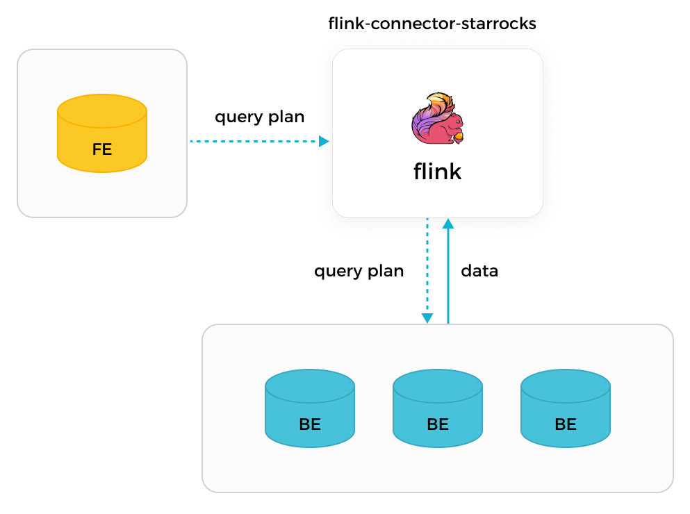
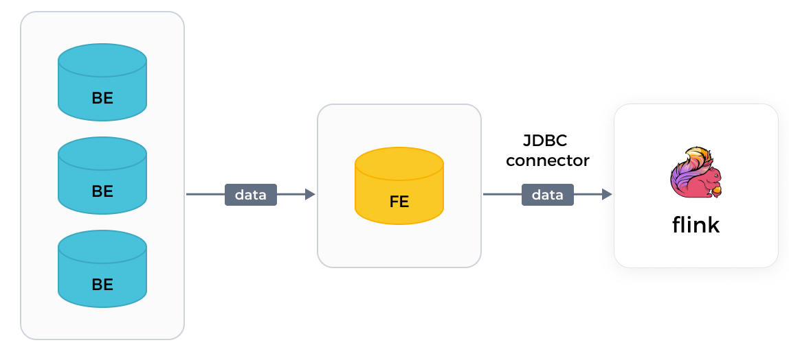

# Flink コネクタを使用して StarRocks からデータを読み取る

StarRocks は、Apache Flink® 用に自社開発したコネクタである StarRocks Connector for Apache Flink®（以下、Flink コネクタ）を提供しており、Flink を使用して StarRocks クラスターからデータを一括で読み取ることができます。

Flink コネクタは、Flink SQL と Flink DataStream の2つの読み取り方法をサポートしています。Flink SQL の使用を推奨します。

> **NOTE**
>
> Flink コネクタは、Flink によって読み取られたデータを別の StarRocks クラスターやストレージシステムに書き込むこともサポートしています。詳細は [Apache Flink® からデータを継続的にロードする](../loading/Flink-connector-starrocks.md) を参照してください。

## 背景情報

Flink が提供する JDBC コネクタとは異なり、StarRocks の Flink コネクタは、StarRocks クラスターの複数の BE から並行してデータを読み取ることができ、読み取りタスクを大幅に高速化します。以下の比較は、2つのコネクタの実装の違いを示しています。

- StarRocks の Flink コネクタ

  StarRocks の Flink コネクタを使用すると、Flink はまず責任を持つ FE からクエリプランを取得し、取得したクエリプランをパラメータとして関与するすべての BE に配布し、最終的に BE から返されたデータを取得します。

  

- Flink の JDBC コネクタ

  Flink の JDBC コネクタを使用すると、Flink は個々の FE からのみデータを読み取ることができ、一度に1つずつです。データの読み取りは遅いです。

  

## バージョン要件

| コネクタ | Flink                    | StarRocks     | Java | Scala     |
|---------|--------------------------|---------------| ---- |-----------|
| 1.2.10  | 1.15,1.16,1.17,1.18,1.19 | 2.1 and later | 8    | 2.11,2.12 |
| 1.2.9   | 1.15,1.16,1.17,1.18      | 2.1 and later | 8    | 2.11,2.12 |
| 1.2.8   | 1.13,1.14,1.15,1.16,1.17 | 2.1 and later | 8    | 2.11,2.12 |
| 1.2.7   | 1.11,1.12,1.13,1.14,1.15 | 2.1 and later | 8    | 2.11,2.12 |

## 前提条件

Flink がデプロイされていること。Flink がデプロイされていない場合は、以下の手順に従ってデプロイしてください。

1. Java 8 または Java 11 をオペレーティングシステムにインストールして、Flink が正常に動作するようにします。Java インストールのバージョンを確認するには、次のコマンドを使用できます。

   ```SQL
   java -version
   ```

   例えば、次の情報が返された場合、Java 8 がインストールされています。

   ```SQL
   openjdk version "1.8.0_322"
   OpenJDK Runtime Environment (Temurin)(build 1.8.0_322-b06)
   OpenJDK 64-Bit Server VM (Temurin)(build 25.322-b06, mixed mode)
   ```

2. お好みの [Flink パッケージ](https://flink.apache.org/downloads.html) をダウンロードして解凍します。

   > **NOTE**
   >
   > Flink v1.14 以降の使用を推奨します。サポートされている最小の Flink バージョンは v1.11 です。

   ```SQL
   # Flink パッケージをダウンロードします。
   wget https://dlcdn.apache.org/flink/flink-1.14.5/flink-1.14.5-bin-scala_2.11.tgz
   # Flink パッケージを解凍します。
   tar -xzf flink-1.14.5-bin-scala_2.11.tgz
   # Flink ディレクトリに移動します。
   cd flink-1.14.5
   ```

3. Flink クラスターを起動します。

   ```SQL
   # Flink クラスターを起動します。
   ./bin/start-cluster.sh
         
   # 次の情報が表示された場合、Flink クラスターが正常に起動しています:
   Starting cluster.
   Starting standalonesession daemon on host.
   Starting taskexecutor daemon on host.
   ```

Flink のデプロイについては、[Flink ドキュメント](https://nightlies.apache.org/flink/flink-docs-release-1.13/docs/try-flink/local_installation/) の指示に従うこともできます。

## 始める前に

### Flink コネクタのデプロイ

Flink コネクタをデプロイするには、次の手順に従います。

1. 使用している Flink バージョンに一致する [flink-connector-starrocks](https://github.com/StarRocks/flink-connector-starrocks/releases) JAR パッケージを選択してダウンロードします。コードデバッグが必要な場合は、ビジネス要件に合わせて Flink コネクタパッケージをコンパイルします。

   > **NOTICE**
   >
   > Flink コネクタパッケージのバージョンが 1.2.x 以降であり、使用している Flink バージョンと同じ最初の2桁を持つものをダウンロードすることをお勧めします。例えば、Flink v1.14.x を使用している場合、`flink-connector-starrocks-1.2.4_flink-1.14_x.yy.jar` をダウンロードできます。

2. ダウンロードまたはコンパイルした Flink コネクタパッケージを Flink の `lib` ディレクトリに配置します。

3. Flink クラスターを再起動します。

### ネットワーク設定

Flink が配置されているマシンが、StarRocks クラスターの FE ノードに [`http_port`](../administration/management/FE_configuration.md#http_port)（デフォルト: `8030`）および [`query_port`](../administration/management/FE_configuration.md#query_port)（デフォルト: `9030`）を介してアクセスでき、BE ノードに [`be_port`](../administration/management/BE_configuration.md#be_port)（デフォルト: `9060`）を介してアクセスできることを確認します。

## パラメータ

### 共通パラメータ

以下のパラメータは、Flink SQL と Flink DataStream の両方の読み取り方法に適用されます。

| パラメータ                   | 必須     | データ型   | 説明                                                  |
| --------------------------- | -------- | --------- | ------------------------------------------------------------ |
| connector                   | Yes      | STRING    | データを読み取るために使用するコネクタのタイプ。値を `starrocks` に設定します。                                |
| scan-url                    | Yes      | STRING    | Web サーバーから FE に接続するために使用されるアドレス。形式: `<fe_host>:<fe_http_port>`。デフォルトポートは `8030`。複数のアドレスを指定することができ、カンマ（,）で区切る必要があります。例: `192.168.xxx.xxx:8030,192.168.xxx.xxx:8030`。 |
| jdbc-url                    | Yes      | STRING    | FE の MySQL クライアントに接続するために使用されるアドレス。形式: `jdbc:mysql://<fe_host>:<fe_query_port>`。デフォルトのポート番号は `9030`。 |
| username                    | Yes      | STRING    | StarRocks クラスターアカウントのユーザー名。読み取りたい StarRocks テーブルに対する読み取り権限を持っている必要があります。[ユーザー権限](../administration/user_privs/User_privilege.md) を参照してください。 |
| password                    | Yes      | STRING    | StarRocks クラスターアカウントのパスワード。              |
| database-name               | Yes      | STRING    | 読み取りたい StarRocks テーブルが属する StarRocks データベースの名前。 |
| table-name                  | Yes      | STRING    | 読み取りたい StarRocks テーブルの名前。            |
| scan.connect.timeout-ms     | No       | STRING    | Flink コネクタから StarRocks クラスターへの接続がタイムアウトするまでの最大時間。単位: ミリ秒。デフォルト値: `1000`。接続の確立にかかる時間がこの制限を超えると、読み取りタスクは失敗します。 |
| scan.params.keep-alive-min  | No       | STRING    | 読み取りタスクが存続する最大時間。存続時間はポーリングメカニズムを使用して定期的にチェックされます。単位: 分。デフォルト値: `10`。このパラメータを `5` 以上に設定することをお勧めします。 |
| scan.params.query-timeout-s | No       | STRING    | 読み取りタスクがタイムアウトするまでの最大時間。タスク実行中にタイムアウト期間がチェックされます。単位: 秒。デフォルト値: `600`。時間が経過しても読み取り結果が返されない場合、読み取りタスクは停止します。 |
| scan.params.mem-limit-byte  | No       | STRING    | 各 BE でのクエリごとに許可される最大メモリ量。単位: バイト。デフォルト値: `1073741824`、1 GB に相当します。 |
| scan.max-retries            | No       | STRING    | 読み取りタスクが失敗した場合に再試行できる最大回数。デフォルト値: `1`。再試行回数がこの制限を超えると、読み取りタスクはエラーを返します。 |

### Flink DataStream 用のパラメータ

以下のパラメータは、Flink DataStream の読み取り方法にのみ適用されます。

| パラメータ    | 必須     | データ型   | 説明                                                  |
| ------------ | -------- | --------- | ------------------------------------------------------------ |
| scan.columns | No       | STRING    | 読み取りたい列。複数の列を指定することができ、カンマ（,）で区切る必要があります。 |
| scan.filter  | No       | STRING    | データをフィルタリングするためのフィルター条件。 |

Flink で `c1`、`c2`、`c3` の3つの列からなるテーブルを作成したと仮定します。この Flink テーブルの `c1` 列の値が `100` に等しい行を読み取るには、2つのフィルター条件 `"scan.columns, "c1"` と `"scan.filter, "c1 = 100"` を指定できます。

## StarRocks と Flink 間のデータ型マッピング

以下のデータ型マッピングは、Flink が StarRocks からデータを読み取る場合にのみ有効です。Flink が StarRocks にデータを書き込む際に使用されるデータ型マッピングについては、[Apache Flink® からデータを継続的にロードする](../loading/Flink-connector-starrocks.md) を参照してください。

| StarRocks  | Flink     |
| ---------- | --------- |
| NULL       | NULL      |
| BOOLEAN    | BOOLEAN   |
| TINYINT    | TINYINT   |
| SMALLINT   | SMALLINT  |
| INT        | INT       |
| BIGINT     | BIGINT    |
| LARGEINT   | STRING    |
| FLOAT      | FLOAT     |
| DOUBLE     | DOUBLE    |
| DATE       | DATE      |
| DATETIME   | TIMESTAMP |
| DECIMAL    | DECIMAL   |
| DECIMALV2  | DECIMAL   |
| DECIMAL32  | DECIMAL   |
| DECIMAL64  | DECIMAL   |
| DECIMAL128 | DECIMAL   |
| CHAR       | CHAR      |
| VARCHAR    | STRING    |
| JSON       | STRING <br /> **NOTE:** <br /> **バージョン 1.2.10 以降でサポートされています** |
| ARRAY      | ARRAY  <br /> **NOTE:** <br /> **バージョン 1.2.10 以降でサポートされており、StarRocks v3.1.12/v3.2.5 以降が必要です。** |
| STRUCT     | ROW    <br /> **NOTE:** <br /> **バージョン 1.2.10 以降でサポートされており、StarRocks v3.1.12/v3.2.5 以降が必要です。** |
| MAP        | MAP    <br /> **NOTE:** <br /> **バージョン 1.2.10 以降でサポートされており、StarRocks v3.1.12/v3.2.5 以降が必要です。** |

## 例

以下の例では、StarRocks クラスターに `test` という名前のデータベースを作成し、ユーザー `root` の権限を持っていると仮定します。

> **NOTE**
>
> 読み取りタスクが失敗した場合、再作成する必要があります。

### データ例

1. `test` データベースに移動し、`score_board` という名前のテーブルを作成します。

   ```SQL
   MySQL [test]> CREATE TABLE `score_board`
   (
       `id` int(11) NOT NULL COMMENT "",
       `name` varchar(65533) NULL DEFAULT "" COMMENT "",
       `score` int(11) NOT NULL DEFAULT "0" COMMENT ""
   )
   ENGINE=OLAP
   PRIMARY KEY(`id`)
   COMMENT "OLAP"
   DISTRIBUTED BY HASH(`id`)
   PROPERTIES
   (
       "replication_num" = "3"
   );
   ```

2. `score_board` テーブルにデータを挿入します。

   ```SQL
   MySQL [test]> INSERT INTO score_board
   VALUES
       (1, 'Bob', 21),
       (2, 'Stan', 21),
       (3, 'Sam', 22),
       (4, 'Tony', 22),
       (5, 'Alice', 22),
       (6, 'Lucy', 23),
       (7, 'Polly', 23),
       (8, 'Tom', 23),
       (9, 'Rose', 24),
       (10, 'Jerry', 24),
       (11, 'Jason', 24),
       (12, 'Lily', 25),
       (13, 'Stephen', 25),
       (14, 'David', 25),
       (15, 'Eddie', 26),
       (16, 'Kate', 27),
       (17, 'Cathy', 27),
       (18, 'Judy', 27),
       (19, 'Julia', 28),
       (20, 'Robert', 28),
       (21, 'Jack', 29);
   ```

3. `score_board` テーブルをクエリします。

   ```SQL
   MySQL [test]> SELECT * FROM score_board;
   +------+---------+-------+
   | id   | name    | score |
   +------+---------+-------+
   |    1 | Bob     |    21 |
   |    2 | Stan    |    21 |
   |    3 | Sam     |    22 |
   |    4 | Tony    |    22 |
   |    5 | Alice   |    22 |
   |    6 | Lucy    |    23 |
   |    7 | Polly   |    23 |
   |    8 | Tom     |    23 |
   |    9 | Rose    |    24 |
   |   10 | Jerry   |    24 |
   |   11 | Jason   |    24 |
   |   12 | Lily    |    25 |
   |   13 | Stephen |    25 |
   |   14 | David   |    25 |
   |   15 | Eddie   |    26 |
   |   16 | Kate    |    27 |
   |   17 | Cathy   |    27 |
   |   18 | Judy    |    27 |
   |   19 | Julia   |    28 |
   |   20 | Robert  |    28 |
   |   21 | Jack    |    29 |
   +------+---------+-------+
   21 rows in set (0.00 sec)
   ```

### Flink SQL を使用してデータを読み取る

1. Flink クラスターで、ソース StarRocks テーブル（この例では `score_board`）のスキーマに基づいて `flink_test` という名前のテーブルを作成します。テーブル作成コマンドでは、Flink コネクタ、ソース StarRocks データベース、およびソース StarRocks テーブルに関する情報を含む読み取りタスクのプロパティを設定する必要があります。

   ```SQL
   CREATE TABLE flink_test
   (
       `id` INT,
       `name` STRING,
       `score` INT
   )
   WITH
   (
       'connector'='starrocks',
       'scan-url'='192.168.xxx.xxx:8030',
       'jdbc-url'='jdbc:mysql://192.168.xxx.xxx:9030',
       'username'='xxxxxx',
       'password'='xxxxxx',
       'database-name'='test',
       'table-name'='score_board'
   );
   ```

2. SELECT を使用して StarRocks からデータを読み取ります。

   ```SQL
   SELECT id, name FROM flink_test WHERE score > 20;
   ```

Flink SQL を使用してデータを読み取る際には、次の点に注意してください。

- StarRocks からデータを読み取るために使用できるのは、`SELECT ... FROM <table_name> WHERE ...` のような SQL 文のみです。集計関数のうち、`count` のみがサポートされています。
- プリディケートプッシュダウンがサポートされています。例えば、クエリにフィルター条件 `char_1 <> 'A' and int_1 = -126` が含まれている場合、フィルター条件は Flink コネクタにプッシュダウンされ、クエリが実行される前に StarRocks によって実行可能な文に変換されます。追加の設定は不要です。
- LIMIT 文はサポートされていません。
- StarRocks はチェックポイントメカニズムをサポートしていません。そのため、読み取りタスクが失敗した場合、データの一貫性は保証されません。

### Flink DataStream を使用してデータを読み取る

1. `pom.xml` ファイルに次の依存関係を追加します。

   ```SQL
   <dependency>
       <groupId>com.starrocks</groupId>
       <artifactId>flink-connector-starrocks</artifactId>
       <version>x.x.x_flink-1.15</version>
       <version>x.x.x_flink-1.14_2.11</version>
       <version>x.x.x_flink-1.14_2.12</version>
       <version>x.x.x_flink-1.13_2.11</version>
       <version>x.x.x_flink-1.13_2.12</version>
       <version>x.x.x_flink-1.12_2.11</version>
       <version>x.x.x_flink-1.12_2.12</version>
       <version>x.x.x_flink-1.11_2.11</version>
       <version>x.x.x_flink-1.11_2.12</version>
   </dependency>
   ```

   上記のコード例の `x.x.x` を、使用している最新の Flink コネクタバージョンに置き換える必要があります。[バージョン情報](https://search.maven.org/search?q=g:com.starrocks) を参照してください。

2. Flink コネクタを呼び出して StarRocks からデータを読み取ります。

   ```Java
   import com.starrocks.connector.flink.StarRocksSource;
   import com.starrocks.connector.flink.table.source.StarRocksSourceOptions;
   import org.apache.flink.streaming.api.environment.StreamExecutionEnvironment;
   import org.apache.flink.table.api.DataTypes;
   import org.apache.flink.table.api.TableSchema;
   
   public class StarRocksSourceApp {
           public static void main(String[] args) throws Exception {
               StarRocksSourceOptions options = StarRocksSourceOptions.builder()
                      .withProperty("scan-url", "192.168.xxx.xxx:8030")
                      .withProperty("jdbc-url", "jdbc:mysql://192.168.xxx.xxx:9030")
                      .withProperty("username", "root")
                      .withProperty("password", "")
                      .withProperty("table-name", "score_board")
                      .withProperty("database-name", "test")
                      .build();
               TableSchema tableSchema = TableSchema.builder()
                      .field("id", DataTypes.INT())
                      .field("name", DataTypes.STRING())
                      .field("score", DataTypes.INT())
                      .build();
               StreamExecutionEnvironment env = StreamExecutionEnvironment.getExecutionEnvironment();
               env.addSource(StarRocksSource.source(tableSchema, options)).setParallelism(5).print();
               env.execute("StarRocks flink source");
           }

       }
   ```

## 次のステップ

Flink が StarRocks からデータを正常に読み取った後、[Flink WebUI](https://nightlies.apache.org/flink/flink-docs-master/docs/try-flink/flink-operations-playground/#flink-webui) を使用して読み取りタスクを監視できます。例えば、WebUI の **Metrics** ページで `totalScannedRows` メトリックを表示して、正常に読み取られた行数を取得できます。また、Flink SQL を使用して、読み取ったデータに対してジョインなどの計算を行うこともできます。