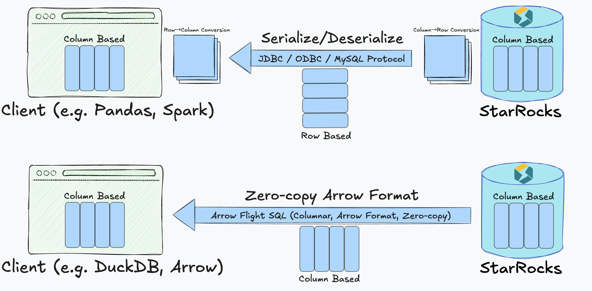
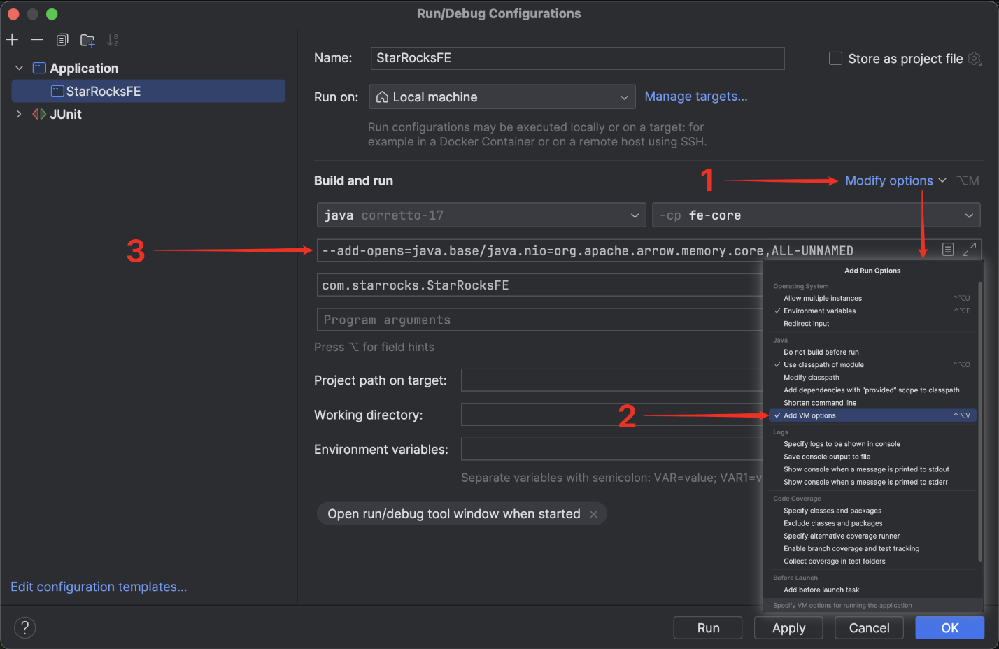

# Arrow Flight SQL を介して StarRocks と対話する

v3.5.1 以降、StarRocks は Apache Arrow Flight SQL プロトコルを介した接続をサポートしています。

Arrow Flight SQL プロトコルは次の利点をもたらします:

- ADBC ドライバーまたは Arrow Flight SQL JDBC ドライバーを介して通常の DDL、DML、DQL ステートメントを実行できます。
- Python コードまたは Java コードを使用して、Arrow Flight SQL ADBC または JDBC ドライバーを介して大規模なデータを読み取ることができます。

このソリューションは、StarRocks のカラム型実行エンジンからクライアントへの完全なカラム型データ転送パイプラインを確立し、従来の JDBC および ODBC インターフェースで一般的に見られる頻繁な行-カラム変換とシリアル化のオーバーヘッドを排除します。これにより、StarRocks はゼロコピー、低レイテンシー、高スループットでデータを転送できます。



## 使用方法

Python ADBC ドライバーを使用して Arrow Flight SQL プロトコルを介して StarRocks に接続し、対話するための手順に従ってください。完全なコード例については [Appendix](#appendix) を参照してください。

:::note

Python 3.9 以上が前提条件です。

:::

### ステップ 1. ライブラリのインストール

`pip` を使用して PyPI から `adbc_driver_manager` と `adbc_driver_flightsql` をインストールします:

```Bash
pip install adbc_driver_manager
pip install adbc_driver_flightsql
```

次のモジュールまたはライブラリをコードにインポートします:

- 必須ライブラリ:

```Python
import adbc_driver_manager
import adbc_driver_flightsql.dbapi as flight_sql
```

- 使いやすさとデバッグのためのオプションモジュール:

```Python
import pandas as pd       # オプション: DataFrame を使用した結果表示の向上
import traceback          # オプション: SQL 実行中の詳細なエラートレースバック
import time               # オプション: SQL 実行時間の測定
```

### ステップ 2. StarRocks に接続する

:::note

- コマンドラインを使用して FE サービスを開始したい場合は、次のいずれかの方法を使用できます:

  - 環境変数 `JAVA_TOOL_OPTIONS` を指定します。

    ```Bash
    export JAVA_TOOL_OPTIONS="--add-opens=java.base/java.nio=org.apache.arrow.memory.core,ALL-UNNAMED"
    ```

  - **fe.conf** で FE 設定項目 `JAVA_OPTS` を指定します。この方法では、他の `JAVA_OPTS` 値を追加できます。

    ```Bash
    JAVA_OPTS="--add-opens=java.base/java.nio=org.apache.arrow.memory.core,ALL-UNNAMED ..."
    ```

- IntelliJ IDEA でサービスを実行する場合は、`Run/Debug Configurations` の `Build and run` に次のオプションを追加する必要があります:

  ```Bash
  --add-opens=java.base/java.nio=org.apache.arrow.memory.core,ALL-UNNAMED
  ```

:::

#### StarRocks の設定

Arrow Flight SQL を介して StarRocks に接続する前に、Arrow Flight SQL サービスが有効になり、指定されたポートでリスニングしていることを確認するために FE および BE ノードを設定する必要があります。

FE 設定ファイル **fe.conf** と BE 設定ファイル **be.conf** の両方で、`arrow_flight_port` を利用可能なポートに設定します。設定ファイルを変更した後、FE および BE サービスを再起動して変更を有効にします。

:::note

FE と BE には異なる `arrow_flight_port` を設定する必要があります。

:::

例:

```Properties
// fe.conf
arrow_flight_port = 9408
// be.conf
arrow_flight_port = 9419
```

#### 接続の確立

クライアント側では、次の情報を使用して Arrow Flight SQL クライアントを作成します:

- StarRocks FE のホストアドレス
- StarRocks FE で Arrow Flight がリスニングに使用するポート
- 必要な権限を持つ StarRocks ユーザーのユーザー名とパスワード

例:

```Python
FE_HOST = "127.0.0.1"
FE_PORT = 9408

conn = flight_sql.connect(
    uri=f"grpc://{FE_HOST}:{FE_PORT}",
    db_kwargs={
        adbc_driver_manager.DatabaseOptions.USERNAME.value: "root",
        adbc_driver_manager.DatabaseOptions.PASSWORD.value: "",
    }
)
cursor = conn.cursor()
```

接続が確立された後、返されたカーソルを通じて SQL ステートメントを実行することで StarRocks と対話できます。

### ステップ 3. (オプション) ユーティリティ関数の事前定義

これらの関数は出力をフォーマットし、フォーマットを標準化し、デバッグを簡素化するために使用されます。テストのためにコード内でオプションで定義できます。

```Python
# =============================================================================
# ユーティリティ関数: 出力フォーマットの向上と SQL 実行
# =============================================================================

# セクションヘッダーを印刷
def print_header(title: str):
    """
    読みやすさを向上させるためにセクションヘッダーを印刷します。
    """
    print("\n" + "=" * 80)
    print(f"🟢 {title}")
    print("=" * 80)

# 実行中の SQL ステートメントを印刷
def print_sql(sql: str):
    """
    実行前に SQL ステートメントを印刷します。
    """
    print(f"\n🟡 SQL:\n{sql.strip()}")

# 結果の DataFrame を印刷
def print_result(df: pd.DataFrame):
    """
    結果の DataFrame を読みやすい形式で印刷します。
    """
    if df.empty:
        print("\n🟢 Result: (no rows returned)\n")
    else:
        print("\n🟢 Result:\n")
        print(df.to_string(index=False))

# エラートレースバックを印刷
def print_error(e: Exception):
    """
    SQL 実行が失敗した場合にエラートレースバックを印刷します。
    """
    print("\n🔴 Error occurred:")
    traceback.print_exc()

# SQL ステートメントを実行し、結果を印刷
def execute(sql: str):
    """
    SQL ステートメントを実行し、結果と実行時間を印刷します。
    """
    print_sql(sql)
    try:
        start = time.time()  # オプション: 実行時間測定の開始時間
        cursor.execute(sql)
        result = cursor.fetchallarrow()  # Arrow Table
        df = result.to_pandas()  # オプション: DataFrame に変換して表示を向上
        print_result(df)
        print(f"\n⏱️  Execution time: {time.time() - start:.3f} seconds")
    except Exception as e:
        print_error(e)
```

### ステップ 4. StarRocks と対話する

このセクションでは、テーブルの作成、データのロード、テーブルメタデータの確認、変数の設定、クエリの実行などの基本操作を案内します。

:::note

以下に示す出力例は、前述のステップで説明したオプションモジュールとユーティリティ関数に基づいて実装されています。

:::

1. データをロードするデータベースとテーブルを作成し、テーブルスキーマを確認します。

   ```Python
   # ステップ 1: データベースの削除と作成
   print_header("Step 1: Drop and Create Database")
   execute("DROP DATABASE IF EXISTS sr_arrow_flight_sql FORCE;")
   execute("SHOW DATABASES;")
   execute("CREATE DATABASE sr_arrow_flight_sql;")
   execute("SHOW DATABASES;")
   execute("USE sr_arrow_flight_sql;")
   
   # ステップ 2: テーブルの作成
   print_header("Step 2: Create Table")
   execute("""
   CREATE TABLE sr_arrow_flight_sql_test
   (
       k0 INT,
       k1 DOUBLE,
       k2 VARCHAR(32) NULL DEFAULT "" COMMENT "",
       k3 DECIMAL(27,9) DEFAULT "0",
       k4 BIGINT NULL DEFAULT '10',
       k5 DATE
   )
   DISTRIBUTED BY HASH(k5) BUCKETS 5
   PROPERTIES("replication_num" = "1");
   """)
   execute("SHOW CREATE TABLE sr_arrow_flight_sql_test;")
   ```

   出力例:

   ```SQL
   ================================================================================
   🟢 Step 1: Drop and Create Database
   ================================================================================
   
   🟡 SQL:
   DROP DATABASE IF EXISTS sr_arrow_flight_sql FORCE;
   /Users/starrocks/test/venv/lib/python3.9/site-packages/adbc_driver_manager/dbapi.py:307: Warning: Cannot disable autocommit; conn will not be DB-API 2.0 compliant
     warnings.warn(
   
   🟢 Result:
   
   StatusResult
              0
   
   ⏱️  Execution time: 0.025 seconds
   
   🟡 SQL:
   SHOW DATABASES;
   
   🟢 Result:
      
             Database
         _statistics_
                 hits
   information_schema
                  sys
   
   ⏱️  Execution time: 0.014 seconds
   
   🟡 SQL:
   CREATE DATABASE sr_arrow_flight_sql;
   
   🟢 Result:
   
   StatusResult
              0
   
   ⏱️  Execution time: 0.012 seconds
   
   🟡 SQL:
   SHOW DATABASES;
   
   🟢 Result:
   
              Database
          _statistics_
                  hits
    information_schema
   sr_arrow_flight_sql
                   sys
   
   ⏱️  Execution time: 0.005 seconds
   
   🟡 SQL:
   USE sr_arrow_flight_sql;
   
   🟢 Result:
   
   StatusResult
              0
   
   ⏱️  Execution time: 0.006 seconds
   
   ================================================================================
   🟢 Step 2: Create Table
   ================================================================================
   
   🟡 SQL:
   CREATE TABLE sr_arrow_flight_sql_test
   (
       k0 INT,
       k1 DOUBLE,
       k2 VARCHAR(32) NULL DEFAULT "" COMMENT "",
       k3 DECIMAL(27,9) DEFAULT "0",
       k4 BIGINT NULL DEFAULT '10',
       k5 DATE
   )
   DISTRIBUTED BY HASH(k5) BUCKETS 5
   PROPERTIES("replication_num" = "1");
   
   🟢 Result:
   
   StatusResult
              0
   
   ⏱️  Execution time: 0.021 seconds
   
   🟡 SQL:
   SHOW CREATE TABLE sr_arrow_flight_sql_test;
   
   🟢 Result:
   
                      Table                                                                                                                                                                                                                                                                                                                                                                                                                                                                                                  Create Table
   sr_arrow_flight_sql_test CREATE TABLE `sr_arrow_flight_sql_test` (\n  `k0` int(11) NULL COMMENT "",\n  `k1` double NULL COMMENT "",\n  `k2` varchar(32) NULL DEFAULT "" COMMENT "",\n  `k3` decimal(27, 9) NULL DEFAULT "0" COMMENT "",\n  `k4` bigint(20) NULL DEFAULT "10" COMMENT "",\n  `k5` date NULL COMMENT ""\n) ENGINE=OLAP \nDUPLICATE KEY(`k0`)\nDISTRIBUTED BY HASH(`k5`) BUCKETS 5 \nPROPERTIES (\n"compression" = "LZ4",\n"fast_schema_evolution" = "true",\n"replicated_storage" = "true",\n"replication_num" = "1"\n);
   
   ⏱️  Execution time: 0.005 seconds
   ```

2. データを挿入し、いくつかのクエリを実行し、変数を設定します。

   ```Python
   # ステップ 3: データの挿入
   print_header("Step 3: Insert Data")
   execute("""
   INSERT INTO sr_arrow_flight_sql_test VALUES
       (0, 0.1, "ID", 0.0001, 1111111111, '2025-04-21'),
       (1, 0.20, "ID_1", 1.00000001, 0, '2025-04-21'),
       (2, 3.4, "ID_1", 3.1, 123456, '2025-04-22'),
       (3, 4, "ID", 4, 4, '2025-04-22'),
       (4, 122345.54321, "ID", 122345.54321, 5, '2025-04-22');
   """)
   
   # ステップ 4: データのクエリ
   print_header("Step 4: Query Data")
   execute("SELECT * FROM sr_arrow_flight_sql_test ORDER BY k0;")
   
   # ステップ 5: セッション変数
   print_header("Step 5: Session Variables")
   execute("SHOW VARIABLES LIKE '%query_mem_limit%';")
   execute("SET query_mem_limit = 2147483648;")
   execute("SHOW VARIABLES LIKE '%query_mem_limit%';")
   
   # ステップ 6: 集計クエリ
   print_header("Step 6: Aggregation Query")
   execute("""
   SELECT k5, SUM(k1) AS total_k1, COUNT(1) AS row_count, AVG(k3) AS avg_k3
   FROM sr_arrow_flight_sql_test
   GROUP BY k5
   ORDER BY k5;
   """)
   ```

   出力例:

   ```SQL
   ================================================================================
   🟢 Step 3: Insert Data
   ================================================================================
   
   🟡 SQL:
   INSERT INTO sr_arrow_flight_sql_test VALUES
       (0, 0.1, "ID", 0.0001, 1111111111, '2025-04-21'),
       (1, 0.20, "ID_1", 1.00000001, 0, '2025-04-21'),
       (2, 3.4, "ID_1", 3.1, 123456, '2025-04-22'),
       (3, 4, "ID", 4, 4, '2025-04-22'),
       (4, 122345.54321, "ID", 122345.54321, 5, '2025-04-22');
   
   🟢 Result:
   
   StatusResult
              0
   
   ⏱️  Execution time: 0.149 seconds
   
   ================================================================================
   🟢 Step 4: Query Data
   ================================================================================
   
   🟡 SQL:
   SELECT * FROM sr_arrow_flight_sql_test ORDER BY k0;
   
   🟢 Result:
                                                                
   0      0.10000   ID      0.000100000 1111111111 2025-04-21
   1      0.20000 ID_1      1.000000010          0 2025-04-21
   2      3.40000 ID_1      3.100000000     123456 2025-04-22
   3      4.00000   ID      4.000000000          4 2025-04-22
   4 122345.54321   ID 122345.543210000          5 2025-04-22
   
   ⏱️  Execution time: 0.019 seconds
   
   ================================================================================
   🟢 Step 5: Session Variables
   ================================================================================
   
   🟡 SQL:
   SHOW VARIABLES LIKE '%query_mem_limit%';
   
   🟢 Result:
   
     Variable_name Value
   query_mem_limit     0
   
   ⏱️  Execution time: 0.005 seconds
   
   🟡 SQL:
   SET query_mem_limit = 2147483648;
   
   🟢 Result:
   
   StatusResult
              0
      
   ⏱️  Execution time: 0.007 seconds
   
   🟡 SQL:
   SHOW VARIABLES LIKE '%query_mem_limit%';
   
   🟢 Result:
   
     Variable_name        Value
     query_mem_limit 2147483648
   
   ⏱️  Execution time: 0.005 seconds
   
   ================================================================================
   🟢 Step 6: Aggregation Query
   ================================================================================
   
   🟡 SQL:
   SELECT k5, SUM(k1) AS total_k1, COUNT(1) AS row_count, AVG(k3) AS avg_k3
   FROM sr_arrow_flight_sql_test
   GROUP BY k5
   ORDER BY k5;
   
   🟢 Result:
                                                  
   2025-04-21      0.30000 2     0.500050005000
   2025-04-22 122352.94321 3 40784.214403333333
      
   ⏱️  Execution time: 0.014 second
   ```

### ステップ 5. 接続を閉じる

接続を閉じるために、次のセクションをコードに含めます。

```Python
# Step 7: Close
print_header("Step 7: Close Connection")
cursor.close()
conn.close()
print("✅ Test completed successfully.")
```

出力例:

```Python
================================================================================
🟢 Step 7: Close Connection
================================================================================
✅ Test completed successfully.

Process finished with exit code 0
```

## 大規模データ転送のユースケース

### Python

ADBC ドライバーを使用して Python で StarRocks（Arrow Flight SQL サポート付き）に接続した後、さまざまな ADBC API を使用して StarRocks から Clickbench データセットを Python にロードできます。

コード例:

```Python
#!/usr/bin/env python
# -*- coding: utf-8 -*-

import adbc_driver_manager
import adbc_driver_flightsql.dbapi as flight_sql
from datetime import datetime

# ----------------------------------------
# StarRocks Flight SQL Connection Settings
# ----------------------------------------
# Replace the URI and credentials as needed
my_uri = "grpc://127.0.0.1:9408"  # Default Flight SQL port for StarRocks
my_db_kwargs = {
    adbc_driver_manager.DatabaseOptions.USERNAME.value: "root",
    adbc_driver_manager.DatabaseOptions.PASSWORD.value: "",
}

# ----------------------------------------
# SQL Query (ClickBench: hits table)
# ----------------------------------------
# Replace with the actual table and dataset as needed
sql = "SELECT * FROM clickbench.hits LIMIT 1000000;"  # Read 1 million rows

# ----------------------------------------
# Method 1: fetchallarrow + to_pandas
# ----------------------------------------
def test_fetchallarrow():
    conn = flight_sql.connect(uri=my_uri, db_kwargs=my_db_kwargs)
    cursor = conn.cursor()
    start = datetime.now()
    cursor.execute(sql)
    arrow_table = cursor.fetchallarrow()
    df = arrow_table.to_pandas()
    duration = datetime.now() - start

    print("\n[Method 1] fetchallarrow + to_pandas")
    print(f"Time taken: {duration}, Arrow table size: {arrow_table.nbytes / 1024 / 1024:.2f} MB, Rows: {len(df)}")
    print(df.info(memory_usage='deep'))

# ----------------------------------------
# Method 2: fetch_df (recommended)
# ----------------------------------------
def test_fetch_df():
    conn = flight_sql.connect(uri=my_uri, db_kwargs=my_db_kwargs)
    cursor = conn.cursor()
    start = datetime.now()
    cursor.execute(sql)
    df = cursor.fetch_df()
    duration = datetime.now() - start

    print("\n[Method 2] fetch_df (recommended)")
    print(f"Time taken: {duration}, Rows: {len(df)}")
    print(df.info(memory_usage='deep'))

# ----------------------------------------
# Method 3: adbc_execute_partitions (for parallel read)
# ----------------------------------------
def test_execute_partitions():
    conn = flight_sql.connect(uri=my_uri, db_kwargs=my_db_kwargs)
    cursor = conn.cursor()
    start = datetime.now()
    partitions, schema = cursor.adbc_execute_partitions(sql)

    # Read the first partition (for demo)
    cursor.adbc_read_partition(partitions[0])
    arrow_table = cursor.fetchallarrow()
    df = arrow_table.to_pandas()
    duration = datetime.now() - start

    print("\n[Method 3] adbc_execute_partitions (parallel read)")
    print(f"Time taken: {duration}, Partitions: {len(partitions)}, Rows: {len(df)}")
    print(df.info(memory_usage='deep'))

# ----------------------------------------
# Run All Tests
# ----------------------------------------
if __name__ == "__main__":
    test_fetchallarrow()
    test_fetch_df()
    test_execute_partitions()
```

結果は、StarRocks から 1 百万行の Clickbench データセット（105 列、780 MB）を読み込むのにわずか 3 秒しかかからなかったことを示しています。

```Python
[Method 1] fetchallarrow + to_pandas
Time taken: 0:00:03.219575, Arrow table size: 717.42 MB, Rows: 1000000
<class 'pandas.core.frame.DataFrame'>
RangeIndex: 1000000 entries, 0 to 999999
Columns: 105 entries, CounterID to CLID
dtypes: int16(48), int32(19), int64(6), object(32)
memory usage: 2.4 GB

[Method 2] fetch_df (recommended)
Time taken: 0:00:02.358840, Rows: 1000000
<class 'pandas.core.frame.DataFrame'>
RangeIndex: 1000000 entries, 0 to 999999
Columns: 105 entries, CounterID to CLID
dtypes: int16(48), int32(19), int64(6), object(32)
memory usage: 2.4 GB

[Method 3] adbc_execute_partitions (parallel read)
Time taken: 0:00:02.231144, Partitions: 1, Rows: 1000000
<class 'pandas.core.frame.DataFrame'>
RangeIndex: 1000000 entries, 0 to 999999
Columns: 105 entries, CounterID to CLID
dtypes: int16(48), int32(19), int64(6), object(32)
memory usage: 2.4 GB
```

### Arrow Flight SQL JDBC ドライバー

Arrow Flight SQL プロトコルは、標準 JDBC インターフェースと互換性のあるオープンソースの JDBC ドライバーを提供します。これを使用して、Tableau、Power BI、DBeaver などのさまざまな BI ツールに簡単に統合し、StarRocks データベースにアクセスできます。従来の JDBC ドライバーと同様に使用できます。このドライバーの大きな利点は、Apache Arrow に基づく高速データ転送をサポートしており、クエリとデータ転送の効率を大幅に向上させることです。使用方法は従来の MySQL JDBC ドライバーとほぼ同じです。接続 URL で `jdbc:mysql` を `jdbc:arrow-flight-sql` に置き換えるだけでシームレスに切り替えることができます。クエリ結果は標準の `ResultSet` 形式で返されるため、既存の JDBC 処理ロジックとの互換性が確保されます。

:::note

Java 9 以降を使用している場合は、Java コードに `--add-opens=java.base/java.nio=ALL-UNNAMED` を追加して JDK の内部構造を公開する必要があります。そうしないと、特定のエラーが発生する可能性があります。

- コマンドラインを使用して FE サービスを開始したい場合は、次のいずれかの方法を使用できます:

  - 環境変数 `JAVA_TOOL_OPTIONS` を指定します。

    ```Bash
    export JAVA_TOOL_OPTIONS="--add-opens=java.base/java.nio=org.apache.arrow.memory.core,ALL-UNNAMED"
    ```

  - **fe.conf** で FE 設定項目 `JAVA_OPTS` を指定します。この方法では、他の `JAVA_OPTS` 値を追加できます。

    ```Bash
    JAVA_OPTS="--add-opens=java.base/java.nio=org.apache.arrow.memory.core,ALL-UNNAMED ..."
    ```

- IntelliJ IDEA でデバッグする場合は、`Run/Debug Configurations` の `Build and run` に次のオプションを追加する必要があります:

  ```Bash
  --add-opens=java.base/java.nio=org.apache.arrow.memory.core,ALL-UNNAMED
  ```



:::

<details>

  <summary><b>Click here to view the POM dependencies</b></summary>

```XML
<properties>
    <adbc.version>0.15.0</adbc.version>
</properties>

<dependencies>
    <dependency>
        <groupId>org.apache.arrow.adbc</groupId>
        <artifactId>adbc-driver-jdbc</artifactId>
        <version>${adbc.version}</version>
    </dependency>
    <dependency>
        <groupId>org.apache.arrow.adbc</groupId>
        <artifactId>adbc-core</artifactId>
        <version>${adbc.version}</version>
    </dependency>
    <dependency>
        <groupId>org.apache.arrow.adbc</groupId>
        <artifactId>adbc-driver-manager</artifactId>
        <version>${adbc.version}</version>
    </dependency>
    <dependency>
        <groupId>org.apache.arrow.adbc</groupId>
        <artifactId>adbc-sql</artifactId>
        <version>${adbc.version}</version>
    </dependency>
    <dependency>
        <groupId>org.apache.arrow.adbc</groupId>
        <artifactId>adbc-driver-flight-sql</artifactId>
        <version>${adbc.version}</version>
    </dependency>
</dependencies>
```

</details>

コード例:

```Java
import java.sql.Connection;
import java.sql.DriverManager;
import java.sql.ResultSet;
import java.sql.Statement;

public class ArrowFlightSqlIntegrationTest {

    private static final String JDBC_URL = "jdbc:arrow-flight-sql://127.0.0.1:9408"
            + "?useEncryption=false"
            + "&useServerPrepStmts=false"
            + "&useSSL=false"
            + "&useArrowFlightSql=true";

    private static final String USER = "root";
    private static final String PASSWORD = "";

    private static int testCaseNum = 1;

    public static void main(String[] args) {
        try {
            // Load Arrow Flight SQL JDBC driver
            Class.forName("org.apache.arrow.driver.jdbc.ArrowFlightJdbcDriver");

            try (Connection conn = DriverManager.getConnection(JDBC_URL, USER, PASSWORD);
                    Statement stmt = conn.createStatement()) {

                testUpdate(stmt, "DROP DATABASE IF EXISTS sr_arrow_flight_sql FORCE;");
                testQuery(stmt, "SHOW PROCESSLIST;");
                testUpdate(stmt, "CREATE DATABASE sr_arrow_flight_sql;");
                testQuery(stmt, "SHOW DATABASES;");
                testUpdate(stmt, "USE sr_arrow_flight_sql;");
                testUpdate(stmt, "CREATE TABLE sr_table_test (id INT, name STRING) ENGINE=OLAP PRIMARY KEY (id) " +
                        "DISTRIBUTED BY HASH(id) BUCKETS 1 " +
                        "PROPERTIES ('replication_num' = '1');");
                testUpdate(stmt, "INSERT INTO sr_table_test VALUES (1, 'Alice'), (2, 'Bob');");
                testQuery(stmt, "SELECT * FROM sr_arrow_flight_sql.sr_table_test;");
            }
        } catch (Exception e) {
            e.printStackTrace();
        }

    }

    /**
     * Executes a query and prints the result to the console.
     */
    private static void testQuery(Statement stmt, String sql) throws Exception {
        System.out.println("Test Case: " + testCaseNum);
        System.out.println("▶ Executing query: " + sql);
        ResultSet rs = stmt.executeQuery(sql);
        try {
            System.out.println("Result:");
            int columnCount = rs.getMetaData().getColumnCount();
            while (rs.next()) {
                for (int i = 1; i <= columnCount; i++) {
                    System.out.print(rs.getString(i) + "\t");
                }
                System.out.println();
            }
        } finally {
            rs.close();
        }
        testCaseNum++;
        System.out.println();
    }

    /**
     * Executes an update (DDL or DML) and prints the result to the console.
     */
    private static void testUpdate(Statement stmt, String sql) throws Exception {
        System.out.println("Test Case: " + testCaseNum);
        System.out.println("▶ Executing update: " + sql);
        stmt.executeUpdate(sql);
        System.out.println("Result: ✅ Success");
        testCaseNum++;
        System.out.println();
    }
}
```

実行結果:

```Bash
Test Case: 1
▶ Executing update: DROP DATABASE IF EXISTS sr_arrow_flight_sql FORCE;
Result: ✅ Success

Test Case: 2
▶ Executing query: SHOW PROCESSLIST;
Result:
192.168.124.48_9010_1751449846872	16777217	root			Query	2025-07-02 18:46:49	0	OK	SHOW PROCESSLIST;	false	default_warehouse	

Test Case: 3
▶ Executing update: CREATE DATABASE sr_arrow_flight_sql;
Result: ✅ Success

Test Case: 4
▶ Executing query: SHOW DATABASES;
Result:
_statistics_	
information_schema	
sr_arrow_flight_sql	
sys	

Test Case: 5
▶ Executing update: USE sr_arrow_flight_sql;
Result: ✅ Success

Test Case: 6
▶ Executing update: CREATE TABLE sr_table_test (id INT, name STRING) ENGINE=OLAP PRIMARY KEY (id) DISTRIBUTED BY HASH(id) BUCKETS 1 PROPERTIES ('replication_num' = '1');
Result: ✅ Success

Test Case: 7
▶ Executing update: INSERT INTO sr_table_test VALUES (1, 'Alice'), (2, 'Bob');
Result: ✅ Success

Test Case: 8
▶ Executing query: SELECT * FROM sr_arrow_flight_sql.sr_table_test;
Result:
1	Alice	
2	Bob
```

### Java ADBC ドライバー

Arrow Flight SQL プロトコルは、標準 JDBC インターフェースと互換性のあるオープンソースの JDBC ドライバーを提供します。これを使用して、Tableau、Power BI、DBeaver などのさまざまな BI ツールに簡単に統合し、StarRocks データベースにアクセスできます。従来の JDBC ドライバーと同様に使用できます。このドライバーの大きな利点は、Apache Arrow に基づく高速データ転送をサポートしており、クエリとデータ転送の効率を大幅に向上させることです。使用方法は従来の MySQL JDBC ドライバーとほぼ同じです。

:::note

- コマンドラインを使用して FE サービスを開始したい場合は、次のいずれかの方法を使用できます:

  - 環境変数 `JAVA_TOOL_OPTIONS` を指定します。

    ```Bash
    export JAVA_TOOL_OPTIONS="--add-opens=java.base/java.nio=org.apache.arrow.memory.core,ALL-UNNAMED"
    ```

  - **fe.conf** で FE 設定項目 `JAVA_OPTS` を指定します。この方法では、他の `JAVA_OPTS` 値を追加できます。

    ```Bash
    JAVA_OPTS="--add-opens=java.base/java.nio=org.apache.arrow.memory.core,ALL-UNNAMED ..."
    ```

- IntelliJ IDEA でデバッグする場合は、`Run/Debug Configurations` の `Build and run` に次のオプションを追加する必要があります:

  ```Bash
  --add-opens=java.base/java.nio=org.apache.arrow.memory.core,ALL-UNNAMED
  ```

:::

<details>

  <summary>POM dependencies</summary>

```XML
<properties>
    <adbc.version>0.15.0</adbc.version>
</properties>

<dependencies>
    <dependency>
        <groupId>org.apache.arrow.adbc</groupId>
        <artifactId>adbc-driver-jdbc</artifactId>
        <version>${adbc.version}</version>
    </dependency>
    <dependency>
        <groupId>org.apache.arrow.adbc</groupId>
        <artifactId>adbc-core</artifactId>
        <version>${adbc.version}</version>
    </dependency>
    <dependency>
        <groupId>org.apache.arrow.adbc</groupId>
        <artifactId>adbc-driver-manager</artifactId>
        <version>${adbc.version}</version>
    </dependency>
    <dependency>
        <groupId>org.apache.arrow.adbc</groupId>
        <artifactId>adbc-sql</artifactId>
        <version>${adbc.version}</version>
    </dependency>
    <dependency>
        <groupId>org.apache.arrow.adbc</groupId>
        <artifactId>adbc-driver-flight-sql</artifactId>
        <version>${adbc.version}</version>
    </dependency>
</dependencies>
```

</details>

Python と同様に、Java でも直接 ADBC クライアントを作成して StarRocks からデータを読み取ることができます。

このプロセスでは、最初に FlightInfo を取得し、次に各 Endpoint に接続してデータを取得します。

コード例:

```Java
public static void main(String[] args) throws Exception {
    try (BufferAllocator allocator = new RootAllocator()) {
        FlightSqlDriver driver = new FlightSqlDriver(allocator);

        Map<String, Object> parameters = new HashMap<>();
        String host = "localhost";
        int port = 9408;
        String uri = Location.forGrpcInsecure(host, port).getUri().toString();

        AdbcDriver.PARAM_URI.set(parameters, uri);
        AdbcDriver.PARAM_USERNAME.set(parameters, "root");
        AdbcDriver.PARAM_PASSWORD.set(parameters, "");

        try (AdbcDatabase database = driver.open(parameters);
                AdbcConnection connection = database.connect();
                AdbcStatement statement = connection.createStatement()) {

            statement.setSqlQuery("SHOW DATABASES;");

            try (AdbcStatement.QueryResult result = statement.executeQuery();
                    ArrowReader reader = result.getReader()) {

                int batchCount = 0;
                while (reader.loadNextBatch()) {
                    batchCount++;
                    VectorSchemaRoot root = reader.getVectorSchemaRoot();
                    System.out.println("Batch " + batchCount + ":");
                    System.out.println(root.contentToTSVString());
                }

                System.out.println("Total batches: " + batchCount);
            }
        }
    }
}
```

#### 推奨事項

- 上記の 3 つの Java Arrow Flight SQL 接続方法のうち:
  - 後続のデータ分析が行ベースのデータ形式に依存する場合は、`jdbc:arrow-flight-sql` を使用することをお勧めします。これは JDBC ResultSet 形式でデータを返します。
  - 分析が Arrow 形式または他のカラム型データ形式を直接処理できる場合は、Flight AdbcDriver または Flight JdbcDriver を使用できます。これらのオプションは Arrow 形式のデータを直接返し、行-カラム変換を回避し、Arrow の機能を活用してデータ解析を加速します。

- JDBC ResultSet または Arrow 形式のデータを解析するかどうかにかかわらず、解析時間は通常、データの読み取り自体に費やされる時間よりも長くなります。Arrow Flight SQL が `jdbc:mysql://` に対して期待されるパフォーマンス向上をもたらさない場合は、データ解析に時間がかかりすぎているかどうかを調査することを検討してください。

- すべての接続方法において、JDK 17 を使用したデータ読み取りは、通常、JDK 1.8 よりも高速です。

- 大規模データセットを読み取る場合、Arrow Flight SQL は通常、`jdbc:mysql://` よりもメモリを消費しません。したがって、メモリ制約がある場合は、Arrow Flight SQL を試してみる価値があります。

- 上記の 3 つの接続方法に加えて、ネイティブ FlightClient を使用して Arrow Flight Server に接続し、複数のエンドポイントからのより柔軟な並列読み取りを可能にすることもできます。Java Flight AdbcDriver は FlightClient の上に構築されており、FlightClient を直接使用するよりもシンプルなインターフェースを提供します。

### Spark

現在、公式の Arrow Flight プロジェクトは Spark または Flink をサポートする予定はありません。将来的には、[starrocks-spark-connector](https://github.com/qwshen/spark-flight-connector) が Arrow Flight SQL を介して StarRocks にアクセスできるようにサポートを段階的に追加し、読み取りパフォーマンスの向上が期待されます。

Spark で StarRocks にアクセスする場合、従来の JDBC または Java クライアントの方法に加えて、オープンソースの Spark-Flight-Connector コンポーネントを使用して、Spark DataSource として StarRocks Flight SQL Server から直接読み書きすることができます。このアプローチは、Apache Arrow Flight プロトコルに基づいており、次のような重要な利点があります:

- **高性能データ転送** Spark-Flight-Connector は Apache Arrow をデータ転送形式として使用し、ゼロコピーで非常に効率的なデータ交換を実現します。StarRocks の `internal Block` データ形式と Arrow の間の変換は非常に効率的で、従来の `CSV` や `JDBC` 方法と比較して最大 10 倍のパフォーマンス向上を達成し、データ転送のオーバーヘッドを大幅に削減します。
- **複雑なデータ型のネイティブサポート** Arrow データ形式は複雑な型（`Map`、`Array`、`Struct` など）をネイティブにサポートしており、従来の JDBC 方法と比較して StarRocks の複雑なデータモデルにより適応し、データの表現力と互換性を向上させます。
- **読み取り、書き込み、ストリーミング書き込みのサポート** コンポーネントは、Spark を Flight SQL クライアントとして使用して効率的な読み取りと書き込み操作をサポートし、`insert`、`merge`、`update`、`delete` DML ステートメントを含み、ストリーミング書き込みもサポートしているため、リアルタイムデータ処理シナリオに適しています。
- **述語プッシュダウンとカラムプルーニングのサポート** データを読み取る際、Spark-Flight-Connector は述語プッシュダウンとカラムプルーニングをサポートし、StarRocks 側でデータフィルタリングとカラム選択を可能にし、転送されるデータ量を大幅に削減し、クエリパフォーマンスを向上させます。
- **集計プッシュダウンと並列読み取りのサポート** 集計操作（`sum`、`count`、`max`、`min` など）は StarRocks にプッシュダウンして実行でき、Spark の計算負荷を軽減します。また、パーティショニングに基づく並列読み取りもサポートしており、大規模データシナリオでの読み取り効率を向上させます。
- **大規模データシナリオに適している** 従来の JDBC 方法と比較して、Flight SQL プロトコルは大規模で高い同時アクセスシナリオにより適しており、StarRocks がその高性能な分析能力を十分に活用できるようにします。

## Appendix

以下は、使用方法のチュートリアルにおける完全なコード例です。

```Python
# =============================================================================
# StarRocks Arrow Flight SQL Test Script
# =============================================================================
# pip install adbc_driver_manager adbc_driver_flightsql pandas
# =============================================================================

# =============================================================================
# Required core modules for connecting to StarRocks via Arrow Flight SQL
# =============================================================================
import adbc_driver_manager
import adbc_driver_flightsql.dbapi as flight_sql

# =============================================================================
# Optional modules for better usability and debugging
# =============================================================================
import pandas as pd       # Optional: for better result display using DataFrame
import traceback          # Optional: for detailed error traceback during SQL execution
import time               # Optional: for measuring SQL execution time

# =============================================================================
# StarRocks Flight SQL Configuration
# =============================================================================
FE_HOST = "127.0.0.1"
FE_PORT = 9408

# =============================================================================
# Connect to StarRocks
# =============================================================================
conn = flight_sql.connect(
    uri=f"grpc://{FE_HOST}:{FE_PORT}",
    db_kwargs={
        adbc_driver_manager.DatabaseOptions.USERNAME.value: "root",
        adbc_driver_manager.DatabaseOptions.PASSWORD.value: "",
    }
)

cursor = conn.cursor()

# =============================================================================
# Utility functions for better output formatting and SQL execution
# =============================================================================

def print_header(title: str):
    """
    Print a section header for better readability.
    """
    print("\n" + "=" * 80)
    print(f"🟢 {title}")
    print("=" * 80)


def print_sql(sql: str):
    """
    Print the SQL statement before execution.
    """
    print(f"\n🟡 SQL:\n{sql.strip()}")


def print_result(df: pd.DataFrame):
    """
    Print the result DataFrame in a readable format.
    """
    if df.empty:
        print("\n🟢 Result: (no rows returned)\n")
    else:
        print("\n🟢 Result:\n")
        print(df.to_string(index=False))


def print_error(e: Exception):
    """
    Print the error traceback if SQL execution fails.
    """
    print("\n🔴 Error occurred:")
    traceback.print_exc()


def execute(sql: str):
    """
    Execute a SQL statement and print the result and execution time.
    """
    print_sql(sql)
    try:
        start = time.time()  # Start time for execution time measurement
        cursor.execute(sql)
        result = cursor.fetchallarrow()  # Arrow Table
        df = result.to_pandas()          # Convert to DataFrame for better display
        print_result(df)
        print(f"\n⏱️  Execution time: {time.time() - start:.3f} seconds")
    except Exception as e:
        print_error(e)

# =============================================================================
# Step 1: Drop and Create Database
# =============================================================================
print_header("Step 1: Drop and Create Database")
execute("DROP DATABASE IF EXISTS sr_arrow_flight_sql FORCE;")
execute("SHOW DATABASES;")
execute("CREATE DATABASE sr_arrow_flight_sql;")
execute("SHOW DATABASES;")
execute("USE sr_arrow_flight_sql;")

# =============================================================================
# Step 2: Create Table
# =============================================================================
print_header("Step 2: Create Table")
execute("""
CREATE TABLE sr_arrow_flight_sql_test
(
    k0 INT,
    k1 DOUBLE,
    k2 VARCHAR(32) NULL DEFAULT "" COMMENT "",
    k3 DECIMAL(27,9) DEFAULT "0",
    k4 BIGINT NULL DEFAULT '10',
    k5 DATE
)
DISTRIBUTED BY HASH(k5) BUCKETS 5
PROPERTIES("replication_num" = "1");
""")

execute("SHOW CREATE TABLE sr_arrow_flight_sql_test;")

# =============================================================================
# Step 3: Insert Data
# =============================================================================
print_header("Step 3: Insert Data")
execute("""
INSERT INTO sr_arrow_flight_sql_test VALUES
    (0, 0.1, "ID", 0.0001, 1111111111, '2025-04-21'),
    (1, 0.20, "ID_1", 1.00000001, 0, '2025-04-21'),
    (2, 3.4, "ID_1", 3.1, 123456, '2025-04-22'),
    (3, 4, "ID", 4, 4, '2025-04-22'),
    (4, 122345.54321, "ID", 122345.54321, 5, '2025-04-22');
""")

# =============================================================================
# Step 4: Query Data
# =============================================================================
print_header("Step 4: Query Data")
execute("SELECT * FROM sr_arrow_flight_sql_test ORDER BY k0;")

# =============================================================================
# Step 5: Session Variables
# =============================================================================
print_header("Step 5: Session Variables")
execute("SHOW VARIABLES LIKE '%query_mem_limit%';")
execute("SET query_mem_limit = 2147483648;")
execute("SHOW VARIABLES LIKE '%query_mem_limit%';")

# =============================================================================
# Step 6: Aggregation Query
# =============================================================================
print_header("Step 6: Aggregation Query")
execute("""
SELECT k5, SUM(k1) AS total_k1, COUNT(1) AS row_count, AVG(k3) AS avg_k3
FROM sr_arrow_flight_sql_test
GROUP BY k5
ORDER BY k5;
""")

# =============================================================================
# Step 7: Close Connection
# =============================================================================
print_header("Step 7: Close Connection")
cursor.close()
conn.close()
print("✅ Test completed successfully.")
```