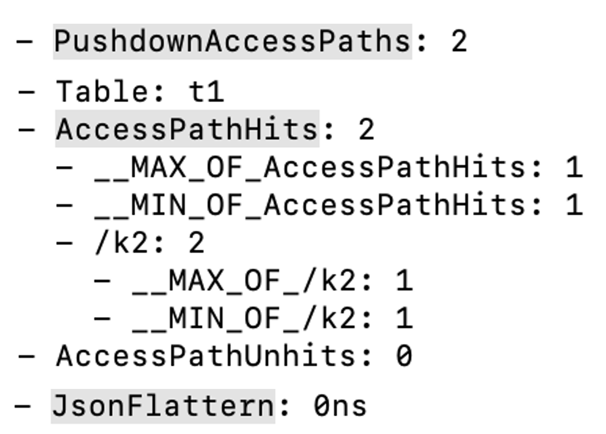

# [プレビュー] Flat JSON

このトピックでは、Flat JSON 機能の基本概念とその使用方法を紹介します。

v2.2.0 以降、StarRocks は JSON データの保存をサポートしており、より柔軟なデータストレージが可能です。しかし、ほとんどのクエリシナリオでは、ユーザーは完全な JSON データではなく、指定されたパスの JSON データにのみアクセスします。以下の例では、必須フィールドを固定フィールドとして保存し、ビジネスに応じて頻繁に変更されるフィールドを JSON データとしてパッケージ化しています。

```SQL
SELECT
    time,
    event,
    user,
    get_json_string(remain_json, "$.from_system"),
    get_json_string(remain_json, "$.tag")
FROM logs;
```

しかし、クエリ中、JSON データのパフォーマンスは INT や STRING などの標準データ型ほど良くありません。その理由は以下の通りです。

- JSON は半構造化データ型であり、各データ行の構造を保存する必要があります。これにより多くのストレージが占有され、圧縮効率が低くなります。
- JSON データをクエリする際、ランタイムデータに基づいてデータ構造を検出する必要があり、ベクトル化最適化を達成するのが難しくなります。
- JSON データをクエリする際、冗長なフィールドを含む完全な JSON データを読み込む必要があります。

StarRocks は v3.3 で Flat JSON 機能を導入し、JSON データのクエリパフォーマンスを最適化し、JSON の使用コストを削減します。

## Flat JSON とは？

Flat JSON の核心原理は、データロード中に JSON データを検出し、共通フィールドを標準データ型として抽出して保存することです。クエリ中、これらの共通フィールドは直接クエリでき、JSON のクエリ速度を加速します。データの例：

```Plaintext
1, {"a": 1, "b": 21, "c": 3, "d": 4}
2, {"a": 2, "b": 22, "d": 4}
3, {"a": 3, "b": 23, "d": [1, 2, 3, 4]}
4, {"a": 4, "b": 24, "d": null}
5, {"a": 5, "b": 25, "d": null}
6, {"c": 6, "d": 1}
```

`a` と `b` フィールドはほとんどの行に存在し、そのデータ型は似ています（どちらも INT）。したがって、`a` と `b` フィールドのデータは JSON データから読み取られ、2 つの INT 列として別々に保存できます。これらの 2 列を対象としたクエリの場合、他の列を読み込む必要がなく、計算中の JSON 構造の処理オーバーヘッドを削減できます。

## 使用上の注意

- 共有なしクラスタは v3.3.0 以降で Flat JSON をサポートします。共有データクラスタは v3.3.3 以降で Flat JSON をサポートします。
- StarRocks のすべてのテーブルタイプは Flat JSON をサポートします。
- Flat JSON は歴史的な JSON データと互換性があります。Flat JSON が有効になった後も、以前にロードされた歴史的データは上書きされず、フラット化された JSON データと共存します。
- 新しいデータが書き込まれると、Flat JSON 操作は Compaction を通じて自動的に完了します。

v3.3.0、v3.3.1、および v3.3.2 では：

- データロード中、Flat JSON は共通フィールドを抽出し、JSON タイプとして保存することをサポートしますが、型推論はサポートされていません。
- 抽出された列と元の JSON データの両方が保存されます。元のデータが削除されると、抽出されたデータも削除されます。

v3.3.3 以降：

- Flat JSON から抽出された結果は、共通フィールドと予約フィールドに分けられます。すべての JSON スキーマが一致している場合、予約フィールドは生成されません。
- データロード中、共通フィールドは自動的に BIGINT/LARGEINT/DOUBLE/STRING 型として推論されます。認識されない型は JSON 型として推論されます。予約フィールドは JSON 型として保存されます。
- Flat JSON は共通フィールドと予約フィールドのみを保存し、元の JSON データは保存しません。

## Flat JSON の使用方法

- Flat JSON を使用するには、BE 動的パラメータ `enable_json_flat` を有効にする必要があります（デフォルト：`false`）。有効にすると、新しくロードされた JSON データは自動的にフラット化されます。

   ```Bash
   curl -XPOST http://<be_host>:<be_http_port>/api/update_config?enable_json_flat=true
   ```

- JSON データをクエリする前に、セッション変数 `cbo_prune_json_subfield` を有効にします（デフォルト：`false`）。

   ```SQL
   SET cbo_prune_json_subfield = true;
   ```

## Flat JSON が有効かどうかを確認する

- データをロードした後、次の SQL コマンドを実行して、対応するフィールドから抽出されたサブフィールドをクエリできます。

    ```SQL
    SELECT flat_json_meta(json_column), count(1)
    FROM tableA[_META];
    ```

- データクエリ中、[Query Profile](https://docs.starrocks.io/docs/administration/query_profile_overview/) を通じて関連メトリクスを確認できます：
  - `PushdownAccessPaths`: サブフィールドがプッシュダウンされたパスの数。
  - `AccessPathHits`: Flat JSON のヒット数で、サブメトリクスはヒットした JSON データを出力します。
  - `AccessPathUnhits`: Flat JSON のミス数で、サブメトリクスはミスした JSON データを出力します。
  - `JsonFlattern`: Flat JSON のミスがある場合に JSON サブフィールドを抽出するのに使用される時間。

## 使用例

1. `enable_json_flat` をオンにします。
2. JSON 列を含むテーブルを作成します。この例では INSERT INTO を使用して JSON データをテーブルにロードします。

   ```SQL
   CREATE TABLE `t1` (
        `k1` int,
        `k2` JSON,
        `k3` VARCHAR(20),
        `k4` JSON
    )             
    DUPLICATE KEY(`k1`)
    COMMENT "OLAP"
    DISTRIBUTED BY HASH(`k1`) BUCKETS 2
    PROPERTIES ("replication_num" = "3");
      
    INSERT INTO t1 (k1,k2) VALUES
    (11,parse_json('{"str":"test_flat_json","Integer":123456,"Double":3.14158,"Object":{"c":"d"},"arr":[10,20,30],"Bool":false,"null":null}')),
    (15,parse_json('{"str":"test_str0","Integer":11,"Double":3.14,"Object":{"a":"b"},"arr":[1,2,3],"Bool":true,"null":null}')),
    (15,parse_json('{"str":"test_str1","Integer":111,"Double":3.14,"Object":{"a":"b"},"arr":[1,2,3],"Bool":true,"null":null}')),
    (15,parse_json('{"str":"test_str2","Integer":222,"Double":3.14,"Object":{"a":"b"},"arr":[1,2,3],"Bool":true,"null":null}')),
    (15,parse_json('{"str":"test_str2","Integer":222,"Double":3.14,"Object":{"a":"b"},"arr":[1,2,3],"Bool":true,"null":null}')),
    (16,parse_json('{"str":"test_str3","Integer":333,"Double":3.14,"Object":{"a":"b"},"arr":[1,2,3],"Bool":true,"null":null}')),
    (17,parse_json('{"str":"test_str3","Integer":333,"Double":3.14,"Object":{"a":"b"},"arr":[1,2,3],"Bool":true,"null":null}')),
    (18,parse_json('{"str":"test_str5","Integer":444,"Double":3.14,"Object":{"a":"b"},"arr":[1,2,3],"Bool":true,"null":null}')),
    (19,parse_json('{"str":"test_str6","Integer":444,"Double":3.14,"Object":{"a":"b"},"arr":[1,2,3],"Bool":true,"null":null}')),
    (20,parse_json('{"str":"test_str6","Integer":444,"Double":3.14,"Object":{"a":"b"},"arr":[1,2,3],"Bool":true,"null":null}'));
    ```

3. `k2` から抽出されたサブフィールドをクエリします。

   ```Plaintext
   SELECT flat_json_meta(k2) FROM t1[_META_];
   +---------------------------------------------------------------------------------------------------------------------------+
   | flat_json_meta(k2)                                                                                                        |
   +---------------------------------------------------------------------------------------------------------------------------+
   | ["nulls(TINYINT)","Integer(BIGINT)","Double(DOUBLE)","str(VARCHAR)","Bool(JSON)","Object(JSON)","arr(JSON)","null(JSON)"] |
   +---------------------------------------------------------------------------------------------------------------------------+
   ```

4. セッション変数 `cbo_prune_json_subfield` を有効にします。

   ```SQL
   SET cbo_prune_json_subfield = true;
   ```

5. Query Profile 機能を有効にします。

   ```SQL
   SET enable_profile = true;
   ```

6. データクエリを実行します。

   ```Bash
   SELECT * FROM t1;
   SELECT get_json_string(k2,'\$.Integer') FROM t1 WHERE k2->'str' = 'test_flat_json';
   SELECT get_json_string(k2,'\$.Double') FROM t1 WHERE k2->'Integer' = 123456;
   SELECT get_json_string(k2,'\$.Object') FROM t1 WHERE k2->'Double' = 3.14158;
   SELECT get_json_string(k2,'\$.arr') FROM t1 WHERE k2->'Object' = to_json(map{'c':'d'});
   SELECT get_json_string(k2,'\$.Bool') FROM t1 WHERE k2->'arr' = '[10,20,30]';
   ```

7. 最新のクエリの ID を取得します。

   ```Bash
   SELECT last_query_id();
   +--------------------------------------+
   | last_query_id()                      |
   +--------------------------------------+
   | a5d0d795-037c-11ef-93ca-00163e13a1ba |
   +--------------------------------------+
   ```

8. Query Profile を表示して Flat JSON に関連するメトリクスを確認します。

   このクエリのプロファイルを表示するには、次のいずれかの方法を使用します。

   1. `get_query_profile` 関数を使用してプロファイルを取得します。

      ```SQL
       SELECT get_query_profile('a5d0d795-037c-11ef-93ca-00163e13a1ba')\G
       ```

   2. [Web ページを通じてプロファイルのメトリクスを表示します。](https://docs.starrocks.io/docs/administration/query_profile_overview/#obtain-query-profile-via-web-ui)

   完全なプロファイルは長く、以下の図は Flat JSON に関連するメトリクスのみを示しています。

   

## その他のオプションの BE 設定

- [json_flat_null_factor](../administration/management/BE_configuration.md#json_flat_null_factor)
- [json_flat_column_max](../administration/management/BE_configuration.md#json_flat_column_max)
- [json_flat_sparsity_factor](../administration/management/BE_configuration.md#json_flat_sparsity_factor)
- [enable_compaction_flat_json](../administration/management/BE_configuration.md#enable_compaction_flat_json)

## 注意事項

- Flat JSON を有効にすると、JSON データロードの時間が増加します。抽出される JSON サブフィールドが多いほど、時間がかかります。
- システム変数 `cbo_prune_json_subfield` は Flat JSON がヒットした場合にのみ機能します。それ以外の場合、パフォーマンスの向上が見られない可能性があります。