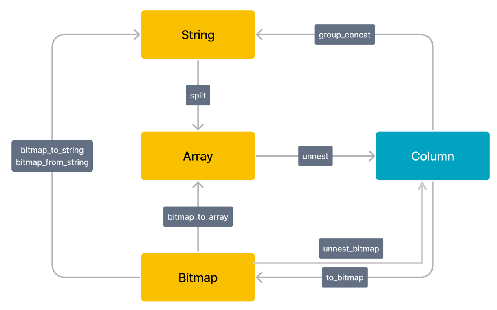

# Lateral Join を使用した列から行への変換

列から行への変換は、ETL 処理で一般的な操作です。Lateral は、行を内部サブクエリやテーブル関数と関連付けることができる特別な Join キーワードです。Lateral を unnest() と組み合わせて使用することで、1 行を複数行に展開できます。詳細は [unnest](../sql-reference/sql-functions/array-functions/unnest.md) を参照してください。

## 制限事項

* 現在、Lateral Join は列から行への変換を実現するために unnest() と一緒にのみ使用されます。他のテーブル関数や UDTF は後でサポートされる予定です。
* 現在、Lateral Join はサブクエリをサポートしていません。

## Lateral Join の使用

構文:

~~~SQL
from table_reference join [lateral] table_reference;
~~~

例:

~~~SQL
SELECT student, score
FROM tests
CROSS JOIN LATERAL UNNEST(scores) AS t (score);

SELECT student, score
FROM tests, UNNEST(scores) AS t (score);
~~~

ここでの2番目の構文は、最初の構文の短縮版であり、Lateral キーワードを省略して UNNEST キーワードを使用できます。UNNEST キーワードは、配列を複数行に変換するテーブル関数です。Lateral Join と一緒に使用することで、一般的な行の展開ロジックを実装できます。

> **注意**
>
> 複数の列で unnest を実行する場合、各列にエイリアスを指定する必要があります。例えば、`select v1, t1.unnest as v2, t2.unnest as v3 from lateral_test, unnest(v2) t1, unnest(v3) t2;` のようにします。

StarRocks は、BITMAP、STRING、ARRAY、および Column 間の型変換をサポートしています。

## 使用例

unnest() と一緒に使用することで、以下の列から行への変換機能を実現できます。

### 文字列を複数行に展開

1. テーブルを作成し、このテーブルにデータを挿入します。

    ~~~SQL
    CREATE TABLE lateral_test2 (
        `v1` bigint(20) NULL COMMENT "",
        `v2` string NULL COMMENT ""
    )
    DUPLICATE KEY(v1)
    DISTRIBUTED BY HASH(`v1`)
    PROPERTIES (
        "replication_num" = "3",
        "storage_format" = "DEFAULT"
    );

    INSERT INTO lateral_test2 VALUES (1, "1,2,3"), (2, "1,3");
    ~~~

2. 展開前のデータをクエリします。

    ~~~Plain Text
    select * from lateral_test2;

    +------+-------+
    | v1   | v2    |
    +------+-------+
    |    1 | 1,2,3 |
    |    2 | 1,3   |
    +------+-------+
    ~~~

3. `v2` を複数行に展開します。

    ~~~Plain Text
    -- 単一の列で unnest を実行します。

    select v1,unnest from lateral_test2, unnest(split(v2, ",")) as unnest;

    +------+--------+
    | v1   | unnest |
    +------+--------+
    |    1 | 1      |
    |    1 | 2      |
    |    1 | 3      |
    |    2 | 1      |
    |    2 | 3      |
    +------+--------+

    -- 複数の列で unnest を実行します。各操作にエイリアスを指定する必要があります。

    select v1, t1.unnest as v2, t2.unnest as v3 from lateral_test2, unnest(split(v2, ",")) t1, unnest(split(v3, ",")) t2;

    +------+------+------+
    | v1   | v2   | v3   |
    +------+------+------+
    |    1 | 1    | 1    |
    |    1 | 1    | 2    |
    |    1 | 2    | 1    |
    |    1 | 2    | 2    |
    |    1 | 3    | 1    |
    |    1 | 3    | 2    |
    |    2 | 1    | 1    |
    |    2 | 1    | 3    |
    |    2 | 3    | 1    |
    |    2 | 3    | 3    |
    +------+------+------+
    ~~~

### 配列を複数行に展開

 **v2.5 から、unnest() は異なる型と長さの複数の配列を受け取ることができます。** 詳細は [unnest()](../sql-reference/sql-functions/array-functions/unnest.md) を参照してください。

1. テーブルを作成し、このテーブルにデータを挿入します。

    ~~~SQL
    CREATE TABLE lateral_test (
        `v1` bigint(20) NULL COMMENT "",
        `v2` ARRAY NULL COMMENT ""
    ) 
    DUPLICATE KEY(v1)
    DISTRIBUTED BY HASH(`v1`)
    PROPERTIES (
        "replication_num" = "3",
        "storage_format" = "DEFAULT"
    );

    INSERT INTO lateral_test VALUES (1, [1,2]), (2, [1, null, 3]), (3, null);
    ~~~

2. 展開前のデータをクエリします。

    ~~~Plain Text
    select * from lateral_test;

    +------+------------+
    | v1   | v2         |
    +------+------------+
    |    1 | [1,2]      |
    |    2 | [1,null,3] |
    |    3 | NULL       |
    +------+------------+
    ~~~

3. `v2` を複数行に展開します。

    ~~~Plain Text
    select v1,v2,unnest from lateral_test , unnest(v2) as unnest;

    +------+------------+--------+
    | v1   | v2         | unnest |
    +------+------------+--------+
    |    1 | [1,2]      |      1 |
    |    1 | [1,2]      |      2 |
    |    2 | [1,null,3] |      1 |
    |    2 | [1,null,3] |   NULL |
    |    2 | [1,null,3] |      3 |
    +------+------------+--------+
    ~~~

### Bitmap データを展開

Lateral Join を unnest_bitmap 関数と一緒に使用して、Bitmap データを展開できます。

1. テーブルを作成し、このテーブルにデータを挿入します。

    ~~~SQL
    CREATE TABLE lateral_test3 (
    `v1` bigint(20) NULL COMMENT "",
    `v2` Bitmap BITMAP_UNION COMMENT ""
    )
    AGGREGATE KEY(v1)
    DISTRIBUTED BY HASH(`v1`);

    INSERT INTO lateral_test3 VALUES (1, bitmap_from_string('1, 2')), (2, to_bitmap(3));
    ~~~

2. 展開前のデータをクエリします。

    ~~~Plain Text
    select v1, bitmap_to_string(v2) from lateral_test3;

    +------+------------------------+
    | v1   | bitmap_to_string(`v2`) |
    +------+------------------------+
    |    1 | 1,2                    |
    |    2 | 3                      |
    +------+------------------------+

3. 新しい行を挿入します。

    ~~~Plain Text
    insert into lateral_test3 values (1, to_bitmap(3));

    select v1, bitmap_to_string(v2) from lateral_test3;

    +------+------------------------+
    | v1   | bitmap_to_string(`v2`) |
    +------+------------------------+
    |    1 | 1,2,3                  |
    |    2 | 3                      |
    +------+------------------------+
    ~~~

4. `v2` のデータを複数行に展開します。

    ~~~Plain Text
    mysql> select v1, unnest_bitmap from lateral_test3, unnest_bitmap(v2) as unnest_bitmap;

    +------+---------------+
    | v1   | unnest_bitmap |
    +------+---------------+
    |    1 |             1 |
    |    1 |             2 |
    |    1 |             3 |
    |    2 |             3 |
    +------+---------------+
    ~~~