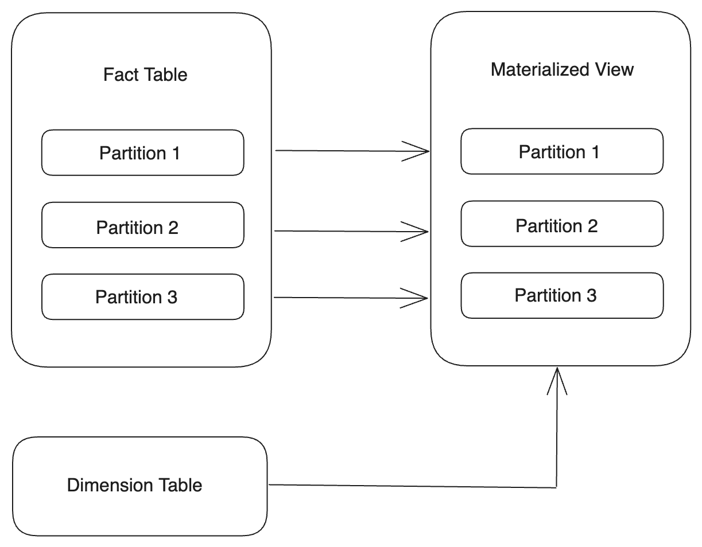
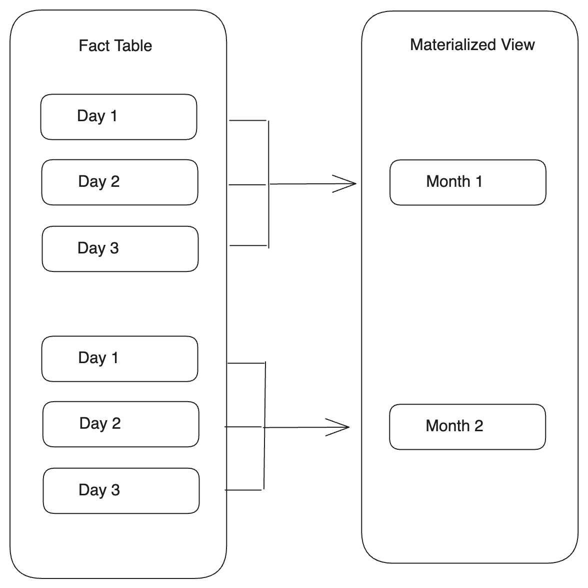
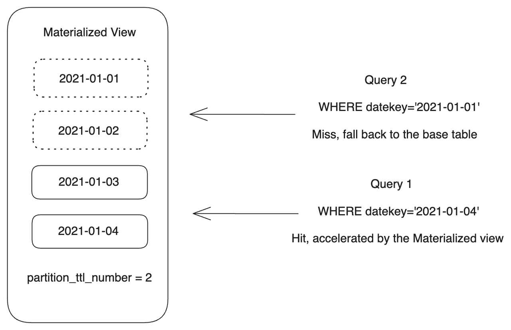

# パーティション化されたマテリアライズドビューの作成

このトピックでは、さまざまなユースケースに対応するためのパーティション化されたマテリアライズドビューの作成方法を紹介します。

## 概要

StarRocks の非同期マテリアライズドビューは、さまざまなパーティション戦略と機能をサポートしており、次の効果を達成できます。

- **インクリメンタル構築**

  パーティション化されたマテリアライズドビューを作成する際、パーティションをバッチでリフレッシュするように作成タスクを設定することで、過剰なリソース消費を避けることができます。

- **インクリメンタルリフレッシュ**

  ベーステーブルの特定のパーティションでデータの変更を検出した場合、マテリアライズドビューの対応するパーティションのみを更新するようにリフレッシュタスクを設定できます。パーティションレベルのリフレッシュは、マテリアライズドビュー全体をリフレッシュするために使用されるリソースの無駄を大幅に防ぐことができます。

- **部分的なマテリアライゼーション**

  マテリアライズドビューのパーティションに対して TTL を設定することで、データの部分的なマテリアライゼーションを可能にします。

- **透過的なクエリの書き換え**

  クエリは、更新されたマテリアライズドビューのパーティションに基づいて透過的に書き換えられます。古いと見なされるパーティションはクエリプランに関与せず、クエリはデータの一貫性を保証するためにベーステーブルで実行されます。

## 制限事項

パーティション化されたマテリアライズドビューは、パーティション化されたベーステーブル（通常はファクトテーブル）にのみ作成できます。ベーステーブルとマテリアライズドビューの間のパーティション関係をマッピングすることで、両者のシナジーを構築できます。

現在、StarRocks は次のデータソースからのテーブルに対してパーティション化されたマテリアライズドビューの構築をサポートしています。

- **Default Catalog の StarRocks OLAP テーブル**
  - サポートされるパーティション戦略: レンジパーティション化
  - パーティショニングキーのサポートされるデータ型: INT, DATE, DATETIME, STRING
  - サポートされるテーブルタイプ: Primary Key, Duplicate Key, Aggregate Key, Unique Key
  - 共有なしクラスタと共有データクラスタの両方でサポート
- **Hive Catalog, Hudi Catalog, Iceberg Catalog, Paimon Catalog のテーブル**
  - サポートされるパーティションレベル: プライマリレベル
  - パーティショニングキーのサポートされるデータ型: INT, DATE, DATETIME, STRING

:::note

- 非パーティション化されたベース（ファクト）テーブルに基づいてパーティション化されたマテリアライズドビューを作成することはできません。
- StarRocks OLAP テーブルの場合:
  - 現在、リストパーティション化と式に基づくパーティション化はサポートされていません。
  - ベーステーブルの隣接する2つのパーティションは連続した範囲を持つ必要があります。
- 外部カタログのマルチレベルパーティション化されたベーステーブルの場合、プライマリレベルのパーティションパスのみを使用してパーティション化されたマテリアライズドビューを作成できます。たとえば、`yyyyMMdd/hour` 形式でパーティション化されたテーブルの場合、`yyyyMMdd` でパーティション化されたマテリアライズドビューのみを構築できます。

:::

## ユースケース

次のようなベーステーブルがあるとします。

```SQL
CREATE TABLE IF NOT EXISTS par_tbl1 (
  datekey      DATE,       -- パーティショニングキーとして使用される DATE 型の日付列。
  k1           STRING,
  v1           INT,
  v2           INT
)
ENGINE=olap
PARTITION BY RANGE (datekey) (
  START ("2021-01-01") END ("2021-01-04") EVERY (INTERVAL 1 DAY)
)
DISTRIBUTED BY HASH(k1);

CREATE TABLE IF NOT EXISTS par_tbl2 (
  datekey      STRING,     -- パーティショニングキーとして使用される STRING 型の日付列。
  k1           STRING,
  v1           INT,
  v2           INT
)
ENGINE=olap
PARTITION BY RANGE (str2date(datekey, '%Y-%m-%d')) (
  START ("2021-01-01") END ("2021-01-04") EVERY (INTERVAL 1 DAY)
)
DISTRIBUTED BY HASH(k1);

CREATE TABLE IF NOT EXISTS par_tbl3 (
  datekey_new  DATE,       -- par_tbl1.datekey と同等の列。
  k1           STRING,
  v1           INT,
  v2           INT
)
ENGINE=olap
PARTITION BY RANGE (datekey_new) (
  START ("2021-01-01") END ("2021-01-04") EVERY (INTERVAL 1 DAY)
)
DISTRIBUTED BY HASH(k1);
```

### パーティションを一対一で整列させる

同じパーティショニングキーを使用して、ベーステーブルのパーティションと一対一で対応するマテリアライズドビューを作成できます。



- ベーステーブルのパーティショニングキーが DATE または DATETIME 型の場合、マテリアライズドビューに同じパーティショニングキーを直接指定できます。

  ```SQL
  PARTITION BY <base_table_partitioning_column>
  ```

  例:

  ```SQL
  CREATE MATERIALIZED VIEW par_mv1
  REFRESH ASYNC
  PARTITION BY datekey
  AS 
  SELECT 
    k1, 
    sum(v1) AS SUM, 
    datekey 
  FROM par_tbl1 
  GROUP BY datekey, k1;
  ```

- ベーステーブルのパーティショニングキーが STRING 型の場合、[str2date](../../../sql-reference/sql-functions/date-time-functions/str2date.md) 関数を使用して日付文字列を DATE または DATETIME 型に変換できます。

  ```SQL
  PARTITION BY str2date(<base_table_partitioning_column>, <format>)
  ```

  例:

  ```SQL
  CREATE MATERIALIZED VIEW par_mv2
  REFRESH ASYNC
  PARTITION BY str2date(datekey, '%Y-%m-%d')
  AS 
  SELECT 
    k1, 
    sum(v1) AS SUM, 
    datekey 
  FROM par_tbl2 
  GROUP BY datekey, k1;
  ```

### 時間粒度のロールアップでパーティションを整列させる

パーティショニングキーに [date_trunc](../../../sql-reference/sql-functions/date-time-functions/date_trunc.md) 関数を使用することで、ベーステーブルよりも大きな粒度でパーティション化されたマテリアライズドビューを作成できます。ベーステーブルのパーティションでデータの変更が検出されると、StarRocks はマテリアライズドビューの対応するロールアップパーティションをリフレッシュします。



- ベーステーブルのパーティショニングキーが DATE または DATETIME 型の場合、ベーステーブルのパーティショニングキーに date_trunc 関数を直接使用できます。

  ```SQL
  PARTITION BY date_trunc(<format>, <base_table_partitioning_column>)
  ```

  例:

  ```SQL
  CREATE MATERIALIZED VIEW par_mv3
  REFRESH ASYNC
  PARTITION BY date_trunc('month', datekey)
  AS 
  SELECT 
    k1, 
    sum(v1) AS SUM, 
    datekey 
  FROM par_tbl1 
  GROUP BY datekey, k1;
  ```

- ベーステーブルのパーティショニングキーが STRING 型の場合、SELECT リストでベーステーブルのパーティショニングキーを DATE または DATETIME 型に変換し、エイリアスを設定して、それを date_trunc 関数で使用してマテリアライズドビューのパーティショニングキーを指定します。

  ```SQL
  PARTITION BY 
  date_trunc(<format>, <mv_partitioning_column>)
  AS
  SELECT 
    str2date(<base_table_partitioning_column>, <format>) AS <mv_partitioning_column>
  ```

  例:

  ```SQL
  CREATE MATERIALIZED VIEW par_mv4
  REFRESH ASYNC
  PARTITION BY date_trunc('month', mv_datekey)
  AS 
  SELECT 
    datekey,
    k1, 
    sum(v1) AS SUM, 
    str2date(datekey, '%Y-%m-%d') AS mv_datekey
  FROM par_tbl2 
  GROUP BY datekey, k1;
  ```

### カスタマイズされた時間粒度でパーティションを整列させる

上記のパーティションロールアップ方法は、特定の時間粒度に基づいてマテリアライズドビューをパーティション化することのみを許可し、パーティションの時間範囲をカスタマイズすることはできません。ビジネスシナリオでカスタマイズされた時間粒度を使用してパーティション化する必要がある場合、date_trunc 関数と [time_slice](../../../sql-reference/sql-functions/date-time-functions/time_slice.md) 関数を使用して、指定された時間粒度に基づいて与えられた時間を時間間隔の開始または終了に変換することで、マテリアライズドビューのパーティションの時間粒度を定義できます。

SELECT リストでベーステーブルのパーティショニングキーに time_slice 関数を使用して新しい時間粒度（間隔）を定義し、エイリアスを設定して、それを date_trunc 関数で使用してマテリアライズドビューのパーティショニングキーを指定します。

```SQL
PARTITION BY
date_trunc(<format>, <mv_partitioning_column>)
AS
SELECT 
  -- time_slice を使用できます。
  time_slice(<base_table_partitioning_column>, <interval>) AS <mv_partitioning_column>
```

例:

```SQL
CREATE MATERIALIZED VIEW par_mv5
REFRESH ASYNC
PARTITION BY date_trunc('day', mv_datekey)
AS 
SELECT 
  k1, 
  sum(v1) AS SUM, 
  time_slice(datekey, INTERVAL 5 MINUTE) AS mv_datekey 
FROM par_tbl1 
GROUP BY datekey, k1;
```

### インクリメンタルリフレッシュと透過的な書き換えを実現する

パーティションごとにリフレッシュすることで、マテリアライズドビューのインクリメンタル更新と部分的なデータマテリアライゼーションによるクエリの透過的な書き換えを実現できます。

これらの目標を達成するために、マテリアライズドビューを作成する際には次の点を考慮する必要があります。

- **リフレッシュの粒度**

  `partition_refresh_number` プロパティを使用して、各リフレッシュ操作の粒度を指定できます。`partition_refresh_number` は、リフレッシュがトリガーされたときにリフレッシュタスクでリフレッシュされる最大パーティション数を制御します。リフレッシュされるパーティションの数がこの値を超える場合、StarRocks はリフレッシュタスクを分割し、バッチで完了します。パーティションは、最も古いパーティションから最新のパーティションまで（将来のために動的に作成されたパーティションを除く）時系列順にリフレッシュされます。`partition_refresh_number` のデフォルト値は `-1` で、リフレッシュタスクは分割されません。

- **マテリアライゼーションの範囲**

  マテリアライズドデータの範囲は、`partition_ttl_number`（v3.1.5 より前のバージョンの場合）または `partition_ttl`（v3.1.5 以降のバージョンで推奨）プロパティによって制御されます。`partition_ttl_number` は保持する最新のパーティションの数を指定し、`partition_ttl` は保持するマテリアライズドビューのデータの時間範囲を指定します。各リフレッシュ中に、StarRocks はパーティションを時系列順に並べ、TTL 要件を満たすものだけを保持します。

- **リフレッシュ戦略**

  - 自動リフレッシュ戦略（`REFRESH ASYNC`）を持つマテリアライズドビューは、ベーステーブルデータが変更されるたびに自動的にリフレッシュされます。
  - 定期的なリフレッシュ戦略（`REFRESH ASYNC [START (<start_time>)] EVERY (INTERVAL <interval>)`）を持つマテリアライズドビューは、定義された間隔で定期的にリフレッシュされます。

  :::note

  自動リフレッシュ戦略と定期的なリフレッシュ戦略を持つマテリアライズドビューは、リフレッシュタスクがトリガーされると自動的にリフレッシュされます。StarRocks はベーステーブルの各パーティションのデータバージョンを記録し、比較します。データバージョンの変更は、パーティション内のデータの変更を示します。StarRocks がベーステーブルのパーティションでデータの変更を検出すると、マテリアライズドビューの対応するパーティションをリフレッシュします。ベーステーブルパーティションでデータの変更が検出されない場合、対応するマテリアライズドビューのパーティションのリフレッシュはスキップされます。

  :::

  - 手動リフレッシュ戦略（`REFRESH MANUAL`）を持つマテリアライズドビューは、REFRESH MATERIALIZED VIEW ステートメントを手動で実行することによってのみリフレッシュできます。マテリアライズドビュー全体をリフレッシュするのを避けるために、リフレッシュするパーティションの時間範囲を指定できます。ステートメントで `FORCE` を指定すると、StarRocks はベーステーブルのデータが変更されているかどうかに関係なく、対応するマテリアライズドビューまたはパーティションを強制的にリフレッシュします。ステートメントに `WITH SYNC MODE` を追加することで、リフレッシュタスクの同期呼び出しを行うことができ、StarRocks はタスクが成功または失敗したときにのみタスク結果を返します。

次の例では、パーティション化されたマテリアライズドビュー `par_mv8` を作成します。StarRocks がベーステーブルのパーティションでデータの変更を検出した場合、マテリアライズドビューの対応するパーティションをリフレッシュします。リフレッシュタスクはバッチに分割され、それぞれが1つのパーティションのみをリフレッシュします（`"partition_refresh_number" = "1"`）。最新の2つのパーティションのみが保持され（`"partition_ttl_number" = "2"`）、他のパーティションはリフレッシュ中に削除されます。

```SQL
CREATE MATERIALIZED VIEW par_mv8
REFRESH ASYNC
PARTITION BY datekey
PROPERTIES(
  "partition_ttl_number" = "2",
  "partition_refresh_number" = "1"
)
AS 
SELECT 
  k1, 
  sum(v1) AS SUM, 
  datekey 
FROM par_tbl1 
GROUP BY datekey, k1;
```

このマテリアライズドビューをリフレッシュするために REFRESH MATERIALIZED VIEW ステートメントを使用できます。次の例では、特定の時間範囲内で `par_mv8` のいくつかのパーティションを強制的に同期呼び出しでリフレッシュします。

```SQL
REFRESH MATERIALIZED VIEW par_mv8
PARTITION START ("2021-01-03") END ("2021-01-04")
FORCE WITH SYNC MODE;
```

出力:

```Plain
+--------------------------------------+
| QUERY_ID                             |
+--------------------------------------+
| 1d1c24b8-bf4b-11ee-a3cf-00163e0e23c9 |
+--------------------------------------+
1 row in set (1.12 sec)
```

TTL 機能を使用すると、`par_mv8` には一部のパーティションのみが保持されます。これにより、ほとんどのクエリが最近のデータに対して行われるシナリオで重要な部分的なデータのマテリアライゼーションを達成できます。TTL 機能を使用すると、マテリアライズドビューで新しいデータ（たとえば、1週間または1か月以内）のクエリを透過的に高速化しながら、ストレージコストを大幅に節約できます。この時間範囲に該当しないクエリはベーステーブルにルーティングされます。

次の例では、クエリ1は `par_mv8` に保持されているパーティションにヒットするため、マテリアライズドビューによって高速化されますが、クエリ2は保持されているパーティションの時間範囲に該当しないため、ベーステーブルにルーティングされます。

```SQL
-- クエリ1
SELECT 
  k1, 
  sum(v1) AS SUM, 
  datekey 
FROM par_tbl1
WHERE datekey='2021-01-04'
GROUP BY datekey, k1;

-- クエリ2
SELECT 
  k1, 
  sum(v1) AS SUM, 
  datekey 
FROM par_tbl1
WHERE datekey='2021-01-01'
GROUP BY datekey, k1;
```

