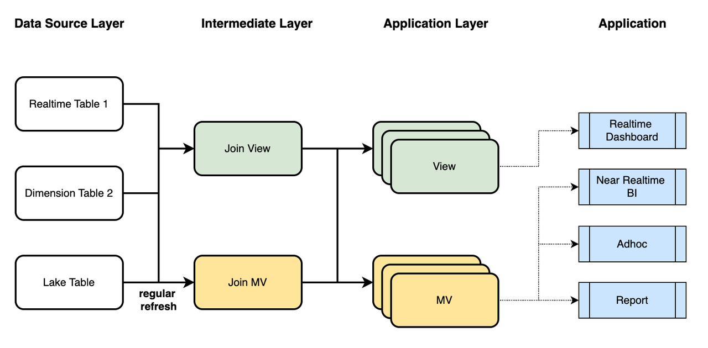
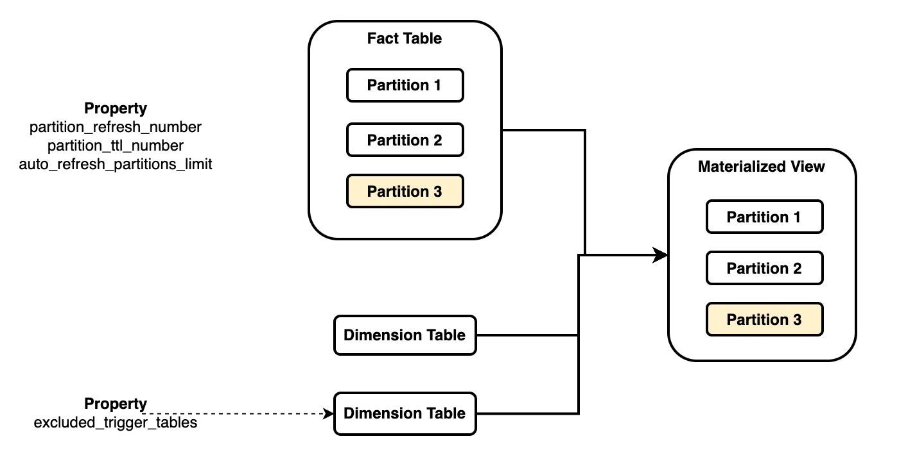

# マテリアライズドビューを用いたデータモデリング

このトピックでは、StarRocks の非同期マテリアライズドビューを活用してデータモデリングを行う方法について説明します。これにより、データウェアハウスの ETL パイプラインを大幅に簡素化し、データ品質とクエリパフォーマンスを大幅に向上させることができます。

## 概要

データモデリングは、データをクレンジングし、階層化し、集約し、合理的な方法論で関連付けるプロセスです。これにより、直接分析するには粗すぎたり複雑すぎたり、コストがかかりすぎたりする生データを理解しやすい形で表現し、データに対する実用的な洞察を提供します。

しかし、現実のデータモデリングにおける一般的な課題は、モデリングプロセスがビジネスの発展のペースに追いつかず、データモデリングの努力に対する投資収益率を測定するのが難しいことです。モデリングの方法論は単純であるにもかかわらず、ビジネスの専門家はデータの組織化とガバナンスに関する確固たる背景を持つ必要があり、これは複雑なプロセスです。ビジネスの初期段階では、意思決定者はデータモデリングに十分なリソースを割くことはほとんどなく、データモデリングがもたらす価値を見出すのは困難です。さらに、ビジネスモデルは急速に変化する可能性があり、モデリングの方法論自体も反復と進化が必要です。そのため、多くのデータアナリストはモデリングを避け、生データを直接使用する傾向があり、これによりデータ品質とクエリパフォーマンスの問題が避けられなくなります。モデリングの必要性が生じたときには、既に確立されたデータ分析パターンをデータモデルに合わせて再構築するのが難しくなります。

マテリアライズドビューを使用したデータモデリングは、これらの問題を効果的に解決できます。StarRocks の非同期マテリアライズドビューは次のことが可能です：

- **データウェアハウスアーキテクチャの簡素化**: StarRocks はワンストップのデータガバナンス体験を提供できるため、他のデータ処理システムを維持する必要がなく、それに費やす人的およびシステムリソースを節約できます。
- **データモデリング体験の向上**: 基本的な SQL 知識を持つデータアナリストであれば、StarRocks を使用してデータモデリングが可能です。データモデリングはもはや経験豊富なデータエンジニアの専売特許ではありません。
- **メンテナンスの複雑さの軽減**: StarRocks の非同期マテリアライズドビューは、データ層間の系統関係と依存関係を自動的に管理し、このタスクを処理するためのデータプラットフォーム全体を必要としません。



現実の状況では、StarRocks のビュー（ビュー）と非同期マテリアライズドビューを組み合わせてデータモデリングを行うことができます。以下のように進めます：

1. ビューを使用してリアルタイムデータをディメンションデータと関連付け、マテリアライズドビューを使用してデータレイクからの履歴データをディメンションデータと関連付けます。必要なデータクレンジングとセマンティックマッピングを行い、ビジネスシナリオで必要なセマンティクスを反映した中間層の詳細データを取得します。
2. アプリケーション層では、異なるビジネスシナリオに合わせてデータのジョイン、集約、ユニオン、ウィンドウ計算を行います。これにより、リアルタイムパイプライン用のビューと、ニアリアルタイムパイプライン用のマテリアライズドビューが得られます。
3. アプリケーション側では、タイムリー性とパフォーマンス要件に基づいてクエリ分析に適した Analytical Data Store (ADS) を選択します。これらの ADS は、リアルタイムダッシュボード、ニアリアルタイム BI、アドホッククエリ、スケジュールレポートを提供できます。

このプロセスでは、StarRocks のいくつかの組み込み機能を活用します。これについては次のセクションで詳しく説明します。

## 非同期マテリアライズドビューの機能

StarRocks の非同期マテリアライズドビューは、データモデリングを支援する以下の基本機能を備えています：

- **自動リフレッシュ**: データがベーステーブルにロードされた後、マテリアライズドビューは自動的にリフレッシュされます。外部でスケジューリングタスクを維持する必要はありません。
- **パーティションリフレッシュ**: 時系列を特徴とするテーブルに基づいて構築されたマテリアライズドビューのパーティションリフレッシュを通じて、ニアリアルタイム計算を実現できます。
- **ビューとのシナジー**: マテリアライズドビューとビューを使用して多層モデリングを実現し、中間層の再利用とデータモデルの簡素化を可能にします。
- **スキーマ変更**: 複雑なデータパイプラインを変更することなく、単純な SQL ステートメントを使用して計算結果を変更できます。

これらの機能を活用することで、さまざまなビジネスニーズやシナリオに対応する包括的で柔軟なデータモデルを設計できます。

### 自動リフレッシュ

非同期マテリアライズドビューを作成する際に、REFRESH 句を使用してリフレッシュ戦略を指定できます。現在、StarRocks は以下の非同期マテリアライズドビューのリフレッシュ戦略をサポートしています：

- **自動リフレッシュ** (`REFRESH ASYNC`): ベーステーブルのデータが変更されるたびにリフレッシュタスクがトリガーされます。データ依存関係はマテリアライズドビューによって自動的に管理されます。
- **スケジュールリフレッシュ** (`REFRESH ASYNC EVERY (INTERVAL <refresh_interval>)`): 例えば、毎分、毎日、毎月など、定期的な間隔でリフレッシュタスクがトリガーされます。ベーステーブルにデータ変更がない場合、リフレッシュタスクはトリガーされません。
- **手動リフレッシュ** (`REFRESH MANUAL`): リフレッシュタスクは、REFRESH MATERIALIZED VIEW を手動で実行することによってのみトリガーされます。このリフレッシュ戦略は、外部のスケジューリングフレームワークを使用してリフレッシュタスクをトリガーする場合に使用できます。

構文：

```SQL
CREATE MATERIALIZED VIEW <name>
REFRESH 
    [ ASYNC | 
      ASYNC [START <time>] EVERY(<interval>) | 
      MANUAL
    ]
AS <query>
```

### パーティションリフレッシュ

非同期マテリアライズドビューを作成する際に、PARTITION BY 句を指定して、ベーステーブルのパーティションとマテリアライズドビューのパーティションを関連付け、パーティションレベルのリフレッシュを実現できます。

- `PARTITION BY <column>`: ベーステーブルとマテリアライズドビューの同じパーティション列を参照できます。その結果、ベーステーブルとマテリアライズドビューは同じ粒度でパーティション化されます。
- `PARTITION BY date_trunc(<column>)`: date_trunc 関数を使用して、時間単位を切り捨てることにより、マテリアライズドビューの異なるパーティション戦略（粒度レベル）を割り当てることができます。
- `PARTITION BY { time_slice | date_slice }(<column>)`: date_trunc と比較して、time_slice と date_slice はより柔軟な時間粒度の調整を提供し、時間に基づくパーティション化をより細かく制御できます。

構文：

```SQL
CREATE MATERIALIZED VIEW <name>
REFRESH ASYNC
PARTITION BY 
    [
        <base_table_column> | 
        date_trunc(<granularity>, <base_table_column>) |
        time_slice(<base_table_column>, <granularity>) | 
        date_slice(<base_table_column>, <granularity>)
    ]
AS <query>
```

### ビューとのシナジー

- マテリアライズドビューはビューに基づいて作成できます。この場合、ビューが参照するベーステーブルにデータ変更があると、マテリアライズドビューは自動的にリフレッシュされます。
- 他のマテリアライズドビューに基づいてマテリアライズドビューを作成することもでき、多層のカスケードリフレッシュメカニズムを実現できます。
- ビューはマテリアライズドビューに基づいて作成でき、通常のテーブルと同等です。

### スキーマ変更

- ALTER MATERIALIZED VIEW SWAP ステートメントを使用して、2 つの非同期マテリアライズドビュー間で原子交換を行うことができます。これにより、列を追加したり列型を変更したりして新しいマテリアライズドビューを作成し、それを古いものと交換できます。
- ビューの定義は ALTER VIEW ステートメントを使用して直接変更できます。
- StarRocks の通常のテーブルは、SWAP または ALTER 操作を使用して変更できます。
- さらに、ベーステーブル（マテリアライズドビュー、ビュー、または通常のテーブルである可能性があります）に変更があると、対応するマテリアライズドビューにカスケード変更がトリガーされます。

## レイヤードモデリング

多くの現実のビジネスシナリオでは、リアルタイムの詳細データ、ディメンションデータ、データレイクからの履歴データなど、さまざまな形式のデータソースがあります。一方で、ビジネス要件は、リアルタイムダッシュボード、ニアリアルタイム BI クエリ、アドホッククエリ、スケジュールレポートなど、多様な分析方法を求めています。異なるシナリオには異なる要求があります - 柔軟性を求めるものもあれば、パフォーマンスを重視するもの、コスト効率を重視するものもあります。

明らかに、単一のソリューションではこれらの多様な要求に十分に対応できません。StarRocks は、ビューとマテリアライズドビューの使用を組み合わせることで、これらのニーズに効率的に対応できます。ビューは物理データを保持しないため、ビューがクエリされるたびに、クエリはビューの定義に従って解析され実行されます。これに対して、事前計算された結果を保持するマテリアライズドビューは、繰り返し実行のオーバーヘッドを防ぐことができます。ビューはビジネスセマンティクスを表現し、SQL の複雑さを簡素化するのに適していますが、クエリ実行のコストを削減することはできません。一方、マテリアライズドビューは事前計算を通じてクエリパフォーマンスを最適化し、ETL パイプラインの効率化に適しています。

以下は、ビューとマテリアライズドビューの違いの概要です：

|                                      | **View**                                                     | **Materialized view**                                        |
| ------------------------------------ | ------------------------------------------------------------ | ------------------------------------------------------------ |
| **ユースケース**                        | ビジネスモデリング、データガバナンス                           | データモデリング、透明なアクセラレーション、データレイク統合 |
| **ストレージコスト**                     | ストレージコストなし                                          | 事前計算された結果を保存することによるストレージコスト        |
| **更新コスト**                         | 更新コストなし                                               | ベーステーブルデータの更新時に発生するリフレッシュコスト      |
| **パフォーマンスの利点**               | パフォーマンスの利点なし                                      | 事前計算結果の再利用によるクエリアクセラレーション           |
| **データのリアルタイム属性** | ビューに対するクエリはリアルタイムで計算されるため、最新のデータが返されます。 | 結果は事前計算されているため、データは最新でない可能性があります。 |
| **依存関係**                           | ビューはベーステーブルを名前で参照するため、ベーステーブル名が変更されると無効になります。 | ベーステーブル名の変更は、ベーステーブルを ID で参照するマテリアライズドビューの可用性に影響しません。 |
| **作成構文**                        | CREATE VIEW                                                  | CREATE MATERIALIZED VIEW                                     |
| **変更構文**                        | ALTER VIEW                                                   | ALTER MATERIALIZED VIEW                                      |

以下のステートメントを使用して、ビュー、マテリアライズドビュー、およびベーステーブルを変更できます：

```SQL
-- テーブルを変更します。
ALTER TABLE <table_name> ADD COLUMN <column_desc>;

-- 2 つのテーブルをスワップします。
ALTER TABLE <table1> SWAP WITH <table2>;

-- ビューの定義を変更します。
ALTER VIEW <view_name> AS <query>;

-- 2 つのマテリアライズドビューをスワップします
-- （2 つのマテリアライズドビューの名前をスワップし、データには影響を与えません）。
ALTER MATERIALIZED VIEW <mv1> SWAP WITH <mv2>;

-- マテリアライズドビューを再アクティブ化します。
ALTER MATERIALIZED VIEW <mv_name> ACTIVE;
```

スキーマ変更は以下の原則に従います：

- テーブルのリネームおよびスワップ操作は、依存するマテリアライズドビューを非アクティブに設定します。スキーマ変更操作の場合、スキーマ変更操作がマテリアライズドビューが参照するベーステーブル列に対して行われた場合にのみ、依存するマテリアライズドビューが非アクティブに設定されます。
- ビューの定義を変更すると、依存するマテリアライズドビューが非アクティブに設定されます。
- マテリアライズドビューがスワップされると、それに基づいて構築されたネストされたマテリアライズドビューが非アクティブに設定されます。
- 非アクティブな状態は、マテリアライズドビューの依存関係がなくなるまで上位にカスケードします。
- 非アクティブなマテリアライズドビューは、リフレッシュや自動クエリの書き換えには使用できません。
- 非アクティブなマテリアライズドビューは直接クエリできますが、再度アクティブになるまでデータの一貫性は保証されません。

非アクティブなマテリアライズドビューのデータ一貫性は保証されませんが、以下の方法を使用して機能を復元できます：

- **手動アクティベーション**: `ALTER MATERIALIZED VIEW <mv_name> ACTIVE` を実行することで、非アクティブなマテリアライズドビューを手動で修復できます。このステートメントは、元の SQL 定義に基づいてマテリアライズドビューを再作成します。なお、基礎となるスキーマ変更後も SQL 定義が有効である必要があります。そうでない場合、操作は失敗します。
- **リフレッシュ前のアクティベーション**: StarRocks は、非アクティブなマテリアライズドビューをリフレッシュする前にアクティベートしようとします。
- **自動アクティベーション**: StarRocks は、非アクティブなマテリアライズドビューを自動的にアクティベートしようとします。ただし、このプロセスのタイムリー性は保証されません。この機能は、`ADMIN SET FRONTEND CONFIG('enable_mv_automatic_active_check'='false')` を実行することで無効にできます。この機能は v3.1.4 および v3.2.0 以降で利用可能です。

## パーティションモデリング

レイヤードモデリングに加えて、パーティションモデリングもデータモデリングの重要な側面です。データモデリングは、ビジネスセマンティクスに基づいてデータを関連付け、タイムリー性の要件に応じてデータの Time-To-Live (TTL) を設定することを伴います。パーティションモデリングはこのプロセスで重要な役割を果たします。

パーティションモデリングは、レイヤードモデリングを補完するデータモデリングの重要な側面です。ビジネスセマンティクスに基づいてデータを関連付け、タイムリー性の要件に応じてデータの Time-To-Live (TTL) を設定することを伴います。データのパーティショニングはこのプロセスで重要な役割を果たします。

データを関連付けるさまざまな方法により、スタースキーマやスノーフレークスキーマなどのさまざまなモデリングアプローチが生まれます。これらのモデルには共通点があります - すべてファクトテーブルとディメンションテーブルを使用します。いくつかのビジネスシナリオでは、複数の大規模なファクトテーブルが必要であり、他のシナリオでは、複雑なディメンションテーブルとそれらの間の関係を扱います。StarRocks のマテリアライズドビューは、ファクトテーブルのパーティション関連付けをサポートしており、ファクトテーブルがパーティション化され、マテリアライズドビューのジョイン結果も同様にパーティション化されます。



上記の図のように、マテリアライズドビューはファクトテーブルを複数のディメンションテーブルと関連付けます：

- 特定のベーステーブル（通常はファクトテーブル）のパーティションキーをマテリアライズドビューのパーティションキーとして参照し、パーティション戦略を関連付ける必要があります。各マテリアライズドビューは、1 つのベーステーブルにのみ関連付けられます。
- 参照されたテーブルのパーティション内のデータが変更されると、マテリアライズドビューの対応するパーティションがリフレッシュされ、他のパーティションには影響しません。
- 参照されていないテーブルのデータが変更されると、デフォルトでマテリアライズドビュー全体がリフレッシュされます。ただし、特定の非参照ベーステーブルのデータ変更を無視することを選択でき、これにより、これらのテーブルのデータが変更されたときにマテリアライズドビューがリフレッシュされません。

このようなパーティション関連付けは、さまざまなビジネスシナリオをサポートします：

- **ファクトテーブルの更新**: ファクトテーブルを日次または時間単位などの細かいレベルでパーティション化できます。ファクトテーブルが更新されると、マテリアライズドビューの対応するパーティションが自動的にリフレッシュされます。
- **ディメンションテーブルの更新**: 通常、ディメンションテーブルのデータ更新は、すべての関連結果のリフレッシュを引き起こし、コストがかかる可能性があります。特定のディメンションテーブルのデータ更新を無視して、マテリアライズドビュー全体のリフレッシュを回避するか、特定の時間範囲を指定して、その時間範囲内のパーティションのみをリフレッシュすることができます。
- **外部テーブルの自動リフレッシュ**: Apache Hive や Apache Iceberg などの外部データソースでは、データはパーティションレベルで変更されます。StarRocks のマテリアライズドビューは、外部カタログのパーティションレベルでの変更を購読し、マテリアライズドビューの対応するパーティションのみをリフレッシュできます。
- **TTL**: マテリアライズドビューのパーティション戦略を設定する際に、保持する最近のパーティションの数を設定し、最新のデータのみを保持できます。これは、アナリストが特定の時間枠内の最新データのみをクエリし、すべての履歴データを保持する必要がないビジネスシナリオで役立ちます。

いくつかのパラメータを使用してリフレッシュ動作を制御できます：

- `partition_refresh_number`: 各リフレッシュ操作でリフレッシュするパーティションの数。
- `partition_ttl_number`: 保持する最近のパーティションの数。
- `excluded_trigger_tables`: データ変更を無視して自動リフレッシュをトリガーしないようにするテーブル。
- `auto_refresh_partitions_limit`: 各自動リフレッシュ操作でリフレッシュするパーティションの数。
- `excluded_refresh_tables`: リフレッシュが必要なテーブルを除外し、通常は `excluded_trigger_tables` と一緒に使用されます。

詳細については、[CREATE MATERIALIZED VIEW](../../../sql-reference/sql-statements/materialized_view/CREATE_MATERIALIZED_VIEW.md) を参照してください。

現在、パーティション化されたマテリアライズドビューには以下の制限があります：

- パーティション化されたテーブルに基づいてのみパーティション化されたマテリアライズドビューを構築できます。
- DATE または DATETIME 型の列のみをパーティションキーとして使用できます。STRING データ型はサポートされていません。
- date_trunc、time_slice、および date_slice 関数を使用してのみパーティションロールアップを実行できます。
- パーティションキーとして単一の列のみを指定できます。複数のパーティション列はサポートされていません。

## まとめ

StarRocks の非同期マテリアライズドビューを利用したデータモデリングは、パイプライン管理を簡素化し、宣言的なモデリング言語を通じてデータモデリングの効率と柔軟性を向上させる利点を提供します。

データモデリングに加えて、StarRocks の非同期マテリアライズドビューは、透明なアクセラレーションやデータレイク統合を含むさまざまなシナリオでの適用が可能です。これにより、データの価値をさらに探求し、データ効率を向上させることができます。