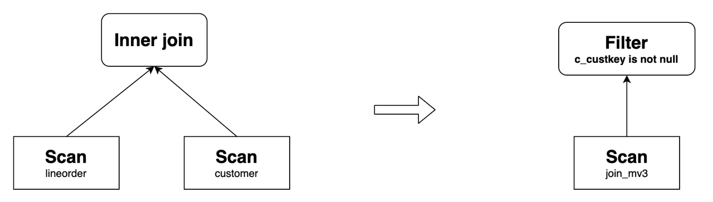

# マテリアライズドビューを用いたクエリの書き換え

このトピックでは、StarRocks の非同期マテリアライズドビューを活用してクエリを自動的に書き換え、クエリを高速化する方法について説明します。

## 概要

StarRocks の非同期マテリアライズドビューは、SPJG (select-project-join-group-by) フォームに基づく広く採用されている透明なクエリの書き換えアルゴリズムを使用しています。クエリ文を変更することなく、StarRocks はベーステーブルに対するクエリを、事前計算された結果を含む対応するマテリアライズドビューに対するクエリに自動的に書き換えることができます。その結果、マテリアライズドビューは計算コストを大幅に削減し、クエリの実行を大幅に高速化するのに役立ちます。

非同期マテリアライズドビューに基づくクエリの書き換え機能は、特に次のシナリオで有用です：

- **メトリクスの事前集計**

  データの次元が高い場合、マテリアライズドビューを使用して事前集計されたメトリクス層を作成できます。

- **広いテーブルのジョイン**

  マテリアライズドビューを使用すると、複数の大規模な広いテーブルのジョインを含む複雑なシナリオでクエリを透明に高速化できます。

- **データレイクでのクエリアクセラレーション**

  外部カタログベースのマテリアライズドビューを構築することで、データレイク内のデータに対するクエリを簡単に高速化できます。

  > **注意**
  >
  > JDBC カタログ内のベーステーブルに作成された非同期マテリアライズドビューは、クエリの書き換えをサポートしていません。

### 特徴

StarRocks の非同期マテリアライズドビューに基づく自動クエリの書き換えは、次の属性を特徴としています：

- **強力なデータ整合性**: ベーステーブルが内部テーブルである場合、StarRocks はマテリアライズドビューに基づくクエリの書き換えを通じて得られる結果が、ベーステーブルに対する直接クエリから返される結果と一致することを保証します。
- **古いデータの書き換え**: StarRocks は古いデータの書き換えをサポートしており、頻繁なデータ変更があるシナリオに対応するために一定のデータの期限切れを許容します。
- **マルチテーブルジョイン**: StarRocks の非同期マテリアライズドビューは、View Delta Joins や Derivable Joins などの複雑なジョインシナリオを含むさまざまなタイプのジョインをサポートしており、大規模な広いテーブルを含むシナリオでクエリを高速化できます。
- **集計の書き換え**: StarRocks は集計を含むクエリを再構成して、レポートのパフォーマンスを向上させることができます。
- **ネストされたマテリアライズドビュー**: StarRocks は、ネストされたマテリアライズドビューに基づく複雑なクエリを再構成することをサポートし、書き換え可能なクエリの範囲を拡大します。
- **ユニオンの書き換え**: マテリアライズドビューのパーティションの TTL (Time-to-Live) と組み合わせてユニオンの書き換え機能を使用することで、ホットデータとコールドデータの分離を実現し、マテリアライズドビューからホットデータを、ベーステーブルから履歴データをクエリできます。
- **ビューに基づくマテリアライズドビュー**: ビューに基づくデータモデリングシナリオでクエリを高速化できます。
- **外部カタログに基づくマテリアライズドビュー**: データレイクでクエリを高速化できます。
- **複雑な式の書き換え**: 関数呼び出しや算術演算を含む複雑な式を処理でき、高度な分析および計算要件に対応します。

これらの機能は、以下のセクションで詳しく説明します。

## ジョインの書き換え

StarRocks は、Inner Join、Cross Join、Left Outer Join、Full Outer Join、Right Outer Join、Semi Join、Anti Join を含むさまざまなタイプのジョインを持つクエリの書き換えをサポートしています。

以下は、ジョインを持つクエリの書き換えの例です。次のように2つのベーステーブルを作成します：

```SQL
CREATE TABLE customer (
  c_custkey     INT(11)     NOT NULL,
  c_name        VARCHAR(26) NOT NULL,
  c_address     VARCHAR(41) NOT NULL,
  c_city        VARCHAR(11) NOT NULL,
  c_nation      VARCHAR(16) NOT NULL,
  c_region      VARCHAR(13) NOT NULL,
  c_phone       VARCHAR(16) NOT NULL,
  c_mktsegment  VARCHAR(11) NOT NULL
) ENGINE=OLAP
DUPLICATE KEY(c_custkey)
DISTRIBUTED BY HASH(c_custkey) BUCKETS 12;

CREATE TABLE lineorder (
  lo_orderkey         INT(11) NOT NULL,
  lo_linenumber       INT(11) NOT NULL,
  lo_custkey          INT(11) NOT NULL,
  lo_partkey          INT(11) NOT NULL,
  lo_suppkey          INT(11) NOT NULL,
  lo_orderdate        INT(11) NOT NULL,
  lo_orderpriority    VARCHAR(16) NOT NULL,
  lo_shippriority     INT(11) NOT NULL,
  lo_quantity         INT(11) NOT NULL,
  lo_extendedprice    INT(11) NOT NULL,
  lo_ordtotalprice    INT(11) NOT NULL,
  lo_discount         INT(11) NOT NULL,
  lo_revenue          INT(11) NOT NULL,
  lo_supplycost       INT(11) NOT NULL,
  lo_tax              INT(11) NOT NULL,
  lo_commitdate       INT(11) NOT NULL,
  lo_shipmode         VARCHAR(11) NOT NULL
) ENGINE=OLAP
DUPLICATE KEY(lo_orderkey)
DISTRIBUTED BY HASH(lo_orderkey) BUCKETS 48;
```

上記のベーステーブルを使用して、次のようにマテリアライズドビューを作成できます：

```SQL
CREATE MATERIALIZED VIEW join_mv1
DISTRIBUTED BY HASH(lo_orderkey)
AS
SELECT lo_orderkey, lo_linenumber, lo_revenue, lo_partkey, c_name, c_address
FROM lineorder INNER JOIN customer
ON lo_custkey = c_custkey;
```

このようなマテリアライズドビューは、次のクエリを書き換えることができます：

```SQL
SELECT lo_orderkey, lo_linenumber, lo_revenue, c_name, c_address
FROM lineorder INNER JOIN customer
ON lo_custkey = c_custkey;
```


StarRocks は、算術演算、文字列関数、日付関数、CASE WHEN 式、OR 述語などの複雑な式を含むジョインクエリの書き換えをサポートしています。たとえば、上記のマテリアライズドビューは次のクエリを書き換えることができます：

```SQL
SELECT 
    lo_orderkey, 
    lo_linenumber, 
    (2 * lo_revenue + 1) * lo_linenumber, 
    upper(c_name), 
    substr(c_address, 3)
FROM lineorder INNER JOIN customer
ON lo_custkey = c_custkey;
```

従来のシナリオに加えて、StarRocks はさらに複雑なシナリオでのジョインクエリの書き換えをサポートしています。

### Query Delta Join の書き換え

Query Delta Join は、クエリでジョインされるテーブルがマテリアライズドビューでジョインされるテーブルのスーパーセットであるシナリオを指します。たとえば、`lineorder`、`customer`、`part` の3つのテーブルのジョインを含む次のクエリを考えてみましょう。マテリアライズドビュー `join_mv1` が `lineorder` と `customer` のジョインのみを含んでいる場合、StarRocks は `join_mv1` を使用してクエリを書き換えることができます。

例：

```SQL
SELECT lo_orderkey, lo_linenumber, lo_revenue, c_name, c_address, p_name
FROM
    lineorder INNER JOIN customer ON lo_custkey = c_custkey
    INNER JOIN part ON lo_partkey = p_partkey;
```

その元のクエリプランと書き換え後のプランは次のとおりです：


### View Delta Join の書き換え

View Delta Join は、クエリでジョインされるテーブルがマテリアライズドビューでジョインされるテーブルのサブセットであるシナリオを指します。この機能は通常、大規模な広いテーブルを含むシナリオで使用されます。たとえば、Star Schema Benchmark (SSB) のコンテキストで、すべてのテーブルをジョインするマテリアライズドビューを作成してクエリパフォーマンスを向上させることができます。テストを通じて、マテリアライズドビューを通じてクエリを透明に書き換えることで、マルチテーブルジョインのクエリパフォーマンスが対応する大規模な広いテーブルをクエリするのと同じレベルのパフォーマンスを達成できることが確認されています。

View Delta Join の書き換えを実行するには、マテリアライズドビューにクエリに存在しない 1:1 カーディナリティ保存ジョインが含まれている必要があります。以下の9種類のジョインがカーディナリティ保存ジョインと見なされ、いずれかを満たすことで View Delta Join の書き換えが可能になります：


SSB テストを例にとり、次のベーステーブルを作成します：

```SQL
CREATE TABLE customer (
  c_custkey         INT(11)       NOT NULL,
  c_name            VARCHAR(26)   NOT NULL,
  c_address         VARCHAR(41)   NOT NULL,
  c_city            VARCHAR(11)   NOT NULL,
  c_nation          VARCHAR(16)   NOT NULL,
  c_region          VARCHAR(13)   NOT NULL,
  c_phone           VARCHAR(16)   NOT NULL,
  c_mktsegment      VARCHAR(11)   NOT NULL
) ENGINE=OLAP
DUPLICATE KEY(c_custkey)
DISTRIBUTED BY HASH(c_custkey) BUCKETS 12
PROPERTIES (
"unique_constraints" = "c_custkey"   -- 一意制約を指定します。
);

CREATE TABLE dates (
  d_datekey          DATE          NOT NULL,
  d_date             VARCHAR(20)   NOT NULL,
  d_dayofweek        VARCHAR(10)   NOT NULL,
  d_month            VARCHAR(11)   NOT NULL,
  d_year             INT(11)       NOT NULL,
  d_yearmonthnum     INT(11)       NOT NULL,
  d_yearmonth        VARCHAR(9)    NOT NULL,
  d_daynuminweek     INT(11)       NOT NULL,
  d_daynuminmonth    INT(11)       NOT NULL,
  d_daynuminyear     INT(11)       NOT NULL,
  d_monthnuminyear   INT(11)       NOT NULL,
  d_weeknuminyear    INT(11)       NOT NULL,
  d_sellingseason    VARCHAR(14)   NOT NULL,
  d_lastdayinweekfl  INT(11)       NOT NULL,
  d_lastdayinmonthfl INT(11)       NOT NULL,
  d_holidayfl        INT(11)       NOT NULL,
  d_weekdayfl        INT(11)       NOT NULL
) ENGINE=OLAP
DUPLICATE KEY(d_datekey)
DISTRIBUTED BY HASH(d_datekey) BUCKETS 1
PROPERTIES (
"unique_constraints" = "d_datekey"   -- 一意制約を指定します。
);

CREATE TABLE supplier (
  s_suppkey          INT(11)       NOT NULL,
  s_name             VARCHAR(26)   NOT NULL,
  s_address          VARCHAR(26)   NOT NULL,
  s_city             VARCHAR(11)   NOT NULL,
  s_nation           VARCHAR(16)   NOT NULL,
  s_region           VARCHAR(13)   NOT NULL,
  s_phone            VARCHAR(16)   NOT NULL
) ENGINE=OLAP
DUPLICATE KEY(s_suppkey)
DISTRIBUTED BY HASH(s_suppkey) BUCKETS 12
PROPERTIES (
"unique_constraints" = "s_suppkey"   -- 一意制約を指定します。
);

CREATE TABLE part (
  p_partkey          INT(11)       NOT NULL,
  p_name             VARCHAR(23)   NOT NULL,
  p_mfgr             VARCHAR(7)    NOT NULL,
  p_category         VARCHAR(8)    NOT NULL,
  p_brand            VARCHAR(10)   NOT NULL,
  p_color            VARCHAR(12)   NOT NULL,
  p_type             VARCHAR(26)   NOT NULL,
  p_size             TINYINT(11)   NOT NULL,
  p_container        VARCHAR(11)   NOT NULL
) ENGINE=OLAP
DUPLICATE KEY(p_partkey)
DISTRIBUTED BY HASH(p_partkey) BUCKETS 12
PROPERTIES (
"unique_constraints" = "p_partkey"   -- 一意制約を指定します。
);

CREATE TABLE lineorder (
  lo_orderdate       DATE          NOT NULL, -- NOT NULL として指定します。
  lo_orderkey        INT(11)       NOT NULL,
  lo_linenumber      TINYINT       NOT NULL,
  lo_custkey         INT(11)       NOT NULL, -- NOT NULL として指定します。
  lo_partkey         INT(11)       NOT NULL, -- NOT NULL として指定します。
  lo_suppkey         INT(11)       NOT NULL, -- NOT NULL として指定します。
  lo_orderpriority   VARCHAR(100)  NOT NULL,
  lo_shippriority    TINYINT       NOT NULL,
  lo_quantity        TINYINT       NOT NULL,
  lo_extendedprice   INT(11)       NOT NULL,
  lo_ordtotalprice   INT(11)       NOT NULL,
  lo_discount        TINYINT       NOT NULL,
  lo_revenue         INT(11)       NOT NULL,
  lo_supplycost      INT(11)       NOT NULL,
  lo_tax             TINYINT       NOT NULL,
  lo_commitdate      DATE          NOT NULL,
  lo_shipmode        VARCHAR(100)  NOT NULL
) ENGINE=OLAP
DUPLICATE KEY(lo_orderdate,lo_orderkey)
PARTITION BY RANGE(lo_orderdate)
(PARTITION p1 VALUES [("0000-01-01"), ("1993-01-01")),
PARTITION p2 VALUES [("1993-01-01"), ("1994-01-01")),
PARTITION p3 VALUES [("1994-01-01"), ("1995-01-01")),
PARTITION p4 VALUES [("1995-01-01"), ("1996-01-01")),
PARTITION p5 VALUES [("1996-01-01"), ("1997-01-01")),
PARTITION p6 VALUES [("1997-01-01"), ("1998-01-01")),
PARTITION p7 VALUES [("1998-01-01"), ("1999-01-01")))
DISTRIBUTED BY HASH(lo_orderkey) BUCKETS 48
PROPERTIES (
"foreign_key_constraints" = "
    (lo_custkey) REFERENCES customer(c_custkey);
    (lo_partkey) REFERENCES part(p_partkey);
    (lo_suppkey) REFERENCES supplier(s_suppkey)" -- 外部キーを指定します。
);
```

`lineorder`、`customer`、`supplier`、`part`、`dates` をジョインするマテリアライズドビュー `lineorder_flat_mv` を作成します：

```SQL
CREATE MATERIALIZED VIEW lineorder_flat_mv
DISTRIBUTED BY HASH(LO_ORDERDATE, LO_ORDERKEY) BUCKETS 48
PARTITION BY LO_ORDERDATE
REFRESH MANUAL
PROPERTIES (
    "partition_refresh_number"="1"
)
AS SELECT /*+ SET_VAR(query_timeout = 7200) */     -- リフレッシュ操作のタイムアウトを設定します。
       l.LO_ORDERDATE        AS LO_ORDERDATE,
       l.LO_ORDERKEY         AS LO_ORDERKEY,
       l.LO_LINENUMBER       AS LO_LINENUMBER,
       l.LO_CUSTKEY          AS LO_CUSTKEY,
       l.LO_PARTKEY          AS LO_PARTKEY,
       l.LO_SUPPKEY          AS LO_SUPPKEY,
       l.LO_ORDERPRIORITY    AS LO_ORDERPRIORITY,
       l.LO_SHIPPRIORITY     AS LO_SHIPPRIORITY,
       l.LO_QUANTITY         AS LO_QUANTITY,
       l.LO_EXTENDEDPRICE    AS LO_EXTENDEDPRICE,
       l.LO_ORDTOTALPRICE    AS LO_ORDTOTALPRICE,
       l.LO_DISCOUNT         AS LO_DISCOUNT,
       l.LO_REVENUE          AS LO_REVENUE,
       l.LO_SUPPLYCOST       AS LO_SUPPLYCOST,
       l.LO_TAX              AS LO_TAX,
       l.LO_COMMITDATE       AS LO_COMMITDATE,
       l.LO_SHIPMODE         AS LO_SHIPMODE,
       c.C_NAME              AS C_NAME,
       c.C_ADDRESS           AS C_ADDRESS,
       c.C_CITY              AS C_CITY,
       c.C_NATION            AS C_NATION,
       c.C_REGION            AS C_REGION,
       c.C_PHONE             AS C_PHONE,
       c.C_MKTSEGMENT        AS C_MKTSEGMENT,
       s.S_NAME              AS S_NAME,
       s.S_ADDRESS           AS S_ADDRESS,
       s.S_CITY              AS S_CITY,
       s.S_NATION            AS S_NATION,
       s.S_REGION            AS S_REGION,
       s.S_PHONE             AS S_PHONE,
       p.P_NAME              AS P_NAME,
       p.P_MFGR              AS P_MFGR,
       p.P_CATEGORY          AS P_CATEGORY,
       p.P_BRAND             AS P_BRAND,
       p.P_COLOR             AS P_COLOR,
       p.P_TYPE              AS P_TYPE,
       p.P_SIZE              AS P_SIZE,
       p.P_CONTAINER         AS P_CONTAINER,
       d.D_DATE              AS D_DATE,
       d.D_DAYOFWEEK         AS D_DAYOFWEEK,
       d.D_MONTH             AS D_MONTH,
       d.D_YEAR              AS D_YEAR,
       d.D_YEARMONTHNUM      AS D_YEARMONTHNUM,
       d.D_YEARMONTH         AS D_YEARMONTH,
       d.D_DAYNUMINWEEK      AS D_DAYNUMINWEEK,
       d.D_DAYNUMINMONTH     AS D_DAYNUMINMONTH,
       d.D_DAYNUMINYEAR      AS D_DAYNUMINYEAR,
       d.D_MONTHNUMINYEAR    AS D_MONTHNUMINYEAR,
       d.D_WEEKNUMINYEAR     AS D_WEEKNUMINYEAR,
       d.D_SELLINGSEASON     AS D_SELLINGSEASON,
       d.D_LASTDAYINWEEKFL   AS D_LASTDAYINWEEKFL,
       d.D_LASTDAYINMONTHFL  AS D_LASTDAYINMONTHFL,
       d.D_HOLIDAYFL         AS D_HOLIDAYFL,
       d.D_WEEKDAYFL         AS D_WEEKDAYFL
   FROM lineorder            AS l
       INNER JOIN customer   AS c ON c.C_CUSTKEY = l.LO_CUSTKEY
       INNER JOIN supplier   AS s ON s.S_SUPPKEY = l.LO_SUPPKEY
       INNER JOIN part       AS p ON p.P_PARTKEY = l.LO_PARTKEY
       INNER JOIN dates      AS d ON l.LO_ORDERDATE = d.D_DATEKEY;    
```

SSB Q2.1 は4つのテーブルをジョインしますが、マテリアライズドビュー `lineorder_flat_mv` と比較して `customer` テーブルが欠けています。`lineorder_flat_mv` では、`lineorder INNER JOIN customer` は本質的にカーディナリティ保存ジョインです。したがって、論理的には、このジョインを削除してもクエリ結果に影響を与えません。その結果、Q2.1 は `lineorder_flat_mv` を使用して書き換えることができます。

SSB Q2.1:

```SQL
SELECT sum(lo_revenue) AS lo_revenue, d_year, p_brand
FROM lineorder
JOIN dates ON lo_orderdate = d_datekey
JOIN part ON lo_partkey = p_partkey
JOIN supplier ON lo_suppkey = s_suppkey
WHERE p_category = 'MFGR#12' AND s_region = 'AMERICA'
GROUP BY d_year, p_brand
ORDER BY d_year, p_brand;
```

その元のクエリプランと書き換え後のプランは次のとおりです：


同様に、SSB の他のクエリも `lineorder_flat_mv` を使用して透明に書き換えることができ、クエリパフォーマンスを最適化します。

### ジョインの導出可能性の書き換え

ジョインの導出可能性は、マテリアライズドビューとクエリのジョインタイプが一致しないが、マテリアライズドビューのジョイン結果がクエリのジョイン結果を含むシナリオを指します。現在、3つ以上のテーブルをジョインするシナリオと2つのテーブルをジョインするシナリオの2つをサポートしています。

- **シナリオ1: 3つ以上のテーブルをジョインする場合**

  マテリアライズドビューが `t1` と `t2` の Left Outer Join と `t2` と `t3` の Inner Join を含んでいるとします。両方のジョインで、ジョイン条件には `t2` の列が含まれています。

  一方、クエリは `t1` と `t2` の Inner Join と `t2` と `t3` の Inner Join を含んでいます。両方のジョインで、ジョイン条件には `t2` の列が含まれています。

  この場合、クエリはマテリアライズドビューを使用して書き換えることができます。これは、マテリアライズドビューでは、Left Outer Join が最初に実行され、その後 Inner Join が実行されるためです。Left Outer Join によって生成された右テーブルには一致する結果がありません（つまり、右テーブルの列は NULL です）。これらの結果は Inner Join 中にフィルタリングされます。したがって、マテリアライズドビューとクエリのロジックは等価であり、クエリを書き換えることができます。

  例：

  マテリアライズドビュー `join_mv5` を作成します：

  ```SQL
  CREATE MATERIALIZED VIEW join_mv5
  PARTITION BY lo_orderdate
  DISTRIBUTED BY hash(lo_orderkey)
  PROPERTIES (
    "partition_refresh_number" = "1"
  )
  AS
  SELECT lo_orderkey, lo_orderdate, lo_linenumber, lo_revenue, c_custkey, c_address, p_name
  FROM customer LEFT OUTER JOIN lineorder
  ON c_custkey = lo_custkey
  INNER JOIN part
  ON p_partkey = lo_partkey;
  ```

  `join_mv5` は次のクエリを書き換えることができます：

  ```SQL
  SELECT lo_orderkey, lo_orderdate, lo_linenumber, lo_revenue, c_custkey, c_address, p_name
  FROM customer INNER JOIN lineorder
  ON c_custkey = lo_custkey
  INNER JOIN part
  ON p_partkey = lo_partkey;
  ```

  その元のクエリプランと書き換え後のプランは次のとおりです：

  

  同様に、マテリアライズドビューが `t1 INNER JOIN t2 INNER JOIN t3` と定義され、クエリが `LEFT OUTER JOIN t2 INNER JOIN t3` の場合も、クエリを書き換えることができます。さらに、この書き換え機能は3つ以上のテーブルを含むシナリオにも拡張されます。

- **シナリオ2: 2つのテーブルをジョインする場合**

  2つのテーブルを含むジョインの導出可能性の書き換え機能は、次の特定のケースをサポートしています：

  

  ケース1から9では、セマンティック等価性を確保するために、書き換え結果にフィルタリング述語を追加する必要があります。たとえば、次のようにマテリアライズドビューを作成します：

  ```SQL
  CREATE MATERIALIZED VIEW join_mv3
  DISTRIBUTED BY hash(lo_orderkey)
  AS
  SELECT lo_orderkey, lo_linenumber, lo_revenue, c_custkey, c_address
  FROM lineorder LEFT OUTER JOIN customer
  ON lo_custkey = c_custkey;
  ```

  次のクエリは `join_mv3` を使用して書き換えることができ、書き換え結果に述語 `c_custkey IS NOT NULL` が追加されます：

  ```SQL
  SELECT lo_orderkey, lo_linenumber, lo_revenue, c_custkey, c_address
  FROM lineorder INNER JOIN customer
  ON lo_custkey = c_custkey;
  ```

  その元のクエリプランと書き換え後のプランは次のとおりです：

  

  ケース10では、Left Outer Join クエリには右テーブルに `IS NOT NULL` フィルタリング述語が含まれている必要があります。たとえば、`=`, `<>`, `>`, `<`, `<=`, `>=`, `LIKE`, `IN`, `NOT LIKE`, または `NOT IN` です。たとえば、次のようにマテリアライズドビューを作成します：

  ```SQL
  CREATE MATERIALIZED VIEW join_mv4
  DISTRIBUTED BY hash(lo_orderkey)
  AS
  SELECT lo_orderkey, lo_linenumber, lo_revenue, c_custkey, c_address
  FROM lineorder INNER JOIN customer
  ON lo_custkey = c_custkey;
  ```

  `join_mv4` は次のクエリを書き換えることができ、`customer.c_address = "Sb4gxKs7"` が `IS NOT NULL` フィルタリング述語です：

  ```SQL
  SELECT lo_orderkey, lo_linenumber, lo_revenue, c_custkey, c_address
  FROM lineorder LEFT OUTER JOIN customer
  ON lo_custkey = c_custkey
  WHERE customer.c_address = "Sb4gxKs7";
  ```

  その元のクエリプランと書き換え後のプランは次のとおりです：

  

## 集計の書き換え

StarRocks の非同期マテリアライズドビューは、bitmap_union、hll_union、percentile_union を含むすべての集計関数を使用してマルチテーブル集計クエリを書き換えることをサポートしています。たとえば、次のようにマテリアライズドビューを作成します：

```SQL
CREATE MATERIALIZED VIEW agg_mv1
DISTRIBUTED BY hash(lo_orderkey)
AS
SELECT 
  lo_orderkey, 
  lo_linenumber, 
  c_name, 
  sum(lo_revenue) AS total_revenue, 
  max(lo_discount) AS max_discount 
FROM lineorder INNER JOIN customer
ON lo_custkey = c_custkey
GROUP BY lo_orderkey, lo_linenumber, c_name;
```

このマテリアライズドビューは次のクエリを書き換えることができます：

```SQL
SELECT 
  lo_orderkey, 
  lo_linenumber, 
  c_name, 
  sum(lo_revenue) AS total_revenue, 
  max(lo_discount) AS max_discount 
FROM lineorder INNER JOIN customer
ON lo_custkey = c_custkey
GROUP BY lo_orderkey, lo_linenumber, c_name;
```

その元のクエリプランと書き換え後のプランは次のとおりです：


以下のセクションでは、集計の書き換え機能が有用なシナリオについて詳しく説明します。

### 集計ロールアップの書き換え

StarRocks は集計ロールアップを使用したクエリの書き換えをサポートしています。つまり、StarRocks は `GROUP BY a,b` 句で作成された非同期マテリアライズドビューを使用して `GROUP BY a` 句を持つ集計クエリを書き換えることができます。たとえば、次のクエリは `agg_mv1` を使用して書き換えることができます：

```SQL
SELECT 
  lo_orderkey, 
  c_name, 
  sum(lo_revenue) AS total_revenue, 
  max(lo_discount) AS max_discount 
FROM lineorder INNER JOIN customer
ON lo_custkey = c_custkey
GROUP BY lo_orderkey, c_name;
```

その元のクエリプランと書き換え後のプランは次のとおりです：


> **注意**
>
> 現在、グループ化セット、ロールアップを使用したグループ化セット、またはキューブを使用したグループ化セットの書き換えはサポートされていません。

特定の集計関数のみが集計ロールアップを使用したクエリの書き換えをサポートしています。前述の例では、マテリアライズドビュー `order_agg_mv` が `bitmap_union(to_bitmap(client_id))` の代わりに `count(distinct client_id)` を使用している場合、StarRocks は集計ロールアップを使用してクエリを書き換えることができません。

次の表は、元のクエリの集計関数とマテリアライズドビューの作成に使用される集計関数との対応を示しています。ビジネスシナリオに応じて対応する集計関数を選択してマテリアライズドビューを作成できます。

| **元のクエリでサポートされる集計関数**   | **マテリアライズドビューで集計ロールアップをサポートする関数** |
| ------------------------------------------------------ | ------------------------------------------------------------ |
| sum                                                    | sum                                                          |
| count                                                  | count                                                        |
| min                                                    | min                                                          |
| max                                                    | max                                                          |
| avg                                                    | sum / count                                                  |
| bitmap_union, bitmap_union_count, count(distinct)      | bitmap_union                                                 |
| hll_raw_agg, hll_union_agg, ndv, approx_count_distinct | hll_union                                                    |
| percentile_approx, percentile_union                    | percentile_union                                             |

対応する GROUP BY 列を持たない DISTINCT 集計は集計ロールアップで書き換えることができません。ただし、StarRocks v3.1 以降、集計ロールアップ DISTINCT 集計関数を持つクエリに GROUP BY 列がなくても等価述語がある場合、StarRocks は等価述語を GROUP BY 定数式に変換できるため、関連するマテリアライズドビューによって書き換えることができます。

次の例では、StarRocks はマテリアライズドビュー `order_agg_mv1` を使用してクエリを書き換えることができます。

```SQL
CREATE MATERIALIZED VIEW order_agg_mv1
DISTRIBUTED BY HASH(`order_id`) BUCKETS 12
REFRESH ASYNC START('2022-09-01 10:00:00') EVERY (interval 1 day)
AS
SELECT
    order_date,
    count(distinct client_id) 
FROM order_list 
GROUP BY order_date;


-- クエリ
SELECT
    order_date,
    count(distinct client_id) 
FROM order_list WHERE order_date='2023-07-03';
```

### 集計プッシュダウン

v3.3.0 以降、StarRocks はマテリアライズドビュークエリの書き換えに対する集計プッシュダウンをサポートしています。この機能が有効な場合、集計関数はクエリ実行中に Scan Operator にプッシュダウンされ、Join Operator が実行される前にマテリアライズドビューによって書き換えられます。これにより、Join によるデータの拡張が軽減され、クエリパフォーマンスが向上します。

この機能はデフォルトで無効になっています。この機能を有効にするには、システム変数 `enable_materialized_view_agg_pushdown_rewrite` を `true` に設定する必要があります。

次の SSB ベースのクエリ `SQL1` を高速化したいとします：

```sql
-- SQL1
SELECT 
    LO_ORDERDATE, sum(LO_REVENUE), max(LO_REVENUE), count(distinct LO_REVENUE)
FROM lineorder l JOIN dates d 
ON l.LO_ORDERDATE = d.d_date 
GROUP BY LO_ORDERDATE 
ORDER BY LO_ORDERDATE;
```

`SQL1` は、テーブル `lineorder` の集計と `lineorder` と `dates` のジョインで構成されています。集計は `lineorder` 内で行われ、`dates` とのジョインはデータフィルタリングのみに使用されるため、`SQL1` は論理的に次の `SQL2` と等価です：

```sql
-- SQL2
SELECT 
    LO_ORDERDATE, sum(sum1), max(max1), bitmap_union_count(bitmap1)
FROM 
 (SELECT
  LO_ORDERDATE,  sum(LO_REVENUE) AS sum1, max(LO_REVENUE) AS max1, bitmap_union(to_bitmap(LO_REVENUE)) AS bitmap1
  FROM lineorder 
  GROUP BY LO_ORDERDATE) l JOIN dates d 
ON l.LO_ORDERDATE = d.d_date 
GROUP BY LO_ORDERDATE 
ORDER BY LO_ORDERDATE;
```

`SQL2` は集計を前に持ってくることで、ジョインのデータサイズを縮小します。`SQL2` のサブクエリに基づいてマテリアライズドビューを作成し、集計プッシュダウンを有効にして集計を再構成し、高速化します：

```sql
-- マテリアライズドビュー mv0 を作成
CREATE MATERIALIZED VIEW mv0 REFRESH MANUAL AS
SELECT
  LO_ORDERDATE, 
  sum(LO_REVENUE) AS sum1, 
  max(LO_REVENUE) AS max1, 
  bitmap_union(to_bitmap(LO_REVENUE)) AS bitmap1
FROM lineorder 
GROUP BY LO_ORDERDATE;

-- マテリアライズドビュークエリの書き換えに対する集計プッシュダウンを有効にする
SET enable_materialized_view_agg_pushdown_rewrite=true;
```

その後、`SQL1` はマテリアライズドビューによって書き換えられ、高速化されます。書き換え後のクエリは次のとおりです：

```sql
SELECT 
    LO_ORDERDATE, sum(sum1), max(max1), bitmap_union_count(bitmap1)
FROM 
 (SELECT LO_ORDERDATE, sum1, max1, bitmap1 FROM mv0) l JOIN dates d 
ON l.LO_ORDERDATE = d.d_date 
GROUP BY LO_ORDERDATE
ORDER BY LO_ORDERDATE;
```

注意すべき点は、集計プッシュダウンが可能な集計関数は、集計ロールアップの書き換えをサポートする特定の集計関数に限られることです。これらは以下の通りです：

- MIN
- MAX
- COUNT
- COUNT DISTINCT
- SUM
- BITMAP_UNION
- HLL_UNION
- PERCENTILE_UNION
- BITMAP_AGG
- ARRAY_AGG_DISTINCT

:::note
- プッシュダウン後、集計関数は元のセマンティクスに合わせてロールアップする必要があります。集計ロールアップに関する詳細な指示については、[Aggregation Rollup Rewrite](#aggregation-rollup-rewrite) を参照してください。
- 集計プッシュダウンは、Bitmap または HLL 関数に基づく Count Distinct のロールアップ書き換えをサポートします。
- 集計プッシュダウンは、Join、Filter、または Where オペレーターの前に Scan Operator に集計関数をプッシュダウンすることのみをサポートします。
- 集計プッシュダウンは、単一テーブルに基づいて構築されたマテリアライズドビューに基づくクエリの書き換えと高速化のみをサポートします。
:::

### COUNT DISTINCT の書き換え

StarRocks は、COUNT DISTINCT 計算を bitmap ベースの計算に書き換えることをサポートしており、マテリアライズドビューを使用して高性能で正確な重複排除を実現します。たとえば、次のようにマテリアライズドビューを作成します：

```SQL
CREATE MATERIALIZED VIEW distinct_mv
DISTRIBUTED BY hash(lo_orderkey)
AS
SELECT lo_orderkey, bitmap_union(to_bitmap(lo_custkey)) AS distinct_customer
FROM lineorder
GROUP BY lo_orderkey;
```

このマテリアライズドビューは次のクエリを書き換えることができます：

```SQL
SELECT lo_orderkey, count(distinct lo_custkey) 
FROM lineorder 
GROUP BY lo_orderkey;
```

## ネストされたマテリアライズドビューの書き換え

StarRocks は、ネストされたマテリアライズドビューを使用してクエリを書き換えることをサポートしています。たとえば、次のようにマテリアライズドビュー `join_mv2`、`agg_mv2`、`agg_mv3` を作成します：

```SQL
CREATE MATERIALIZED VIEW join_mv2
DISTRIBUTED BY hash(lo_orderkey)
AS
SELECT lo_orderkey, lo_linenumber, lo_revenue, c_name, c_address
FROM lineorder INNER JOIN customer
ON lo_custkey = c_custkey;


CREATE MATERIALIZED VIEW agg_mv2
DISTRIBUTED BY hash(lo_orderkey)
AS
SELECT 
  lo_orderkey, 
  lo_linenumber, 
  c_name, 
  sum(lo_revenue) AS total_revenue, 
  max(lo_discount) AS max_discount 
FROM join_mv2
GROUP BY lo_orderkey, lo_linenumber, c_name;

CREATE MATERIALIZED VIEW agg_mv3
DISTRIBUTED BY hash(lo_orderkey)
AS
SELECT 
  lo_orderkey, 
  sum(total_revenue) AS total_revenue, 
  max(max_discount) AS max_discount 
FROM agg_mv2
GROUP BY lo_orderkey;
```

それらの関係は次のとおりです：


`agg_mv3` は次のクエリを書き換えることができます：

```SQL
SELECT 
  lo_orderkey, 
  sum(lo_revenue) AS total_revenue, 
  max(lo_discount) AS max_discount 
FROM lineorder INNER JOIN customer
ON lo_custkey = c_custkey
GROUP BY lo_orderkey;
```

その元のクエリプランと書き換え後のプランは次のとおりです：


## ユニオンの書き換え

### プレディケートユニオンの書き換え

マテリアライズドビューのプレディケートスコープがクエリのプレディケートスコープのサブセットである場合、クエリはユニオン操作を使用して書き換えることができます。

たとえば、次のようにマテリアライズドビューを作成します：

```SQL
CREATE MATERIALIZED VIEW agg_mv4
DISTRIBUTED BY hash(lo_orderkey)
AS
SELECT 
  lo_orderkey, 
  sum(lo_revenue) AS total_revenue, 
  max(lo_discount) AS max_discount 
FROM lineorder
WHERE lo_orderkey < 300000000
GROUP BY lo_orderkey;
```

このマテリアライズドビューは次のクエリを書き換えることができます：

```SQL
select 
  lo_orderkey, 
  sum(lo_revenue) AS total_revenue, 
  max(lo_discount) AS max_discount 
FROM lineorder
GROUP BY lo_orderkey;
```

その元のクエリプランと書き換え後のプランは次のとおりです：


このコンテキストでは、`agg_mv5` は `lo_orderkey < 300000000` のデータを含んでいます。`lo_orderkey >= 300000000` のデータはベーステーブル `lineorder` から直接取得されます。最後に、これら2つのデータセットはユニオン操作を使用して結合され、最終結果を得るために集計されます。

### パーティションユニオンの書き換え

パーティション化されたテーブルに基づいてパーティション化されたマテリアライズドビューを作成したとします。書き換え可能なクエリがスキャンしたパーティション範囲がマテリアライズドビューの最新のパーティション範囲のスーパーセットである場合、クエリはユニオン操作を使用して書き換えられます。

たとえば、次のマテリアライズドビュー `agg_mv4` を考えてみましょう。そのベーステーブル `lineorder` は現在 `p1` から `p7` までのパーティションを含んでおり、マテリアライズドビューも `p1` から `p7` までのパーティションを含んでいます。

```SQL
CREATE MATERIALIZED VIEW agg_mv5
DISTRIBUTED BY hash(lo_orderkey)
PARTITION BY RANGE(lo_orderdate)
REFRESH MANUAL
AS
SELECT 
  lo_orderdate, 
  lo_orderkey, 
  sum(lo_revenue) AS total_revenue, 
  max(lo_discount) AS max_discount 
FROM lineorder
GROUP BY lo_orderkey;
```

新しいパーティション `p8` が `lineorder` に追加された場合、そのパーティション範囲は `[("19990101"), ("20000101"))` であり、次のクエリはユニオン操作を使用して書き換えることができます：

```SQL
SELECT 
  lo_orderdate, 
  lo_orderkey, 
  sum(lo_revenue) AS total_revenue, 
  max(lo_discount) AS max_discount 
FROM lineorder
GROUP BY lo_orderkey;
```

その元のクエリプランと書き換え後のプランは次のとおりです：


上記のように、`agg_mv5` は `p1` から `p7` までのデータを含んでおり、`p8` のデータは `lineorder` から直接クエリされます。最後に、これら2つのデータセットはユニオン操作を使用して結合されます。

## ビューに基づくマテリアライズドビューの書き換え

v3.1.0 以降、StarRocks はビューに基づいてマテリアライズドビューを作成することをサポートしています。ビューに対する後続のクエリは、SPJG パターンであれば書き換えることができます。デフォルトでは、ビューに対するクエリは自動的にビューのベーステーブルに対するクエリに転記され、その後透明に一致して書き換えられます。

ただし、実際のシナリオでは、データアナリストが複雑でネストされたビューに基づいてデータモデリングを行うことがあり、直接転記することができません。その結果、そのようなビューに基づいて作成されたマテリアライズドビューはクエリを書き換えることができません。前述のシナリオでの能力を向上させるために、StarRocks は v3.3.0 以降、ビューに基づくマテリアライズドビュークエリの書き換えロジックを最適化しました。

### 基本

以前のクエリ書き換えロジックでは、StarRocks はビューに対するクエリをビューのベーステーブルに対するクエリに転記します。転記されたクエリの実行プランが SPJG パターンと一致しない場合、クエリの書き換えは失敗します。

この問題を解決するために、StarRocks は新しいオペレーター - LogicalViewScanOperator を導入し、クエリを転記することなく実行プランツリーの構造を簡素化します。このオペレーターは、実行プランツリーを SPJG パターンと一致させることを目指しており、クエリの書き換えを促進します。

次の例では、AGGREGATE サブクエリを持つクエリ、サブクエリに基づいて構築されたビュー、ビューに基づいて転記されたクエリ、およびビューに基づいて構築されたマテリアライズドビューを示しています：

```SQL
-- 元のクエリ：
SELECT 
  v1.a,
  t2.b,
  v1.total
FROM(
  SELECT 
    a,
    sum(c) AS total
  FROM t1
  GROUP BY a
) v1
INNER JOIN t2 ON v1.a = t2.a;

-- ビュー： 
CREATE VIEW view_1 AS
SELECT 
  t1.a,
  sum(t1.c) AS total
FROM t1
GROUP BY t1.a;
    
-- 転記されたクエリ：
SELECT 
  v1.a,
  t2.b,
  v1.total
FROM view_1 v1
JOIN t2 ON v1.a = t2.a;
    
-- マテリアライズドビュー：
CREATE MATERIALIZED VIEW mv1
DISTRIBUTED BY hash(a)
REFRESH MANUAL
AS
SELECT 
  v1.a,
  t2.b,
  v1.total
FROM view_1 v1
JOIN t2 ON v1.a = t2.a;
```

元のクエリの実行プランは、次の図の左側に示されているように、JOIN 内の LogicalAggregateOperator のために SPJG パターンと一致しません。StarRocks はそのようなケースのクエリの書き換えをサポートしていません。ただし、サブクエリに基づいてビューを定義することで、元のクエリをビューに対するクエリに転記できます。LogicalViewScanOperator を使用することで、StarRocks は一致しない部分を SPJG パターンに転送し、この状況下でクエリの書き換えを可能にします。


### 使用法

ビューに基づくマテリアライズドビュークエリの書き換えはデフォルトで無効になっています。

この機能を有効にするには、次の変数を設定する必要があります：

```SQL
SET enable_view_based_mv_rewrite = true;
```

### 使用例

#### 単一ビューに基づくマテリアライズドビューを使用してクエリを書き換える

StarRocks は、単一ビューに基づいて構築されたマテリアライズドビューを使用してクエリを書き換えることをサポートしており、集計を含むクエリも含まれます。

たとえば、TPC-H Query 18 のために次のビューとマテリアライズドビューを構築できます：

```SQL
CREATE VIEW q18_view
AS
SELECT
  c_name,
  c_custkey,
  o_orderkey,
  o_orderdate,
  o_totalprice,
  sum(l_quantity)
FROM
  customer,
  orders,
  lineitem
WHERE
  o_orderkey IN (
    SELECT
      l_orderkey
    FROM
      lineitem
    GROUP BY
      l_orderkey having
        sum(l_quantity) > 315
  )
  AND c_custkey = o_custkey
  AND o_orderkey = l_orderkey
GROUP BY
    c_name,
    c_custkey,
    o_orderkey,
    o_orderdate,
    o_totalprice;

CREATE MATERIALIZED VIEW q18_mv
DISTRIBUTED BY hash(c_custkey, o_orderkey)
REFRESH MANUAL
AS
SELECT * FROM q18_view;
```

このマテリアライズドビューは次の両方のクエリを書き換えることができます：

```Plain
mysql> EXPLAIN LOGICAL SELECT * FROM q18_view;
+-------------------------------------------------------------------------------------------------------+
| Explain String                                                                                        |
+-------------------------------------------------------------------------------------------------------+
| - Output => [2:c_name, 1:c_custkey, 9:o_orderkey, 10:o_orderdate, 13:o_totalprice, 52:sum]            |
|     - SCAN [q18_mv] => [1:c_custkey, 2:c_name, 52:sum, 9:o_orderkey, 10:o_orderdate, 13:o_totalprice] |
              # highlight-start
|             MaterializedView: true                                                                    |
              # highlight-end
|             Estimates: {row: 9, cpu: 486.00, memory: 0.00, network: 0.00, cost: 243.00}               |
|             partitionRatio: 1/1, tabletRatio: 96/96                                                   |
|             1:c_custkey := 60:c_custkey                                                               |
|             2:c_name := 59:c_name                                                                     |
|             52:sum := 64:sum(l_quantity)                                                              |
|             9:o_orderkey := 61:o_orderkey                                                             |
|             10:o_orderdate := 62:o_orderdate                                                          |
|             13:o_totalprice := 63:o_totalprice                                                        |
+-------------------------------------------------------------------------------------------------------+
```

```Plain
mysql> EXPLAIN LOGICAL SELECT c_name, sum(`sum(l_quantity)`) FROM q18_view GROUP BY c_name;
+-----------------------------------------------------------------------------------------------------+
| Explain String                                                                                      |
+-----------------------------------------------------------------------------------------------------+
| - Output => [2:c_name, 59:sum]                                                                      |
|     - AGGREGATE(GLOBAL) [2:c_name]                                                                  |
|             Estimates: {row: 9, cpu: 306.00, memory: 306.00, network: 0.00, cost: 1071.00}          |
|             59:sum := sum(59:sum)                                                                   |
|         - EXCHANGE(SHUFFLE) [2]                                                                     |
|                 Estimates: {row: 9, cpu: 30.60, memory: 0.00, network: 30.60, cost: 306.00}         |
|             - AGGREGATE(LOCAL) [2:c_name]                                                           |
|                     Estimates: {row: 9, cpu: 61.20, memory: 30.60, network: 0.00, cost: 244.80}     |
|                     59:sum := sum(52:sum)                                                           |
|                 - SCAN [q18_mv] => [2:c_name, 52:sum]                                               |
                          # highlight-start
|                         MaterializedView: true                                                      |
                          # highlight-end
|                         Estimates: {row: 9, cpu: 306.00, memory: 0.00, network: 0.00, cost: 153.00} |
|                         partitionRatio: 1/1, tabletRatio: 96/96                                     |
|                         2:c_name := 60:c_name                                                       |
|                         52:sum := 65:sum(l_quantity)                                                |
+-----------------------------------------------------------------------------------------------------+
```

#### ビューに基づくマテリアライズドビューを使用して JOIN を含むクエリを書き換える

StarRocks は、ビュー間またはビューとテーブル間の JOIN を含むクエリを書き換えることをサポートしており、JOIN に基づく集計も含まれます。

たとえば、次のビューとマテリアライズドビューを作成できます：

```SQL
CREATE VIEW view_1 AS
SELECT 
  l_partkey,
  l_suppkey,
  sum(l_quantity) AS total_quantity
FROM lineitem
GROUP BY 
  l_partkey,
  l_suppkey;


CREATE VIEW view_2 AS
SELECT 
  l_partkey,
  l_suppkey,
   sum(l_tax) AS total_tax
FROM lineitem
GROUP BY 
  l_partkey,
  l_suppkey;


CREATE MATERIALIZED VIEW mv_1 
DISTRIBUTED BY hash(l_partkey, l_suppkey) 
REFRESH MANUAL AS
SELECT 
  v1.l_partkey,
  v2.l_suppkey,
  total_quantity,
  total_tax
FROM view_1 v1
JOIN view_2 v2 ON v1.l_partkey = v2.l_partkey
AND v1.l_suppkey = v2.l_suppkey;
```

このマテリアライズドビューは次の両方のクエリを書き換えることができます：

```Plain
mysql>  EXPLAIN LOGICAL
    -> SELECT v1.l_partkey,
    ->        v2.l_suppkey,
    ->        total_quantity,
    ->        total_tax
    -> FROM view_1 v1
    -> JOIN view_2 v2 ON v1.l_partkey = v2.l_partkey
    -> AND v1.l_suppkey = v2.l_suppkey;
+--------------------------------------------------------------------------------------------------------+
| Explain String                                                                                         |
+--------------------------------------------------------------------------------------------------------+
| - Output => [4:l_partkey, 25:l_suppkey, 17:sum, 37:sum]                                                |
|     - SCAN [mv_1] => [17:sum, 4:l_partkey, 37:sum, 25:l_suppkey]                                       |
              # highlight-start
|             MaterializedView: true                                                                     |
              # highlight-end
|             Estimates: {row: 799541, cpu: 31981640.00, memory: 0.00, network: 0.00, cost: 15990820.00} |
|             partitionRatio: 1/1, tabletRatio: 96/96                                                    |
|             17:sum := 43:total_quantity                                                                |
|             4:l_partkey := 41:l_partkey                                                                |
|             37:sum := 44:total_tax                                                                     |
|             25:l_suppkey := 42:l_suppkey                                                               |
+--------------------------------------------------------------------------------------------------------+
```

```Plain
mysql> EXPLAIN LOGICAL
    -> SELECT v1.l_partkey,
    ->        sum(total_quantity),
    ->        sum(total_tax)
    -> FROM view_1 v1
    -> JOIN view_2 v2 ON v1.l_partkey = v2.l_partkey
    -> AND v1.l_suppkey = v2.l_suppkey
    -> group by v1.l_partkey;
+--------------------------------------------------------------------------------------------------------------------+
| Explain String                                                                                                     |
+--------------------------------------------------------------------------------------------------------------------+
| - Output => [4:l_partkey, 41:sum, 42:sum]                                                                          |
|     - AGGREGATE(GLOBAL) [4:l_partkey]                                                                              |
|             Estimates: {row: 196099, cpu: 4896864.00, memory: 3921980.00, network: 0.00, cost: 29521223.20}        |
|             41:sum := sum(41:sum)                                                                                  |
|             42:sum := sum(42:sum)                                                                                  |
|         - EXCHANGE(SHUFFLE) [4]                                                                                    |
|                 Estimates: {row: 136024, cpu: 489686.40, memory: 0.00, network: 489686.40, cost: 19228831.20}      |
|             - AGGREGATE(LOCAL) [4:l_partkey]                                                                       |
|                     Estimates: {row: 136024, cpu: 5756695.20, memory: 489686.40, network: 0.00, cost: 18249458.40} |
|                     41:sum := sum(17:sum)                                                                          |
|                     42:sum := sum(37:sum)                                                                          |
|                 - SCAN [mv_1] => [17:sum, 4:l_partkey, 37:sum]                                                     |
                          # highlight-start
|                         MaterializedView: true                                                                     |
                          # highlight-end
|                         Estimates: {row: 799541, cpu: 28783476.00, memory: 0.00, network: 0.00, cost: 14391738.00} |
|                         partitionRatio: 1/1, tabletRatio: 96/96                                                    |
|                         17:sum := 45:total_quantity                                                                |
|                         4:l_partkey := 43:l_partkey                                                                |
|                         37:sum := 46:total_tax                                                                     |
+--------------------------------------------------------------------------------------------------------------------+
```

#### 外部テーブルベースのビューに基づいて構築されたマテリアライズドビューを使用してクエリを書き換える

外部カタログ内のテーブルに基づいてビューを構築し、そのビューに基づいてマテリアライズドビューを構築してクエリを書き換えることができます。使用法は内部テーブルの場合と似ています。

## 外部カタログベースのマテリアライズドビューの書き換え

StarRocks は、Hive カタログ、Hudi カタログ、Iceberg カタログ、および Paimon カタログに非同期マテリアライズドビューを構築し、それらを使用してクエリを透明に書き換えることをサポートしています。

## テキストベースのマテリアライズドビューの書き換え

v3.3.0 以降、StarRocks はテキストベースのマテリアライズドビューの書き換えをサポートしており、クエリの書き換え能力を大幅に拡張しています。

### 基本

テキストベースのマテリアライズドビューの書き換えを実現するために、StarRocks はクエリ（またはそのサブクエリ）の抽象構文ツリーをマテリアライズドビューの定義の抽象構文ツリーと比較します。それらが一致する場合、StarRocks はマテリアライズドビューに基づいてクエリを書き換えます。テキストベースのマテリアライズドビューの書き換えはシンプルで効率的であり、通常の SPJG タイプのマテリアライズドビュークエリの書き換えよりも制限が少ないです。正しく使用すると、この機能はクエリパフォーマンスを大幅に向上させることができます。

テキストベースのマテリアライズドビューの書き換えは、SPJG タイプのオペレーターに限定されません。ユニオン、ウィンドウ、オーダー、リミット、CTE などのオペレーターもサポートしています。

### 使用法

テキストベースのマテリアライズドビューの書き換えはデフォルトで有効になっています。この機能を手動で無効にするには、変数 `enable_materialized_view_text_match_rewrite` を `false` に設定します。

FE の設定項目 `enable_materialized_view_text_based_rewrite` は、非同期マテリアライズドビューを作成する際に抽象構文ツリーを構築するかどうかを制御します。この機能もデフォルトで有効になっています。この項目を `false` に設定すると、システムレベルでテキストベースのマテリアライズドビューの書き換えが無効になります。

変数 `materialized_view_subuqery_text_match_max_count` は、マテリアライズドビューとサブクエリの抽象構文ツリーを比較する最大回数を制御します。デフォルト値は `4` です。この値を増やすと、オプティマイザの時間消費も増加します。

注意すべき点は、マテリアライズドビューがタイムリー性（データ整合性）の要件を満たしている場合にのみ、テキストベースのクエリの書き換えに使用できることです。マテリアライズドビューを作成する際にプロパティ `query_rewrite_consistency` を使用して整合性チェックルールを手動で設定できます。詳細については、[CREATE MATERIALIZED VIEW](../../../sql-reference/sql-statements/materialized_view/CREATE_MATERIALIZED_VIEW.md) を参照してください。

### 使用例

クエリは次のシナリオでテキストベースのマテリアライズドビューの書き換えに適しています：

- 元のクエリがマテリアライズドビューの定義と一致する場合。
- 元のクエリのサブクエリがマテリアライズドビューの定義と一致する場合。

通常の SPJG タイプのマテリアライズドビュークエリの書き換えと比較して、テキストベースのマテリアライズドビューの書き換えは、マルチレイヤー集計などのより複雑なクエリをサポートします。

:::info

- 一致させるクエリを元のクエリのサブクエリにカプセル化することをお勧めします。
- マテリアライズドビューの定義や元のクエリのサブクエリに ORDER BY 句をカプセル化しないでください。そうしないと、サブクエリの ORDER BY 句がデフォルトで削除されるため、クエリを書き換えることができません。

:::

たとえば、次のようにマテリアライズドビューを作成できます：

```SQL
CREATE MATERIALIZED VIEW mv1 REFRESH MANUAL AS
SELECT 
  user_id, 
  count(1) 
FROM (
  SELECT 
    user_id, 
    time, 
    bitmap_union(to_bitmap(tag_id)) AS a
  FROM user_tags 
  GROUP BY 
    user_id, 
    time) t
GROUP BY user_id;
```

このマテリアライズドビューは次の両方のクエリを書き換えることができます：

```SQL
SELECT 
  user_id, 
  count(1) 
FROM (
  SELECT 
    user_id, 
    time, 
    bitmap_union(to_bitmap(tag_id)) AS a
  FROM user_tags 
  GROUP BY 
    user_id, 
    time) t
GROUP BY user_id;
SELECT count(1)
FROM
（
    SELECT 
      user_id, 
      count(1) 
    FROM (
      SELECT 
        user_id, 
        time, 
        bitmap_union(to_bitmap(tag_id)) AS a
      FROM user_tags 
      GROUP BY 
        user_id, 
        time) t
    GROUP BY user_id
）m;
```

ただし、元のクエリに ORDER BY 句が含まれているため、このマテリアライズドビューは次のクエリを書き換えることができません：

```SQL
SELECT 
  user_id, 
  count(1) 
FROM (
  SELECT 
    user_id, 
    time, 
    bitmap_union(to_bitmap(tag_id)) AS a
  FROM user_tags 
  GROUP BY 
    user_id, 
    time) t
GROUP BY user_id
ORDER BY user_id;
```

## クエリの書き換えを設定する

非同期マテリアライズドビュークエリの書き換えは、次のセッション変数を使用して設定できます：

| **変数**                                | **デフォルト** | **説明**                                              |
| ------------------------------------------- | ----------- | ------------------------------------------------------------ |
| enable_materialized_view_union_rewrite      | true        | マテリアライズドビューのユニオンクエリの書き換えを有効にするかどうかを制御するブール値。 |
| enable_rule_based_materialized_view_rewrite | true        | ルールベースのマテリアライズドビュークエリの書き換えを有効にするかどうかを制御するブール値。この変数は主に単一テーブルクエリの書き換えに使用されます。 |
| nested_mv_rewrite_max_level                 | 3           | クエリの書き換えに使用できるネストされたマテリアライズドビューの最大レベル。タイプ: INT。範囲: [1, +∞)。値が `1` の場合、他のマテリアライズドビューに基づいて作成されたマテリアライズドビューはクエリの書き換えに使用されません。 |

## クエリが書き換えられたかどうかを確認する

EXPLAIN ステートメントを使用してクエリプランを表示することで、クエリが書き換えられたかどうかを確認できます。`OlapScanNode` セクションの `TABLE` フィールドに対応するマテリアライズドビューの名前が表示されている場合、それはクエリがマテリアライズドビューに基づいて書き換えられたことを意味します。

```Plain
mysql> EXPLAIN SELECT 
    order_id, sum(goods.price) AS total 
    FROM order_list INNER JOIN goods 
    ON goods.item_id1 = order_list.item_id2 
    GROUP BY order_id;
+------------------------------------+
| Explain String                     |
+------------------------------------+
| PLAN FRAGMENT 0                    |
|  OUTPUT EXPRS:1: order_id | 8: sum |
|   PARTITION: RANDOM                |
|                                    |
|   RESULT SINK                      |
|                                    |
|   1:Project                        |
|   |  <slot 1> : 9: order_id        |
|   |  <slot 8> : 10: total          |
|   |                                |
|   0:OlapScanNode                   |
|      TABLE: order_mv               |
|      PREAGGREGATION: ON            |
|      partitions=1/1                |
|      rollup: order_mv              |
|      tabletRatio=0/12              |
|      tabletList=                   |
|      cardinality=3                 |
|      avgRowSize=4.0                |
|      numNodes=0                    |
+------------------------------------+
20 rows in set (0.01 sec)
```

## クエリの書き換えを無効にする

デフォルトでは、StarRocks はデフォルトカタログに基づいて作成された非同期マテリアライズドビューのクエリの書き換えを有効にしています。この機能を無効にするには、セッション変数 `enable_materialized_view_rewrite` を `false` に設定します。

外部カタログに基づいて作成された非同期マテリアライズドビューの場合、この機能を無効にするには、マテリアライズドビューのプロパティ `force_external_table_query_rewrite` を `false` に設定します。[ALTER MATERIALIZED VIEW](../../../sql-reference/sql-statements/materialized_view/ALTER_MATERIALIZED_VIEW.md) を参照してください。

## 制限事項

マテリアライズドビュークエリの書き換えに関して、StarRocks には現在次の制限があります：

- StarRocks は、rand、random、uuid、sleep などの非決定的関数を含むクエリの書き換えをサポートしていません。
- StarRocks は、ウィンドウ関数を含むクエリの書き換えをサポートしていません。
- LIMIT、ORDER BY、UNION、EXCEPT、INTERSECT、MINUS、GROUPING SETS、WITH CUBE、または WITH ROLLUP を含むステートメントで定義されたマテリアライズドビューは、クエリの書き換えに使用できません。
- 外部カタログに基づいて構築されたマテリアライズドビューとベーステーブル間のクエリ結果の強い整合性は保証されません。
- JDBC カタログ内のベーステーブルに作成された非同期マテリアライズドビューは、クエリの書き換えをサポートしていません。

ビューに基づくマテリアライズドビュークエリの書き換えに関して、StarRocks には現在次の制限があります：

- 現在、StarRocks はパーティションユニオンの書き換えをサポートしていません。
- ビューにランダム関数（rand()、random()、uuid()、sleep() など）が含まれている場合、クエリの書き換えはサポートされていません。
- ビューに同じ名前の列が含まれている場合、クエリの書き換えはサポートされていません。同じ名前の列には異なるエイリアスを割り当てる必要があります。
- マテリアライズドビューを作成するために使用されるビューには、整数型、日付型、および文字列型のデータ型の列が少なくとも1つ含まれている必要があります。たとえば、`total_cost` が DOUBLE 型の列であるため、ビューをクエリするマテリアライズドビューを作成することはできません。

  ```SQL
  CREATE VIEW v1 
  AS 
  SELECT sum(cost) AS total_cost
  FROM t1;
  ```
