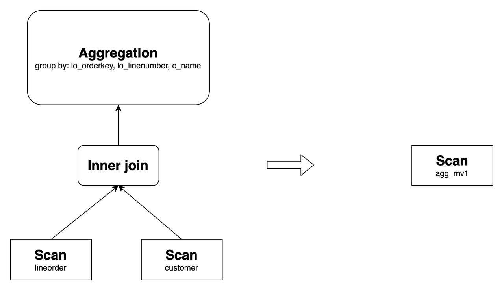
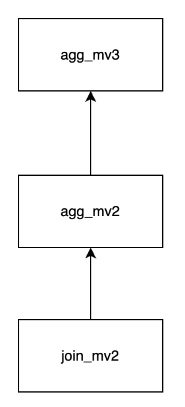
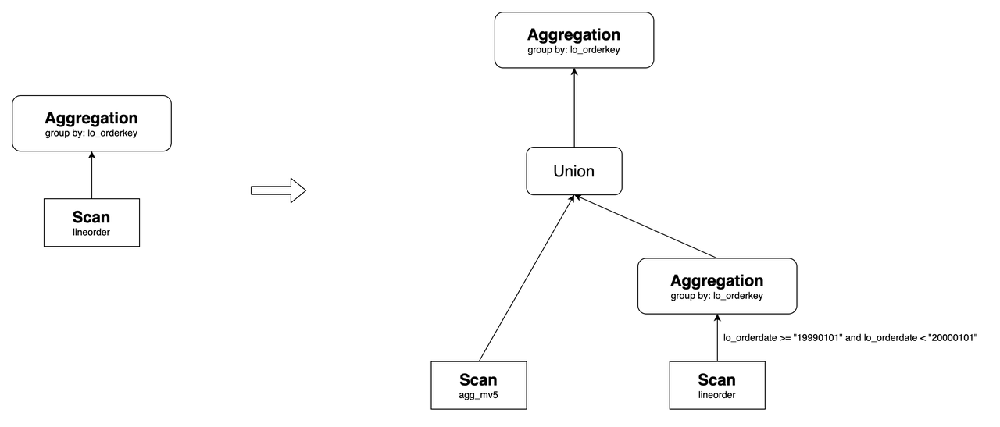

# マテリアライズドビューによるクエリの書き換え

このトピックでは、StarRocks の非同期マテリアライズドビューを活用してクエリを自動的に書き換え、クエリを高速化する方法について説明します。

## 概要

StarRocks の非同期マテリアライズドビューは、SPJG（select-project-join-group-by）形式に基づく広く採用されている透明なクエリの書き換えアルゴリズムを使用しています。クエリ文を修正することなく、StarRocks はベーステーブルに対するクエリを、事前に計算された結果を含む対応するマテリアライズドビューに対するクエリに自動的に書き換えることができます。その結果、マテリアライズドビューは計算コストを大幅に削減し、クエリの実行を大幅に高速化するのに役立ちます。

非同期マテリアライズドビューに基づくクエリの書き換え機能は、特に以下のシナリオで有用です。

- **メトリクスの事前集計**

  高次元のデータを扱う場合、マテリアライズドビューを使用して事前集計されたメトリクス層を作成できます。

- **広いテーブルのジョイン**

  マテリアライズドビューを使用すると、複数の大規模な広いテーブルのジョインを含む複雑なシナリオでクエリを透明に高速化できます。

- **データレイクでのクエリアクセラレーション**

  external catalog に基づくマテリアライズドビューを構築することで、データレイク内のデータに対するクエリを簡単に高速化できます。

  > **注意**
  >
  > JDBC カタログのベーステーブルに作成された非同期マテリアライズドビューはクエリの書き換えをサポートしていません。

### 特徴

StarRocks の非同期マテリアライズドビューに基づく自動クエリの書き換えは、以下の属性を備えています。

- **強力なデータ整合性**: ベーステーブルが内部テーブルである場合、StarRocks はマテリアライズドビューに基づくクエリの書き換えによって得られる結果が、ベーステーブルに対する直接クエリから返される結果と一致することを保証します。
- **古さの書き換え**: StarRocks は古さの書き換えをサポートしており、頻繁なデータ変更があるシナリオに対応するために一定のデータの期限切れを許容できます。
- **複数テーブルのジョイン**: StarRocks の非同期マテリアライズドビューは、View Delta Joins や Derivable Joins などの複雑なジョインシナリオを含むさまざまなタイプのジョインをサポートしており、大規模な広いテーブルを含むシナリオでクエリを高速化できます。
- **集計の書き換え**: StarRocks は集計を含むクエリを再書き換えして、レポートのパフォーマンスを向上させることができます。
- **ネストされたマテリアライズドビュー**: StarRocks はネストされたマテリアライズドビューに基づく複雑なクエリの書き換えをサポートし、書き換え可能なクエリの範囲を拡大します。
- **Union の書き換え**: マテリアライズドビューのパーティションの TTL（Time-to-Live）と組み合わせて Union の書き換え機能を使用することで、ホットデータとコールドデータの分離を実現し、マテリアライズドビューからホットデータを、ベーステーブルから履歴データをクエリできます。
- **ビューに基づくマテリアライズドビュー**: ビューに基づくデータモデリングのシナリオでクエリを高速化できます。
- **external catalog に基づくマテリアライズドビュー**: データレイクでクエリを高速化できます。
- **複雑な式の書き換え**: 関数呼び出しや算術演算を含む複雑な式を処理でき、高度な分析および計算要件に対応します。

これらの特徴は、以下のセクションで詳しく説明します。

## ジョインの書き換え

StarRocks は、Inner Join、Cross Join、Left Outer Join、Full Outer Join、Right Outer Join、Semi Join、Anti Join を含むさまざまなタイプのジョインを含むクエリの書き換えをサポートしています。

以下は、ジョインを含むクエリの書き換えの例です。次のように 2 つのベーステーブルを作成します。

```SQL
CREATE TABLE customer (
  c_custkey     INT(11)     NOT NULL,
  c_name        VARCHAR(26) NOT NULL,
  c_address     VARCHAR(41) NOT NULL,
  c_city        VARCHAR(11) NOT NULL,
  c_nation      VARCHAR(16) NOT NULL,
  c_region      VARCHAR(13) NOT NULL,
  c_phone       VARCHAR(16) NOT NULL,
  c_mktsegment  VARCHAR(11) NOT NULL
) ENGINE=OLAP
DUPLICATE KEY(c_custkey)
DISTRIBUTED BY HASH(c_custkey) BUCKETS 12;

CREATE TABLE lineorder (
  lo_orderkey         INT(11) NOT NULL,
  lo_linenumber       INT(11) NOT NULL,
  lo_custkey          INT(11) NOT NULL,
  lo_partkey          INT(11) NOT NULL,
  lo_suppkey          INT(11) NOT NULL,
  lo_orderdate        INT(11) NOT NULL,
  lo_orderpriority    VARCHAR(16) NOT NULL,
  lo_shippriority     INT(11) NOT NULL,
  lo_quantity         INT(11) NOT NULL,
  lo_extendedprice    INT(11) NOT NULL,
  lo_ordtotalprice    INT(11) NOT NULL,
  lo_discount         INT(11) NOT NULL,
  lo_revenue          INT(11) NOT NULL,
  lo_supplycost       INT(11) NOT NULL,
  lo_tax              INT(11) NOT NULL,
  lo_commitdate       INT(11) NOT NULL,
  lo_shipmode         VARCHAR(11) NOT NULL
) ENGINE=OLAP
DUPLICATE KEY(lo_orderkey)
DISTRIBUTED BY HASH(lo_orderkey) BUCKETS 48;
```

上記のベーステーブルを使用して、次のようにマテリアライズドビューを作成できます。

```SQL
CREATE MATERIALIZED VIEW join_mv1
DISTRIBUTED BY HASH(lo_orderkey)
AS
SELECT lo_orderkey, lo_linenumber, lo_revenue, lo_partkey, c_name, c_address
FROM lineorder INNER JOIN customer
ON lo_custkey = c_custkey;
```

このようなマテリアライズドビューは、次のクエリを再書き換えできます。

```SQL
SELECT lo_orderkey, lo_linenumber, lo_revenue, c_name, c_address
FROM lineorder INNER JOIN customer
ON lo_custkey = c_custkey;
```


StarRocks は、算術演算、文字列関数、日付関数、CASE WHEN 式、OR 述語などの複雑な式を含むジョインクエリの書き換えをサポートしています。たとえば、上記のマテリアライズドビューは次のクエリを再書き換えできます。

```SQL
SELECT 
    lo_orderkey, 
    lo_linenumber, 
    (2 * lo_revenue + 1) * lo_linenumber, 
    upper(c_name), 
    substr(c_address, 3)
FROM lineorder INNER JOIN customer
ON lo_custkey = c_custkey;
```

従来のシナリオに加えて、StarRocks はさらに複雑なシナリオでのジョインクエリの書き換えをサポートしています。

### Query Delta Join の書き換え

Query Delta Join は、クエリでジョインされるテーブルがマテリアライズドビューでジョインされるテーブルのスーパーセットであるシナリオを指します。たとえば、`lineorder`、`customer`、`part` の 3 つのテーブルのジョインを含む次のクエリを考えてみましょう。マテリアライズドビュー `join_mv1` が `lineorder` と `customer` のジョインのみを含んでいる場合、StarRocks は `join_mv1` を使用してクエリを書き換えることができます。

例:

```SQL
SELECT lo_orderkey, lo_linenumber, lo_revenue, c_name, c_address, p_name
FROM
    lineorder INNER JOIN customer ON lo_custkey = c_custkey
    INNER JOIN part ON lo_partkey = p_partkey;
```

その元のクエリプランと書き換え後のものは次のとおりです。


### View Delta Join の書き換え

View Delta Join は、クエリでジョインされるテーブルがマテリアライズドビューでジョインされるテーブルのサブセットであるシナリオを指します。この機能は、通常、大規模な広いテーブルを含むシナリオで使用されます。たとえば、Star Schema Benchmark (SSB) のコンテキストでは、すべてのテーブルをジョインするマテリアライズドビューを作成してクエリパフォーマンスを向上させることができます。テストを通じて、マテリアライズドビューを通じてクエリを透明に書き換えることで、複数テーブルのジョインのクエリパフォーマンスが対応する大規模な広いテーブルをクエリするのと同じレベルのパフォーマンスを達成できることがわかっています。

View Delta Join の書き換えを実行するには、マテリアライズドビューがクエリに存在しない 1:1 カーディナリティ保存ジョインを含んでいる必要があります。以下の 9 種類のジョインがカーディナリティ保存ジョインと見なされ、いずれかを満たすと View Delta Join の書き換えが可能です。


SSB テストを例にとり、次のベーステーブルを作成します。

```SQL
CREATE TABLE customer (
  c_custkey         INT(11)       NOT NULL,
  c_name            VARCHAR(26)   NOT NULL,
  c_address         VARCHAR(41)   NOT NULL,
  c_city            VARCHAR(11)   NOT NULL,
  c_nation          VARCHAR(16)   NOT NULL,
  c_region          VARCHAR(13)   NOT NULL,
  c_phone           VARCHAR(16)   NOT NULL,
  c_mktsegment      VARCHAR(11)   NOT NULL
) ENGINE=OLAP
DUPLICATE KEY(c_custkey)
DISTRIBUTED BY HASH(c_custkey) BUCKETS 12
PROPERTIES (
"unique_constraints" = "c_custkey"   -- 一意制約を指定します。
);

CREATE TABLE dates (
  d_datekey          DATE          NOT NULL,
  d_date             VARCHAR(20)   NOT NULL,
  d_dayofweek        VARCHAR(10)   NOT NULL,
  d_month            VARCHAR(11)   NOT NULL,
  d_year             INT(11)       NOT NULL,
  d_yearmonthnum     INT(11)       NOT NULL,
  d_yearmonth        VARCHAR(9)    NOT NULL,
  d_daynuminweek     INT(11)       NOT NULL,
  d_daynuminmonth    INT(11)       NOT NULL,
  d_daynuminyear     INT(11)       NOT NULL,
  d_monthnuminyear   INT(11)       NOT NULL,
  d_weeknuminyear    INT(11)       NOT NULL,
  d_sellingseason    VARCHAR(14)   NOT NULL,
  d_lastdayinweekfl  INT(11)       NOT NULL,
  d_lastdayinmonthfl INT(11)       NOT NULL,
  d_holidayfl        INT(11)       NOT NULL,
  d_weekdayfl        INT(11)       NOT NULL
) ENGINE=OLAP
DUPLICATE KEY(d_datekey)
DISTRIBUTED BY HASH(d_datekey) BUCKETS 1
PROPERTIES (
"unique_constraints" = "d_datekey"   -- 一意制約を指定します。
);

CREATE TABLE supplier (
  s_suppkey          INT(11)       NOT NULL,
  s_name             VARCHAR(26)   NOT NULL,
  s_address          VARCHAR(26)   NOT NULL,
  s_city             VARCHAR(11)   NOT NULL,
  s_nation           VARCHAR(16)   NOT NULL,
  s_region           VARCHAR(13)   NOT NULL,
  s_phone            VARCHAR(16)   NOT NULL
) ENGINE=OLAP
DUPLICATE KEY(s_suppkey)
DISTRIBUTED BY HASH(s_suppkey) BUCKETS 12
PROPERTIES (
"unique_constraints" = "s_suppkey"   -- 一意制約を指定します。
);

CREATE TABLE part (
  p_partkey          INT(11)       NOT NULL,
  p_name             VARCHAR(23)   NOT NULL,
  p_mfgr             VARCHAR(7)    NOT NULL,
  p_category         VARCHAR(8)    NOT NULL,
  p_brand            VARCHAR(10)   NOT NULL,
  p_color            VARCHAR(12)   NOT NULL,
  p_type             VARCHAR(26)   NOT NULL,
  p_size             TINYINT(11)   NOT NULL,
  p_container        VARCHAR(11)   NOT NULL
) ENGINE=OLAP
DUPLICATE KEY(p_partkey)
DISTRIBUTED BY HASH(p_partkey) BUCKETS 12
PROPERTIES (
"unique_constraints" = "p_partkey"   -- 一意制約を指定します。
);

CREATE TABLE lineorder (
  lo_orderdate       DATE          NOT NULL, -- NOT NULL として指定します。
  lo_orderkey        INT(11)       NOT NULL,
  lo_linenumber      TINYINT       NOT NULL,
  lo_custkey         INT(11)       NOT NULL, -- NOT NULL として指定します。
  lo_partkey         INT(11)       NOT NULL, -- NOT NULL として指定します。
  lo_suppkey         INT(11)       NOT NULL, -- NOT NULL として指定します。
  lo_orderpriority   VARCHAR(100)  NOT NULL,
  lo_shippriority    TINYINT       NOT NULL,
  lo_quantity        TINYINT       NOT NULL,
  lo_extendedprice   INT(11)       NOT NULL,
  lo_ordtotalprice   INT(11)       NOT NULL,
  lo_discount        TINYINT       NOT NULL,
  lo_revenue         INT(11)       NOT NULL,
  lo_supplycost      INT(11)       NOT NULL,
  lo_tax             TINYINT       NOT NULL,
  lo_commitdate      DATE          NOT NULL,
  lo_shipmode        VARCHAR(100)  NOT NULL
) ENGINE=OLAP
DUPLICATE KEY(lo_orderdate,lo_orderkey)
PARTITION BY RANGE(lo_orderdate)
(PARTITION p1 VALUES [("0000-01-01"), ("1993-01-01")),
PARTITION p2 VALUES [("1993-01-01"), ("1994-01-01")),
PARTITION p3 VALUES [("1994-01-01"), ("1995-01-01")),
PARTITION p4 VALUES [("1995-01-01"), ("1996-01-01")),
PARTITION p5 VALUES [("1996-01-01"), ("1997-01-01")),
PARTITION p6 VALUES [("1997-01-01"), ("1998-01-01")),
PARTITION p7 VALUES [("1998-01-01"), ("1999-01-01")))
DISTRIBUTED BY HASH(lo_orderkey) BUCKETS 48
PROPERTIES (
"foreign_key_constraints" = "
    (lo_custkey) REFERENCES customer(c_custkey);
    (lo_partkey) REFERENCES part(p_partkey);
    (lo_suppkey) REFERENCES supplier(s_suppkey)" -- 外部キーを指定します。
);
```

`lineorder`、`customer`、`supplier`、`part`、`dates` をジョインするマテリアライズドビュー `lineorder_flat_mv` を作成します。

```SQL
CREATE MATERIALIZED VIEW lineorder_flat_mv
DISTRIBUTED BY HASH(LO_ORDERDATE, LO_ORDERKEY) BUCKETS 48
PARTITION BY LO_ORDERDATE
REFRESH MANUAL
PROPERTIES (
    "partition_refresh_number"="1"
)
AS SELECT /*+ SET_VAR(query_timeout = 7200) */     -- リフレッシュ操作のタイムアウトを設定します。
       l.LO_ORDERDATE        AS LO_ORDERDATE,
       l.LO_ORDERKEY         AS LO_ORDERKEY,
       l.LO_LINENUMBER       AS LO_LINENUMBER,
       l.LO_CUSTKEY          AS LO_CUSTKEY,
       l.LO_PARTKEY          AS LO_PARTKEY,
       l.LO_SUPPKEY          AS LO_SUPPKEY,
       l.LO_ORDERPRIORITY    AS LO_ORDERPRIORITY,
       l.LO_SHIPPRIORITY     AS LO_SHIPPRIORITY,
       l.LO_QUANTITY         AS LO_QUANTITY,
       l.LO_EXTENDEDPRICE    AS LO_EXTENDEDPRICE,
       l.LO_ORDTOTALPRICE    AS LO_ORDTOTALPRICE,
       l.LO_DISCOUNT         AS LO_DISCOUNT,
       l.LO_REVENUE          AS LO_REVENUE,
       l.LO_SUPPLYCOST       AS LO_SUPPLYCOST,
       l.LO_TAX              AS LO_TAX,
       l.LO_COMMITDATE       AS LO_COMMITDATE,
       l.LO_SHIPMODE         AS LO_SHIPMODE,
       c.C_NAME              AS C_NAME,
       c.C_ADDRESS           AS C_ADDRESS,
       c.C_CITY              AS C_CITY,
       c.C_NATION            AS C_NATION,
       c.C_REGION            AS C_REGION,
       c.C_PHONE             AS C_PHONE,
       c.C_MKTSEGMENT        AS C_MKTSEGMENT,
       s.S_NAME              AS S_NAME,
       s.S_ADDRESS           AS S_ADDRESS,
       s.S_CITY              AS S_CITY,
       s.S_NATION            AS S_NATION,
       s.S_REGION            AS S_REGION,
       s.S_PHONE             AS S_PHONE,
       p.P_NAME              AS P_NAME,
       p.P_MFGR              AS P_MFGR,
       p.P_CATEGORY          AS P_CATEGORY,
       p.P_BRAND             AS P_BRAND,
       p.P_COLOR             AS P_COLOR,
       p.P_TYPE              AS P_TYPE,
       p.P_SIZE              AS P_SIZE,
       p.P_CONTAINER         AS P_CONTAINER,
       d.D_DATE              AS D_DATE,
       d.D_DAYOFWEEK         AS D_DAYOFWEEK,
       d.D_MONTH             AS D_MONTH,
       d.D_YEAR              AS D_YEAR,
       d.D_YEARMONTHNUM      AS D_YEARMONTHNUM,
       d.D_YEARMONTH         AS D_YEARMONTH,
       d.D_DAYNUMINWEEK      AS D_DAYNUMINWEEK,
       d.D_DAYNUMINMONTH     AS D_DAYNUMINMONTH,
       d.D_DAYNUMINYEAR      AS D_DAYNUMINYEAR,
       d.D_MONTHNUMINYEAR    AS D_MONTHNUMINYEAR,
       d.D_WEEKNUMINYEAR     AS D_WEEKNUMINYEAR,
       d.D_SELLINGSEASON     AS D_SELLINGSEASON,
       d.D_LASTDAYINWEEKFL   AS D_LASTDAYINWEEKFL,
       d.D_LASTDAYINMONTHFL  AS D_LASTDAYINMONTHFL,
       d.D_HOLIDAYFL         AS D_HOLIDAYFL,
       d.D_WEEKDAYFL         AS D_WEEKDAYFL
   FROM lineorder            AS l
       INNER JOIN customer   AS c ON c.C_CUSTKEY = l.LO_CUSTKEY
       INNER JOIN supplier   AS s ON s.S_SUPPKEY = l.LO_SUPPKEY
       INNER JOIN part       AS p ON p.P_PARTKEY = l.LO_PARTKEY
       INNER JOIN dates      AS d ON l.LO_ORDERDATE = d.D_DATEKEY;    
```

SSB Q2.1 は 4 つのテーブルをジョインしますが、マテリアライズドビュー `lineorder_flat_mv` と比較して `customer` テーブルが欠けています。`lineorder_flat_mv` では、`lineorder INNER JOIN customer` は本質的にカーディナリティ保存ジョインです。したがって、論理的には、このジョインを削除してもクエリ結果に影響を与えません。その結果、Q2.1 は `lineorder_flat_mv` を使用して書き換えることができます。

SSB Q2.1:

```SQL
SELECT sum(lo_revenue) AS lo_revenue, d_year, p_brand
FROM lineorder
JOIN dates ON lo_orderdate = d_datekey
JOIN part ON lo_partkey = p_partkey
JOIN supplier ON lo_suppkey = s_suppkey
WHERE p_category = 'MFGR#12' AND s_region = 'AMERICA'
GROUP BY d_year, p_brand
ORDER BY d_year, p_brand;
```

その元のクエリプランと書き換え後のものは次のとおりです。


同様に、SSB の他のクエリも `lineorder_flat_mv` を使用して透明に書き換えられ、クエリパフォーマンスが最適化されます。

### Join Derivability の書き換え

Join Derivability は、マテリアライズドビューとクエリのジョインタイプが一致しないが、マテリアライズドビューのジョイン結果がクエリのジョイン結果を含むシナリオを指します。現在、3 つ以上のテーブルをジョインするシナリオと 2 つのテーブルをジョインするシナリオの 2 つのシナリオをサポートしています。

- **シナリオ 1: 3 つ以上のテーブルをジョインする場合**

  マテリアライズドビューが `t1` と `t2` の Left Outer Join と `t2` と `t3` の Inner Join を含んでいると仮定します。両方のジョインで、ジョイン条件には `t2` の列が含まれます。

  一方、クエリには `t1` と `t2` の Inner Join と `t2` と `t3` の Inner Join が含まれます。両方のジョインで、ジョイン条件には `t2` の列が含まれます。

  この場合、クエリはマテリアライズドビューを使用して書き換えることができます。これは、マテリアライズドビューでは、Left Outer Join が最初に実行され、その後に Inner Join が続くためです。Left Outer Join によって生成された右テーブルには、マッチングの結果がありません（つまり、右テーブルの列は NULL です）。これらの結果は、Inner Join の際にフィルタリングされます。したがって、マテリアライズドビューとクエリのロジックは等価であり、クエリは書き換えることができます。

  例:

  マテリアライズドビュー `join_mv5` を作成します。

  ```SQL
  CREATE MATERIALIZED VIEW join_mv5
  PARTITION BY lo_orderdate
  DISTRIBUTED BY hash(lo_orderkey)
  PROPERTIES (
    "partition_refresh_number" = "1"
  )
  AS
  SELECT lo_orderkey, lo_orderdate, lo_linenumber, lo_revenue, c_custkey, c_address, p_name
  FROM customer LEFT OUTER JOIN lineorder
  ON c_custkey = lo_custkey
  INNER JOIN part
  ON p_partkey = lo_partkey;
  ```

  `join_mv5` は次のクエリを再書き換えできます。

  ```SQL
  SELECT lo_orderkey, lo_orderdate, lo_linenumber, lo_revenue, c_custkey, c_address, p_name
  FROM customer INNER JOIN lineorder
  ON c_custkey = lo_custkey
  INNER JOIN part
  ON p_partkey = lo_partkey;
  ```

  その元のクエリプランと書き換え後のものは次のとおりです。

  

  同様に、マテリアライズドビューが `t1 INNER JOIN t2 INNER JOIN t3` と定義され、クエリが `LEFT OUTER JOIN t2 INNER JOIN t3` の場合も、クエリは書き換えることができます。さらに、この書き換え機能は 3 つ以上のテーブルを含むシナリオにも拡張されます。

- **シナリオ 2: 2 つのテーブルをジョインする場合**

  2 つのテーブルを含む Join Derivability の書き換え機能は、次の特定のケースをサポートします。

  

  ケース 1 から 9 では、書き換え結果にフィルタリング述語を追加して意味的等価性を確保する必要があります。たとえば、次のようにマテリアライズドビューを作成します。

  ```SQL
  CREATE MATERIALIZED VIEW join_mv3
  DISTRIBUTED BY hash(lo_orderkey)
  AS
  SELECT lo_orderkey, lo_linenumber, lo_revenue, c_custkey, c_address
  FROM lineorder LEFT OUTER JOIN customer
  ON lo_custkey = c_custkey;
  ```

  次のクエリは `join_mv3` を使用して書き換えることができ、書き換え結果に述語 `c_custkey IS NOT NULL` が追加されます。

  ```SQL
  SELECT lo_orderkey, lo_linenumber, lo_revenue, c_custkey, c_address
  FROM lineorder INNER JOIN customer
  ON lo_custkey = c_custkey;
  ```

  その元のクエリプランと書き換え後のものは次のとおりです。

  

  ケース 10 では、Left Outer Join クエリには右テーブルに `IS NOT NULL` のフィルタリング述語が含まれている必要があります。たとえば、`=`, `<>`, `>`, `<`, `<=`, `>=`, `LIKE`, `IN`, `NOT LIKE`, または `NOT IN` です。たとえば、次のようにマテリアライズドビューを作成します。

  ```SQL
  CREATE MATERIALIZED VIEW join_mv4
  DISTRIBUTED BY hash(lo_orderkey)
  AS
  SELECT lo_orderkey, lo_linenumber, lo_revenue, c_custkey, c_address
  FROM lineorder INNER JOIN customer
  ON lo_custkey = c_custkey;
  ```

  `join_mv4` は次のクエリを再書き換えでき、`customer.c_address = "Sb4gxKs7"` は `IS NOT NULL` のフィルタリング述語です。

  ```SQL
  SELECT lo_orderkey, lo_linenumber, lo_revenue, c_custkey, c_address
  FROM lineorder LEFT OUTER JOIN customer
  ON lo_custkey = c_custkey
  WHERE customer.c_address = "Sb4gxKs7";
  ```

  その元のクエリプランと書き換え後のものは次のとおりです。

  

## 集計の書き換え

StarRocks の非同期マテリアライズドビューは、bitmap_union、hll_union、percentile_union を含むすべての集計関数を使用して、複数テーブルの集計クエリを再書き換えできます。たとえば、次のようにマテリアライズドビューを作成します。

```SQL
CREATE MATERIALIZED VIEW agg_mv1
DISTRIBUTED BY hash(lo_orderkey)
AS
SELECT 
  lo_orderkey, 
  lo_linenumber, 
  c_name, 
  sum(lo_revenue) AS total_revenue, 
  max(lo_discount) AS max_discount 
FROM lineorder INNER JOIN customer
ON lo_custkey = c_custkey
GROUP BY lo_orderkey, lo_linenumber, c_name;
```

次のクエリを再書き換えできます。

```SQL
SELECT 
  lo_orderkey, 
  lo_linenumber, 
  c_name, 
  sum(lo_revenue) AS total_revenue, 
  max(lo_discount) AS max_discount 
FROM lineorder INNER JOIN customer
ON lo_custkey = c_custkey
GROUP BY lo_orderkey, lo_linenumber, c_name;
```

その元のクエリプランと書き換え後のものは次のとおりです。



以下のセクションでは、集計の書き換え機能が有用なシナリオについて詳しく説明します。

### 集計ロールアップの書き換え

StarRocks は集計ロールアップを使用したクエリの書き換えをサポートしています。つまり、StarRocks は `GROUP BY a,b` 句で作成された非同期マテリアライズドビューを使用して、`GROUP BY a` 句を持つ集計クエリを再書き換えできます。たとえば、次のクエリは `agg_mv1` を使用して書き換えることができます。

```SQL
SELECT 
  lo_orderkey, 
  c_name, 
  sum(lo_revenue) AS total_revenue, 
  max(lo_discount) AS max_discount 
FROM lineorder INNER JOIN customer
ON lo_custkey = c_custkey
GROUP BY lo_orderkey, c_name;
```

その元のクエリプランと書き換え後のものは次のとおりです。


> **注意**
>
> 現在、グループセット、ロールアップ付きグループセット、またはキューブ付きグループセットの書き換えはサポートされていません。

特定の集計関数のみが集計ロールアップを使用したクエリの書き換えをサポートしています。前述の例では、マテリアライズドビュー `order_agg_mv` が `bitmap_union(to_bitmap(client_id))` の代わりに `count(distinct client_id)` を使用している場合、StarRocks は集計ロールアップを使用したクエリの書き換えを行うことができません。

次の表は、元のクエリの集計関数とマテリアライズドビューを構築するために使用される集計関数の対応を示しています。ビジネスシナリオに応じて、対応する集計関数を選択してマテリアライズドビューを構築できます。

| **元のクエリでサポートされる集計関数**   | **マテリアライズドビューで集計ロールアップをサポートする関数** |
| ------------------------------------------------------ | ------------------------------------------------------------ |
| sum                                                    | sum                                                          |
| count                                                  | count                                                        |
| min                                                    | min                                                          |
| max                                                    | max                                                          |
| avg                                                    | sum / count                                                  |
| bitmap_union, bitmap_union_count, count(distinct)      | bitmap_union                                                 |
| hll_raw_agg, hll_union_agg, ndv, approx_count_distinct | hll_union                                                    |
| percentile_approx, percentile_union                    | percentile_union                                             |

DISTINCT 集計は、対応する GROUP BY 列がない場合、集計ロールアップを使用して書き換えることはできません。ただし、StarRocks v3.1 以降、集計ロールアップ DISTINCT 集計関数を持つクエリに GROUP BY 列がなくても、等価述語がある場合、StarRocks は等価述語を GROUP BY 定数式に変換できるため、関連するマテリアライズドビューによっても書き換えることができます。

次の例では、StarRocks はマテリアライズドビュー `order_agg_mv1` を使用してクエリを再書き換えることができます。

```SQL
CREATE MATERIALIZED VIEW order_agg_mv1
DISTRIBUTED BY HASH(`order_id`) BUCKETS 12
REFRESH ASYNC START('2022-09-01 10:00:00') EVERY (interval 1 day)
AS
SELECT
    order_date,
    count(distinct client_id) 
FROM order_list 
GROUP BY order_date;


-- クエリ
SELECT
    order_date,
    count(distinct client_id) 
FROM order_list WHERE order_date='2023-07-03';
```

### COUNT DISTINCT の書き換え

StarRocks は COUNT DISTINCT 計算をビットマップベースの計算に書き換えることをサポートしており、マテリアライズドビューを使用して高性能で正確な重複排除を実現します。たとえば、次のようにマテリアライズドビューを作成します。

```SQL
CREATE MATERIALIZED VIEW distinct_mv
DISTRIBUTED BY hash(lo_orderkey)
AS
SELECT lo_orderkey, bitmap_union(to_bitmap(lo_custkey)) AS distinct_customer
FROM lineorder
GROUP BY lo_orderkey;
```

次のクエリを再書き換えできます。

```SQL
SELECT lo_orderkey, count(distinct lo_custkey) 
FROM lineorder 
GROUP BY lo_orderkey;
```

## ネストされたマテリアライズドビューの書き換え

StarRocks はネストされたマテリアライズドビューを使用してクエリを再書き換えることをサポートしています。たとえば、次のようにマテリアライズドビュー `join_mv2`、`agg_mv2`、`agg_mv3` を作成します。

```SQL
CREATE MATERIALIZED VIEW join_mv2
DISTRIBUTED BY hash(lo_orderkey)
AS
SELECT lo_orderkey, lo_linenumber, lo_revenue, c_name, c_address
FROM lineorder INNER JOIN customer
ON lo_custkey = c_custkey;


CREATE MATERIALIZED VIEW agg_mv2
DISTRIBUTED BY hash(lo_orderkey)
AS
SELECT 
  lo_orderkey, 
  lo_linenumber, 
  c_name, 
  sum(lo_revenue) AS total_revenue, 
  max(lo_discount) AS max_discount 
FROM join_mv2
GROUP BY lo_orderkey, lo_linenumber, c_name;

CREATE MATERIALIZED VIEW agg_mv3
DISTRIBUTED BY hash(lo_orderkey)
AS
SELECT 
  lo_orderkey, 
  sum(total_revenue) AS total_revenue, 
  max(max_discount) AS max_discount 
FROM agg_mv2
GROUP BY lo_orderkey;
```

それらの関係は次のとおりです。



`agg_mv3` は次のクエリを再書き換えできます。

```SQL
SELECT 
  lo_orderkey, 
  sum(lo_revenue) AS total_revenue, 
  max(lo_discount) AS max_discount 
FROM lineorder INNER JOIN customer
ON lo_custkey = c_custkey
GROUP BY lo_orderkey;
```

その元のクエリプランと書き換え後のものは次のとおりです。


## Union の書き換え

### プレディケート Union の書き換え

マテリアライズドビューのプレディケート範囲がクエリのプレディケート範囲のサブセットである場合、クエリは UNION 操作を使用して書き換えることができます。

たとえば、次のようにマテリアライズドビューを作成します。

```SQL
CREATE MATERIALIZED VIEW agg_mv4
DISTRIBUTED BY hash(lo_orderkey)
AS
SELECT 
  lo_orderkey, 
  sum(lo_revenue) AS total_revenue, 
  max(lo_discount) AS max_discount 
FROM lineorder
WHERE lo_orderkey < 300000000
GROUP BY lo_orderkey;
```

次のクエリを再書き換えできます。

```SQL
select 
  lo_orderkey, 
  sum(lo_revenue) AS total_revenue, 
  max(lo_discount) AS max_discount 
FROM lineorder
GROUP BY lo_orderkey;
```

その元のクエリプランと書き換え後のものは次のとおりです。


このコンテキストでは、`agg_mv5` は `lo_orderkey < 300000000` のデータを含んでいます。`lo_orderkey >= 300000000` のデータはベーステーブル `lineorder` から直接取得されます。最後に、これら 2 つのデータセットは UNION 操作を使用して結合され、最終結果を取得します。

### パーティション Union の書き換え

パーティション化されたテーブルに基づいてパーティション化されたマテリアライズドビューを作成したと仮定します。書き換え可能なクエリがスキャンするパーティション範囲がマテリアライズドビューの最新のパーティション範囲のスーパーセットである場合、クエリは UNION 操作を使用して書き換えられます。

たとえば、次のマテリアライズドビュー `agg_mv4` を考えてみましょう。そのベーステーブル `lineorder` は現在 `p1` から `p7` までのパーティションを含んでおり、マテリアライズドビューも `p1` から `p7` までのパーティションを含んでいます。

```SQL
CREATE MATERIALIZED VIEW agg_mv5
DISTRIBUTED BY hash(lo_orderkey)
PARTITION BY RANGE(lo_orderdate)
REFRESH MANUAL
AS
SELECT 
  lo_orderdate, 
  lo_orderkey, 
  sum(lo_revenue) AS total_revenue, 
  max(lo_discount) AS max_discount 
FROM lineorder
GROUP BY lo_orderkey;
```

新しいパーティション `p8` が `lineorder` に追加され、そのパーティション範囲が `[("19990101"), ("20000101"))` である場合、次のクエリは UNION 操作を使用して書き換えることができます。

```SQL
SELECT 
  lo_orderdate, 
  lo_orderkey, 
  sum(lo_revenue) AS total_revenue, 
  max(lo_discount) AS max_discount 
FROM lineorder
GROUP BY lo_orderkey;
```

その元のクエリプランと書き換え後のものは次のとおりです。



上記のように、`agg_mv5` は `p1` から `p7` までのデータを含んでおり、`p8` のデータは `lineorder` から直接クエリされます。最後に、これら 2 つのデータセットは UNION 操作を使用して結合されます。

## ビューに基づくマテリアライズドビューの書き換え

StarRocks はビューに基づくマテリアライズドビューの作成をサポートしています。その後、ビューに対するクエリは透明に書き換えられます。

たとえば、次のビューを作成します。

```SQL
CREATE VIEW customer_view1 
AS
SELECT c_custkey, c_name, c_address
FROM customer;

CREATE VIEW lineorder_view1
AS
SELECT lo_orderkey, lo_linenumber, lo_custkey, lo_revenue
FROM lineorder;
```

次に、ビューに基づいて次のマテリアライズドビューを作成します。

```SQL
CREATE MATERIALIZED VIEW join_mv1
DISTRIBUTED BY hash(lo_orderkey)
AS
SELECT lo_orderkey, lo_linenumber, lo_revenue, c_name
FROM lineorder_view1 INNER JOIN customer_view1
ON lo_custkey = c_custkey;
```

クエリの書き換え中に、`customer_view1` および `lineorder_view1` に対するクエリは自動的にベーステーブルに展開され、その後透明にマッチングおよび書き換えされます。

## external catalog に基づくマテリアライズドビューの書き換え

StarRocks は Hive カタログ、Hudi カタログ、Iceberg カタログ、および Paimon カタログに基づいて非同期マテリアライズドビューを構築し、それらを使用してクエリを透明に書き換えることをサポートしています。

## クエリの書き換えを設定する

非同期マテリアライズドビューのクエリの書き換えは、次のセッション変数を使用して設定できます。

| **変数**                                | **デフォルト** | **説明**                                              |
| ------------------------------------------- | ----------- | ------------------------------------------------------------ |
| enable_materialized_view_union_rewrite      | true        | マテリアライズドビューの Union クエリの書き換えを有効にするかどうかを制御するブール値。 |
| enable_rule_based_materialized_view_rewrite | true        | ルールベースのマテリアライズドビューのクエリの書き換えを有効にするかどうかを制御するブール値。この変数は主に単一テーブルのクエリの書き換えに使用されます。 |
| nested_mv_rewrite_max_level                 | 3           | クエリの書き換えに使用できるネストされたマテリアライズドビューの最大レベル。タイプ: INT。範囲: [1, +∞)。値が `1` の場合、他のマテリアライズドビューに作成されたマテリアライズドビューはクエリの書き換えに使用されません。 |

## クエリが書き換えられたかどうかを確認する

クエリプランを表示する EXPLAIN ステートメントを使用して、クエリが書き換えられたかどうかを確認できます。`OlapScanNode` セクションの `TABLE` フィールドに対応するマテリアライズドビューの名前が表示されている場合、それはクエリがマテリアライズドビューに基づいて書き換えられたことを意味します。

```Plain
mysql> EXPLAIN SELECT 
    order_id, sum(goods.price) AS total 
    FROM order_list INNER JOIN goods 
    ON goods.item_id1 = order_list.item_id2 
    GROUP BY order_id;
+------------------------------------+
| Explain String                     |
+------------------------------------+
| PLAN FRAGMENT 0                    |
|  OUTPUT EXPRS:1: order_id | 8: sum |
|   PARTITION: RANDOM                |
|                                    |
|   RESULT SINK                      |
|                                    |
|   1:Project                        |
|   |  <slot 1> : 9: order_id        |
|   |  <slot 8> : 10: total          |
|   |                                |
|   0:OlapScanNode                   |
|      TABLE: order_mv               |
|      PREAGGREGATION: ON            |
|      partitions=1/1                |
|      rollup: order_mv              |
|      tabletRatio=0/12              |
|      tabletList=                   |
|      cardinality=3                 |
|      avgRowSize=4.0                |
|      numNodes=0                    |
+------------------------------------+
20 rows in set (0.01 sec)
```

## クエリの書き換えを無効にする

デフォルトでは、StarRocks はデフォルトカタログに基づいて作成された非同期マテリアライズドビューのクエリの書き換えを有効にしています。この機能を無効にするには、セッション変数 `enable_materialized_view_rewrite` を `false` に設定します。

external catalog に基づいて作成された非同期マテリアライズドビューの場合、この機能を無効にするには、[ALTER MATERIALIZED VIEW](../../../sql-reference/sql-statements/materialized_view/ALTER_MATERIALIZED_VIEW.md) を使用してマテリアライズドビューのプロパティ `force_external_table_query_rewrite` を `false` に設定します。

## 制限事項

マテリアライズドビューに基づくクエリの書き換えに関して、StarRocks には現在次の制限があります。

- StarRocks は、rand、random、uuid、sleep を含む非決定的な関数を使用したクエリの書き換えをサポートしていません。
- StarRocks はウィンドウ関数を使用したクエリの書き換えをサポートしていません。
- LIMIT、ORDER BY、UNION、EXCEPT、INTERSECT、MINUS、GROUPING SETS、WITH CUBE、または WITH ROLLUP を含むステートメントで定義されたマテリアライズドビューはクエリの書き換えに使用できません。
- ベーステーブルと external catalog に基づいて構築されたマテリアライズドビューの間でクエリ結果の強い整合性は保証されません。
- JDBC カタログのベーステーブルに作成された非同期マテリアライズドビューはクエリの書き換えをサポートしていません。
```