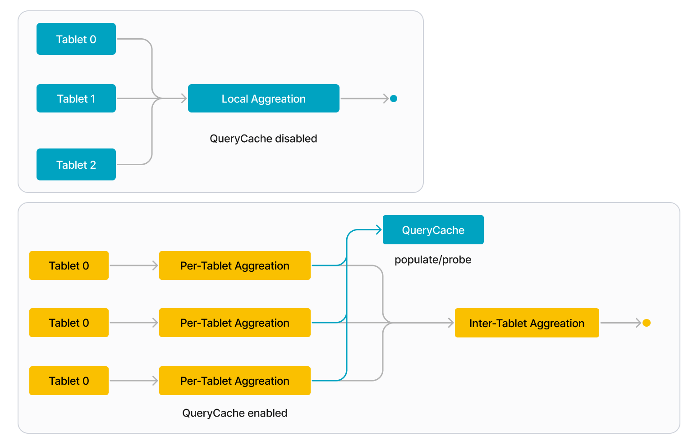
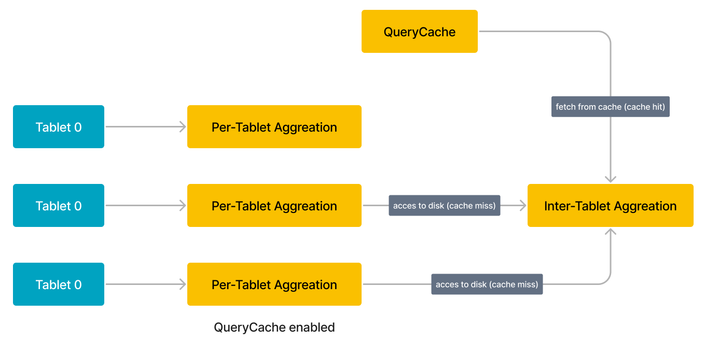
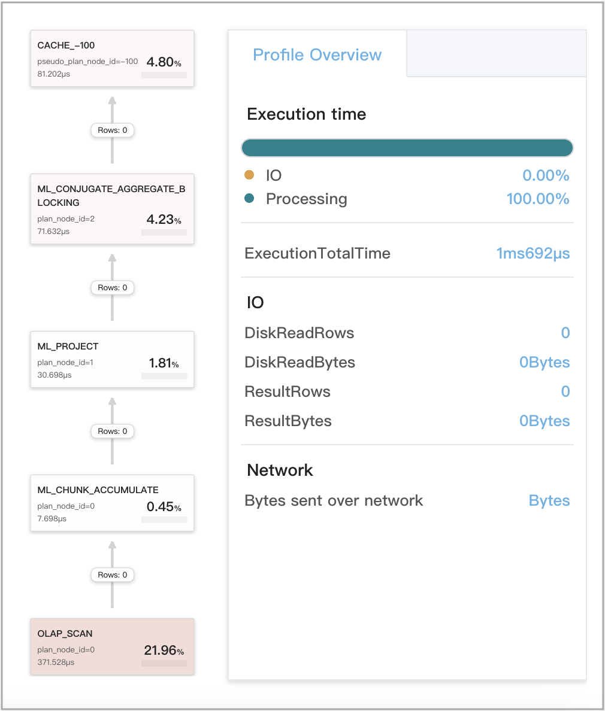
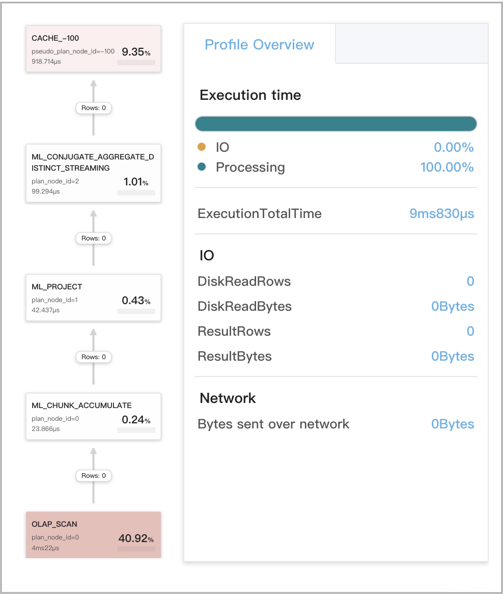
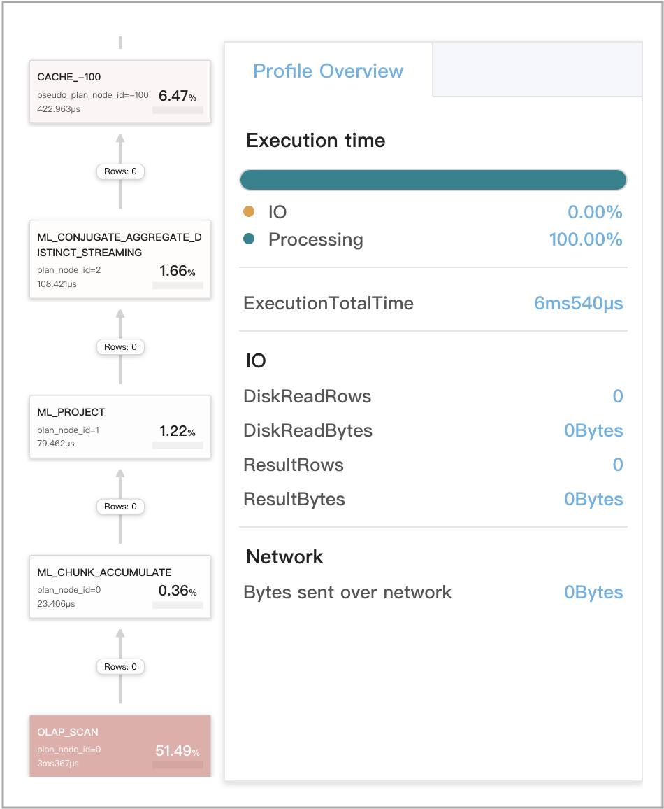
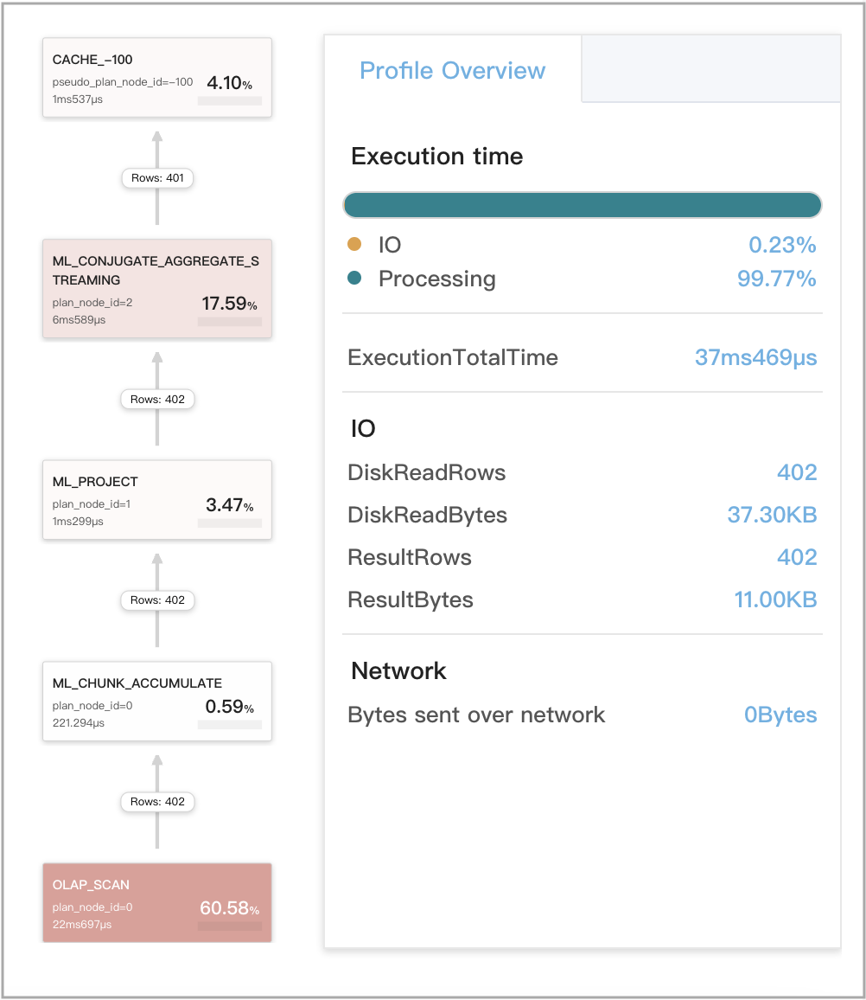
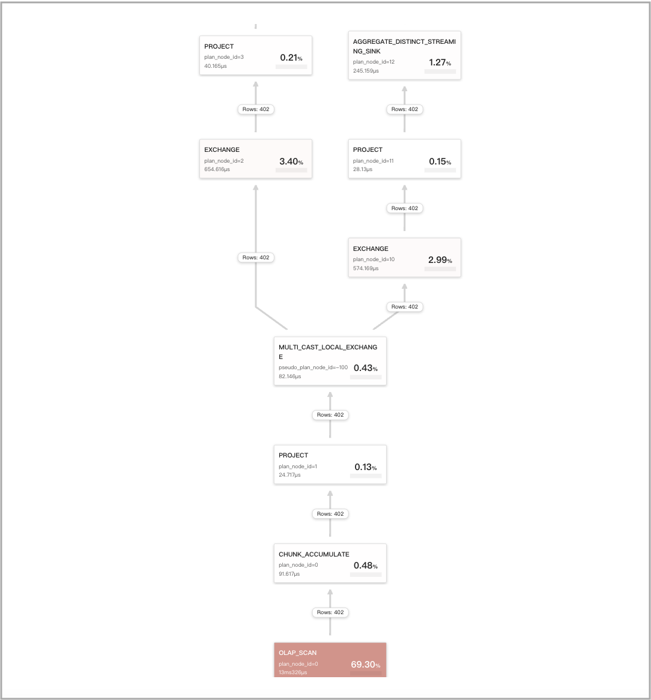
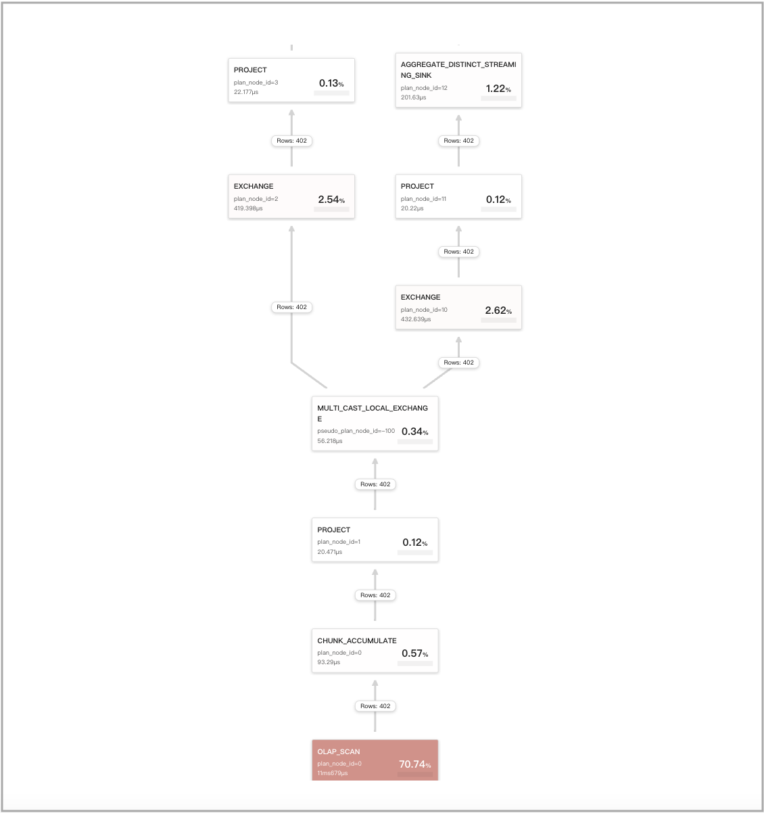
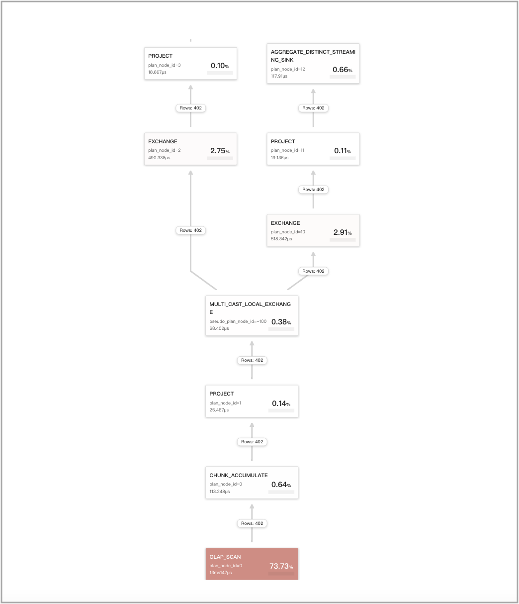

# Query Cache

Query Cache は StarRocks の強力な機能で、集計クエリのパフォーマンスを大幅に向上させることができます。ローカル集計の中間結果をメモリに保存することで、以前と同一または類似の新しいクエリに対して不要なディスクアクセスや計算を避けることができます。Query Cache を使用することで、StarRocks は集計クエリに対して迅速かつ正確な結果を提供し、時間とリソースを節約し、より良いスケーラビリティを実現します。特に、多くのユーザーが大規模で複雑なデータセットに対して類似のクエリを実行する高並行性のシナリオで有用です。

この機能は、v2.5 以降の共有なしクラスタと v3.4.0 以降の共有データクラスタでサポートされています。

v2.5 では、Query Cache は単一のフラットテーブルに対する集計クエリのみをサポートしています。v3.0 以降、Query Cache はスタースキーマで結合された複数のテーブルに対する集計クエリもサポートしています。

## 適用シナリオ

以下のシナリオで Query Cache の使用をお勧めします:

- 個々のフラットテーブルまたはスタースキーマで接続された複数の結合テーブルに対して頻繁に集計クエリを実行する場合。
- 集計クエリのほとんどが非-GROUP BY 集計クエリおよび低カーディナリティの GROUP BY 集計クエリである場合。
- データが時間パーティションで追加モードでロードされ、アクセス頻度に基づいてホットデータとコールドデータに分類できる場合。

Query Cache は、以下の条件を満たすクエリをサポートします:

- クエリエンジンが Pipeline であること。Pipeline エンジンを有効にするには、セッション変数 `enable_pipeline_engine` を `true` に設定します。

  > **注意**
  >
  > 他のクエリエンジンは Query Cache をサポートしていません。

- クエリが内部 OLAP テーブル (v2.5 以降) またはクラウドネイティブテーブル (v3.0 以降) に対して行われること。Query Cache は外部テーブルに対するクエリをサポートしていません。また、Query Cache は同期マテリアライズドビューへのアクセスを必要とするクエリもサポートしていますが、非同期マテリアライズドビューへのアクセスを必要とするクエリはサポートしていません。

- クエリが個々のテーブルまたは複数の結合テーブルに対する集計クエリであること。

  **注意**
  >
  > - Query Cache は Broadcast Join と Bucket Shuffle Join をサポートしています。
  > - Query Cache は Join 演算子を含む 2 つの木構造をサポートしています: Aggregation-Join と Join-Aggregation。Aggregation-Join 木構造では Shuffle Join はサポートされておらず、Join-Aggregation 木構造では Hash Join はサポートされていません。

- クエリに `rand`、`random`、`uuid`、`sleep` などの非決定的な関数が含まれていないこと。

Query Cache は、以下のパーティションポリシーを使用するテーブルに対するクエリをサポートします: 非パーティション、マルチカラムパーティション、シングルカラムパーティション。

## 機能の境界

- Query Cache は Pipeline エンジンの per-tablet 計算に基づいています。per-tablet 計算とは、パイプラインドライバーがタブレット全体を一つずつ処理できることを意味します。各 BE がクエリのために処理する必要のあるタブレットの数が、このクエリを実行するために呼び出されるパイプラインドライバーの数以上である場合、Query Cache は機能します。呼び出されるパイプラインドライバーの数は、実際の並行度 (DOP) を表します。タブレットの数がパイプラインドライバーの数より少ない場合、各パイプラインドライバーは特定のタブレットの一部のみを処理します。この状況では、per-tablet 計算結果を生成できないため、Query Cache は機能しません。
- StarRocks では、集計クエリは少なくとも 4 つのステージで構成されています。最初のステージで AggregateNode によって生成された per-tablet 計算結果は、OlapScanNode と AggregateNode が同じフラグメントからデータを計算する場合にのみキャッシュできます。他のステージで AggregateNode によって生成された per-tablet 計算結果はキャッシュできません。一部の DISTINCT 集計クエリでは、セッション変数 `cbo_cte_reuse` が `true` に設定されている場合、データを生成する OlapScanNode と生成されたデータを消費するステージ 1 の AggregateNode が異なるフラグメントからデータを計算し、ExchangeNode によって橋渡しされる場合、Query Cache は機能しません。以下の 2 つの例は、CTE 最適化が実行され、Query Cache が機能しないシナリオを示しています:
  - 出力列が集計関数 `avg(distinct)` を使用して計算される場合。
  - 出力列が複数の DISTINCT 集計関数によって計算される場合。
- データが集計前にシャッフルされる場合、そのデータに対するクエリは Query Cache で加速できません。
- テーブルの group-by 列または重複排除列が高カーディナリティの列である場合、そのテーブルに対する集計クエリは大きな結果を生成します。このような場合、クエリは実行時に Query Cache をバイパスします。
- Query Cache は、計算結果を保存するために BE によって提供される少量のメモリを占有します。Query Cache のデフォルトサイズは 512 MB です。したがって、大きなサイズのデータ項目を保存するには不適切です。さらに、Query Cache を有効にした後、キャッシュヒット率が低い場合、クエリパフォーマンスが低下します。したがって、タブレットの計算結果のサイズが `query_cache_entry_max_bytes` または `query_cache_entry_max_rows` パラメータで指定されたしきい値を超える場合、Query Cache はクエリに対して機能しなくなり、クエリは Passthrough モードに切り替わります。

## 動作の仕組み

Query Cache が有効になっている場合、各 BE はクエリのローカル集計を次の 2 つのステージに分割します:

1. Per-tablet 集計

   BE は各タブレットを個別に処理します。BE がタブレットの処理を開始するとき、まず Query Cache を調べ、そのタブレットに対する集計の中間結果が Query Cache にあるかどうかを確認します。ある場合 (キャッシュヒット)、BE は Query Cache から直接中間結果を取得します。ない場合 (キャッシュミス)、BE はディスク上のデータにアクセスし、ローカル集計を実行して中間結果を計算します。BE がタブレットの処理を終了すると、そのタブレットに対する集計の中間結果を Query Cache に保存します。

2. Inter-tablet 集計

   BE はクエリに関与するすべてのタブレットから中間結果を収集し、それらを最終結果に統合します。

   

将来的に類似のクエリが発行されると、以前のクエリのキャッシュされた結果を再利用できます。例えば、次の図に示すクエリは 3 つのタブレット (Tablet 0 から 2) を含み、最初のタブレット (Tablet 0) の中間結果はすでに Query Cache にあります。この例では、BE はディスク上のデータにアクセスする代わりに、Query Cache から直接 Tablet 0 の結果を取得できます。Query Cache が完全にウォームアップされると、すべてのタブレットの中間結果を含むことができ、BE はディスク上のデータにアクセスする必要がありません。



余分なメモリを解放するために、Query Cache は LRU (Least Recently Used) ベースのエビクションポリシーを採用してキャッシュエントリを管理します。このエビクションポリシーに従って、Query Cache が占有するメモリ量が事前定義されたサイズ (`query_cache_capacity`) を超えると、最も最近使用されていないキャッシュエントリが Query Cache から削除されます。

> **注意**
>
> 将来的に、StarRocks はキャッシュエントリを Query Cache から削除できる TTL (Time to Live) ベースのエビクションポリシーもサポートします。

FE は各クエリが Query Cache を使用して加速する必要があるかどうかを判断し、クエリのセマンティクスに影響を与えない些細なリテラルの詳細を排除するためにクエリを正規化します。

Query Cache の悪いケースによって引き起こされるパフォーマンスのペナルティを防ぐために、BE は実行時に Query Cache をバイパスするための適応ポリシーを採用しています。

## Query Cache の有効化

このセクションでは、Query Cache を有効にして設定するために使用されるパラメータとセッション変数について説明します。

### FE セッション変数

| **変数**                  | **デフォルト値** | **動的に設定可能か** | **説明**                                                                                                                 |
| ------------------------- | ---------------- | -------------------- | ----------------------------------------------------------------------------------------------------------------------- |
| enable_query_cache        | false            | Yes                  | Query Cache を有効にするかどうかを指定します。有効な値: `true` と `false`。`true` はこの機能を有効にし、`false` は無効にします。Query Cache が有効な場合、このトピックの「[適用シナリオ](#application-scenarios)」セクションで指定された条件を満たすクエリに対してのみ機能します。 |
| query_cache_entry_max_bytes | 4194304          | Yes                  | Passthrough モードをトリガーするしきい値を指定します。有効な値: `0` から `9223372036854775807`。クエリによってアクセスされる特定のタブレットの計算結果のバイト数または行数が `query_cache_entry_max_bytes` または `query_cache_entry_max_rows` パラメータで指定されたしきい値を超える場合、クエリは Passthrough モードに切り替わります。<br />`query_cache_entry_max_bytes` または `query_cache_entry_max_rows` パラメータが `0` に設定されている場合、関与するタブレットから計算結果が生成されていない場合でも Passthrough モードが使用されます。 |
| query_cache_entry_max_rows | 409600           | Yes                  | 上記と同じです。                                                                                                         |

### BE パラメータ

BE の設定ファイル **be.conf** で次のパラメータを設定する必要があります。このパラメータを BE に再設定した後、BE を再起動して新しいパラメータ設定を有効にする必要があります。

| **パラメータ**            | **必須** | **説明**                                                                                                                 |
| ------------------------- | -------- | ----------------------------------------------------------------------------------------------------------------------- |
| query_cache_capacity      | No       | Query Cache のサイズを指定します。単位: バイト。デフォルトサイズは 512 MB です。<br />各 BE はメモリ内に独自のローカル Query Cache を持ち、自分の Query Cache のみをポピュレートおよびプローブします。<br />Query Cache のサイズは 4 MB 未満にすることはできません。BE のメモリ容量が期待される Query Cache サイズをプロビジョニングするのに不十分な場合、BE のメモリ容量を増やすことができます。 |

## すべてのシナリオでの最大キャッシュヒット率を実現するための設計

クエリが文字通り同一でない場合でも Query Cache が有効な 3 つのシナリオを考えてみましょう。これらの 3 つのシナリオは次のとおりです:

- セマンティックに等価なクエリ
- スキャンされたパーティションが重複するクエリ
- 追加のみのデータ変更があるデータに対するクエリ (UPDATE または DELETE 操作なし)

### セマンティックに等価なクエリ

2 つのクエリが類似している場合、それらが文字通り等価である必要はありませんが、実行プランにセマンティックに等価なスニペットを含む場合、それらはセマンティックに等価と見なされ、互いの計算結果を再利用できます。広義には、2 つのクエリが同じソースからデータをクエリし、同じ計算方法を使用し、同じ実行プランを持っている場合、それらはセマンティックに等価です。StarRocks は、2 つのクエリがセマンティックに等価かどうかを評価するために次のルールを適用します:

- 2 つのクエリが複数の集計を含む場合、それらの最初の集計がセマンティックに等価である限り、それらはセマンティックに等価と評価されます。例えば、次の 2 つのクエリ、Q1 と Q2 はどちらも複数の集計を含んでいますが、それらの最初の集計はセマンティックに等価です。したがって、Q1 と Q2 はセマンティックに等価と評価されます。

  - Q1

    ```SQL
    SELECT
        (
            ifnull(sum(murmur_hash3_32(hour)), 0) + ifnull(sum(murmur_hash3_32(k0)), 0) + ifnull(sum(murmur_hash3_32(__c_0)), 0)
        ) AS fingerprint
    FROM
        (
            SELECT
                date_trunc('hour', ts) AS hour,
                k0,
                sum(v1) AS __c_0
            FROM
                t0
            WHERE
                ts between '2022-01-03 00:00:00'
                and '2022-01-03 23:59:59'
            GROUP BY
                date_trunc('hour', ts),
                k0
        ) AS t;
    ```

  - Q2

    ```SQL
    SELECT
        date_trunc('hour', ts) AS hour,
        k0,
        sum(v1) AS __c_0
    FROM
        t0
    WHERE
        ts between '2022-01-03 00:00:00'
        and '2022-01-03 23:59:59'
    GROUP BY
        date_trunc('hour', ts),
        k0
    ```

- 2 つのクエリが次のいずれかのクエリタイプに属する場合、それらはセマンティックに等価と評価されます。HAVING 句を含むクエリは、HAVING 句を含まないクエリとセマンティックに等価と評価されることはありません。ただし、ORDER BY または LIMIT 句の有無は、2 つのクエリがセマンティックに等価かどうかの評価に影響を与えません。

  - GROUP BY 集計

    ```SQL
    SELECT <GroupByItems>, <AggFunctionItems> 
    FROM <Table> 
    WHERE <Predicates> [and <PartitionColumnRangePredicate>]
    GROUP BY <GroupByItems>
    [HAVING <HavingPredicate>] 
    ```

    > **注意**
    >
    > 上記の例では、HAVING 句はオプションです。

  - GROUP BY DISTINCT 集計

    ```SQL
    SELECT DISTINCT <GroupByItems>, <Items> 
    FROM <Table> 
    WHERE <Predicates> [and <PartitionColumnRangePredicate>]
    GROUP BY <GroupByItems>
    HAVING <HavingPredicate>
    ```

    > **注意**
    >
    > 上記の例では、HAVING 句はオプションです。

  - 非-GROUP BY 集計

```SQL
    SELECT <AggFunctionItems> FROM <Table> 
    WHERE <Predicates> [and <PartitionColumnRangePredicate>]
    ```

  - 非-GROUP BY DISTINCT 集計

    ```SQL
    SELECT DISTINCT <Items> FROM <Table> 
    WHERE <Predicates> [and <PartitionColumnRangePredicate>]
    ```

- どちらかのクエリに `PartitionColumnRangePredicate` が含まれている場合、2 つのクエリがセマンティックに等価かどうかを評価する前に `PartitionColumnRangePredicate` を削除します。`PartitionColumnRangePredicate` は、パーティション列を参照する次のタイプの述語のいずれかを指定します:

  - `col between v1 and v2`: パーティション列の値が [v1, v2] 範囲内にあることを示します。ここで、`v1` と `v2` は定数式です。
  - `v1 < col and col < v2`: パーティション列の値が (v1, v2) 範囲内にあることを示します。ここで、`v1` と `v2` は定数式です。
  - `v1 < col and col <= v2`: パーティション列の値が (v1, v2] 範囲内にあることを示します。ここで、`v1` と `v2` は定数式です。
  - `v1 <= col and col < v2`: パーティション列の値が [v1, v2) 範囲内にあることを示します。ここで、`v1` と `v2` は定数式です。
  - `v1 <= col and col <= v2`: パーティション列の値が [v1, v2] 範囲内にあることを示します。ここで、`v1` と `v2` は定数式です。

- SELECT 句の出力列が再配置された後に同じである場合、2 つのクエリはセマンティックに等価と評価されます。

- GROUP BY 句の出力列が再配置された後に同じである場合、2 つのクエリはセマンティックに等価と評価されます。

- WHERE 句の残りの述語が `PartitionColumnRangePredicate` を削除した後にセマンティックに等価である場合、2 つのクエリはセマンティックに等価と評価されます。

- HAVING 句の述語がセマンティックに等価である場合、2 つのクエリはセマンティックに等価と評価されます。

次の `lineorder_flat` テーブルを例に使用します:

```SQL
CREATE TABLE `lineorder_flat`
(
    `lo_orderdate` date NOT NULL COMMENT "",
    `lo_orderkey` int(11) NOT NULL COMMENT "",
    `lo_linenumber` tinyint(4) NOT NULL COMMENT "",
    `lo_custkey` int(11) NOT NULL COMMENT "",
    `lo_partkey` int(11) NOT NULL COMMENT "",
    `lo_suppkey` int(11) NOT NULL COMMENT "",
    `lo_orderpriority` varchar(100) NOT NULL COMMENT "",
    `lo_shippriority` tinyint(4) NOT NULL COMMENT "",
    `lo_quantity` tinyint(4) NOT NULL COMMENT "",
    `lo_extendedprice` int(11) NOT NULL COMMENT "",
    `lo_ordtotalprice` int(11) NOT NULL COMMENT "",
    `lo_discount` tinyint(4) NOT NULL COMMENT "",
    `lo_revenue` int(11) NOT NULL COMMENT "",
    `lo_supplycost` int(11) NOT NULL COMMENT "",
    `lo_tax` tinyint(4) NOT NULL COMMENT "",
    `lo_commitdate` date NOT NULL COMMENT "",
    `lo_shipmode` varchar(100) NOT NULL COMMENT "",
    `c_name` varchar(100) NOT NULL COMMENT "",
    `c_address` varchar(100) NOT NULL COMMENT "",
    `c_city` varchar(100) NOT NULL COMMENT "",
    `c_nation` varchar(100) NOT NULL COMMENT "",
    `c_region` varchar(100) NOT NULL COMMENT "",
    `c_phone` varchar(100) NOT NULL COMMENT "",
    `c_mktsegment` varchar(100) NOT NULL COMMENT "",
    `s_name` varchar(100) NOT NULL COMMENT "",
    `s_address` varchar(100) NOT NULL COMMENT "",
    `s_city` varchar(100) NOT NULL COMMENT "",
    `s_nation` varchar(100) NOT NULL COMMENT "",
    `s_region` varchar(100) NOT NULL COMMENT "",
    `s_phone` varchar(100) NOT NULL COMMENT "",
    `p_name` varchar(100) NOT NULL COMMENT "",
    `p_mfgr` varchar(100) NOT NULL COMMENT "",
    `p_category` varchar(100) NOT NULL COMMENT "",
    `p_brand` varchar(100) NOT NULL COMMENT "",
    `p_color` varchar(100) NOT NULL COMMENT "",
    `p_type` varchar(100) NOT NULL COMMENT "",
    `p_size` tinyint(4) NOT NULL COMMENT "",
    `p_container` varchar(100) NOT NULL COMMENT ""
)
ENGINE=OLAP 
DUPLICATE KEY(`lo_orderdate`, `lo_orderkey`)
COMMENT "olap"
PARTITION BY RANGE(`lo_orderdate`)
(PARTITION p1 VALUES [('0000-01-01'), ('1993-01-01')),
PARTITION p2 VALUES [('1993-01-01'), ('1994-01-01')),
PARTITION p3 VALUES [('1994-01-01'), ('1995-01-01')),
PARTITION p4 VALUES [('1995-01-01'), ('1996-01-01')),
PARTITION p5 VALUES [('1996-01-01'), ('1997-01-01')),
PARTITION p6 VALUES [('1997-01-01'), ('1998-01-01')),
PARTITION p7 VALUES [('1998-01-01'), ('1999-01-01')))
DISTRIBUTED BY HASH(`lo_orderkey`)
PROPERTIES 
(
    "replication_num" = "3",
    "colocate_with" = "groupxx1",
    "storage_format" = "DEFAULT",
    "enable_persistent_index" = "true",
    "compression" = "LZ4"
);
```

次の 2 つのクエリ、Q1 と Q2 は、`lineorder_flat` テーブルに対するもので、次のように処理された後にセマンティックに等価です:

1. SELECT 文の出力列を再配置します。
2. GROUP BY 句の出力列を再配置します。
3. ORDER BY 句の出力列を削除します。
4. WHERE 句の述語を再配置します。
5. `PartitionColumnRangePredicate` を追加します。

- Q1

  ```SQL
  SELECT sum(lo_revenue), year(lo_orderdate) AS year,p_brand
  FROM lineorder_flat
  WHERE p_category = 'MFGR#12' AND s_region = 'AMERICA'
  GROUP BY year,p_brand
  ORDER BY year,p_brand;
  ```

- Q2

  ```SQL
  SELECT year(lo_orderdate) AS year, p_brand, sum(lo_revenue)
  FROM lineorder_flat
  WHERE s_region = 'AMERICA' AND p_category = 'MFGR#12' AND 
     lo_orderdate >= '1993-01-01' AND lo_orderdate <= '1993-12-31'
  GROUP BY p_brand, year(lo_orderdate)
  ```

セマンティックな等価性はクエリの物理プランに基づいて評価されます。したがって、クエリのリテラルの違いはセマンティックな等価性の評価に影響を与えません。さらに、定数式はクエリから削除され、`cast` 式はクエリの最適化中に削除されます。したがって、これらの式はセマンティックな等価性の評価に影響を与えません。第三に、列とリレーションのエイリアスもセマンティックな等価性の評価に影響を与えません。

### スキャンされたパーティションが重複するクエリ

Query Cache は述語ベースのクエリ分割をサポートしています。

述語のセマンティクスに基づいてクエリを分割することで、部分的な計算結果の再利用を実現します。クエリにテーブルのパーティション列を参照する述語が含まれており、その述語が値の範囲を指定している場合、StarRocks はテーブルのパーティションに基づいて範囲を複数の区間に分割できます。各個別の区間からの計算結果は、他のクエリによって個別に再利用できます。

次の `t0` テーブルを例に使用します:

```SQL
CREATE TABLE if not exists t0
(
    ts DATETIME NOT NULL,
    k0 VARCHAR(10) NOT NULL,
    k1 BIGINT NOT NULL,
    v1 DECIMAL64(7, 2) NOT NULL 
)
ENGINE=OLAP
DUPLICATE KEY(`ts`, `k0`, `k1`)
COMMENT "OLAP"
PARTITION BY RANGE(ts)
(
  START ("2022-01-01 00:00:00") END ("2022-02-01 00:00:00") EVERY (INTERVAL 1 day) 
)
DISTRIBUTED BY HASH(`ts`, `k0`, `k1`)
PROPERTIES
(
    "replication_num" = "3", 
    "storage_format" = "default"
);
```

テーブル `t0` は日ごとにパーティションされており、列 `ts` はテーブルのパーティション列です。次の 4 つのクエリのうち、Q2、Q3、および Q4 は Q1 のキャッシュされた計算結果の一部を再利用できます:

- Q1

  ```SQL
  SELECT date_trunc('day', ts) as day, sum(v0)
  FROM t0
  WHERE ts BETWEEN '2022-01-02 12:30:00' AND '2022-01-14 23:59:59'
  GROUP BY day;
  ```

  Q1 の述語 `ts between '2022-01-02 12:30:00' and '2022-01-14 23:59:59'` によって指定された値の範囲は、次の区間に分割できます:

  ```SQL
  1. [2022-01-02 12:30:00, 2022-01-03 00:00:00),
  2. [2022-01-03 00:00:00, 2022-01-04 00:00:00),
  3. [2022-01-04 00:00:00, 2022-01-05 00:00:00),
  ...
  12. [2022-01-13 00:00:00, 2022-01-14 00:00:00),
  13. [2022-01-14 00:00:00, 2022-01-15 00:00:00),
  ```

- Q2

  ```SQL
  SELECT date_trunc('day', ts) as day, sum(v0)
  FROM t0
  WHERE ts >= '2022-01-02 12:30:00' AND  ts < '2022-01-05 00:00:00'
  GROUP BY day;
  ```

  Q2 は Q1 の次の区間内の計算結果を再利用できます:

  ```SQL
  1. [2022-01-02 12:30:00, 2022-01-03 00:00:00),
  2. [2022-01-03 00:00:00, 2022-01-04 00:00:00),
  3. [2022-01-04 00:00:00, 2022-01-05 00:00:00),
  ```

- Q3

  ```SQL
  SELECT date_trunc('day', ts) as day, sum(v0)
  FROM t0
  WHERE ts >= '2022-01-01 12:30:00' AND  ts <= '2022-01-10 12:00:00'
  GROUP BY day;
  ```

  Q3 は Q1 の次の区間内の計算結果を再利用できます:

  ```SQL
  2. [2022-01-03 00:00:00, 2022-01-04 00:00:00),
  3. [2022-01-04 00:00:00, 2022-01-05 00:00:00),
  ...
  8. [2022-01-09 00:00:00, 2022-01-10 00:00:00),
  ```

- Q4

  ```SQL
  SELECT date_trunc('day', ts) as day, sum(v0)
  FROM t0
  WHERE ts BETWEEN '2022-01-02 12:30:00' and '2022-01-02 23:59:59'
  GROUP BY day;
  ```

  Q4 は Q1 の次の区間内の計算結果を再利用できます:

  ```SQL
  1. [2022-01-02 12:30:00, 2022-01-03 00:00:00),
  ```

部分的な計算結果の再利用のサポートは、使用されるパーティションポリシーによって異なります。次の表に示すように、サポートの状況は異なります。

| **パーティションポリシー** | **部分的な計算結果の再利用のサポート** |
| ------------------------- | -------------------------------------- |
| 非パーティション          | サポートされていません                  |
| マルチカラムパーティション | サポートされていません<br />**注意**<br />将来的にこの機能がサポートされる可能性があります。 |
| シングルカラムパーティション | サポートされています                  |

### 追加のみのデータ変更があるデータに対するクエリ

Query Cache はマルチバージョンキャッシングをサポートしています。

データがロードされると、タブレットの新しいバージョンが生成されます。その結果、タブレットの以前のバージョンから生成されたキャッシュされた計算結果は古くなり、最新のタブレットバージョンに遅れをとります。この状況では、マルチバージョンキャッシングメカニズムは、クエリが最新のタブレットバージョンを持つことができるように、Query Cache に保存された古い結果とディスク上に保存されたタブレットの増分バージョンをマージしようとします。マルチバージョンキャッシングは、テーブルタイプ、クエリタイプ、およびデータ更新タイプによって制約されます。

マルチバージョンキャッシングのサポートは、テーブルタイプとクエリタイプによって異なります。次の表に示すように、サポートの状況は異なります。

| **テーブルタイプ**       | **クエリタイプ**                                           | **マルチバージョンキャッシングのサポート**                        |
| ------------------- | ------------------------------------------------------------ | ------------------------------------------------------------ |
| 重複キーテーブル | <ul><li>ベーステーブルに対するクエリ</li><li>同期マテリアライズドビューに対するクエリ</li></ul> | <ul><li>ベーステーブルに対するクエリ: 増分タブレットバージョンにデータ削除レコードが含まれていない場合にサポートされています。</li><li>同期マテリアライズドビューに対するクエリ: クエリの GROUP BY、HAVING、または WHERE 句が集計列を参照していない場合にサポートされています。</li></ul> |
| 集計テーブル | ベーステーブルに対するクエリまたは同期マテリアライズドビューに対するクエリ | 次の状況を除いてすべての状況でサポートされています: ベーステーブルのスキーマに集計関数 `replace` が含まれている場合。クエリの GROUP BY、HAVING、または WHERE 句が集計列を参照している場合。増分タブレットバージョンにデータ削除レコードが含まれている場合。 |
| ユニークキーテーブル    | 該当なし                                                          | サポートされていません。ただし、Query Cache はサポートされています。        |
| 主キーテーブル   | 該当なし                                                          | サポートされていません。ただし、Query Cache はサポートされています。        |

データ更新タイプがマルチバージョンキャッシングに与える影響は次のとおりです:

- データ削除

  増分タブレットバージョンに削除操作が含まれている場合、マルチバージョンキャッシングは機能しません。

- データ挿入

```markdown
  - タブレットに対して空のバージョンが生成される場合、Query Cache にあるタブレットの既存データは有効であり、引き続き取得できます。
  - タブレットに対して空でないバージョンが生成される場合、Query Cache にあるタブレットの既存データは有効ですが、そのバージョンはタブレットの最新バージョンに遅れをとります。この状況では、StarRocks は既存データのバージョンからタブレットの最新バージョンまで生成された増分データを読み取り、既存データと増分データをマージし、マージされたデータを Query Cache に保存します。

- スキーマ変更とタブレットの切り捨て

  テーブルのスキーマが変更された場合、またはテーブルの特定のタブレットが切り捨てられた場合、新しいタブレットがテーブルに生成されます。その結果、Query Cache にあるテーブルのタブレットの既存データは無効になります。

## メトリクス

Query Cache が機能するクエリのプロファイルには `CacheOperator` 統計が含まれています。

クエリのソースプランで、パイプラインに `OlapScanOperator` が含まれている場合、`OlapScanOperator` と集計演算子の名前は `MultilaneOperator` を使用して per-tablet 計算を実行することを示すために `ML_` でプレフィックスされます。`CacheOperator` は `ML_CONJUGATE_AGGREGATE` の前に挿入され、Query Cache が Passthrough、Populate、および Probe モードでどのように動作するかを制御するロジックを処理します。クエリのプロファイルには、Query Cache の使用状況を理解するのに役立つ次の `CacheOperator` メトリクスが含まれています。

| **メトリクス**            | **説明**                                                      |
| ------------------------- | ------------------------------------------------------------ |
| CachePassthroughBytes     | Passthrough モードで生成されたバイト数。                      |
| CachePassthroughChunkNum  | Passthrough モードで生成されたチャンク数。                    |
| CachePassthroughRowNum    | Passthrough モードで生成された行数。                          |
| CachePassthroughTabletNum | Passthrough モードで生成されたタブレット数。                  |
| CachePassthroughTime:     | Passthrough モードでの計算にかかった時間。                    |
| CachePopulateBytes        | Populate モードで生成されたバイト数。                         |
| CachePopulateChunkNum     | Populate モードで生成されたチャンク数。                       |
| CachePopulateRowNum       | Populate モードで生成された行数。                             |
| CachePopulateTabletNum    | Populate モードで生成されたタブレット数。                     |
| CachePopulateTime         | Populate モードでの計算にかかった時間。                       |
| CacheProbeBytes           | Probe モードでのキャッシュヒットに対して生成されたバイト数。   |
| CacheProbeChunkNum        | Probe モードでのキャッシュヒットに対して生成されたチャンク数。 |
| CacheProbeRowNum          | Probe モードでのキャッシュヒットに対して生成された行数。       |
| CacheProbeTabletNum       | Probe モードでのキャッシュヒットに対して生成されたタブレット数。 |
| CacheProbeTime            | Probe モードでの計算にかかった時間。                          |

`CachePopulate`*`XXX`* メトリクスは、Query Cache が更新されたクエリキャッシュミスの統計を提供します。

`CachePassthrough`*`XXX`* メトリクスは、タブレットごとの計算結果のサイズが大きいために Query Cache が更新されなかったクエリキャッシュミスの統計を提供します。

`CacheProbe`*`XXX`* メトリクスは、Query Cache ヒットの統計を提供します。

マルチバージョンキャッシングメカニズムでは、`CachePopulate` メトリクスと `CacheProbe` メトリクスは同じタブレット統計を含むことがあり、`CachePassthrough` メトリクスと `CacheProbe` メトリクスも同じタブレット統計を含むことがあります。例えば、StarRocks が各タブレットのデータを計算する際、タブレットの履歴バージョンで生成された計算結果にヒットします。この状況では、StarRocks は履歴バージョンからタブレットの最新バージョンまで生成された増分データを読み取り、データを計算し、増分データとキャッシュされたデータをマージします。マージ後に生成された計算結果のサイズが `query_cache_entry_max_bytes` または `query_cache_entry_max_rows` パラメータで指定されたしきい値を超えない場合、タブレットの統計は `CachePopulate` メトリクスに収集されます。それ以外の場合、タブレットの統計は `CachePassthrough` メトリクスに収集されます。

## RESTful API 操作

- `metrics |grep query_cache`

  この API 操作は、Query Cache に関連するメトリクスをクエリするために使用されます。

  ```shell
  curl -s  http://<be_host>:<be_http_port>/metrics |grep query_cache
  
  # TYPE starrocks_be_query_cache_capacity gauge
  starrocks_be_query_cache_capacity 536870912
  # TYPE starrocks_be_query_cache_hit_count gauge
  starrocks_be_query_cache_hit_count 5084393
  # TYPE starrocks_be_query_cache_hit_ratio gauge
  starrocks_be_query_cache_hit_ratio 0.984098
  # TYPE starrocks_be_query_cache_lookup_count gauge
  starrocks_be_query_cache_lookup_count 5166553
  # TYPE starrocks_be_query_cache_usage gauge
  starrocks_be_query_cache_usage 0
  # TYPE starrocks_be_query_cache_usage_ratio gauge
  starrocks_be_query_cache_usage_ratio 0.000000
  ```

- `api/query_cache/stat`

  この API 操作は、Query Cache の使用状況をクエリするために使用されます。

  ```shell
  curl  http://<be_host>:<be_http_port>/api/query_cache/stat
  {
      "capacity": 536870912,
      "usage": 0,
      "usage_ratio": 0.0,
      "lookup_count": 5025124,
      "hit_count": 4943720,
      "hit_ratio": 0.983800598751394
  }
  ```

- `api/query_cache/invalidate_all`

  この API 操作は、Query Cache をクリアするために使用されます。

  ```shell
  curl  -XPUT http://<be_host>:<be_http_port>/api/query_cache/invalidate_all
  
  {
      "status": "OK"
  }
  ```

上記の API 操作のパラメータは次のとおりです:

- `be_host`: BE が存在するノードの IP アドレス。
- `be_http_port`: BE が存在するノードの HTTP ポート番号。

## 注意事項

- StarRocks は、初めて開始されたクエリの計算結果で Query Cache をポピュレートする必要があります。その結果、クエリパフォーマンスが期待よりもわずかに低くなる可能性があり、クエリの遅延が増加します。
- 大きな Query Cache サイズを設定すると、BE でクエリ評価にプロビジョニングできるメモリ量が減少します。Query Cache サイズがクエリ評価にプロビジョニングされたメモリ容量の 1/6 を超えないことをお勧めします。
- 処理する必要のあるタブレットの数が `pipeline_dop` の値より少ない場合、Query Cache は機能しません。Query Cache を機能させるには、`pipeline_dop` を `1` などの小さい値に設定できます。v3.0 以降、StarRocks はクエリの並行性に基づいてこのパラメータを適応的に調整します。

## 例

### データセット

1. StarRocks クラスタにログインし、目的のデータベースに移動して、`t0` という名前のテーブルを作成するために次のコマンドを実行します:

   ```SQL
   CREATE TABLE t0
   (
         `ts` datetime NOT NULL COMMENT "",
         `k0` varchar(10) NOT NULL COMMENT "",
         `k1` char(6) NOT NULL COMMENT "",
         `v0` bigint(20) NOT NULL COMMENT "",
         `v1` decimal64(7, 2) NOT NULL COMMENT ""
   )
   ENGINE=OLAP 
   DUPLICATE KEY(`ts`, `k0`, `k1`)
   COMMENT "OLAP"
   PARTITION BY RANGE(`ts`)
   (
       START ("2022-01-01 00:00:00") END ("2022-02-01 00:00:00") EVERY (INTERVAL 1 DAY)
   )
   DISTRIBUTED BY HASH(`ts`, `k0`, `k1`)
   PROPERTIES
   (
       "replication_num" = "3",
       "storage_format" = "DEFAULT",
       "enable_persistent_index" = "true"
   );
   ```

2. 次のデータレコードを `t0` に挿入します:

```SQL
   INSERT INTO t0
   VALUES
       ('2022-01-11 20:42:26', 'n4AGcEqYp', 'hhbawx', '799393174109549', '8029.42'),
       ('2022-01-27 18:17:59', 'i66lt', 'mtrtzf', '100400167', '10000.88'),
       ('2022-01-28 20:10:44', 'z6', 'oqkeun', '-58681382337', '59881.87'),
       ('2022-01-29 14:54:31', 'qQ', 'dzytua', '-19682006834', '43807.02'),
       ('2022-01-31 08:08:11', 'qQ', 'dzytua', '7970665929984223925', '-8947.74'),
       ('2022-01-15 00:40:58', '65', 'hhbawx', '4054945', '156.56'),
       ('2022-01-24 16:17:51', 'onqR3JsK1', 'udtmfp', '-12962', '-72127.53'),
       ('2022-01-01 22:36:24', 'n4AGcEqYp', 'fabnct', '-50999821', '17349.85'),
       ('2022-01-21 08:41:50', 'Nlpz1j3h', 'dzytua', '-60162', '287.06'),
       ('2022-01-30 23:44:55', '', 'slfght', '62891747919627339', '8014.98'),
       ('2022-01-18 19:14:28', 'z6', 'dzytua', '-1113001726', '73258.24'),
       ('2022-01-30 14:54:59', 'z6', 'udtmfp', '111175577438857975', '-15280.41'),
       ('2022-01-08 22:08:26', 'z6', 'ympyls', '3', '2.07'),
       ('2022-01-03 08:17:29', 'Nlpz1j3h', 'udtmfp', '-234492', '217.58'),
       ('2022-01-27 07:28:47', 'Pc', 'cawanm', '-1015', '-20631.50'),
       ('2022-01-17 14:07:47', 'Nlpz1j3h', 'lbsvqu', '2295574006197343179', '93768.75'),
       ('2022-01-31 14:00:12', 'onqR3JsK1', 'umlkpo', '-227', '-66199.05'),
       ('2022-01-05 20:31:26', '65', 'lbsvqu', '684307', '36412.49'),
       ('2022-01-06 00:51:34', 'z6', 'dzytua', '11700309310', '-26064.10'),
       ('2022-01-26 02:59:00', 'n4AGcEqYp', 'slfght', '-15320250288446', '-58003.69'),
       ('2022-01-05 03:26:26', 'z6', 'cawanm', '19841055192960542', '-5634.36'),
       ('2022-01-17 08:51:23', 'Pc', 'ghftus', '35476438804110', '13625.99'),
       ('2022-01-30 18:56:03', 'n4AGcEqYp', 'lbsvqu', '3303892099598', '8.37'),
       ('2022-01-22 14:17:18', 'i66lt', 'umlkpo', '-27653110', '-82306.25'),
       ('2022-01-02 10:25:01', 'qQ', 'ghftus', '-188567166', '71442.87'),
       ('2022-01-30 04:58:14', 'Pc', 'ympyls', '-9983', '-82071.59'),
       ('2022-01-05 00:16:56', '7Bh', 'hhbawx', '43712', '84762.97'),
       ('2022-01-25 03:25:53', '65', 'mtrtzf', '4604107', '-2434.69'),
       ('2022-01-27 21:09:10', '65', 'udtmfp', '476134823953365199', '38736.04'),
       ('2022-01-11 13:35:44', '65', 'qmwhvr', '1', '0.28'),
       ('2022-01-03 19:13:07', '', 'lbsvqu', '11', '-53084.04'),
       ('2022-01-20 02:27:25', 'i66lt', 'umlkpo', '3218824416', '-71393.20'),
       ('2022-01-04 04:52:36', '7Bh', 'ghftus', '-112543071', '-78377.93'),
       ('2022-01-27 18:27:06', 'Pc', 'umlkpo', '477', '-98060.13'),
       ('2022-01-04 19:40:36', '', 'udtmfp', '433677211', '-99829.94'),
       ('2022-01-20 23:19:58', 'Nlpz1j3h', 'udtmfp', '361394977', '-19284.18'),
       ('2022-01-05 02:17:56', 'Pc', 'oqkeun', '-552390906075744662', '-25267.92'),
       ('2022-01-02 16:14:07', '65', 'dzytua', '132', '2393.77'),
       ('2022-01-28 23:17:14', 'z6', 'umlkpo', '61', '-52028.57'),
       ('2022-01-12 08:05:44', 'qQ', 'hhbawx', '-9579605666539132', '-87801.81'),
       ('2022-01-31 19:48:22', 'z6', 'lbsvqu', '9883530877822', '34006.42'),
       ('2022-01-11 20:38:41', '', 'piszhr', '56108215256366', '-74059.80'),
       ('2022-01-01 04:15:17', '65', 'cawanm', '-440061829443010909', '88960.51'),
       ('2022-01-05 07:26:09', 'qQ', 'umlkpo', '-24889917494681901', '-23372.12'),
       ('2022-01-29 18:13:55', 'Nlpz1j3h', 'cawanm', '-233', '-24294.42'),
       ('2022-01-10 00:49:45', 'Nlpz1j3h', 'ympyls', '-2396341', '77723.88'),
       ('2022-01-29 08:02:58', 'n4AGcEqYp', 'slfght', '45212', '93099.78'),
       ('2022-01-28 08:59:21', 'onqR3JsK1', 'oqkeun', '76', '-78641.65'),
       ('2022-01-26 14:29:39', '7Bh', 'umlkpo', '176003552517', '-99999.96'),
       ('2022-01-03 18:53:37', '7Bh', 'piszhr', '3906151622605106', '55723.01'),
       ('2022-01-04 07:08:19', 'i66lt', 'ympyls', '-240097380835621', '-81800.87'),
       ('2022-01-28 14:54:17', 'Nlpz1j3h', 'slfght', '-69018069110121', '90533.64'),
       ('2022-01-22 07:48:53', 'Pc', 'ympyls', '22396835447981344', '-12583.39'),
       ('2022-01-22 07:39:29', 'Pc', 'uqkghp', '10551305', '52163.82'),
       ('2022-01-08 22:39:47', 'Nlpz1j3h', 'cawanm', '67905472699', '87831.30'),
       ('2022-01-05 14:53:34', '7Bh', 'dzytua', '-779598598706906834', '-38780.41'),
       ('2022-01-30 17:34:41', 'onqR3JsK1', 'oqkeun', '346687625005524', '-62475.31'),
       ('2022-01-29 12:14:06', '', 'qmwhvr', '3315', '22076.88'),
       ('2022-01-05 06:47:04', 'Nlpz1j3h', 'udtmfp', '-469', '42747.17'),
       ('2022-01-19 15:20:20', '7Bh', 'lbsvqu', '347317095885', '-76393.49'),
       ('2022-01-08 16:18:22', 'z6', 'fghmcd', '2', '90315.60'),
       ('2022-01-02 00:23:06', 'Pc', 'piszhr', '-3651517384168400', '58220.34'),
       ('2022-01-12 08:23:31', 'onqR3JsK1', 'udtmfp', '5636394870355729225', '33224.25'),
       ('2022-01-28 10:46:44', 'onqR3JsK1', 'oqkeun', '-28102078612755', '6469.53'),
       ('2022-01-23 23:16:11', 'onqR3JsK1', 'ghftus', '-707475035515433949', '63422.66'),
       ('2022-01-03 05:32:31', 'z6', 'hhbawx', '-45', '-49680.52'),
       ('2022-01-27 03:24:33', 'qQ', 'qmwhvr', '375943906057539870', '-66092.96'),
       ('2022-01-25 20:07:22', '7Bh', 'slfght', '1', '72440.21'),
       ('2022-01-04 16:07:24', 'qQ', 'uqkghp', '751213107482249', '16417.31'),
       ('2022-01-23 19:22:00', 'Pc', 'hhbawx', '-740731249600493', '88439.40'),
       ('2022-01-05 09:04:20', '7Bh', 'cawanm', '23602', '302.44');
   ```

### クエリ例

このセクションの Query Cache 関連メトリクスの統計は例であり、参考用です。

#### ステージ 1 でのローカル集計に Query Cache が機能する場合

これには次の 3 つの状況が含まれます:

- クエリが単一のタブレットにのみアクセスする場合。
- クエリがコロケートグループを構成するテーブルの複数のパーティションから複数のタブレットにアクセスし、集計のためにデータをシャッフルする必要がない場合。
- クエリが同じパーティションの複数のタブレットにアクセスし、集計のためにデータをシャッフルする必要がない場合。

クエリ例:

```SQL
SELECT
    date_trunc('hour', ts) AS hour,
    k0,
    sum(v1) AS __c_0
FROM
    t0
WHERE
    ts between '2022-01-03 00:00:00'
    and '2022-01-03 23:59:59'
GROUP BY
    date_trunc('hour', ts),
    k0
```

次の図は、クエリプロファイルにおける Query Cache 関連メトリクスを示しています。



#### ステージ 1 でのリモート集計に Query Cache が機能しない場合

複数のタブレットに対する集計が強制的にステージ 1 で実行される場合、データは最初にシャッフルされ、その後集計されます。

クエリ例:

```SQL
SET new_planner_agg_stage = 1;

SELECT
    date_trunc('hour', ts) AS hour,
    v0 % 2 AS is_odd,
    sum(v1) AS __c_0
FROM
    t0
WHERE
    ts between '2022-01-03 00:00:00'
    and '2022-01-03 23:59:59'
GROUP BY
    date_trunc('hour', ts),
    is_odd
```

#### ステージ 2 でのローカル集計に Query Cache が機能する場合

これには次の 3 つの状況が含まれます:

- クエリのステージ 2 での集計が同じタイプのデータを比較するようにコンパイルされている場合。最初の集計はローカル集計です。最初の集計が完了した後、最初の集計から生成された結果が計算され、2 番目の集計が実行されます。これはグローバル集計です。
- クエリが SELECT DISTINCT クエリである場合。
- クエリに次の DISTINCT 集計関数のいずれかが含まれている場合: `sum(distinct)`, `count(distinct)`, および `avg(distinct)`。ほとんどの場合、このようなクエリの集計はステージ 3 または 4 で実行されます。ただし、`set new_planner_agg_stage = 1` を実行して、クエリの集計をステージ 2 で強制的に実行できます。クエリに `avg(distinct)` が含まれており、集計をステージで実行したい場合は、`set cbo_cte_reuse = false` を実行して CTE 最適化を無効にする必要もあります。

クエリ例:

```SQL
SELECT
    date_trunc('hour', ts) AS hour,
    v0 % 2 AS is_odd,
    sum(v1) AS __c_0
FROM
    t0
WHERE
    ts between '2022-01-03 00:00:00'
    and '2022-01-03 23:59:59'
GROUP BY
    date_trunc('hour', ts),
    is_odd
```

次の図は、クエリプロファイルにおける Query Cache 関連メトリクスを示しています。


#### ステージ 3 でのローカル集計に Query Cache が機能する場合

クエリは、単一の DISTINCT 集計関数を含む GROUP BY 集計クエリです。

サポートされている DISTINCT 集計関数は `sum(distinct)`, `count(distinct)`, および `avg(distinct)` です。

> **注意**
>
> クエリに `avg(distinct)` が含まれている場合、`set cbo_cte_reuse = false` を実行して CTE 最適化を無効にする必要もあります。

クエリ例:

```SQL
SELECT
    date_trunc('hour', ts) AS hour,
    v0 % 2 AS is_odd,
    sum(distinct v1) AS __c_0
FROM
    t0
WHERE
    ts between '2022-01-03 00:00:00'
    and '2022-01-03 23:59:59'
GROUP BY
    date_trunc('hour', ts),
    is_odd;
```

次の図は、クエリプロファイルにおける Query Cache 関連メトリクスを示しています。



#### ステージ 4 でのローカル集計に Query Cache が機能する場合

クエリは、単一の DISTINCT 集計関数を含む非-GROUP BY 集計クエリです。このようなクエリには、重複排除データを削除する古典的なクエリが含まれます。

クエリ例:

```SQL
SELECT
    count(distinct v1) AS __c_0
FROM
    t0
WHERE
    ts between '2022-01-03 00:00:00'
    and '2022-01-03 23:59:59'
```

次の図は、クエリプロファイルにおける Query Cache 関連メトリクスを示しています。



#### 最初の集計がセマンティックに等価な 2 つのクエリに対してキャッシュされた結果が再利用される場合

次の 2 つのクエリ、Q1 と Q2 を例に使用します。Q1 と Q2 はどちらも複数の集計を含んでいますが、それらの最初の集計はセマンティックに等価です。したがって、Q1 と Q2 はセマンティックに等価と評価され、Query Cache に保存された互いの計算結果を再利用できます。

- Q1

  ```SQL
  SELECT
      (
          ifnull(sum(murmur_hash3_32(hour)), 0) + ifnull(sum(murmur_hash3_32(k0)), 0) + ifnull(sum(murmur_hash3_32(__c_0)), 0)
        ) AS fingerprint
  FROM
      (
          SELECT
              date_trunc('hour', ts) AS hour,
              k0,
              sum(v1) AS __c_0
          FROM
              t0
          WHERE
              ts between '2022-01-03 00:00:00'
              and '2022-01-03 23:59:59'
          GROUP BY
              date_trunc('hour', ts),
              k0
      ) AS t;
  ```

- Q2

  ```SQL
  SELECT
      date_trunc('hour', ts) AS hour,
      k0,
      sum(v1) AS __c_0
  FROM
      t0
  WHERE
      ts between '2022-01-03 00:00:00'
      and '2022-01-03 23:59:59'
  GROUP BY
      date_trunc('hour', ts),
      k0
  ```

次の図は、Q1 の `CachePopulate` メトリクスを示しています。



次の図は、Q2 の `CacheProbe` メトリクスを示しています。


#### CTE 最適化が有効な DISTINCT クエリに対して Query Cache が機能しない場合

`set cbo_cte_reuse = true` を実行して CTE 最適化を有効にした後、特定の DISTINCT 集計関数を含むクエリの計算結果はキャッシュできません。いくつかの例を以下に示します:

- クエリに単一の DISTINCT 集計関数 `avg(distinct)` が含まれている場合:

  ```SQL
  SELECT
      avg(distinct v1) AS __c_0
  FROM
      t0
  WHERE
      ts between '2022-01-03 00:00:00'
      and '2022-01-03 23:59:59';
  ```



- クエリに同じ列を参照する複数の DISTINCT 集計関数が含まれている場合:

  ```SQL
  SELECT
      avg(distinct v1) AS __c_0,
      sum(distinct v1) AS __c_1,
      count(distinct v1) AS __c_2
  FROM
      t0
  WHERE
      ts between '2022-01-03 00:00:00'
      and '2022-01-03 23:59:59';
  ```



- クエリに異なる列を参照する複数の DISTINCT 集計関数が含まれている場合:

  ```SQL
  SELECT
      sum(distinct v1) AS __c_1,
      count(distinct v0) AS __c_2
  FROM
      t0
  WHERE
      ts between '2022-01-03 00:00:00'
      and '2022-01-03 23:59:59';
  ```



## ベストプラクティス

テーブルを作成する際に、合理的なパーティション記述と合理的な分散方法を指定します。具体的には:

- 単一の DATE 型列をパーティション列として選択します。テーブルに複数の DATE 型列が含まれている場合、データが増分で取り込まれるにつれて値が前進し、クエリの興味深い時間範囲を定義するために使用される列を選択します。
- 適切なパーティション幅を選択します。最近取り込まれたデータは、テーブルの最新のパーティションを変更する可能性があります。したがって、最新のパーティションを含むキャッシュエントリは不安定であり、無効化されやすいです。
- テーブル作成文の分散記述で数十のバケット数を指定します。バケット数が非常に少ない場合、BE が処理する必要のあるタブレットの数が `pipeline_dop` の値より少ない場合、Query Cache は効果を発揮しません。
```