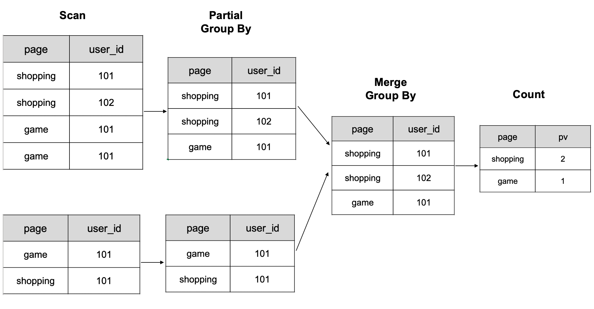

# COUNT DISTINCT 用ビットマップ

ビットマップを使用して、異なる値の数を計算する。

ビットマップは、配列内の異なる値の数を計算するための便利なツールです。この方法は、従来の Count Distinct と比較して、ストレージスペースを節約し、計算を高速化できます。配列 A が [0, n) の範囲の値を持つと仮定します。(n+7)/8 バイトのビットマップを使用することで、配列内の異なる要素の数を計算できます。これを行うには、すべてのビットを 0 に初期化し、要素の値をビットの添字として設定し、すべてのビットを 1 に設定します。ビットマップ内の 1 の数が、配列内の異なる要素の数です。

## 従来の Count Distinct

データベースのMPPアーキテクチャは、Count Distinctを使用する際にも詳細なデータを保持できます。しかし、Count Distinct 機能はクエリ処理中に複数のデータシャッフルを必要とし、これによりリソースが多く消費され、データ量が増加するにつれてパフォーマンスが線形に低下します。

以下のシナリオでは、テーブル (`dt`, `page`, `user_id`) の詳細データに基づいて UV を計算します。

|  dt      |   page   | user_id |
| :------: | :------: | :------:|
| 20191206 | game     | 101     |
| 20191206 | shopping | 102     |
| 20191206 | game     | 101     |
| 20191206 | shopping | 101     |
| 20191206 | game     | 101     |
| 20191206 | shopping | 101     |

データは以下の図に従って計算される。まず、`page` と `user_id` 列でデータをグループ化し、次に処理された結果をカウントします。



:::note
図は、2 つの BE ノードで計算された 6 行のデータの概略を示しています。
:::

大量のデータを扱う際に複数のシャッフル操作が必要な場合、計算リソースが大幅に増加する可能性があります。これによりクエリが遅くなります。しかし、ビットマップ技術を使用することで、この問題に対処し、クエリパフォーマンスを向上させることができます。

`page` でグループ化して `uv` をカウントします:

```sql
select page, count(distinct user_id) as uv from table group by page;
```

| page     | uv    |
| :------: | :---: |
| game     | 1     |
| shopping | 2     |

## ビットマップを使用した Count Distinct の利点

`COUNT(DISTINCT expr)` と比較して、ビットマップを使用することで次のような利点があります:

- ストレージスペースの削減: INT32 データの異なる値の数をビットマップで計算する場合、必要なストレージスペースは `COUNT(DISTINCT expr)` の 1/32 に過ぎません。圧縮された Roaring Bitmap は計算処理に使用され、従来のビットマップと比較してさらにストレージ使用量を削減する。
- 高速な計算: ビットマップはビット演算を使用するため、`COUNT(DISTINCT expr)` と比較して計算が高速です。異なる値の数の計算は並列処理が可能であり、これによりクエリのパフォーマンスがさらに向上する。

Roaring Bitmap の実装については、[specific paper and implementation](https://github.com/RoaringBitmap/RoaringBitmap) を参照してください。

## 使用上の注意

- ビットマップインデックスとビットマップ Count Distinct はどちらもビットマップ技術を使用しますが、それらを導入する目的と解決する問題は完全に異なります。前者は低基数の列をフィルタリングするために使用され、後者はデータ行の値列における異なる要素の数を計算するために使用されます。
- テーブルの種類 (集計テーブル、重複キーテーブル、主キーテーブル、ユニークキーテーブル) にかかわらず、値列を `BITMAP` として定義できます。ただし、テーブルの [sort key](../../table_design/indexes/Prefix_index_sort_key.md) は `BITMAP` タイプにすることはできません。
- テーブルを作成する際に、値列を `BITMAP` として定義し、集計関数を [`BITMAP_UNION`](../../sql-reference/sql-functions/bitmap-functions/bitmap_union.md) とすることができます。
- `TINYINT`、`SMALLINT`、`INT`、および `BIGINT` のデータ型に対してのみ、Roaring ビットマップを使用して異なる値の数を計算できます。他のデータ型の場合は、[グローバル辞書を構築](#global-dictionary) する必要があります。

## ビットマップを使用した Count Distinct

ページ UV の計算を例にとります。

1. 集計テーブルを作成し、`BITMAP` 列 `visit_users` を使用し、集計関数 `BITMAP_UNION` を使用します。

    ```sql
    CREATE TABLE `page_uv` (
      `page_id` INT NOT NULL COMMENT 'page ID',
      `visit_date` datetime NOT NULL COMMENT 'access time',
      `visit_users` BITMAP BITMAP_UNION NOT NULL COMMENT 'user ID'
    ) ENGINE=OLAP
    AGGREGATE KEY(`page_id`, `visit_date`)
    DISTRIBUTED BY HASH(`page_id`)
    PROPERTIES (
      "replication_num" = "3",
      "storage_format" = "DEFAULT"
    );
    ```

2. このテーブルにデータをロードします。

    `INSET INTO` を使用してデータをロードします:

    ```sql
    INSERT INTO page_uv VALUES
    (1, '2020-06-23 01:30:30', to_bitmap(13)),
    (1, '2020-06-23 01:30:30', to_bitmap(23)),
    (1, '2020-06-23 01:30:30', to_bitmap(33)),
    (1, '2020-06-23 02:30:30', to_bitmap(13)),
    (2, '2020-06-23 01:30:30', to_bitmap(23));
    ```

    データがロードされた後:

    - 行 `page_id = 1, visit_date = '2020-06-23 01:30:30'` では、`visit_users` フィールドに 3 つのビットマップ要素 (13, 23, 33) が含まれています。
    - 行 `page_id = 1, visit_date = '2020-06-23 02:30:30'` では、`visit_users` フィールドに 1 つのビットマップ要素 (13) が含まれています。
    - 行 `page_id = 2, visit_date = '2020-06-23 01:30:30'` では、`visit_users` フィールドに 1 つのビットマップ要素 (23) が含まれています。

3. ページ UV を計算します。

    ```sql
    SELECT page_id, count(distinct visit_users)
    FROM page_uv GROUP BY page_id;
    ```

    ```sql
    +-----------+------------------------------+
    |  page_id  | count(DISTINCT `visit_users`)|
    +-----------+------------------------------+
    |         1 |                            3 |
    |         2 |                            1 |
    +-----------+------------------------------+
    2 row in set (0.00 sec)
    ```

## グローバル辞書

現在、ビットマップベースの Count Distinct メカニズムは、入力が整数であることを要求します。ユーザーが他のデータ型をビットマップの入力として使用する必要がある場合、ユーザーは独自のグローバル辞書を構築して、他のデータ型（文字列型など）を整数型にマッピングする必要があります。グローバル辞書を構築するためのいくつかのアイデアがあります。

### Hive テーブルベースのグローバル辞書

このスキームでは、グローバル辞書自体が Hive テーブルであり、2 つの列を持ちます。1 つは生の値用、もう 1 つはエンコードされた Int 値用です。グローバル辞書を生成する手順は次のとおりです:

1. ファクトテーブルの辞書列を重複排除して一時テーブルを生成します
2. 一時テーブルとグローバル辞書を左ジョインし、一時テーブルに `new value` を追加します。
3. `new value` をエンコードしてグローバル辞書に挿入します。
4. ファクトテーブルと更新されたグローバル辞書を左ジョインし、辞書項目を ID に置き換えます。

この方法では、グローバル辞書を更新し、ファクトテーブルの値列を Spark または MR を使用して置き換えることができます。トライツリーベースのグローバル辞書と比較して、このアプローチは分散可能であり、グローバル辞書を再利用できます。

ただし、いくつか注意点があります: 元のファクトテーブルは複数回読み取られ、グローバル辞書の計算中に多くの追加リソースを消費する 2 つのジョインがあります。

### トライツリーに基づくグローバル辞書の構築

ユーザーは、トライツリー（プレフィックスツリーまたは辞書ツリーとも呼ばれる）を使用して独自のグローバル辞書を構築することもできます。トライツリーは、ノードの子孫に共通のプレフィックスを持ち、クエリ時間を短縮し、文字列比較を最小限に抑えることができるため、辞書エンコーディングの実装に適しています。ただし、トライツリーの実装は分散が容易ではなく、データ量が比較的大きい場合にパフォーマンスのボトルネックを引き起こす可能性があります。

グローバル辞書を構築し、他のデータ型を整数データに変換することで、ビットマップを使用して非整数データ列の正確な Count Distinct 分析を実行できます。
