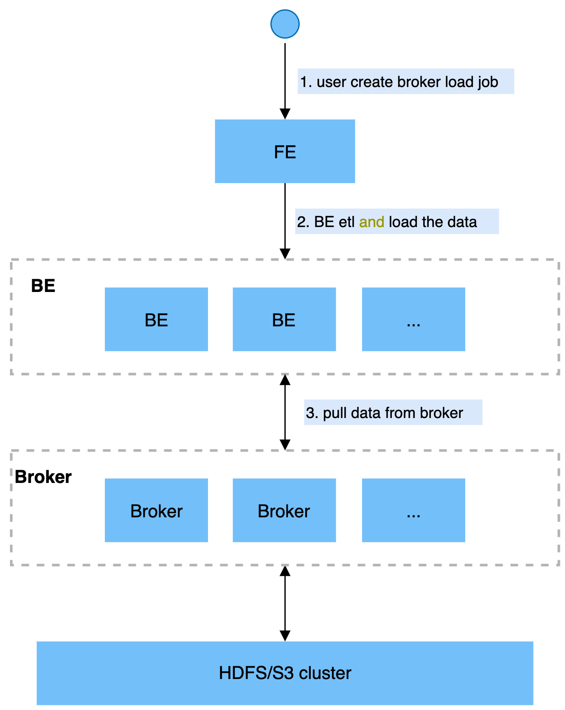

# Broker Load

StarRocks supports importing data from external storage systems such as HDFS, Amazon S3, etc. The supported file formats are CSV, ORC File, Parquet, etc. The data volume is in the range of tens to hundreds of GB.

In broker load, StarRocks reads data from the corresponding data sources (e.g. HDFS, S3) through the deployed broker program, and uses its own computing resources to pre-process and import the data. This is an **asynchronous** import method that the user needs to create the import job via the MySQL protocol and view the import result by command.

This section introduces broker load basics, examples, best practices, and frequently asked questions.

## Terminology Explanation

* Broker: Broker is a standalone stateless process that encapsulates the file system interface and provides StarRocks with the ability to read files from remote storage systems.

* Plan: Import execution plan. BE executes an import execution plan to import data into the StarRocks system.

## Fundamentals

After the user submits the import job, the FE generates and distributes the corresponding plan to multiple BEs based on the data volume. Each BE executes a part of the import job. Once all the BEs finish importing, the FE will determine whether the import is successful or not.

The following diagram shows the main flow of broker load.



## Supported Remote File Systems

* HDFS
* Amazon S3
* Alibaba Cloud OSS
* Tencent COS

## Import Example

### Broker build

Broker Load needs a broker to access the remote storage, so a broker needs to be built first.

You can refer to the manual deployment ([Deploy Broker](../quick_start/Deploy.md)).

### Create import job

**Syntax:**

~~~SQL
LOAD LABEL db_name.label_name 
    (data_desc, ...)
WITH BROKER broker_name broker_properties
    [PROPERTIES (key1=value1, ... )]

data_desc:
    DATA INFILE ('file_path', ...)
    [NEGATIVE]
    INTO TABLE tbl_name
    [PARTITION (p1, p2)]
    [COLUMNS TERMINATED BY column_separator ]
    [FORMAT AS file_type]
    [(col1, ...)]
    [COLUMNS FROM PATH AS (colx, ...)]
    [SET (k1=f1(xx), k2=f2(xx))]
    [WHERE predicate]

broker_properties: 
    (key2=value2, ...)
~~~

#### Load data from HDFS

~~~sql
LOAD LABEL db1.label1
(
    DATA INFILE("hdfs://abc.com:8888/user/palo/test/ml/file1")
    INTO TABLE tbl1
    COLUMNS TERMINATED BY ","
    (tmp_c1, tmp_c2)
    SET
    (
        id=tmp_c2,
        name=tmp_c1
    ),

    DATA INFILE("hdfs://abc.com:8888/user/palo/test/ml/file2")
    INTO TABLE tbl2
    COLUMNS TERMINATED BY ","
    (col1, col2)
    where col1 > 1
)
WITH BROKER 'broker'
(
    "username" = "hdfs_username",
    "password" = "hdfs_password"
)
PROPERTIES
(
    "timeout" = "3600"
);
~~~

#### Load data in CSV format from Amazon S3

~~~sql
LOAD LABEL example_db.label14
(
DATA INFILE("s3a://my_bucket/input/file.csv")
INTO TABLE `my_table`
(k1, k2, k3)
)
WITH BROKER my_broker
(
    "fs.s3a.access.key" = "xxxxxxxxxxxxxxxxxxxxxxxxxx",
    "fs.s3a.secret.key" = "yyyyyyyyyyyyyyyyyyyy",
    "fs.s3a.endpoint" = "s3-ap-northeast-1.amazonaws.com"
)
~~~

#### Load data from Alibaba Cloud

~~~SQL
LOAD LABEL example_db.label12
(
    DATA INFILE("oss://my_bucket/input/file.csv")
    INTO TABLE `my_table`
    (k1, k2, k3)
)
WITH BROKER my_broker
(
    "fs.oss.accessKeyId" = "xxxxxxxxxxxxxxxxxxxxxxxxxx",
    "fs.oss.accessKeySecret" = "yyyyyyyyyyyyyyyyyyyy",
    "fs.oss.endpoint" = "oss-cn-zhangjiakou-internal.aliyuncs.com"
)
~~~

#### Load data in CSV format from Tencent Cloud COS

~~~sql
LOAD LABEL example_db.label13
(
DATA INFILE("cosn://my_bucket/input/file.csv")
INTO TABLE `my_table`
(k1, k2, k3)
)
WITH BROKER my_broker
(
    "fs.cosn.userinfo.secretId" = "xxxxxxxxxxxxxxxxxxxxxxxxxx",
    "fs.cosn.userinfo.secretKey" = "yyyyyyyyyyyyyyyyyyyy",
    "fs.cosn.bucket.endpoint_suffix" = "cos.ap-beijing.myqcloud.com"
)
~~~

Here we introduce the parameters shown in the command.
  
**Label:**

The label of the import job. Each import job has **a unique label inside the database**. A label is a user-defined name in the import command. It allows the user to view the execution of the corresponding import job and it can be used to prevent the same data from being imported repeatedly. When the status of the import job is `FINISHED`, the corresponding label cannot be used again. When the status of the import job is `CANCELLED`, **the Label can be used again**.

**Data Description Parameters:**

Data description parameters refer to the parameters of the `data_desc` section in the statement. The `data_desc` statement declares the information including data source address, ETL function, target table, and partition involved in this import job. Detailed description of data description parameters are as follows:

* Multi-Table Import

Broker load supports multiple tables involved in one import job, which can be achieved by declaring multiple tables with multiple `data_desc`. Each `data-desc` shows the address of a data source belonging to **that table**. Multiple file-paths can be declared for importing the same table. Broker load guarantees the atomicity of imports.

* file_path

The file path can be specified to a single file or to all files in a directory using `*`. Intermediate directories can also be matched with wildcards.

The wildcards that can be used are ```? * [] {} ^```, [wildcard usage rules reference](https://hadoop.apache.org/docs/stable/api/org/apache/hadoop/fs/FileSystem.html#globStatus-org.apache.hadoop.fs.Path-).

For example:
Users can match all files in all partitions under `tablename` by `hdfs://hdfs_host:hdfs_port/user/data/tablename/*/*` .
Users can match all files in all `April` partitions under `tablename`by `hdfs://hdfs_host:hdfs_port/user/data/tablename/dt=202104*/*`.

* negative

`Data_desc` also allows you to reverse the imported data. This function is applicable when the aggregated columns in the data table are all of the `SUM` type. If you want to undo a batch of imported data, you can import the same batch of data with the `negative` parameter. StarRocks will automatically invert the data on the aggregated columns, and yet remove the imported data.

* partition

     `data_desc` allows you to specify the partition of the table to where data is imported. If the data to be imported does not belong to the specified partition, it will not be imported and considered as "wrong data". For data that you do not want to import nor to record as "wrong data", you can use `where predicate` to filter it.

* column separator

Specify the column separator in the import file. The default is `t`.

If it is an invisible character, you need to add `x` as a prefix and use hexadecimal to represent the separator. For example, the separator `x01` of the hive file is specified as `\x01`.

* file type

Specify the type of the imported file (e.g. parquet, orc, csv). The default is csv.

The parquet type can also be recognized by the file suffix **.parquet** or **.parq**.

* COLUMNS FROM PATH AS

Extracts the partition fields in the file path.

Example: If the imported file is `/path/col_name=col_value/dt=20210101/file1`, and `col_name/dt` is a column in the table, set the following statement to import `col_value` and `20210101` into the columns `col_name` and `dt` respectively.

~~~SQL
...
(col1, col2)
COLUMNS FROM PATH AS (col_name, dt)
~~~

* set column mapping

The `SET` statement in `data_desc` is responsible for setting a column’s **conversion function**, which supports all equivalent functions. This statement is needed if the columns of the original data do not correspond to the columns in the table.

* where predicate

The `WHERE` statement in `data_desc` is responsible for filtering the data that has been transformed. The filtered data is not counted in the tolerance rate. If multiple conditions about the same table are declared in multiple `data-desc`, they are merged with `AND`.

**Import job parameters:**

Import job parameters are parameters that belong to the `opt_properties` section, and are applied to the entire import job. See the following for parameter details.

* timeout

The timeout value (in seconds) for importing jobs. You can set the timeout value for each import in `opt_properties`. The import job will be `CANCELLED` if it is not completed within the set time limit. The default import timeout for broker load is 4 hours.

> Note: Normally, users do not need to set this parameter unless the import cannot be completed within the default time.

The recommended timeout value is calculated as follows.

`Timeout value > ((Total file size (MB) * Number of tables to be imported and related Roll up tables) / (10 * Number of import concurrency))`

`number of import concurrency` is described in the import system configuration at the end of the document. `10` indicates the current default speed limit for BE import (i.e. 10MB/s).

For example, for a 1GB data to be imported to a table which contains 2 rollup tables, with an import concurrency of 3, the minimum value of timeout is (1 \* 1024 \* 3 ) / (10 \* 3) = 102 seconds.

Since each StarRocks cluster has its unique machine environment and different concurrent query tasks, the slowest import speed of a StarRocks cluster needs to be speculated by the user based on the historical import job speed.

* max_filter_ratio

The maximum fault tolerance rate of the import job with a default value of 0 and a range of 0 to 1. When the error rate of the import job exceeds this value, the job will fail.

Users can set this value greater than 0 to ensure data import despite erroneous rows.

The calculation formula is

`max_filter_ratio = (dpp.abnorm.ALL / (dpp.abnorm.ALL + dpp.norm.ALL ) )`

<<<<<<< HEAD
`dpp.abnorm.ALL` is the number of rows with unqualified data quality, such as type mismatch, column mismatch, length mismatch, etc.
=======
| **Parameter** | **Description**                                              |
| ------------- | ------------------------------------------------------------ |
| dbName        | The name of the database into which data is loaded           |
| tblNames      | The name of the table into which data is loaded.             |
| label         | The label of the load job.                                   |
| state         | The status of the load job. Valid values:<ul><li>`PENDING`: The load job is in queue waiting to be scheduled.</li><li>`LOADING`: The load job is running.</li><li>`FINISHED`: The load job succeeded.</li><li>`CANCELLED`: The load job failed.</li></ul>For more information, see the "Asynchronous loading" section in [Overview of data loading](/docs/loading/Loading_intro.md). |
| failMsg       | The reason why the load job failed. If the `state` value for the load job is `PENDING`, `LOADING`, or `FINISHED`, `NULL` is returned for the `failMsg` parameter. If the `state` value for the load job is `CANCELLED`, the value returned for the `failMsg` parameter consists of two parts: `type` and `msg`.<ul><li>The `type` part can be any of the following values:</li><ul><li>`USER_CANCEL`: The load job was manually canceled.</li><li>`ETL_SUBMIT_FAIL`: The load job failed to be submitted.</li><li>`ETL-QUALITY-UNSATISFIED`: The load job failed because the percentage of unqualified data exceeds the value of the `max-filter-ratio` parameter.</li><li>`LOAD-RUN-FAIL`: The load job failed in the `LOADING` stage.</li><li>`TIMEOUT`: The load job failed to finish within the specified timeout period.</li><li>`UNKNOWN`: The load job failed due to an unknown error.</li></ul><li>The `msg` part provides the detailed cause of the load failure.</li></ul> |
| trackingUrl   | The URL that is used to access the unqualified data detected in the load job. You can use the `curl` or `wget` command to access the URL and obtain the unqualified data. If no unqualified data is detected, `NULL` is returned for the `trackingUrl` parameter. |
| status        | The status of the HTTP request for the load job. Valid values: `OK` and `Fail`. |
| msg           | The error information of the HTTP request for the load job.  |
>>>>>>> 1b4edf85c (add </li> in BrokerLoad (#10759))

`dpp.norm.ALL` is the number of rows with correct data during the import. Users can use the `SHOW LOAD` command to check the correct amount of data for the import job.

Number of rows in the original file = dpp.abnorm.ALL + dpp.norm.ALL

* exec_mem_limit

Import memory limit (in bytes), with a default value of 2GB.

* strict_mode

The `strict_mode` of broker load can be turned on by setting      "strict_mode" = "true". The default is off.

Strict mode means to strictly filter column type conversion during import. The strict filtering policy is as follows.

1.For column type conversion, the wrong data will be filtered out under strict mode. Here the wrong data refers to data which is not null originally but turned into null after being converted.

However, this policy does not apply to the following scenarios     :

1. For an imported column **generated by a conversion function**, strict mode has no effect on it.
2. An imported column containing a range restriction can be converted to a target type regardless of its range restriction. The strict mode will have no effect on it. For example, if the data type of the target column is `decimal(1,0)`, but the original data being imported is `10`, the import can satisfy the type conversion but not the range restriction. In this case, strict mode has no effect on the import.

### Checking import job status

Broker load is asynchronous, and users can specify labels in the `SHOW LOAD` command to check execution status. It should be noted that the `SHOW LOAD` command can only be used to view load jobs being asynchronously imported. Synchronous load jobs, such as stream load, cannot be viewed with the `SHOW LOAD` command.

Example:

~~~sql
mysql> show load where label = 'label1'\G
*************************** 1. row ***************************
         JobId: 76391
         Label: label1
         State: FINISHED
      Progress: ETL:N/A; LOAD:100%
          Type: BROKER
       EtlInfo: unselected.rows=4; dpp.abnorm.ALL=15; dpp.norm.ALL=28133376
      TaskInfo: cluster:N/A; timeout(s):10800; max_filter_ratio:5.0E-5
      ErrorMsg: N/A
    CreateTime: 2019-07-27 11:46:42
  EtlStartTime: 2019-07-27 11:46:44
 EtlFinishTime: 2019-07-27 11:46:44
 LoadStartTime: 2019-07-27 11:46:44
LoadFinishTime: 2019-07-27 11:50:16
           URL: http://192.168.1.1:8040/api/_load_error_log?file=__shard_4/error_log_insert_stmt_4bb00753932c491a-a6da6e2725415317_4bb00753932c491a_a6da6e2725415317
    JobDetails: {"Unfinished backends":{"9c3441027ff948a0-8287923329a2b6a7":[10002]},"ScannedRows":2390016,"TaskNumber":1,"All backends":{"9c3441027ff948a0-8287923329a2b6a7":[10002]},"FileNumber":1,"FileSize":1073741824}
~~~

The following describes the parameters returned by the `SHOW LOAD` command.

* JobId: The unique ID of the imported job. The JobId is different for each imported job and is automatically generated by the system. Unlike labels, JobId **will never be the same**, while labels can be reused after the import job fails.
* Label: Identifier of the imported job.
* State: The current state of the import job. The two main states of an import –-`PENDING` and `LOADING`-- occur during the broker load. `PENDING` indicates the import job is waiting to be executed, while `LOADING` indicates the job is being executed.
* There are two final stages of an import job –`CANCELLED` and `FINISHED`; both indicate the import job is completed. `CANCELLED` indicates an import failure, while `FINISHED` indicates an import success.
* Progress: The progress description of the import job. There are two types of progress –`ETL` and `LOAD`, both of which      correspond to the two phases of the import process. `ETL` is fixed to `N/A` since the broker load does not have this stage presently, while the progress range of `load` is 0~100%. `Load progress = (the number of tables currently completed import / the total number of tables designed for this import job) * 100%`
* The load progress will be 99% after all data have been imported and changed to 100% after the import takes effect.

> Note: The import progress is not linear, so if the progress does not change for a period of time, it does not mean that the import is not executing.

* Type: The type of the imported job. Type for broker load takes the value `BROKER`.
* EtlInfo: Contains parameters of the imported data volume, such as `unselected.rows`, `dpp.norm.ALL` and `dpp.abnorm.ALL`. The first parameter can be used to determine how many rows are filtered by the `where` condition, and the last two parameters verify that the error rate of the current import job does not exceed      `max-filter-ratio`. The sum of the three parameters is the total number of rows in the original data volume.
* TaskInfo: Mainly shows parameters of the current import job, that is, the parameters specified by the user when creating the Broker Load import job. Those include cluster, timeout and max-filter-ratio.
* ErrorMsg: If the status of the import job is `CANCELLED`, the reason for failure is displayed by ErrorMsg. Each ErrorMsg includes type and msg. N/A is displayed if the import job is successful.
  
The meaning of the values of **type** :

* USER-CANCEL: The job that is cancelled by the user.
* ETL-RUN-FAIL: The job that failed in the ETL phase.
* ETL-QUALITY-UNSATISFIED: Data quality failed, i.e. the error data rate exceeded max-filter-ratio.
* LOAD-RUN-FAIL: The job that failed in the LOADING phase.
* TIMEOUT: The job that failed to complete within the timeout period.
* UNKNOWN: Unknown import error.

* CreateTime/EtlStartTime/EtlFinishTime/LoadStartTime/LoadFinishTime: This value represents the import creation time, ETL phase start time, ETL phase completion time, Loading phase start time and the entire import job completion time.
* Broker Load import has no ETL phase, so its `EtlStartTime`, `EtlFinishTime`, `LoadStartTime` are set to the same value.
* If the import job stays at `CreateTime` for a long time and `LoadStartTime` is N/A, the import job is currently heavily stacked and the user should reduce the frequency of import commits.

`LoadFinishTime - CreateTime = time consumed by the entire import task`

`LoadFinishTime - LoadStartTime = execution time of the entire Broker load import job = time consumed by the entire import job - wait time of the import job`.

* URL: Sample error data for the import job, which can be obtained by accessing the URL address. When no error data exists for this import, the URL field is N/A.
* JobDetails: Shows the detailed status of the job, including the number of imported files, the total size (bytes), the number of subtasks, the number of raw rows processed, the BE node Id of running subtasks, and the BE node id of incomplete jobs.

`{"Unfinished backends":{"9c3441027ff948a0-8287923329a2b6a7":[10002]},"ScannedRows":2390016,"TaskNumber":1,"All backends":{"9c3441027ff948a0-8287923329a2b6a7":[10002]},"FileNumber":1,"FileSize":1073741824}`

The original number of rows processed is updated every 5 seconds. This number of rows is only used to show the current progress, and does not represent the actual number of rows processed in total. The total number of rows processed is displayed in EtlInfo.

### Cancel import job

When the status of the broker load job is not `CANCELLED` or `FINISHED`, it can be cancelled manually by the user. To cancel, specify the label of the import job.

## Related Configuration

### Parallelism

A job can be split into one or more subtasks, and the subtasks are executed in parallel. The splitting is determined by the DataDescription in the `LOAD` statement. For example,

1. When multiple `DataDescriptions` correspond to the import of multiple different tables, each will be split into one subtask.
2. When multiple `DataDescriptions` correspond to the import of different partitions of the same table, each will also be split into one subtask.

Each task is also split into one or more instances, which are then equally distributed to BEs for parallel execution. The splitting =is determined by the following FE configuration.
``min_bytes_per_broker_scanner``: The minimum amount of data to be processed by a single instance, with a default value of 64MB.
``max_broker_concurrency``: The maximum number of concurrent instances for a single job, with a default value of 100.
``load_parallel_instance_num``: The number of concurrent instances on a single BE, with a default value of 1.
`Total number of instances = min(total import file size / minimum amount of data handled by a single instance, maximum number of concurrent instances for a single job, number of concurrent instances on a single BE * number of BEs)`

In general, a job has only one `DataDescription` and will be split into only one task. The task will be split into instances equal to the number of BEs and then assigned to those BEs for parallel execution.

## Frequently Asked Questions

* Q: Error reported for data quality issue: `ETL_QUALITY_UNSATISFIED; msg:quality not good enough to cancel`.

    A: Please refer to Import Overview/FAQ`.

* Q: Import error: `failed to send batch` or `TabletWriter add batch with unknown id`.

    A: Modify `query_timeout` and `streaming_load_rpc_max_alive_time_sec` appropriately. Please refer to Import Overview/Common System Configuration/BE Configuration      .

* Q：Import error: `LOAD-RUN-FAIL; msg:Invalid Column Name:xxx`

A：If the data is in parquet or ORC format, keep the column name in the file header consistent with the one in the StarRocks table, for example:
    ~~~sql
    (tmp_c1,tmp_c2)
    SET
    (
       id=tmp_c2,
       name=tmp_c1
    )
    ~~~

This means the column with (tmp_c1, tmp_c2) as column name in parquet or ORC file is mapped to (id, name) column in the StarRocks table. If `SET` is not declared, the columns are imported in order.

> Note: If you use ORC files generated directly from some versions of Hive, the table header in the ORC file is not Hive meta data but `(_col0, _col1, _col2, ...)`, which may lead to `Invalid Column Name error`. In that case, use `set` for mapping.

* Q：Other errors.
  
  A: For other issues such as jobs that take a long time to complete, you can go to `log/be.INFO` in BE and search for `kafka error` for specific reasons.

* Q: How to configure Hadoop HA
  
  A: The following configuration is used to access an HDFS cluster deployed in HA mode.

    `dfs.nameservices`: Customized name of the HDFS service, e.g. `dfs.nameservices` = `my_ha`.

    `dfs.ha.namenodes.xxx`: Customized name of the namenode as the `xxx`, multiple names can be separated by commas, e.g. "dfs.ha.namenodes.my_ha" = "my_nn".

`dfs.namenode.rpc-address.xxx.nn`: The rpc address for the namenode where nn indicates the name of the configured namenode in `dfs.ha.namenodes.xxx`. e.g. "dfs.namenode.rpc-address.my_ha.my_nn" = "host:port".

`dfs.client.failover.proxy.provider`: The provider of the client to connect to the namenode with a default value of `org.apache.hadoop.hdfs.server.namenode.ha. ConfiguredFailoverProxyProvider`.

For example:

 ~~~sql
 (
    "dfs.nameservices" = "my-ha",
    "dfs.ha.namenodes.my-ha" = "my-namenode1, my-namenode2",
    "dfs.namenode.rpc-address.my-ha.my-namenode1" = "nn1-host:rpc_port",
    "dfs.namenode.rpc-address.my-ha.my-namenode2" = "nn2-host:rpc_port",
    "dfs.client.failover.proxy.provider" = "org.apache.hadoop.hdfs.server.namenode.ha.ConfiguredFailoverProxyProvider"
)

 ~~~

HA mode can be combined with the previous two authentication methods for cluster access. For example, accessing HA HDFS through simple authentication:

~~~sql
(
    "username"="user",
    "password"="passwd",
    "dfs.nameservices" = "my-ha",
    "dfs.ha.namenodes.my-ha" = "my_namenode1, my_namenode2",
    "dfs.namenode.rpc-address.my-ha.my-namenode1" = "nn1-host:rpc_port",
    "dfs.namenode.rpc-address.my-ha.my-namenode2" = "nn2-host:rpc_port",
    "dfs.client.failover.proxy.provider" = "org.apache.hadoop.hdfs.server.namenode.ha.ConfiguredFailoverProxyProvider"
)

~~~

HDFS cluster configuration can be written in the `hdfs-site.xml file`. When using the Broker process to read information of an HDFS cluster, fill in the file path name and authentication information of the cluster.

* Q: How to configure Hadoop ViewFS (federation)

  A: Copy the ViewFS related configuration `core-site.xml` and `hdfs-site.xml` to `broker/conf`.

If there is a custom FileSystem, copy the relevant jar to      `broker/lib`.
