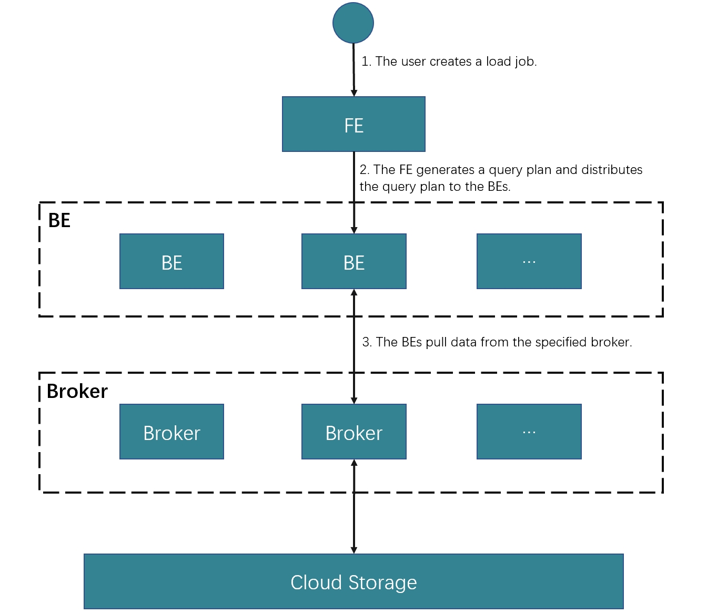

# Load data from HDFS or cloud storage

StarRocks provides the loading method MySQL-based Broker Load to help you load dozens to hundreds of gigabytes of data from HDFS or cloud storage into StarRocks.

Broker Load runs in asynchronous loading mode. After you submit a load job, StarRocks asynchronously runs the job. You need to use the [SHOW LOAD](../sql-reference/sql-statements/data-manipulation/SHOW_LOAD.md) statement or the `curl` command to check the result of the job.

Broker Load supports loading one or more data files at a time. Additionally, Broker Load supports data transformation at data loading. For more information, see [Transform data at loading](../loading/Etl_in_loading.md).

## Background information

Broker Load requires a broker to set up a connection between your StarRocks cluster and your storage system. A broker is an independent, stateless service that is integrated with a file-system interface. With a broker, StarRocks can access and read data files that are stored in your storage system, and can use its own computing resources to pre-process and load the data of these data files.

## Supported data file formats

Broker Load supports the following data file formats:

- CSV

- Parquet

- ORC

## Supported storage systems

Broker Load supports the following storage systems:

- HDFS

- Amazon S3

- Google GCS

## Prerequisites

A broker is deployed in your StarRocks cluster.

You can use the [SHOW BROKER](../sql-reference/sql-statements/Administration/SHOW_BROKER.md) statement to check for brokers that are deployed in your StarRocks cluster. If no broker is deployed, you must deploy a broker by following the instructions provided in [Deploy a broker](../quick_start/Deploy.md#broker-deployment).

In this topic, assume that a broker named mybroker is deployed in your StarRocks cluster.

## Principles

After you submit a load job to an FE, the FE generates a query plan, splits the query plan into portions based on the number of BEs and the size of the data file you want to load, and then assigns each portion of the query plan to a specific BE. During the load, each BE pulls the data of the data file by using the broker, pre-processes the data, and then loads the data into your StarRocks cluster. After all BEs finish their portions of the query plan, the FE determines whether the load job is successful.

The following figure shows the workflow of a Broker Load job.



## Basic operations

### Create a load job

This topic uses CSV as an example to describe how to load data. For information about how to load data in other file formats and about the syntax and parameter descriptions for Broker Load, see [BROKER LOAD](../sql-reference/sql-statements/data-manipulation/BROKER_LOAD.md).

#### Data examples

1. In your StarRocks database `test_db`, create StarRocks tables.

   a. Create a table named `table1` that uses the Primary Key model. The table consists of three columns: `id`, `name`, and `score`, of which `id` is the primary key.

   ```SQL
   MySQL [test_db]> CREATE TABLE `table1`
   (
       `id` int(11) NOT NULL COMMENT "user ID",
       `name` varchar(65533) NULL DEFAULT "" COMMENT "user name",
       `score` int(11) NOT NULL DEFAULT "0" COMMENT "user score"
   )
   ENGINE=OLAP
   PRIMARY KEY(`id`)
   DISTRIBUTED BY HASH(`id`) BUCKETS 10;
   ```

   b. Create a table named `table2` that uses the Primary Key model. The table consists of two columns: `id` and `city`, of which `id` is the primary key.

   ```SQL
   MySQL [test_db]> CREATE TABLE `table2`
   (
       `id` int(11) NOT NULL COMMENT "city ID",
       `city` varchar(65533) NULL DEFAULT "" COMMENT "city name"
   )
   ENGINE=OLAP
   PRIMARY KEY(`id`)
   DISTRIBUTED BY HASH(`id`) BUCKETS 10;
   ```

2. In your local file system, create CSV files.

   a. Create a CSV file named `file1.csv`. The file consists of three columns, which represent user ID, user name, and user score in sequence.

   ```Plain
   1,Lily,23
   2,Rose,23
   3,Alice,24
   4,Julia,25
   ```

   b. Create a CSV file named `file2.csv`. The file consists of two columns, which represent city ID and city name in sequence.

   ```Plain
   200,'Beijing'
   ```

3. Upload `file1.csv` and `file2.csv` to the `/user/starrocks/` path of your HDFS cluster, to the `/input/` folder of your Amazon S3 bucket `bucket_s3`, and to the `/input/` folder of your Google CGS bucket `bucket_gcs`.

#### Load data from HDFS

Execute the following statement to load `file1.csv` and `file2.csv` from the `/user/starrocks` path of your HDFS cluster into `table1` and `table2`, respectively:

```SQL
LOAD LABEL test_db.label1
(
    DATA INFILE("hdfs://<hdfs_host>:<hdfs_port>/user/starrocks/file1.csv")
    INTO TABLE table1
    COLUMNS TERMINATED BY ","
    (id, city)

    DATA INFILE("hdfs://<hdfs_host>:<hdfs_port>/user/starrocks/file2.csv")
    INTO TABLE table2
    COLUMNS TERMINATED BY ","
    (id, name, score)
)
WITH BROKER "mybroker"
(
    "username" = "hdfs_username",
    "password" = "hdfs_password"
)
PROPERTIES
(
    "timeout" = "3600"
);
```

#### Load data from Amazon S3

Execute the following statement to load `file1.csv` and `file2.csv` from the `/input/` folder of your Amazon S3 bucket `bucket_s3` into `table1` and `table2`, respectively:

```SQL
LOAD LABEL test_db.label2
(
    DATA INFILE("s3a://bucket_s3/input/file1.csv")
    INTO TABLE table1
    (id, city)
    
    DATA INFILE("s3a://bucket_s3/input/file2.csv")
    INTO TABLE table2
    (id, name, score)
)
WITH BROKER "mybroker"
(
    "fs.s3a.access.key" = "xxxxxxxxxxxxxxxxxxxx",
    "fs.s3a.secret.key" = "yyyyyyyyyyyyyyyyyyyy",
    "fs.s3a.endpoint" = "s3.ap-northeast-1.amazonaws.com"
)
```

> Note: S3A is used for data loads from Amazon S3. Therefore, the file paths that you specify must start with the prefix `s3a://`.

#### Load data from Google GCS

Execute the following statement to load `file1.csv` and `file2.csv` from the `/input/` folder of your Google GCS bucket `bucket_gcs` into `table1` and `table2`, respectively:

```SQL
LOAD LABEL test_db.label3
(
    DATA INFILE("s3a://bucket_gcs/input/file1.csv")
    INTO TABLE table1
    (id, city)
    
    DATA INFILE("s3a://bucket_gcs/input/file2.csv")
    INTO TABLE table2
    (id, name, score)
)
WITH BROKER "mybroker"
(
    "fs.s3a.access.key" = "xxxxxxxxxxxxxxxxxxxx",
    "fs.s3a.secret.key" = "yyyyyyyyyyyyyyyyyyyy",
    "fs.s3a.endpoint" = "storage.googleapis.com"
)
```

> Note: S3A is used for data loads from Amazon S3. Therefore, the file paths that you specify must start with the prefix `s3a://`.

### Query data

After the load of data from your HDFS cluster, Amazon S3 bucket, or Google GCS bucket is complete, you can use the SELECT statement to query the data of the StarRocks tables to verify that the load is successful.

1. Execute the following statement to query the data of `table1`:

   ```SQL
   MySQL [test_db]> SELECT * FROM table1;
   +------+-------+-------+
   | id   | name  | score |
   +------+-------+-------+
   |    1 | Lily  |    23 |
   |    2 | Rose  |    23 |
   |    3 | Alice |    24 |
   |    4 | Julia |    25 |
   +------+-------+-------+
   4 rows in set (0.00 sec)
   ```

1. Execute the following statement to query the data of `table2`:

   ```SQL
   MySQL [test_db]> SELECT * FROM table2;
   +------+--------+
   | id   | city   |
   +------+--------+
   | 200  | Beijing|
   +------+--------+
   4 rows in set (0.01 sec)
   ```

### View a load job

Broker Load allows you to view a lob job by using the SHOW LOAD statement or the `curl` command.

#### Use SHOW LOAD

For more information, see [SHOW LOAD](../sql-reference/sql-statements/data-manipulation/SHOW_LOAD.md).

#### Use curl

The syntax is as follows:

```Bash
curl --location-trusted -u root: \
    'http://<fe_host>:<fe_http_port>/api/<database_name>/_load_info?label=<label_name>'
```

For example, you can run the following command to view the information about a load job, whose label is `label1`, in the `test_db` database:

```Bash
curl --location-trusted -u root: \
    'http://<fe_host>:<fe_http_port>/api/test_db/_load_info?label=label1'
```

The `curl` command returns the information about the load job as a JSON object `jobInfo`:

```JSON
{"jobInfo":{"dbName":"default_cluster:test_db","tblNames":["table1_simple"],"label":"label1","state":"FINISHED","failMsg":"","trackingUrl":""},"status":"OK","msg":"Success"}%
```

The following table describes the parameters in `jobInfo`.

| **Parameter** | **Description**                                              |
| ------------- | ------------------------------------------------------------ |
| dbName        | The name of the database into which data is loaded           |
| tblNames      | The name of the table into which data is loaded.             |
| label         | The label of the load job.                                   |
| state         | The status of the load job. Valid values:<ul><li>`PENDING`: The load job is in queue waiting to be scheduled.</li><li>`LOADING`: The load job is running.</li><li>`FINISHED`: The load job succeeded.</li><li>`CANCELLED`: The load job failed.</li></ul>For more information, see the "Asynchronous loading" section in [Overview of data loading](../loading/Loading_intro.md). |
| failMsg       | The reason why the load job failed. If the `state` value for the load job is `PENDING`, `LOADING`, or `FINISHED`, `NULL` is returned for the `failMsg` parameter. If the `state` value for the load job is `CANCELLED`, the value returned for the `failMsg` parameter consists of two parts: `type` and `msg`.<ul><li>The `type` part can be any of the following values:</li><ul><li>`USER_CANCEL`: The load job was manually canceled.</li><li>`ETL_SUBMIT_FAIL`: The load job failed to be submitted.</li><li>`ETL-QUALITY-UNSATISFIED`: The load job failed because the percentage of unqualified data exceeds the value of the `max-filter-ratio` parameter.</li><li>`LOAD-RUN-FAIL`: The load job failed in the `LOADING` stage.</li><li>`TIMEOUT`: The load job failed to finish within the specified timeout period.</li><li>`UNKNOWN`: The load job failed due to an unknown error.</li></ul><li>The `msg` part provides the detailed cause of the load failure.</li></ul> |
| trackingUrl   | The URL that is used to access the unqualified data detected in the load job. You can use the `curl` or `wget` command to access the URL and obtain the unqualified data. If no unqualified data is detected, `NULL` is returned for the `trackingUrl` parameter. |
| status        | The status of the HTTP request for the load job. Valid values: `OK` and `Fail`. |
| msg           | The error information of the HTTP request for the load job.  |

### Cancel a load job

When a load job is not in the **CANCELLED** or **FINISHED** stage, you can use the [CANCEL LOAD](../sql-reference/sql-statements/data-manipulation/CANCEL_LOAD.md) statement to cancel the job.

For example, you can execute the following statement to cancel a load job, whose label is `label1`, in the database `test_db`:

```SQL
CANCEL LOAD
FROM test_db
WHERE LABEL = "label";
```

## Job splitting and concurrent running

A Broker Load job can be split into one or more tasks that concurrently run. The tasks within a load job are run within a single transaction. They must all succeed or fail. StarRocks splits each load job based on how you declare `data_desc` in the `LOAD` statement:

- If you declare multiple `data_desc` parameters, each of which specifies a distinct table, a task is generated to load the data of each table.

- If you declare multiple `data_desc` parameters, each of which specifies a distinct partition for the same table, a task is generated to load the data of each partition.

Additionally, each task can be further split into one or more instances, which are evenly distributed to and concurrently run on the BEs of your StarRocks cluster. StarRocks splits each task based on the following [FE configurations](../administration/Configuration.md#fe-configuration-items):

- `min_bytes_per_broker_scanner`: the minimum amount of data processed by each instance. The default amount is 64 MB.

- `max_broker_concurrency`: the maximum number of concurrent instances allowed in each task. The default maximum number is 100.

- `load_parallel_instance_num`: the number of concurrent instances allowed in each load job on an individual BE. The default number is 1.
  
  You can use the following formula to calculate the number of instances in an individual task:

  **Number of instances in an individual task = min(Amount of data to be loaded by an individual task/****`min_bytes_per_broker_scanner`****,** **`max_broker_concurrency`****,** **`load_parallel_instance_num`** **x Number of BEs)**

In most cases, only one `data_desc` is declared for each load job, each load job is split into only one task, and the task is split into the same number of instances as the number of BEs.
