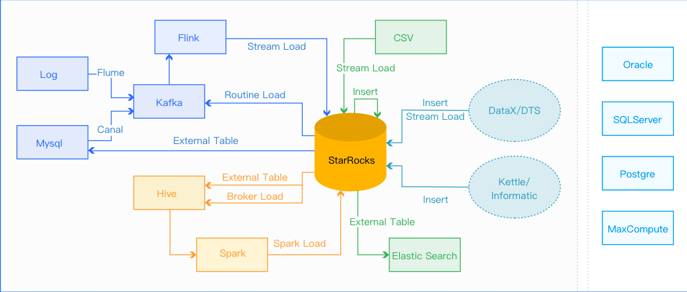
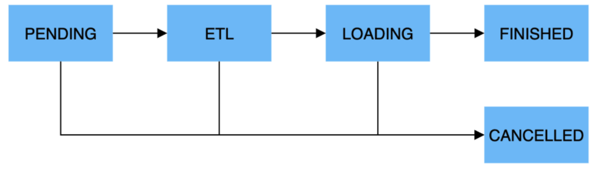

# Data import

StarRocks supports multiple data models (refer to [Table Design](../table_design/Table_design.md) chapter) for different business scenarios. The data import function aims to clean and transform the raw data according to the specific model and load it into StarRocks.

StarRocks supports a variety of import methods. Users can choose the most suitable method based on the data size and import frequency. This section introduces the basic concepts, principles, system configuration, suitable scenarios of different import methods, as well as best practices and frequently asked questions.

> Note: It is recommended to read this whole section first, and then dive into the details of your selected import method.

Choose the import methods based on your data source.

* Offline data import. If the data source is Hive/HDFS, [Broker Load](./BrokerLoad.md) is recommended. If there are many data tables, consider using [Hive external table](../using_starrocks/External_table.md) for direct query.The performance may be worse than `Broker Load`, but it doesn’t require data relocation. If a table has a large data volume, or needs the global data dictionary for precise deduplication, choose [Spark  Load](./SparkLoad.md).
* Real-time data import. It is recommended to import log and binlog data to StarRocks via [Routine load](./RoutineLoad.md) after they are synchronized to Kafka. StarRocks has a standard [Flink-connector](./Flink-connector-starrocks.md) to facilitate the use of Flink jobs.
* Write to StarRocks programmatically. It is recommended to use [Stream  Load](./StreamLoad.md).
* Text file import. It is recommended to use `Stream  Load`.
* Mysql data import. It is recommend to use [MySQL external table](../using_starrocks/External_table.md#MySQLExternalTables) to import (`insert into new_table select * from external_table`)
* Other data sources to import. It is recommended to use DataX import. StarRocks provides [DataX-StarRocks-writer](./DataX-starrocks-writer.md)
*StarRocks internal import. It is recommended to use [insert into tablename select](./InsertInto.md) inside StarRocks, which can work with an external scheduler for simple ETL processing.

## Basic Concepts

* **Import job**: The import job reads the source data and performs cleaning and transformation, then imports the data into the StarRocks system. Once the import is complete, the data is ready to be queried.
* **Label**: Each import job has a unique label that identifies them. The label can be specified by the user or generated automatically by the system. The Label is unique within a database, i.e., it can be used for only one successful import job. The label cannot be used again unless the corresponding import job is failed. This mechanism ensures that the data corresponding to each label is imported At-Most-Once.
* **Atomicity**: All import methods in StarRocks provide atomicity guarantee, i.e. data within the same import job is either all valid or none;there is no data being partially imported. The valid data does not include data that is filtered due to data quality issues such as type conversion errors. See the data quality issues listed in the FAQ section.
* **MySQL Protocol/HTTP Protocol**: StarRocks provides two protocol interfaces: MySQL protocol and HTTP protocol. Some imports use the MySQL protocol interface to submit jobs, and others use the HTTP protocol interface instead.
* **Broker Load**: Reads data from external data sources (e.g. HDFS) and imports it to StarRocks. The Broker uses its own computational resources to pre-process the data for import.
* **Spark  Load**: StarRocks completes the import by reading an intermediate file that has been pre-processed and generated by an external resource such as Spark. This is an asynchronous import method – users need to initiate the import through the MySQL protocol and view the import result using the command.
* **FE**: Frontend, the node where StarRocks stores metadata and performs scheduling. It is mainly responsible for generating import execution plans and scheduling import jobs.
* **BE**: Backend, the computing and storage node of StarRocks. It is mainly responsible for the ETL and storage of data in the import process.
* **Tablet**: Logical partitioning of StarRocks tables. A table can be divided into multiple tablets according to partitioning and bucketing rules (refer to [Data Distribution](section [Data Distribution.md](../table_design/Data_distribution.md))).

## Fundamentals

Import execution flow.

  
An import job is divided into five main phases.

1. **PENDING**

    Not required. This phase is when the user submits the import job and waits for the FE to schedule an execution.

    This step is included in `Broker Load` and `Spark  Load`.

2. **ETL**

    Not required. This phase performs pre-processing of data, including cleaning, partitioning, sorting, aggregation, and etc.

    This step is included in `Spark Load`, which uses external computing resources to complete ETL.

3. **LOADING**

    Data is first cleaned and converted in this stage, and then sent to the BE for processing. Now all data is imported and waiting to take effect, the status of the import job is `LOADING`.

4. **FINISHED**

    After all data has taken effect, the status of the job becomes `FINISHED`. `FINISHED` is the final phase, after which the data can be queried.

5. **CANCELLED**

    The job can be cancelled at any time before its status changes to `FINISHED`.

Data import format：

* Integer (TINYINT, SMALLINT, INT, BIGINT, LARGEINT): `1, 1000, 1234`
* Floating-point (FLOAT, DOUBLE, DECIMAL): `1.1, 0.23, .356`
* Date (DATE, DATETIME): `2017-10-03, 2017-06-13 12:34:03`
* String (CHAR, VARCHAR): `I am a student, a`
* NULL value: `\N`

## Import method

### Introduction of import methods

StarRocks provides five import methods to support different data sources (such as HDFS, Kafka, local files, etc.) and different sync rules (asynchronous or synchronous).

All import methods support CSV data format. The `Broker Load` also supports parquet and ORC data formats.

1. **Broker Load**

    `Broker Load` accesses and reads the external data source through the Broker process and then creates an import job to StarRocks using the MySQL protocol. The submitted job is executed asynchronously and the user can view the import results with the `SHOW LOAD` command.

    `Broker Load` is suitable for source data in storage systems that are accessible to the Broker process (e.g. HDFS). Supported data volume is up to tens to hundreds of GB of data.

2. **Spark Load**

    To save computing resources and improve the performance of importing large data volumes, `Spark Load` enables pre-processing of data with external Spark resources. `Spark Load` is an asynchronous import method that requires to use the MySQL protocol to initiate import jobs. Users can view the import results with the `SHOW LOAD` command.

    `Spark Load` is suitable for initial migration of large data volumes (up to TB level) to StarRocks. The data needs to be stored in a Spark-accessible storage system (e.g. HDFS).

3. **Stream Load**

    `Stream Load` is a synchronous import method. Users can send a request via the HTTP protocol to import a local file or data stream into StarRocks and wait for the system to return the results to determine whether the import was successful.

    `Stream Load` is suitable for importing local files or importing data from a data stream through a program.

4. **Routine Load**

    Routine Load automates data import from a specified data source. Users can submit a Routine Import job via the MySQL protocol, generating a resident thread that reads data from a data source (such as Kafka) and imports it into StarRocks without interruption.

5. **Insert into**

<<<<<<< HEAD
    Similar to the `Insert` statement in MySQL, StarRocks provides `INSERT INTO tbl SELECT ... ;` to read data from a StarRocks table and import it to another table, and `INSERT INTO tbl VALUES(...) ;` to insert a single piece of data.
=======
| Loading method     | Protocol | Business scenario                                            | Data volume per load job                                     | Data source                                                  | Data file format      | Loading mode |
| ------------------ | -------- | ------------------------------------------------------------ | ------------------------------------------------------------ | ------------------------------------------------------------ | --------------------- | ------------ |
| Stream Load        | HTTP     | Load data files from local file systems or load data streams by using programs. | 10 GB or less                                                | <ul><li>Local files</li><li>Data streams</li></ul>                                |<ul><li>CSV</li><li>JSON</li></ul>          | Synchronous  |
| Broker Load        | MySQL    | Load data from HDFS or cloud storage.                        | Dozens of GB to hundreds of GB                               |<ul><li>HDFS</li><li>Amazon S3</li><li>Google GCP</li><li>Alibaba Cloud OSS</li><li>Tencent Cloud COS</li></ul>|<ul><li>CSV</li><li>Parquet</li><li>ORC</li></ul>| Asynchronous |
| Routine Load       | MySQL    | Load data in real time from Apache Kafka®.                   | MBs to GBs of data as mini-batches                           | Kafka                                                        |<ul><li>CSV</li><li>JSON</li></ul>          | Asynchronous |
| Spark Load         | MySQL    |<ul><li>Migrate large amounts of data from HDFS or Hive by using Apache Spark™ clusters.</li><li>Load data while using a global data dictionary for deduplication.</li></ul>| Dozens of GB to TBs                                          |<ul><li>HDFS</li><li>Hive</li></ul>                                               |<ul><li>CSV</li><li>Parquet</li></ul>       | Asynchronous |
| INSERT INTO SELECT | MySQL    |<ul><li>Load data from external tables.</li><li>Load data between StarRocks tables.</li></ul>| Not fixed (The data volume varies based on the memory size.) |<ul><li>StarRocks tables</li><li>External tables</li></ul>                         | StarRocks tables      | Synchronous  |
| INSERT INTO VALUES | MySQL    |<ul><li>Insert small amounts of data as individual records.</li><li>Load data by using APIs such as JDBC.</li></ul>| In small quantities                                          |<ul><li>Programs</li><li>ETL tools</li></ul>                                      | SQL                   | Synchronous  |
>>>>>>> 89e34bdac (Modify li&ul in BrokerLoad & Loading_intro (#10766))

### Synchronous and Asynchronous

StarRocks currently has two types of import methods: synchronous and asynchronous.

> Note: If an external program accesses StarRocks' import function, you need to determine which type of import method is used first, and then determine the access method.

#### **Synchronous Import**

Synchronous import means that StarRocks executes synchronously while the user creates the import job and returns the result after the execution is finished.

The import methods of synchronous type are:`Stream  Load`and Insert.

Operational steps

* The user (external system) creates the import job.
* StarRocks returns the import result.
* The user (external system) views the import result. If the import result is a failure, the import job can be created again.

#### **Asynchronous Import**

The asynchronous import method means that after the user creates the import job, StarRocks returns a confirmation message. The message does not mean that the data has been imported successfully. The import job will be executed asynchronously, and the user needs to send the view command to get the status. If the creation fails, the user should read the error message to determine whether the job needs to be created again.

The asynchronous types of import methods include`Broker Load` and `Spark Load`.

**Operational steps**.

Step1: The user (external system) creates the import job.
Step2: StarRocks returns the result of the creation job.
Step3: If the job succeeds, go to step 4. If it fails, repeat from step 1.
Step4: The user (external system) polls to see the job status (FINISHED or CANCELLED).

### Applicable scenarios

1. **HDFS Import**

    When the source data is stored in HDFS and the data volume is tens of GB to hundreds of GB, the `Broker Load` method can be used. Make sure that the deployed Broker has access to the HDFS data source. The import job is executed asynchronously, and users can view the result by `SHOW LOAD`.

    When the source data is stored in HDFS and the data volume reaches the terabyte level, the `Spark  Load` method can be used. Make sure that the deployed Spark has access to the HDFS data source. The import job is executed asynchronously, and users can view the result by `SHOW LOAD`.

    For other external data sources, as long as the Broker or Spark can read the data source, the corresponding method can also be used to import data.

2. **Local File Import**

    When the source data is stored in local files and the data volume is less than 10GB, the `Stream  Load` method can be used to import data quickly. The HTTP protocol is used to create the import job. The job is executed synchronously, and the return value of the HTTP request will indicate the import result.

3. **Kafka Import**

    When the data comes from a streaming data source such as Kafka and needs to be imported to StarRocks in real time, the `ROUTINE LOAD` method can be used. Users need to create routine import jobs via the MySQL protocol and StarRocks can continuously read and import data from Kafka.

4. **Insert Into Import**

    When testing and processing temporary data, the `INSERT INTRO` method can be used to write data to StarRocks tables. Users can use`INSERT INTO tbl SELECT ...;`statement to read data from a StarRocks table and imports it into another table, and use `INSERT INTO tbl VALUES(...) ;`statement to insert a single piece of data into a specific table.

## Memory Limiting

To prevent imports from taking up too much memory and causing system OOM, users can set parameters to limit the memory consumed by import jobs. Different import methods limit memory in slightly different ways, see each import method for details.

An import job is usually distributed across multiple BEs. The memory parameters limit the memory usage of an import job on a single BE, not on the entire cluster.

Also, each BE sets the total memory limit that can be used for the import job. See the section "4.1.5 General System Configuration" for details. This configuration limits the overall memory usage for all import jobs running on that BE.

A stricter memory limit may affect the efficiency of the import, as the import process may frequently write data from memory to disk  when the memory limit is reached. However, an overly lenient memory limit may lead to system OOM when the import concurrency is high. In conclusion, the memory parameters need to be set properly based on  your requirements and use cases.

## General System Configuration

This section explains the system configuration that is available for all import methods.

### **FE configuration**

The following system configurations belong to FE and can be modified by FE's configuration file (`fe.conf`).

* `max_load_timeout_second and min_load_timeout_second`

You can set the maximum and minimum range of values for the import timeout, both in seconds. The default maximum timeout is 3 days, and the minimum timeout is 1 second. This parameter is common to all types of import jobs.

* `desired_max_waiting_jobs`

The default value for the maximum number of import jobs that can be held in the waiting queue is 100. If the number of PENDING import jobs in the FE reaches this value, new import requests will be rejected. This configuration is valid only for asynchronous imports.

* `max_running_txn_num_per_db`

The default value for the maximum number of running import jobs in each database (regardless of import type) is 100. When the number of running import jobs exceeds this value subsequent imports will not be executed. If it is a synchronous job, the job will be rejected; if it is an asynchronous job, the job will wait in the queue.

* `label_keep_max_second`

This parameter determines how long the records of completed (FINISHED or CANCELLED) import jobs  can be kept in the StarRocks. The default is 3 days. This parameter is common for all types of import jobs.

### **BE configuration**

The following belongs to the system configuration of BE, which can be modified by the BE configuration file (`be.conf)`.

* `push_write_mbytes_per_sec`

Write speed limit for a single Tablet on BE. The default value is 10, i.e. 10MB/s. The maximum write speed is usually 10-30MB/s, depending on the schema and the system. This parameter can be adjusted to control the import speed.

* `write_buffer_size`

Imported data is first written to a memory block on the BE, and then written to disk only if this memory block reaches its threshold (100MB by default). Too small a threshold may result in a large number of small files on the BE. This threshold can be increased to reduce the number of files. However, too large a threshold may lead to RPC timeouts, see the configuration note below.

* `tablet_writer_rpc_timeout_sec

The RPC timeout for sending a batch (1024 rows) is 600 seconds by default. Because this RPC may involve write operation of multiple memory blocks, it may lead to RPC timeouts (such as send batch fail errors).This can be avoided by adjusting the parameter appropriately. Also, if you adjust the `write_buffer_size` configuration, you need to adjust this parameter accordingly.

* `streaming_load_rpc_max_alive_time_sec`

During the import process, StarRocks opens a writer for each tablet to receive and write data. This parameter specifies the timeout for the writer to wait. The default value is 600 seconds. If the Writer does not receive any data within the time specified by the parameter, the writer will be automatically destroyed. If the system processing speed is slow, the writer may not receive the next batch of data any soon, resulting in an import error `TabletWriter add batch with unknown id`.

* `load_process_max_memory_limit_bytes` and `load_process_max_memory_limit_percent`

These two parameters are maximum memory and maximum memory percentage, respectively, limiting the maximum amount of memory that can be used for import jobs on a single BE. The system will take the smaller value of the two parameters as the memory usage limit.

*`load_process_max_memory_limit_percent`

The percentage of the total memory limit for a BE is 30 by default. (The total memory limit `mem_limit` defaults to 80%, indicating the percentage to its physical memory). That is, assuming the physical memory is M, the default import memory limit is `M * 80% * 30%`.

* `load_process_max_memory_limit_bytes`  is100GB by default.

## Guidelines

When users import data to StarRocks, they usually use programmatic docking. The following are some guidelines.

1. Choose the appropriate import method: choose the import method according to the data size, import frequency and data source. For example, if the original data is stored on HDFS, use `Broker Load` to import.
2. Confirm the protocol of the import method: If you choose `Broker Load`, the external system needs to be able to submit and view the import jobs regularly using the MySQL protocol.
3. Confirm the type of import method: The import method can be synchronous or asynchronous. If the import is asynchronous, the external system must invoke the `show load` command to see whether the import is successful.
4. Develop a Label generation strategy: The Label generation strategy must meet the principle of uniqueness and fixity for each batch of data.
5. Ensure Exactly-Once: External system needs to ensure At-Least-Once of data import. StarRocks' Label mechanism can ensure At-Most-Once of data import, so that the overall data import can be guaranteed Exactly-Once.

## FAQs

### **Label Already Exists**

This means that an import job with the same Label has been successfully imported or is being executed in the same database. Users need to check if there is a Label conflict between different import methods or if the job has been submitted repeatedly. The steps to check for Label duplicates are as follows.

* Since the import Label in the StarRocks system does not distinguish between import methods, there is an issue with other import methods using the same Label.
* Check if a `FINISHED` import job with the same Label already exists by `SHOW LOAD WHERE LABEL = "xxx"`, where xxx is the Label string to be checked.

### **Error reported for data quality issue**: `ETL_QUALITY_UNSATISFIED; msg:quality not good enough to cancel`

Error data can be viewed by URL in `SHOW LOAD`. Common types of errors are:

* `convert csv string to INT failed`. The error occurs when converting the string to the corresponding type, for example, when converting "abc" to a number.
* `the length of input is too long than schema.` The length is incorrect, such as a fixed-length string exceeding the length set in the table, or an int exceeding 4 bytes.
* `actual column number is less than schema column number.` The number of columns in a row of the import file is less than the specified number of columns after the specified delimiter, probably because the delimiter is incorrect.
* `The actual column number is more than schema column number.` The number of columns in a row of the import file is bigger than the specified number of columns after the specified delimiter.
* `The frac part length longer than schema scale.` The fractional part of a decimal column in the import file is longer than the specified length.
* `The int part length longer than schema precision.` The length of the integer part of a decimal column in the imported file exceeds the specified length.
* `The length of decimal value is overflow.` The length of a decimal column in the import file exceeds the specified length.
* `There is no corresponding partition for this key.` The value of the partition column in a row of the import file is not within the partition range.
