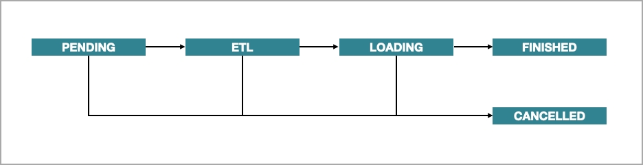
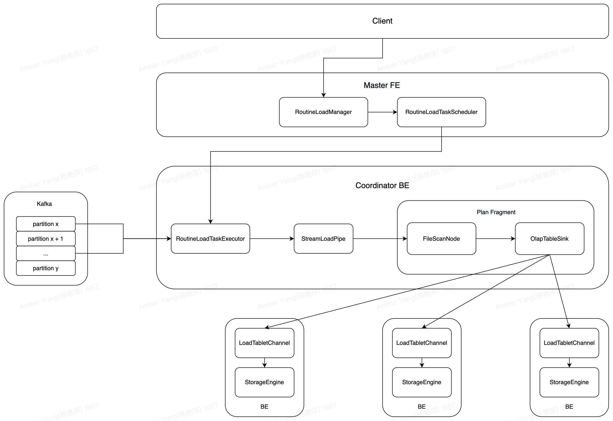

# Overview of data loading

Data loading is the process of cleansing and transforming raw data from various data sources based on your business requirements and loading the resulting data into StarRocks to facilitate blazing-fast data analytics.

You can load data into StarRocks by running load jobs. Each load job has a unique label that is specified by the user or automatically generated by StarRocks to identify the job. Each label can be used only for one load job. After a load job is complete, its label cannot be reused for any other load jobs. Only the labels of failed load jobs can be reused. This mechanism helps ensure that the data associated with a specific label can be loaded only once, thus implementing At-Most-Once semantics.

All the loading methods provided by StarRocks can guarantee atomicity. Atomicity means that the qualified data within a load job must be all successfully loaded or none of the qualified data is successfully loaded. It never happens that some of the qualified data is loaded while the other data is not. Note that the qualified data does not include the data that is filtered out due to quality issues such as data type conversion errors.

StarRocks supports two communication protocols that can be used to submit load jobs: MySQL and HTTP. For more information about the protocol supported by each loading method, see the "[Loading methods](/loading/Loading_intro.md#Loading methods)" section of this topic.

## Supported data types

StarRocks supports loading data of all data types. You only need to take note of the limits on the loading of a few specific data types. For more information, see [Data types](../sql-reference/sql-statements/data-types/BIGINT.md).

## Loading modes

StarRocks supports two loading modes: synchronous loading mode and asynchronous loading mode.

> Note: If you load data by using external programs, you must choose a loading mode that best suits your business requirements before you decide the loading method of your choice.

### Synchronous loading

In synchronous loading mode, after you submit a load job, StarRocks synchronously runs the job to load data, and returns the result of the job after the job finishes. You can check whether the job is successful based on the job result.

StarRocks provides two loading methods that support synchronous loading: [Stream Load](../loading/StreamLoad.md) and [INSERT INTO](../loading/InsertInto.md).

The process of synchronous loading is as follows:

1. Create a load job.

2. View the job result returned by StarRocks.

3. Check whether the job is successful based on the job result. If the job result indicates a load failure, you can retry the job.

### Asynchronous loading

In asynchronous loading mode, after you submit a load job, StarRocks immediately returns the job creation result.

- If the result indicates a job creation success, StarRocks asynchronously runs the job. However, that does not mean that the data has been successfully loaded. You must use statements or commands to check the status of the job. Then, you can determine whether the data is successfully loaded based on the job status.

- If the result indicates a job creation failure, you can determine whether you need to retry the job based on the failure information.

StarRocks provides three loading methods that support asynchronous loading: [Broker Load](../loading/BrokerLoad.md), [Routine Load](../loading/RoutineLoad.md), and [Spark Load](../loading/SparkLoad.md).

The process of asynchronous loading is as follows:

1. Create a load job.

2. View the job creation result returned by StarRocks and determine whether the job is successfully created.
   a. If the job creation succeeds, go to Step 3.
   b. If the job creation fails, return to Step 1.

3. Use statements or commands to check the status of the job until the job status shows **FINISHED** or **CANCELLED**.

The workflow of a Broker Load, Routine Load, or Spark Load job consists of five stages, as shown in the following figure.

The workflow is described as follows:

1. **PENDING**

   The job is in queue waiting to be scheduled by an FE.

2. **ETL**

   The FE pre-processes the data, including cleansing, partitioning, sorting, and aggregation.
   > Note: If the job is a Broker Load job, this stage is directly finished.

3. **LOADING**

   The FE cleanses and transforms the data, and then sends the data to the BEs. After all data is loaded, the data is in queue waiting to take effect. At this time, the status of the job remains **LOADING**.

4. **FINISHED**

   When all data takes effect, the status of the job becomes **FINISHED**. At this time, the data can be queried. **FINISHED** is a final job state.

5. **CANCELLED**

   Before the status of the job becomes **FINISHED**, you can cancel the job at any time. Additionally, StarRocks can automatically cancel the job in case of load errors. After the job is canceled, the status of the job becomes **CANCELLED**. **CANCELLED** is also a final job state.

## Loading methods

StarRocks provides five loading methods to help you load data in various business scenarios: [Stream Load](../loading/StreamLoad.md), [Broker Load](../loading/BrokerLoad.md), [Routine Load](../loading/RoutineLoad.md), [Spark Load](../loading/SparkLoad.md), and [INSERT INTO](../loading/InsertInto.md).

| Loading method     | Protocol | Business scenario                                            | Data volume per load job                                     | Data source                                                  | Data file format      | Loading mode |
| ------------------ | -------- | ------------------------------------------------------------ | ------------------------------------------------------------ | ------------------------------------------------------------ | --------------------- | ------------ |
| Stream Load        | HTTP     | Load data files from local file systems or load data streams by using programs. | 10 GB or less                                                | <ul><li>Local files</li><li>Data streams</li></ul>                                |<ul><li>CSV</li><li>JSON</li></ul>          | Synchronous  |
| Broker Load        | MySQL    | Load data from HDFS or cloud storage.                        | Dozens of GB to hundreds of GB                               |<ul><li>HDFS</li><li>Amazon S3</li><li>Google GCS</li><li>Alibaba Cloud OSS</li><li>Tencent Cloud COS</li></ul>|<ul><li>CSV</li><li>Parquet</li><li>ORC</li></ul>| Asynchronous |
| Routine Load       | MySQL    | Load data in real time from Apache Kafka®.                   | MBs to GBs of data as mini-batches                           | Kafka                                                        |<ul><li>CSV</li><li>JSON</li></ul>          | Asynchronous |
| Spark Load         | MySQL    |<ul><li>Migrate large amounts of data from HDFS or Hive by using Apache Spark™ clusters.</li><li>Load data while using a global data dictionary for deduplication.</li></ul>| Dozens of GB to TBs                                          |<ul><li>HDFS</li><li>Hive</li></ul>                                               |<ul><li>CSV</li><li>Parquet</li></ul>       | Asynchronous |
| INSERT INTO SELECT | MySQL    |<ul><li>Load data from external tables.</li><li>Load data between StarRocks tables.</li></ul>| Not fixed (The data volume varies based on the memory size.) |<ul><li>StarRocks tables</li><li>External tables</li></ul>                         | StarRocks tables      | Synchronous  |
| INSERT INTO VALUES | MySQL    |<ul><li>Insert small amounts of data as individual records.</li><li>Load data by using APIs such as JDBC.</li></ul>| In small quantities                                          |<ul><li>Programs</li><li>ETL tools</li></ul>                                      | SQL                   | Synchronous  |

You can determine the loading method of your choice based on your business scenario, data volume, data source, data file format, and loading frequency. Additionally, take note of the following points when you select a loading method:

- If you load data from Kafka and the data requires multi-table joins and extract, transform and load (ETL), you can use Apache Flink® to pre-process the data and then use the [flink-connector-starrocks](../loading/Flink-connector-starrocks.md) plug-in to perform a Stream Load job to load the data into StarRocks.

- If you load data from Hive, you can use [Broker Load](../loading/BrokerLoad.md) or [Spark Load](../loading/SparkLoad.md) to load the data. However, we recommend that you create an [external Hive table](../data_source/External_table.md#hive-external-table) and then use the INSERT INTO SELECT statement to load the data into the external Hive table.

- If you load data from MySQL databases, you can use [starrockswriter](../loading/DataX-starrocks-writer.md) to load the data. However, we recommend that you create an [external MySQL table](../data_source/External_table.md#mysql-external-table) and then load the data into the external MySQL table.

- If you load data from other data sources such as Oracle and PostgreSQL, we recommend that you use [starrockswriter](../loading/DataX-starrocks-writer.md).

The following figure provides an overview of various data sources supported by StarRocks and the loading methods that you can use to load data from these data sources.

## Memory limits

StarRocks provides parameters for you to limit the memory usage for each load job, thereby reducing memory consumption, especially in high concurrency scenarios. However, do not specify an excessively low memory usage limit. If the memory usage limit is excessively low, data may be frequently flushed from memory to disk because the memory usage for load jobs reaches the specified limit. We recommend that you specify a proper memory usage limit based on your business scenario.

The parameters that are used to limit memory usage vary for each loading method. For more information, see [Stream Load](../loading/StreamLoad.md), [Broker Load](../loading/BrokerLoad.md), [Routine Load](../loading/RoutineLoad.md), [Spark Load](../loading/SparkLoad.md), and [INSERT INTO](../loading/InsertInto.md). Note that a load job usually runs on multiple BEs. Therefore, the parameters limit the memory usage of each load job on each involved BE rather than the total memory usage of the load job on all involved BEs.

StarRocks also provides parameters for you to limit the total memory usage of all load jobs that run on each individual BE. For more information, see the "[System configurations](../loading/Loading_intro.md#system-configurations)" section of this topic.

## System configurations

This section describes some parameter configurations that are applicable to all of the loading methods provided by StarRocks.

### FE configurations

You can configure the following parameters in the configuration file **fe.conf** of each FE:

- `max_load_timeout_second` and `min_load_timeout_second`
  
  These parameters specify the maximum timeout period and minimum timeout period of each load job. The timeout periods are measured in seconds. The default maximum timeout period spans 3 days, and the default minimum timeout period spans 1 second. The maximum timeout period and minimum timeout period that you specify must fall within the range of 1 second to 3 days. These parameters are valid for both synchronous load jobs and asynchronous load jobs.

- `desired_max_waiting_jobs`
  
  This parameter specifies the maximum number of load jobs that can be held waiting in queue. The default value is **100**. When the number of load jobs in the **PENDING** state on an FE reaches the maximum number that you specify, the FE rejects new load requests. This parameter is valid only for asynchronous load jobs.

- `max_running_txn_num_per_db`
  
  This parameter specifies the maximum number of ongoing load jobs that are allowed in each database of your StarRocks cluster. The default value is **100**. When the number of load jobs running in a database reaches the maximum number that you specify, the subsequent load jobs that you submit are not scheduled. In this situation, if you submit a synchronous load job, the job is rejected. If you submit an asynchronous load job, the job is held waiting in queue.

  > Note: StarRocks counts all load jobs together and does not distinguish between synchronous load jobs and asynchronous load jobs.

- `label_keep_max_second`
  
  This parameter specifies the retention period of the history records for load jobs that have finished and are in the **FINISHED** or **CANCELLED** state. The default retention period spans 3 days. This parameter is valid for both synchronous load jobs and asynchronous load jobs.

### BE configurations

You can configure the following parameters in the configuration file **be.conf** of each BE:

- `write_buffer_size`
  
  This parameter specifies the maximum memory block size. The default size is 100 MB. The loaded data is first written to a memory block on the BE. When the amount of data that is loaded reaches the maximum memory block size that you specify, the data is flushed to disk. You must specify a proper maximum memory block size based on your business scenario.

  - If the maximum memory block size is exceedingly small, a large number of small files may be generated on the BE. In this case, query performance degrades. You can increase the maximum memory block size to reduce the number of files generated.
  - If the maximum memory block size is exceedingly large, remote procedure calls (RPCs) may time out. In this case, you can adjust the value of this parameter based on your business needs.

- `streaming_load_rpc_max_alive_time_sec`
  
  The waiting timeout period for each Writer process. The default value is 600 seconds. During the data loading process, StarRocks starts a Writer process to receive data from and write data to each tablet. If a Writer process does not receive any data within the waiting timeout period that you specify, StarRocks stops the Writer process. When your StarRocks cluster processes data at low speeds, a Writer process may not receive the next batch of data within a long period of time and therefore reports a "TabletWriter add batch with unknown id" error. In this case, you can increase the value of this parameter.

- `load_process_max_memory_limit_bytes` and `load_process_max_memory_limit_percent`
  
  These parameters specify the maximum amount of memory that can be consumed for all load jobs on each individual BE. StarRocks identifies the smaller memory consumption among the values of the two parameters as the final memory consumption that is allowed.

  - `load_process_max_memory_limit_bytes`: specifies the maximum memory size. The default maximum memory size is 100 GB.
  - `load_process_max_memory_limit_percent`: specifies the maximum memory usage. The default value is 30%. This parameter differs from the `mem_limit` parameter. The `mem_limit` parameter specifies the total maximum memory usage of your StarRocks cluster, and the default value is 80%.

    If the memory capacity of the machine on which the BE resides is M, the maximum amount of memory that can be consumed for load jobs is calculated as follows: `M x 80% x 30%`.

### System variable configurations

You can configure the following [system variable](../reference/System_variable.md):

- `query_timeout`

  The query timeout duration. Unit: seconds. Value range: `1` to `259200`. Default value: `300`. This variable will act on all query statements in the current connection, as well as INSERT statements.

## Troubleshooting

For more information, see [FAQ about data loading](../faq/loading/Loading_faq.md).
