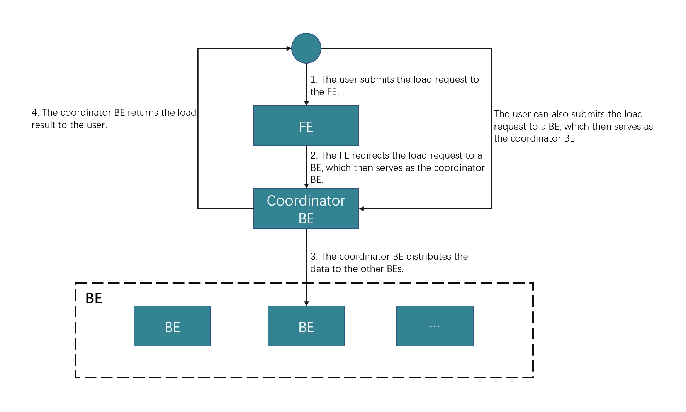
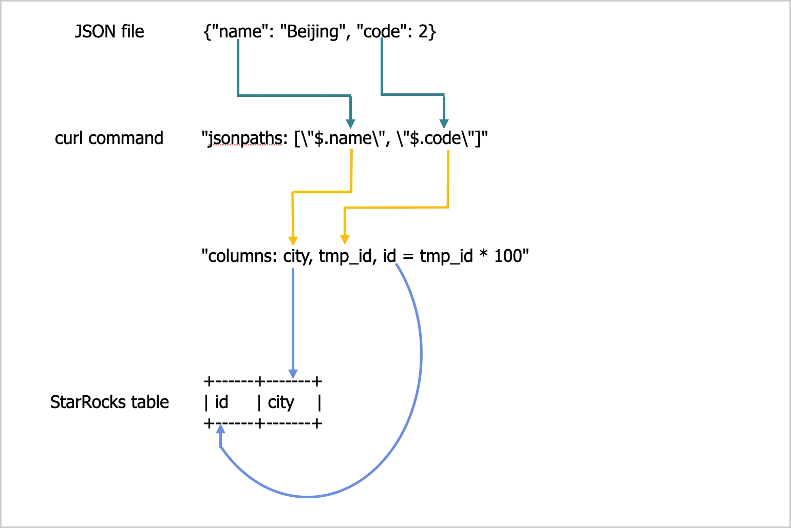

# Load data from a local file system or a streaming data source using HTTP PUT

import InsertPrivNote from '../assets/commonMarkdown/insertPrivNote.md'

StarRocks provides the loading method HTTP-based Stream Load to help you load data from a local file system or a streaming data source.

Stream Load runs in synchronous loading mode. After you submit a load job, StarRocks synchronously runs the job, and returns the result of the job after the job finishes. You can determine whether the job is successful based on the job result.

Stream Load is suitable for the following business scenarios:

- Load a local data file.
  
  In most cases, we recommend that you use curl to submit a load job, which is run to load the data of a local data file into StarRocks.

- Load streaming data.
  
  In most cases, we recommend that you use programs such as Apache Flink® to submit a load job, within which a series of tasks can be generated to continuously load streaming data in real time into StarRocks.

Stream Load supports data transformation at data loading and supports data changes made by UPSERT and DELETE operations during data loading. For more information, see [Transform data at loading](../loading/Etl_in_loading.md) and [Change data through loading](../loading/Load_to_Primary_Key_tables.md).

> **NOTICE**
>
> - After you load data into a StarRocks table by using Stream Load, the data of the materialized views that are created on that table is also updated.
> - You can load data into StarRocks tables only as a user who has the INSERT privilege on those StarRocks tables. If you do not have the INSERT privilege, follow the instructions provided in [GRANT](../sql-reference/sql-statements/account-management/GRANT.md) to grant the INSERT privilege to the user that you use to connect to your StarRocks cluster.

## Supported data file formats

Stream Load supports the following data file formats:

- CSV

- JSON

You can use the `streaming_load_max_mb` parameter to specify the maximum size of each data file you want to load. The default maximum size is 10 GB. We recommend that you retain the default value of this parameter. For more information, see the "[Parameter configurations](../loading/StreamLoad.md#parameter-configurations)" section of this topic.

> **NOTE**
>
> For CSV data, take note of the following points:
>
> - You can use a UTF-8 string, such as a comma (,), tab, or pipe (|), whose length does not exceed 50 bytes as a text delimiter.
> - Null values are denoted by using `\N`. For example, a data file consists of three columns, and a record from that data file holds data in the first and third columns but no data in the second column. In this situation, you need to use `\N` in the second column to denote a null value. This means the record must be compiled as `a,\N,b` instead of `a,,b`. `a,,b` denotes that the second column of the record holds an empty string.

## Limits

Stream Load does not support loading the data of a CSV file that contains a JSON-formatted column.

## How it works

You can submit a load request on your client to an FE according to HTTP, and the FE then uses an HTTP redirect to forward the load request to a specific BE. You can also directly submit a load request on your client to a BE of your choice.

> **NOTE**
>
> If you submit load requests to an FE, the FE uses a polling mechanism to decide which BE will serve as a coordinator to receive and process the load requests. The polling mechanism helps achieve load balancing within your StarRocks cluster. Therefore, we recommend that you send load requests to an FE.

The BE that receives the load request runs as the Coordinator BE to split data based on the used schema into portions and assign each portion of the data to the other involved BEs. After the load finishes, the Coordinator BE returns the result of the load job to your client. Note that if you stop the Coordinator BE during the load, the load job fails.

The following figure shows the workflow of a Stream Load job.



## Load a local data file

### Create a load job

This section uses curl as an example to describe how to load the data of a CSV or JSON file from your local file system into StarRocks. For detailed syntax and parameter descriptions, see [STREAM LOAD](../sql-reference/sql-statements/data-manipulation/STREAM_LOAD.md).

Note that in StarRocks some literals are used as reserved keywords by the SQL language. Do not directly use these keywords in SQL statements. If you want to use such a keyword in an SQL statement, enclose it in a pair of backticks (`). See [Keywords](../sql-reference/sql-statements/keywords.md).

#### Load CSV data

##### Data examples

1. In your local file system, create a CSV file named `example1.csv`. The file consists of three columns, which represent the user ID, user name, and user score in sequence.

   ```Plain
   1,Lily,23
   2,Rose,23
   3,Alice,24
   4,Julia,25
   ```

2. In your StarRocks database `test_db`, create a Primary Key table named `table1`. The table consists of three columns: `id`, `name`, and `score`, of which `id` is the primary key.

   ```SQL
   MySQL [test_db]> CREATE TABLE `table1`
   (
      `id` int(11) NOT NULL COMMENT "user ID",
       `name` varchar(65533) NULL COMMENT "user name",
       `score` int(11) NOT NULL COMMENT "user score"
   )
   ENGINE=OLAP
   PRIMARY KEY(`id`)
   DISTRIBUTED BY HASH(`id`);
   ```

   > **NOTE**
   >
   > Since v2.5.7, StarRocks can automatically set the number of buckets (BUCKETS) when you create a table or add a partition. You no longer need to manually set the number of buckets. For detailed information, see [determine the number of buckets](../table_design/Data_distribution.md#determine-the-number-of-buckets).

##### Load data

Run the following command to load the data of `example1.csv` into `table1`:

```Bash
curl --location-trusted -u <username>:<password> -H "label:123" \
    -H "Expect:100-continue" \
    -H "column_separator:," \
    -H "Expect:100-continue" \
    -H "columns: id, name, score" \
    -T example1.csv -XPUT \
    http://<fe_host>:<fe_http_port>/api/test_db/table1/_stream_load
```

> **NOTE**
>
> - If you use an account for which no password is set, you need to input only `<username>:`.
> - You can use [SHOW FRONTENDS](../sql-reference/sql-statements/Administration/SHOW_FRONTENDS.md) to view the IP address and HTTP port of the FE node.

`example1.csv` consists of three columns, which are separated by commas (,) and can be mapped in sequence onto the `id`, `name`, and `score` columns of `table1`. Therefore, you need to use the `column_separator` parameter to specify the comma (,) as the column separator. You also need to use the `columns` parameter to temporarily name the three columns of `example1.csv` as `id`, `name`, and `score`, which are mapped in sequence onto the three columns of `table1`.

##### Query data

After the load is complete, query the data of `table1` to verify that the load is successful:

```SQL
MySQL [test_db]> SELECT * FROM table1;
+------+-------+-------+
| id   | name  | score |
+------+-------+-------+
|    1 | Lily  |    23 |
|    2 | Rose  |    23 |
|    3 | Alice |    24 |
|    4 | Julia |    25 |
+------+-------+-------+
4 rows in set (0.00 sec)
```

#### Load JSON data

##### Data examples

1. In your local file system, create a JSON file named `example2.json`. The file consists of two columns, which represent city ID and city name in sequence.

   ```JSON
   {"name": "Beijing", "code": 2}
   ```

2. In your StarRocks database `test_db`, create a Primary Key table named `table2`. The table consists of two columns: `id` and `city`, of which `id` is the primary key.

   ```SQL
   MySQL [test_db]> CREATE TABLE `table2`
   (
       `id` int(11) NOT NULL COMMENT "city ID",
       `city` varchar(65533) NULL COMMENT "city name"
   )
   ENGINE=OLAP
   PRIMARY KEY(`id`)
   DISTRIBUTED BY HASH(`id`);
   ```

   > **NOTE**
   >
   > Since v2.5.7, StarRocks can set the number of(BUCKETS) automatically when you create a table or add a partition. You no longer need to manually set the number of buckets. For detailed information, see [determine the number of buckets](../table_design/Data_distribution.md#determine-the-number-of-buckets).

##### Load data

Run the following command to load the data of `example2.json` into `table2`:

```Bash
curl -v --location-trusted -u <username>:<password> -H "strict_mode: true" \
    -H "Expect:100-continue" \
    -H "format: json" -H "jsonpaths: [\"$.name\", \"$.code\"]" \
    -H "columns: city,tmp_id, id = tmp_id * 100" \
    -T example2.json -XPUT \
    http://<fe_host>:<fe_http_port>/api/test_db/table2/_stream_load
```

> **NOTE**
>
> You can use [SHOW FRONTENDS](../sql-reference/sql-statements/Administration/SHOW_FRONTENDS.md) to view the IP address and HTTP port of the FE node.

`example2.json` consists of two keys, `name` and `code`, which are mapped onto the `id` and `city` columns of `table2`, as shown in the following figure.



The mappings shown in the preceding figure are described as follows:

- StarRocks extracts the `name` and `code` keys of `example2.json` and maps them onto the `name` and `code` fields declared in the `jsonpaths` parameter.

- StarRocks extracts the `name` and `code` fields declared in the `jsonpaths` parameter and **maps them in sequence** onto the `city` and `tmp_id` fields declared in the `columns` parameter.

- StarRocks extracts the `city` and `tmp_id` fields declared in the `columns` parameter and **maps them by name** onto the `city` and `id` columns of `table2`.

> **NOTE**
>
> In the preceding example, the value of `code` in `example2.json` is multiplied by 100 before it is loaded into the `id` column of `table2`.

For detailed mappings between `jsonpaths`, `columns`, and the columns of the StarRocks table, see the "Column mappings" section in [STREAM LOAD](../sql-reference/sql-statements/data-manipulation/STREAM_LOAD.md).

##### Query data

After the load is complete, query the data of `table2` to verify that the load is successful:

```SQL
MySQL [test_db]> SELECT * FROM table2;
+------+--------+
| id   | city   |
+------+--------+
| 200  | Beijing|
+------+--------+
4 rows in set (0.01 sec)
```

### View a load job

After a load job is complete, StarRocks returns the result of the job in JSON format. For more information, see the "Return value" section in [STREAM LOAD](../sql-reference/sql-statements/data-manipulation/STREAM_LOAD.md).

Stream Load does not allow you to query the result of a load job by using the SHOW LOAD statement.

### Cancel a load job

Stream Load does not allow you to cancel a load job. If a load job times out or encounters errors, StarRocks automatically cancels the job.

## Parameter configurations

This section describes some system parameters that you need to configure if you choose the loading method Stream Load. These parameter configurations take effect on all Stream Load jobs.

- `streaming_load_max_mb`: the maximum size of each data file you want to load. The default maximum size is 10 GB. For more information, see [BE configuration items](../administration/Configuration.md#be-configuration-items).
  
  We recommend that you do not load more than 10 GB of data at a time. If the size of a data file exceeds 10 GB, we recommend that you split the data file into small files that each are less than 10 GB in size and then load these files one by one. If you cannot split a data file greater than 10 GB, you can increase the value of this parameter based on the file size.

  After you increase the value of this parameter, the new value can take effect only after you restart the BEs of your StarRocks cluster. Additionally, system performance may deteriorate, and the costs of retries in the event of load failures also increase.

  > **NOTE**
  >
  > When you load the data of a JSON file, take note of the following points:
  >
  > - The size of each JSON object in the file cannot exceed 4 GB. If any JSON object in the file exceeds 4 GB, StarRocks throws an error "This parser can't support a document that big."
  >
  > - By default, the JSON body in an HTTP request cannot exceed 100 MB. If the JSON body exceeds 100 MB, StarRocks throws an error "The size of this batch exceed the max size [104857600] of json type data data [8617627793]. Set ignore_json_size to skip check, although it may lead huge memory consuming." To prevent this error, you can add `"ignore_json_size:true"` in the HTTP request header to ignore the check on the JSON body size.

- `stream_load_default_timeout_second`: the timeout period of each load job. The default timeout period is 600 seconds. For more information, see [FE configuration items](../administration/Configuration.md#fe-configuration-items).
  
  If many of the load jobs that you create time out, you can increase the value of this parameter based on the calculation result that you obtain from the following formula:

  **Timeout period of each load job > Amount of data to be loaded/Average loading speed**

  For example, if the size of the data file that you want to load is 10 GB and the average loading speed of your StarRocks cluster is 100 MB/s, set the timeout period to more than 100 seconds.

  > **NOTE**
  >
  > **Average loading speed** in the preceding formula is the average loading speed of your StarRocks cluster. It varies depending on the disk I/O and the number of BEs in your StarRocks cluster.

  Stream Load also provides the `timeout` parameter, which allows you to specify the timeout period of an individual load job. For more information, see [STREAM LOAD](../sql-reference/sql-statements/data-manipulation/STREAM_LOAD.md).

## Usage notes

If a field is missing for a record in the data file you want to load and the column onto which the field is mapped in your StarRocks table is defined as `NOT NULL`, StarRocks automatically fills a `NULL` value in the mapping column of your StarRocks table during the load of the record. You can also use the `ifnull()` function to specify the default value that you want to fill.

For example, if the field that represents city ID in the preceding `example2.json` file is missing and you want to fill an `x` value in the mapping column of `table2`, you can specify `"columns: city, tmp_id, id = ifnull(tmp_id, 'x')"`.
