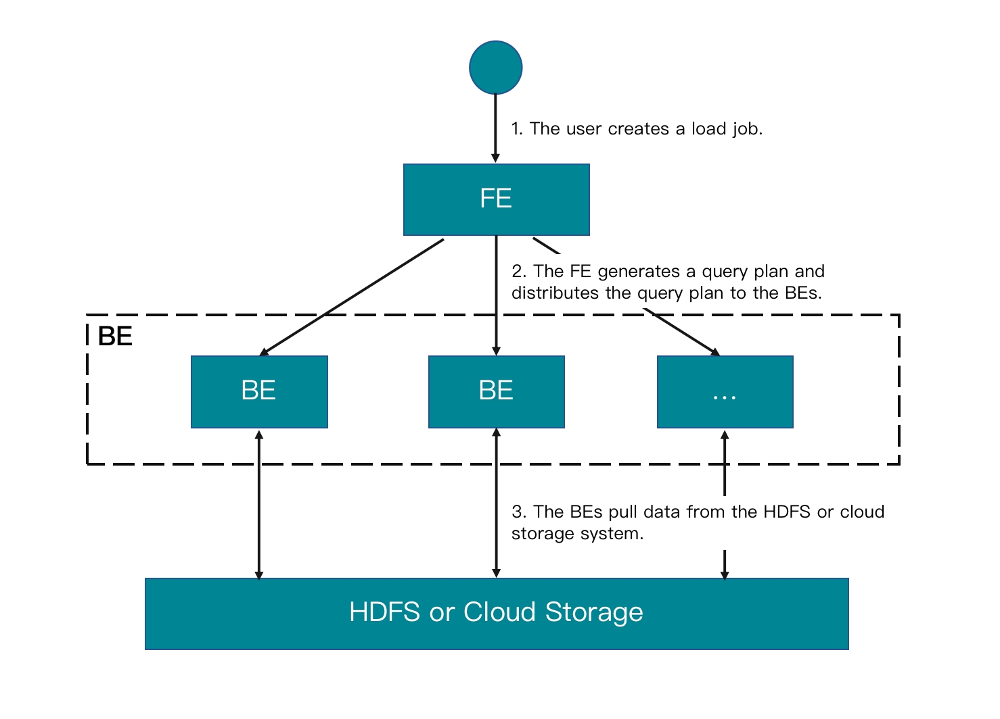

# Load data from cloud storage

StarRocks supports using one of the following methods to load huge amounts of data from cloud storage: [Broker Load](../sql-reference/sql-statements/data-manipulation/BROKER%20LOAD.md) and [INSERT](../sql-reference/sql-statements/data-manipulation/insert.md).

In v3.0 and earlier, StarRocks only supports Broker Load, which runs in asynchronous loading mode. After you submit a load job, StarRocks asynchronously runs the job. You can use `SELECT * FROM information_schema.loads` to query the job result. This feature is supported from v3.1 onwards. For more information, see the "[View a load job](#view-a-load-job)" section of this topic.

Broker Load ensures the transactional atomicity of each load job that is run to load multiple data files, which means that the loading of multiple data files in one load job must all succeed or fail. It never happens that the loading of some data files succeeds while the loading of the other files fails.

Additionally, Broker Load supports data transformation at data loading and supports data changes made by UPSERT and DELETE operations during data loading. For more information, see [Transform data at loading](../loading/Etl_in_loading.md) and [Change data through loading](../loading/Load_to_Primary_Key_tables.md).

> **NOTICE**
>
> You can load data into StarRocks tables only as a user who has the INSERT privilege on those StarRocks tables. If you do not have the INSERT privilege, follow the instructions provided in [GRANT](../sql-reference/sql-statements/account-management/GRANT.md) to grant the INSERT privilege to the user that you use to connect to your StarRocks cluster.

From v3.1 onwards, StarRocks supports directly loading the data of Parquet-formatted or ORC-formatted files from AWS S3 by using the INSERT command and the FILES keyword, saving you from the trouble of creating an external table first. For more information, see [INSERT > Insert data directly from files in an external source using FILES keyword](../loading/InsertInto.md#insert-data-directly-from-files-in-an-external-source-using-table-keyword).

This topic focuses on using [Broker Load](../sql-reference/sql-statements/data-manipulation/BROKER%20LOAD.md) to load data from cloud storage.

## Background information

In v2.4 and earlier, StarRocks depends on brokers to set up connections between your StarRocks cluster and your external storage system when it runs a Broker Load job. Therefore, you need to input `WITH BROKER "<broker_name>"` to specify the broker you want to use in the load statement. This is called "broker-based loading." A broker is an independent, stateless service that is integrated with a file-system interface. With brokers, StarRocks can access and read data files that are stored in your external storage system, and can use its own computing resources to pre-process and load the data of these data files.

From v2.5 onwards, StarRocks no longer depends on brokers to set up connections between your StarRocks cluster and your external storage system when it runs a Broker Load job. Therefore, you no longer need to specify a broker in the load statement, but you still need to retain the `WITH BROKER` keyword. This is called "broker-free loading."

> **NOTE**
>
> You can use the [SHOW BROKER](../sql-reference/sql-statements/Administration/SHOW%20BROKER.md) statement to check for brokers that are deployed in your StarRocks cluster. If no brokers are deployed, you can deploy brokers by following the instructions provided in [Deploy a broker](../deployment/deploy_broker.md).

## Supported data file formats

Broker Load supports the following data file formats:

- CSV

- Parquet

- ORC

> **NOTE**
>
> For CSV data, take note of the following points:
>
> - You can use a UTF-8 string, such as a comma (,), tab, or pipe (|), whose length does not exceed 50 bytes as a text delimiter.
> - Null values are denoted by using `\N`. For example, a data file consists of three columns, and a record from that data file holds data in the first and third columns but no data in the second column. In this situation, you need to use `\N` in the second column to denote a null value. This means the record must be compiled as `a,\N,b` instead of `a,,b`. `a,,b` denotes that the second column of the record holds an empty string.

## How it works

After you submit a load job to an FE, the FE generates a query plan, splits the query plan into portions based on the number of available BEs and the size of the data file you want to load, and then assigns each portion of the query plan to an available BE. During the load, each involved BE pulls the data of the data file from your external storage system, pre-processes the data, and then loads the data into your StarRocks cluster. After all BEs finish their portions of the query plan, the FE determines whether the load job is successful.

The following figure shows the workflow of a Broker Load job.



## Prepare data examples

1. Log in to your local file system and create two CSV-formatted data files, `file1.csv` and `file2.csv`. Both files consist of three columns, which represent user ID, user name, and user score in sequence.

   - `file1.csv`

     ```Plain
     1,Lily,21
     2,Rose,22
     3,Alice,23
     4,Julia,24
     ```

   - `file2.csv`

     ```Plain
     5,Tony,25
     6,Adam,26
     7,Allen,27
     8,Jacky,28
     ```

2. Upload `file1.csv` and `file2.csv` to the `input` folder of your AWS S3 bucket `bucket_s3`, to the `input` folder of your Google GCS bucket `bucket_gcs`, to the `input` folder of your S3-compatible storage object (such as MinIO) bucket `bucket_minio`, and to the specified paths of your Azure Storage.

3. Log in to your StarRocks database (for example, `test_db`) and create two Primary Key tables, `table1` and `table2`. Both tables consist of three columns: `id`, `name`, and `score`, of which `id` is the primary key.

   ```SQL
   CREATE TABLE `table1`
      (
          `id` int(11) NOT NULL COMMENT "user ID",
          `name` varchar(65533) NULL DEFAULT "" COMMENT "user name",
          `score` int(11) NOT NULL DEFAULT "0" COMMENT "user score"
      )
          ENGINE=OLAP
          PRIMARY KEY(`id`)
          DISTRIBUTED BY HASH(`id`);
             
   CREATE TABLE `table2`
      (
          `id` int(11) NOT NULL COMMENT "user ID",
          `name` varchar(65533) NULL DEFAULT "" COMMENT "user name",
          `score` int(11) NOT NULL DEFAULT "0" COMMENT "user score"
      )
          ENGINE=OLAP
          PRIMARY KEY(`id`)
          DISTRIBUTED BY HASH(`id`);
   ```

## Load data from AWS S3

Note that Broker Load supports accessing AWS S3 according to the S3 or S3A protocol. Therefore, when you load data from AWS S3, you can include `s3://` or `s3a://` as the prefix in the S3 URI that you pass as the file path (`DATA INFILE`).

Also, note that the following examples use the CSV file format and the instance profile-based authentication method. For information about how to load data in other formats and about the authentication parameters that you need to configure when using other authentication methods, see [BROKER LOAD](../sql-reference/sql-statements/data-manipulation/BROKER%20LOAD.md).

### Load a single data file into a single table

#### Example

Execute the following statement to load the data of `file1.csv` stored in the `input` folder of your AWS S3 bucket `bucket_s3` into `table1`:

```SQL
LOAD LABEL test_db.label_brokerloadtest_101
(
    DATA INFILE("s3a://bucket_s3/input/file1.csv")
    INTO TABLE table1
    COLUMNS TERMINATED BY ","
    (id, name, score)
)
WITH BROKER
(
    "aws.s3.use_instance_profile" = "true",
    "aws.s3.region" = "<aws_s3_region>"
)
PROPERTIES
(
    "timeout" = "3600"
);
```

#### Query data

After you submit the load job, you need to use [SHOW LOAD](../sql-reference/sql-statements/data-manipulation/SHOW%20LOAD.md) or `curl` to view the result of the load job. For more information, see the "[View a load job](#view-a-load-job)" section of this topic.

After you confirm that the load job is successful, you can use [SELECT](../sql-reference/sql-statements/data-manipulation/SELECT.md) to query the data of `table1`:

```SQL
SELECT * FROM table1;
+------+-------+-------+
| id   | name  | score |
+------+-------+-------+
|    1 | Lily  |    21 |
|    2 | Rose  |    22 |
|    3 | Alice |    23 |
|    4 | Julia |    24 |
+------+-------+-------+
4 rows in set (0.01 sec)
```

### Load multiple data files into a single table

#### Example

Execute the following statement to load the data of all data files (`file1.csv` and `file2.csv`) stored in the `input` folder of your AWS S3 bucket `bucket_s3` into `table1`:

```SQL
LOAD LABEL test_db.label_brokerloadtest_102
(
    DATA INFILE("s3a://bucket_s3/input/*")
    INTO TABLE table1
    COLUMNS TERMINATED BY ","
    (id, name, score)
)
WITH BROKER
(
    "aws.s3.use_instance_profile" = "true",
    "aws.s3.region" = "<aws_s3_region>"
)
PROPERTIES
(
    "timeout" = "3600"
);
```

#### Query data

After you submit the load job, you need to use [SHOW LOAD](../sql-reference/sql-statements/data-manipulation/SHOW%20LOAD.md) or `curl` to view the result of the load job. For more information, see the "[View a load job](#view-a-load-job)" section of this topic.

After you confirm that the load job is successful, you can use [SELECT](../sql-reference/sql-statements/data-manipulation/SELECT.md) to query the data of `table1`:

```SQL
SELECT * FROM table1;
+------+-------+-------+
| id   | name  | score |
+------+-------+-------+
|    1 | Lily  |    21 |
|    2 | Rose  |    22 |
|    3 | Alice |    23 |
|    4 | Julia |    24 |
|    5 | Tony  |    25 |
|    6 | Adam  |    26 |
|    7 | Allen |    27 |
|    8 | Jacky |    28 |
+------+-------+-------+
4 rows in set (0.01 sec)
```

### Load multiple data files into multiple tables

#### Example

Execute the following statement to load the data of `file1.csv` and `file2.csv` stored in the `input` folder of your AWS S3 bucket `bucket_s3` into `table1` and `table2`, respectively:

```SQL
LOAD LABEL test_db.label_brokerloadtest_103
(
    DATA INFILE("s3a://bucket_s3/input/file1.csv")
    INTO TABLE table1
    COLUMNS TERMINATED BY ","
    (id, name, score)
    ,
    DATA INFILE("s3a://bucket_s3/input/file2.csv")
    INTO TABLE table2
    COLUMNS TERMINATED BY ","
    (id, name, score)
)
WITH BROKER
(
    "aws.s3.use_instance_profile" = "true",
    "aws.s3.region" = "<aws_s3_region>"
)
PROPERTIES
(
    "timeout" = "3600"
);;
```

#### Query data

After you submit the load job, you need to use [SHOW LOAD](../sql-reference/sql-statements/data-manipulation/SHOW%20LOAD.md) or `curl` to view the result of the load job. For more information, see the "[View a load job](#view-a-load-job)" section of this topic.

After you confirm that the load job is successful, you can use [SELECT](../sql-reference/sql-statements/data-manipulation/SELECT.md) to query the data of `table1` and `table2`:

1. Query `table1`:

   ```SQL
   SELECT * FROM table1;
   +------+-------+-------+
   | id   | name  | score |
   +------+-------+-------+
   |    1 | Lily  |    21 |
   |    2 | Rose  |    22 |
   |    3 | Alice |    23 |
   |    4 | Julia |    24 |
   +------+-------+-------+
   4 rows in set (0.01 sec)
   ```

2. Query `table2`:

   ```SQL
   SELECT * FROM table1;
   +------+-------+-------+
   | id   | name  | score |
   +------+-------+-------+
   |    5 | Tony  |    25 |
   |    6 | Adam  |    26 |
   |    7 | Allen |    27 |
   |    8 | Jacky |    28 |
   +------+-------+-------+
   4 rows in set (0.01 sec)
   ```

## Load data from Google GCS

Note that Broker Load supports accessing Google GCS only according to the gs protocol. Therefore, when you load data from Google GCS, you must include `gs://` as the prefix in the GCS URI that you pass as the file path (`DATA INFILE`).

Also, note that the following examples use the CSV file format and the VM-based authentication method. For information about how to load data in other formats and about the authentication parameters that you need to configure when using other authentication methods, see [BROKER LOAD](../sql-reference/sql-statements/data-manipulation/BROKER%20LOAD.md).

### Load a single data file into a single table

#### Example

Execute the following statement to load the data of `file1.csv` stored in the `input` folder of your Google GCS bucket `bucket_gcs` into `table1`:

```SQL
LOAD LABEL test_db.label_brokerloadtest_201
(
    DATA INFILE("gs://bucket_gcs/input/file1.csv")
    INTO TABLE table1
    COLUMNS TERMINATED BY ","
    (id, name, score)
)
WITH BROKER
(
    "gcp.gcs.use_compute_engine_service_account" = "true"
)
PROPERTIES
(
    "timeout" = "3600"
);
```

#### Query data

After you submit the load job, you need to use [SHOW LOAD](../sql-reference/sql-statements/data-manipulation/SHOW%20LOAD.md) or `curl` to view the result of the load job. For more information, see the "[View a load job](#view-a-load-job)" section of this topic.

After you confirm that the load job is successful, you can use [SELECT](../sql-reference/sql-statements/data-manipulation/SELECT.md) to query the data of `table1`:

```SQL
SELECT * FROM table1;
+------+-------+-------+
| id   | name  | score |
+------+-------+-------+
|    1 | Lily  |    21 |
|    2 | Rose  |    22 |
|    3 | Alice |    23 |
|    4 | Julia |    24 |
+------+-------+-------+
4 rows in set (0.01 sec)
```

### Load multiple data files into a single table

#### Example

Execute the following statement to load the data of all data files (`file1.csv` and `file2.csv`) stored in the `input` folder of your Google GCS bucket `bucket_gcs` into `table1`:

```SQL
LOAD LABEL test_db.label_brokerloadtest_202
(
    DATA INFILE("gs://bucket_gcs/input/*")
    INTO TABLE table1
    COLUMNS TERMINATED BY ","
    (id, name, score)
)
WITH BROKER
(
    "gcp.gcs.use_compute_engine_service_account" = "true"
)
PROPERTIES
(
    "timeout" = "3600"
);
```

#### Query data

After you submit the load job, you need to use [SHOW LOAD](../sql-reference/sql-statements/data-manipulation/SHOW%20LOAD.md) or `curl` to view the result of the load job. For more information, see the "[View a load job](#view-a-load-job)" section of this topic.

After you confirm that the load job is successful, you can use [SELECT](../sql-reference/sql-statements/data-manipulation/SELECT.md) to query the data of `table1`:

```SQL
SELECT * FROM table1;
+------+-------+-------+
| id   | name  | score |
+------+-------+-------+
|    1 | Lily  |    21 |
|    2 | Rose  |    22 |
|    3 | Alice |    23 |
|    4 | Julia |    24 |
|    5 | Tony  |    25 |
|    6 | Adam  |    26 |
|    7 | Allen |    27 |
|    8 | Jacky |    28 |
+------+-------+-------+
4 rows in set (0.01 sec)
```

### Load multiple data files into multiple tables

#### Example

Execute the following statement to load the data of `file1.csv` and `file2.csv` stored in the `input` folder of your Google GCS bucket `bucket_gcs` into `table1` and `table2`, respectively:

```SQL
LOAD LABEL test_db.label_brokerloadtest_203
(
    DATA INFILE("gs://bucket_gcs/input/file1.csv")
    INTO TABLE table1
    COLUMNS TERMINATED BY ","
    (id, name, score)
    ,
    DATA INFILE("gs://bucket_gcs/input/file2.csv")
    INTO TABLE table2
    COLUMNS TERMINATED BY ","
    (id, name, score)
)
WITH BROKER
(
    "gcp.gcs.use_compute_engine_service_account" = "true"
);
PROPERTIES
(
    "timeout" = "3600"
);
```

#### Query data

After you submit the load job, you need to use [SHOW LOAD](../sql-reference/sql-statements/data-manipulation/SHOW%20LOAD.md) or `curl` to view the result of the load job. For more information, see the "[View a load job](#view-a-load-job)" section of this topic.

After you confirm that the load job is successful, you can use [SELECT](../sql-reference/sql-statements/data-manipulation/SELECT.md) to query the data of `table1` and `table2`:

1. Query `table1`:

   ```SQL
   SELECT * FROM table1;
   +------+-------+-------+
   | id   | name  | score |
   +------+-------+-------+
   |    1 | Lily  |    21 |
   |    2 | Rose  |    22 |
   |    3 | Alice |    23 |
   |    4 | Julia |    24 |
   +------+-------+-------+
   4 rows in set (0.01 sec)
   ```

2. Query `table2`:

   ```SQL
   SELECT * FROM table1;
   +------+-------+-------+
   | id   | name  | score |
   +------+-------+-------+
   |    5 | Tony  |    25 |
   |    6 | Adam  |    26 |
   |    7 | Allen |    27 |
   |    8 | Jacky |    28 |
   +------+-------+-------+
   4 rows in set (0.01 sec)
   ```

## Load data from Microsoft Azure Storage

Note that when you load data from Azure Storage, you need to determine which prefix to use based on the access protocol and specific storage service that you use:

- When you load data from Blob Storage, you must include `wasb://` or `wasbs://` as a prefix in the file path (`DATA INFILE`) based on the protocol that is used to access your storage account:
  - If your Blob Storage allows access only through HTTP, use `wasb://` as the prefix, for example, `wasb://<container>@<storage_account>.blob.core.windows.net/<path>/<file_name>/*`.
  - If your Blob Storage allows access only through HTTPS, use `wasbs://` as the prefix, for example, `wasbs://<container>@<storage_account>.blob.core.windows``.net/<path>/<file_name>/*`
- When you load data from Data Lake Storage Gen1, you must include `adl://` as a prefix in the file path (`DATA INFILE`), for example, `adl://<data_lake_storage_gen1_name>.azuredatalakestore.net/<path>/<file_name>`.
- When you load data from Data Lake Storage Gen2, you must include `abfs://` or `abfss://` as a prefix in the file path (`DATA INFILE`) based on the protocol that is used to access your storage account:
  - If your Data Lake Storage Gen2 allows access only via HTTP, use `abfs://` as the prefix, for example, `abfs://<container>@<storage_account>.dfs.core.windows.net/<file_name>`.
  - If your Data Lake Storage Gen2 allows access only via HTTPS, use `abfss://` as the prefix, for example, `abfss://<container>@<storage_account>.dfs.core.windows.net/<file_name>`.

Also, note that the following examples use the CSV file format, Azure Blob Storage, and the shared key-based authentication method. For information about how to load data in other formats and about the authentication parameters that you need to configure when using other Azure storage services and authentication methods, see [BROKER LOAD](../sql-reference/sql-statements/data-manipulation/BROKER%20LOAD.md).

### Load a single data file into a single table

#### Example

Execute the following statement to load the data of `file1.csv` stored in the specified path of your Azure Storage into `table1`:

```SQL
LOAD LABEL test_db.label_brokerloadtest_301
(
    DATA INFILE("wasb[s]://<container>@<storage_account>.blob.core.windows.net/<path>/file1.csv")
    INTO TABLE table1
    COLUMNS TERMINATED BY ","
    (id, name, score)
)
WITH BROKER
(
    "azure.blob.storage_account" = "<blob_storage_account_name>",
    "azure.blob.shared_key" = "<blob_storage_account_shared_key>"
)
PROPERTIES
(
    "timeout" = "3600"
);
```

#### Query data

After you submit the load job, you need to use [SHOW LOAD](../sql-reference/sql-statements/data-manipulation/SHOW%20LOAD.md) or `curl` to view the result of the load job. For more information, see the "[View a load job](#view-a-load-job)" section of this topic.

After you confirm that the load job is successful, you can use [SELECT](../sql-reference/sql-statements/data-manipulation/SELECT.md) to query the data of `table1`:

```SQL
SELECT * FROM table1;
+------+-------+-------+
| id   | name  | score |
+------+-------+-------+
|    1 | Lily  |    21 |
|    2 | Rose  |    22 |
|    3 | Alice |    23 |
|    4 | Julia |    24 |
+------+-------+-------+
4 rows in set (0.01 sec)
```

### Load multiple data files into a single table

#### Example

Execute the following statement to load the data of all data files (`file1.csv` and `file2.csv`) stored in the specified path of your Azure Storage into `table1`:

```SQL
LOAD LABEL test_db.label_brokerloadtest_302
(
    DATA INFILE("wasb[s]://<container>@<storage_account>.blob.core.windows.net/<path>/*")
    INTO TABLE table1
    COLUMNS TERMINATED BY ","
    (id, name, score)
)
WITH BROKER
(
    "azure.blob.storage_account" = "<blob_storage_account_name>",
    "azure.blob.shared_key" = "<blob_storage_account_shared_key>"
)
PROPERTIES
(
    "timeout" = "3600"
);
```

#### Query data

After you submit the load job, you need to use [SHOW LOAD](../sql-reference/sql-statements/data-manipulation/SHOW%20LOAD.md) or `curl` to view the result of the load job. For more information, see the "[View a load job](#view-a-load-job)" section of this topic.

After you confirm that the load job is successful, you can use [SELECT](../sql-reference/sql-statements/data-manipulation/SELECT.md) to query the data of `table1`:

```SQL
SELECT * FROM table1;
+------+-------+-------+
| id   | name  | score |
+------+-------+-------+
|    1 | Lily  |    21 |
|    2 | Rose  |    22 |
|    3 | Alice |    23 |
|    4 | Julia |    24 |
|    5 | Tony  |    25 |
|    6 | Adam  |    26 |
|    7 | Allen |    27 |
|    8 | Jacky |    28 |
+------+-------+-------+
4 rows in set (0.01 sec)
```

### Load multiple data files into multiple tables

#### Example

Execute the following statement to load the data of `file1.csv` and `file2.csv` stored in the specified path of your Azure Storage into `table1` and `table2`, respectively:

```SQL
LOAD LABEL test_db.label_brokerloadtest_303
(
    DATA INFILE("wasb[s]://<container>@<storage_account>.blob.core.windows.net/<path>/file1.csv")
    INTO TABLE table1
    COLUMNS TERMINATED BY ","
    (id, name, score)
    ,
    DATA INFILE("wasb[s]://<container>@<storage_account>.blob.core.windows.net/<path>/file2.csv")
    INTO TABLE table2
    COLUMNS TERMINATED BY ","
    (id, name, score)
)
WITH BROKER
(
    "azure.blob.storage_account" = "<blob_storage_account_name>",
    "azure.blob.shared_key" = "<blob_storage_account_shared_key>"
);
PROPERTIES
(
    "timeout" = "3600"
);
```

#### Query data

After you submit the load job, you need to use [SHOW LOAD](../sql-reference/sql-statements/data-manipulation/SHOW%20LOAD.md) or `curl` to view the result of the load job. For more information, see the "[View a load job](#view-a-load-job)" section of this topic.

After you confirm that the load job is successful, you can use [SELECT](../sql-reference/sql-statements/data-manipulation/SELECT.md) to query the data of `table1` and `table2`:

1. Query `table1`:

   ```SQL
   SELECT * FROM table1;
   +------+-------+-------+
   | id   | name  | score |
   +------+-------+-------+
   |    1 | Lily  |    21 |
   |    2 | Rose  |    22 |
   |    3 | Alice |    23 |
   |    4 | Julia |    24 |
   +------+-------+-------+
   4 rows in set (0.01 sec)
   ```

2. Query `table2`:

   ```SQL
   SELECT * FROM table1;
   +------+-------+-------+
   | id   | name  | score |
   +------+-------+-------+
   |    5 | Tony  |    25 |
   |    6 | Adam  |    26 |
   |    7 | Allen |    27 |
   |    8 | Jacky |    28 |
   +------+-------+-------+
   4 rows in set (0.01 sec)
   ```

## Load data from an S3-compatible storage system

The following examples use the CSV file format and the MinIO storage system. For information about how to load data in other formats, see [BROKER LOAD](../sql-reference/sql-statements/data-manipulation/BROKER%20LOAD.md).

### Load a single data file into a single table

#### Example

Execute the following statement to load the data of `file1.csv` stored in the `input` folder of your MinIO bucket `bucket_minio` into `table1`:

```SQL
LOAD LABEL test_db.label_brokerloadtest_401
(
    DATA INFILE("obs://bucket_minio/input/file1.csv")
    INTO TABLE table1
    COLUMNS TERMINATED BY ","
    (id, name, score)
)
WITH BROKER
(
    "aws.s3.enable_ssl" = "{true | false}",
    "aws.s3.enable_path_style_access" = "{true | false}",
    "aws.s3.endpoint" = "<s3_endpoint>",
    "aws.s3.access_key" = "<iam_user_access_key>",
    "aws.s3.secret_key" = "<iam_user_secret_key>"
)
PROPERTIES
(
    "timeout" = "3600"
);
```

#### Query data

After you submit the load job, you need to use [SHOW LOAD](../sql-reference/sql-statements/data-manipulation/SHOW%20LOAD.md) or `curl` to view the result of the load job. For more information, see the "[View a load job](#view-a-load-job)" section of this topic.

After you confirm that the load job is successful, you can use [SELECT](../sql-reference/sql-statements/data-manipulation/SELECT.md) to query the data of `table1`:

```SQL
SELECT * FROM table1;
+------+-------+-------+
| id   | name  | score |
+------+-------+-------+
|    1 | Lily  |    21 |
|    2 | Rose  |    22 |
|    3 | Alice |    23 |
|    4 | Julia |    24 |
+------+-------+-------+
4 rows in set (0.01 sec)
```

### Load multiple data files into a single table

#### Example

Execute the following statement to load the data of all data files (`file1.csv` and `file2.csv`) stored in the `input` folder of your MinIO bucket `bucket_minio` into `table1`:

```SQL
LOAD LABEL test_db.label_brokerloadtest_402
(
    DATA INFILE("obs://bucket_minio/input/*")
    INTO TABLE table1
    COLUMNS TERMINATED BY ","
    (id, name, score)
)
WITH BROKER
(
    "aws.s3.enable_ssl" = "{true | false}",
    "aws.s3.enable_path_style_access" = "{true | false}",
    "aws.s3.endpoint" = "<s3_endpoint>",
    "aws.s3.access_key" = "<iam_user_access_key>",
    "aws.s3.secret_key" = "<iam_user_secret_key>"
)
PROPERTIES
(
    "timeout" = "3600"
);
```

#### Query data

After you submit the load job, you need to use [SHOW LOAD](../sql-reference/sql-statements/data-manipulation/SHOW%20LOAD.md) or `curl` to view the result of the load job. For more information, see the "[View a load job](#view-a-load-job)" section of this topic.

After you confirm that the load job is successful, you can use [SELECT](../sql-reference/sql-statements/data-manipulation/SELECT.md) to query the data of `table1`:

```SQL
SELECT * FROM table1;
+------+-------+-------+
| id   | name  | score |
+------+-------+-------+
|    1 | Lily  |    21 |
|    2 | Rose  |    22 |
|    3 | Alice |    23 |
|    4 | Julia |    24 |
|    5 | Tony  |    25 |
|    6 | Adam  |    26 |
|    7 | Allen |    27 |
|    8 | Jacky |    28 |
+------+-------+-------+
4 rows in set (0.01 sec)
```

### Load multiple data files into multiple tables

#### Example

Execute the following statement to load the data of all data files (`file1.csv` and `file2.csv`) stored in the `input` folder of your MinIO bucket `bucket_minio` into `table1` and `table2`, respectively:

```SQL
LOAD LABEL test_db.label_brokerloadtest_403
(
    DATA INFILE("obs://bucket_minio/input/file1.csv")
    INTO TABLE table1
    COLUMNS TERMINATED BY ","
    (id, name, score)
    ,
    DATA INFILE("obs://bucket_minio/input/file2.csv")
    INTO TABLE table2
    COLUMNS TERMINATED BY ","
    (id, city)
)
WITH BROKER
(
    "aws.s3.enable_ssl" = "{true | false}",
    "aws.s3.enable_path_style_access" = "{true | false}",
    "aws.s3.endpoint" = "<s3_endpoint>",
    "aws.s3.access_key" = "<iam_user_access_key>",
    "aws.s3.secret_key" = "<iam_user_secret_key>"
);
PROPERTIES
(
    "timeout" = "3600"
);
```

#### Query data

After you submit the load job, you need to use [SHOW LOAD](../sql-reference/sql-statements/data-manipulation/SHOW%20LOAD.md) or `curl` to view the result of the load job. For more information, see the "[View a load job](#view-a-load-job)" section of this topic.

After you confirm that the load job is successful, you can use [SELECT](../sql-reference/sql-statements/data-manipulation/SELECT.md) to query the data of `table1` and `table2`:

1. Query `table1`:

   ```SQL
   SELECT * FROM table1;
   +------+-------+-------+
   | id   | name  | score |
   +------+-------+-------+
   |    1 | Lily  |    21 |
   |    2 | Rose  |    22 |
   |    3 | Alice |    23 |
   |    4 | Julia |    24 |
   +------+-------+-------+
   4 rows in set (0.01 sec)
   ```

2. Query `table2`:

   ```SQL
   SELECT * FROM table1;
   +------+-------+-------+
   | id   | name  | score |
   +------+-------+-------+
   |    5 | Tony  |    25 |
   |    6 | Adam  |    26 |
   |    7 | Allen |    27 |
   |    8 | Jacky |    28 |
   +------+-------+-------+
   4 rows in set (0.01 sec)
   ```

## View a load job

Use the [SELECT](../sql-reference/sql-statements/data-manipulation/SELECT.md) statement to query the results of one or more load jobs from the `loads` table in the `information_schema` database. This feature is supported from v3.1 onwards.

Example 1: Query the results of load jobs executed on the `test_db` database. In the query statement, specify that a maximum of two results can be returned and the return results must be sorted by creation time (`CREATE_TIME`) in descending order.

```SQL
SELECT * FROM information_schema.loads
WHERE database_name = 'test_db'
ORDER BY create_time DESC
LIMIT 2\G;
```

The following results are returned:

```SQL
*************************** 1. row ***************************
              JOB_ID: 20686
               LABEL: label_brokerload_unqualifiedtest_83
       DATABASE_NAME: test_db
               STATE: FINISHED
            PROGRESS: ETL:100%; LOAD:100%
                TYPE: BROKER
            PRIORITY: NORMAL
           SCAN_ROWS: 8
       FILTERED_ROWS: 0
     UNSELECTED_ROWS: 0
           SINK_ROWS: 8
            ETL_INFO:
           TASK_INFO: resource:N/A; timeout(s):14400; max_filter_ratio:1.0
         CREATE_TIME: 2023-08-02 15:25:22
      ETL_START_TIME: 2023-08-02 15:25:24
     ETL_FINISH_TIME: 2023-08-02 15:25:24
     LOAD_START_TIME: 2023-08-02 15:25:24
    LOAD_FINISH_TIME: 2023-08-02 15:25:27
         JOB_DETAILS: {"All backends":{"77fe760e-ec53-47f7-917d-be5528288c08":[10006],"0154f64e-e090-47b7-a4b2-92c2ece95f97":[10005]},"FileNumber":2,"FileSize":84,"InternalTableLoadBytes":252,"InternalTableLoadRows":8,"ScanBytes":84,"ScanRows":8,"TaskNumber":2,"Unfinished backends":{"77fe760e-ec53-47f7-917d-be5528288c08":[],"0154f64e-e090-47b7-a4b2-92c2ece95f97":[]}}
           ERROR_MSG: NULL
        TRACKING_URL: NULL
        TRACKING_SQL: NULL
REJECTED_RECORD_PATH: NULL
*************************** 2. row ***************************
              JOB_ID: 20624
               LABEL: label_brokerload_unqualifiedtest_82
       DATABASE_NAME: test_db
               STATE: FINISHED
            PROGRESS: ETL:100%; LOAD:100%
                TYPE: BROKER
            PRIORITY: NORMAL
           SCAN_ROWS: 12
       FILTERED_ROWS: 4
     UNSELECTED_ROWS: 0
           SINK_ROWS: 8
            ETL_INFO:
           TASK_INFO: resource:N/A; timeout(s):14400; max_filter_ratio:1.0
         CREATE_TIME: 2023-08-02 15:23:29
      ETL_START_TIME: 2023-08-02 15:23:34
     ETL_FINISH_TIME: 2023-08-02 15:23:34
     LOAD_START_TIME: 2023-08-02 15:23:34
    LOAD_FINISH_TIME: 2023-08-02 15:23:34
         JOB_DETAILS: {"All backends":{"78f78fc3-8509-451f-a0a2-c6b5db27dcb6":[10010],"a24aa357-f7de-4e49-9e09-e98463b5b53c":[10006]},"FileNumber":2,"FileSize":158,"InternalTableLoadBytes":333,"InternalTableLoadRows":8,"ScanBytes":158,"ScanRows":12,"TaskNumber":2,"Unfinished backends":{"78f78fc3-8509-451f-a0a2-c6b5db27dcb6":[],"a24aa357-f7de-4e49-9e09-e98463b5b53c":[]}}
           ERROR_MSG: NULL
        TRACKING_URL: http://172.26.195.69:8540/api/_load_error_log?file=error_log_78f78fc38509451f_a0a2c6b5db27dcb7
        TRACKING_SQL: select tracking_log from information_schema.load_tracking_logs where job_id=20624
REJECTED_RECORD_PATH: 172.26.95.92:/home/disk1/sr/be/storage/rejected_record/test_db/label_brokerload_unqualifiedtest_0728/6/404a20b1e4db4d27_8aa9af1e8d6d8bdc
```

Example 2: Query the result of the load job (whose label is `label_brokerload_unqualifiedtest_82`) executed on the `test_db` database:

```SQL
SELECT * FROM information_schema.loads
WHERE database_name = 'test_db' and label = 'label_brokerload_unqualifiedtest_82'\G;
```

The following result is returned:

```SQL
*************************** 1. row ***************************
              JOB_ID: 20624
               LABEL: label_brokerload_unqualifiedtest_82
       DATABASE_NAME: test_db
               STATE: FINISHED
            PROGRESS: ETL:100%; LOAD:100%
                TYPE: BROKER
            PRIORITY: NORMAL
           SCAN_ROWS: 12
       FILTERED_ROWS: 4
     UNSELECTED_ROWS: 0
           SINK_ROWS: 8
            ETL_INFO:
           TASK_INFO: resource:N/A; timeout(s):14400; max_filter_ratio:1.0
         CREATE_TIME: 2023-08-02 15:23:29
      ETL_START_TIME: 2023-08-02 15:23:34
     ETL_FINISH_TIME: 2023-08-02 15:23:34
     LOAD_START_TIME: 2023-08-02 15:23:34
    LOAD_FINISH_TIME: 2023-08-02 15:23:34
         JOB_DETAILS: {"All backends":{"78f78fc3-8509-451f-a0a2-c6b5db27dcb6":[10010],"a24aa357-f7de-4e49-9e09-e98463b5b53c":[10006]},"FileNumber":2,"FileSize":158,"InternalTableLoadBytes":333,"InternalTableLoadRows":8,"ScanBytes":158,"ScanRows":12,"TaskNumber":2,"Unfinished backends":{"78f78fc3-8509-451f-a0a2-c6b5db27dcb6":[],"a24aa357-f7de-4e49-9e09-e98463b5b53c":[]}}
           ERROR_MSG: NULL
        TRACKING_URL: http://172.26.195.69:8540/api/_load_error_log?file=error_log_78f78fc38509451f_a0a2c6b5db27dcb7
        TRACKING_SQL: select tracking_log from information_schema.load_tracking_logs where job_id=20624
REJECTED_RECORD_PATH: 172.26.95.92:/home/disk1/sr/be/storage/rejected_record/test_db/label_brokerload_unqualifiedtest_0728/6/404a20b1e4db4d27_8aa9af1e8d6d8bdc
```

For information about the fields in the return results, see [Information Schema > loads](../administration/information_schema.md#loads).

## Cancel a load job

When a load job is not in the **CANCELLED** or **FINISHED** stage, you can use the [CANCEL LOAD](../sql-reference/sql-statements/data-manipulation/CANCEL%20LOAD.md) statement to cancel the job.

For example, you can execute the following statement to cancel a load job, whose label is `label1`, in the database `test_db`:

```SQL
CANCEL LOAD
FROM test_db
WHERE LABEL = "label";
```

## Job splitting and concurrent running

A Broker Load job can be split into one or more tasks that concurrently run. The tasks within a load job are run within a single transaction. They must all succeed or fail. StarRocks splits each load job based on how you declare `data_desc` in the `LOAD` statement:

- If you declare multiple `data_desc` parameters, each of which specifies a distinct table, a task is generated to load the data of each table.

- If you declare multiple `data_desc` parameters, each of which specifies a distinct partition for the same table, a task is generated to load the data of each partition.

Additionally, each task can be further split into one or more instances, which are evenly distributed to and concurrently run on the BEs of your StarRocks cluster. StarRocks splits each task based on the following [FE configurations](../administration/Configuration.md#fe-configuration-items):

- `min_bytes_per_broker_scanner`: the minimum amount of data processed by each instance. The default amount is 64 MB.

- `load_parallel_instance_num`: the number of concurrent instances allowed in each load job on an individual BE. The default number is 1.
  
  You can use the following formula to calculate the number of instances in an individual task:

  **Number of instances in an individual task = min(Amount of data to be loaded by an individual task/`min_bytes_per_broker_scanner`,`load_parallel_instance_num` x Number of BEs)**

In most cases, only one `data_desc` is declared for each load job, each load job is split into only one task, and the task is split into the same number of instances as the number of BEs.

## Related configuration items

The [FE configuration item](../administration/Configuration.md#fe-configuration-items) `max_broker_load_job_concurrency` specifies the maximum number of tasks that can be concurrently run for Broker Load within your StarRocks cluster.

In StarRocks v2.4 and earlier, if the total number of tasks generated for Broker Load jobs that are submitted within a specific period of time exceeds the maximum number, excessive jobs are queued and scheduled based on their submission time.

Since StarRocks v2.5,  if the total number of tasks generated for Broker Load jobs that are submitted within a specific period of time exceeds the maximum number, excessive jobs are queued and scheduled based on their priorities. You can specify a priority for a job by using the `priority` parameter at job creation. See [BROKER LOAD](../sql-reference/sql-statements/data-manipulation/BROKER%20LOAD.md#opt_properties). You can also use [ALTER LOAD](../sql-reference/sql-statements/data-manipulation/ALTER%20LOAD.md) to modify the priority of an existing job that is in the **QUEUEING** or **LOADING** state.
