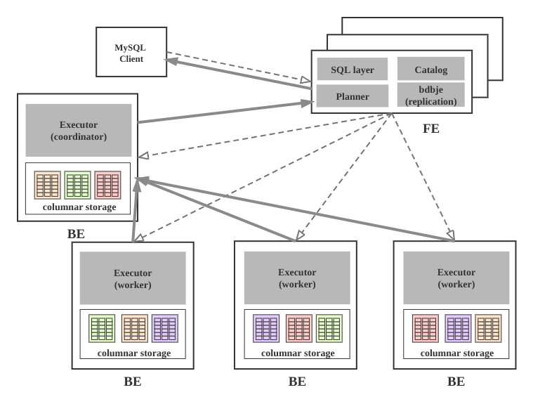

# Architecture

## System Architecture Diagram

## Components

The StarRocks cluster is composed of FE and BE, and can be accessed via MySQL client.

### FE

* Connects to the MySQL client, parses and executes SQL statements.
* Manages metadata, executes SQL DDL commands, and uses Catalog to record information about databases, tables, partitions, and tablet replications.
* High-availability deployment. Use unique replication protocol to select leader and synchronize metadata.
* The leader FE modifies metadata; follower FEs perform read operations. Metadata read and write satisfies sequential consistency.
* The number of FE nodes is 2n+1, which can tolerate n node failures. If the FE leader node fails, one of the follower nodes gets selected as the new leader node to complete the failover.
* FE's SQL layer parses, analyzes, and rewrites users’ SQL statements. It also performs semantic analysis and relational algebra optimization, and produces logical execution plans.
* FE Planner is responsible for transforming logical plans into physical plans that can be distributed to BE.
* FE supervises BE, manages BE's online and offline, and maintains the number of tablet copies based on BE's health status.
* FE coordinates data import to ensure data consistency.

### BE

* Manages tablet copies. Tablets are sub-tables with columnar storage, formed by table partitioning and hashing.
* Creates or deletes sub-tables, instructed by FE.
* Receives physical execution plans distributed by FE. The BE coordinator cooperates with other BE workers to complete executions.
* Obtains data from the local column storage engine, and quickly filters it through indexing and predicate pushdown.
* Executes compact tasks in the background to reduce read amplification during queries.
* During data import, FE designates the BE coordinator to write fanout-form data to the BE where the multiple copies of the tablet are located.

### Other Components

* Hdfs Broker: used for importing data from Hdfs to StarRocks cluster, see [Data Import section](../loading/Loading_intro.md).
