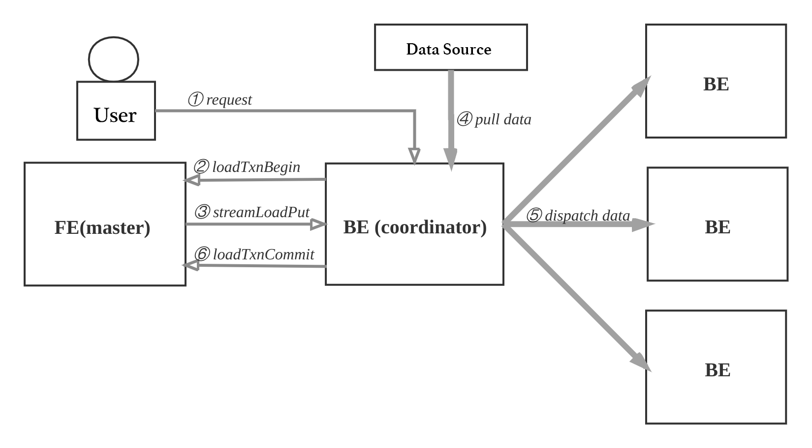

# Data Flow and Control Flow

## Query

User can use MySQL client to connect to FE, execute SQL queries, and get results.

The query process is as follows:

* The MySQL client executes DQL SQL commands.
* Through analysis, modification, and optimization, the FE generates distributed execution plans.
* The distributed execution plan consists of several plan fragments that can be executed on a single BE. The FE executes `exec\_plan\_fragment`, distributes the fragments to the BE, and designates one of the BEs as the coordinator.
* The BE performs local calculations, such as scanning data.
* Other BEs call `transimit\_data` to send the intermediate results to the BE coordinator to aggregate the final result.
* The FE calls `fetch\_data` to get the final result.
* The FE sends the final result to the MySQL client.

The actual execution process is complicated given that vectorization is adopted. For example, one operator generates 4096 results and then outputs to the next operator for calculation rather than batching or one-tuple-at-a-time.

## Data Import

After creating the table, user can import data.

* Supported data sources: local files, HDFS, Kafka, and S3.
* Supported import methods: batching import, streaming, real-time import.
* Supported data formats: CSV, Parquet, ORC, and etc.
* Supported import initiation methods: use RESTful interface, execute SQL commands.

The data import process is as follows:

* The user selects a BE as the coordinator, initiates a data import request that specifies the data format, data source, and label. The label is an identifier used to avoid repeated data imports. The user can also initiate a request to the FE, and the FE will redirect the request to the BE.
* After receiving the request, the BE reports to the leader FE node, executes `loadTxnBegin`, and creates a global transaction. Due to that the base table and multiple buckets of the materialized index need to be updated at the same time, the global transaction is used to control the atomicity of this import to ensure consistency.
* When the transaction is created successfully, it executes the `streamLoadPut` call to obtain the data import plan from the FE. Data import can be regarded as distributing data to all tablets copies involved, and the import plan contains data schemas and tablet replication information.
* The BE pulls data from the data source, and constructs the internal data format based on the schemas of the base table and materialized index table.
* According to the partitioning and bucketing rules and the copy location information, the BE coordinator packs and sends the data batches. The receiving BE writes the data to the corresponding bucket replication.
* When the BE coordinator node completes the data import, it executes `loadTxnCommit` to the leader FE node, submits the global transaction, and sends the execution status. The leader FE confirms that most of the tablets involved are successfully copied, and makes the data publicly visible. If the import fails, the data won’t be visible and inconsistent data will be cleaned up in the background.

## Modify Metadata

The following operations involve metadata modification: create a database, a table, a materialized view, and modify a schema, which requires:

* Data persistence;
* Ensure high availability, replicate the FE on multiple instances to avoid single points of failure;
* Some operations need to be performed on the BE. For example, when creating a table, you need to create a tablet copy on the BE.

The updating process of metadata is as follows:

* The user uses the MySQL client to execute SQL DDL commands and initiate a request to the leader FE. For example, create a table.
* FE checks the validity of the request and then initiates a synchronization command to the BE. In other words, the FE first determines whether the column type of the table is valid, calculates the placement position of the tablet copy, and then requests the BE to create a copy.
* If the BE executes successfully, the memory catalog will be modified. That is, the information of the table, partition, index, and tablet copy will be saved in the catalog.
* FE appends and materializes this operation to `EditLog`.
* FE synchronizes the new operation of `EditLog` to follower FEs through the replication protocol.
* After receiving the newly added operation item, follower FEs will play back it in sequence on its own catalog to ensure it catches up with the leader FE node.

If any part of the execution fails, this metadata modification will fail.

