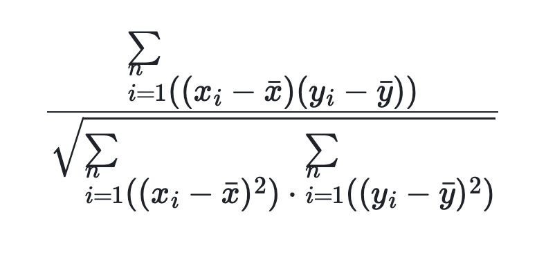

# CORR

## Description

Returns the Pearson correlation coefficient between two expressions. This function is supported from v2.5.10. It can also be used as a window function.

## Syntax

```Haskell
CORR(expr1, expr2)
```

## Parameters

`expr1` and `expr2` must evaluate to TINYINT, SMALLINT, INT, BIGINT, LARGEINT, FLOAT, DOUBLE, or DECIMAL.

If `expr1` and `expr2` are table columns, this function calculates the correlation coefficient of these two columns.

## Return value

Returns a DOUBLE value. The formula is as follows, where `n` represents the row count of the table:



<!--$$
\frac{\sum_{i=1}^{n}((x_i - \bar{x})(y_i - \bar{y}))}{\sqrt{\sum_{i=1}^{n}((x_i - \bar{x})^2) \cdot \sum_{i=1}^{n}((y_i - \bar{y})^2)}}
$$-->

## Usage notes

- A data row is counted only when the two columns in this row are non-null values. Otherwise, this data row is eliminated from the result.

- 0 is returned if `n` is 1.

- NULL is returned in any input is NULL.

## Examples

Suppose table `agg` has the following data:

```plaintext
mysql> select * from agg;
+------+-------+-------+
| no   | k     | v     |
+------+-------+-------+
|    1 | 10.00 |  NULL |
|    2 | 10.00 | 11.00 |
|    2 | 20.00 | 22.00 |
|    2 | 25.00 |  NULL |
|    2 | 30.00 | 35.00 |
+------+-------+-------+
```

Calculate the correlation coefficient of the `k` and `v` columns:

```plaintext
mysql> select no,CORR(k,v) from agg group by no;
+------+--------------------+
| no   | corr(k, v)         |
+------+--------------------+
|    1 |               NULL |
|    2 | 0.9988445981121532 |
+------+--------------------+
```
