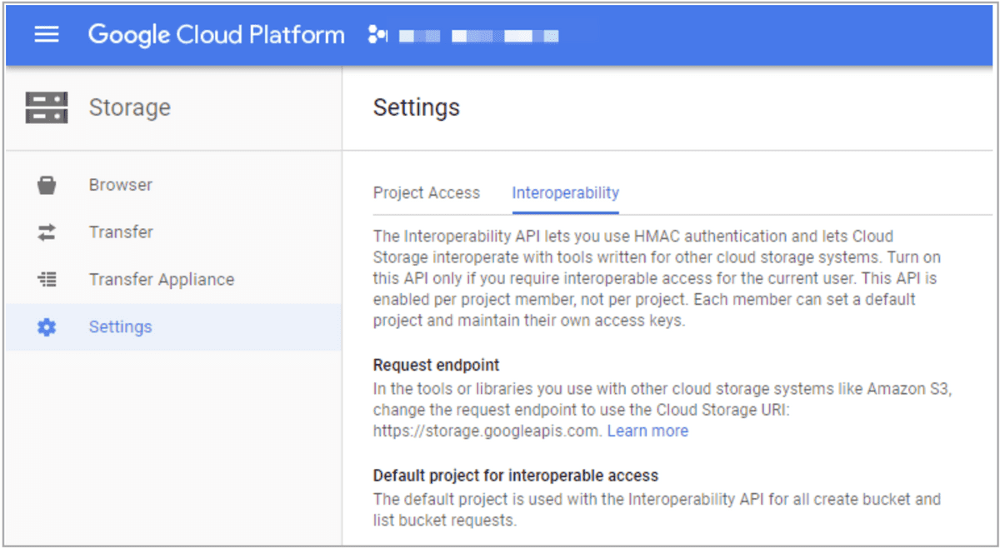

# BROKER LOAD

## Description

StarRocks provides the MySQL-based loading method Broker Load. After you submit a load job, StarRocks asynchronously runs the job. You need to use [SHOW LOAD](../../../sql-reference/sql-statements/data-manipulation/SHOW%20LOAD.md) or `curl` to check the job result. For more information about the background information, prerequisites, principles, supported data file formats, supported external storage systems, and how to perform single-table loads and multi-table loads, see [Load data from HDFS or cloud storage](../../../loading/BrokerLoad.md).

## Syntax

```SQL
LOAD LABEL [<database_name>.]<label_name>
(
    data_desc[, data_desc ...]
)
WITH BROKER
(
    StorageCredentialParams
)
[PROPERTIES
(
    opt_properties
)
]
```

Note that in StarRocks some literals are used as reserved keywords by the SQL language. Do not directly use these keywords in SQL statements. If you want to use such a keyword in an SQL statement, enclose it in a pair of backticks (`). See [Keywords](../../../sql-reference/sql-statements/keywords.md).

## Parameters

### database_name and label_name

`label_name` specifies the label of the load job.

`database_name` optionally specifies the name of the database to which the destination table belongs.

Each load job has a label that is unique across the entire database. You can use the label of a load job to view the execution status of the load job and prevent repeatedly loading the same data. When a load job enters the **FINISHED** state, its label cannot be reused. Only the label of a load job that has entered the **CANCELLED** state can be reused. In most cases, the label of a load job is reused to retry that load job and load the same data, thereby implementing Exactly-Once semantics.

For label naming conventions, see [System limits](../../../reference/System_limit.md).

### data_desc

The description of a batch of data to be loaded. Each `data_desc` descriptor declares information such as the data source, ETL functions, destination StarRocks table, and destination partitions.

Broker Load supports loading multiple data files at a time. In one load job, you can use multiple `data_desc` descriptors to declare multiple data files you want to load, or use one `data_desc` descriptor to declare one file path from which you want to load all data files in it. Broker Load can also ensure the transactional atomicity of each load job that is run to load multiple data files. Atomicity means that the loading of multiple data files in one load job must all succeed or fail. It never happens that the loading of some data files succeeds while the loading of the other files fails.

`data_desc` supports the following syntax:

```SQL
DATA INFILE ("<file_path>"[, "<file_path>" ...])
[NEGATIVE]
INTO TABLE <table_name>
[PARTITION (<partition1_name>[, <partition2_name> ...])]
[TEMPORARY PARTITION (<temporary_partition1_name>[, <temporary_partition2_name> ...])]
[COLUMNS TERMINATED BY "<column_separator>"]
[ROWS TERMINATED BY "<row_separator>"]
[FORMAT AS "CSV | Parquet | ORC"]
[(column_list)]
[COLUMNS FROM PATH AS (<partition_field_name>[, <partition_field_name> ...])]
[SET <k1=f1(v1)>[, <k2=f2(v2)> ...]]
[WHERE predicate]
```

`data_desc` must include the following parameters:

- `file_path`

  Specifies the save path of one or more data files you want to load.

  You can specify this parameter as the save path of one data file. For example, you can specify this parameter as `"hdfs://<hdfs_host>:<hdfs_port>/user/data/tablename/20210411"` to load a data file named `20210411` from the path `/user/data/tablename` on the HDFS server.

  You can also specify this parameter as the save path of multiple data files by using wildcards `?`, `*`, `[]`, `{}`, or `^`. See [Wildcard reference](https://hadoop.apache.org/docs/stable/api/org/apache/hadoop/fs/FileSystem.html#globStatus-org.apache.hadoop.fs.Path-). For example, you can specify this parameter as `"hdfs://<hdfs_host>:<hdfs_port>/user/data/tablename/*/*"` or `"hdfs://<hdfs_host>:<hdfs_port>/user/data/tablename/dt=202104*/*"` to load the data files from all partitions or only `202104` partitions in the path `/user/data/tablename` on the HDFS server.

  > **NOTE**
  >
  > Wildcards can also be used to specify intermediate paths.

  In the preceding examples, the `hdfs_host` and `hdfs_port` parameters are described as follows:

  - `hdfs_host`: the IP address of the NameNode host in the HDFS cluster.

  - `hdfs_host`: the FS port of the NameNode host in the HDFS cluster. The default port number is `9000`.

  > **NOTICE**
  >
  > Broker Load supports accessing AWS S3 according to the S3 or S3A protocol. Therefore, when you load data from AWS S3, you can include `s3://` or `s3a://` as the prefix in the S3 URI that you pass as the file path.

- `INTO TABLE`

  Specifies the name of the destination StarRocks table.

`data_desc` can also optionally include the following parameters:

- `NEGATIVE`

  Revokes the loading of a specific batch of data. To achieve this, you need to load the same batch of data with the `NEGATIVE` keyword specified.

  > **NOTE**
  >
  > This parameter is valid only when the StarRocks table is an Aggregate table and all its value columns are computed by the `sum` function.

- `PARTITION`

   Specifies the partitions into which you want to load data. By default, if you do not specify this parameter, the source data will be loaded into all partitions of the StarRocks table.

- `TEMPORARY_PARTITION`

  Specifies the name of the [temporary partition](../../../table_design/Temporary_partition.md) into which you want to load data. You can specify multiple temporary partitions, which must be separated by commas (,).

- `COLUMNS TERMINATED BY`

  Specifies the column separator used in the data file. By default, if you do not specify this parameter, this parameter defaults to `\t`, indicating tab. The column separator you specify using this parameter must be the same as the column separator that is actually used in the data file. Otherwise, the load job will fail due to inadequate data quality, and its `State` will be `CANCELLED`.

  Broker Load jobs are submitted according to the MySQL protocol. StarRocks and MySQL both escape characters in the load requests. Therefore, if the column separator is an invisible character such as tab, you must add a backslash (\) preceding the column separator. For example, you must input `\\t` if the column separator is `\t`, and you must input `\\n` if the column separator is `\n`. Apache Hive™ files use `\x01` as their column separator, so you must input `\\x01` if the data file is from Hive.

  > **NOTE**
  >
  > - For CSV data, you can use a UTF-8 string, such as a comma (,), tab, or pipe (|), whose length does not exceed 50 bytes as a text delimiter.
  > - Null values are denoted by using `\N`. For example, a data file consists of three columns, and a record from that data file holds data in the first and third columns but no data in the second column. In this situation, you need to use `\N` in the second column to denote a null value. This means the record must be compiled as `a,\N,b` instead of `a,,b`. `a,,b` denotes that the second column of the record holds an empty string.

- `ROWS TERMINATED BY`

  Specifies the row separator used in the data file. By default, if you do not specify this parameter, this parameter defaults to `\n`, indicating line break. The row separator you specify using this parameter must be the same as the row separator that is actually used in the data file. Otherwise, the load job will fail due to inadequate data quality, and its `State` will be `CANCELLED`. This parameter is supported from v2.5.4 onwards.

  For the usage notes about the row separator, see the usage notes for the preceding `COLUMNS TERMINATED BY` parameter.

- `FORMAT AS`

  Specifies the format of the data file. Valid values: `CSV`, `Parquet`, and `ORC`. By default, if you do not specify this parameter, StarRocks determines the data file format based on the filename extension **.csv**, **.parquet**, or **.orc** specified in the `file_path` parameter.

- `column_list`

  Specifies the column mapping between the data file and the StarRocks table. Syntax: `(<column_name>[, <column_name> ...])`. The columns declared in `column_list` are mapped by name onto the StarRocks table columns.

  > **NOTE**
  >
  > If the columns of the data file are mapped in sequence onto the columns of the StarRocks table, you do not need to specify `column_list`.

  If you want to skip a specific column of the data file, you only need to temporarily name that column as different from any of the StarRocks table columns. For more information, see [Transform data at loading](../../../loading/Etl_in_loading.md).

- `COLUMNS FROM PATH AS`

  Extracts the information about one or more partition fields from the file path you specify. This parameter is valid only when the file path contains partition fields.

  For example, if the data file is stored in the path `/path/col_name=col_value/file1` in which `col_name` is a partition field and can be mapped onto a column of the StarRocks table, you can specify this parameter as `col_name`. As such, StarRocks extracts `col_value` values from the path and loads them into the StarRocks table column onto which `col_name` is mapped.

  > **NOTE**
  >
  > This parameter is available only when you load data from HDFS.

- `SET`

  Specifies one or more functions that you want to use to convert a column of the data file. Examples:

  - The StarRocks table consists of three columns, which are `col1`, `col2`, and `col3` in sequence. The data file consists of four columns, among which the first two columns are mapped in sequence onto `col1` and `col2` of the StarRocks table and the sum of the last two columns is mapped onto `col3` of the StarRocks table. In this case, you need to specify `column_list` as `(col1,col2,tmp_col3,tmp_col4)` and specify `(col3=tmp_col3+tmp_col4)` in the SET clause to implement data conversion.
  - The StarRocks table consists of three columns, which are `year`, `month`, and `day` in sequence. The data file consists of only one column that accommodates date and time values in `yyyy-mm-dd hh:mm:ss` format. In this case, you need to specify `column_list` as `(tmp_time)` and specify `(year = year(tmp_time), month=month(tmp_time), day=day(tmp_time))` in the SET clause to implement data conversion.

- `WHERE`

  Specifies the conditions based on which you want to filter the source data. StarRocks loads only the source data that meets the filter conditions specified in the WHERE clause.

### WITH BROKER

In v2.4 and earlier, input `WITH BROKER "<broker_name>"` to specify the broker you want to use. From v2.5 onwards, you no longer need to specify a broker, but you still need to retain the `WITH BROKER` keyword. For more information, see [Load data from HDFS or cloud storage > Background information](../../../loading/BrokerLoad.md#background-information).

### StorageCredentialParams

The authentication information used by StarRocks to access your storage system.

#### HDFS

Open-source HDFS supports two authentication methods: simple authentication and Kerberos authentication. Broker Load uses simple authentication by default. Open-source HDFS also supports configuring an HA mechanism for the NameNode. If you choose open-source HDFS as your storage system, you can specify the authentication configuration and HA configuration as follows:

- Authentication configuration

  - If you use simple authentication, configure `StorageCredentialParams` as follows:

    ```Plain
    "hadoop.security.authentication" = "simple"
    "username" = "<hdfs_username>",
    "password" = "<hdfs_password>"
    ```

    The following table describes the parameters in `StorageCredentialParams`.

    | Parameter                       | Description                                                  |
    | ------------------------------- | ------------------------------------------------------------ |
    | hadoop.security.authentication  | The authentication method. Valid values: `simple` and `kerberos`. Default value: `simple`. `simple` represents simple authentication, meaning no authentication, and `kerberos` represents Kerberos authentication. |
    | username                        | The username of the account that you want to use to access the NameNode of the HDFS cluster. |
    | password                        | The password of the account that you want to use to access the NameNode of the HDFS cluster. |

  - If you use Kerberos authentication, configure `StorageCredentialParams` as follows:

    ```Plain
    "hadoop.security.authentication" = "kerberos",
    "kerberos_principal = "nn/zelda1@ZELDA.COM",
    "kerberos_keytab = "/keytab/hive.keytab",
    "kerberos_keytab_content = "YWFhYWFh"
    ```

    The following table describes the parameters in `StorageCredentialParams`.

    | Parameter                       | Description                                                  |
    | ------------------------------- | ------------------------------------------------------------ |
    | hadoop.security.authentication  | The authentication method. Valid values: `simple` and `kerberos`. Default value: `simple`. `simple` represents simple authentication, meaning no authentication, and `kerberos` represents Kerberos authentication. |
    | kerberos_principal              | The Kerberos principal to be authenticated. Each principal consists of the following three parts to ensure that it is unique across the HDFS cluster:<ul><li>`username` or `servicename`: The name of the principal.</li><li>`instance`: the name of the server that hosts the node to be authenticated in the HDFS cluster. The server name helps ensure that the principal is unique, for example, when the HDFS cluster consists of multiple DataNodes that each are independently authenticated.</li><li>`realm`: The name of the realm. The realm name must be capitalized. Example: `nn/[zelda1@ZELDA.COM](mailto:zelda1@ZELDA.COM)`.</li></ul> |
    | kerberos_keytab                 | The save path of the Kerberos keytab file. |
    | kerberos_keytab_content         | The Base64-encoded content of the the Kerberos keytab file. You can choose to specify either `kerberos_keytab` or `kerberos_keytab_content`. |

    If you have configured multiple Kerberos users, make sure that at least one independent [broker group](../../../deployment/deploy_broker.md) is deployed, and in the load statement you must input `WITH BROKER "<broker_name>"` to specify the broker group you want to use. Additionally, you must open the broker startup script file **start_broker.sh** and modify line 42 of the file to enable the brokers to read the **krb5.conf** file. Example:

    ```Plain
    export JAVA_OPTS="-Dlog4j2.formatMsgNoLookups=true -Xmx1024m -Dfile.encoding=UTF-8 -Djava.security.krb5.conf=/etc/krb5.conf"
    ```

    > **NOTE**
    >
    > - In the preceding example, `/etc/krb5.conf` can be replaced with your actual save path of the **krb5.conf** file. Make sure that the broker has read permissions on that file. If the broker group consists of multiple brokers, you must modify the **start_broker.sh** file on each broker node and then restart the broker nodes to make the modifications take effect.
    > - You can use the [SHOW BROKER](../Administration/SHOW%20BROKER.md) statement to check for brokers that are deployed in your StarRocks cluster.

- HA configuration

  You can configure an HA mechanism for the NameNode of the HDFS cluster. This way, if the NameNode is switched over to another node, StarRocks can automatically identify the new node that serves as the NameNode. This includes the following scenarios:

  - If you load data from a single HDFS cluster that has one Kerberos user configured, both load-based loading and load-free loading are supported.
  
    - To perform load-based loading, make sure that at least one independent [broker group](../../../deployment/deploy_broker.md) is deployed, and place the `hdfs-site.xml` file to the `{deploy}/conf` path on the broker node that serves the HDFS cluster. StarRocks will add the `{deploy}/conf` path to the environment variable `CLASSPATH` upon broker startup, allowing the brokers to read information about the HDFS cluster nodes.
  
    - To perform load-free loading, place the `hdfs-site.xml` file to the `{deploy}/conf` paths of each FE node and each BE node.
  
  - If you load data from a single HDFS cluster that has multiple Kerberos users configured, only broker-based loading is supported. Make sure that at least one independent [broker group](../../../deployment/deploy_broker.md) is deployed, and place the `hdfs-site.xml` file to the `{deploy}/conf` path on the broker node that serves the HDFS cluster. StarRocks will add the `{deploy}/conf` path to the environment variable `CLASSPATH` upon broker startup, allowing the brokers to read information about the HDFS cluster nodes.

  - If you load data from multiple HDFS clusters (regardless of whether one or multiple Kerberos users are configured), only broker-based loading is supported. Make sure that at least one independent [broker group](../../../deployment/deploy_broker.md) is deployed for each of these HDFS clusters, and take one of the following actions to enable the brokers to read information about the HDFS cluster nodes:

    - Place the `hdfs-site.xml` file to the `{deploy}/conf` path on the broker node that serves each HDFS cluster. StarRocks will add the `{deploy}/conf` path to the environment variable `CLASSPATH` upon broker startup, allowing the brokers to read information about the nodes in that HDFS cluster.

    - Add the following HA configuration at job creation:

      ```Plain
      "dfs.nameservices" = "ha_cluster",
      "dfs.ha.namenodes.ha_cluster" = "ha_n1,ha_n2",
      "dfs.namenode.rpc-address.ha_cluster.ha_n1" = "<hdfs_host>:<hdfs_port>",
      "dfs.namenode.rpc-address.ha_cluster.ha_n2" = "<hdfs_host>:<hdfs_port>",
      "dfs.client.failover.proxy.provider" = "org.apache.hadoop.hdfs.server.namenode.ha.ConfiguredFailoverProxyProvider"
      ```

      The following table describes the parameters in the HA configuration.

      | Parameter                          | Description                                                  |
      | ---------------------------------- | ------------------------------------------------------------ |
      | dfs.nameservices                   | The name of the HDFS cluster.                                |
      | dfs.ha.namenodes.XXX               | The name of the NameNode in the HDFS cluster. If you specify multiple NameNode names, separate them with commas (`,`). `xxx` is the HDFS cluster name that you have specified in `dfs.nameservices`. |
      | dfs.namenode.rpc-address.XXX.NN    | The RPC address of the NameNode in the HDFS cluster. `NN` is the NameNode name that you have specified in `dfs.ha.namenodes.XXX`. |
      | dfs.client.failover.proxy.provider | The provider of the NameNode to which the client will connect. Default value: `org.apache.hadoop.hdfs.server.namenode.ha.ConfiguredFailoverProxyProvider`. |

  > **NOTE**
  >
  > You can use the [SHOW BROKER](../Administration/SHOW%20BROKER.md) statement to check for brokers that are deployed in your StarRocks cluster.

#### AWS S3

If you choose AWS S3 as your storage system, take one of the following actions:

- To choose the instance profile-based authentication method, configure `StorageCredentialParams` as follows:

  ```SQL
  "aws.s3.use_instance_profile" = "true",
  "aws.s3.region" = "<aws_s3_region>"
  ```

- To choose the assumed role-based authentication method, configure `StorageCredentialParams` as follows:

  ```SQL
  "aws.s3.use_instance_profile" = "true",
  "aws.s3.iam_role_arn" = "<iam_role_arn>",
  "aws.s3.region" = "<aws_s3_region>"
  ```

- To choose the IAM user-based authentication method, configure `StorageCredentialParams` as follows:

  ```SQL
  "aws.s3.use_instance_profile" = "false",
  "aws.s3.access_key" = "<iam_user_access_key>",
  "aws.s3.secret_key" = "<iam_user_secret_key>",
  "aws.s3.region" = "<aws_s3_region>"
  ```

The following table describes the parameters you need to configure in `StorageCredentialParams`.

| Parameter                   | Required | Description                                                  |
| --------------------------- | -------- | ------------------------------------------------------------ |
| aws.s3.use_instance_profile | Yes      | Specifies whether to enable the credential methods instance profile and assumed role. Valid values: `true` and `false`. Default value: `false`. |
| aws.s3.iam_role_arn         | No       | The ARN of the IAM role that has privileges on your AWS S3 bucket. If you choose assumed role as the credential method for accessing AWS S3, you must specify this parameter. Then, StarRocks will assume this role when it accesses your Hive data by using a Hive catalog. |
| aws.s3.region               | Yes      | The region in which your AWS S3 bucket resides. Example: `us-west-1`. |
| aws.s3.access_key           | No       | The access key of your AWS IAM user. If you choose IAM user as the credential method for accessing AWS S3, you must specify this parameter. Then, StarRocks will assume this role when it accesses your Hive data by using a Hive catalog. |
| aws.s3.secret_key           | No       | The secret key of your AWS IAM user. If you choose IAM user as the credential method for accessing AWS S3, you must specify this parameter. Then, StarRocks will assume this user when it accesses your Hive data by using a Hive catalog. |

For information about how to choose an authentication method for accessing AWS S3 and how to configure an access control policy in AWS IAM Console, see [Authentication parameters for accessing AWS S3](../../../integrations/authenticate_to_aws_resources.md#authentication-parameters-for-accessing-aws-s3).

#### Google GCS

If you choose Google GCS as your storage system, configure `StorageCredentialParams` as follows:

```SQL
"fs.s3a.access.key" = "<gcs_access_key>",
"fs.s3a.secret.key" = "<gcs_secret_key>",
"fs.s3a.endpoint" = "<gcs_endpoint>"
```

The following table describes the parameters you need to configure in `StorageCredentialParams`.

| Parameter         | Description                                                  |
| ----------------- | ------------------------------------------------------------ |
| fs.s3a.access.key | The Access Key that you can use to access your Google GCS bucket. |
| fs.s3a.secret.key | The Secret Key that you can use to access your Google GCS bucket. |
| fs.s3a.endpoint   | The endpoint that you can use to access your Google GCS bucket. |

> **NOTE**
>
> Broker Load supports accessing Google GCS only according to the S3A protocol. Therefore, when you load data from Google GCS, you must replace the prefix in the GCS URI you pass as a file path into `DATA INFILE` with `s3a://`.

To create an Access/Secret key pair to access your Google GCS bucket, follow these steps:

1. Log in to [Google GCP](https://console.cloud.google.com/storage/settings).

2. In the left-side navigation pane, choose **Google Cloud Storage** and then **Settings**.

3. Click the **Interoperability** tab.

4. (Optional.) If you have not enabled the Interoperability feature, click **Interoperable Access**.

   

5. Click the **Create new Key** button to create an Access/Secret key pair.

#### Other S3-compatible storage system

If you choose other S3-compatible storage system, such as MinIO, configure `StorageCredentialParams` as follows:

```SQL
"aws.s3.enable_ssl" = "{true | false}",
"aws.s3.enable_path_style_access" = "{true | false}",
"aws.s3.endpoint" = "<s3_endpoint>",
"aws.s3.access_key" = "<iam_user_access_key>",
"aws.s3.secret_key" = "<iam_user_secret_key>"
```

The following table describes the parameters you need to configure in `StorageCredentialParams`.

| Parameter                        | Required | Description                                                  |
| -------------------------------- | -------- | ------------------------------------------------------------ |
| aws.s3.enable_ssl                | Yes      | Specifies whether to enable SSL connection. Valid values: `true` and `false`. Default value: `true`. |
| aws.s3.enable_path_style_access  | Yes      | Specifies whether to enable path-style URL access. Valid values: `true` and `false`. Default value: `false`. |
| aws.s3.endpoint                  | Yes      | The endpoint that is used to connect to your AWS S3 bucket. |
| aws.s3.access_key                | Yes      | The access key of your AWS IAM user. |
| aws.s3.secret_key                | Yes      | The secret key of your AWS IAM user. |

### opt_properties

Specifies some optional parameters whose settings are applied to the entire load job. Syntax:

```Plain
PROPERTIES ("<key1>" = "<value1>"[, "<key2>" = "<value2>" ...])
```

The following parameters are supported:

- `timeout`

  Specifies the timeout period of the load job. Unit: second. The default timeout period is 4 hours. We recommend that you specify a timeout period shorter than 6 hours. If the load job does not finish within the timeout period, StarRocks cancels the load job and the status of the load job becomes **CANCELLED**.

  > **NOTE**
  >
  > In most cases, you do not need to set the timeout period. We recommend that you set the timeout period only when the load job cannot finish within the default timeout period.

  Use the following formula to infer the timeout period:

  **Timeout period > (Total size of the data files to be loaded x Total number of the data files to be loaded and the materialized views created on the data files)/(Average load speed x Maximum number of concurrent instances allowed per task)**

  > **NOTE**
  >
  > - "Average load speed" is the average load speed for your entire StarRocks cluster. The average load speed varies for each cluster depending on the server configuration and the maximum number of concurrent query tasks allowed for the cluster. You can infer the average load speed based on the load speeds of historical load jobs.
  >
  > - "Maximum number of concurrent instances allowed per task" is specified by the `max_broker_concurrency` parameter. For more information, see [Job splitting and concurrent running](../../../loading/BrokerLoad.md#job-splitting-and-concurrent-running).

  Suppose that you want to load a 1-GB data file on which two materialized views are created into a StarRocks cluster whose average load speed is 10 MB/s and maximum number of concurrent instances allowed per task is 3. The amount of time required for the data load is approximately 102 seconds.

  (1 x 1024 x 3)/(10 x 3) = 102 (second)

  For this example, we recommend that you set the timeout period to a value greater than 102 seconds.

- `max_filter_ratio`

  Specifies the maximum error tolerance of the load job. The maximum error tolerance is the maximum percentage of rows that can be filtered out as a result of inadequate data quality. Valid values: `0`~`1`. Default value: `0`.

  - If you set this parameter to `0`, StarRocks does not ignore unqualified rows during loading. As such, if the source data contains unqualified rows, the load job fails. This helps ensure the correctness of the data loaded into StarRocks.

  - If you set this parameter to a value greater than `0`, StarRocks can ignore unqualified rows during loading. As such, the load job can succeed even if the source data contains unqualified rows.

    > **NOTE**
    >
    > Rows that are filtered out due to inadequate data quality do not include rows that are filtered out by the WHERE clause.

  If the load job fails because the maximum error tolerance is set to `0`, you can use [SHOW LOAD](../../../sql-reference/sql-statements/data-manipulation/SHOW%20LOAD.md) to view the job result. Then, determine whether unqualified rows can be filtered out. If unqualified rows can be filtered out, calculate the maximum error tolerance based on the values returned for `dpp.abnorm.ALL` and `dpp.norm.ALL` in the job result, adjust the maximum error tolerance, and submit the load job again. The formula for calculating the maximum error tolerance is as follows:

  `max_filter_ratio` = [`dpp.abnorm.ALL`/(`dpp.abnorm.ALL` + `dpp.norm.ALL`)]

  The sum of the values returned for `dpp.abnorm.ALL` and `dpp.norm.ALL` is the total number of rows to be loaded.

- `load_mem_limit`

  Specifies the maximum amount of memory that can be provided to the load job. Unit: bytes: The default memory limit is 2 GB.

- `strict_mode`

  Specifies whether to enable the [strict mode](../../../loading/load_concept/strict_mode.md). Valid values: `true` and `false`. Default value: `false`. `true` specifies to enable the strict mode, and `false` specifies to disable the strict mode.

- `timezone`

  Specifies the time zone of the load job. Default value: `Asia/Shanghai`. The time zone setting affects the results returned by functions such as strftime, alignment_timestamp, and from_unixtime. For more information, see [Configure a time zone](../../../administration/timezone.md). The time zone specified in the `timezone` parameter is a session-level time zone.

- `priority`

  Specifies the priority of the load job. Valid values: `LOWEST`, `LOW`, `NORMAL`, `HIGH`, and `HIGHEST`. Default value: `NORMAL`. Broker Load provides the [FE parameter](../../../administration/Configuration.md#fe-configuration-items) `max_broker_load_job_concurrency`, determines the maximum number of tasks that can be concurrently run for Broker Load within your StarRocks cluster. If the number of tasks to run for jobs that are submitted within the specified time period exceeds the maximum number, the jobs in the task pool will be waiting to be scheduled based on their priorities.

  You can use the [ALTER LOAD](../../../sql-reference/sql-statements/data-manipulation/ALTER%20LOAD.md) statement to change the priority of an existing load job that is in the `QUEUEING` or `LOADING` state.

  StarRocks allows setting the `priority` parameter for a Broker Load job since v2.5.

## Column mapping

If the columns of the data file can be mapped one on one in sequence to the columns of the StarRocks table, you do not need to configure the column mapping between the data file and the StarRocks table.

If the columns of the data file cannot be mapped one on one in sequence to the columns of the StarRocks table, you need to use the `columns` parameter to configure the column mapping between the data file and the StarRocks table. This includes the following two use cases:

- **Same number of columns but different column sequence.** **Also, the data from the data file does not need to be computed by functions before it is loaded into the matching StarRocks table columns.**

  In the `columns` parameter, you need to specify the names of the StarRocks table columns in the same sequence as how the data file columns are arranged.

  For example, the StarRocks table consists of three columns, which are `col1`, `col2`, and `col3` in sequence, and the data file also consists of three columns, which can be mapped to the StarRocks table columns `col3`, `col2`, and `col1` in sequence. In this case, you need to specify `"columns: col3, col2, col1"`.

- **Different number of columns and different column sequence. Also, the data from the data file needs to be computed by functions before it is loaded into the matching StarRocks table columns.**

  In the `columns` parameter, you need to specify the names of the StarRocks table columns in the same sequence as how the data file columns are arranged and specify the functions you want to use to compute the data. Two examples are as follows:

  - The StarRocks table consists of three columns, which are `col1`, `col2`, and `col3` in sequence. The data file consists of four columns, among which the first three columns can be mapped in sequence to the StarRocks table columns `col1`, `col2`, and `col3` and the fourth column cannot be mapped to any of the StarRocks table columns. In this case, you need to temporarily specify a name for the fourth column of the data file, and the temporary name must be different from any of the StarRocks table column names. For example, you can specify `"columns: col1, col2, col3, temp"`, in which the fourth column of the data file is temporarily named `temp`.
  - The StarRocks table consists of three columns, which are `year`, `month`, and `day` in sequence. The data file consists of only one column that accommodates date and time values in `yyyy-mm-dd hh:mm:ss` format. In this case, you can specify `"columns: col, year = year(col), month=month(col), day=day(col)"`, in which `col` is the temporary name of the data file column and the functions `year = year(col)`, `month=month(col)`, and `day=day(col)` are used to extract data from the data file column `col` and loads the data into the mapping StarRocks table columns. For example, `year = year(col)` is used to extract the `yyyy` data from the data file column `col` and loads the data into the StarRocks table column `year`.

For detailed examples, see [Configure column mapping](#configure-column-mapping).

## Examples

This section uses HDFS as an example to describe various load configurations.

### Load CSV data

This section uses CSV as an example to explain the various parameter configurations that you can use to meet your diverse load requirements.

#### Set timeout period

Your StarRocks database `test_db` contains a table named `table1`. The table consists of three columns, which are `col1`, `col2`, and `col3` in sequence.

Your data file `example1.csv` also consists of three columns, which are mapped in sequence onto `col1`, `col2`, and `col3` of `table1`.

If you want to load all data from `example1.csv` into `table1` within up to 3600 seconds, run the following command:

```SQL
LOAD LABEL test_db.label1
(
    DATA INFILE("hdfs://<hdfs_host>:<hdfs_port>/user/starrocks/data/input/example1.csv")
    INTO TABLE table1
)
WITH BROKER
(
    "username" = "<hdfs_username>",
    "password" = "<hdfs_password>"
)
PROPERTIES
(
    "timeout" = "3600"
);
```

#### Set maximum error tolerance

Your StarRocks database `test_db` contains a table named `table2`. The table consists of three columns, which are `col1`, `col2`, and `col3` in sequence.

Your data file `example2.csv` also consists of three columns, which are mapped in sequence onto `col1`, `col2`, and `col3` of `table2`.

If you want to load all data from `example2.csv` into `table2` with a maximum error tolerance of `0.1`, run the following command:

```SQL
LOAD LABEL test_db.label2
(
    DATA INFILE("hdfs://<hdfs_host>:<hdfs_port>/user/starrocks/data/input/example2.csv")
    INTO TABLE table2

)
WITH BROKER
(
    "username" = "<hdfs_username>",
    "password" = "<hdfs_password>"
)
PROPERTIES
(
    "max_filter_ratio" = "0.1"
);
```

#### Load all data files from a file path

Your StarRocks database `test_db` contains a table named `table3`. The table consists of three columns, which are `col1`, `col2`, and `col3` in sequence.

All data files stored in the `/user/starrocks/data/input/` path of your HDFS cluster also each consist of three columns, which are mapped in sequence onto `col1`, `col2`, and `col3` of `table3`. The column separator used in these data files is `\x01`.

If you want to load data from all these data files stored in the `hdfs://<hdfs_host>:<hdfs_port>/user/starrocks/data/input/` path into `table3`, run the following command:

```SQL
LOAD LABEL test_db.label3
(
    DATA INFILE("hdfs://<hdfs_host>:<hdfs_port>/user/starrocks/data/input/*")
    INTO TABLE table3
    COLUMNS TERMINATED BY "\\x01"
)
WITH BROKER
(
    "username" = "<hdfs_username>",
    "password" = "<hdfs_password>"
);
```

#### Set NameNode HA mechanism

Your StarRocks database `test_db` contains a table named `table4`. The table consists of three columns, which are `col1`, `col2`, and `col3` in sequence.

Your data file `example4.csv` also consists of three columns, which are mapped onto `col1`, `col2`, and `col3` of `table4`.

If you want to load all data from `example4.csv` into `table4` with an HA mechanism configured for the NameNode, run the following command:

```SQL
LOAD LABEL test_db.label4
(
    DATA INFILE("hdfs://<hdfs_host>:<hdfs_port>/user/starrocks/data/input/example4.csv")
    INTO TABLE table4
)
WITH BROKER
(
    "username" = "<hdfs_username>",
    "password" = "<hdfs_password>",
    "dfs.nameservices" = "my_ha",
    "dfs.ha.namenodes.my_ha" = "my_namenode1, my_namenode2","dfs.namenode.rpc-address.my_ha.my_namenode1" = "nn1_host:rpc_port",
    "dfs.namenode.rpc-address.my_ha.my_namenode2" = "nn2_host:rpc_port",
    "dfs.client.failover.proxy.provider" = "org.apache.hadoop.hdfs.server.namenode.ha.ConfiguredFailoverProxyProvider"
);
```

#### Set Kerberos authentication

Your StarRocks database `test_db` contains a table named `table5`. The table consists of three columns, which are `col1`, `col2`, and `col3` in sequence.

Your data file `example5.csv` also consists of three columns, which are mapped in sequence onto `col1`, `col2`, and `col3` of `table5`.

If you want to load all data from `example5.csv` into `table5` with Kerberos authentication configured and the keytab file path specified, run the following command:

```SQL
LOAD LABEL test_db.label5
(
    DATA INFILE("hdfs://<hdfs_host>:<hdfs_port>/user/starrocks/data/input/example5.csv")
    INTO TABLE table5
    COLUMNS TERMINATED BY "\t"
)
WITH BROKER
(
    "hadoop.security.authentication" = "kerberos",
    "kerberos_principal" = "starrocks@YOUR.COM",
    "kerberos_keytab" = "/home/starRocks/starRocks.keytab"
);
```

#### Revoke data loading

Your StarRocks database `test_db` contains a table named `table6`. The table consists of three columns, which are `col1`, `col2`, and `col3` in sequence.

Your data file `example6.csv` also consists of three columns, which are mapped in sequence onto `col1`, `col2`, and `col3` of `table6`.

You have loaded all data from `example6.csv` into `table6` by running a Broker Load job.

If you want to revoke the data you have loaded, run the following command:

```SQL
LOAD LABEL test_db.label6
(
    DATA INFILE("hdfs://<hdfs_host>:<hdfs_port>/user/starrocks/data/input/example6.csv")
    NEGATIVE
    INTO TABLE table6
    COLUMNS TERMINATED BY "\t"
)
WITH BROKER
(
    "hadoop.security.authentication" = "kerberos",
    "kerberos_principal" = "starrocks@YOUR.COM",
    "kerberos_keytab" = "/home/starRocks/starRocks.keytab"
);
```

#### Specify destination partitions

Your StarRocks database `test_db` contains a table named `table7`. The table consists of three columns, which are `col1`, `col2`, and `col3` in sequence.

Your data file `example7.csv` also consists of three columns, which are mapped in sequence onto `col1`, `col2`, and `col3` of `table7`.

If you want to load all data from `example7.csv` into two partitions, `p1` and `p2`, of `table7`, run the following command:

```SQL
LOAD LABEL test_db.label7
(
    DATA INFILE("hdfs://<hdfs_host>:<hdfs_port>/user/starrocks/data/input/example7.csv")
    INTO TABLE table7
    PARTITION (p1, p2)
    COLUMNS TERMINATED BY ","
)
WITH BROKER
(
    "username" = "<hdfs_username>",
    "password" = "<hdfs_password>"
);
```

#### Configure column mapping

Your StarRocks database `test_db` contains a table named `table8`. The table consists of three columns, which are `col1`, `col2`, and `col3` in sequence.

Your data file `example8.csv` also consists of three columns, which are mapped in sequence onto `col2`, `col1`, and `col3` of `table8`.

If you want to load all data from `example8.csv` into `table8`, run the following command:

```SQL
LOAD LABEL test_db.label8
(
    DATA INFILE("hdfs://<hdfs_host>:<hdfs_port>/user/starrocks/data/input/example8.csv")
    INTO TABLE table8
    COLUMNS TERMINATED BY ","
    (col2, col1, col3)
)
WITH BROKER
(
    "username" = "<hdfs_username>",
    "password" = "<hdfs_password>"
);
```

> **NOTE**
>
> In the preceding example, the columns of `example8.csv` cannot be mapped onto the columns of `table8` in the same sequence as how these columns are arranged in `table8`. Therefore, you need to use `column_list` to configure the column mapping between `example8.csv` and `table8`.

#### Set filter conditions

Your StarRocks database `test_db` contains a table named `table9`. The table consists of three columns, which are `col1`, `col2`, and `col3` in sequence.

Your data file `example9.csv` also consists of three columns, which are mapped in sequence onto `col1`, `col2`, and `col3` of `table9`.

If you want to load only the data records whose values in the first column are greater than `20180601` from `example9.csv` into `table9`, run the following command:

```SQL
LOAD LABEL test_db.label9
(
    DATA INFILE("hdfs://<hdfs_host>:<hdfs_port>/user/starrocks/data/input/example9.csv")
    INTO TABLE table9
    (col1, col2, col3)
    where col1 > 20180601
)
WITH BROKER
(
    "username" = "<hdfs_username>",
    "password" = "<hdfs_password>"
);
```

> **NOTE**
>
> In the preceding example, the columns of `example9.csv` can be mapped onto the columns of `table9` in the same sequence as how these columns are arranged in `table9`, but you need to use the WHERE clause to specify column-based filter conditions. Therefore, you need to use `column_list` to configure the column mapping between `example9.csv` and `table9`.

#### Load data into tables containing HLL-type columns

Your StarRocks database `test_db` contains a table named `table10`. The table consists of four columns, which are `id`, `col1`, `col2`, and `col3` in sequence. `col1` and `col2` are defined as HLL-type columns.

Your data file `example10.csv` consists of three columns, among which the first column is mapped onto `id` of `table10` and the second and third columns are mapped in sequence onto `col1` and `col2` of `table10`. The values in the second and third columns of `example10.csv` can be converted into HLL-type data by using functions before they are loaded into `col1` and `col2` of `table10`.

If you want to load all data from `example10.csv` into `table10`, run the following command:

```SQL
LOAD LABEL test_db.label10
(
    DATA INFILE("hdfs://<hdfs_host>:<hdfs_port>/user/starrocks/data/input/example10.csv")
    INTO TABLE table10
    COLUMNS TERMINATED BY ","
    (id, temp1, temp2)
    SET
    (
        col1 = hll_hash(temp1),
        col2 = hll_hash(temp2),
        col3 = empty_hll()
     )
 )
 WITH BROKER
 (
     "username" = "<hdfs_username>",
     "password" = "<hdfs_password>"
 );
```

> **NOTE**
>
> In the preceding example, the three columns of `example10.csv` are named `id`, `temp1`, and `temp2` in sequence by using `column_list`. Then, functions are used to convert data as follows:
>
> - The `hll_hash` function is used to convert the values in `temp1` and `temp2` of `example10.csv` into HLL-type data and map `temp1` and `temp2` of `example10.csv` onto `col1` and `col2` of `table10`.
>
> - The `hll_empty` function is used to fill the specified default value into `col3` of `table10`.

For usage of the functions `hll_hash` and `hll_empty`, see [hll_hash](../../sql-functions/aggregate-functions/hll_hash.md) and [hll_empty](../../sql-functions/aggregate-functions/hll_empty.md).

#### Extract partition field values from file path

Broker Load supports parsing the values of specific partition fields contained in a file path based on the column definitions of the destination StarRocks table. This feature of StarRocks is similar to the Partition Discovery feature of Apache Spark™.

Your StarRocks database `test_db` contains a table named `table11`. The table consists of five columns, which are `col1`, `col2`, `col3`, `city`, and `utc_date` in sequence.

The file path `/user/starrocks/data/input/dir/city=beijing` of your HDFS cluster contains the following data files:

- `/user/starrocks/data/input/dir/city=beijing/utc_date=2019-06-26/0000.csv`

- `/user/starrocks/data/input/dir/city=beijing/utc_date=2019-06-26/0001.csv`

These data files each consist of three columns, which are mapped in sequence onto `col1`, `col2`, and `col3` of `table11`.

If you want to load data from all data files from the file path `/user/starrocks/data/input/dir/city=beijing/utc_date=*/*` into `table11` and, at the same time, you want to extract the values of the partition fields `city` and `utc_date` contained in the file path and load the extracted values into `city` and `utc_date` of `table11`, run the following command:

```SQL
LOAD LABEL test_db.label11
(
    DATA INFILE("hdfs://<hdfs_host>:<hdfs_port>/user/starrocks/data/input/dir/city=beijing/*/*")
    INTO TABLE table11
    FORMAT AS "csv"
    (col1, col2, col3)
    COLUMNS FROM PATH AS (city, utc_date)
    SET (uniq_id = md5sum(k1, city))
)
WITH BROKER
(
    "username" = "<hdfs_username>",
    "password" = "<hdfs_password>"
);
```

#### Extract partition field values from `%3A`-included file path

In HDFS, file paths cannot contain colons (:). All colons (:) will be converted into `%3A`.

Your StarRocks database `test_db` contains a table named `table12`. The table consists of three columns, which are `data_time`, `col1`, and `col2` in sequence. The table schema is as follows:

```SQL
data_time DATETIME,
col1        INT,
col2        INT
```

The file path `/user/starrocks/data` of your HDFS cluster contains the following data files:

- `/user/starrocks/data/data_time=2020-02-17 00%3A00%3A00/example12.csv`

- `/user/starrocks/data/data_time=2020-02-18 00%3A00%3A00/example12.csv`

If you want to load all data from `example12.csv` into `table12` and, at the same time, you want to extract the values of the partition field `data_time` from the file path and load the extracted values into `data_time` of `table12`, run the following command:

```SQL
LOAD LABEL test_db.label12
(
    DATA INFILE("hdfs://<hdfs_host>:<hdfs_port>/user/starrocks/data/*/example12.csv")
    INTO TABLE table12
    COLUMNS TERMINATED BY ","
    FORMAT AS "csv"
    (col1,col2)
    COLUMNS FROM PATH AS (data_time)
    SET (data_time = str_to_date(data_time, '%Y-%m-%d %H%%3A%i%%3A%s'))
)
WITH BROKER
(
    "username" = "<hdfs_username>",
    "password" = "<hdfs_password>"
);
```

> **NOTE**
>
> In the preceding example, the values extracted from the partition field `data_time` are strings that contain `%3A`, such as `2020-02-17 00%3A00%3A00`. Therefore, you need to use the `str_to_date` function to convert the strings into DATETIME-type data before they are loaded into `data_time` of `table8`.

### Load Parquet data

This section describes some parameters settings you need to take note of when you load Parquet data.

Your StarRocks database `test_db` contains a table named `table13`. The table consists of three columns, which are `col1`, `col2`, and `col3` in sequence.

Your data file `example13.parquet` also consists of three columns, which are mapped in sequence onto `col1`, `col2`, and `col3` of `table13`.

If you want to load all data from `example13.parquet` into `table13`, run the following command:

```SQL
LOAD LABEL test_db.label13
(
    DATA INFILE("hdfs://<hdfs_host>:<hdfs_port>/user/starrocks/data/input/example13.parquet")
    INTO TABLE table13
    FORMAT AS "parquet"
    (col1, col2, col3)
)
WITH BROKER
(
    "username" = "<hdfs_username>",
    "password" = "<hdfs_password>"
);
```

> **NOTE**
>
> By default, when you load Parquet data, StarRocks determines the data file format based on whether the filename contains the extension **.parquet**. If the filename does not contain the extension **.parquet**, you must use `FORMAT AS` to specify the data file format as `Parquet`.

### Load ORC data

This section describes some parameters settings you need to take note of when you load ORC data.

Your StarRocks database `test_db` contains a table named `table14`. The table consists of three columns, which are `col1`, `col2`, and `col3` in sequence.

Your data file `example14.orc` also contains three columns, which are mapped in sequence onto `col1`, `col2`, and `col3` of `table14`.

If you want to load all data from `example14.orc` into `table14`, run the following command:

```SQL
LOAD LABEL test_db.label14
(
    DATA INFILE("hdfs://<hdfs_host>:<hdfs_port>/user/starrocks/data/input/example14.orc")
    INTO TABLE table14
    FORMAT AS "orc"
    (col1, col2, col3)
)
WITH BROKER
(
    "username" = "<hdfs_username>",
    "password" = "<hdfs_password>"
);
```

> **NOTE**
>
> - By default, when you load ORC data, StarRocks determines the data file format based on whether the filename contains the extension **.orc**. If the filename does not contain the extension **.orc**, you must use `FORMAT AS` to specify the data file format as `ORC`.
>
> - In StarRocks v2.3 and earlier, if the data file contains ARRAY-type columns, you must make sure that the columns of the ORC data file have the same names as their mapping columns in the StarRocks table and the columns cannot be specified in the SET clause.
