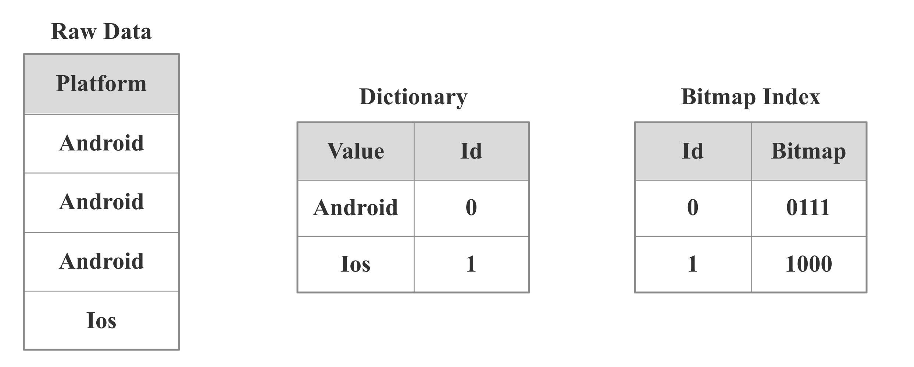

# Bitmap Indexing

StarRocks supports bitmap-based indexing that significantly speeds up queries.

## Principle

### What is  Bitmap

Bitmap is an array of one-bit elements with 0 and 1 value. Those elements can be set and cleared. Bitmap can be used in the following scenarios:

* Use two long types to represent the gender of 16 students. 0 represents female and 1 represents male.
* A bitmap indicates whether there is a null value in a set of data, where 0 represents the element is not null and 1 represents null.
* A bitmap indicates quarters (Q1, Q2, Q3, Q4), where 1 represents Q4 and 0 represents the other quarters.

### What is  Bitmap index

Bitmap can only represent an array of columns with two values. When the values of the columns are of multiple enumeration types, such as quarters (Q1, Q2, Q3, Q4) and system platforms (Linux, Windows, FreeBSD, MacOS), it is not possible to encode them in a single Bitmap. In this case, you can create a Bitmap for each value and a dictionary of the actual enumerated values.

As shown above, there are 4 rows of data in the `platform` column, and the possible values are `Android` and `iOS`. StarRocks will first build a dictionary for the `platform` column, and then map `Android` and `iOS` to int. `Android` and `iOS` are encoded as 0 and 1 respectively.Since `Android` appears in rows 1, 2 and 3, the bitmap is 0111; `iOS` appears in row 4, the bitmap is 1000.

If there is a SQL query against the table containing the `platform` column, e.g. `select xxx from table where Platform = iOS`, StarRocks will first look up the dictionary to find the `iOS` whose encoding value is 1, and then go to the bitmap index to find out that 1 corresponds to a bitmap of 1000. As a result, StarRocks will only read the 4th row of data as it meets the query condition.

## Suitable scenarios

### Non-prefix filtering

Referring to [shortkey index](../table_design/Sort_key.md), StarRocks can quickly filter the first few columns by shortkey indexing. However, for the columns that are in the middle or the end, shortkey indexing doesn’t work. Instead, users can create a bitmap index for filtering.

### Multi-Column Filtering

Since Bitmap can perform bitwise operations quickly, users can consider creating a bitmap index for each column in a multi-column filtering scenario.

## How to use

### Create an Index

Create a bitmap index for the `site_id` column on table1.

~~~ SQL
CREATE INDEX index_name ON table1 (site_id) USING BITMAP COMMENT 'balabala';
~~~

### View an index

Show the index under the specified `table_name`.

~~~ SQL
SHOW INDEX FROM example_db.table_name;
~~~

### Delete an index

Delete an index with the specified name from a table.

~~~ SQL
DROP INDEX index_name ON [db_name.]table_name;
~~~

## Notes

1. For the duplicate model, all columns can be bitmap indexed; for the aggregate model, only the key column can be Bitmap indexed.
2. Bitmap indexes should be created on columns that have enumerated values, a large number of duplicate values, and a low base. These columns are used for equivalence queries or can be converted to equivalence queries.
3. Bitmap indexes are not supported for Float, Double, or Decimal type columns.
4. To see whether a query hits the Bitmap index, check the its profile information.
