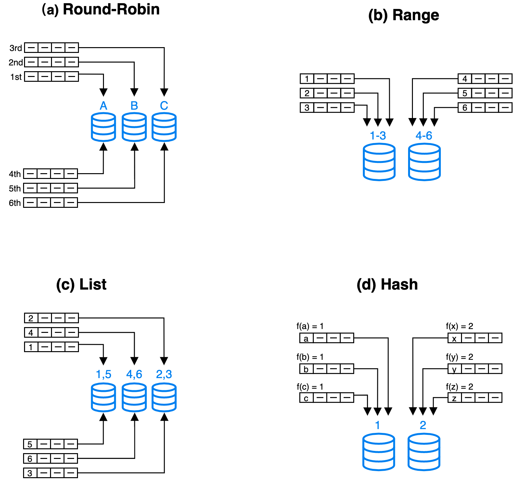

# Data distribution

When you create a table, you can specify the data distribution method by configuring the partitioning and bucketing strategy in the table. An appropriate data distribution method helps evenly distribute data across the nodes of your StarRocks cluster. It can also reduce the data scanned and make full use of the concurrency of the cluster during queries, thereby improving query performance.

> **NOTICE**
>
> - Since v3.1, you do not need to specify the bucketing key in the DISTRIBUTED BY clause when creating a table or adding partitions. StarRocks supports random bucketing, which randomly distributes data across all buckets. For more information, see [Random bucketing](#random-bucketing-since-v31).
> - Since v2.5.7, you no longer need to manually set the number of buckets when you create a table or add a partition. StarRocks can automatically set the number of buckets (BUCKETS). However, if the performance does not meet your expectations after StarRocks automatically sets the number of buckets and you are familiar with the bucketing mechanism, you can still [manually set the number of buckets](#determine-the-number-of-buckets).

## Distribution methods

### Distribution methods in general

Modern distributed database systems generally use the following basic distribution methods: round-robin, range, list, and hash.



- **Round-robin**: distributes data across different nodes in a cyclic.
- **Range**: distributes data across different nodes based on the value range of partitioning columns.
- **List**: distributes data across different nodes based on the discrete values of partitioning columns, such as age.
- **Hash**: distributes data across different nodes based on a hash algorithm.

To achieve more flexible data distribution, you can combine the preceding distribution methods based on your business requirements, such as hash-hash, range-hash, and hash-list.

### Distribution methods in StarRocks

StarRocks supports both seperate and composite use of data distribution methods.

> **NOTE**
>
> In addition to the general distribution methods, StarRocks also supports Random distribution to simplify bucketing configuration.

Also, StarRocks distributes data by implementing the two level partitioning + bucketing method.

- The first level is partitioning: Data within a table can be partitioned. The partitioning method supports range partitioning and list partitioning. Or you can choose not to use partitioning (the entire table is regarded as one partition).
- The second level is bucketing: Data in a partition needs to be further distributed into smaller bucktes. The bucketing method supports hash or random bucketing.

| Distribution method       | Partitioning + bucketing method              | Description                                                  |
| ------------------------- | -------------------------------------------- | ------------------------------------------------------------ |
| Random distribution       | Random bucketing                             | The entire table is considered a partition. Data in the table is randomly distributed into different buckets. This is the default data distribution method. |
| Hash distribution         | Hash bucketing                               | The entire table is considered a partition. The data in the table is distributed to the corresponding bucket, which is based on the hash value of the data's bucketing key by using a hashing function. |
| Range+Random distribution | Expression partitioning + Range partitioning | The data of the table is partitioned based on the ranges of values in the partitioning columns.The data within a partition is randomly distributed across different buckets. |
| Range+Hash distribution   | Range partitioning + hash bucketing          | The data of the table is partitioned based on the ranges of values in the partitioning column.The data within a partition is distributed to the corresponding bucket, which is based on the hash value of the data's bucketing key by using a hashing function. |
| List+Hash distribution    | List partitioning + hash bucketing           | The data in the table is divided into different partitions based on the list of column values for each partition.The data within a partition is distributed to the corresponding bucket, which is based on the hash value of the data's bucketing key by using a hashing function. |
| List+Random distribution  | List partitioning + Random bucketing         | The data in the table is divided into different partitions based on the list of column values for each partition.The data within a partition is randomly distributed across different buckets. |

- **Random distribution**

  If you do not configure partitioning and bucketing methods at table creation, random distribution is used by default.

  ```SQL
  CREATE TABLE site_access1 (
      event_day DATE,
      site_id INT DEFAULT '10', 
      pv BIGINT DEFAULT '0' ,
      city_code VARCHAR(100),
      user_name VARCHAR(32) DEFAULT ''
  )
  DUPLICATE KEY (event_day,site_id,pv);
  -- Because the partitioning and bucketing methods are not configured, Random distribution is used by default (currently only support Deplicate Key tables).
  ```

- **Hash distribution**

  ```SQL
  CREATE TABLE site_access2 (
      event_day DATE,
      site_id INT DEFAULT '10',
      city_code SMALLINT,
      user_name VARCHAR(32) DEFAULT '',
      pv BIGINT SUM DEFAULT '0'
  )
  AGGREGATE KEY (event_day, site_id, city_code, user_name)
  -- Use hash bucketing as the bucketing method and must specify the bucketing key.
  DISTRIBUTED BY HASH(event_day,site_id); 
  ```

- **Range+Random distribution**

  ```SQL
  CREATE TABLE site_access3 (
      event_day DATE,
      site_id INT DEFAULT '10', 
      pv BIGINT DEFAULT '0' ,
      city_code VARCHAR(100),
      user_name VARCHAR(32) DEFAULT ''
  )
  DUPLICATE KEY(event_day,site_id,pv)
  -- Use expression partitioning as the partitioning method and configure a time function expression.
  -- You can also use range partitioning.
  PARTITION BY date_trunc('day', event_day);
  -- Because the bucketing method is not configured, Random bucketing is used by default (currently only support Deplicate Key tables).
  ```

- **Range+Hash distribution**

  ```SQL
  CREATE TABLE site_access4 (
      event_day DATE,
      site_id INT DEFAULT '10',
      city_code VARCHAR(100),
      user_name VARCHAR(32) DEFAULT '',
      pv BIGINT SUM DEFAULT '0'
  )
  AGGREGATE KEY(event_day, site_id, city_code, user_name)
  -- Use expression partitioning as the partitioning method and configure a time function expression.
  -- You can also use range partitioning.
  PARTITION BY date_trunc('day', event_day)
  -- Use hash bucketing as the bucketing method and must specify the bucketing key.
  DISTRIBUTED BY HASH(event_day, site_id);
  ```

- **List+Random distribution**

  ```SQL
  CREATE TABLE t_recharge_detail1 (
      id bigint,
      user_id bigint,
      recharge_money decimal(32,2), 
      city varchar(20) not null,
      dt date not null
  )
  DUPLICATE KEY(id)
  -- Use expression partitioning as the partitioning method and specify the partition column.
  -- You can also use list partitioning.
  PARTITION BY (city);
  -- Because the bucketing method is not configured, Random bucketing is used by default (currently only support Deplicate Key tables).
  ```

- **List+Hash distribution**

  ```SQL
  CREATE TABLE t_recharge_detail2 (
      id bigint,
      user_id bigint,
      recharge_money decimal(32,2), 
      city varchar(20) not null,
      dt date not null
  )
  DUPLICATE KEY(id)
  -- Use expression partitioning as the partitioning method and specify the partition column.
  -- You can also use list partitioning.
  PARTITION BY (city)
  -- Use hash bucketing as the bucketing method and must specify the bucketing key.
  DISTRIBUTED BY HASH(city,id); 
  ```

#### Partitioning

Partitioning divides a table into multiple segments called partitions based on the partitioning column you specified. You can set a storage strategy for partitions, including the number of replicas, strategy of storing hot or cold data, and storage medium. StarRocks allows you to use multiple storage mediums within a cluster. For example, you can store the latest data on solid-state drives (SSD) to improve query performance, and historical data on SATA hard drives to reduce storage costs.

| Partitioning method                   | Scenarios                                                    | Methods to create partitions                       |
| ------------------------------------- | ------------------------------------------------------------ | -------------------------------------------------- |
| Expression partitioning (recommended) | Previously known as automatic partitioning. This partitioning method is more flexible and user-friendly. It is suitable for most scenarios including querying and managing data based on date/numeric ranges or emurated values. | Automatically created during data loading.         |
| Range partitioning                    | The typical scenario is to store simple and ordered data that is often queried and managed based on continuous date/numeric ranges. For instance, in some special cases, historical data needs to be partitioned by month, while recent data needs to be partitioned by day. | Dynamically createdCreated in batchCreatedmanually |
| List partitioning                     | A typical scenario is to query and manage data based on emurated values, where a partition needs to include data with different values for each partition column. For example, if you frequently query and manage data based on country and city, you can use this method and select `city` as the partition column. So a partition can contain data for multiple cities belonging to one country. | Created manually                                    |

**How to choose partition columns and unit**

- Selecting a suitable partition column can effectively reduce the amount of data scanned during queries. In most business systems, partitioning based on time is commonly chosen to optimize performance issues caused by deleting expired data and facilitate tiered storage of hot and cold data. In this case, you can use expression partitioning and range partitioning to specify a time column as the partition column. Additionally, if the data is frequently queried and managed based on emurated values, you can use expression partitioning and list partitioning to specify a column including these values as the partition column.
- When choosing the partitioning unit, factors such as data volume, query patterns, and data management granularity need to be considered.
  - Example 1: If the monthly data volume of a table is small, partitioning by month can reduce the number of metadata entries compared to partitioning by day, thereby reducing the resource consumption of metadata management and scheduling.
  - Example 2: If the monthly data volume of a table is large and most query conditions are precise to the day, partitioning by day can effectively reduce the amount of data scanned during queries.
  - Example 3: If the data needs to expire on a daily basis, partitioning by day can be used.

#### Bucketing

Bucketing divides a partition into multiple more manageable parts called buckets or tablets, which is the smallest unit of storage that you can use and allocate. StarRocks uses a hash algorithm to bucket data. Data with the same hash value of the bucketing column is distributed to the same tablet. StarRocks creates multiple replicas (three by default) for each tablet to prevent data loss. These replicas are managed by a separate local storage engine.

Since v3.1, StarRocks supports random bucketing, which means that you no longer need to set a bucketing key during table creation or when adding new partitions. Since v2.5.7, StarRocks can automatically set the number of buckets (BUCKETS) when you create a table or add a partition. You no longer need to manually set the number of buckets. For detailed information, see [Design bucketing rules](#design-bucketing-rules).

## Create and manage partitions

### Create partitions

#### Expression partitioning (recommended)

> **NOTICE**
>
> Since v3.1,  StarRocks's [shared-data mode](../deployment/deploy_shared_data.md) supports the time function expression and does not support the column expression.

Since v3.0, StarRocks supports [expression partitioning](./expression_partitioning.md) (previously known as automatic partitioning) which is more flexible and user-friendly. This partitioning method is suitable for most scenarios including querying and managing data based on continuous date ranges or emurated values.

You only need to specify a partition expression (either a time function expression or a column expression) at table creation, and StarRocks will automatically create partitions during data loading. You no longer need to manually create numerous partitions in advance, nor configure dynamic partition properties.

#### Range partitioning

Range partitioning is suitable for storing simple and contiguous data, such as time series data (dates or timestamps) or continuous numerical data. And you frequently query and manage data based on continuous date/numerical ranges. Also, it can be applied in some special cases where historical data needs to be partitioned by month, and recent data needs to be partitioned by day.

StarRocks will store data in the corresponding partition based on the explicit mapping of the predefined range for each partition.

**Dynamic partitioning**

StarRocks supports [dynamic partitioning](./dynamic_partitioning.md), which can automatically manage the time to live (TTL) of partitions, such as partitioning new input data in tables and deleting expired partitions. This feature significantly reduces maintenance costs.

**Manually create partitions**

You can manually create range partitions one by one by using the LESS THAN clause to specify the upper bound of each partition. For more information, see [CREATE TABLE](../sql-reference/sql-statements/data-definition/CREATE%20TABLE.md).

```SQL
PARTITION BY RANGE (k1, k2, ...)
(
    PARTITION partition_name1 VALUES LESS THAN ("value1", "value2", ...),
    PARTITION partition_name2 VALUES LESS THAN ("value1", "value2", ...),
    PARTITION partition_name3 VALUES LESS THAN (MAXVALUE)
)
```

You can manually create range partitions one by one by specifying the upper and lower bounds of each partition. The upper bound of each partition is an open interval while the lower bound is a closed interval. For more information, see [CREATE TABLE](../sql-reference/sql-statements/data-definition/CREATE%20TABLE.md).

```SQL
PARTITION BY RANGE (k1, k2, k3, ...)
(
    PARTITION partition_name1 VALUES [("k1-lower1", "k2-lower1", "k3-lower1",...), ("k1-upper1", "k2-upper1", "k3-upper1", ...)],
    PARTITION partition_name2 VALUES [("k1-lower1-2", "k2-lower1-2", ...), ("k1-upper1-2", MAXVALUE, )],
    "k3-upper1-2", ...
)
```

**Create multiple partitions at a time**

Partition a table by specifying START, END, and EVERY. You can create multiple partitions at a time by using this method. For more information, see [CREATE TABLE](../sql-reference/sql-statements/data-definition/CREATE%20TABLE.md).

```SQL
PARTITION BY RANGE (k1, k2, ...) 
(
    START ("value1") END ("value2") EVERY (INTERVAL value3 day)
)
```

- **Partition a table on a date-type column (DATE and DATETIME) at the table creation**

  In the following example, the data type of the partitioning column is DATE and you specify the time range of partitioning via START and END and define the time range via EVERY.

    ```SQL
    CREATE TABLE site_access (
        datekey DATE,
        site_id INT,
        city_code SMALLINT,
        user_name VARCHAR(32),
        pv BIGINT DEFAULT '0'
    )
    ENGINE=olap
    DUPLICATE KEY(datekey, site_id, city_code, user_name)
    PARTITION BY RANGE (datekey) (
        START ("2021-01-01") END ("2021-01-04") EVERY (INTERVAL 1 DAY)
    )
    DISTRIBUTED BY HASH(site_id)
    PROPERTIES ("replication_num" = "3" );
    ```

  The PARTITION BY RANGE clause in this example is equal to the following:

    ```SQL
    PARTITION BY RANGE (datekey) (
    PARTITION p20210101 VALUES [('2021-01-01'), ('2021-01-02')),
    PARTITION p20210102 VALUES [('2021-01-02'), ('2021-01-03')),
    PARTITION p20210103 VALUES [('2021-01-03'), ('2021-01-04'))
    )
    ```

  In the following example, the data type of the partitioning column is DATE and you specify different EVERY clauses for different time ranges (which cannot overlap with each other). Example:

    ```SQL
    CREATE TABLE site_access(
        datekey DATE,
        site_id INT,
        city_code SMALLINT,
        user_name VARCHAR(32),
        pv BIGINT DEFAULT '0'
    )
    ENGINE=olap
    DUPLICATE KEY(datekey, site_id, city_code, user_name)
    PARTITION BY RANGE (datekey) 
    (
        START ("2019-01-01") END ("2021-01-01") EVERY (INTERVAL 1 YEAR),
        START ("2021-01-01") END ("2021-05-01") EVERY (INTERVAL 1 MONTH),
        START ("2021-05-01") END ("2021-05-04") EVERY (INTERVAL 1 DAY)
    )
    DISTRIBUTED BY HASH(site_id)
    PROPERTIES(
        "replication_num" = "3"
    );
    ```

  The PARTITION BY RANGE clause in this example is equal to the following:

    ```SQL
    PARTITION BY RANGE (datekey) (
    PARTITION p2019 VALUES [('2019-01-01'), ('2020-01-01')),
    PARTITION p2020 VALUES [('2020-01-01'), ('2021-01-01')),
    PARTITION p202101 VALUES [('2021-01-01'), ('2021-02-01')),
    PARTITION p202102 VALUES [('2021-02-01'), ('2021-03-01')),
    PARTITION p202103 VALUES [('2021-03-01'), ('2021-04-01')),
    PARTITION p202104 VALUES [('2021-04-01'), ('2021-05-01')),
    PARTITION p20210501 VALUES [('2021-05-01'), ('2021-05-02')),
    PARTITION p20210502 VALUES [('2021-05-02'), ('2021-05-03')),
    PARTITION p20210503 VALUES [('2021-05-03'), ('2021-05-04'))
    )
    ```

- **Partition a table on an integer type column at the table creation**

  In the following example, the data type of the partitioning column is INT and you specify the value range of partitioning by using START and END and define the incremental value via EVERY. Example:

  > **NOTE**
  >
  > Do not double quote the incremental value defined by EVERY.

    ```SQL
    CREATE TABLE site_access (
        datekey INT,
        site_id INT,
        city_code SMALLINT,
        user_name VARCHAR(32),
        pv BIGINT DEFAULT '0'
    )
    ENGINE=olap
    DUPLICATE KEY(datekey, site_id, city_code, user_name)
    PARTITION BY RANGE (datekey) (START ("1") END ("5") EVERY (1)
    )
    DISTRIBUTED BY HASH(site_id)
    PROPERTIES ("replication_num" = "3");
    ```

  The PARTITION BY RANGE clause in this example is equal to the following:

    ```SQL
    PARTITION BY RANGE (datekey) (
    PARTITION p2019 VALUES [('2019-01-01'), ('2020-01-01')),
    PARTITION p2020 VALUES [('2020-01-01'), ('2021-01-01')),
    PARTITION p202101 VALUES [('2021-01-01'), ('2021-02-01')),
    PARTITION p202102 VALUES [('2021-02-01'), ('2021-03-01')),
    PARTITION p202103 VALUES [('2021-03-01'), ('2021-04-01')),
    PARTITION p202104 VALUES [('2021-04-01'), ('2021-05-01')),
    PARTITION p20210501 VALUES [('2021-05-01'), ('2021-05-02')),
    PARTITION p20210502 VALUES [('2021-05-02'), ('2021-05-03')),
    PARTITION p20210503 VALUES [('2021-05-03'), ('2021-05-04'))
    )
    ```

**Create partitions at a time after a table is created.**

  After a table is created, you can use the ALTER TABLE statement to add partitions for the table.

  ```SQL
  ALTER TABLE site_access 
  ADD PARTITIONS START ("2021-01-04") END ("2021-01-06") EVERY (INTERVAL 1 DAY);
  ```

#### List partitioning (since v3.1)

[List Partitioning](./list_partitioning.md) is suitable for accelerating queries and efficiently managing data based on emurated values. It is especially useful for scenarios where a partition needs to include data with different values in a partition column. For example, if you frequently query and manage data based on countries and cities, you can use this partitioning method and select the `city` column as the partition column. In this case, one partition can contain data of various cities belonging to one country.

StarRocks will store data in the corresponding partitions based on the explicit mapping of the predefined list of values for each partition.

### Manage  partitions

#### View partitions

The following statement displays all partitions in table `site_access`.

```SQL
SHOW PARTITIONS FROM site_access;
```

#### Add partitions

For range partitioning and list partitioning, you can manually add new partitions to store input data in a table. However for expression partitioning, because partitions are created autocmatically during data loading, you do not need to do so.

The following statement adds a new partition `p4` to table `site_access` to store data generated in April.

```SQL
ALTER TABLE site_access
ADD PARTITION p4 VALUES LESS THAN ("2020-04-30")
DISTRIBUTED BY HASH(site_id);
```

#### Delete a partition

The following statement deletes partition `p1` from table `site_access`.

```SQL
ALTER TABLE site_access
DROP PARTITION p1;
```

> Note: If a partition is deleted within 24 hours, the data of the partition remains in Trash. During the period, you can execute the RECOVER statement to restore this data.

#### Restore a partition

The following statement restores partition `p1` to table `site_access`.

RECOVER PARTITION p1 FROM site_access;

## Design bucketing rules

### Hash bucketing

Data in partitions can be subdivided into tablets based on the hash values of the bucketing columns and [the number of buckets](#determine-the-number-of-buckets).

**How to choose the bucketing columns**

We recommend that you choose the column that satisfy the following two requirements as the bucketing column.

- high cardinality column such as ID
- column that often used as a filter in queries

But if the column that satisfies both requirements does not exist, you need to determine the buckting column according to the complexity of queries.

- If the query is complex, it is recommended that you select the high cardinality column as the bucketing column to ensure that the data is as balanced as possible in each bucket and improve the cluster resource utilization.
- If the query is relatively simple, then it is recommended to select the column that is often used as in the query condition as the bucketing column to improve the query efficiency.

If partition data cannot be evenly distributed into each tablet by using one bucketing column, you can choose multiple bucketing columns. You can decide on the number of bucketing columns based on the following scenarios:

- One bucketing column: This method can reduce data transmission between nodes. It improves the performance of short-running query because short-running query only runs on one server and scan a small amount of data.
- Multiple bucketing columns: This method makes the most of the concurrency performance of a distributed cluster. It improves the performance of long-running query because long-running query runs across multiple servers and scan a large amount of data by using multiple servers in parallel. We recommend that you choose three bucketing columns at most.

**Precautions**

- **When a table is created, you must specify the bucketing columns**.
- The values of bucketing columns cannot be updated.
- Bucketing columns cannot be modified after they are specified.

**Examples**

In the following example, the `site_access` table is created by using `site_id` as the bucketing column. Because this column is high cardinality column and is always used as a filter in queries. When the bucketing column `site_id` is used as a filter in queries, StarRocks only scans the relevant tablets, which greatly improves query performance.

```SQL
CREATE TABLE site_access(
    event_day DATE,
    site_id INT DEFAULT '10',
    city_code VARCHAR(100),
    user_name VARCHAR(32) DEFAULT '',
    pv BIGINT SUM DEFAULT '0'
)
AGGREGATE KEY(event_day, site_id, city_code, user_name)
PARTITION BY RANGE(event_day)
(
    PARTITION p1 VALUES LESS THAN ("2020-01-31"),
    PARTITION p2 VALUES LESS THAN ("2020-02-29"),
    PARTITION p3 VALUES LESS THAN ("2020-03-31")
)
DISTRIBUTED BY HASH(site_id);
```

Suppose each partition of table `site_access` has 10 buckets. In the following query, 9 out of 10 buckets are pruned, so StarRocks only needs to scan 1/10 of the data in the `site_access` table:

```SQL
select sum(pv)
from site_access
where site_id = 54321;
```

However, if `site_id` is unevenly distributed and a large number of queries are destined for only a few sites, the preceding bucketing method will cause severe data skew, causing system performance bottlenecks. In this case, you can use a combination of bucketing columns. For example, the following statement uses `site_id` and `city_code` as bucketing columns.

```SQL
CREATE TABLE site_access
(
    site_id INT DEFAULT '10',
    city_code SMALLINT,
    user_name VARCHAR(32) DEFAULT '',
    pv BIGINT SUM DEFAULT '0'
)
AGGREGATE KEY(site_id, city_code, user_name)
DISTRIBUTED BY HASH(site_id,city_code);
```

### Random bucketing (since v3.1)

For data in a partition, StarRocks distributes the data randomly across all buckets, which is not based on specific column values. Additionally, you do not need to set bucketing columns at the table creation, which simplifies the CREATE TABLE statement. It is suitable for scenarios with relatively small data sizes and requirement for high query performance.

However, note that random bucketing may not be suitable for scenarios that involve querying and aggregating based on specific columns. In such cases, hash bucketing may be more appropriate as it can store similar data in the same bucket, facilitating data access and processing.

**Precautions**

- You can not use random bucketing to create a Primary Key table, a Unique Key table, or an aggregated table.
- You can not specify a table bucketed randomly to belong to a [Colocation Group](../using_starrocks/Colocate_join.md).
- [Spark Load](../loading/SparkLoad.md) can not be used to load data into tables bucketed randomly.

In the following example, a table `site_access1` is created by using random bucketing, and the system automatically sets the number of buckets.

```SQL
CREATE TABLE site_access1(
    event_day DATE,
    site_id INT DEFAULT '10',
    city_code VARCHAR(100),
    user_name VARCHAR(32) DEFAULT '',
    pv BIGINT SUM DEFAULT '0'
)
DUPLICATE KEY(event_day,site_id,city_code,pv);
```

However, if you are familiar with StarRocks' bucketing mechanism, you can also manually set the number of buckets when creating a table with random bucketing.

```SQL
CREATE TABLE site_access(
    event_day DATE,
    site_id INT DEFAULT '10',
    city_code VARCHAR(100),
    user_name VARCHAR(32) DEFAULT '',
    pv BIGINT SUM DEFAULT '0'
)
DUPLICATE KEY(event_day,site_id,city_code,pv)
DISTRIBUTED BY RANDOM BUCKETS 8; -- manually set the number of buckets to 8
```

### Determine the number of buckets

Buckets reflect how data files are organized in StarRocks.

- How to set the number of buckets when creating a table
  - Method 1: automatically set the number of buckets (Recommended)
    Since v2.5.7, StarRocks supports automatically setting the number of buckets based on machine resources and data volume for a partition.

    Example:

      ```SQL
      CREATE TABLE site_access(
          site_id INT DEFAULT '10',
          city_code SMALLINT,
          user_name VARCHAR(32) DEFAULT '',
          pv BIGINT SUM DEFAULT '0'
      )
      AGGREGATE KEY(site_id, city_code, user_name)
      DISTRIBUTED BY HASH(site_id,city_code); -- do not need to set the number of buckets
      ```

    To enable this feature, make sure that the FE dynamic parameter `enable_auto_tablet_distribution` is set to `TRUE`. After a table is created, you can execute [SHOW CREATE TABLE](../sql-reference/sql-statements/data-manipulation/SHOW%20CREATE%20VIEW.md) to view the bucket number automatically set by StarRocks.
  - Method 2: manually set the number of buckets
    StarRocks 2.4 and later versions support using multiple threads to scan a tablet in parallel during a query, thereby reducing the dependency of scanning performance on the tablet count. We recommend that each tablet contain about 10 GB of raw data. If you intend to manually set the number of buckets, you can estimatethe the amount of data in each partition of a table and then decide the number of tablets. To enable parallel scanning on tablets, make sure the `enable_tablet_internal_parallel` parameter is set to `TRUE` globally for the entire system (`SET GLOBAL enable_tablet_internal_parallel = true;`).

    ```SQL
    CREATE TABLE site_access (
        site_id INT DEFAULT '10',
        city_code SMALLINT,
        user_name VARCHAR(32) DEFAULT '',
        pv BIGINT SUM DEFAULT '0')
    AGGREGATE KEY(site_id, city_code, user_name)
    -- Suppose the amount of raw data that you want to load into a partition is 300 GB.
    -- Because we recommend that each tablet contain 10 GB of raw data, the number of buckets can be set to 30.
    DISTRIBUTED BY HASH(site_id,city_code) BUCKETS 30;
    ```

- How to set the number of buckets when adding a partition
  - Method 1: automatically set the number of buckets (Recommended)
    Since v2.5.7, StarRocks supports automatically setting the number of buckets based on machine resources and data volume for a partition. To enable this feature, make sure that the FE dynamic parameter `enable_auto_tablet_distribution` retains the default value `TRUE`.

    To disable this feature, run the `ADMIN SET FRONTEND CONFIG ('enable_auto_tablet_distribution' = 'false');` statement. And when a new partition is added without specifying the number of buckets, the new partition inherits the the number of buckets set at the creation of the table. After a new partition is added successfully, you can execute SHOW PARTITIONS to view the number of buckets automatically set by StarRocks for the new partition.
  - Method 2: manually set the number of buckets
    You can also manually specify the bucket count when adding a new partition. To calculate the number of buckets for a new partition, you can refer to the approach used when manually setting the number of buckets at table creation, as mentioned above.

      ```SQL
      -- Manually create partitions
      ALTER TABLE <table_name> 
      ADD PARTITION <partition_name>
          [DISTRIBUTED BY HASH (k1[,k2 ...]) [BUCKETS num]];
          
      -- Dynamic partitioning
      ALTER TABLE <table_name> 
      SET ("dynamic_partition.buckets"="xxx");
      ```

> **NOTICE**
>
> You cannot modify the number of buckets for an existing partition. You can only modify the number of buckets when you add a partition.
