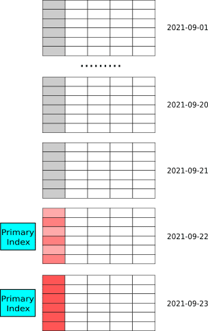

# Data Models

According to the mapping relationship between ingested data and actual stored data, StarRocks provides corresponding data models for different types of tables. Here we reference the concept of primary key (in the relational model), and use the value of the key column as the sort key. Compared with the traditional primary key,StarRocks’s sort key has these features:

* All key columns are sort keys, so the sort key mentioned later is essentially a key column.
* Sort keys are repeatable and do not have to satisfy the uniqueness constraint.
* Each column of the table is stored by cluster in the order of the sorted keys.
* Sort keys use sparse indexes.

There are three models that can be used to ingest multiple rows of data with duplicate primary keys and populate them to data tables:

* Duplicate model: There are rows of data with duplicate primary keys in the table. The stored data and ingested data rows correspond to each other, so that users can recall all historical data.
* Aggregation model: There are no data rows with duplicate primary keys. In this case, those rows are merged into one row according to the aggregation function. Users can recall the aggregated results of all historical data, but not the data itself.
* Update model: This is a special case of aggregation model. In this model, the primary key satisfies the uniqueness constraint, and the most recently ingested row replaces the other rows that have duplicate primary keys. This is equivalent to an aggregation model in which the aggregation function is `REPLACE`, and the `REPLACE` function returns the most recent data in the set.

Note:

* In the table build statement, the definition of the sort key must appear before the definition of the value column.
* The order of key columns appearing in the build statement determines the order of sort keys presented.
* The shortkey index contains several prefix columns of the sort key.

## Duplicate model

### Scenarios for duplicate model

Duplicate model is the default model in StarRocks.

The suitable scenarios have the following characteristics:

* Need to retain the original data (e.g. logs, operational records, etc.) for analysis.
* Be able to query flexibly and not limited to pre-defined analytical methods, which are difficult to accomplish by traditional pre-aggregation methods.
* Infrequent data updates. The source of the imported data is usually log data or time-series data, which is mainly characterized by append write and the data itself will not change much after it is generated.

### Principle of duplicate model

Users can specify the sort key of the table. If it’s not explicitly specified, StarRocks will set default columns as the sort key. When the sort key is set as a filter, StarRocks can quickly filter the data and reduce query latency.

Note: When importing two identical rows of data into a duplicate model table, StarRocks will consider them as two rows of data.

### How to use duplicate model

The table adopts the duplicate model by default. The sort key uses shortkey index to filter the data quickly. Users can consider setting the frequently used key column as sort key. For example, if you frequently view data for a certain type of event in a certain time range, you can set `event time` and `event type` as sort keys.

The following is an example of creating a data table using the duplicate model.

* Where `DUPLICATE KEY(event_time, event_type)` indicates that the duplicate model is used, and the sort key is defined before the definitions of other columns.

~~~sql
CREATE TABLE IF NOT EXISTS detail (
 event_time DATETIME NOT NULL COMMENT "datetime of event",
 event_type INT NOT NULL COMMENT "type of event",
 user_id INT COMMENT "id of user"
 device_code INT COMMENT "device of",
 channel INT COMMENT ""
)
DUPLICATE KEY(event_time, event_type)
DISTRIBUTED BY HASH(user_id) BUCKETS 8
~~~

### Notes on duplicate model

Make full use of the sort key by defining the frequently used columns up front to improve query speed. In the duplicate model, you can specify some of the key columns as sort keys, whereas in the aggregation model and update model, the sort keys can only be all key columns.

## Aggregation model

### Scenarios for aggregation model

Data statistics and aggregation are common concepts of data analysis. For example:

* Website or APP owners monitor data on total visits and visit duration
* Advertising vendors gather data onad clicks, total number of displays, and consumption statistics for advertisers;
* Marketing people analyze data on annual transactions and top products of each demographic category for a specific quarter or month.

The suitable scenarios for  using aggregation model have the following characteristics:

* Queries need to be aggregated through `sum`, `count`, and/or `max`.
* No need to recall the original data.
* Historical data will not be updated frequently;new data will be appended.

### Principle of aggregation model

StarRocks aggregates value columns by corresponding key columns, which reduces the amount of data for processing and increases query efficiency.

Take the following raw data as an example.

| Date | Country | PV |
| :---: | :---: | :---: |
| 2020.05.01 | CHN | 1 |
| 2020.05.01 | CHN | 2 |
| 2020.05.01 | USA | 3 |
| 2020.05.01 | USA | 4 |

In the StarRocks aggregation model, the four rows of data are converted to two rows, which reduces the amount of data processed during the subsequent query.

|   Date  |   Country  |   PV  |
| :---: | :---: | :---: |
|  2020.05.01   |  CHN   |  3   |
|  2020.05.01   |  USA   |  7   |

### How to use aggregation model

When creating a table, the aggregation model is enabled by specifying the aggregation function for the value column. Users can use the `AGGREGATE KEY` to define the sort key.

The following is an example of creating a data table using the aggregation model.

* `site_id`, `date` and `city_code` are sort keys;
* `pv` is the value column, using the aggregation function `SUM`.

~~~sql
CREATE TABLE IF NOT EXISTS example_db.aggregate_tbl (
 site_id LARGEINT NOT NULL COMMENT "id of site",
 date DATE NOT NULL COMMENT "time of event",
 city_code VARCHAR(20) COMMENT "city_code of user"
 pv BIGINT SUM DEFAULT "0" COMMENT "total page views"
)
DISTRIBUTED BY HASH(site_id) BUCKETS 8;
~~~

### Notes on aggregation model

The data in the aggregation table will be imported in batches several times, and each import is a new data version. There are three triggers for aggregation:

* When the data is imported, aggregation is performed before the data is spilled to disk.
* After the data is spilled to disk, asynchronous aggregation of multiple versions is performed in the background ;
* Multi-version multi-way aggregation is performed during the query.

During the query, the value columns are aggregated first and then filtered, and the filtered columns are stored as key  columns.

Refer to "Create Table Statement" for the list of aggregation functions supported by the aggregation model.

## Update model

### Scenarios for update model

Update model is tailored to the scenarios where data gets constantly updated. For example, in an e-commerce scenario, the status of an order often changes, and the number of order updates can exceed hundreds of millions per day. Using the duplicate model to delete old data and insert new data can barely meet the frequent update requirements. The update model is designed for such scenarios. Its suitable scenarios has the following characteristics:

* There is a demand for constantly updating a large amount of data.
* Real-time data analysis is required.

### Principle of update model

In the update model, the sort key satisfies the uniqueness constraint and is the primary key.

The StarRocks internally assigns a version number to each batch of imported data. There may be more than one version of the same primary key. When querying, it returns the largest (latest) version of the data.

| ID | value | _version |
| :---: | :---: | :---: |
| 1 | 100 | 1 |
| 1 | 101 | 2 |
| 2 | 100 | 3 |
| 2 | 101 | 4 |
| 2 | 102 | 5 |

As shown in the example above, `ID` is the primary key, `value` is the content, and`__version` is the internal version number. The data with `ID=1` has two import batches, version 1 and 2 respectively.  The data with `ID=2` has three import batches, version 3, 4 and 5 respectively. When querying, only the data of the latest version will return (as shown as follow):

| ID | value |
| :---: | :---: |
| 1 | 101 |
| 2 | 102 |

Through this mechanism, StarRocks can support the analysis of frequently updated data.

### How to use update model

In e-commerce scenarios, statistical analysis is often based on order status. Although the order status changes frequently, `create_time` and `order_id` do not change and therefore are often used as filter conditions in queries. Users set the `create_time` and `order_id` columns as primary keys(i.e., defined with the `UNIQUE KEY` keyword when creating a table), which meet the demand for order status updates and allow for quick filtering in queries.

The following is an example of creating a data table using the update model.

* Use `UNIQUE KEY`(`create_time`, `order_id`) as the primary key, where `create_time` and`order_id` are in the queue, and their definitions appear before the definitions of other columns;
* `order_state` and `total_price` are value columns, and their aggregation type is `REPLACE`.

~~~sql
CREATE TABLE IF NOT EXISTS detail (
 create_time DATE NOT NULL COMMENT "create time of an order",
 order_id BIGINT NOT NULL COMMENT "id of an order",
 order_state INT COMMENT "state of an order",
 total_price BIGINT COMMENT "price of an order"
)
UNIQUE KEY(create_time, order_id)
DISTRIBUTED BY HASH(order_id) BUCKETS 8
~~~

### Notes on update model

* When importing data, you need to complete all fields, i.e., `create_time`, `order_id`, `order_state` and `total_price` in the above example.
* When reading data in an update model, multiple versions need to be merged during the query. Given the large number of versions the query performance will be degraded. Therefore, you should reduce the frequency of importing data to an update model. The import frequency should be designed to meet the business requirements for real-time performance.
* When querying, filtering is usually performed after multiple versions are merged. To improve query performance, place the value columns that are often filtered but not modified on the primary key. During merging, all primary keys will be compared. For better performance, users should avoid defining too many primary keys. If a column is only occasionally present as a filter condition, it does not need to be placed in the primary key.

## Primary key model

### Scenarios

The primary key model has better support for real-time and frequent updates than the update model. You must specify unique primary keys for tables that use the primary key model. This way, rows in the tables can be updated and deleted based on the primary keys.
The primary key model is suitable for real-time data updates, especially for scenarios in which data needs to be synchronized from MySQL or other databases to StarRocks. The update model can also be used to update data but the adoption of the Merge On Read strategy significantly reduces query performance. The primary key model helps achieve row-level updates. You can use flink-connector-starrocks to synchronize MySQL data to StarRocks. For more information about how to use the connector, see [Use Flink connetor to synchronize MySQL data](https://docs.starrocks.com/en-us/main/loading/Flink-connector-starrocks).
Note that the StarRocks storage engine creates indexes for primary keys and loads the indexes to the memory during data importing. Therefore, the primary key model has high requirements for memory and is not suitable for scenarios in which a large number of primary keys are specified. Currently, the primary keys are stored in memory. To prevent memory from filling up due to memory abuse, the StarRocks storage engine imposes a limit on primary keys: The total length of primary key fields cannot exceed 127 bytes after encoding.
Applicable scenarios:

* The system has hot and cold data. Hot data generated in recent days is frequently modified and cold data generated long ago is rarely modified. A typical example is real-time synchronization of MySQL order tables to StarRocks. In this example, data is partitioned by day, orders created in recent days are frequently modified, and old orders are no longer updated after they are completed. In this case, only primary key indexes of new orders are loaded to the memory during data loading. Primary key indexes of old orders are not loaded and will not occupy memory space.

> In the preceding figure, data is partitioned by day and data in the latest partitions are frequently modified.

* The system has wide tables that contain hundreds to thousands of columns. Primary keys account for only a small portion of the entire data and the memory overhead is low. User status and user portrait tables are examples of such tables. Wide tables have a large number of columns but the total number of users is not large (tens of millions to hundreds of millions). The memory usage of primary key indexes is controllable.

> In the preceding figure, the wide table has a moderate number of data rows and primary key indexes account for only a small portion of data in this table.

### Principle

The primary key model is powered by the storage engine innovatively designed and developed by StarRocks. This model has different metadata organization, reading, and writing methods from the original table models.
Original table models use the Merge On Read strategy for easy and efficient writing. However, multiple versions must be merged online during data query. Merge operators make predicate push-down and indexing impossible, which severely undermines query performance. The primary key model imposes constraints on primary keys to ensure that only one record exists under the same primary key, which eliminates the need for Merge operations.
Implementation:

* When StarRocks receives an UPDATE request on a record, it first locates this record by using the primary key index, marks the record as deleted, and inserts a new record. This way, the UPDATE operation is rewritten to DELETE and INSERT operations.

* When StarRocks receives a DELETE request on a record, it first locates the record by using the primary key index and marks the record as deleted. This does not affect predicate push-down and indexing during data query, ensuring efficient query execution.

Compared with the update model, the primary key model significantly improves query performance with only a minor write performance loss and low memory usage.

### Use primary key model

#### Create a table

To enable the primary key model, you can specify the first few columns in the PRIMARY KEY keyword when you create a table, similar to using other databases.
The following statement shows how to use the primary key model to create a table named 'order' partitioned by day.

~~~SQL
create table orders (
    dt date NOT NULL,
    order_id bigint NOT NULL,
    user_id int NOT NULL,
    merchant_id int NOT NULL,
    good_id int NOT NULL,
    good_name string NOT NULL,
    price int NOT NULL,
    cnt int NOT NULL,
    revenue int NOT NULL,
    state tinyint NOT NULL
) PRIMARY KEY (dt, order_id)
PARTITION BY RANGE(`dt`) (
    PARTITION p20210820 VALUES [('2021-08-20'), ('2021-08-21')),
    PARTITION p20210821 VALUES [('2021-08-21'), ('2021-08-22')),
    ...
    PARTITION p20210929 VALUES [('2021-09-29'), ('2021-09-30')),
    PARTITION p20210930 VALUES [('2021-09-30'), ('2021-10-01'))
) DISTRIBUTED BY HASH(order_id) BUCKETS 4
PROPERTIES("replication_num" = "3");
~~~

The following statement shows how to use the primary key model to create a table named 'users'.

~~~SQL
create table users (
    user_id bigint NOT NULL,
    name string NOT NULL,
    email string NULL,
    address string NULL,
    age tinyint NULL,
    sex tinyint NULL,
    last_active datetime,
    property0 tinyint NOT NULL,
    property1 tinyint NOT NULL,
    property2 tinyint NOT NULL,
    property3 tinyint NOT NULL,
    ....
) PRIMARY KEY (user_id)
DISTRIBUTED BY HASH(user_id) BUCKETS 4
PROPERTIES("replication_num" = "3");
~~~

Note:

* The data types of primary key columns can only be boolean, tinyint, smallint, int, bigint, largeint, string/varchar, date, and datetime. You cannot enter null values for primary key columns.
* Primary key columns must include the partition key and bucket key.
* Unlike the update model, the primary key model allows you to create indexes such as bitmap indexes for non-primary key columns. Note that the indexes must be specified when you create a table.
* The primary key model currently does not support rollup indexes and materialized views because the column values may be updated.
* The ALTER TABLE statement cannot be used to change column types.  For the syntax and examples of ALTER TABLE，see xxx.
* When you design a table, it's always good practice to minimize the number and size of primary key columns to save memory. int, bigint, and other data types that take up less storage space are recommended. varchar is not recommended. We recommend that you estimate the memory usage in advance based on the number of rows and data types of primary key columns to prevent OOM. The following example shows how to estimate the memory usage.
a. The primary key of the table is `dt date (4byte), id bigint(8byte) = 12byte`.
b. The table contains 10 million rows of hot data stored in three copies.
c. The memory usage is calculated by using the following formula:
 `(12+ 9(Fixed memory usage per row))×100million×3×1.5(Extra memory usage per hash table) = 945 MB`
* Currently, the primary key model only supports updating an entire row and does not support the update of specific columns in a row.

#### INSERT/UPDATE/DELETE

The INSERT, UPDATE, and DELETE operations can be implemented by loading tasks, such as stream load, broker load, and routine load. Spark load is not supported at present. SQL statements, such as INSERT, UPDATE, and DELETE will be supported in the upcoming versions.
Currently, StarRocks does not distinguish between INSERT and UPSERT. All operations are regarded as UPSERT by default, including data loading by using stream load and broker load.
To support both INSERT and UPSERT operations during data loading, StarRocks adds a special field __op to the syntax of stream load and broker load. This field is used to specify the operation type on a row. The value 0 indicates UPSERT and the value 1 indicates INSERT. You can add a column__op to store the operation type when you load data.

#### Use stream load and broker load to import data

The data loading procedure is similar for stream load and broker load. The loading procedure varies based on the operation type of the data file to be loaded:

* If the operation type is UPSERT, you do not need to add the `__op` column. You can set `__op` to upsert or leave it empty. StarRocks regards upsert as the default operation type. The following code is an example of the data to be imported to table t.

~~~Plain_Text
# data
0,aaaa
1,bbbb
2,\N
4,dddd
~~~

Commands for data loading using a stream load:

~~~Bash
# The __op column is specified.
curl --location-trusted -u root: -H "label:lineorder" -H "column_separator:," -T demo.csv http://localhost:8030/api/demo/demo/_stream_load
# The __op column is not specified.
curl --location-trusted -u root: -H "label:lineorder" -H "column_separator:," -H "columns:__op='upsert'" -T demo.csv http://localhost:8030/api/demo/demo/_stream_load
~~~

Commands for data loading using a broker load:

~~~Bash
# The __op column is specified.
load label demo.demo (
  data infile("hdfs://localhost:9000/demo.csv")
  into table t
  format as "csv"
) with broker "broker1";

# The __op column is not specified.
load label demo.demo (
  data infile("hdfs://localhost:9000/demo.csv")
  into table t
  format as "csv"
  set (__op='upsert')
) with broker "broker1";
~~~

* If the operation type is DELETE, you do not need to add the `__op` column. You only need to set `__op` to delete. The following code is an example of the data to delete.

~~~Plain_Text
# Data to import
1,bbbb
4,dddd
~~~

Note:

Although the DELETE operation requires only the primary key, you must specify all the columns, same as data loading using UPSERT.
Command for data loading using a stream load:

~~~Bash
curl --location-trusted -u root: -H "label:lineorder" -H "column_separator:," -H "columns:__op='delete'" -T demo.csv http://localhost:8030/api/demo/demo/_stream_load
~~~

Command for data loading using a broker load:

~~~Bash
load label demo.ttt3 (
  data infile("hdfs://localhost:9000/demo.csv")
  into table t
  format as "csv"
  set (__op='delete')
) with broker "broker1";  
~~~

* If the operation type includes both UPDATE and DELETE,  you must specify `__op` to indicate the operation types. The following code is an example of the data to import.

~~~Plain_Text
1,bbbb,1
4,dddd,1
5,eeee,0
6,ffff,0
~~~

Note：

* Although the DELETE operation requires only the primary key, you must specify all the columns, same as data loading using UPSERT.
* In the preceding code, rows 1 and 4 are to be deleted, and rows 5 and 6 are to be added.
Command for data loading using a stream load, in which the third column is the `__op` column.

~~~Bash
 curl --location-trusted -u root: -H "label:lineorder" -H "column_separator:," -H "columns:c1,c2,c3,pk=c1,col0=c2,__op=c3" -T demo.csv http://localhost:8030/api/demo/demo/_stream_load
~~~

Command for data loading using a broker load, in which the third column is the `__op` column.

~~~Bash
load label demo.ttt3 (
    data infile("hdfs://localhost:9000/demo.csv")
    into table t
    format as "csv"
   (c1, c2, c3)
    set (pk = c1, col0 = c2, __op=c3)
) with broker "broker1";
~~~

#### Use routine load  to import data

In the statement for creating a data loading task using routine load, the `__op` column can be added at the end of the columns keyword. The value 0 indicates UPSERT and the value 1 indicates DELETE. The following code is an example of the data to import.

~~~Plain_Text
2020-06-23  2020-06-23 00:00:00 beijing haidian 1   -128    -32768  -2147483648    0
2020-06-23  2020-06-23 00:00:01 beijing haidian 0   -127    -32767  -2147483647    1
2020-06-23  2020-06-23 00:00:02 beijing haidian 1   -126    -32766  -2147483646    0
2020-06-23  2020-06-23 00:00:03 beijing haidian 0   -125    -32765  -2147483645    1
2020-06-23  2020-06-23 00:00:04 beijing haidian 1   -124    -32764  -2147483644    0
~~~

Statement for data loading using a routine load:

~~~sql
CREATE ROUTINE LOAD routine_load_basic_types_1631533306858 on primary_table_without_null 
COLUMNS (k1,k2,k3,k4,k5,v1,v2,v3,__op),
COLUMNS TERMINATED BY '\t' 
PROPERTIES (
    "desired_concurrent_number"="1",
    "max_error_number"="1000",
    "max_batch_interval"="5"
) FROM KAFKA (
    "kafka_broker_list"="172.26.92.141:9092",
    "kafka_topic"="data-for-basic-types",
    "kafka_partitions"="0,1,2,3,4",
    "kafka_offsets"="OFFSET_BEGINNING,OFFSET_BEGINNING,OFFSET_BEGINNING,OFFSET_BEGINNING,OFFSET_BEGINNING"
);
~~~
