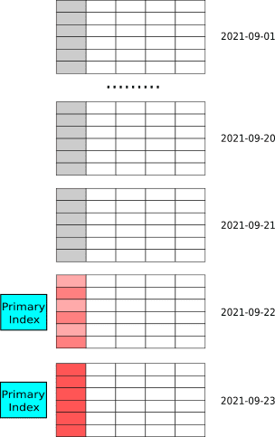

# Table Types

You must specify a table type and define one or more columns as a sort key at table creation. This way, when data is initially loaded into the table that you created, StarRocks can sort, process, and store the data based on the sort key. This topic describes the table types that StarRocks provides to meet your varying business requirements.

## Basic concepts

### Table types

StarRocks provides four table types: Duplicate Key table, Aggregate table, Unique Key table, and Primary Key table. These four table types are well suited to a wide range of data analytics scenarios such as log analysis, data aggregation and analysis, and real-time data analysis.

### Sort keys

When data is loaded into a table created by using a certain table type, data is sorted and stored according to one or more columns defined as the sort key when the table is created. The sort key is usually one or more columns that are frequently used as filter conditions in queries, thereby accelerating queries.

In the Duplicate Key table, the sort key specified by `DUPLICATE KEY` is used to sort data and is not assigned a UNIQUE constraint.
In the Aggregate table, the sort key specified by `AGGRAGATE KEY` is used to sort data and is assigned a UNIQUE constraint.
In the Unique Key table, the sort key specified by `UNIQUE KEY` is used to sort data and is assigned a UNIQUE constraint.
In the Primary Key table, the primary key and sort key are decoupled. The primary key specified by `PRIMARY KEY` is assigned UNIQUE and NOT NULL constraints. The sort key specified by `ORDER BY` is used for sorting data.

> **NOTE**
>
> - In versions earlier than v3.0, the Primary Key table does not support defining the primary key and sort key separately.
> - For more descriptions of sort keys, see [Sort keys and prefix indexes](./Sort_key.md).

## Precautions

- Sort key columns must be defined prior to the other columns in the statement for table creation.

- The order of sort key columns in the statement for table creation specifies the order of the conditions based on which the rows in the table are sorted.

- The length of the prefix index for a table is limited to 36 bytes. If the total length of the sort key columns exceeds 36 bytes, StarRocks stores only the first few sort key columns within the length limit for the prefix index.

- If the records to be loaded into a table have the same primary key, StarRocks processes and stores the records based on the table type:
  - Duplicate Key table

    StarRocks loads each of the records as a separate row into the table. After the data load is complete, the table contains rows that have the same primary key, and the rows map the source records in a one-to-one relationship. You can recall all historical data that you loaded.

  - Aggregate table

    StarRocks aggregates the records into one record and loads the aggregated record as a row into the table. After the loading is complete, the table does not contain rows that have the same primary key. You can recall the aggregation results of all historical data that you loaded. However, you cannot recall all historical data.

  - Unique Key table and Primary Key table

    StarRocks replaces each newly loaded record with the previously loaded record and retains only the most recently loaded record as a row in the table. After the loading is complete, the table does not contain rows that have the same primary key. The Unique Key table and the Primary Key table can be considered a special Aggregate table in which the REPLACE aggregate function is specified for metric columns to return the most recent record among a group of records that have the same primary key.

## Duplicate Key table

The Duplicate Key table is the default model in StarRocks. If you did not specify a model when you create a table, a Duplicate Key table is created by default.

When you create a Duplicate Key table, you can define a sort key for that table. If the filter conditions contain the sort key columns, StarRocks can quickly filter data from the table to accelerate queries. The Duplicate Key table allows you to append new data to the table. However, it does not allow you to modify existing data in the table.

### Scenarios

The Duplicate Key table is suitable for the following scenarios:

- Analyze raw data, such as raw logs and raw operation records.
- Query data by using a variety of methods without being limited by the pre-aggregation method.
- Load log data or time-series data. New data is written in append-only mode, and existing data is not updated.

### Create a table

Suppose that you want to analyze the event data over a specific time range. In this example, create a table named `detail` and define `event_time` and `event_type` as sort key columns.

Statement for creating the table:

```SQL
CREATE TABLE IF NOT EXISTS detail (
    event_time DATETIME NOT NULL COMMENT "datetime of event",
    event_type INT NOT NULL COMMENT "type of event",
    user_id INT COMMENT "id of user",
    device_code INT COMMENT "device code",
    channel INT COMMENT ""
)
DUPLICATE KEY(event_time, event_type)
DISTRIBUTED BY HASH(user_id) BUCKETS 8;
```

> You must specify `DISTRIBUTED BY HASH`. Otherwise, the table creation fails.

### Usage notes

- Take note of the following points about the sort key of a table:
  - You can use the `DUPLICATE KEY` keyword to explicitly define the columns that are used in the sort key.

    > Note: By default, if you do not specify sort key columns, StarRocks uses the **first three** columns as sort key columns.

  - In the Duplicate Key table, the sort key can consist of some or all of the dimension columns.

- You can create indexes such as BITMAP indexes and Bloomfilter indexes at table creation.

- If two identical records are loaded, the Duplicate Key table retains them as two records, rather than one.

### What to do next

After a table is created, you can use various data ingestion methods to load data into StarRocks. For information about the data ingestion methods that are supported by StarRocks, see [Overview of data loading](../loading/Loading_intro.md).

> Note: When you load data into a table that uses the Duplicate Key table, you can only append data to the table. You cannot modify the existing data in the table.

## Aggregate table

When you create a table that uses the Aggregate table, you can define sort key columns and metric columns and can specify an aggregate function for the metric columns. If the records to be loaded have the same sort key, the metric columns are aggregated. The Aggregate table helps reduce the amount of data that needs to be processed for queries, thereby accelerating queries.

### Scenarios

The Aggregate table is well suited to data statistics and analytics scenarios. A few examples are as follows:

- Help website or app providers analyze the amount of traffic and time that their users spend on a specific website or app and the total number of visits to the website or app.

- Help advertising agencies analyze the total clicks, total views, and consumption statistics of an advertisement that they provide for their customers.

- Help e-commerce companies analyze their annual trading data to identify the geographic bestsellers within individual quarters or months.

The data querying and ingestion in the preceding scenarios have the following characteristics:

- Most queries are aggregate queries, such as SUM, COUNT, and MAX.
- Raw detailed data does not need to be retrieved.
- Historical data is not frequently updated. Only new data is appended.

### Principle

Starting from data ingestion to data querying, data with the same sort key in a table that uses the Aggregate table is aggregated multiple times as follows:

1. In the data ingestion phase, when data is loaded as batches into the table, each batch comprises a data version. After a data version is generated, StarRocks aggregates the data that has the same sort key in the data version.
2. In the background compaction phase, when the files of multiple data versions that are generated at data ingestion are periodically compacted into a large file, StarRocks aggregates the data that has the same sort key in the large file.
3. In the data query phase, StarRocks aggregates the data that has the same sort key among all data versions before it returns the query result.

The aggregate operations help reduce the amount of data that needs to be processed, thereby accelerating queries.

Suppose that you have a table that uses the Aggregate table and want to load the following four raw records into the table.

| Date       | Country | PV   |
| ---------- | ------- | ---- |
| 2020.05.01 | CHN     | 1    |
| 2020.05.01 | CHN     | 2    |
| 2020.05.01 | USA     | 3    |
| 2020.05.01 | USA     | 4    |

StarRocks aggregates the four raw records into the following two records at data ingestion.

| Date       | Country | PV   |
| ---------- | ------- | ---- |
| 2020.05.01 | CHN     | 3    |
| 2020.05.01 | USA     | 7    |

### Create a table

Suppose that you want to analyze the numbers of visits by users from different cities to different web pages. In this example, create a table named `example_db.aggregate_tbl`, define `site_id`, `date`, and `city_code` as sort key columns, define `pv` as a metric column, and specify the SUM function for the `pv` column.

The statement for creating the table is as follows:

```SQL
CREATE TABLE IF NOT EXISTS example_db.aggregate_tbl (
    site_id LARGEINT NOT NULL COMMENT "id of site",
    date DATE NOT NULL COMMENT "time of event",
    city_code VARCHAR(20) COMMENT "city_code of user",
    pv BIGINT SUM DEFAULT "0" COMMENT "total page views"
)
AGGREGATE KEY(site_id, date, city_code)
DISTRIBUTED BY HASH(site_id) BUCKETS 8
PROPERTIES (
"replication_num" = "1"
);
```

### Usage notes

- Take note of the following points about the sort key of a table:
  - You can use the `AGGREGATE KEY` keyword to explicitly define the columns that are used in the sort key.

    - If the `AGGREGATE KEY` keyword does not include all the dimension columns, the table cannot be created.
    - By default, if you do not explicitly define sort key columns by using the `AGGREGATE KEY` keyword, StarRocks selects all columns except metric columns as the sort key columns.

  - The sort key must be created on columns on which unique constraints are enforced. It must be composed of all the dimension columns whose names cannot be changed.

- You can specify an aggregate function following the name of a column to define the column as a metric column. In most cases, metric columns hold data that needs to be aggregated and analyzed.

- For information about the aggregate functions that are supported by the Aggregate table, see [CREATE TABLE](../sql-reference/sql-statements/data-definition/CREATE%20TABLE.md).

- When queries are run, sort key columns are filtered before the aggregation of multiple data versions, whereas metric columns are filtered after the aggregation of multiple data versions. Therefore, we recommend that you identify the columns that are frequently used as filter conditions and define these columns as the sort key. This way, data filtering can start before the aggregation of multiple data versions to improve query performance.

- When you create a table, you cannot create BITMAP indexes or Bloom Filter indexes on the metric columns of the table.

### What to do next

After a table is created, you can use various data ingestion methods to load data into StarRocks. For information about the data ingestion methods that are supported by StarRocks, see [Data import](../loading/Loading_intro.md).

> Note: When you load data into a table that uses the Aggregate table, you can only update all columns of the table. For example, when you update the preceding `example_db.aggregate_tbl` table, you must update all its columns, which are `site_id`, `date`, `city_code`, and `pv`.

## Unique Key table

When you create a table, you can define primary key columns and metric columns. This way, queries return the most recent record among a group of records that have the same primary key. Compared with the Duplicate Key table, the Unique Key table simplifies the data loading process to better support real-time and frequent data updates.

### Scenarios

The Unique Key table is suitable for business scenarios in which data needs to be frequently updated in real time. For example, in e-commerce scenarios, hundreds of millions of orders can be placed per day, and the statuses of the orders frequently change.

### Principle

The Unique Key table can be considered a special Aggregate table in which the REPLACE aggregate function is specified for metric columns to return the most recent record among a group of records that have the same primary key.

When you load data into a table that uses the Unique Key table, the data is split into multiple batches. Each batch is assigned a version number. Therefore, records with the same primary key may come in multiple versions, of which the most recent version (namely, the record with the largest version number) is retrieved for queries.

As shown in the following table, `ID` is the primary key column, `value` is a metric column, and `_version` holds the data version numbers generated within StarRocks. In this example, the record with an `ID` of 1 is loaded by two batches whose version numbers are `1` and `2`, and the record with an `ID` of `2` is loaded by three batches whose version numbers are  `3`, `4`, and `5`.

| ID   | value | _version |
| ---- | ----- | -------- |
| 1    | 100   | 1        |
| 1    | 101   | 2        |
| 2    | 100   | 3        |
| 2    | 101   | 4        |
| 2    | 102   | 5        |

When you query the record with an `ID` of `1`, the most recent record with the largest version number, which is `2` in this case, is returned. When you query the record with an `ID` of `2`, the most recent record with the largest version number, which is `5` in this case, is returned. The following table shows the records returned by the two queries:

| ID   | value |
| ---- | ----- |
| 1    | 101   |
| 2    | 102   |

### Create a table

In e-commerce scenarios, you often need to collect and analyze the statuses of orders by date. In this example, create a table named `orders` to hold the orders, define `create_time` and `order_id`, which are frequently used as conditions to filter the orders, as primary key columns, and define the other two columns, `order_state` and `total_price`, as metric columns. This way, the orders can be updated in real time as their statuses change, and can be quickly filtered to accelerate queries.

The statement for creating the table is as follows:

```SQL
CREATE TABLE IF NOT EXISTS orders (
    create_time DATE NOT NULL COMMENT "create time of an order",
    order_id BIGINT NOT NULL COMMENT "id of an order",
    order_state INT COMMENT "state of an order",
    total_price BIGINT COMMENT "price of an order"
)
UNIQUE KEY(create_time, order_id)
DISTRIBUTED BY HASH(order_id) BUCKETS 8;
```

### Usage notes

- Take note of the following points about the primary key of a table:

  - The primary key is defined by using the `UNIQUE KEY` keyword.
  - The primary key must be created on columns on which unique constraints are enforced and whose names cannot be changed.
  - The primary key must be properly designed:
    - When queries are run, primary key columns are filtered before the aggregation of multiple data versions, whereas metric columns are filtered after the aggregation of multiple data versions. Therefore, we recommend that you identify the columns that are frequently used as filter conditions and define these columns as primary key columns. This way, data filtering can start before the aggregation of multiple data versions to improve query performance.
    - During the aggregation process, StarRocks compares all primary key columns. This is time-consuming and may decrease query performance. Therefore, do not define a large number of primary key columns. If a column is rarely used as a filter condition for queries, we recommend that you do not define the column as a primary key column.

- When you create a table, you cannot create BITMAP indexes or Bloom Filter indexes on the metric columns of the table.

- The Unique Key table does not support materialized views.

### What to do next

After a table is created, you can use various data ingestion methods to load data into StarRocks. For information about the data ingestion methods that are supported by StarRocks, see [Data import](../loading/Loading_intro.md).

> - When you load data into a table that uses the Unique Key table, you can only update all columns of the table. For example, when you update the preceding `orders` table, you must update all its columns, which are `create_time`, `order_id`, `order_state`, and `total_price`.
> - When you query data from a table that uses the Unique Key table, StarRocks needs to aggregate records of multiple data versions. In this situation, a large number of data versions decreases query performance. Therefore, we recommend that you specify a proper frequency at which data is loaded into the table to meet meet your requirements for real-time data analytics while preventing a large number of data versions. If you require minute-level data, you can specify a loading frequency of 1 minute instead of a loading frequency of 1 second.

## Primary Key table

When a table is created, you can define the primary key and sort key separately. When data is loaded into a Primary Key table, StarRocks sorts the data according to the sort key before it stores the data. Queries return the most recent record among a group of records that have the same primary key. Unlike the Unique Key table, the Primary Key table does not require aggregate operations during queries and supports the pushdown of predicates and indexes. As such, the Primary Key table can deliver high query performance despite real-time and frequent data updates.

> NOTE
>
> In versions earlier than v3.0, the Primary Key table does not support decoupling the primary key and sort key.

### Scenarios

- The Primary Key table is suitable for the following scenarios in which data needs to be frequently updated in real time:
  - **Stream data in real time from transaction processing systems into StarRocks.** In normal cases, transaction processing systems involve a large number of update and delete operations in addition to insert operations. If you need to synchronize data from a transaction processing system to StarRocks, we recommend that you create a table that uses the Primary Key table. Then, you can use tools, such as CDC Connectors for Apache Flink®, to synchronize the binary logs of the transaction processing system to StarRocks. StarRocks uses the binary logs to add, delete, and update the data in the table in real time. This simplifies data synchronization and delivers 3 to 10 times higher query performance than when a Merge on Read (MoR) table of the Unique Key table is used. For example, you can use flink-connector-starrocks to load data. For more information, see [Load data by using flink-connector-starrocks](../loading/Flink-connector-starrocks.md).

  - **Join multiple streams by performing update operations on individual columns**. In business scenarios such as user profiling, flat tables are preferably used to improve multi-dimensional analysis performance and simplify the analytics model that is used by data analysts. Upstream data in these scenarios may come from various apps, such as shopping apps, delivery apps, and banking apps, or from systems, such as machine learning systems that perform computations to obtain the distinct tags and properties of users. The Primary Key table is well suited in these scenarios, because it supports updates to individual columns. Each app or system can update only the columns that hold the data within its own service scope while benefiting from real-time data additions, deletions, and updates at high query performance.

- The Primary Key table is suitable for scenarios in which the memory occupied by the primary key is controllable.

  The storage engine of StarRocks creates an index for the primary key of each table that uses the Primary Key table. Additionally, when you load data into a table, StarRocks loads the primary key index into the memory. Therefore, the Primary Key table requires a larger memory capacity than the other three table types. **StarRocks limits the total length of the fields that comprise the primary key to 127 bytes after encoding.**

  Consider using the Primary Key table if a table has the following characteristics:

  - The table contains both fast-changing data and slow-changing data. Fast-changing data is frequently updated over the most recent days, whereas slow-changing data is rarely updated. Suppose that you need to synchronize a MySQL order table to StarRocks in real time for analytics and queries. In this example, the data of the table is partitioned by day, and most updates are performed on orders that are created within the most recent days. Historical orders are no longer updated after they are completed. When you run a data load job, the primary key index is not loaded into the memory and only the index entries of the recently updated orders are loaded into the memory.

    As shown in the following figure, the data in the table is partitioned by day, and the data in the most recent two partitions is frequently updated.

    

  - The table is a flat table that is composed of hundreds or thousands of columns. The primary key comprises only a small portion of the table data and consumes only a small amount of memory. For example, a user status or profile table consists of a large number of columns but only tens to hundreds of millions of users. In this situation, the amount of memory consumed by the primary key is controllable.

    As shown in the following figure, the table contains only a few rows, and the primary key of the table comprises only a small portion of the table.

    

### Principle

The Primary Key table is designed based on a new storage engine that is provided by StarRocks. The metadata structure and the read/write mechanism in the Primary Key table differ from those in the Duplicate Key table. As such, the Primary Key table does not require aggregate operations and supports the pushdown of predicates and indexes. These significantly increase query performance.

The Duplicate Key table adopts the MoR policy. MoR streamlines data writes but requires online aggregation of multiple data versions. Additionally, the Merge operator does not support the pushdown of predicates and indexes. As a result, query performance deteriorates.

The Primary Key table adopts the Delete+Insert policy to ensure that each record has a unique primary key. This way, the Primary Key table does not require merge operations. Details are as follows:

- When StarRocks receives a request for an update operation on a record, it locates the record by searching the primary key index, marks the record as deleted, and inserts a new record. In other words, StarRocks converts an update operation to a delete operation plus an insert operation.

- When StarRocks receives a delete operation on a record, it locates the record by searching the primary key index and marks the record as deleted.

### Create a table

Example 1: Suppose that you need to analyze orders on a daily basis. In this example, create a table named `orders`, define `dt` and `order_id` as the primary key, and define the other columns as metric columns.

```SQL
create table orders (
    dt date NOT NULL,
    order_id bigint NOT NULL,
    user_id int NOT NULL,
    merchant_id int NOT NULL,
    good_id int NOT NULL,
    good_name string NOT NULL,
    price int NOT NULL,
    cnt int NOT NULL,
    revenue int NOT NULL,
    state tinyint NOT NULL
) PRIMARY KEY (dt, order_id)
PARTITION BY RANGE(`dt`) (
    PARTITION p20210820 VALUES [('2021-08-20'), ('2021-08-21')),
    PARTITION p20210821 VALUES [('2021-08-21'), ('2021-08-22')),
    ...
    PARTITION p20210929 VALUES [('2021-09-29'), ('2021-09-30')),
    PARTITION p20210930 VALUES [('2021-09-30'), ('2021-10-01'))
) DISTRIBUTED BY HASH(order_id) BUCKETS 4
PROPERTIES("replication_num" = "3",
"enable_persistent_index" = "true");
```

Example 2: Suppose that you need to analyze user behavior in real time from dimensions such as users' address and last active time. When you create a table, you can define the `user_id` column as the primary key and define the combination of the `address` and `last_active` columns as the sort key.

```SQL
create table users (
    user_id bigint NOT NULL,
    name string NOT NULL,
    email string NULL,
    address string NULL,
    age tinyint NULL,
    sex tinyint NULL,
    last_active datetime,
    property0 tinyint NOT NULL,
    property1 tinyint NOT NULL,
    property2 tinyint NOT NULL,
    property3 tinyint NOT NULL,
    ....
) PRIMARY KEY (user_id)
DISTRIBUTED BY HASH(user_id) BUCKETS 4
ORDER BY(`address`,`last_active`)
PROPERTIES("replication_num" = "3",
"enable_persistent_index" = "true");
```

### Usage notes

- Take note of the following points about the primary key of a table:
  - The primary key is defined by using the `PRIMARY KEY` keyword.

  - The primary key must be created on columns on which unique constraints are enforced, and the names of the primary key columns cannot be changed.

  - The primary key columns can be any of the following data types: BOOLEAN, TINYINT, SMALLINT, INT, BIGINT, LARGEINT, STRING, VARCHAR, DATE, and DATETIME. However, the primary key columns cannot be defined as `NULL`.

  - The partition column and the bucket column must participate in the primary key.

  - The number and total length of primary key columns must be properly designed to save memory. We recommend that you identify columns whose data types occupy less memory and define those columns as the primary key. Such data types include INT and BIGINT. We recommend that you do not let a column of the VARCHAR data type to participate in the primary key.

  - Before you create the table, we recommend that you estimate the memory occupied by the primary key index based on the data types of the primary key columns and the number of rows in the table. This way, you can prevent the table from running out of memory. The following example explains how to calculate the memory occupied by the primary key index:
    - Suppose that the `dt` column, which is of the DATE data type that occupies 4 bytes, and the `id` column, which is of the BIGINT data type that occupies 8 bytes, are defined as the primary key. In this case, the primary key is 12 bytes in length.

    - Suppose that the table contains 10,000,000 rows of hot data and is stored in three replicas.

    - Given the preceding information, the memory occupied by the primary key index is 945 MB based on the following formula:

      (12 + 9) x 10,000,000 x 3 x 1.5 = 945 (MB)

      In the preceding formula, `9` is the immutable overhead per row, and `1.5` is the average extra overhead per hash table.

- `enable_persistent_index`: the primary key index can be persisted to disk and stored in memory to avoid it taking up too much memory. Generally, the primary key index can only take up 1/10 of the memory it does before. You can set this property in `PROPERTIES` when you create a table. Valid values are true or false. Default value is false.

  > - If you want to modify this parameter after the table is created, please see the part Modify the properties of table in [ALTER TABLE](../sql-reference/sql-statements/data-definition/ALTER%20TABLE.md).
  > - It is recommended to set this property to true if the disk is SSD.
  > - As of version 2.3.0, StarRocks supports to set this property.

- You can specify the sort key as the permutation and combination of any columns by using the `ORDER BY` keyword.

  > **NOTICE**
  >
  > If the sort key is specified, the prefix index is built according to the sort key; if the sort key is not specified, the prefix index is built according to the primary key.

- ALTER TABLE can be used to change table schema, but the following limits exist:
  - Modifying the primary key is not supported.
  - Reassigning the sort key by using ALTER TABLE ... ORDER BY .... is supported. Deleting the sort key is not supported. Modifying the data types of columns in the sort key is not supported.
  - Adjusting the column order is not supported.

- Since version 2.3.0, the columns except for the primary key columns now support the BITMAP and HLL data types.

- When you create a table, you can create BITMAP indexes or Bloom Filter indexes on the columns except for primary key columns.

- Since version 2.4.0, you can create asynchronous materialized views based on Primary Key tables.

### What to do next

You can run a  stream load, broker load, or routine load job to perform insert, update, or delete operations on all or individual columns of a table that uses the Primary Key table. For more information, see [Overview of data loading](../loading/Loading_intro.md).
