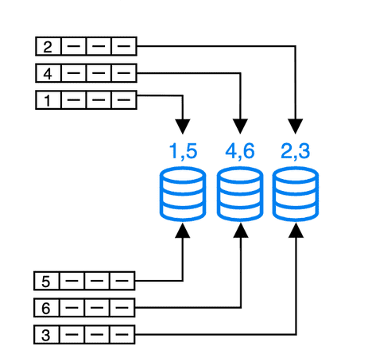

# List partitioning

Since v3.1, StarRocks supports list partitioning. Data is partitioned based on a predefined value list for each partition, which can accelerate queries and facilitate management according to enumerated values.

## Introduction

You need to explicitly specify the column values list in each partition. These values do not need to be continuous, unlike the continuous time or numeric range required in Range Partitioning. During data loading, StarRocks will store the data in the corresponding partition based on the mapping between the data's partition column values and the predefined column values for each partition.



List partitioning is suitable for storing data whose columns contain a small number of enum values, and you often query and manage data based on these enum values. For example, columns represent geographical locations, states, and categories. Each value in a column represents an independent category. By partitioning data based on enum column values, you can improve query performance and facilitate data management.

**List partitioning is particularly useful for scenarios where a partition needs to include multiple values for each partition column**. For example, if a table includes the `City` column representing the city to which an individual belongs, and you often query and manage data by states and cities. At table creation, you can use the `City` column as the partition column for List Partitioning and specify that data of various cities within the same state are placed in one partition, for example `PARTITION pCalifornia VALUES IN ("Los Angeles", "San Francisco", "San Diego")`. This method can accelerate queries based on states and cities while facilitating data management.

If a partition only needs to contain data with the same value of each partition column, it is recommended to use [expression partitioning](./expression_partitioning.md).

**Comparison between list partitioning and [expression partitioning](./expression_partitioning.md)**

The main difference between list partitioning and expression partitioning (recommended) is that list partitioning requires you to manually create partitions one by one. On the other hand, expression partitioning can automatically create partitions during loading to simplify partitioning. And in most cases, expression partitioning can replace list partitioning. The specific comparison between the two is shown in the following table:

| Partitioning method                                      | **List partitioning**                                        | **Expression partitioning**                                  |
| -------------------------------------------------------- | ------------------------------------------------------------ | ------------------------------------------------------------ |
| Syntax                                                   | `PARTITION BY LIST (partition_columns)（    PARTITION <partition_name> VALUES IN (value_list)    [, ...] )` | `PARTITION BY <partition_columns>`                           |
| Multiple values for each partition column in a partition | Supported. A partition can store data with different values in each partition column. In the following example, when the loaded data contains values `Los Angeles`, `San Francisco`, and `San Diego` in the `city` column, all the data is stored in one partition.<br>`pCalifornia`.`PARTITION BY LIST (city) (    PARTITION pCalifornia VALUES IN ("Los Angeles","San Francisco","San Diego")    [, ...] )` | Not supported. A partition stores data with the same value in  the partition column For example, the expression `PARTITION BY (city)` is used in expression partitioning. When the loaded data contains values `Los Angeles`, `San Francisco`, and `San Diego` in the `city` column, StarRocks will automatically create three partitions `pLosAngeles`, `pSanFrancisco`, and `pSanDiego`. The three partitions respectively store data with values `Los Angeles,` `San Francisco`, and `San Diego` in the `city` column. |
| Create partitions before data loading                    | Supported. Partitions need to be created at table creation.  | No need to do so. Partitions can be automatically created during data loading. |
| Automatically create List partitions during data loading | Not supported. If a partition corresponding to the data does not exist during data loading, an error is returned. | Supported. If a partition corresponding to the data does not exist during data loading, StarRocks automatically creates the partition to store the data. Each partition can only contain data with the same value for the partition column. |
| SHOW CREATE TABLE                                        | Returned the partitions definition in the CREATE TABLE statement. | After data is loaded, the statement returns the result with the partition clause used in the CREATE TABLE statement, that is, `PARTITION BY (partition_columns)`. However, the returned result does not show any automatically created partitions. If you need to view the automatically created partitions, execute `SHOW PARTITIONS FROM <table_name>`. |

## Usage

### Syntax

```sql
PARTITION BY LIST (partition_columns)（
    PARTITION <partition_name> VALUES IN (value_list)
    [, ...]
)

partition_columns::= 
    <column> [,<column> [, ...] ]

value_list ::=
    value_item [, value_item [, ...] ]

value_item ::=
    { <value> | ( <value> [, <value>, [, ...] ] ) }    
```

### Parameters

| **Parameters**      | **Parameters** | **Description**                                              |
| ------------------- | -------------- | ------------------------------------------------------------ |
| `partition_columns` | YES            | the names of the partition columns or columns. The partition column values can be string (BINARY not supported), date or datetime, integer, and boolean values. The partition column allows `NULL` values. |
| `partition_name`    | YES            | Partition name. It is recommended to set appropriate partition names based on the business scenario to differentiate the data in different partitions. |
| `value_list`        | YES            | A list of partition column values in a partition.            |

### Examples

Example 1: Suppose you frequently query details of data center billing based on states or cities. At table creation, you can specify the partition column as `city` and specify that each partition stores data of cities within the same state. This method can accelerate queries for specific states or cities and facilitate data management.

```SQL
CREATE TABLE t_recharge_detail1 (
    id bigint,
    user_id bigint,
    recharge_money decimal(32,2), 
    city varchar(20) not null,
    dt varchar(20) not null
)
DUPLICATE KEY(id)
PARTITION BY LIST (city) (
   PARTITION pLos_Angeles VALUES IN ("Los Angeles"),
   PARTITION pSan_Francisco VALUES IN ("San Francisco")
)
DISTRIBUTED BY HASH(`id`);
```

Example 2: Suppose you frequently query details of data center billing based on time ranges and specific states or cities. During table creation, you can specify the partition columns as `dt`  and `city`. This way, data of specific dates and specific states or cities is stored into the same partition, improving query speed and facilitating data management.

```SQL
CREATE TABLE t_recharge_detail4 (
    id bigint,
    user_id bigint,
    recharge_money decimal(32,2), 
    city varchar(20) not null,
    dt varchar(20) not null
) ENGINE=OLAP
DUPLICATE KEY(id)
PARTITION BY LIST (dt,city) (
   PARTITION p202204_California VALUES IN (
       ("2022-04-01", "Los Angeles"),
       ("2022-04-01", "San Francisco"),
       ("2022-04-02", "Los Angeles"),
       ("2022-04-02", "San Francisco")
    ),
   PARTITION p202204_Texas VALUES IN (
       ("2022-04-01", "Houston"),
       ("2022-04-01", "Dallas"),
       ("2022-04-02", "Houston"),
       ("2022-04-02", "Dallas")
   )
)
DISTRIBUTED BY HASH(`id`);
```

## Limits

- List partitioning does support dynamic partitoning and creating multiple partitions at a time.
- Currently, StarRocks's [shared-data mode](../deployment/deploy_shared_data.md) does not support this feature.
- When the `ALTER TABLE <table_name> DROP PARTITION <partition_name>;` statement is used to delete a partition created by using list partitioning, data in the partition is directly removed and cannot be recovered.
- Currently you cannot [backup and restore](../administration/Backup_and_restore.md) partitions created by the list partitioning.
