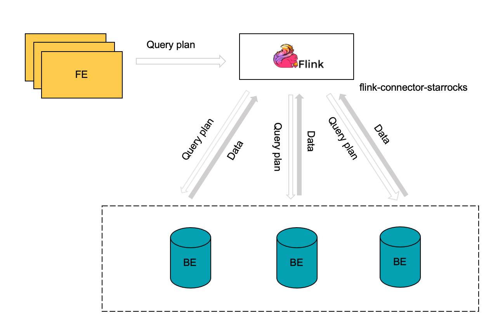
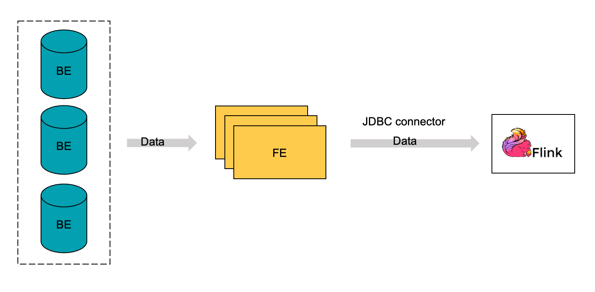

# Read data from StarRocks using Flink connector

StarRocks provides a self-developed connector named StarRocks Connector for Apache Flink® (Flink connector for short) to help you read data in bulk from a StarRocks cluster by using Flink.

The Flink connector supports two reading methods: Flink SQL and Flink DataStream. Flink SQL is recommended.

> **NOTE**
>
> The Flink connector also supports writing the data read by Flink to another StarRocks cluster or storage system. See [Continuously load data from Apache Flink®](../loading/Flink-connector-starrocks.md).

## Background information

Unlike the JDBC connector provided by Flink, the Flink connector of StarRocks supports reading data from multiple BEs of your StarRocks cluster in parallel, greatly accelerating read tasks. The following comparison shows the difference in implementation between the two connectors.

- Flink connector of StarRocks

  With the Flink connector of StarRocks, Flink can first obtain the query plan from the responsible FE, then distribute the obtained query plan as parameters to all the involved BEs, and finally obtain the data returned by the BEs.

  

- JDBC connector of Flink

  With the JDBC connector of Flink, Flink can only read data from individual FEs, one at a time. Data reads are slow.

  

## Prerequisites

Flink has been deployed. If Flink has not been deployed, follow these steps to deploy it:

1. Install Java 8 or Java 11 in your operating system to ensure Flink can run properly. You can use the following command to check the version of your Java installation:

   ```SQL
   java -version
   ```

   For example, if the following information is returned, Java 8 has been installed:

   ```SQL
   openjdk version "1.8.0_322"
   OpenJDK Runtime Environment (Temurin)(build 1.8.0_322-b06)
   OpenJDK 64-Bit Server VM (Temurin)(build 25.322-b06, mixed mode)
   ```

2. Download and unzip the [Flink package](https://flink.apache.org/downloads.html) of your choice.

   > **NOTE**
   >
   > We recommend that you use Flink v1.14 or later. The minimum Flink version supported is v1.11.

   ```SQL
   # Download the Flink package.
   wget https://dlcdn.apache.org/flink/flink-1.14.5/flink-1.14.5-bin-scala_2.11.tgz
   # Unzip the Flink package.
   tar -xzf flink-1.14.5-bin-scala_2.11.tgz
   # Go to the Flink directory.
   cd flink-1.14.5
   ```

3. Start your Flink cluster.

   ```SQL
   # Start your Flink cluster.
   ./bin/start-cluster.sh
         
   # When the following information is displayed, your Flink cluster has successfully started:
   Starting cluster.
   Starting standalonesession daemon on host.
   Starting taskexecutor daemon on host.
   ```

You can also deploy Flink by following the instructions provided in [Flink documentation](https://nightlies.apache.org/flink/flink-docs-release-1.13/docs/try-flink/local_installation/).

## Before you begin

Follow these steps to deploy the Flink connector:

1. Select and download the [flink-connector-starrocks](https://github.com/StarRocks/flink-connector-starrocks/releases) JAR package matching the Flink version that you are using.

   > **NOTICE**
   >
   > We recommend that you download the Flink connector package whose version is 1.2.x or later and whose matching Flink version has the same first two digits as the Flink version that you are using. For example, if you use Flink v1.14.x, you can download `flink-connector-starrocks-1.2.4_flink-1.14_x.yy.jar`.

2. If code debugging is needed, compile the Flink connector package to suit your business requirements.

3. Place the Flink connector package you downloaded or compiled into the `lib` directory of Flink.

4. Restart your Flink cluster.

## Parameters

### Common parameters

The following parameters apply to both the Flink SQL and Flink DataStream reading methods.

| Parameter                   | Required | Data type | Description                                                  |
| --------------------------- | -------- | --------- | ------------------------------------------------------------ |
| connector                   | Yes      | STRING    | The type of connector that you want to use to read data. Set the value to `starrocks`.                                |
| scan-url                    | Yes      | STRING    | The address that is used to connect the FE from the web server. Format: `<fe_host>:<fe_http_port>`. The default port is `8030`. You can specify multiple addresses, which must be separated with a comma (,). Example: `192.168.xxx.xxx:8030,192.168.xxx.xxx:8030`. |
| jdbc-url                    | Yes      | STRING    | The address that is used to connect the MySQL client of the FE. Format: `jdbc:mysql://<fe_host>:<fe_query_port>`. The default port number is `9030`. |
| username                    | Yes      | STRING    | The username of your StarRocks cluster account. The account must have read permissions on the StarRocks table you want to read. See [User privileges](../administration/User_privilege.md). |
| password                    | Yes      | STRING    | The password of your StarRocks cluster account.              |
| database-name               | Yes      | STRING    | The name of the StarRocks database to which the StarRocks table you want to read belongs. |
| table-name                  | Yes      | STRING    | The name of the StarRocks table you want to read.            |
| scan.connect.timeout-ms     | No       | STRING    | The maximum amount of time after which the connection from the Flink connector to your StarRocks cluster times out. Unit: milliseconds. Default value: `1000`. If the amount of time taken to establish the connection exceeds this limit, the read task fails. |
| scan.params.keep-alive-min  | No       | STRING    | The maximum amount of time during which the read task keeps alive. The keep-alive time is checked on a regular basis by using a polling mechanism. Unit: minutes. Default value: `10`. We recommend that you set this parameter to a value that is greater than or equal to `5`. |
| scan.params.query-timeout-s | No       | STRING    | The maximum amount of time after which the read task times out. The timeout duration is checked during task execution. Unit: seconds. Default value: `600`. If no read result is returned after the time duration elapses, the read task stops. |
| scan.params.mem-limit-byte  | No       | STRING    | The maximum amount of memory allowed per query on each BE. Unit: bytes. Default value: `1073741824`, equal to 1 GB. |
| scan.max-retries            | No       | STRING    | The maximum number of times that the read task can be retried upon failures. Default value: `1`. If the number of times that the read task is retried exceeds this limit, the read task returns errors. |

### Parameters for Flink DataStream

The following parameters apply only to the Flink DataStream reading method.

| Parameter    | Required | Data type | Description                                                  |
| ------------ | -------- | --------- | ------------------------------------------------------------ |
| scan.columns | No       | STRING    | The column that you want to read. You can specify multiple columns, which must be separated by a comma (,). |
| scan.filter  | No       | STRING    | The filter condition based on which you want to filter data. |

Assume that in Flink you create a table that consists of three columns, which are `c1`, `c2`, `c3`. To read the rows whose values in the `c1` column of this Flink table are equal to `100`, you can specify two filter conditions `"scan.columns, "c1"` and `"scan.filter, "c1 = 100"`.

## Data type mapping between StarRocks and Flink

The following data type mapping is valid only for Flink reading data from StarRocks. For the data type mapping used for Flink writing data into StarRocks, see [Continuously load data from Apache Flink®](../loading/Flink-connector-starrocks.md).

| StarRocks  | Flink     |
| ---------- | --------- |
| NULL       | NULL      |
| BOOLEAN    | BOOLEAN   |
| TINYINT    | TINYINT   |
| SMALLINT   | SMALLINT  |
| INT        | INT       |
| BIGINT     | BIGINT    |
| LARGEINT   | STRING    |
| FLOAT      | FLOAT     |
| DOUBLE     | DOUBLE    |
| DATE       | DATE      |
| DATETIME   | TIMESTAMP |
| DECIMAL    | DECIMAL   |
| DECIMALV2  | DECIMAL   |
| DECIMAL32  | DECIMAL   |
| DECIMAL64  | DECIMAL   |
| DECIMAL128 | DECIMAL   |
| CHAR       | CHAR      |
| VARCHAR    | STRING    |

## Examples

The following examples assume you have created a database named `test` in your StarRocks cluster and you have the permissions of user `root`.

> **NOTE**
>
> If a read task fails, you must re-create it.

### Data example

1. Go to the `test` database and create a table named `score_board`.

   ```SQL
   MySQL [test]> CREATE TABLE `score_board`
   (
       `id` int(11) NOT NULL COMMENT "",
       `name` varchar(65533) NULL DEFAULT "" COMMENT "",
       `score` int(11) NOT NULL DEFAULT "0" COMMENT ""
   )
   ENGINE=OLAP
   PRIMARY KEY(`id`)
   COMMENT "OLAP"
   DISTRIBUTED BY HASH(`id`)
   PROPERTIES
   (
       "replication_num" = "3"
   );
   ```

2. Insert data into the `score_board` table.

   ```SQL
   MySQL [test]> INSERT INTO score_board
   VALUES
       (1, 'Bob', 21),
       (2, 'Stan', 21),
       (3, 'Sam', 22),
       (4, 'Tony', 22),
       (5, 'Alice', 22),
       (6, 'Lucy', 23),
       (7, 'Polly', 23),
       (8, 'Tom', 23),
       (9, 'Rose', 24),
       (10, 'Jerry', 24),
       (11, 'Jason', 24),
       (12, 'Lily', 25),
       (13, 'Stephen', 25),
       (14, 'David', 25),
       (15, 'Eddie', 26),
       (16, 'Kate', 27),
       (17, 'Cathy', 27),
       (18, 'Judy', 27),
       (19, 'Julia', 28),
       (20, 'Robert', 28),
       (21, 'Jack', 29);
   ```

3. Query the `score_board` table.

   ```SQL
   MySQL [test]> SELECT * FROM score_board;
   +------+---------+-------+
   | id   | name    | score |
   +------+---------+-------+
   |    1 | Bob     |    21 |
   |    2 | Stan    |    21 |
   |    3 | Sam     |    22 |
   |    4 | Tony    |    22 |
   |    5 | Alice   |    22 |
   |    6 | Lucy    |    23 |
   |    7 | Polly   |    23 |
   |    8 | Tom     |    23 |
   |    9 | Rose    |    24 |
   |   10 | Jerry   |    24 |
   |   11 | Jason   |    24 |
   |   12 | Lily    |    25 |
   |   13 | Stephen |    25 |
   |   14 | David   |    25 |
   |   15 | Eddie   |    26 |
   |   16 | Kate    |    27 |
   |   17 | Cathy   |    27 |
   |   18 | Judy    |    27 |
   |   19 | Julia   |    28 |
   |   20 | Robert  |    28 |
   |   21 | Jack    |    29 |
   +------+---------+-------+
   21 rows in set (0.00 sec)
   ```

### Read data using Flink SQL

1. In your Flink cluster, create a table named `flink_test` based on the schema of the source StarRocks table (which is `score_board` in this example). In the table creation command, you must configure the read task properties, including the information about the Flink connector, the source StarRock database, and the source StarRocks table.

   ```SQL
   CREATE TABLE flink_test
   (
       `id` INT,
       `name` STRING,
       `score` INT
   )
   WITH
   (
       'connector'='starrocks',
       'scan-url'='192.168.xxx.xxx:8030',
       'jdbc-url'='jdbc:mysql://192.168.xxx.xxx:9030',
       'username'='xxxxxx',
       'password'='xxxxxx',
       'database-name'='test',
       'table-name'='score_board'
   );
   ```

2. Use SELECT to read data from StarRocks.

   ```SQL
   SELECT id, name FROM flink_test WHERE score > 20;
   ```

When you read data by using Flink SQL, take note of the following points:

- You can use only SQL statements like `SELECT ... FROM <table_name> WHERE ...` to read data from StarRocks. Of all aggregate functions, only `count` is supported.
- Predicate pushdown is supported. For example, if your query contains a filter condition `char_1 <> 'A' and int_1 = -126`, the filter condition will be pushed down to the Flink connector and transformed into a statement that can be executed by StarRocks before the query is run. You do not need to perform extra configurations.
- The LIMIT statement is not supported.
- StarRocks does not support the checkpointing mechanism. As a result, data consistency cannot be guaranteed if the read task fails.

### Read data using Flink DataStream

1. Add the following dependencies to the `pom.xml` file:

   ```SQL
   <dependency>
       <groupId>com.starrocks</groupId>
       <artifactId>flink-connector-starrocks</artifactId>
       <!-- for Apache Flink® 1.15 -->
       <version>x.x.x_flink-1.15</version>
       <!-- for Apache Flink® 1.14 -->
       <version>x.x.x_flink-1.14_2.11</version>
       <version>x.x.x_flink-1.14_2.12</version>
       <!-- for Apache Flink® 1.13 -->
       <version>x.x.x_flink-1.13_2.11</version>
       <version>x.x.x_flink-1.13_2.12</version>
       <!-- for Apache Flink® 1.12 -->
       <version>x.x.x_flink-1.12_2.11</version>
       <version>x.x.x_flink-1.12_2.12</version>
       <!-- for Apache Flink® 1.11 -->
       <version>x.x.x_flink-1.11_2.11</version>
       <version>x.x.x_flink-1.11_2.12</version>
   </dependency>
   ```

   You must replace `x.x.x` in the preceding code example with the latest Flink connector version that you are using. See [Version information](https://search.maven.org/search?q=g:com.starrocks).

2. Call the Flink connector to read data from StarRocks:

   ```Java
   import com.starrocks.connector.flink.StarRocksSource;
   import com.starrocks.connector.flink.table.source.StarRocksSourceOptions;
   import org.apache.flink.streaming.api.environment.StreamExecutionEnvironment;
   import org.apache.flink.table.api.DataTypes;
   import org.apache.flink.table.api.TableSchema;
   
   public class StarRocksSourceApp {
           public static void main(String[] args) throws Exception {
               StarRocksSourceOptions options = StarRocksSourceOptions.builder()
                      .withProperty("scan-url", "192.168.xxx.xxx:8030")
                      .withProperty("jdbc-url", "jdbc:mysql://192.168.xxx.xxx:9030")
                      .withProperty("username", "root")
                      .withProperty("password", "")
                      .withProperty("table-name", "score_board")
                      .withProperty("database-name", "test")
                      .build();
               TableSchema tableSchema = TableSchema.builder()
                      .field("id", DataTypes.INT())
                      .field("name", DataTypes.STRING())
                      .field("score", DataTypes.INT())
                      .build();
               StreamExecutionEnvironment env = StreamExecutionEnvironment.getExecutionEnvironment();
               env.addSource(StarRocksSource.source(tableSchema, options)).setParallelism(5).print();
               env.execute("StarRocks flink source");
           }

       }
   ```

## What's next

After Flink successfully reads data from StarRocks, you can use the [Flink WebUI](https://nightlies.apache.org/flink/flink-docs-master/docs/try-flink/flink-operations-playground/#flink-webui) to monitor the read task. For example, you can view the `totalScannedRows` metric on the **Metrics** page of the WebUI to obtain the number of rows that are successfully read. You can also use Flink SQL to perform calculations such as joins on the data you have read.
