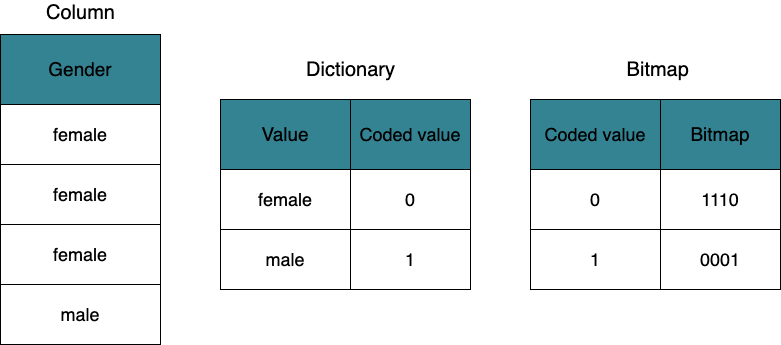
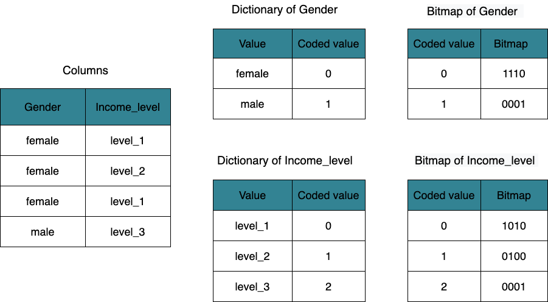

# Bitmap indexing

This topic describes how to create and manage a bitmap index, along with usage cases.

A bitmap index is a special database index that uses bitmaps, which are an array of bits. A bit is always in one of two values: 0 and 1. Each bit in the bitmap corresponds to a single row in the table. The value of each bit depends upon the value of the corresponding row.

A bitmap index can help improve the query performance on a given column. If a query hits a sort key column, StarRocks efficiently returns the query result by using the [prefix index](../table_design/Sort_key.md). However, the prefix index entry for a data block cannot exceed 36 bytes in length. If you want to improve the query performance on a column, which is not used as a sort key, you can create a bitmap index for the column.

## Benefits

You can benefit from bitmap indexes in the following aspects:

- Reduce response time when the column has low cardinality, such as the columns of the ENUM type. If the number of distinct values in a column is relatively high, we recommend that you use a bloom filter index to improve query speed. For more information, see [Bloom filter indexing](../using_starrocks/Bloomfilter_index.md).
- Use less storage space compared to other indexing techniques. Bitmap indexes typically take up only a fraction of the size of the indexed data in a table.
- Combine multiple bitmap indexes together to fire queries on multiple columns. For more information, see [Query multiple columns](#query-multiple-columns).

## Usage notes

- You can create a bitmap index for a column that can be filtered by using the equal (`=`) or [NOT] IN operator.
- You can create bitmap indexes for all columns of a table that uses the Duplicate Key Model or Unique Key Model. For a table that uses the Aggregate Key Model or Primary Key model, you can only create bitmap indexes for key columns.
- The columns of the FLOAT, DOUBLE, BOOLEAN, and DECIMAL types do not support creating bitmap indexes.
- You can check whether a query uses bitmap indexes by viewing the `BitmapIndexFilterRows` field of the query's profile.

## Create a bitmap index

There are two ways to create a bitmap index for a column.

- Create a bitmap index for a column when you create a table. Example:

    ```SQL
    CREATE TABLE d0.table_hash
    (
        k1 TINYINT,
        k2 DECIMAL(10, 2) DEFAULT "10.5",
        v1 CHAR(10) REPLACE,
        v2 INT SUM,
        INDEX index_name (column_name [, ...]) [USING BITMAP] [COMMENT '']
    )
    ENGINE = olap
    AGGREGATE KEY(k1, k2)
    DISTRIBUTED BY HASH(k1) BUCKETS 10
    PROPERTIES ("storage_type" = "column");
    ```

    The following table describes the parameters related to the bitmap index.

    | **Parameter** | **Required** | **Description**                                              |
    | ------------- | ------------ | ------------------------------------------------------------ |
    | index_name    | Yes          | The name of the bitmap index.  The naming conventions are as follows:<ul><li>The name can contain letters, digits (0-9), and underscores (_). It must start with a letter.</li><li>The name cannot exceed 64 characters in length.</li></ul>The name of bitmap index must be unique in a table.                              |
    | column_name   | Yes          | The name of the column on which a bitmap index is created. You can specify multiple column names to create bitmap indexes for multiple columns at a time. Separate multiple columns with comma.  |
    | COMMENT       | No           | The comment of the bitmap index.                             |

    You can create bitmap indexes for multiple columns at a time by specifying multiple `INDEX index_name (column_name [, ...]) [USING BITMAP] [COMMENT '']` commands. These commands need to be separated with commas (,). For other parameter descriptions of the CREATE TABLE statement, see [CREATE TABLE](../sql-reference/sql-statements/data-definition/CREATE%20TABLE.md).

- Create a bitmap index for a column of a table using the CREATE INDEX statement. For parameter descriptions and examples, see [CREATE INDEX](../sql-reference/sql-statements/data-definition/CREATE%20INDEX.md).

    ```SQL
    CREATE INDEX index_name ON table_name (column_name) [USING BITMAP] [COMMENT ''];
    ```

## Display bitmap indexes

You can view all bitmap indexes created in a table using the SHOW INDEX statement. For parameter descriptions and examples, see [SHOW INDEX](../sql-reference/sql-statements/Administration/SHOW%20INDEX.md).

```SQL
SHOW { INDEX[ES] | KEY[S] } FROM [db_name.]table_name [FROM db_name];
```

> **Note**
>
> Creating indexes is an asynchronous process. Therefore, you can only see the indexes that have completed the creation process.

## Delete a bitmap index

You can delete a bitmap index from a table using the DROP INDEX statement. For parameter descriptions and examples, see [DROP INDEX](../sql-reference/sql-statements/data-definition/DROP%20INDEX.md).

```SQL
DROP INDEX index_name ON [db_name.]table_name;
```

## Usage cases

For example, the following table `employee` shows a portion of a company's employee information.

| **ID** | **Gender** | **Position** | **Income_level** |
| ------ | ---------- | ------------ | ---------------- |
| 01     | female     | Developer    | level_1          |
| 02     | female     | Analyst      | level_2          |
| 03     | female     | Salesman     | level_1          |
| 04     | male       | Accountant   | level_3          |

### Query a single column

For example, if you want to improve the query performance on the `Gender` column, you can create a bitmap index for the column by using the following statement.

```SQL
CREATE INDEX index1 ON employee (Gender) USING BITMAP COMMENT 'index1';
```

After you execute the preceding statement, the bitmap index is generated as shown in the following figure.



1. Build a dictionary: StarRocks builds a dictionary for the `Gender` column and maps `female` and `male` to coded values of the INT type: `0` and `1`.
2. Generate bitmaps: StarRocks generates bitmaps for `female` and `male` based on the coded values. The bitmap of `female` is `1110` because `female` displays in the first three rows. The bitmap of `male` is `0001` because `male` only displays in the fourth row.

If you want to find out the male employee in the company, you can send a query as follows.

```SQL
SELECT xxx FROM employee WHERE Gender = male;
```

After the query is sent, StarRocks searches for the dictionary to get the coded value of `male`, which is `1`and then gets the bitmap of `male`, which is `0001`. This means that only the fourth row matches the query condition. Then StarRocks will skip the first three rows and read only the fourth row.

### Query multiple columns

For example, if you want to improve the query performance on the `Gender` and `Income_level`column, you can create bitmap indexes for these two columns by using the following statements.

- `Gender`

    ```SQL
    CREATE INDEX index1 ON employee (Gender) USING BITMAP COMMENT 'index1';
    ```

- `Income_level`

    ```SQL
    CREATE INDEX index2 ON employee (Income_level) USING BITMAP COMMENT 'index2';
    ```

After you execute the preceding two statements, the bitmap indexes are generated as shown in the following figure.



StarRocks respectively builds a dictionary for the `Gender` and `Income_level` columns and then generates bitmaps for the distinct values in these two columns.

- `Gender`: The bitmap of `female` is `1110` and the bitmap of `male` is `0001`.
- `Producer`: The bitmap of `level_1` is `1010`, the bitmap of `level_2` is `0100`, and the bitmap of `level_3` is `0001`.

If you want to find out the female employees whose salary is in the `level_1`, you can send a query as follows.

```SQL
 SELECT xxx FROM employee 
 WHERE Gender = female AND Income_level = Level_1;
```

After the query is sent, StarRocks search for the dictionaries of `Gender` and `Income_level` at the same time to get the following information:

- The coded value of `female` is `0` and the bitmap of `female` is `1110`.
- The coded value of `level_1` is `0` and the bitmap of `level_1` is `1010`.

StarRocks performs a bitwise logical operation `1110 & 1010` based on the `AND` operator to get the result `1010`.  According to the result, StarRocks only reads the first row and the third row.
