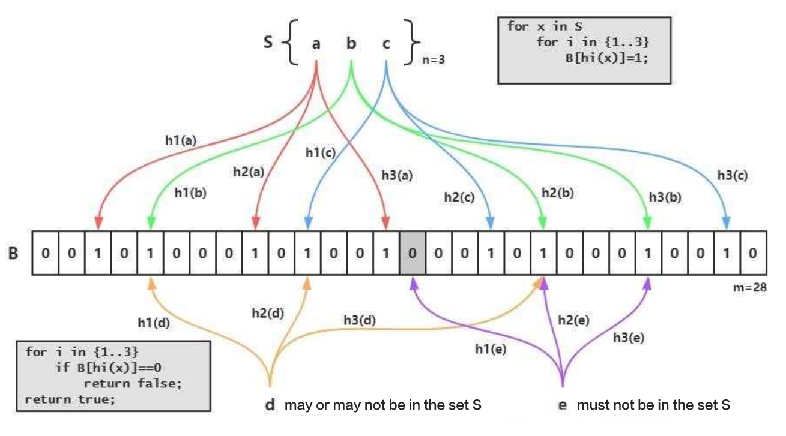

# Bloom Filter Indexing

## Principle

### What is Bloom Filter

Bloom Filter is a data structure used to determine whether an element is in a collection. The advantage is that it is more space and time efficient, and the disadvantage is that it has a certain rate of misclassification.

Bloom Filter is composed of a bit array and a number of hash functions. The bit array is initially set to 0. When an element is inserted, the hash functions (number of n) compute on the element and obtain the slots (number of n)The corresponding number of slots in the bit array is set to 1.

To confirm whether an element is in the set, the system will calculate the Hash value based on the hash functions. If the hash values in the bloom filter have at least one 0, the element does not exist. When all the corresponding slots in the bit are 1, the existence of the element cannot be confirmed. This is because the number of slots in the bloom filter is limited, and it is possible that all the slots calculated from this element are the same as the slots calculated from another existing element. Therefore, in the all-1 case, we need to go back to the source to confirm the existence of the element.

### What is Bloom Filter Indexing

When creating a table in StarRocks, you can specify the columns to be indexed by BloomFilter through `PROPERTIES{"bloom_filter_columns"="c1,c2,c3"}`. BloomFilter can quickly confirm whether a certain value exists in a column when querying. If the bloom filter determines that the specified value does not exist in the column, there is no need to read the data file. If it is an all-1 situation, it needs to read the data block to confirm whether the target value exists. In addition, bloom filter indexes cannot determine which specific row of data has the specified value.

## Suitable scenarios

A bloom filter index can be built when the following conditions are met.

1. Bloom Filter is suitable for non-prefix filtering.
2. The query will be frequently filtered according to the column, and most of the query conditions are `in` and `=`.
3. Unlike Bitmap, BloomFilter is suitable for columns with a high base number.

## How to use

### Create an index

When creating a table, use `bloom_filter_columns`.

~~~ SQL
PROPERTIES ( "bloom_filter_columns"="k1,k2,k3" )
~~~

### View an index

View the bloom filter indexes under the `table_name`.

~~~ SQL
SHOW CREATE TABLE table_name;
~~~

### Delete an Index

Deleting an index means removing the index column from the `bloom_filter_columns` property:

~~~ SQL
ALTER TABLE example_db.my_table SET ("bloom_filter_columns" = "");
~~~

### Modify an index

Modifying an index means modifying the `bloom_filter_columns` property.

~~~SQL
ALTER TABLE example_db.my_table SET ("bloom_filter_columns" = "k1,k2,k3");
~~~

## Notes

* Bloom Filter indexing is not supported for Tinyint, Float, Double type columns.
* Bloom Filter indexing only has an accelerating effect on `in` and `=` filter queries.
* To see whether a query hits the bloom filter index, check its profile information.
