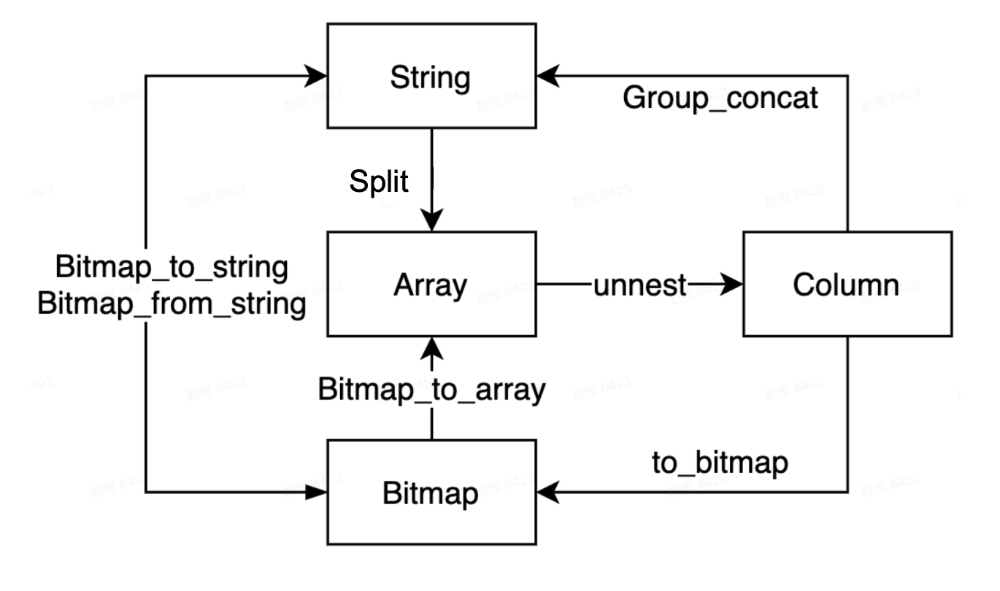

# Use Lateral Join for row-to-column conversion

## Background

Row-to-column conversion is a common operation in ETL processing. Lateral is a special Join keyword that can associate a row with an internal subquery or table function. By using Lateral in conjunction with unnest, we can implement conversion from one-row to multiple rows. For more information, see [unnest](../sql-reference/sql-functions/array-functions/unnest.md).

## Instructions for use

To use lateral join, you need to use the new version of optimizer:

~~~SQL
set global enable_cbo = true;
~~~

Syntax:

~~~SQL
from table_reference join [lateral] table_reference;
~~~

The Unnest keyword is a table function that converts an array into multiple rows. Together with Lateral Join, it can implement common row expansion logic.

~~~SQL
SELECT student, score
FROM tests
CROSS JOIN LATERAL UNNEST(scores) AS t (score);

SELECT student, score
FROM tests, UNNEST(scores) AS t (score);
~~~

The second syntax here is a shortened version of the first one, where the Lateral Join can be omitted using the Unnest keyword.

## Usage examples

The current version of StarRocks supports  type conversion between Bitmap, String, Array, and Column.

Together with Unnest, we can achieve the following features:

### Expanding a string into multiple lines

~~~SQL
CREATE TABLE lateral_test2 (
    `v1` bigint(20) NULL COMMENT "",
    `v2` string NULL COMMENT ""
)
duplicate key(v1)
DISTRIBUTED BY HASH(`v1`) BUCKETS 1
PROPERTIES (
    "replication_num" = "1",
    "in_memory" = "false",
    "storage_format" = "DEFAULT"
);

insert into lateral_test2 values (1, "1,2,3"), (2, "1,3");
~~~

~~~Plain Text
select * from lateral_test2;

+------+-------+
| v1   | v2    |
+------+-------+
|    1 | 1,2,3 |
|    2 | 1,3   |
+------+-------+

select v1,unnest from lateral_test2 , unnest(split(v2, ",")) ;

+------+--------+
| v1   | unnest |
+------+--------+
|    1 | 1      |
|    1 | 2      |
|    1 | 3      |
|    2 | 1      |
|    2 | 3      |
+------+--------+
~~~

### Expanding an array into multiple rows

 **From 2.5, unnest can take multiple arrays of different types and lengths.** For more information, see [unnest()](../sql-reference/sql-functions/array-functions/unnest.md).

~~~SQL
CREATE TABLE lateral_test (
    `v1` bigint(20) NULL COMMENT "",
    `v2` ARRAY NULL COMMENT ""
) 
duplicate key(v1)
DISTRIBUTED BY HASH(`v1`) BUCKETS 1
PROPERTIES (
    "replication_num" = "1",
    "in_memory" = "false",
    "storage_format" = "DEFAULT"
);

insert into lateral_test values (1, [1,2]), (2, [1, null, 3]), (3, null);
~~~

~~~Plain Text
select * from lateral_test;

+------+------------+
| v1   | v2         |
+------+------------+
|    1 | [1,2]      |
|    2 | [1,null,3] |
|    3 | NULL       |
+------+------------+

select v1,v2,unnest from lateral_test , unnest(v2) ;

+------+------------+--------+
| v1   | v2         | unnest |
+------+------------+--------+
|    1 | [1,2]      |      1 |
|    1 | [1,2]      |      2 |
|    2 | [1,null,3] |      1 |
|    2 | [1,null,3] |   NULL |
|    2 | [1,null,3] |      3 |
+------+------------+--------+
~~~

### Transforming Bitmap output

~~~SQL
CREATE TABLE lateral_test3 (
`v1` bigint(20) NULL COMMENT "",
`v2` Bitmap BITMAP_UNION COMMENT ""
)
Aggregate key(v1)
DISTRIBUTED BY HASH(`v1`) BUCKETS 1;

insert into lateral_test3 values (1, bitmap_from_string('1, 2')), (2, to_bitmap(3));
~~~

~~~Plain Text
select v1, bitmap_to_string(v2) from lateral_test3;

+------+------------------------+
| v1   | bitmap_to_string(`v2`) |
+------+------------------------+
|    1 | 1,2                    |
|    2 | 3                      |
+------+------------------------+

insert into lateral_test3 values (1, to_bitmap(3));

select v1, bitmap_to_string(v2) from lateral_test3;

+------+------------------------+
| v1   | bitmap_to_string(`v2`) |
+------+------------------------+
|    1 | 1,2,3                  |
|    2 | 3                      |
+------+------------------------+

select v1,unnest from lateral_test3 , unnest(bitmap_to_array(v2));

+------+--------+
| v1   | unnest |
+------+--------+
|    1 |      1 |
|    1 |      2 |
|    1 |      3 |
|    2 |      3 |
+------+--------+
~~~

## Caution

* Currently, Lateral join is only used with Unnest to achieve row-to-column conversion. Other table functions and UDTFs will be supported later.
* Currently, Lateral join does not support subqueries.
